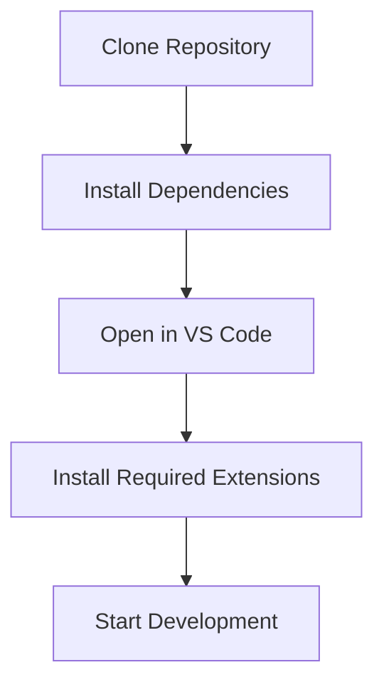
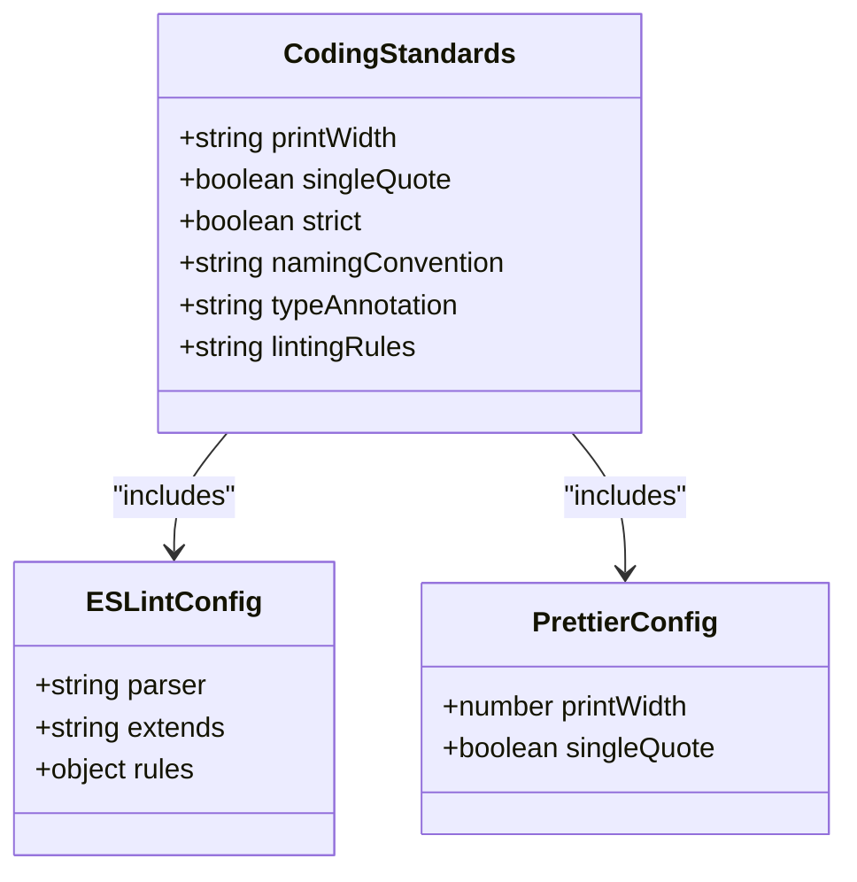
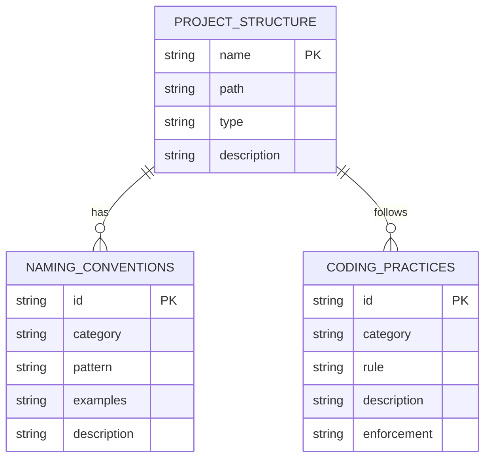
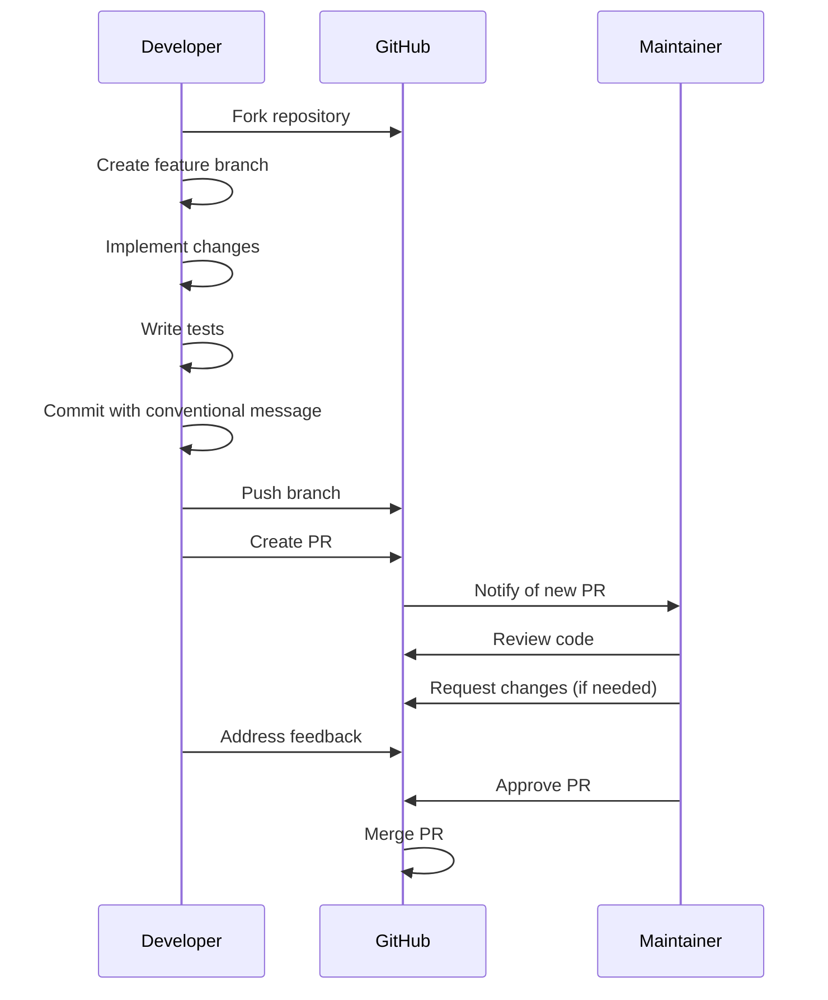
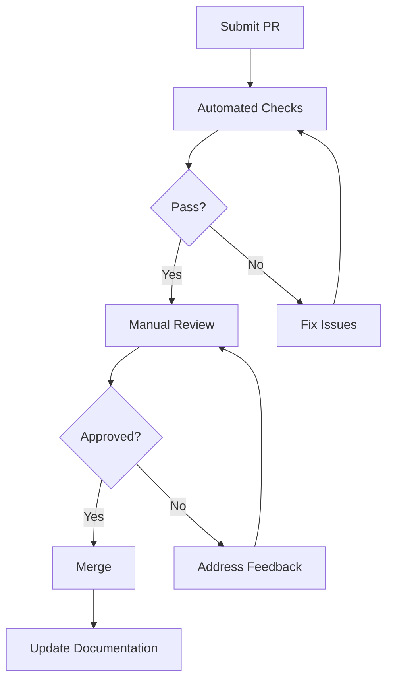
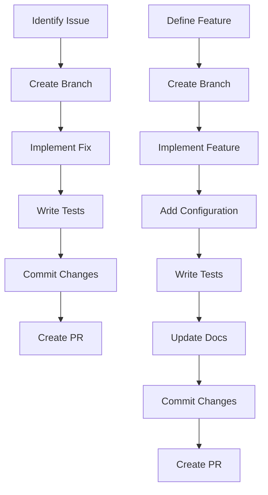
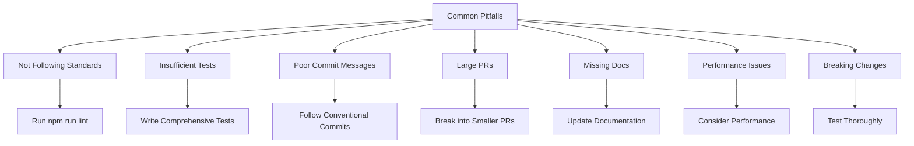

# Contribution Guidelines

<cite>
**Referenced Files in This Document**   
- [package.json](file://package.json)
- [tsconfig.json](file://tsconfig.json)
- [.prettierrc.yaml](file://.prettierrc.yaml)
- [webpack.config.js](file://webpack.config.js)
- [README.md](file://README.md)
- [docs/en/developer-guide.md](file://docs/en/developer-guide.md)
- [docs/project-structure.md](file://docs/project-structure.md)
- [src/extension.ts](file://src/extension.ts)
- [src/services/review/reviewManager.ts](file://src/services/review/reviewManager.ts)
- [src/models/baseModel.ts](file://src/models/baseModel.ts)
- [src/utils/logger.ts](file://src/utils/logger.ts)
- [src/i18n/index.ts](file://src/i18n/index.ts)
</cite>

## Table of Contents
1. [Development Environment Setup](#development-environment-setup)
2. [Coding Standards](#coding-standards)
3. [File Organization Principles](#file-organization-principles)
4. [Commit Message Conventions](#commit-message-conventions)
5. [Pull Request Workflow](#pull-request-workflow)
6. [Code Review Process](#code-review-process)
7. [Examples of Well-Structured Contributions](#examples-of-well-structured-contributions)
8. [Common Contribution Pitfalls](#common-contribution-pitfalls)

## Development Environment Setup

To set up the development environment for CodeKarmic, follow these steps:

1. Install Node.js (version 16 or higher) and npm.
2. Clone the repository: `git clone https://github.com/nesnilnehc/codekarmic.git`
3. Navigate to the project directory: `cd codekarmic`
4. Install dependencies: `npm install`
5. Open the project in VS Code.

Required VS Code extensions:
- ESLint
- Prettier - Code formatter
- TypeScript Hero
- GitLens

The project uses TypeScript as the primary language with strict type checking enabled. The `tsconfig.json` file configures the TypeScript compiler options, including target ECMAScript version, module resolution, and strict type checking.



**Diagram sources**
- [package.json](file://package.json#L282-L292)
- [tsconfig.json](file://tsconfig.json#L1-L19)

**Section sources**
- [package.json](file://package.json#L282-L292)
- [tsconfig.json](file://tsconfig.json#L1-L19)
- [README.md](file://README.md#L1-L24)

## Coding Standards

CodeKarmic enforces coding standards through ESLint and Prettier. The configuration is defined in the `package.json` and `.prettierrc.yaml` files.

ESLint rules are configured to enforce best practices and maintain code quality. The project uses `@typescript-eslint/eslint-plugin` and `@typescript-eslint/parser` for TypeScript support. Key ESLint configurations include:
- Strict type checking
- No unused variables
- Consistent code style
- Error prevention

Prettier is used for code formatting with the following configuration:
- Print width: 150 characters
- Use single quotes instead of double quotes

TypeScript style guidelines:
- Use strict mode (`"strict": true` in `tsconfig.json`)
- Avoid using `any` type; prefer explicit type annotations
- Use interfaces to define object shapes
- Use enums for fixed sets of values
- Follow naming conventions:
  - Classes and interfaces: PascalCase
  - Variables and functions: camelCase
  - Constants: UPPER_CASE
  - Files: camelCase for TypeScript files, kebab-case for documentation



**Diagram sources**
- [package.json](file://package.json#L297-L305)
- [.prettierrc.yaml](file://.prettierrc.yaml#L1-L5)
- [tsconfig.json](file://tsconfig.json#L1-L19)

**Section sources**
- [package.json](file://package.json#L297-L305)
- [.prettierrc.yaml](file://.prettierrc.yaml#L1-L5)
- [tsconfig.json](file://tsconfig.json#L1-L19)

## File Organization Principles

The project follows a modular structure with clear separation of concerns. The directory structure is organized as follows:

- `src/`: Contains all source code
  - `config/`: Configuration-related code
  - `core/`: Core functionality modules
  - `i18n/`: Internationalization resources
  - `models/`: Data model definitions
  - `services/`: Service layer (API calls, etc.)
  - `ui/`: User interface components
  - `utils/`: Utility functions
- `docs/`: Project documentation in multiple languages
- `dist/`: Compiled distribution files
- `node_modules/`: npm dependencies

Naming conventions:
- Folders: camelCase (e.g., `codeReview`, `fileUtils`)
- TypeScript/JavaScript files: camelCase (e.g., `gitService.ts`, `fileUtils.ts`)
- Entry files: lowercase (e.g., `extension.ts`, `index.ts`)
- Resource files: kebab-case (e.g., `icon-dark.svg`)
- Documentation files: kebab-case (e.g., `project-structure.md`)

Code organization best practices:
- Each file should implement a single responsibility
- Related functionality should be grouped in the same directory
- Use interfaces to define data structures
- Implement error handling consistently
- Write descriptive comments for complex logic
- Use JSDoc-style comments for classes and interfaces



**Diagram sources**
- [docs/project-structure.md](file://docs/project-structure.md#L1-L123)
- [src/extension.ts](file://src/extension.ts#L1-L920)

**Section sources**
- [docs/project-structure.md](file://docs/project-structure.md#L1-L123)
- [src/extension.ts](file://src/extension.ts#L1-L920)

## Commit Message Conventions

CodeKarmic follows conventional commit message guidelines to ensure clear and consistent commit history. Commit messages should follow this format:

```
<type>(<scope>): <subject>
<BLANK LINE>
<body>
<BLANK LINE>
<footer>
```

Allowed types:
- `feat`: A new feature
- `fix`: A bug fix
- `docs`: Documentation changes
- `style`: Code formatting changes (white-space, formatting, etc.)
- `refactor`: Code changes that neither fix a bug nor add a feature
- `perf`: Code changes that improve performance
- `test`: Adding missing tests or correcting existing tests
- `build`: Changes that affect the build system or external dependencies
- `ci`: Changes to CI configuration files and scripts
- `chore`: Other changes that don't modify src or test files

Scope should be a noun indicating the affected component (e.g., `ui`, `core`, `config`, `services`).

Example commit messages:
- `feat(ui): add commit filtering by date range`
- `fix(services): handle API key validation errors`
- `docs: update developer guide with new contribution guidelines`
- `refactor(core): simplify code review report generation`

The body should provide additional context about the change, including motivation and implementation details. The footer should reference any related issues or pull requests.

**Section sources**
- [docs/project-structure.md](file://docs/project-structure.md#L114-L117)
- [CHANGELOG.md](file://CHANGELOG.md)

## Pull Request Workflow

The pull request workflow for CodeKarmic follows these steps:

1. Fork the repository
2. Create a feature branch from the main branch
3. Make your changes following the coding standards
4. Write or update tests for your changes
5. Ensure all tests pass
6. Commit your changes with proper commit messages
7. Push your branch to your fork
8. Create a pull request to the main repository

PR description requirements:
- Clear title summarizing the change
- Detailed description of what was changed and why
- Reference to any related issues (using `Fixes #issue-number`)
- Screenshots or examples if applicable
- Testing instructions
- Any special considerations or limitations

The PR should include:
- Code changes that follow the project's coding standards
- Appropriate tests covering the new functionality
- Updated documentation if necessary
- Properly formatted commit history



**Diagram sources**
- [docs/en/developer-guide.md](file://docs/en/developer-guide.md#L59-L65)
- [package.json](file://package.json#L282-L292)

**Section sources**
- [docs/en/developer-guide.md](file://docs/en/developer-guide.md#L59-L65)
- [package.json](file://package.json#L282-L292)

## Code Review Process

The code review process for contributions to CodeKarmic includes the following expectations:

1. **Code Quality**: All code must adhere to the project's coding standards enforced by ESLint and Prettier. The code should be clean, well-organized, and follow TypeScript best practices.

2. **Documentation**: Any new functionality or significant changes should be documented in the appropriate documentation files. This includes updating the developer guide, user guide, or other relevant documentation.

3. **Test Coverage**: All contributions must include appropriate tests. For new features, both unit tests and integration tests should be provided. The test coverage should be sufficient to verify the correctness of the implementation.

4. **Functionality**: The code should work as intended and not introduce regressions. It should handle edge cases and error conditions appropriately.

5. **Performance**: The implementation should be efficient and not introduce performance bottlenecks.

6. **Security**: The code should not introduce security vulnerabilities.

7. **Compatibility**: Changes should maintain backward compatibility when possible.

The review process typically involves:
- Automated checks (linting, formatting, tests)
- Manual code review by maintainers
- Feedback and iteration
- Final approval and merge



**Diagram sources**
- [docs/en/developer-guide.md](file://docs/en/developer-guide.md#L59-L65)
- [package.json](file://package.json#L290-L291)

**Section sources**
- [docs/en/developer-guide.md](file://docs/en/developer-guide.md#L59-L65)
- [package.json](file://package.json#L290-L291)

## Examples of Well-Structured Contributions

### Adding a New Feature

When adding a new feature, follow these steps:

1. Create a new branch: `git checkout -b feat/new-feature`
2. Implement the feature in the appropriate module
3. Add necessary configuration options in `package.json` under `contributes.configuration`
4. Implement the feature with proper error handling
5. Write unit tests for the new functionality
6. Update documentation in `docs/en/developer-guide.md` and `docs/en/user-guide.md`
7. Commit with message: `feat(module): add new feature description`
8. Create a pull request with detailed description

Example: Adding a new AI model support
- Update `src/models/` with new model adapter
- Add configuration option in `package.json`
- Implement model-specific logic in `src/services/ai/`
- Add tests in corresponding test files
- Update documentation with usage instructions

### Fixing a Bug

When fixing a bug, follow these steps:

1. Create a new branch: `git checkout -b fix/issue-description`
2. Identify and reproduce the issue
3. Implement the fix with minimal changes
4. Add or update tests to cover the fixed behavior
5. Verify the fix resolves the issue without introducing new problems
6. Commit with message: `fix(module): description of fixed issue`
7. Reference the issue in the commit message: `Fixes #issue-number`
8. Create a pull request with explanation of the problem and solution

Example: Fixing a null reference in review manager
- Locate the source of the null reference in `src/services/review/reviewManager.ts`
- Add null checks and proper error handling
- Update tests to verify the fix
- Commit with message: `fix(review): handle null commit in selectCommit`
- Reference the issue: `Fixes #123`



**Diagram sources**
- [src/services/review/reviewManager.ts](file://src/services/review/reviewManager.ts#L1-L854)
- [package.json](file://package.json#L118-L208)

**Section sources**
- [src/services/review/reviewManager.ts](file://src/services/review/reviewManager.ts#L1-L854)
- [package.json](file://package.json#L118-L208)

## Common Contribution Pitfalls

### 1. Not Following Coding Standards

**Problem**: Code that doesn't adhere to ESLint and Prettier rules.

**Solution**: Run `npm run lint` before committing to ensure code meets standards. Configure your editor to show ESLint warnings and format code with Prettier on save.

### 2. Insufficient Test Coverage

**Problem**: New features or bug fixes without adequate tests.

**Solution**: Write tests that cover both normal operation and edge cases. Use the existing test structure as a guide. Run `npm test` to verify all tests pass.

### 3. Poor Commit Messages

**Problem**: Vague or inconsistent commit messages.

**Solution**: Follow the conventional commit format. Be specific about what changed and why. Reference related issues when applicable.

### 4. Large, Monolithic Pull Requests

**Problem**: PRs that try to do too much at once.

**Solution**: Break changes into smaller, focused PRs. Each PR should address a single concern. This makes review easier and reduces the chance of conflicts.

### 5. Not Updating Documentation

**Problem**: New features or changes not reflected in documentation.

**Solution**: Update relevant documentation files when making changes. This includes user guides, developer guides, and README files.

### 6. Ignoring Performance Implications

**Problem**: Code that works but has poor performance characteristics.

**Solution**: Consider the performance impact of your changes. Avoid unnecessary computations or I/O operations. Use the project's logging to monitor performance.

### 7. Breaking Existing Functionality

**Problem**: Changes that break existing features.

**Solution**: Run the full test suite before submitting a PR. Test manually if necessary. Consider the impact of your changes on other parts of the system.



**Diagram sources**
- [package.json](file://package.json#L290-L291)
- [docs/en/developer-guide.md](file://docs/en/developer-guide.md#L46-L57)

**Section sources**
- [package.json](file://package.json#L290-L291)
- [docs/en/developer-guide.md](file://docs/en/developer-guide.md#L46-L57)