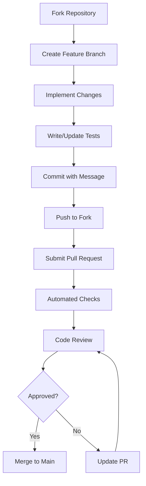
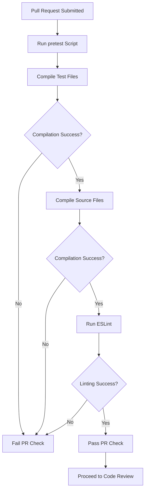
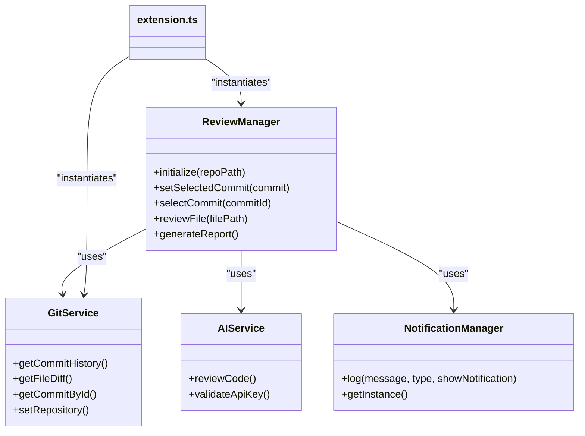

# Pull Request Workflow

<cite>
**Referenced Files in This Document**   
- [package.json](file://package.json)
- [docs/en/developer-guide.md](file://docs/en/developer-guide.md)
- [docs/zh-CN/guide/code-review-rules.md](file://docs/zh-CN/guide/code-review-rules.md)
- [src/services/review/reviewManager.ts](file://src/services/review/reviewManager.ts)
- [src/utils/fileUtils.ts](file://src/utils/fileUtils.ts)
- [src/extension.ts](file://src/extension.ts)
- [.prettierrc.yaml](file://.prettierrc.yaml)
- [.markdownlint.yaml](file://.markdownlint.yaml)
</cite>

## Table of Contents
1. [Introduction](#introduction)
2. [Pull Request Submission Process](#pull-request-submission-process)
3. [PR Title and Description Guidelines](#pr-title-and-description-guidelines)
4. [Required Pre-Merge Checks](#required-pre-merge-checks)
5. [Code Review Evaluation Criteria](#code-review-evaluation-criteria)
6. [Contribution Checklist](#contribution-checklist)
7. [Best Practices for PR Updates](#best-practices-for-pr-updates)

## Introduction
This document outlines the complete pull request (PR) workflow for the CodeKarmic project, detailing the end-to-end process from forking the repository to merging approved changes. The workflow ensures code quality, maintainability, and consistency across contributions. The process includes specific requirements for PR formatting, automated checks, code review standards, and contributor best practices.

**Section sources**
- [docs/en/developer-guide.md](file://docs/en/developer-guide.md#L61-L65)

## Pull Request Submission Process
The pull request submission process follows a standardized workflow to ensure proper code integration:

1. **Fork the Repository**: Create a personal fork of the CodeKarmic repository from https://github.com/nesnilnehc/codekarmic
2. **Create Feature Branch**: Based on the main branch, create a descriptive feature branch (e.g., `feature/ai-model-integration` or `bugfix/git-service-error`)
3. **Implement Changes**: Make necessary code modifications following the project's coding standards and architecture patterns
4. **Write or Update Tests**: Ensure all new functionality is covered by appropriate tests and existing tests are updated for modified functionality
5. **Commit Changes**: Use descriptive commit messages that explain the purpose and impact of changes
6. **Push to Fork**: Push the feature branch to your forked repository
7. **Submit Pull Request**: Create a pull request from your feature branch to the main branch of the original repository

The system architecture supports this workflow through its modular design, with clear separation between UI components, AI services, and Git operations.



**Diagram sources**
- [docs/en/developer-guide.md](file://docs/en/developer-guide.md#L5-L12)
- [docs/en/developer-guide.md](file://docs/en/developer-guide.md#L61-L65)

**Section sources**
- [docs/en/developer-guide.md](file://docs/en/developer-guide.md#L61-L65)

## PR Title and Description Guidelines
Pull requests must follow specific formatting guidelines to ensure clarity and traceability:

### PR Title Requirements
- Use clear, descriptive titles that summarize the change
- Prefix with type: `feat:`, `fix:`, `docs:`, `style:`, `refactor:`, `test:`, or `chore:`
- Keep titles under 72 characters when possible
- Example: `feat: add support for custom review templates`

### PR Description Requirements
- Include a detailed description of the changes made
- Explain the motivation and context for the changes
- Reference related issues using `#issue-number` syntax
- Document any breaking changes or migration steps
- Include screenshots or examples for UI changes when applicable

### Linked Issues
- All PRs should be linked to existing issues when possible
- Use keywords like "Closes #123" or "Fixes #456" in the description to automatically close issues upon merge
- For new features, ensure a corresponding feature request issue exists
- For bug fixes, link to the reported bug issue

**Section sources**
- [docs/zh-CN/guide/code-review-rules.md](file://docs/zh-CN/guide/code-review-rules.md#L101-L105)

## Required Pre-Merge Checks
All pull requests trigger automated checks through the pretest script defined in package.json. These checks must pass before a PR can be merged.

### Pretest Script Execution
The `pretest` script in package.json runs the following sequence:
```json
"pretest": "npm run compile-tests && npm run compile && npm run lint"
```

This script executes three critical validation steps:

1. **Test Compilation**: `npm run compile-tests` compiles all test files to ensure they are syntactically correct
2. **Source Compilation**: `npm run compile` compiles the TypeScript source code using Webpack
3. **Linting**: `npm run lint` runs ESLint on all TypeScript files in the src directory

### Build Requirements
- The project uses TypeScript with strict mode enabled
- Configuration is defined in tsconfig.json with strict type checking
- Source files must compile without errors
- The build process uses Webpack to bundle the extension

### Linting Standards
- Code formatting follows Prettier rules defined in .prettierrc.yaml
- Print width is set to 150 characters
- Single quotes are used for strings
- ESLint with TypeScript plugin enforces code quality rules
- Markdown files are linted according to .markdownlint.yaml configuration

### Testing Requirements
- All code changes must be accompanied by appropriate tests
- Unit tests use Jest framework
- Test files are compiled and validated during the pretest phase
- While test execution (`npm test`) is not part of pretest, all tests must pass before merging



**Diagram sources**
- [package.json](file://package.json#L289-L291)
- [.prettierrc.yaml](file://.prettierrc.yaml)
- [.markdownlint.yaml](file://.markdownlint.yaml)

**Section sources**
- [package.json](file://package.json#L289-L291)

## Code Review Evaluation Criteria
Reviewers evaluate pull requests based on several key criteria to ensure code quality and project consistency.

### Code Quality Assessment
Reviewers examine the code for:
- Adherence to TypeScript best practices
- Proper error handling and edge case management
- Efficient algorithms and data structures
- Appropriate use of async/await patterns
- Memory efficiency and resource management

The code should follow the single responsibility principle, with functions and classes having clear, focused purposes.

### Documentation Updates
All changes must be accompanied by appropriate documentation updates:
- Update relevant sections in developer-guide.md for new features or architectural changes
- Modify user-guide.md for user-facing changes
- Update inline comments for complex logic or algorithms
- Ensure JSDoc comments are accurate for public APIs
- Update configuration documentation for new settings

### Test Coverage Requirements
Reviewers verify that:
- New functionality is covered by unit tests
- Modified functionality has updated tests
- Edge cases and error conditions are tested
- Test names are descriptive and meaningful
- Tests are independent and repeatable

While specific coverage percentages are not enforced in the current configuration, reviewers ensure that critical functionality has adequate test coverage.

### Architecture and Design
Reviewers assess whether the changes align with the project's architecture:
- Proper separation of concerns between components
- Appropriate use of existing services and utilities
- Consistent with the overall design patterns
- Minimal impact on performance
- Proper integration with the extension lifecycle



**Diagram sources**
- [src/services/review/reviewManager.ts](file://src/services/review/reviewManager.ts#L79-L345)
- [src/extension.ts](file://src/extension.ts#L68-L97)

**Section sources**
- [docs/zh-CN/guide/code-review-rules.md](file://docs/zh-CN/guide/code-review-rules.md#L1-L109)

## Contribution Checklist
Contributors should verify the following items before submitting a pull request:

### Code Requirements
- [ ] Code follows TypeScript strict mode guidelines
- [ ] Proper naming conventions (PascalCase for classes, camelCase for variables/functions)
- [ ] Functions have single responsibility and reasonable length
- [ ] Complex logic is properly commented
- [ ] No hardcoded sensitive information
- [ ] Input validation is implemented where appropriate

### Testing Requirements
- [ ] New functionality is covered by unit tests
- [ ] Modified functionality has updated tests
- [ ] Tests cover both success and error cases
- [ ] Test files compile without errors
- [ ] No skipped or disabled tests

### Documentation Requirements
- [ ] PR title follows conventional commit format
- [ ] PR description includes purpose and context
- [ ] Related issues are linked in the description
- [ ] User documentation updated for user-facing changes
- [ ] Developer documentation updated for architectural changes
- [ ] Inline comments added for complex logic

### Technical Requirements
- [ ] Code compiles without errors (`npm run compile`)
- [ ] Tests compile without errors (`npm run compile-tests`)
- [ ] Code passes linting rules (`npm run lint`)
- [ ] No merge conflicts with main branch
- [ ] All pretest checks pass locally

**Section sources**
- [docs/zh-CN/guide/code-review-rules.md](file://docs/zh-CN/guide/code-review-rules.md)
- [package.json](file://package.json#L289-L291)

## Best Practices for PR Updates
When responding to feedback or updating pull requests, contributors should follow these best practices:

### Incremental Updates
- Make focused, incremental changes in response to review feedback
- Avoid large, sweeping changes after initial review
- Address one review comment or issue at a time when possible
- Push updates regularly rather than waiting to fix everything at once

### Clear Commit Messages
- Use descriptive commit messages that explain what was changed and why
- Reference the specific review feedback being addressed
- Example: `fix: address review feedback on error handling in reviewManager`

### Communication
- Respond to all review comments, even if just to acknowledge them
- Ask clarifying questions if feedback is unclear
- Explain design decisions when appropriate
- Use GitHub's "Resolve conversation" feature after addressing comments

### Rebase vs. Merge
- Keep the PR history clean by rebasing on main when necessary
- Avoid merge commits in PR branches
- Use `git rebase main` to incorporate upstream changes
- Force push only when necessary and communicate this to reviewers

### Final Verification
Before marking a PR as ready for another review:
- Verify all requested changes have been addressed
- Ensure all automated checks are passing
- Test the changes thoroughly
- Update the PR description if significant changes were made

Following these practices ensures a smooth review process and increases the likelihood of timely PR approval and merging.

**Section sources**
- [docs/en/developer-guide.md](file://docs/en/developer-guide.md)
- [docs/zh-CN/guide/code-review-rules.md](file://docs/zh-CN/guide/code-review-rules.md)