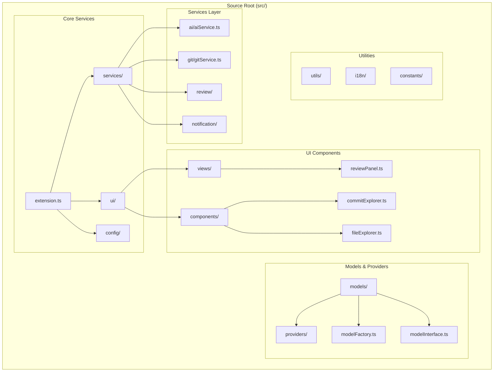
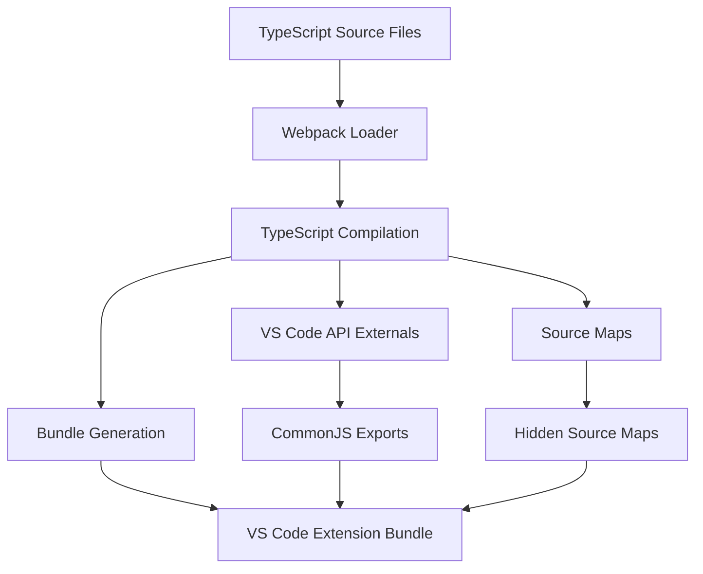
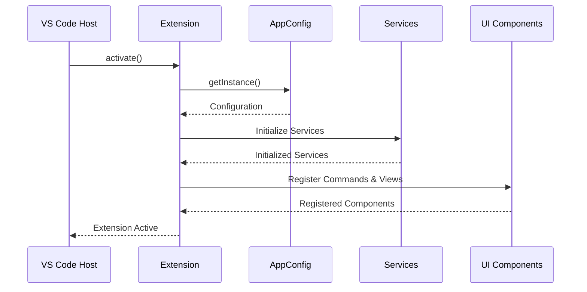
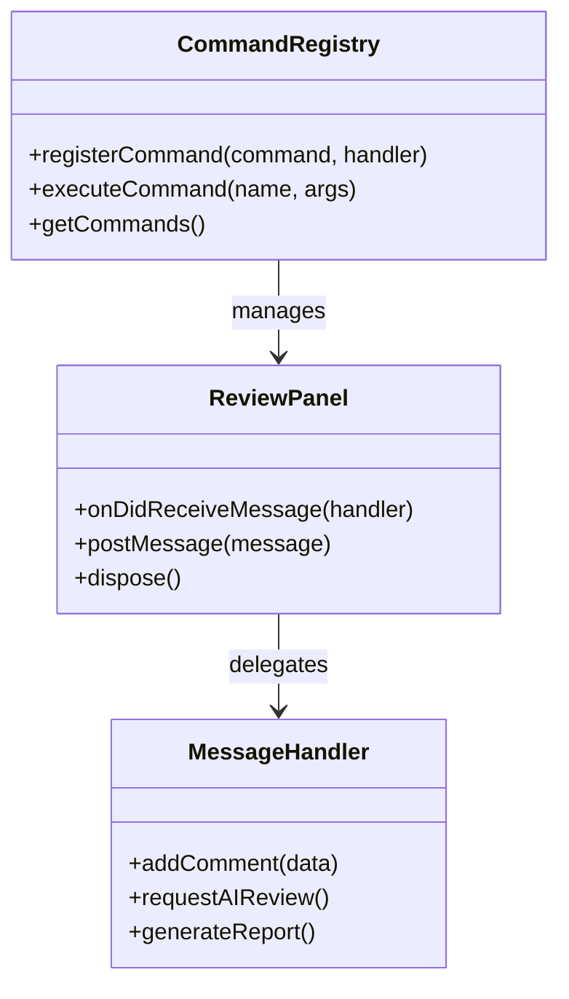
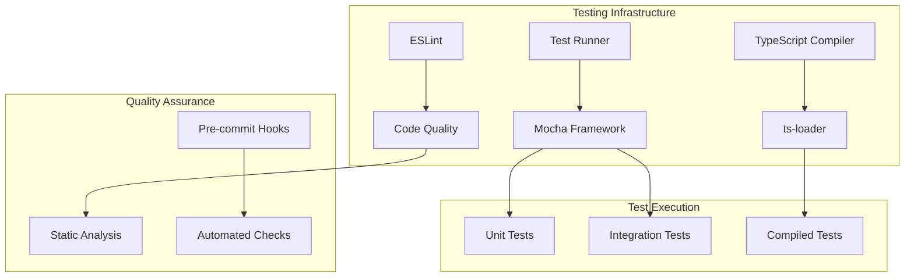
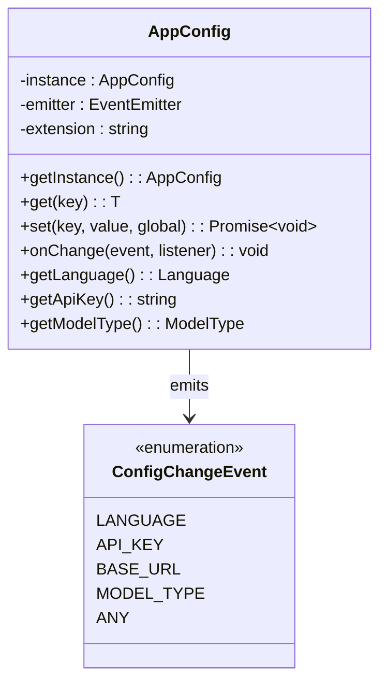
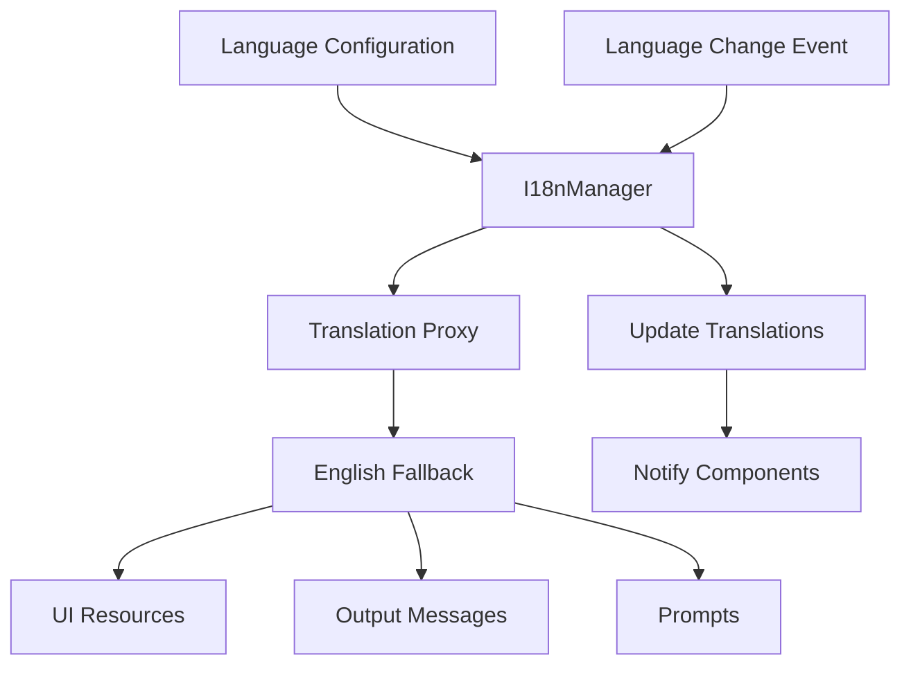
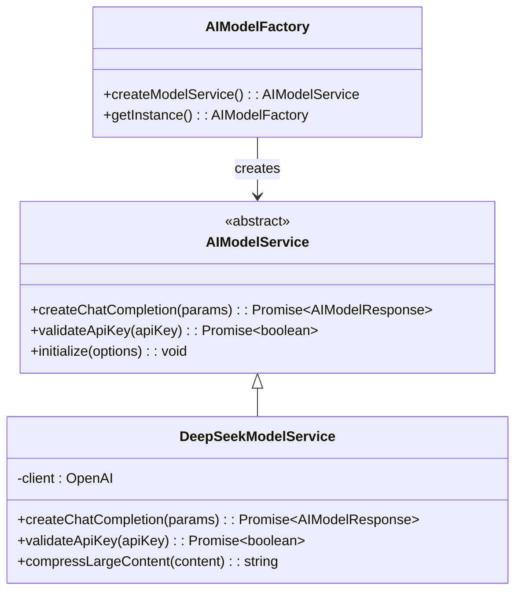
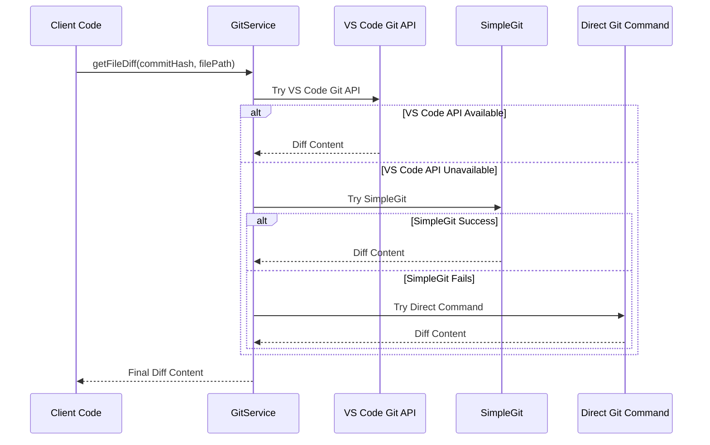
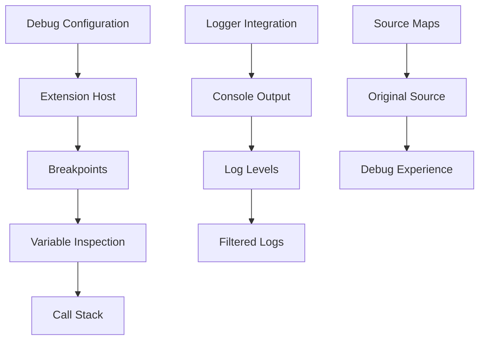

# Developer Guide

<cite>
**Referenced Files in This Document**
- [package.json](file://package.json)
- [webpack.config.js](file://webpack.config.js)
- [tsconfig.json](file://tsconfig.json)
- [src/extension.ts](file://src/extension.ts)
- [src/services/ai/aiService.ts](file://src/services/ai/aiService.ts)
- [src/ui/views/reviewPanel.ts](file://src/ui/views/reviewPanel.ts)
- [src/services/git/gitService.ts](file://src/services/git/gitService.ts)
- [src/models/providers/deepseek.ts](file://src/models/providers/deepseek.ts)
- [src/config/appConfig.ts](file://src/config/appConfig.ts)
- [src/utils/logger.ts](file://src/utils/logger.ts)
- [src/services/notification/notificationManager.ts](file://src/services/notification/notificationManager.ts)
- [src/i18n/index.ts](file://src/i18n/index.ts)
- [src/constants/constants.ts](file://src/constants/constants.ts)
- [src/models/types.ts](file://src/models/types.ts)
</cite>

## Table of Contents
1. [Introduction](#introduction)
2. [Development Environment Setup](#development-environment-setup)
3. [Project Structure](#project-structure)
4. [Build System and Webpack Configuration](#build-system-and-webpack-configuration)
5. [Extension Lifecycle Management](#extension-lifecycle-management)
6. [Command Registration and Webview Messaging](#command-registration-and-webview-messaging)
7. [Testing Strategy](#testing-strategy)
8. [Configuration Management](#configuration-management)
9. [Internationalization System](#internationalization-system)
10. [AI Model Integration](#ai-model-integration)
11. [Git Service Architecture](#git-service-architecture)
12. [Extension Contribution Guidelines](#extension-contribution-guidelines)
13. [Best Practices](#best-practices)
14. [Extending Functionality](#extending-functionality)
15. [Debugging and Development Tools](#debugging-and-development-tools)

## Introduction

CodeKarmic is an AI-powered code review extension for Visual Studio Code that provides intelligent code analysis and suggestions. This developer guide covers the complete development workflow, from setting up the development environment to extending the core functionality with new AI providers or UI components.

The extension follows modern TypeScript patterns with a modular architecture that separates concerns across services, UI components, and configuration management. It integrates with VS Code's extension API while providing a rich webview-based user interface for code review sessions.

## Development Environment Setup

### Prerequisites

Before starting development, ensure you have the following installed:

- **Node.js**: Version 16.x or higher
- **Visual Studio Code**: Latest stable version
- **Git**: For version control and repository management

### Initial Setup

1. **Clone the Repository**
   ```bash
   git clone https://github.com/nesnilnehc/codekarmic.git
   cd codekarmic
   ```

2. **Install Dependencies**
   ```bash
   npm install
   ```

3. **Verify Installation**
   ```bash
   npm run compile
   ```

### Development Scripts

The project provides several npm scripts for different development tasks:

| Script | Purpose | Usage |
|--------|---------|-------|
| `npm run compile` | Compile TypeScript to JavaScript | Development builds |
| `npm run watch` | Watch for file changes and recompile | Continuous development |
| `npm run package` | Production build with optimizations | Preparing for distribution |
| `npm run lint` | Run ESLint for code quality checks | Code validation |
| `npm run test` | Execute unit tests | Testing verification |

### VS Code Extension Host

To develop and test the extension:

1. Open the project in VS Code
2. Press `F5` to launch the Extension Development Host
3. This opens a new VS Code window with your development version loaded

**Section sources**
- [package.json](file://package.json#L282-L292)

## Project Structure

The CodeKarmic project follows a well-organized modular structure that promotes maintainability and extensibility:



**Diagram sources**
- [src/extension.ts](file://src/extension.ts#L1-L10)
- [src/services/ai/aiService.ts](file://src/services/ai/aiService.ts#L1-L20)
- [src/ui/views/reviewPanel.ts](file://src/ui/views/reviewPanel.ts#L1-L15)

### Directory Structure Breakdown

| Directory | Purpose | Key Files |
|-----------|---------|-----------|
| `src/` | Main source code | `extension.ts` (entry point) |
| `src/services/` | Business logic services | AI, Git, review, notification services |
| `src/models/` | AI model abstractions | Model interfaces, factories, providers |
| `src/ui/` | User interface components | Views, components, panels |
| `src/config/` | Configuration management | Application configuration |
| `src/utils/` | Utility functions | Logging, file operations, retries |
| `src/i18n/` | Internationalization | Multi-language support |
| `src/constants/` | Global constants | Type definitions, constants |

**Section sources**
- [src/extension.ts](file://src/extension.ts#L1-L20)

## Build System and Webpack Configuration

### Webpack Configuration

The build system uses Webpack to bundle the TypeScript code for VS Code extension deployment. The configuration is optimized for Node.js environments with proper externalization of VS Code APIs.



**Diagram sources**
- [webpack.config.js](file://webpack.config.js#L1-L48)

### Build Pipeline

The build process consists of several stages:

1. **Compilation Stage**: TypeScript files are compiled to JavaScript
2. **Optimization Stage**: Dead code elimination and minification
3. **Packaging Stage**: Bundling with external VS Code APIs
4. **Source Map Generation**: Hidden source maps for debugging

### Source Map Configuration

The project uses hidden source maps for production builds while maintaining full debugging capabilities during development. This approach balances performance and debugging convenience.

**Section sources**
- [webpack.config.js](file://webpack.config.js#L1-L48)
- [tsconfig.json](file://tsconfig.json#L1-L19)

## Extension Lifecycle Management

### Activation Events

The extension supports multiple activation events to optimize startup performance:

| Event | Trigger | Purpose |
|-------|---------|---------|
| `onStartupFinished` | VS Code startup complete | General initialization |
| `onCommand:codekarmic.startReview` | Command execution | On-demand activation |
| `onCommand:codekarmic.reviewCode` | Code review commands | Feature-specific activation |
| `onView:commitExplorer` | View visibility | UI component activation |
| `onWebviewPanel:codeReview` | Webview creation | Interactive component activation |

### Extension Entry Point

The main entry point (`src/extension.ts`) implements a sophisticated activation pattern:



**Diagram sources**
- [src/extension.ts](file://src/extension.ts#L20-L520)

### Deactivation Handling

The extension properly handles deactivation to clean up resources and maintain VS Code performance.

**Section sources**
- [src/extension.ts](file://src/extension.ts#L20-L520)
- [package.json](file://package.json#L26-L35)

## Command Registration and Webview Messaging

### Command Architecture

The extension uses VS Code's command system for all user interactions. Commands are registered with proper metadata including icons, categories, and descriptions.



**Diagram sources**
- [src/extension.ts](file://src/extension.ts#L75-L520)
- [src/ui/views/reviewPanel.ts](file://src/ui/views/reviewPanel.ts#L46-L75)

### Webview Communication Pattern

The webview communication follows a message-passing architecture:

1. **Message Sending**: From VS Code extension to webview
2. **Message Receiving**: From webview to extension
3. **Event Handling**: Processing user interactions
4. **State Synchronization**: Maintaining UI consistency

### Command Implementation Examples

The extension demonstrates various command patterns:

- **Simple Commands**: Direct functionality execution
- **Interactive Commands**: User input collection
- **Batch Operations**: Multiple file processing
- **Context-Aware Commands**: Feature-dependent execution

**Section sources**
- [src/extension.ts](file://src/extension.ts#L75-L520)
- [src/ui/views/reviewPanel.ts](file://src/ui/views/reviewPanel.ts#L46-L75)

## Testing Strategy

### Current Testing Infrastructure

While the project doesn't currently include unit tests, the architecture supports comprehensive testing through several mechanisms:



### Testing Best Practices

1. **Service Testing**: Test individual services in isolation
2. **Integration Testing**: Verify service interactions
3. **UI Testing**: Test webview components and user interactions
4. **Configuration Testing**: Validate configuration management

### Future Testing Enhancement

The project structure supports easy integration of testing frameworks:

- **Unit Testing**: Individual function and class testing
- **Integration Testing**: Service and component interactions
- **End-to-End Testing**: Complete user workflows
- **Performance Testing**: Load and stress testing

**Section sources**
- [package.json](file://package.json#L287-L292)

## Configuration Management

### AppConfig Architecture

The configuration system provides centralized management with real-time updates and type safety:



**Diagram sources**
- [src/config/appConfig.ts](file://src/config/appConfig.ts#L49-L189)

### Configuration Features

| Feature | Description | Implementation |
|---------|-------------|----------------|
| Type Safety | Strongly typed configuration access | Generic type parameters |
| Event System | Real-time configuration updates | EventEmitter pattern |
| Default Values | Fallback values for missing settings | CONFIG_DEFAULTS constant |
| Scope Management | Global vs workspace configuration | VS Code configuration API |

### Configuration Validation

The system includes validation mechanisms to ensure configuration integrity and provide meaningful error messages.

**Section sources**
- [src/config/appConfig.ts](file://src/config/appConfig.ts#L49-L189)

## Internationalization System

### I18n Architecture

The internationalization system supports multiple languages with automatic fallbacks and dynamic language switching:



**Diagram sources**
- [src/i18n/index.ts](file://src/i18n/index.ts#L75-L188)

### Translation Management

The system provides:

- **Automatic Fallbacks**: Missing translations fall back to English
- **Dynamic Updates**: Language changes propagate instantly
- **Type Safety**: Strong typing for translation keys
- **Proxy Pattern**: Seamless fallback implementation

### Adding New Languages

To add support for a new language:

1. Create language-specific resource files
2. Update the LANGUAGE_CONFIG constant
3. Implement translation proxies
4. Add language selection options

**Section sources**
- [src/i18n/index.ts](file://src/i18n/index.ts#L75-L188)

## AI Model Integration

### Model Architecture

The AI integration follows a factory pattern with support for multiple providers:



**Diagram sources**
- [src/models/providers/deepseek.ts](file://src/models/providers/deepseek.ts#L11-L211)
- [src/models/types.ts](file://src/models/types.ts#L1-L103)

### Model Provider Features

| Feature | Implementation | Benefits |
|---------|----------------|----------|
| Compression | Large file content compression | Improved performance for big files |
| Retry Logic | Automatic retry with exponential backoff | Better reliability |
| Streaming | Real-time response streaming | Enhanced user experience |
| Validation | API key validation | Early error detection |

### Adding New AI Providers

To integrate a new AI provider:

1. Extend `AbstractAIModelService`
2. Implement required methods
3. Add provider to factory
4. Update configuration options
5. Add validation logic

**Section sources**
- [src/models/providers/deepseek.ts](file://src/models/providers/deepseek.ts#L11-L211)
- [src/models/types.ts](file://src/models/types.ts#L1-L103)

## Git Service Architecture

### Git Integration Design

The Git service provides robust version control integration with multiple fallback strategies:



**Diagram sources**
- [src/services/git/gitService.ts](file://src/services/git/gitService.ts#L700-L800)

### Git Service Capabilities

| Capability | Implementation | Strategy |
|------------|----------------|----------|
| Commit History | Multiple retrieval methods | Fallback chain |
| File Differences | VS Code API + Direct commands | Performance optimization |
| Branch Management | SimpleGit + Direct commands | Reliability |
| Content Retrieval | Cached + Lazy loading | Efficiency |

### Error Handling Strategy

The Git service implements comprehensive error handling with graceful degradation:

1. **Primary Method**: Fastest available method
2. **Secondary Method**: Alternative implementation
3. **Fallback Method**: Basic functionality
4. **Error Recovery**: Informative error messages

**Section sources**
- [src/services/git/gitService.ts](file://src/services/git/gitService.ts#L700-L800)

## Extension Contribution Guidelines

### Coding Standards

The project follows strict TypeScript coding standards:

| Standard | Implementation | Purpose |
|----------|----------------|---------|
| Strict Mode | `tsconfig.json` strict settings | Type safety |
| ESLint | Automated code quality checks | Consistency |
| Prettier | Code formatting | Readability |
| Import Sorting | Automated sorting | Organization |

### Commit Conventions

Follow conventional commit format:

- `feat:` New features
- `fix:` Bug fixes
- `refactor:` Code improvements
- `docs:` Documentation changes
- `test:` Test additions/changes

### Pull Request Workflow

1. **Fork and Branch**: Create feature branches
2. **Local Testing**: Ensure all tests pass
3. **Documentation**: Update relevant docs
4. **Code Review**: Submit PR for review
5. **Merge**: Integrate approved changes

### Code Review Checklist

- [ ] Code compiles without errors
- [ ] Tests pass locally
- [ ] Documentation updated
- [ ] No breaking changes
- [ ] Proper error handling

**Section sources**
- [package.json](file://package.json#L287-L292)

## Best Practices

### Type Safety

The project emphasizes strong typing throughout:

```typescript
// Example of type-safe configuration access
const apiKey: string = config.get(ConfigKey.API_KEY);
const modelType: ModelType = config.getModelType();
```

### Modular Design

Components are designed with clear separation of concerns:

- **Single Responsibility**: Each class has one primary purpose
- **Dependency Injection**: Services receive dependencies via constructors
- **Interface Segregation**: Minimal, focused interfaces
- **Open/Closed Principle**: Open for extension, closed for modification

### Performance Optimization

| Technique | Implementation | Benefit |
|-----------|----------------|---------|
| Lazy Loading | Dynamic imports for heavy modules | Faster startup |
| Caching | Diff content caching | Reduced API calls |
| Streaming | Real-time response processing | Better UX |
| Compression | Large file content compression | Memory efficiency |

### Error Handling

Implement comprehensive error handling:

- **Graceful Degradation**: Fallback to basic functionality
- **User-Friendly Messages**: Clear error descriptions
- **Logging**: Detailed error logs for debugging
- **Recovery Mechanisms**: Automatic retry logic

**Section sources**
- [src/utils/logger.ts](file://src/utils/logger.ts#L1-L88)
- [src/services/notification/notificationManager.ts](file://src/services/notification/notificationManager.ts#L1-L213)

## Extending Functionality

### Adding a New AI Provider

To add a new AI provider:

1. **Create Provider Class**
   ```typescript
   export class NewAIProviderService extends AbstractAIModelService {
       // Implement required methods
   }
   ```

2. **Update Factory**
   ```typescript
   export class AIModelFactory {
       createModelService(): AIModelService {
           // Add new provider logic
       }
   }
   ```

3. **Add Configuration**
   ```typescript
   export enum ModelType {
       NEW_PROVIDER = 'new-provider'
   }
   ```

### Creating New UI Components

For new UI components:

1. **Extend Base Classes**: Inherit from appropriate base classes
2. **Implement Interfaces**: Follow established patterns
3. **Register Components**: Add to extension.ts
4. **Handle Messages**: Implement webview communication

### Adding New Commands

To add new commands:

1. **Define Command**: Add to package.json contributes.commands
2. **Implement Handler**: Create command function
3. **Register**: Add to extension.ts command registration
4. **Test**: Verify functionality

**Section sources**
- [src/models/providers/deepseek.ts](file://src/models/providers/deepseek.ts#L11-L211)
- [src/extension.ts](file://src/extension.ts#L75-L520)

## Debugging and Development Tools

### VS Code Debugging

The project includes comprehensive debugging support:



### Development Tools

| Tool | Purpose | Configuration |
|------|---------|---------------|
| TypeScript | Type checking and compilation | `tsconfig.json` |
| ESLint | Code quality enforcement | `.eslintrc` |
| Webpack | Module bundling | `webpack.config.js` |
| VS Code Debugger | Extension debugging | `.vscode/launch.json` |

### Logging Strategy

The project implements a hierarchical logging system:

- **Global Level Control**: Configure log levels per component
- **Context-Specific Logging**: Class-based loggers
- **Structured Messages**: Consistent log formatting
- **Environment Awareness**: Different behavior in dev/prod

### Performance Monitoring

Monitor key performance metrics:

- **API Response Times**: Track AI service performance
- **Memory Usage**: Monitor extension memory consumption
- **Startup Time**: Measure activation performance
- **UI Responsiveness**: Track webview performance

**Section sources**
- [src/utils/logger.ts](file://src/utils/logger.ts#L1-L88)
- [src/services/notification/notificationManager.ts](file://src/services/notification/notificationManager.ts#L1-L213)