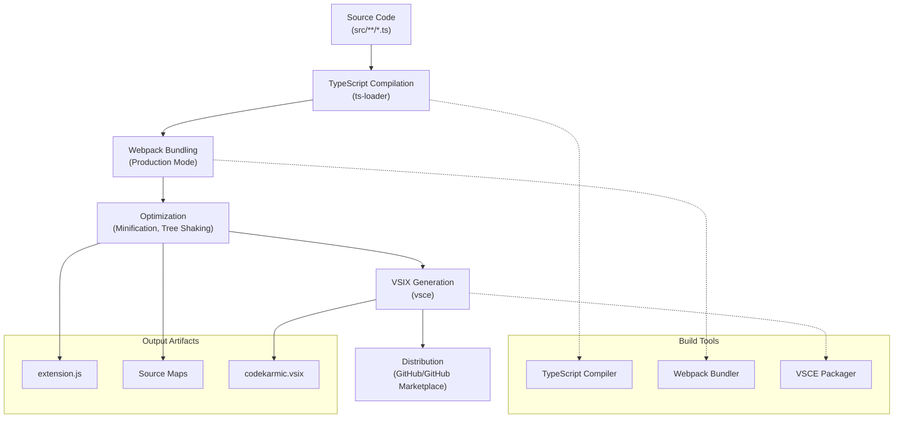
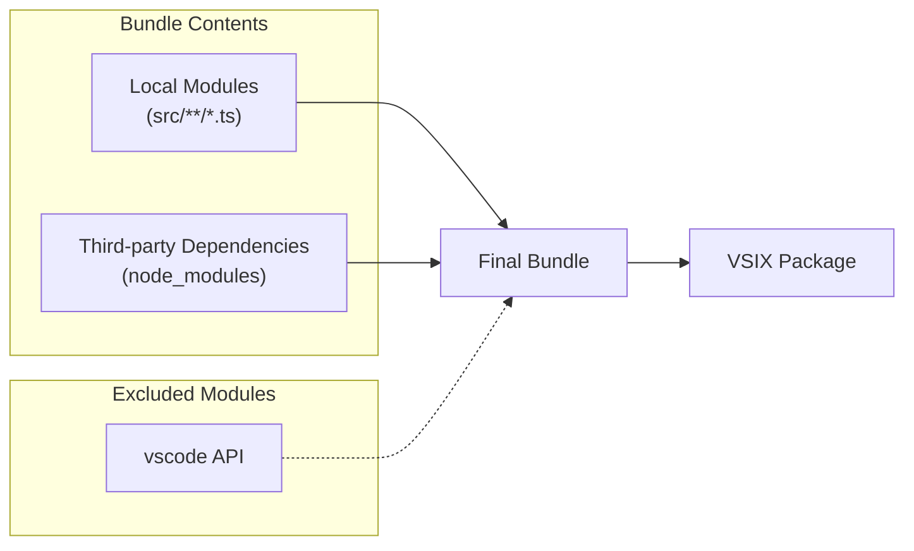

# Packaging Process

<cite>
**Referenced Files in This Document**
- [package.json](file://package.json)
- [webpack.config.js](file://webpack.config.js)
- [tsconfig.json](file://tsconfig.json)
- [src/extension.ts](file://src/extension.ts)
- [.vscodeignore](file://.vscodeignore)
- [docs/release-guide.md](file://docs/release-guide.md)
- [CHANGELOG.md](file://CHANGELOG.md)
</cite>

## Table of Contents
1. [Introduction](#introduction)
2. [Build System Architecture](#build-system-architecture)
3. [Webpack Configuration](#webpack-configuration)
4. [Package Scripts](#package-scripts)
5. [Extension Packaging Process](#extension-packaging-process)
6. [VSIX Generation](#vsix-generation)
7. [Development Workflow](#development-workflow)
8. [Troubleshooting](#troubleshooting)
9. [Performance Optimization](#performance-optimization)
10. [Best Practices](#best-practices)

## Introduction

CodeKarmic employs a sophisticated packaging system built around Webpack to transform TypeScript source code into a production-ready VS Code extension. The packaging process involves multiple stages including compilation, bundling, optimization, and VSIX generation for distribution. This comprehensive system ensures efficient development workflows while maintaining high-quality output for both internal testing and public distribution.

The packaging architecture is designed with modularity and performance in mind, utilizing modern build tools and optimization techniques to produce lightweight, efficient extensions that integrate seamlessly with the VS Code ecosystem.

## Build System Architecture

The CodeKarmic build system follows a multi-stage pipeline that transforms source code into deployable artifacts:



**Diagram sources**
- [webpack.config.js](file://webpack.config.js#L1-L47)
- [package.json](file://package.json#L282-L291)

The architecture emphasizes separation of concerns, with each stage having specific responsibilities and clear boundaries. The system supports both development and production builds, with different optimization strategies for each environment.

**Section sources**
- [webpack.config.js](file://webpack.config.js#L1-L47)
- [package.json](file://package.json#L282-L291)

## Webpack Configuration

The Webpack configuration serves as the core of CodeKarmic's build system, orchestrating the transformation of TypeScript source code into a production-ready JavaScript bundle.

### Entry Point Configuration

The build system targets the main extension entry point located at [`src/extension.ts`](file://src/extension.ts#L1-L50). This file serves as the single entry point for the entire extension, containing all necessary imports and initialization logic.

### Output Configuration

The Webpack configuration produces a single bundled file named `extension.js` located in the `dist/` directory. The output format is set to `commonjs2` to ensure compatibility with Node.js environments and VS Code's extension host.

### Target Environment

The build targets `node` environment, reflecting the fact that VS Code extensions run in a Node.js-like environment. This configuration ensures proper handling of Node.js-specific APIs and modules.

### Source Map Strategy

CodeKarmic employs hidden source maps for production builds, balancing debugging capabilities with bundle size optimization. The `hidden-source-map` strategy generates source maps that are included in the bundle but not referenced in the output, reducing the bundle size while still enabling debugging when needed.

### Module Resolution

The configuration includes sophisticated module resolution settings that prioritize local source files over node_modules, ensuring predictable import resolution and preventing conflicts between local and external dependencies.

**Section sources**
- [webpack.config.js](file://webpack.config.js#L1-L47)

## Package Scripts

The package.json defines several key scripts that orchestrate the build and packaging process:

### Production Build Script

The primary packaging script executes Webpack in production mode with optimized settings:

```bash
npm run package
```

This command performs the complete production build, including:
- TypeScript compilation with strict type checking
- JavaScript minification and optimization
- Source map generation with hidden source maps
- Bundle optimization and tree shaking

### Development Scripts

The development workflow includes several complementary scripts:

- `compile`: Executes a single Webpack build
- `watch`: Enables continuous compilation with file watching
- `compile-tests`: Compiles test files for execution
- `lint`: Performs static analysis using ESLint

### Pre-publish Hook

The `vscode:prepublish` script automatically triggers the packaging process before publishing to the marketplace, ensuring that published versions are always up-to-date and properly optimized.

**Section sources**
- [package.json](file://package.json#L282-L291)

## Extension Packaging Process

The extension packaging process involves multiple steps that transform the compiled source code into a distributable format suitable for VS Code installation.

### Compilation Pipeline

The TypeScript compilation process converts the entire codebase from TypeScript to JavaScript, applying strict type checking and emitting corresponding `.js` and `.map` files. The compilation preserves the original directory structure while organizing output files according to the configured `outDir`.

### Bundle Optimization

The Webpack bundling process consolidates all dependencies into a single bundle, eliminating the need for separate module loading during runtime. This approach reduces startup time and simplifies deployment.

### Externals Configuration

A critical aspect of the packaging process involves the externals configuration, which excludes `vscode` from the bundle. This exclusion is essential because VS Code provides the `vscode` module at runtime, and including it would create conflicts and increase bundle size unnecessarily.



**Diagram sources**
- [webpack.config.js](file://webpack.config.js#L18-L20)

**Section sources**
- [webpack.config.js](file://webpack.config.js#L18-L20)
- [src/extension.ts](file://src/extension.ts#L1-L10)

## VSIX Generation

The VSIX generation process creates the final distributable package that can be installed in VS Code. This process involves several key steps:

### Asset Collection

The packaging system automatically collects all necessary assets defined in the `.vscodeignore` file, ensuring that only relevant files are included in the final package. The ignore rules prevent development files, source maps, and temporary files from being packaged.

### Metadata Processing

The VSIX generator processes metadata from package.json to create the extension manifest, including:
- Extension identification and versioning
- Activation events and contribution points
- API dependencies and capabilities
- Localization resources

### Compression and Signing

The VSIX package undergoes compression to reduce file size while maintaining integrity. The package may also undergo digital signing for security verification, though this depends on the publishing platform's requirements.

### Distribution Formats

The system supports multiple distribution formats:
- VSIX packages for direct installation
- GitHub releases with automated asset uploads
- VS Code Marketplace publication

**Section sources**
- [.vscodeignore](file://.vscodeignore#L1-L37)
- [package.json](file://package.json#L1-L311)

## Development Workflow

The development workflow integrates seamlessly with the packaging system, providing developers with efficient tools for iterative development and testing.

### Continuous Integration

The development environment supports continuous integration through watch mode, which automatically rebuilds the extension when source files change. This enables rapid iteration during development.

### Testing Integration

The build system includes comprehensive testing support, with separate compilation for test files and integration with the test runner framework. This ensures that changes are validated before packaging.

### Quality Assurance

Static analysis tools integrated into the build process help maintain code quality through:
- TypeScript type checking
- ESLint rule enforcement
- Import order validation

**Section sources**
- [package.json](file://package.json#L282-L291)

## Troubleshooting

Common packaging issues and their solutions:

### Missing Dependencies

**Problem**: Build fails due to missing dependencies
**Solution**: Ensure all dependencies are installed using `npm install` and verify that `node_modules` contains all required packages.

### Incorrect File Paths

**Problem**: Webpack cannot locate source files
**Solution**: Verify that file paths in webpack.config.js match the actual project structure and that the entry point is correctly specified.

### Webpack Configuration Errors

**Problem**: Build fails with Webpack configuration errors
**Solution**: Validate the webpack.config.js syntax and ensure all required plugins and loaders are properly configured.

### Bundle Size Issues

**Problem**: Generated bundle is larger than expected
**Solution**: Review the externals configuration to ensure unnecessary modules aren't being bundled, and optimize import statements to reduce duplication.

### Source Map Problems

**Problem**: Source maps don't work correctly in development
**Solution**: Verify that the devtool configuration matches the intended debugging strategy and that source maps are properly referenced.

**Section sources**
- [webpack.config.js](file://webpack.config.js#L1-L47)
- [docs/release-guide.md](file://docs/release-guide.md#L154-L174)

## Performance Optimization

The packaging system incorporates several performance optimization strategies:

### Bundle Size Optimization

- Tree shaking eliminates unused code
- Minification reduces file sizes
- Strategic externals configuration prevents duplication
- Code splitting for dynamic imports

### Build Performance

- Incremental compilation for faster rebuilds
- Parallel processing of independent tasks
- Caching of intermediate results
- Efficient file watching during development

### Runtime Performance

- Single bundle reduces loading overhead
- Optimized module resolution
- Minimal external dependencies
- Efficient activation patterns

**Section sources**
- [webpack.config.js](file://webpack.config.js#L15-L17)

## Best Practices

### Development Guidelines

1. **Modular Architecture**: Structure code into small, focused modules that can be efficiently bundled
2. **Import Optimization**: Use specific imports rather than importing entire modules
3. **Dependency Management**: Regularly audit dependencies for size and necessity
4. **Testing Integration**: Include comprehensive tests in the build pipeline

### Packaging Standards

1. **Version Management**: Follow semantic versioning principles
2. **Change Documentation**: Maintain detailed changelog entries
3. **Asset Organization**: Keep assets organized and minimize unnecessary files
4. **Compatibility Testing**: Test across different VS Code versions

### Distribution Strategy

1. **Incremental Releases**: Use pre-releases for internal testing before public distribution
2. **Quality Gates**: Implement automated checks before packaging
3. **Documentation Updates**: Ensure documentation reflects current functionality
4. **Monitoring**: Track installation metrics and user feedback

**Section sources**
- [docs/release-guide.md](file://docs/release-guide.md#L1-L204)
- [CHANGELOG.md](file://CHANGELOG.md#L1-L92)