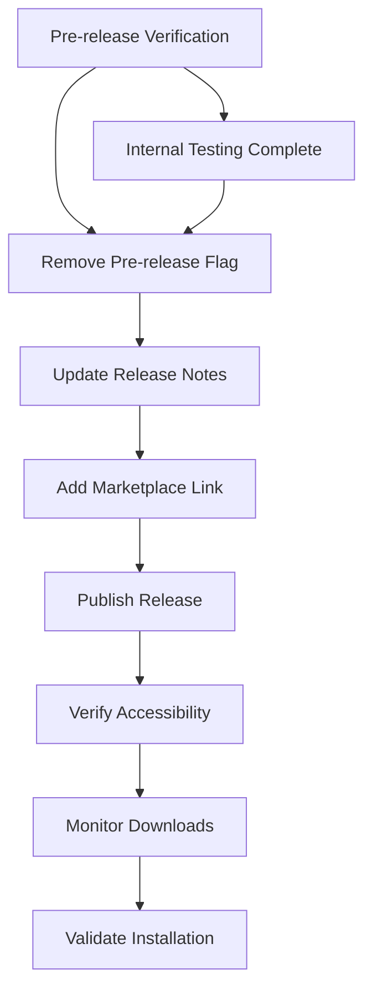
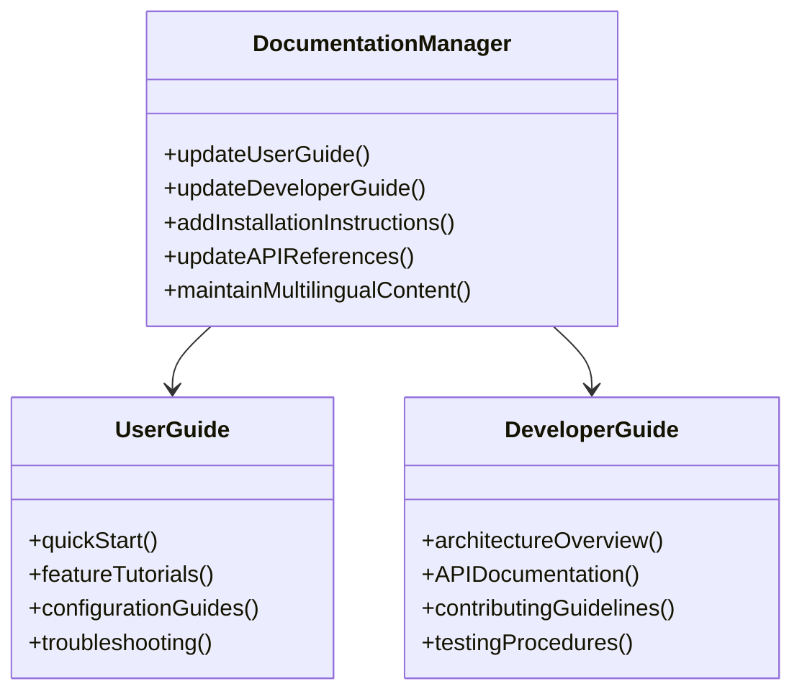
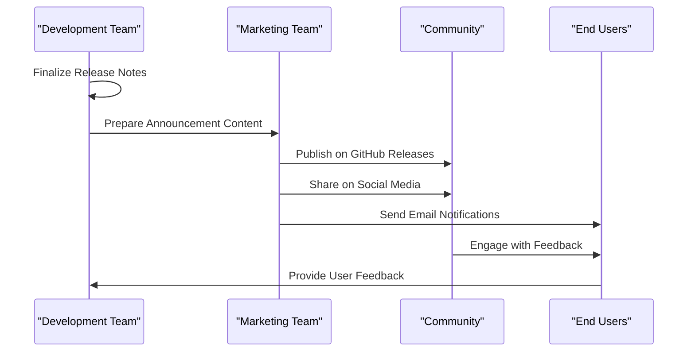
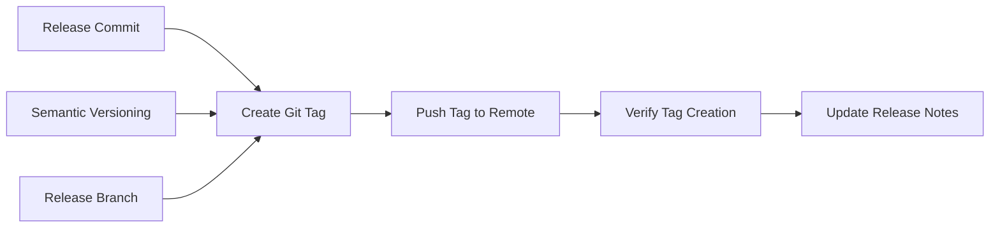
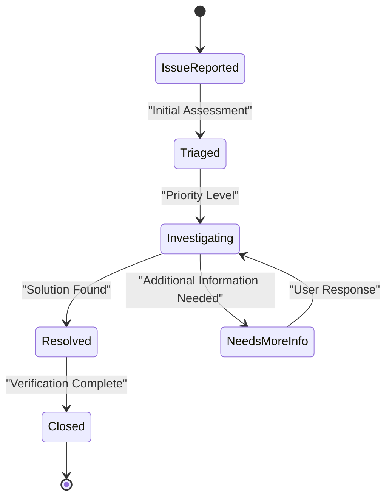
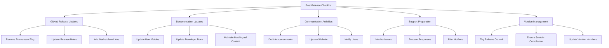

# Post-Release Activities

<cite>
**Referenced Files in This Document**
- [docs/release-guide.md](file://docs/release-guide.md)
- [package.json](file://package.json)
- [README.md](file://README.md)
- [CHANGELOG.md](file://CHANGELOG.md)
- [src/services/notification/notificationManager.ts](file://src/services/notification/notificationManager.ts)
- [src/services/git/gitService.ts](file://src/services/git/gitService.ts)
- [src/services/review/reviewManager.ts](file://src/services/review/reviewManager.ts)
- [src/services/git/versionControlTypes.ts](file://src/services/git/versionControlTypes.ts)
- [docs/en/user-guide.md](file://docs/en/user-guide.md)
- [docs/en/developer-guide.md](file://docs/en/developer-guide.md)
- [docs/project-structure.md](file://docs/project-structure.md)
</cite>

## Table of Contents
1. [Introduction](#introduction)
2. [Transitioning from Pre-release to Full Release](#transitioning-from-pre-release-to-full-release)
3. [Documentation Maintenance](#documentation-maintenance)
4. [Communication Activities](#communication-activities)
5. [Version Management Practices](#version-management-practices)
6. [Support Readiness](#support-readiness)
7. [Changelog Maintenance](#changelog-maintenance)
8. [Post-Release Checklist](#post-release-checklist)
9. [Best Practices and Recommendations](#best-practices-and-recommendations)

## Introduction

Post-release activities are critical for ensuring the successful adoption and long-term maintenance of a software release. This comprehensive guide outlines the essential steps to follow after publishing a CodeKarmic extension release, covering everything from updating release metadata to preparing for ongoing support and community engagement.

The post-release phase encompasses several key areas: transitioning GitHub pre-releases to full releases, maintaining and updating documentation, communicating with users and stakeholders, managing version control systems, and establishing support readiness. Each of these areas requires careful attention to detail and systematic execution to ensure a smooth transition from development to production deployment.

## Transitioning from Pre-release to Full Release

### Removing the Pre-release Flag

The transition from a GitHub pre-release to a full release involves several critical steps that ensure proper visibility and accessibility for end users.



**Diagram sources**
- [docs/release-guide.md](file://docs/release-guide.md#L136-L141)

The process begins with verifying that internal testing has been completed successfully. Once testing confirms the release meets quality standards, the pre-release flag must be removed using the GitHub CLI:

```bash
gh release edit v0.2.0 --prerelease=false
```

This command transforms the pre-release into a publicly accessible release, making it discoverable through standard distribution channels.

### Updating Release Notes with Marketplace Links

Release notes serve as the primary communication vehicle between developers and users. They must be updated to include direct links to the VS Code Marketplace for easy installation access.

**Section sources**
- [docs/release-guide.md](file://docs/release-guide.md#L136-L141)

The updated release notes should include:
- Direct link to the VS Code Marketplace listing
- Installation instructions for different platforms
- Quick start guide for new users
- Known issues and limitations (if applicable)

### GitHub Release Metadata Updates

Beyond removing the pre-release flag, several other metadata updates are essential:

1. **Title Enhancement**: Ensure the release title clearly identifies the version and provides context
2. **Description Updates**: Update the release description to reflect the final state of the release
3. **Asset Management**: Verify all required assets (VSIX files, documentation) are properly attached
4. **Tag Creation**: Ensure the release tag is properly created and associated with the correct commit

## Documentation Maintenance

### Updating User Guides

User documentation must be updated to reflect new features, changes, and enhancements introduced in the latest release. This ensures users can effectively utilize the updated functionality.



**Diagram sources**
- [docs/en/user-guide.md](file://docs/en/user-guide.md#L1-L60)
- [docs/en/developer-guide.md](file://docs/en/developer-guide.md#L1-L74)

**Section sources**
- [docs/en/user-guide.md](file://docs/en/user-guide.md#L1-L60)
- [docs/en/developer-guide.md](file://docs/en/developer-guide.md#L1-L74)

### Adding Installation Instructions

New installation instructions must be added to accommodate the transition from pre-release to full release. These instructions should cover:

1. **Marketplace Installation**: Direct installation from VS Code Marketplace
2. **Manual Installation**: Alternative installation methods for enterprise environments
3. **Extension Dependencies**: Any new dependencies or requirements
4. **Compatibility Information**: Supported VS Code versions and operating systems

### Updating API References

If the release includes new APIs or changes to existing APIs, comprehensive documentation updates are required:

1. **API Endpoint Documentation**: Complete specification of new or modified endpoints
2. **Parameter Descriptions**: Detailed explanations of all parameters and their constraints
3. **Response Formats**: Examples of response structures and error handling
4. **Usage Examples**: Practical code examples demonstrating API usage

### Maintaining Multilingual Content

CodeKarmic supports multiple languages, requiring coordinated updates across all language variants:

**Section sources**
- [docs/project-structure.md](file://docs/project-structure.md#L110-L112)

The documentation maintenance process includes:
- Synchronizing changes across English and Chinese documentation
- Ensuring translation consistency and accuracy
- Updating bilingual prompts and messages
- Maintaining version-specific translations

## Communication Activities

### Drafting Release Announcements

Effective release announcements communicate the value of new features while providing clear next steps for users. The announcement should be structured to maximize impact and engagement.



**Diagram sources**
- [docs/release-guide.md](file://docs/release-guide.md#L148-L153)

### Updating Project Websites

Project websites serve as the central hub for information about the extension. Updates should include:

1. **Version Information**: Current version number and release date
2. **Feature Highlights**: Key features and improvements
3. **Installation Links**: Direct links to download/install
4. **Documentation Links**: Updated links to user and developer guides
5. **Screenshots and Demos**: Visual demonstrations of new features

### Notifying Users Through Appropriate Channels

Multiple communication channels should be utilized to reach different segments of the user base:

**Section sources**
- [docs/release-guide.md](file://docs/release-guide.md#L148-L153)

1. **GitHub Discussions**: Engage with the community in relevant discussions
2. **Social Media**: Share updates on Twitter, LinkedIn, and other platforms
3. **Email Newsletters**: Send targeted emails to subscribers
4. **VS Code Marketplace**: Update marketplace descriptions and screenshots
5. **Developer Communities**: Participate in relevant forums and communities

## Version Management Practices

### Tagging the Release Commit in Git

Proper version control practices ensure traceability and enable rollback capabilities when necessary.



**Diagram sources**
- [package.json](file://package.json#L5)

The tagging process follows semantic versioning principles:

```bash
# Create annotated tag with release notes
git tag -a v0.2.0 -m "CodeKarmic v0.2.0 - Enhanced Review Capabilities"

# Push tag to remote repository
git push origin v0.2.0
```

### Ensuring Semantic Versioning Compliance

Semantic versioning (SemVer) provides a standardized approach to version numbering that communicates the nature of changes in each release.

**Section sources**
- [docs/project-structure.md](file://docs/project-structure.md#L114-L116)
- [docs/release-guide.md](file://docs/release-guide.md#L172-L176)

The SemVer specification (MAJOR.MINOR.PATCH) applies as follows:

1. **MAJOR version**: Breaking changes that require user action
2. **MINOR version**: New features that maintain backward compatibility
3. **PATCH version**: Bug fixes and minor improvements

Version management best practices include:
- Automatic version increment using npm version commands
- Validation of version format consistency
- Documentation of version-specific changes
- Planning for deprecation timelines

### Release Branch Management

Proper branch management ensures clean separation between development and release activities:

1. **Release Branch Creation**: Create dedicated branches for release preparation
2. **Hotfix Branches**: Establish protocols for emergency fixes
3. **Merge Strategies**: Define clear merge patterns for release integration
4. **Cleanup Procedures**: Remove obsolete branches after successful releases

## Support Readiness

### Monitoring GitHub Issues

Active monitoring of GitHub issues ensures timely identification and resolution of user-reported problems.



**Diagram sources**
- [src/services/notification/notificationManager.ts](file://src/services/notification/notificationManager.ts#L1-L213)

**Section sources**
- [src/services/notification/notificationManager.ts](file://src/services/notification/notificationManager.ts#L1-L213)

Monitoring activities include:
- Regular review of new issues and pull requests
- Classification of issues by severity and priority
- Assignment of issues to appropriate team members
- Tracking resolution timelines and user satisfaction

### Preparing Responses to User Feedback

Systematic response preparation ensures consistent and helpful communication with users:

1. **Feedback Categorization**: Classify feedback into enhancement requests, bug reports, and general inquiries
2. **Response Templates**: Develop standardized templates for common scenarios
3. **Escalation Protocols**: Establish procedures for complex or urgent issues
4. **Follow-up Procedures**: Implement mechanisms for tracking issue resolution

### Planning for Hotfixes

Hotfix planning ensures rapid response to critical issues discovered after release:

**Section sources**
- [src/services/git/gitService.ts](file://src/services/git/gitService.ts#L197-L983)

Critical hotfix considerations include:
- Impact assessment of potential issues
- Risk evaluation of proposed fixes
- Testing protocols for hotfix validation
- Communication plans for affected users
- Rollback procedures for problematic deployments

## Changelog Maintenance

### Following Semantic Versioning Principles

The changelog serves as a historical record of changes and follows strict semantic versioning principles.

**Section sources**
- [CHANGELOG.md](file://CHANGELOG.md#L1-L92)

The changelog structure includes:

```markdown
## [Unreleased]
### Added
- New feature description

### Changed
- Change description

### Fixed
- Bug fix description

## [0.2.0] - 2025-03-01
### Added
- Batch processing capabilities

### Changed
- Performance optimizations

### Fixed
- Windows platform issues
```

### Maintaining the Changelog

Changelog maintenance involves systematic recording of all changes:

1. **Change Categorization**: Organize changes into Added, Changed, Fixed, and Removed categories
2. **Date Recording**: Accurate recording of release dates
3. **Version Numbering**: Consistent application of semantic versioning
4. **Link Generation**: Automatic generation of version comparison links
5. **Content Review**: Quality assurance of changelog entries

**Section sources**
- [CHANGELOG.md](file://CHANGELOG.md#L1-L92)

The changelog maintenance process ensures:
- Complete coverage of all changes
- Clear communication of impact and benefits
- Historical traceability of modifications
- User-friendly presentation of updates

## Post-Release Checklist

### Systematic Task Completion

A comprehensive checklist ensures all post-release activities are completed systematically:



### Verification and Validation

Each post-release activity requires verification to ensure completion and effectiveness:

1. **Release Verification**: Confirm release availability and functionality
2. **Documentation Review**: Validate accuracy and completeness of updated documentation
3. **Communication Effectiveness**: Assess user engagement and feedback
4. **Support Readiness**: Verify preparedness for user inquiries and issues
5. **Version Control Integrity**: Confirm proper tagging and version management

### Continuous Improvement

Post-release activities should inform future release processes:

1. **Process Evaluation**: Assess the effectiveness of current procedures
2. **Bottleneck Identification**: Identify areas for process improvement
3. **Tool Enhancement**: Evaluate and enhance automation tools
4. **Team Training**: Provide training based on lessons learned
5. **Documentation Updates**: Incorporate improvements into process documentation

## Best Practices and Recommendations

### Automation and Tooling

Leverage automation tools to streamline post-release activities:

1. **CI/CD Integration**: Automate release verification and deployment
2. **Documentation Generation**: Use automated tools for documentation updates
3. **Notification Systems**: Implement automated user notification systems
4. **Issue Tracking**: Integrate with issue tracking systems for proactive monitoring

### Quality Assurance

Maintain high standards for post-release quality:

1. **Automated Testing**: Implement regression testing for released features
2. **Performance Monitoring**: Track performance metrics post-release
3. **User Experience**: Monitor user feedback and satisfaction metrics
4. **Security Scanning**: Conduct security assessments of released components

### Community Engagement

Foster strong relationships with the user community:

1. **Responsive Communication**: Maintain timely responses to user inquiries
2. **Feedback Integration**: Incorporate user feedback into future releases
3. **Community Recognition**: Acknowledge contributions from the community
4. **Educational Content**: Provide tutorials and educational materials

### Long-term Maintenance

Establish sustainable practices for ongoing maintenance:

1. **Maintenance Schedules**: Define regular maintenance intervals
2. **Deprecation Policies**: Communicate deprecation timelines clearly
3. **Upgrade Pathways**: Provide clear upgrade paths for users
4. **Backward Compatibility**: Maintain compatibility where possible

**Section sources**
- [docs/project-structure.md](file://docs/project-structure.md#L114-L116)

The post-release phase is crucial for the long-term success of software releases. By following these comprehensive guidelines and maintaining systematic approaches to each aspect of post-release activities, teams can ensure successful adoption, user satisfaction, and sustained project growth.