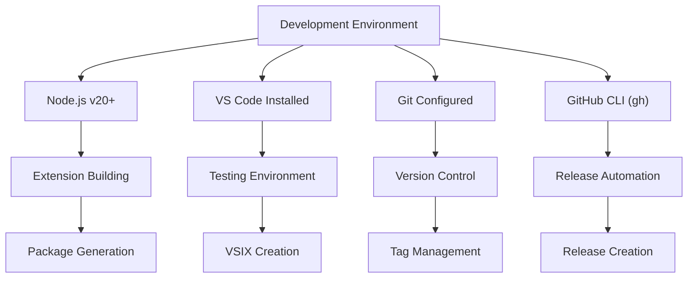
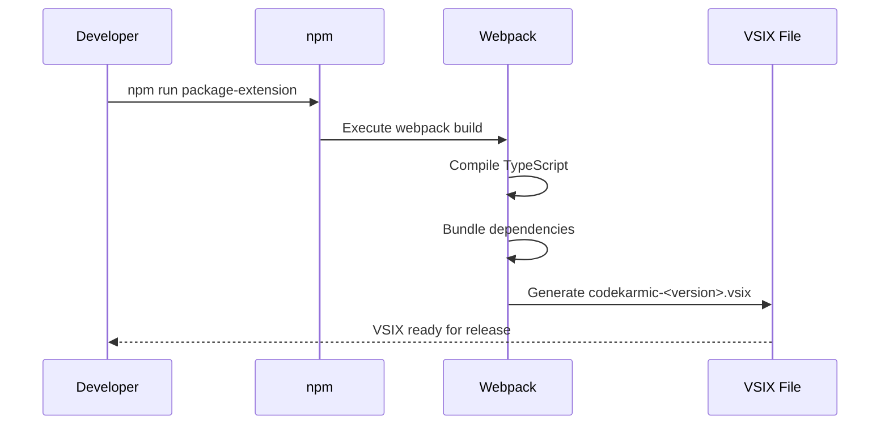
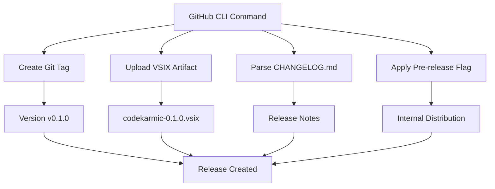
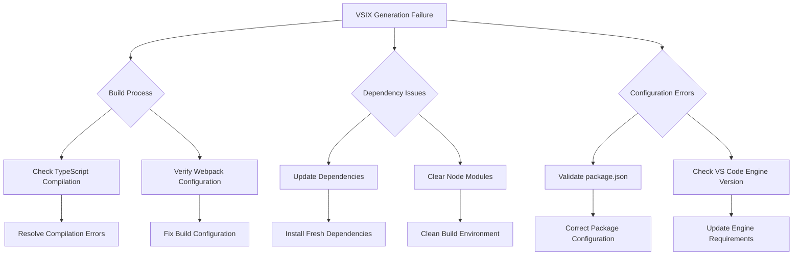

# GitHub Release Process

<cite>
**Referenced Files in This Document**
- [package.json](file://package.json)
- [docs/release-guide.md](file://docs/release-guide.md)
- [CHANGELOG.md](file://CHANGELOG.md)
- [webpack.config.js](file://webpack.config.js)
- [src/extension.ts](file://src/extension.ts)
- [package-lock.json](file://package-lock.json)
</cite>

## Table of Contents
1. [Introduction](#introduction)
2. [Purpose of GitHub Releases for Internal Testing](#purpose-of-github-releases-for-internal-testing)
3. [Prerequisites and Setup](#prerequisites-and-setup)
4. [Step-by-Step Release Process](#step-by-step-release-process)
5. [Security Considerations](#security-considerations)
6. [Best Practices for Internal Testing](#best-practices-for-internal-testing)
7. [Troubleshooting Common Issues](#troubleshooting-common-issues)
8. [Verification and Validation](#verification-and-validation)
9. [Post-Release Activities](#post-release-activities)

## Introduction

GitHub Releases serve as a crucial staging environment for CodeKarmic extension development, enabling internal testing and validation before public marketplace publication. This comprehensive guide outlines the complete process for creating pre-releases using GitHub CLI, from initial packaging to successful distribution and verification.

The GitHub release process acts as a controlled environment where internal testers can validate extension functionality, identify bugs, and provide feedback before the extension becomes publicly available on the VS Code Marketplace. This staged approach ensures quality assurance and reduces risks associated with public releases.

## Purpose of GitHub Releases for Internal Testing

GitHub Releases provide several key advantages for internal testing:

### Staged Deployment Environment
GitHub Releases offer a controlled environment separate from the public marketplace, allowing developers to test extension functionality with real-world scenarios before exposing it to end users.

### Artifact Management
The platform automatically handles VSIX file hosting, versioning, and distribution, eliminating the need for manual artifact management and ensuring consistent delivery to testers.

### Collaborative Feedback
Internal testers can easily download, install, and provide feedback on pre-release versions directly through the GitHub interface, streamlining the testing workflow.

### Version Control Integration
Releases are tightly integrated with Git tags and commit history, providing clear version tracking and rollback capabilities if issues arise during testing.

### Security Controls
Pre-release flags and access controls allow organizations to restrict visibility and distribution to authorized internal teams only.

## Prerequisites and Setup

### Development Environment Requirements

Before initiating the GitHub release process, ensure your development environment meets all prerequisites:



**Diagram sources**
- [docs/release-guide.md](file://docs/release-guide.md#L13-L19)

### Access Token Configuration

Proper authentication setup is essential for seamless GitHub CLI operations:

1. **GitHub CLI Authentication**: Execute `gh auth login` to establish secure connections with your GitHub account
2. **Personal Access Token (PAT)**: Generate a PAT with appropriate permissions for repository access
3. **Environment Variables**: Ensure required environment variables are properly configured for automated deployments

### VSCE Tool Configuration

The Visual Studio Code Extension publishing tool (vsce) requires specific setup for marketplace operations:

1. **Global Installation**: Install vsce globally using `npm install -g @vscode/vsce`
2. **Publisher Login**: Configure publisher credentials using `vsce login <publisher-name>`
3. **PAT Authentication**: Use Personal Access Tokens when prompted for authentication

**Section sources**
- [docs/release-guide.md](file://docs/release-guide.md#L13-L41)

## Step-by-Step Release Process

### 1. Preparation Phase

#### Version Management and Updates

Begin by updating the extension version according to semantic versioning principles:

```bash
# Update version in package.json
npm version 0.1.0 --no-git-tag-version
```

This command modifies the version field in package.json without creating a Git tag, allowing for controlled version management during the preparation phase.

#### CHANGELOG.md Maintenance

Maintain comprehensive release notes following established conventions:

```markdown
## [0.1.0] - YYYY-MM-DD

### Added
- New feature implementation
- Enhanced functionality

### Changed
- Modified existing behavior
- Updated dependencies

### Fixed
- Bug fixes and corrections
- Performance improvements
```

The CHANGELOG.md serves as the primary source for release notes, automatically included in GitHub releases when using the `--notes-file` flag.

#### Build and Quality Assurance

Execute comprehensive build and testing procedures:

```bash
# Install dependencies
npm install

# Build extension
npm run compile

# Run tests (if available)
npm test
```

This ensures the extension is properly compiled and functional before packaging for distribution.

**Section sources**
- [docs/release-guide.md](file://docs/release-guide.md#L46-L80)

### 2. Extension Packaging Process

#### VSIX File Generation

The packaging process transforms the compiled extension into a distributable VSIX file:

```bash
npm run package-extension
```

This command executes the webpack build process, creating a production-ready extension bundle stored in the `dist/` directory. The resulting file follows the naming convention `codekarmic-<version>.vsix`.



**Diagram sources**
- [webpack.config.js](file://webpack.config.js#L1-L47)
- [package.json](file://package.json#L282-L292)

#### Verification of Package Integrity

Before proceeding with release creation, verify the generated VSIX file:

1. **File Existence**: Confirm the VSIX file appears in the expected directory
2. **Size Validation**: Check file size to ensure complete packaging
3. **Content Verification**: Examine the package structure for completeness

**Section sources**
- [docs/release-guide.md](file://docs/release-guide.md#L85-L91)

### 3. GitHub Release Creation

#### Pre-release Flag Implementation

Create a GitHub pre-release using the GitHub CLI with proper version tagging:

```bash
gh release create v0.1.0 codekarmic-0.1.0.vsix \
  --title "CodeKarmic v0.1.0" \
  --notes-file CHANGELOG.md \
  --prerelease
```

This command performs several critical operations:

- **Version Tagging**: Creates a Git tag `v0.1.0` pointing to the current commit
- **Artifact Attachment**: Uploads the VSIX file as a release asset
- **Release Notes**: Populates release notes using content from CHANGELOG.md
- **Pre-release Status**: Applies the `--prerelease` flag to restrict public visibility



**Diagram sources**
- [docs/release-guide.md](file://docs/release-guide.md#L93-L99)

#### Release Metadata Configuration

Configure essential release metadata for optimal internal testing:

| Parameter | Description | Example Value |
|-----------|-------------|---------------|
| Version Tag | Semantic version identifier | `v0.1.0` |
| Title | Human-readable release name | `"CodeKarmic v0.1.0"` |
| Notes File | Markdown file containing release notes | `CHANGELOG.md` |
| Prerelease Flag | Restricts public visibility | `--prerelease` |
| VSIX Artifact | Extension package file | `codekarmic-0.1.0.vsix` |

**Section sources**
- [docs/release-guide.md](file://docs/release-guide.md#L93-L99)

### 4. Internal Testing Phase

#### Tester Coordination

Establish clear communication channels for internal testing:

1. **Distribution Method**: Share the GitHub release URL with internal testers
2. **Installation Instructions**: Provide step-by-step installation guidance
3. **Testing Guidelines**: Outline specific test scenarios and expected outcomes
4. **Feedback Collection**: Establish mechanisms for reporting issues and suggestions

#### Installation Process for Testers

Internal testers follow a standardized installation procedure:

1. **Download VSIX**: Access the VSIX file from the GitHub release page
2. **VS Code Installation**: Use "Extensions: Install from VSIX" command
3. **Feature Validation**: Test all documented functionality
4. **Issue Documentation**: Record any encountered problems or suggestions

**Section sources**
- [docs/release-guide.md](file://docs/release-guide.md#L101-L109)

## Security Considerations

### Access Control for Pre-releases

GitHub pre-releases provide built-in security controls for restricted distribution:

#### Repository Permissions
- **Organization Members**: Full access to pre-release content
- **Collaborators**: Explicitly granted access to private releases
- **External Contributors**: Restricted to public releases only

#### Authentication Requirements
- **Personal Access Tokens**: Secure authentication for automated releases
- **Two-Factor Authentication**: Enhanced security for repository access
- **Token Scoping**: Limit permissions to specific repositories or actions

### Artifact Protection

Protect VSIX files and release metadata from unauthorized access:

#### File Integrity
- **Checksum Verification**: Validate VSIX file integrity during download
- **Digital Signatures**: Implement code signing for release artifacts
- **Tamper Detection**: Monitor for unauthorized modifications

#### Distribution Controls
- **Access Logging**: Track who downloads and installs pre-release versions
- **Expiration Policies**: Set time limits for pre-release availability
- **Revocation Mechanisms**: Enable immediate removal of compromised releases

### Best Practices for Secure Distribution

1. **Regular Token Rotation**: Update Personal Access Tokens periodically
2. **Minimal Permissions**: Grant only necessary repository access rights
3. **Audit Trails**: Maintain comprehensive logs of release activities
4. **Secure Communication**: Use encrypted channels for release distribution

## Best Practices for Internal Testing

### Testing Strategy Development

Implement comprehensive testing approaches for effective validation:

#### Functional Testing
- **Core Features**: Verify fundamental extension capabilities
- **Integration Points**: Test interactions with VS Code and Git systems
- **Edge Cases**: Validate behavior under unusual conditions

#### Performance Testing
- **Load Testing**: Assess performance with large codebases
- **Memory Usage**: Monitor resource consumption during operation
- **Response Times**: Measure UI responsiveness and API latency

#### Compatibility Testing
- **VS Code Versions**: Test across supported VS Code releases
- **Operating Systems**: Validate functionality across platforms
- **Git Configurations**: Ensure compatibility with various Git setups

### Issue Tracking and Management

Establish structured approaches for capturing and resolving testing issues:

#### Issue Classification
- **Critical**: Blocking functionality preventing testing
- **High Priority**: Significant usability or performance issues
- **Medium Priority**: Feature enhancements or minor bugs
- **Low Priority**: Cosmetic issues or suggestions

#### Resolution Workflow
1. **Issue Reporting**: Capture detailed reproduction steps
2. **Impact Assessment**: Evaluate severity and scope
3. **Priority Assignment**: Determine resolution timeline
4. **Fix Implementation**: Address identified issues
5. **Validation Testing**: Verify fixes resolve reported problems

### Documentation Standards

Maintain comprehensive documentation for testing processes:

#### Test Case Documentation
- **Test Scenarios**: Detailed step-by-step procedures
- **Expected Outcomes**: Clear descriptions of desired results
- **Environment Requirements**: Specific setup needs for testing
- **Known Limitations**: Current restrictions or workarounds

#### Release Notes Maintenance
- **Feature Documentation**: Complete descriptions of new functionality
- **Bug Fixes**: Detailed explanations of resolved issues
- **Breaking Changes**: Clear communication of incompatible modifications
- **Migration Guides**: Assistance for upgrading from previous versions

## Troubleshooting Common Issues

### Authentication and Authorization Problems

#### GitHub CLI Authentication Failures

Common authentication issues and solutions:

| Issue | Symptoms | Solution |
|-------|----------|----------|
| Expired Token | `HTTP 401 Unauthorized` errors | Regenerate Personal Access Token |
| Insufficient Permissions | `HTTP 403 Forbidden` responses | Verify repository access rights |
| Network Connectivity | Timeout errors during authentication | Check internet connection and proxy settings |
| Two-Factor Authentication | Login failures despite correct credentials | Enable TOTP in GitHub settings |

#### VSCE Publishing Issues

Resolve common publishing challenges:

```bash
# Check PAT validity
vsce ls-publishers

# Verify publisher access
vsce show <publisher-name>

# Test package integrity
vsce package
```

### Package and Build Problems

#### VSIX Generation Failures

Address compilation and packaging issues:



**Diagram sources**
- [webpack.config.js](file://webpack.config.js#L1-L47)
- [package.json](file://package.json#L12-L14)

#### Missing Artifacts

Resolve issues with missing or corrupted release artifacts:

1. **File Verification**: Confirm VSIX file exists and is accessible
2. **Size Validation**: Check file size against expected dimensions
3. **Integrity Testing**: Verify file checksums and signatures
4. **Redistribution**: Re-upload artifacts if corruption is detected

### Release Creation Problems

#### Version Format Issues

Ensure proper semantic versioning compliance:

```bash
# Correct version format examples
npm version 0.1.0 --no-git-tag-version
npm version 1.0.0-beta.1 --no-git-tag-version
npm version 2.1.3-alpha.2 --no-git-tag-version
```

#### Release Note Processing

Address issues with CHANGELOG.md parsing:

1. **Markdown Formatting**: Ensure proper Markdown syntax
2. **Encoding Issues**: Verify UTF-8 encoding for special characters
3. **File Accessibility**: Confirm CHANGELOG.md is readable and accessible
4. **Content Validation**: Check for malformed links or unsupported syntax

### Network and Connectivity Issues

#### GitHub API Rate Limits

Monitor and manage API rate limiting:

```bash
# Check rate limit status
gh api rate_limit

# Monitor usage patterns
gh api rate_limit --jq '.resources.core.remaining'
```

#### Proxy and Firewall Configuration

Configure network settings for corporate environments:

1. **Proxy Settings**: Configure HTTP/HTTPS proxy for GitHub access
2. **Firewall Rules**: Ensure outbound connections to GitHub APIs
3. **Certificate Validation**: Handle self-signed certificates if necessary
4. **Timeout Configuration**: Adjust timeouts for slow network connections

**Section sources**
- [docs/release-guide.md](file://docs/release-guide.md#L155-L170)

## Verification and Validation

### Release Creation Confirmation

Verify successful GitHub release creation through multiple validation methods:

#### GitHub Repository Verification

Access the GitHub repository's Releases page to confirm:

1. **Release Listing**: Verify the new release appears in the releases timeline
2. **Version Tag**: Confirm the Git tag `v0.1.0` is correctly associated
3. **Artifact Availability**: Check that the VSIX file is present and downloadable
4. **Release Notes**: Validate that CHANGELOG.md content is properly formatted
5. **Pre-release Status**: Confirm the pre-release flag is active

#### Automated Validation Scripts

Implement automated checks for release verification:

```bash
#!/bin/bash
# Release validation script

RELEASE_URL="https://github.com/nesnilnehc/codekarmic/releases/tag/v0.1.0"
ARTIFACT_NAME="codekarmic-0.1.0.vsix"

# Verify release exists
if gh release view v0.1.0 >/dev/null 2>&1; then
    echo "✓ Release v0.1.0 confirmed"
else
    echo "✗ Release v0.1.0 not found"
    exit 1
fi

# Check artifact presence
if gh release view v0.1.0 --json assets | grep -q "$ARTIFACT_NAME"; then
    echo "✓ VSIX artifact confirmed"
else
    echo "✗ VSIX artifact missing"
    exit 1
fi

echo "Release validation completed successfully"
```

### Internal Testing Progress Monitoring

Track testing activities and gather feedback:

#### Tester Participation Metrics
- **Download Statistics**: Monitor VSIX file download counts
- **Installation Rates**: Track successful extension installations
- **Testing Coverage**: Measure comprehensive feature validation
- **Issue Reporting**: Count and categorize reported problems

#### Quality Assurance Validation
- **Functional Completeness**: Verify all documented features work correctly
- **Performance Benchmarks**: Measure response times and resource usage
- **Compatibility Verification**: Test across supported environments
- **Regression Testing**: Ensure new changes don't break existing functionality

### Feedback Integration and Iteration

Process internal feedback for continuous improvement:

#### Issue Categorization and Prioritization
1. **Critical Issues**: Blockers requiring immediate attention
2. **High Priority**: Significant problems affecting core functionality
3. **Medium Priority**: Usability improvements and bug fixes
4. **Low Priority**: Enhancement suggestions and cosmetic changes

#### Iterative Development Process
- **Bug Fix Implementation**: Address reported issues systematically
- **Feature Enhancements**: Incorporate valuable suggestions
- **Performance Optimizations**: Improve runtime efficiency
- **Documentation Updates**: Maintain accurate technical documentation

## Post-Release Activities

### Pre-release Removal and Public Release

After successful internal testing, prepare for public marketplace publication:

#### GitHub Release Modification
1. **Remove Pre-release Flag**: Convert internal release to public availability
2. **Update Release Notes**: Add marketplace-specific information and links
3. **Enhance Documentation**: Include installation instructions and usage guidelines
4. **Add Marketplace Link**: Provide direct access to the published extension

#### VS Code Marketplace Publication
Execute the public release process:

```bash
# Publish to VS Code Marketplace
vsce publish
```

This command uploads the extension to the marketplace, making it available to all users with appropriate permissions.

### Documentation Updates and Promotion

Maintain comprehensive documentation reflecting the new release:

#### Technical Documentation
- **API References**: Update any exposed APIs or interfaces
- **Configuration Guides**: Document new settings and options
- **Migration Instructions**: Help users upgrade from previous versions
- **Troubleshooting Guides**: Address common issues and solutions

#### Marketing and Communication
- **Release Announcements**: Share news through appropriate channels
- **Social Media Updates**: Promote the new release on relevant platforms
- **Community Engagement**: Respond to user feedback and questions
- **Website Updates**: Modify documentation and promotional materials

### Performance Monitoring and Maintenance

Establish ongoing monitoring for release health:

#### Usage Analytics
- **Installation Tracking**: Monitor download and installation rates
- **Feature Adoption**: Measure usage patterns of new features
- **Performance Metrics**: Track extension performance and stability
- **User Satisfaction**: Collect feedback through surveys and reviews

#### Continuous Improvement
- **Bug Monitoring**: Track and resolve post-release issues
- **Feature Requests**: Process enhancement requests from users
- **Version Planning**: Develop roadmap for future releases
- **Community Support**: Provide assistance and guidance to users

**Section sources**
- [docs/release-guide.md](file://docs/release-guide.md#L134-L153)

## Conclusion

The GitHub pre-release process for CodeKarmic extension provides a robust framework for internal testing and validation before public marketplace publication. By following this comprehensive guide, development teams can ensure quality assurance, gather valuable feedback, and maintain security throughout the release lifecycle.

Key success factors include proper preparation, thorough testing, effective communication with internal testers, and systematic issue resolution. The staged approach enables identification and correction of problems before they impact the broader user community, ultimately resulting in a higher-quality extension for the VS Code marketplace.

Regular practice of these procedures establishes organizational maturity in release management and contributes to the long-term success and reputation of the CodeKarmic extension within the development community.