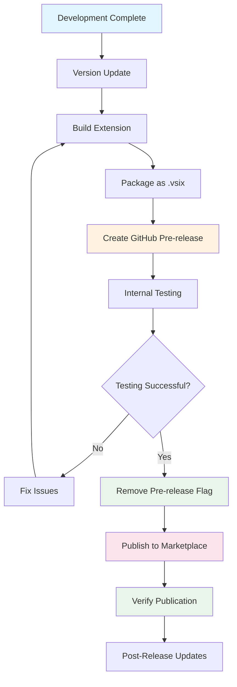
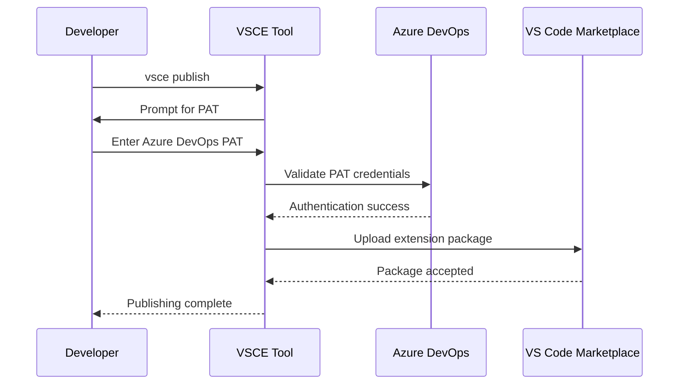
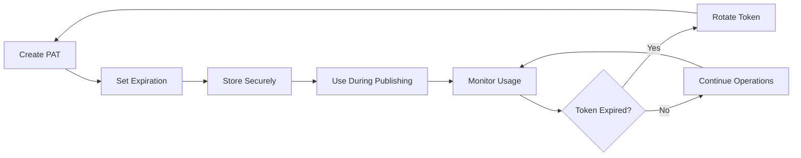

# Publishing to Marketplaces

<cite>
**Referenced Files in This Document**
- [package.json](file://package.json)
- [docs/release-guide.md](file://docs/release-guide.md)
- [CHANGELOG.md](file://CHANGELOG.md)
- [README.md](file://README.md)
- [webpack.config.js](file://webpack.config.js)
- [.vscodeignore](file://.vscodeignore)
- [.gitignore](file://.gitignore)
- [package-lock.json](file://package-lock.json)
</cite>

## Table of Contents
1. [Introduction](#introduction)
2. [Publishing Strategy Overview](#publishing-strategy-overview)
3. [Prerequisites and Setup](#prerequisites-and-setup)
4. [GitHub Release Process](#github-release-process)
5. [VS Code Marketplace Publication](#vs-code-marketplace-publication)
6. [Verification and Validation](#verification-and-validation)
7. [Security Considerations](#security-considerations)
8. [Troubleshooting Guide](#troubleshooting-guide)
9. [Post-Release Tasks](#post-release-tasks)
10. [Best Practices](#best-practices)

## Introduction

CodeKarmic follows a sophisticated two-stage publishing strategy designed to ensure quality and reliability before public release. This approach combines GitHub Releases for internal testing with VS Code Marketplace publication for public distribution. The process leverages modern development tools including GitHub CLI (gh) for release management and vsce for marketplace publishing.

The publishing workflow ensures comprehensive testing through pre-release distribution while maintaining strict security standards through proper authentication and token management. This documentation provides complete guidance for developers to successfully publish CodeKarmic to both platforms.

## Publishing Strategy Overview

CodeKarmic employs a strategic two-phase publishing approach that maximizes quality assurance and minimizes risk:



**Diagram sources**
- [docs/release-guide.md](file://docs/release-guide.md#L5-L10)

### Phase 1: GitHub Release (Internal Testing)
The first phase focuses on internal validation through GitHub Releases. This stage creates a pre-release version containing the .vsix file, enabling team members and early adopters to test the extension in real-world scenarios before public exposure.

### Phase 2: VS Code Marketplace Publication
The second phase involves official marketplace publication, where the extension becomes publicly available to the VS Code community. This phase includes comprehensive verification and promotion activities.

**Section sources**
- [docs/release-guide.md](file://docs/release-guide.md#L5-L10)

## Prerequisites and Setup

### Development Environment Requirements

Before beginning the publishing process, ensure your development environment meets all requirements:

| Requirement | Version | Purpose |
|-------------|---------|---------|
| Node.js | v20 or higher | Extension compilation and vsce operations |
| VS Code | Latest stable | Extension development and testing |
| Git | Latest stable | Version control and release management |
| GitHub CLI | Latest stable | Automated release creation |

### Authentication Setup

#### Personal Access Token (PAT) Configuration

CodeKarmic requires proper authentication tokens for both Azure DevOps and GitHub services:

**Azure DevOps PAT Requirements:**
- Navigate to [Azure DevOps](https://dev.azure.com/)
- Create new Personal Access Token with permissions:
  - **Marketplace (Acquire)**: Required for accessing marketplace APIs
  - **Marketplace (Manage)**: Required for publishing extensions

**Token Security Best Practices:**
- Store tokens securely using environment variables
- Never commit tokens to version control
- Set appropriate expiration dates
- Use least-privilege principle

#### GitHub CLI Configuration

Configure GitHub CLI for automated release management:

```bash
gh auth login
```

This command establishes authentication with GitHub, enabling automated release creation and management.

#### VS Code Extension Publisher Setup

Install and configure vsce for marketplace publishing:

```bash
npm install -g @vscode/vsce
vsce login nesnilnehc  # Uses PAT when prompted
```

The publisher name `nesnilnehc` in package.json serves as the authentication identifier during the vsce login process.

**Section sources**
- [docs/release-guide.md](file://docs/release-guide.md#L11-L41)
- [package.json](file://package.json#L5-L6)

## GitHub Release Process

### Extension Packaging

The GitHub release process begins with creating a distributable .vsix file through the webpack build system:

```bash
npm run package
```

This command compiles the TypeScript source code and packages it into a production-ready .vsix file. The build process excludes development files and optimizes the extension for distribution.

### Pre-release Creation

After successful packaging, create a GitHub pre-release with comprehensive metadata:

```bash
gh release create v0.2.0 codekarmic-0.2.0.vsix \
  --title "CodeKarmic v0.2.0" \
  --notes-file CHANGELOG.md \
  --prerelease
```

#### Command Breakdown

| Parameter | Description | Example Value |
|-----------|-------------|---------------|
| `v0.2.0` | Release tag and version | Semantic version string |
| `codekarmic-0.2.0.vsix` | Uploaded artifact | Generated extension file |
| `--title` | Display title for release | Human-readable version name |
| `--notes-file` | Changelog source | CHANGELOG.md content |
| `--prerelease` | Mark as pre-release | Enables internal testing |

### Internal Testing Procedures

Following pre-release creation, conduct comprehensive internal testing:

1. **Download .vsix File**: Retrieve the generated .vsix from the GitHub release page
2. **Manual Installation**: Install in VS Code using:
   - View → Command Palette
   - Execute "Extensions: Install from VSIX"
3. **Feature Validation**: Test all core functionality including:
   - Commit explorer navigation
   - AI-powered code review capabilities
   - Configuration management
   - Multi-language support
4. **Issue Documentation**: Record any bugs or usability concerns

**Section sources**
- [docs/release-guide.md](file://docs/release-guide.md#L82-L109)

## VS Code Marketplace Publication

### Publisher Account Verification

Before publishing to the VS Code Marketplace, ensure your publisher account is properly configured:

1. **Access Publisher Portal**: Navigate to [VS Code Marketplace Management](https://marketplace.visualstudio.com/manage)
2. **Account Verification**: Confirm publisher identity and compliance
3. **Extension Details**: Configure extension metadata including:
   - Display name and description
   - Category and keywords
   - Screenshots and icons
   - License information

### Publishing Workflow

Execute the marketplace publication using vsce:

```bash
vsce publish
```

#### Authentication Process

The vsce publish command initiates an interactive authentication flow:



**Diagram sources**
- [docs/release-guide.md](file://docs/release-guide.md#L118-L122)

### Package Validation

During publication, vsce performs comprehensive validation:

| Validation Type | Purpose | Failure Impact |
|----------------|---------|----------------|
| Package Structure | Ensures proper .vsix format | Publishing blocked |
| Metadata Compliance | Validates package.json entries | Manual corrections required |
| Dependencies | Checks for missing or incompatible dependencies | Version conflicts |
| Size Limits | Verifies package size constraints | Compression required |

**Section sources**
- [docs/release-guide.md](file://docs/release-guide.md#L110-L133)

## Verification and Validation

### Post-Publication Verification

After successful marketplace publication, verify the extension's presence and functionality:

#### Marketplace Verification Checklist

| Verification Point | Expected Outcome | Validation Method |
|-------------------|------------------|-------------------|
| Extension Listing | Visible in VS Code Marketplace | Search for "CodeKarmic" |
| Version Number | Correct version displayed | Compare against package.json |
| Installation Count | Non-zero installs | Monitor marketplace statistics |
| README Content | Complete documentation | Review extension details |
| Screenshots | Functional preview images | View extension page |

#### Installation Testing

Confirm proper installation and functionality:

1. **VS Code Integration**: Verify extension appears in Extensions view
2. **Command Availability**: Test all registered commands
3. **Configuration Access**: Validate settings panel accessibility
4. **Feature Functionality**: Perform basic code review operations

### Monitoring and Analytics

Track extension performance post-publication:

- **Installation Metrics**: Monitor daily/monthly installations
- **User Feedback**: Review marketplace ratings and reviews
- **Error Reporting**: Track crash reports and error logs
- **Usage Patterns**: Analyze feature adoption rates

**Section sources**
- [docs/release-guide.md](file://docs/release-guide.md#L124-L133)

## Security Considerations

### Personal Access Token Management

Proper PAT management is crucial for secure publishing:

#### Token Lifecycle Management



**Diagram sources**
- [docs/release-guide.md](file://docs/release-guide.md#L158-L162)

#### Security Best Practices

| Practice | Implementation | Benefit |
|----------|----------------|---------|
| Token Rotation | Regularly regenerate PATs | Minimizes exposure window |
| Environment Variables | Store tokens in secure variables | Prevents accidental disclosure |
| Least Privilege | Grant minimal required permissions | Limits potential damage |
| Audit Logging | Monitor token usage | Enables security investigations |

### Authentication Security

#### vsce Authentication Flow

The vsce authentication process implements several security measures:

1. **Interactive Prompt**: Tokens are entered manually to prevent storage
2. **Temporary Session**: Authentication lasts only for the current session
3. **Scope Limitation**: PAT permissions are restricted to marketplace operations
4. **HTTPS Encryption**: All communication occurs over encrypted connections

#### Token Expiration Handling

Implement proactive token management:

```bash
# Check PAT validity before publishing
vsce ls-publishers
```

This command verifies publisher access and can detect expired tokens before attempting publication.

**Section sources**
- [docs/release-guide.md](file://docs/release-guide.md#L158-L162)

## Troubleshooting Guide

### Common Publishing Failures

#### Authentication Errors

**Problem**: vsce fails with authentication errors
**Symptoms**: 
- "Invalid publisher" messages
- "Token expired" warnings
- "Permission denied" responses

**Solutions**:
1. Verify PAT validity and permissions
2. Re-authenticate using `vsce login`
3. Check publisher name accuracy
4. Ensure Azure DevOps PAT has marketplace permissions

#### Package Configuration Issues

**Problem**: vsce rejects package.json configuration
**Symptoms**:
- "Invalid package.json" errors
- Missing required fields
- Version format mismatches

**Solutions**:
1. Validate package.json syntax using JSON validator
2. Ensure semantic versioning compliance
3. Verify all required fields are present
4. Check publisher name matches vsce authentication

#### Network and Connectivity Issues

**Problem**: Publishing fails due to network connectivity
**Symptoms**:
- Timeout errors during upload
- Connection refused messages
- Unreachable server responses

**Solutions**:
1. Verify internet connectivity
2. Check firewall settings for port 443
3. Test proxy configuration if applicable
4. Retry publishing during off-peak hours

### Debugging Strategies

#### Enable Verbose Logging

```bash
vsce publish --verbose
```

This command provides detailed output for troubleshooting publication issues.

#### Validate Package Structure

```bash
vsce package --dry-run
```

Simulates the packaging process to identify structural issues.

#### Test Authentication Separately

```bash
vsce ls-publishers
vsce ls-extensions
```

These commands verify authentication and access permissions without initiating publication.

**Section sources**
- [docs/release-guide.md](file://docs/release-guide.md#L154-L169)

## Post-Release Tasks

### GitHub Release Updates

After marketplace publication, update the GitHub release to reflect the public availability:

#### Release Status Updates

1. **Remove Pre-release Flag**: Convert pre-release to standard release
2. **Add Marketplace Link**: Include direct link to VS Code Marketplace
3. **Update Release Notes**: Enhance documentation with public information
4. **Promotional Content**: Add installation instructions and screenshots

#### Documentation Updates

Maintain comprehensive documentation reflecting the published version:

| Task | Priority | Description |
|------|----------|-------------|
| Update README | High | Add marketplace badge and links |
| Modify user guides | Medium | Reflect new features and fixes |
| Update API references | Low | Document any changes |
| Social media posts | Medium | Announce new release |

### Community Engagement

#### Announcement Strategy

Plan comprehensive release announcements:

1. **GitHub Release Notes**: Detailed changelog and features
2. **Social Media**: Platform-specific announcements
3. **Developer Forums**: Community engagement and feedback
4. **Documentation Updates**: Keep help resources current

#### Feedback Collection

Establish channels for user feedback:

- **GitHub Issues**: Bug reports and feature requests
- **VS Code Marketplace Reviews**: User ratings and comments
- **Community Forums**: Discussion and support
- **Direct Communication**: Email or social media contact

**Section sources**
- [docs/release-guide.md](file://docs/release-guide.md#L134-L153)

## Best Practices

### Version Management

#### Semantic Versioning Compliance

Follow semantic versioning principles for predictable release cycles:

- **Major Version**: Breaking changes requiring migration
- **Minor Version**: New features with backward compatibility
- **Patch Version**: Bug fixes and minor improvements

#### Release Planning

Implement structured release planning:

1. **Feature Freeze**: Establish deadlines for feature completion
2. **Testing Schedule**: Allocate time for comprehensive testing
3. **Documentation Timeline**: Coordinate documentation updates
4. **Marketing Coordination**: Align release with promotional activities

### Quality Assurance

#### Pre-Release Testing

Implement comprehensive testing protocols:

- **Unit Testing**: Validate individual components
- **Integration Testing**: Test component interactions
- **User Acceptance Testing**: Validate end-user scenarios
- **Performance Testing**: Ensure acceptable performance metrics

#### Continuous Monitoring

Establish monitoring systems for post-release validation:

- **Crash Reporting**: Automatic error collection and analysis
- **Usage Analytics**: Track feature adoption and performance
- **User Feedback**: Systematic collection and response
- **Security Scanning**: Regular vulnerability assessments

### Documentation Standards

#### Release Documentation

Maintain high-quality release documentation:

- **Changelog Format**: Consistent format for change descriptions
- **Version History**: Complete historical record of releases
- **Migration Guides**: Clear instructions for major version upgrades
- **Troubleshooting**: Common issues and solutions

#### Community Resources

Provide comprehensive community support:

- **Quick Start Guides**: Rapid onboarding for new users
- **Advanced Tutorials**: In-depth feature exploration
- **API Documentation**: Technical reference materials
- **FAQ Sections**: Common questions and answers

**Section sources**
- [docs/release-guide.md](file://docs/release-guide.md#L170-L204)