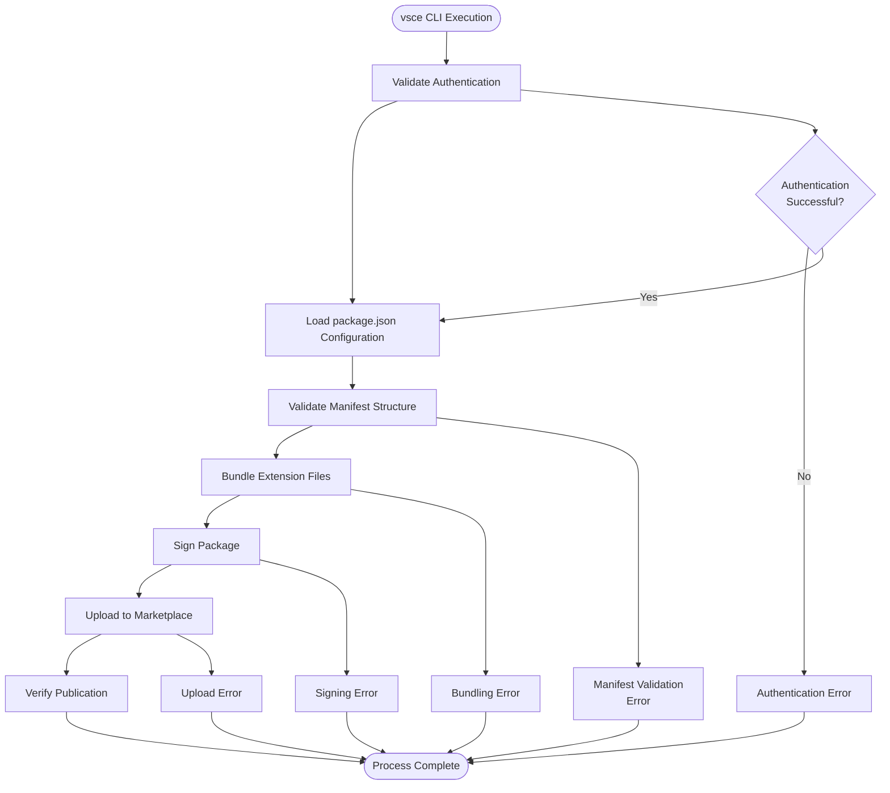
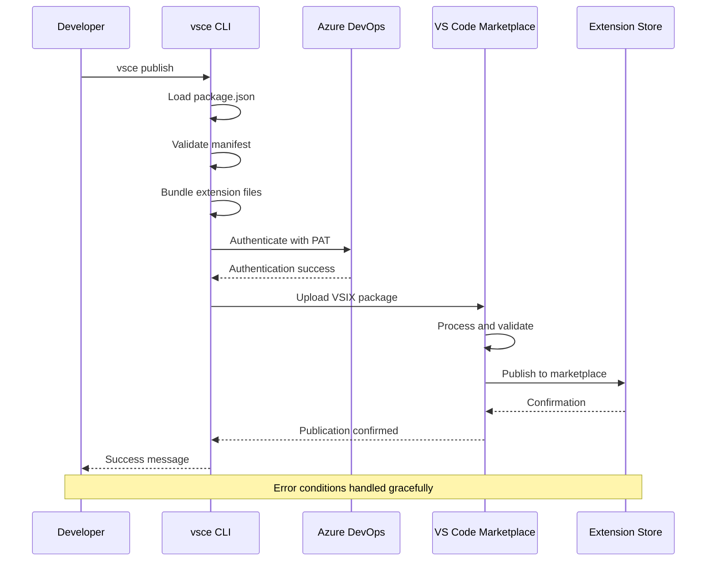

# VS Code Marketplace Publication

<cite>
**Referenced Files in This Document**
- [package.json](file://package.json)
- [docs/release-guide.md](file://docs/release-guide.md)
- [README.md](file://README.md)
- [CHANGELOG.md](file://CHANGELOG.md)
- [webpack.config.js](file://webpack.config.js)
- [tsconfig.json](file://tsconfig.json)
- [docs/project-structure.md](file://docs/project-structure.md)
</cite>

## Table of Contents
1. [Introduction](#introduction)
2. [Prerequisites and Setup](#prerequisites-and-setup)
3. [Understanding vsce CLI](#understanding-vsce-cli)
4. [Package.json Configuration](#packagejson-configuration)
5. [Authentication Process](#authentication-process)
6. [Publishing Workflow](#publishing-workflow)
7. [Post-Publication Verification](#post-publication-verification)
8. [Security Best Practices](#security-best-practices)
9. [Troubleshooting Guide](#troubleshooting-guide)
10. [Best Practices and Maintenance](#best-practices-and-maintenance)

## Introduction

CodeKarmic is an AI-powered VS Code extension that provides automated code review capabilities for Git commits. Publishing this extension to the official VS Code Marketplace involves a comprehensive workflow that ensures proper authentication, version management, and quality assurance. This document provides detailed guidance on the complete publishing process, from initial setup to post-publication monitoring.

The publishing process follows industry-standard practices for VS Code extension distribution, utilizing the Visual Studio Code Extensions (vsce) CLI tool for package management and marketplace interaction. The workflow encompasses authentication with Azure DevOps, package validation, version control, and comprehensive testing procedures.

## Prerequisites and Setup

### Development Environment Requirements

Before beginning the publishing process, ensure your development environment meets all prerequisites:

- **Node.js v20 or higher**: Required for building and packaging the extension
- **VS Code**: Installed and configured for local testing
- **Git**: Installed and configured for version control operations
- **GitHub CLI**: (`gh`) installed for GitHub integration

### Azure DevOps Publisher Account Setup

The CodeKarmic extension uses the publisher identifier `nesnilnehc`, which must match your Azure DevOps publisher account. This publisher name serves as the namespace for your extension in the marketplace.

### Personal Access Token (PAT) Configuration

Create a Personal Access Token with the following permissions:
- **Marketplace (Acquire)**: Required for accessing marketplace APIs
- **Marketplace (Manage)**: Required for publishing and managing extensions

The PAT serves as your authentication credential for marketplace operations and should be stored securely following established security practices.

**Section sources**
- [docs/release-guide.md](file://docs/release-guide.md#L12-L41)
- [package.json](file://package.json#L6)

## Understanding vsce CLI

### What is vsce?

The Visual Studio Code Extensions (vsce) CLI is the official tool for packaging, publishing, and managing VS Code extensions. It handles the complete lifecycle of extension distribution, from initial packaging to marketplace publication.

### Key vsce Commands

The vsce CLI provides several essential commands for the publishing workflow:

- **`vsce login <publisher-name>`**: Authenticates with the marketplace using a Personal Access Token
- **`vsce publish`**: Packages and publishes the extension to the marketplace
- **`vsce unpublish`**: Removes the extension from the marketplace (with caution)
- **`vsce package`**: Creates a VSIX package without publishing

### vsce Architecture



**Diagram sources**
- [docs/release-guide.md](file://docs/release-guide.md#L35-L41)

**Section sources**
- [docs/release-guide.md](file://docs/release-guide.md#L35-L41)

## Package.json Configuration

### Essential Metadata Fields

The `package.json` file serves as the primary configuration source for vsce operations. Several fields are critical for successful marketplace publication:

#### Publisher Field
The `publisher` field (`"nesnilnehc"`) must exactly match your Azure DevOps publisher account name. This field establishes the namespace under which your extension will appear in the marketplace.

#### Version Management
The `version` field follows semantic versioning principles and must be incremented appropriately for each release. The current version is `0.2.0`.

#### Engine Compatibility
The `engines.vscode` field specifies compatibility requirements. CodeKarmic requires VS Code version 1.85.0 or higher.

#### Activation Events
The `activationEvents` array defines when the extension activates, including startup events, command activations, and view activations.

### Script Configuration

The package.json includes several npm scripts that support the publishing workflow:

- **`vscode:prepublish`**: Runs before publishing to ensure proper packaging
- **`compile`**: Compiles TypeScript source files
- **`package`**: Creates production-ready bundles
- **`lint`**: Performs static code analysis

### Contribution Definitions

The `contributes` section defines all extension capabilities, including:
- Available commands and their metadata
- Configuration options and their properties
- UI contributions like views and menus
- Keyboard shortcuts and command palette entries

**Section sources**
- [package.json](file://package.json#L1-L311)
- [docs/release-guide.md](file://docs/release-guide.md#L46-L52)

## Authentication Process

### Secure Login Procedure

The authentication process involves creating and storing a Personal Access Token (PAT) with appropriate marketplace permissions. The vsce CLI provides a streamlined login procedure:

```bash
vsce login nesnilnehc
```

During authentication, the CLI prompts for your PAT and validates it against Azure DevOps services. Successful authentication stores credentials locally for subsequent operations.

### PAT Security and Permissions

Personal Access Tokens serve as authentication credentials and must be handled with security awareness:

- **Scope Limitation**: PATs should have minimal required permissions
- **Expiration Management**: Implement token rotation policies
- **Secure Storage**: Never commit PATs to version control systems
- **Access Monitoring**: Regularly audit PAT usage and permissions

### Token Expiration Handling

PATs may expire or become invalidated due to various reasons:
- Manual revocation by the account holder
- Policy changes requiring re-authentication
- Security breaches necessitating immediate action

When encountering authentication errors, verify token validity and regenerate if necessary.

**Section sources**
- [docs/release-guide.md](file://docs/release-guide.md#L20-L41)

## Publishing Workflow

### Pre-Publish Validation

Before executing the publish command, ensure all prerequisites are met:

1. **Version Increment**: Update the version number in package.json
2. **Changelog Update**: Document all changes in CHANGELOG.md
3. **Build Verification**: Compile and test the extension locally
4. **Dependency Validation**: Ensure all dependencies are properly resolved

### vsce Publish Command

Execute the publish operation using the standardized command sequence:

```bash
vsce publish
```

The publish command performs several critical operations:

#### Automatic Package Bundling
vsce automatically packages the extension by:
- Including all files specified in the build process
- Excluding unnecessary files using .vscodeignore rules
- Creating a compressed VSIX file for marketplace distribution

#### Version Validation
The CLI validates version information:
- Ensures semantic versioning compliance
- Checks for version conflicts with existing releases
- Validates engine compatibility requirements

#### Manifest Processing
Package.json metadata is processed and validated:
- Publisher name verification
- Required field validation
- Contribution definition checking

### Publishing Pipeline



**Diagram sources**
- [docs/release-guide.md](file://docs/release-guide.md#L120-L122)

**Section sources**
- [docs/release-guide.md](file://docs/release-guide.md#L120-L122)

## Post-Publication Verification

### Marketplace Presence Confirmation

After successful publication, verify the extension's availability on the marketplace:

1. **Search Verification**: Search for "CodeKarmic" in the VS Code Marketplace
2. **URL Validation**: Confirm the extension URL matches expected format
3. **Publisher Verification**: Ensure the publisher name displays correctly

### Metadata Validation

Verify that all published metadata appears correctly:

- **Description Accuracy**: Confirm the extension description matches package.json
- **README Content**: Validate that documentation renders properly
- **Version Information**: Check that version numbers display correctly
- **Icon and Screenshots**: Verify visual assets appear as intended

### Installation Metrics

Monitor installation statistics and user feedback:

- **Install Count**: Track daily and cumulative installations
- **Rating and Reviews**: Monitor user ratings and feedback
- **Download Analytics**: Analyze geographic and platform distribution
- **Error Reporting**: Review crash reports and error logs

### Quality Assurance Checklist

Perform comprehensive post-publication testing:

1. **Installation Verification**: Confirm successful installation across platforms
2. **Feature Testing**: Validate all extension features work correctly
3. **Compatibility Checking**: Test with various VS Code versions
4. **Performance Monitoring**: Monitor resource usage and response times

**Section sources**
- [docs/release-guide.md](file://docs/release-guide.md#L124-L133)

## Security Best Practices

### PAT Management

Implement robust security practices for Personal Access Token management:

#### Token Generation
- Use strong, unique passwords for PAT creation
- Apply minimal required permissions for each use case
- Set appropriate expiration dates for temporary tokens

#### Storage and Rotation
- Store PATs in secure credential managers
- Implement regular rotation schedules (monthly recommended)
- Use environment variables for CI/CD pipeline tokens
- Never hardcode tokens in source code repositories

#### Access Control
- Limit PAT usage to authorized personnel only
- Monitor token usage through Azure DevOps audit logs
- Implement least-privilege access principles
- Regularly review and revoke unused tokens

### Development Security

Maintain security throughout the development lifecycle:

- **Dependency Scanning**: Regularly scan for vulnerable dependencies
- **Code Review**: Implement mandatory code review processes
- **Testing**: Include security testing in quality assurance
- **Documentation**: Maintain up-to-date security procedures

### Production Security

Ensure ongoing security in production environments:

- **Monitoring**: Implement continuous security monitoring
- **Incident Response**: Establish clear incident response procedures
- **Backup**: Maintain secure backups of extension assets
- **Compliance**: Ensure compliance with relevant regulations

**Section sources**
- [docs/release-guide.md](file://docs/release-guide.md#L154-L169)

## Troubleshooting Guide

### Common Failure Scenarios

#### Invalid Publisher Name
**Symptoms**: Authentication failures or publisher mismatch errors
**Causes**: 
- Typographical errors in publisher name
- Using incorrect Azure DevOps publisher account
- Case sensitivity issues

**Solutions**:
- Verify publisher name matches exactly with Azure DevOps account
- Check for case sensitivity in package.json
- Confirm account ownership and permissions

#### Expired Personal Access Token
**Symptoms**: Authentication errors during publish operations
**Causes**:
- Token expiration due to policy changes
- Manual token revocation
- Security breach detection

**Solutions**:
- Generate new PAT with required permissions
- Update stored credentials using `vsce login`
- Verify token scope and expiration date

#### Malformed Manifest
**Symptoms**: Package validation failures
**Causes**:
- Missing required fields in package.json
- Invalid JSON syntax
- Incorrect field formats

**Solutions**:
- Validate package.json syntax using JSON validators
- Check required fields: name, displayName, version, publisher
- Verify field formats match expected patterns

#### Network Timeouts
**Symptoms**: Upload failures or connection errors
**Causes**:
- Network connectivity issues
- Firewall restrictions
- Proxy server configurations

**Solutions**:
- Verify internet connectivity and firewall settings
- Configure proxy settings if required
- Retry operation after resolving network issues

### Diagnostic Procedures

#### Authentication Diagnostics
1. Test PAT validity using Azure DevOps API
2. Verify vsce login credentials
3. Check network connectivity to Azure DevOps services

#### Package Diagnostics
1. Validate package.json syntax and structure
2. Test local packaging with `vsce package`
3. Verify file inclusion/exclusion patterns

#### Upload Diagnostics
1. Monitor upload progress and error messages
2. Check file size limits and restrictions
3. Verify marketplace quotas and limits

### Recovery Strategies

#### Failed Authentication
- Regenerate PAT with correct permissions
- Clear cached credentials with `vsce logout`
- Re-authenticate with `vsce login`

#### Failed Packaging
- Fix package.json syntax errors
- Resolve dependency conflicts
- Clean build artifacts and rebuild

#### Failed Upload
- Retry with improved network conditions
- Reduce file sizes if necessary
- Contact marketplace support for persistent issues

**Section sources**
- [docs/release-guide.md](file://docs/release-guide.md#L154-L169)

## Best Practices and Maintenance

### Version Management

Implement structured version management following semantic versioning principles:

- **Major Versions**: Breaking changes requiring user action
- **Minor Versions**: New features with backward compatibility
- **Patch Versions**: Bug fixes and minor improvements

### Release Automation

Consider automating repetitive publishing tasks:

- **CI/CD Integration**: Automate builds and publishing
- **Pre-release Testing**: Implement automated testing pipelines
- **Rollback Procedures**: Maintain ability to quickly revert releases

### Documentation Maintenance

Keep documentation current and comprehensive:

- **Release Notes**: Maintain detailed changelogs
- **API Documentation**: Document extension APIs and interfaces
- **User Guides**: Provide clear installation and usage instructions

### Community Engagement

Foster positive community relationships:

- **Issue Tracking**: Monitor and respond to GitHub issues
- **Feature Requests**: Consider user feedback for future development
- **Documentation Contributions**: Encourage community documentation efforts

### Performance Monitoring

Implement ongoing performance monitoring:

- **Usage Analytics**: Track extension adoption and usage patterns
- **Error Reporting**: Monitor and address runtime errors
- **Performance Metrics**: Measure load times and resource usage

**Section sources**
- [docs/release-guide.md](file://docs/release-guide.md#L170-L204)
- [CHANGELOG.md](file://CHANGELOG.md#L1-L92)

## Conclusion

Publishing CodeKarmic to the VS Code Marketplace represents a significant milestone in the extension's development lifecycle. The process involves careful attention to authentication, configuration, and quality assurance procedures. By following the guidelines outlined in this document, developers can ensure successful marketplace publication while maintaining security and operational excellence.

The vsce CLI provides a robust framework for extension distribution, handling complex packaging and validation requirements while maintaining compatibility with marketplace standards. Proper PAT management, version control, and post-publication monitoring form the foundation of a sustainable publishing workflow.

Success in marketplace publication requires ongoing maintenance, community engagement, and continuous improvement. By implementing the best practices and troubleshooting procedures outlined here, extension developers can achieve reliable, secure, and user-friendly distribution of their VS Code extensions.