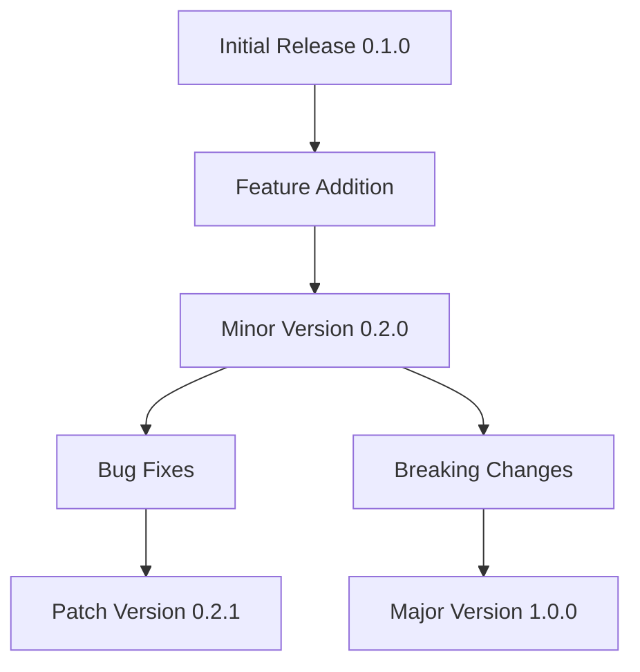
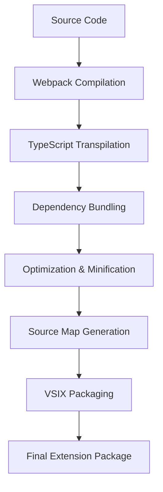

# Release Process

<cite>
**Referenced Files in This Document**   
- [package.json](file://package.json)
- [webpack.config.js](file://webpack.config.js)
- [docs/release-guide.md](file://docs/release-guide.md)
- [CHANGELOG.md](file://CHANGELOG.md)
- [README.md](file://README.md)
- [tsconfig.json](file://tsconfig.json)
</cite>

## Table of Contents
1. [Introduction](#introduction)
2. [Versioning Strategy](#versioning-strategy)
3. [Release Preparation](#release-preparation)
4. [Packaging Process](#packaging-process)
5. [Publishing to VS Code Marketplace](#publishing-to-vs-code-marketplace)
6. [Post-Release Activities](#post-release-activities)
7. [Release Checklist](#release-checklist)
8. [Rollback and Hotfix Procedures](#rollback-and-hotfix-procedures)
9. [Automation Possibilities](#automation-possibilities)
10. [Conclusion](#conclusion)

## Introduction
The CodeKarmic release process is a structured workflow designed to ensure reliable and consistent delivery of extension updates to users. This document details the complete release lifecycle, from versioning and preparation to packaging, publishing, and post-release activities. The process follows semantic versioning principles and leverages both GitHub for internal testing and the VS Code Marketplace for public distribution. The release workflow is supported by comprehensive documentation, automated build processes, and defined procedures for handling issues.

**Section sources**
- [docs/release-guide.md](file://docs/release-guide.md#L1-L204)
- [package.json](file://package.json#L1-L311)

## Versioning Strategy
CodeKarmic follows semantic versioning (SemVer) as defined in package.json, with version numbers formatted as MAJOR.MINOR.PATCH. The current version is 0.2.0, indicating the second minor release with backward-compatible feature additions. Major version increments signify breaking changes, minor versions introduce new backward-compatible features, and patch versions address bug fixes. The versioning strategy is documented in both package.json and the project's CHANGELOG.md, which adheres to the Keep a Changelog format. Each release entry in the changelog includes sections for Added, Changed, Fixed, and Documentation updates, providing clear visibility into what has changed between versions.

**Diagram sources**
- [package.json](file://package.json#L5)
- [CHANGELOG.md](file://CHANGELOG.md#L1-L92)

**Section sources**
- [package.json](file://package.json#L5)
- [CHANGELOG.md](file://CHANGELOG.md#L1-L92)

## Release Preparation
The release preparation phase involves several critical steps to ensure code quality and documentation completeness. First, the version in package.json is updated using npm version commands with the --no-git-tag-version flag to prevent automatic Git tagging. Following version update, the CHANGELOG.md file is updated with detailed release notes following the Keep a Changelog format, documenting all notable changes under Added, Changed, Fixed, and Documentation categories. The build process is then executed through npm run compile, which triggers Webpack to compile TypeScript code into optimized JavaScript. Comprehensive testing is performed using npm test, which runs the test suite after compiling test files. The preparation phase also includes verification of all configuration files and dependency integrity before proceeding to packaging.

**Section sources**
- [docs/release-guide.md](file://docs/release-guide.md#L44-L80)
- [package.json](file://package.json#L282-L292)
- [CHANGELOG.md](file://CHANGELOG.md#L1-L92)

## Packaging Process
The packaging process for CodeKarmic utilizes Webpack for code bundling and optimization, followed by VS Code's extension packaging commands. The webpack.config.js configuration specifies the entry point as ./src/extension.ts, targets Node.js environment, and outputs to the dist directory as extension.js with commonjs2 library target. Webpack is configured with hidden-source-map devtool for debugging while minimizing bundle size through optimization.minimize. The build process compiles TypeScript files using ts-loader with proper module resolution. After Webpack compilation, the extension is packaged into a .vsix file using npm run package-extension command, which creates a distributable package named codekarmic-<version>.vsix. The .vscodeignore file ensures that development-specific files are excluded from the final package, maintaining a clean and optimized distribution.

**Diagram sources**
- [webpack.config.js](file://webpack.config.js#L1-L48)
- [package.json](file://package.json#L282-L288)
- [.vscodeignore](file://.vscodeignore)

**Section sources**
- [webpack.config.js](file://webpack.config.js#L1-L48)
- [package.json](file://package.json#L282-L288)
- [.vscodeignore](file://.vscodeignore)

## Publishing to VS Code Marketplace
Publishing to the VS Code Marketplace requires proper authentication and follows a standardized workflow. Before publication, the publisher must configure a Personal Access Token (PAT) from Azure DevOps with Marketplace (Acquire) and Marketplace (Manage) permissions. The vsce tool is installed globally via npm install -g @vscode/vsce and configured with vsce login using the publisher name and PAT. The actual publication is performed using the vsce publish command, which automatically reads version information from package.json and uploads the extension to the marketplace. Prior to publishing, the extension details in package.json are verified, including name, displayName, description, publisher, and repository information. After publication, verification is performed by checking the marketplace listing for correct version number, README content, and installation metrics.

**Section sources**
- [docs/release-guide.md](file://docs/release-guide.md#L110-L133)
- [package.json](file://package.json#L1-L311)

## Post-Release Activities
Post-release activities ensure proper documentation, user communication, and monitoring. After successful marketplace publication, the GitHub release is updated by removing the pre-release flag and adding a link to the marketplace listing. Documentation is updated across all relevant files, including README.md, user guides, and developer guides, to reflect new features and changes. An announcement is made through appropriate channels, potentially including social media, email newsletters, or community forums. Monitoring is established to track installation metrics, user feedback, and potential issues reported through GitHub issues. The team actively monitors for any critical bugs or performance issues that may require immediate attention, preparing for potential hotfixes if necessary.

**Section sources**
- [docs/release-guide.md](file://docs/release-guide.md#L134-L153)
- [README.md](file://README.md#L1-L24)

## Release Checklist
The following step-by-step checklist ensures consistency across all CodeKarmic releases:

1. **Version Update**: Update version in package.json using `npm version <new-version> --no-git-tag-version`
2. **Changelog Update**: Add entry to CHANGELOG.md with detailed changes under Added, Changed, Fixed, and Documentation sections
3. **Dependency Check**: Run `npm install` to ensure all dependencies are current and compatible
4. **Build Execution**: Compile code using `npm run compile` to generate production-ready bundles
5. **Testing**: Run test suite with `npm test` to verify functionality and catch regressions
6. **Internal Packaging**: Create VSIX package with `npm run package-extension`
7. **GitHub Pre-release**: Create pre-release on GitHub using `gh release create` with the VSIX file and changelog notes
8. **Internal Testing**: Download and install the extension from GitHub release for comprehensive testing
9. **Marketplace Publication**: Publish to VS Code Marketplace using `vsce publish`
10. **Verification**: Confirm successful publication by checking marketplace listing and version
11. **Documentation Update**: Update README and documentation files with new features and changes
12. **Release Finalization**: Update GitHub release with marketplace link and remove pre-release flag
13. **Announcement**: Notify users through appropriate communication channels

**Section sources**
- [docs/release-guide.md](file://docs/release-guide.md#L43-L153)
- [package.json](file://package.json#L282-L292)

## Rollback and Hotfix Procedures
In the event of critical issues discovered after release, CodeKarmic has defined rollback and hotfix procedures. For immediate rollback, the previous stable version can be republished to the marketplace, effectively restoring functionality while the issue is investigated. Hotfixes follow an expedited version of the standard release process, using patch version increments (e.g., 0.2.1) to address critical bugs. The hotfix process begins with creating a dedicated hotfix branch from the previous stable release tag, implementing and testing the fix, then following the standard packaging and publication workflow. The changelog for hotfix releases clearly documents the specific issue resolved and any potential impact. Emergency publication can bypass certain non-critical steps but always includes thorough testing of the specific issue being addressed.

**Section sources**
- [docs/release-guide.md](file://docs/release-guide.md#L154-L169)
- [CHANGELOG.md](file://CHANGELOG.md#L1-L92)

## Automation Possibilities
While the current release process is primarily manual, several automation opportunities exist to improve efficiency and reliability. A CI/CD pipeline could be implemented using GitHub Actions to automate testing, building, and even publication upon merge to the main branch. Version incrementing and changelog updates could be automated using conventional commits and tools like semantic-release. Pre-release validation could be automated with comprehensive test suites and code quality checks. Marketplace publication could be integrated into the CI/CD workflow with proper secret management for the PAT. Automated documentation generation could ensure consistency across user and developer guides. Notification systems could be implemented to automatically announce new releases to users and stakeholders upon successful publication.

**Section sources**
- [docs/release-guide.md](file://docs/release-guide.md#L42-L204)
- [package.json](file://package.json#L282-L292)

## Conclusion
The CodeKarmic release process is a well-defined workflow that ensures high-quality, reliable delivery of extension updates. By following semantic versioning, maintaining comprehensive changelogs, and leveraging both GitHub and the VS Code Marketplace, the process balances thorough testing with efficient public distribution. The integration of Webpack for optimized packaging and the clear separation between internal testing and public release stages contribute to a robust release cycle. While currently manual, the process is well-documented and structured in a way that facilitates future automation, ensuring scalability as the project grows. Continued adherence to these procedures will maintain the extension's reliability and user trust.