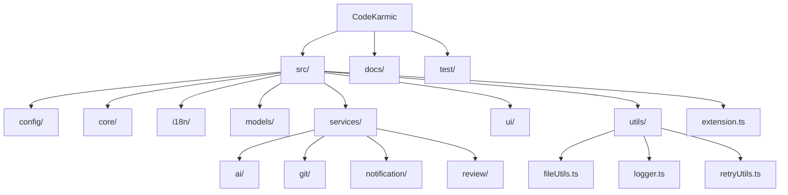
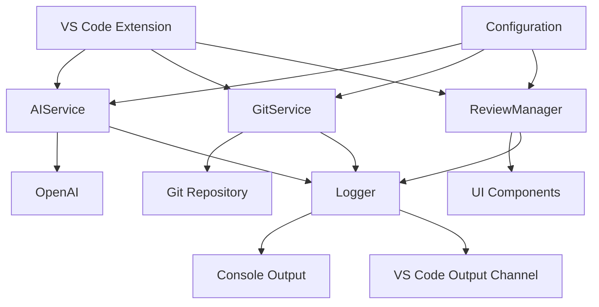
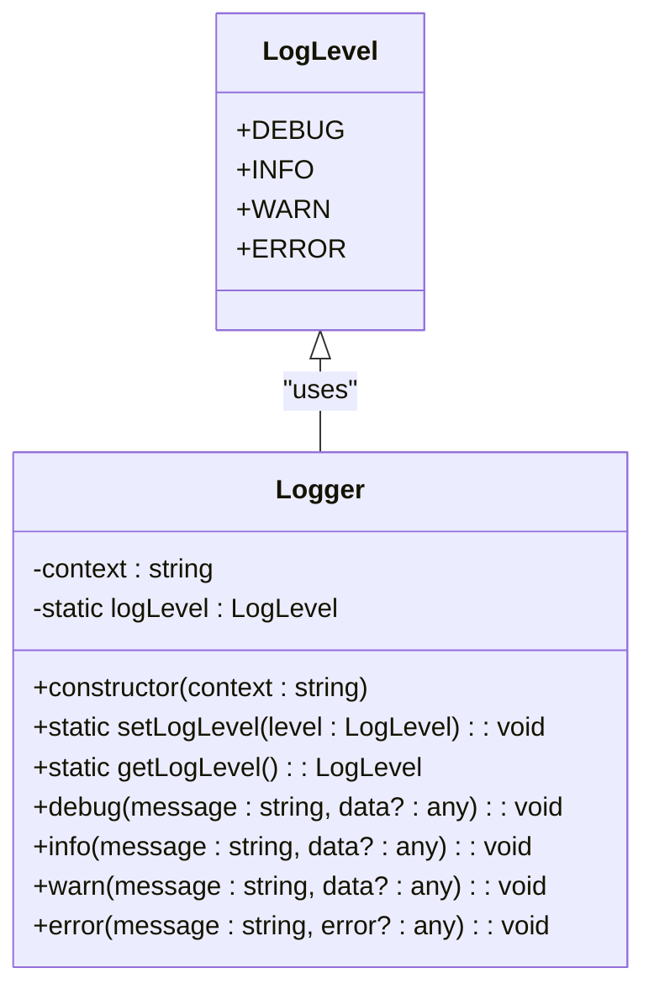
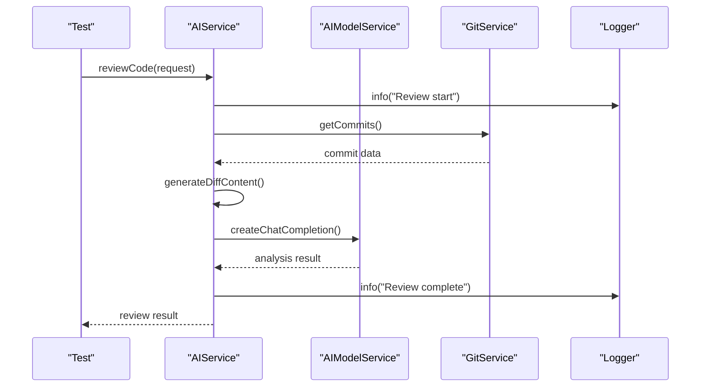
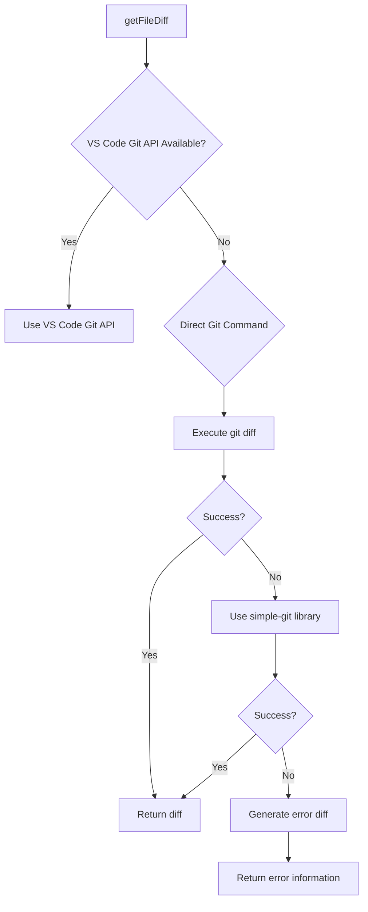
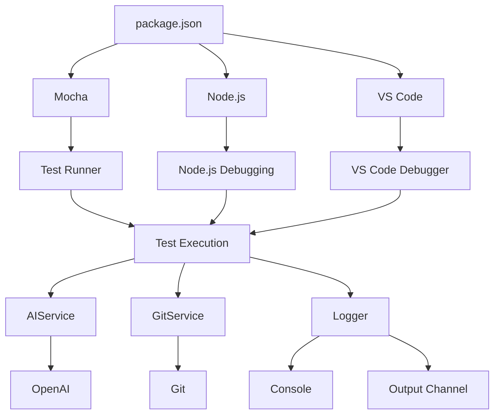
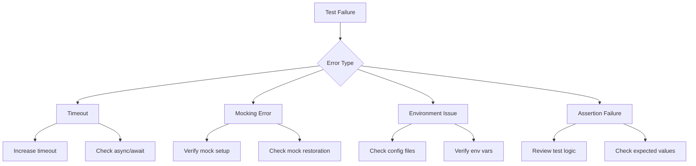

# Debugging Tests

<cite>
**Referenced Files in This Document**   
- [package.json](file://package.json)
- [logger.ts](file://src/utils/logger.ts)
- [aiService.ts](file://src/services/ai/aiService.ts)
- [gitService.ts](file://src/services/git/gitService.ts)
- [appConfig.ts](file://src/config/appConfig.ts)
- [retryUtils.ts](file://src/utils/retryUtils.ts)
</cite>

## Table of Contents
1. [Introduction](#introduction)
2. [Project Structure](#project-structure)
3. [Core Components](#core-components)
4. [Architecture Overview](#architecture-overview)
5. [Detailed Component Analysis](#detailed-component-analysis)
6. [Dependency Analysis](#dependency-analysis)
7. [Performance Considerations](#performance-considerations)
8. [Troubleshooting Guide](#troubleshooting-guide)
9. [Conclusion](#conclusion)

## Introduction
This document provides comprehensive guidance on debugging tests in CodeKarmic, an AI-powered extension for Git commit code review. The documentation covers the use of Node.js debugging tools to step through test execution and inspect variable states, leveraging the Logger class for tracing test execution flow and diagnosing failures in services like AIService and GitService. It includes detailed instructions on configuring VS Code's debugger to attach to the test runner process and set breakpoints in both test and application code. The guide also addresses techniques for isolating flaky tests, analyzing test output, and resolving common issues such as timeouts in asynchronous operations, incorrect mocking behavior, and environmental dependencies. Best practices for writing debuggable tests and interpreting test results to identify root causes of failures are provided to ensure robust and maintainable test suites.

## Project Structure

**Diagram sources**
- [package.json](file://package.json#L1-L311)
- [webpack.config.js](file://webpack.config.js)

**Section sources**
- [package.json](file://package.json#L1-L311)
- [tsconfig.json](file://tsconfig.json#L1-L19)

## Core Components

The core components of CodeKarmic include the AIService for AI-powered code review, GitService for Git operations, NotificationManager for user feedback, and the Logger utility for consistent logging. The application uses a modular architecture with clear separation of concerns, where each service handles specific functionality. The Logger class provides different log levels (DEBUG, INFO, WARN, ERROR) and supports context-based logging, making it invaluable for tracing execution flow during testing. Configuration is managed through AppConfig, which provides centralized access to application settings with event-based notification for changes. The retryUtils module implements robust retry logic for handling transient failures in network operations.

**Section sources**
- [logger.ts](file://src/utils/logger.ts#L1-L88)
- [appConfig.ts](file://src/config/appConfig.ts#L1-L189)
- [retryUtils.ts](file://src/utils/retryUtils.ts#L1-L117)

## Architecture Overview

**Diagram sources**
- [aiService.ts](file://src/services/ai/aiService.ts#L1-L787)
- [gitService.ts](file://src/services/git/gitService.ts#L1-L1201)
- [extension.ts](file://src/extension.ts)

**Section sources**
- [aiService.ts](file://src/services/ai/aiService.ts#L1-L787)
- [gitService.ts](file://src/services/git/gitService.ts#L1-L1201)

## Detailed Component Analysis

### Logging System Analysis

The Logger class is a critical component for debugging tests in CodeKarmic. It provides structured logging with different severity levels and context information, enabling developers to trace the execution flow and diagnose issues effectively.

**Diagram sources**
- [logger.ts](file://src/utils/logger.ts#L8-L13)
- [logger.ts](file://src/utils/logger.ts#L18-L88)

**Section sources**
- [logger.ts](file://src/utils/logger.ts#L1-L88)

### AI Service Analysis

The AIService component handles AI-powered code review functionality, making it a critical component to test and debug. It interacts with external AI providers and manages complex asynchronous operations.

**Diagram sources**
- [aiService.ts](file://src/services/ai/aiService.ts#L40-L787)
- [logger.ts](file://src/utils/logger.ts#L18-L88)

**Section sources**
- [aiService.ts](file://src/services/ai/aiService.ts#L40-L787)

### Git Service Analysis

The GitService component manages Git repository operations, which are essential for the code review functionality. It uses multiple strategies to retrieve Git data, making it important to test various scenarios.

**Diagram sources**
- [gitService.ts](file://src/services/git/gitService.ts#L45-L800)

**Section sources**
- [gitService.ts](file://src/services/git/gitService.ts#L45-L800)

## Dependency Analysis

**Diagram sources**
- [package.json](file://package.json#L291-L310)
- [package.json](file://package.json#L294-L306)

**Section sources**
- [package.json](file://package.json#L291-L310)

## Performance Considerations

When debugging tests in CodeKarmic, several performance considerations should be taken into account. The test execution environment should closely mirror the production environment to ensure accurate performance characteristics. For tests involving AI service calls, consider using mocking to avoid actual API calls during debugging sessions, which can significantly reduce test execution time. The Logger class should be configured to an appropriate log level during testing - DEBUG level for detailed tracing during debugging, but INFO or higher for regular test runs to avoid excessive output. When debugging asynchronous operations, pay attention to potential race conditions and ensure proper handling of promises and callbacks. The retry mechanism in retryUtils should be configured with shorter timeouts and fewer retries during testing to prevent long delays when debugging failures.

**Section sources**
- [retryUtils.ts](file://src/utils/retryUtils.ts#L1-L117)
- [logger.ts](file://src/utils/logger.ts#L1-L88)

## Troubleshooting Guide

### Common Test Issues and Solutions

When debugging tests in CodeKarmic, several common issues may arise. For timeouts in asynchronous operations, ensure that test timeouts are properly configured and consider using Jest's fake timers or similar mechanisms to control time-dependent code. For incorrect mocking behavior, verify that mocks are properly set up and restored after each test, and ensure that the mock implementations accurately reflect the expected behavior of the real components. Environmental dependencies can cause tests to fail in different environments; use configuration files and environment variables to manage these dependencies consistently across environments.

**Diagram sources**
- [aiService.ts](file://src/services/ai/aiService.ts#L120-L123)
- [gitService.ts](file://src/services/git/gitService.ts#L239-L241)

**Section sources**
- [aiService.ts](file://src/services/ai/aiService.ts#L120-L123)
- [gitService.ts](file://src/services/git/gitService.ts#L239-L241)

### Debugging Configuration

To effectively debug tests in CodeKarmic, configure VS Code's debugger to attach to the test runner process. Create a launch configuration in `.vscode/launch.json` that targets the test script specified in package.json (`node ./out/test/runTest.js`). Set breakpoints in both test files and application code to step through execution and inspect variable states. Use the Logger class to add strategic debug messages that trace the execution flow and capture variable values at critical points. When debugging flaky tests, enable detailed logging and consider running tests in isolation to identify environmental factors that may be contributing to the flakiness.

**Section sources**
- [package.json](file://package.json#L291)
- [logger.ts](file://src/utils/logger.ts#L50-L54)

## Conclusion

Debugging tests in CodeKarmic requires a systematic approach that leverages the available tools and infrastructure effectively. By understanding the application architecture, utilizing the Logger class for tracing execution flow, and configuring the development environment appropriately, developers can efficiently diagnose and resolve test failures. The modular design of CodeKarmic, with well-defined services and clear dependencies, facilitates targeted testing and debugging. When encountering issues, start by examining the log output to understand the execution flow, then use the debugger to step through problematic code sections. For flaky tests, consider environmental factors and ensure consistent test setup and teardown. By following the best practices outlined in this document, developers can maintain a robust test suite that effectively validates the functionality of the CodeKarmic extension.