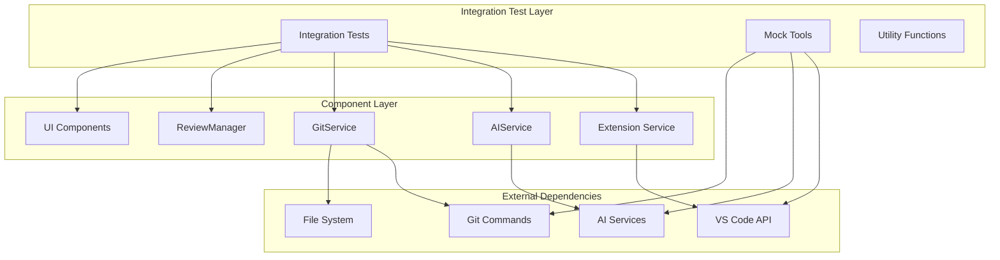
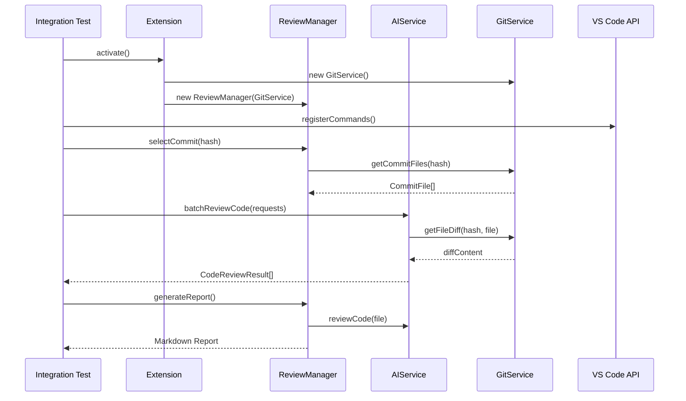
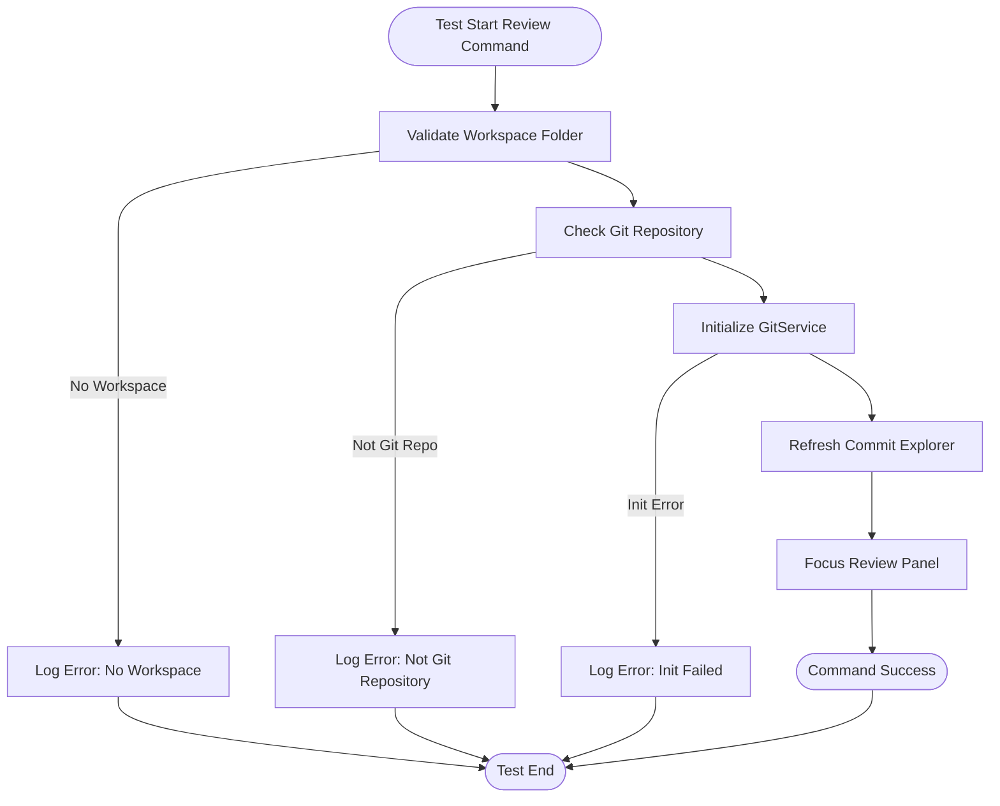
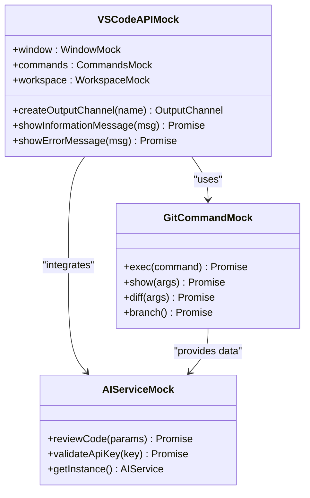
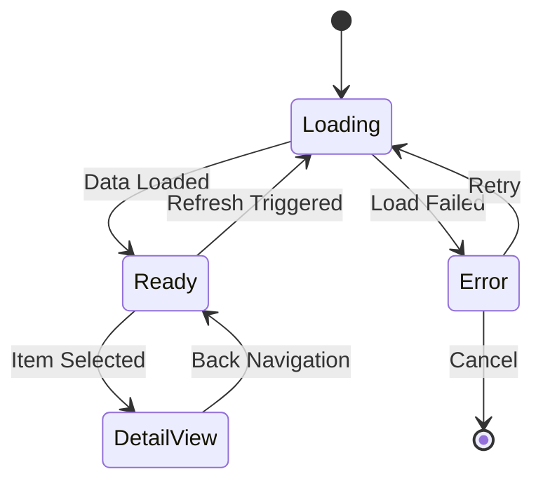
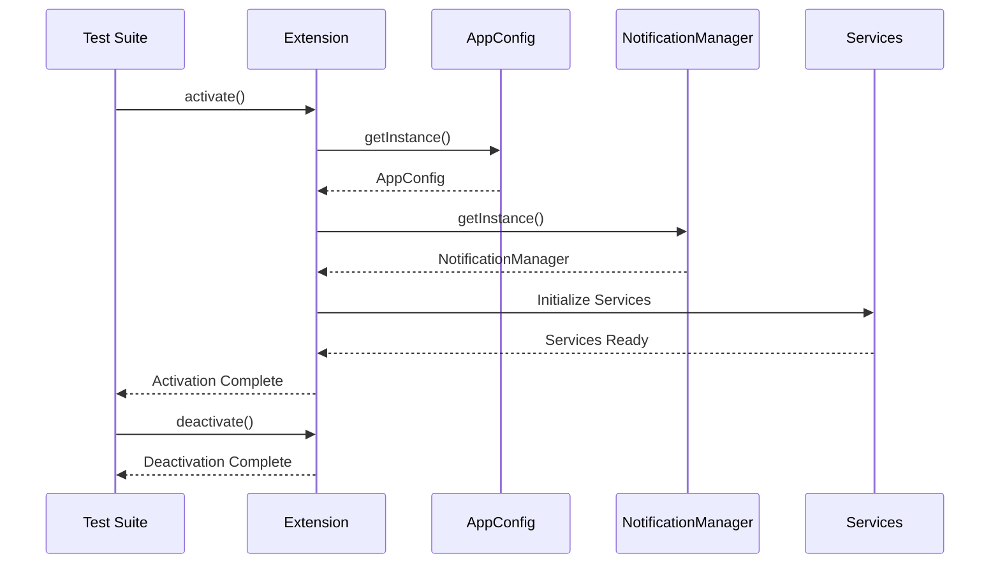
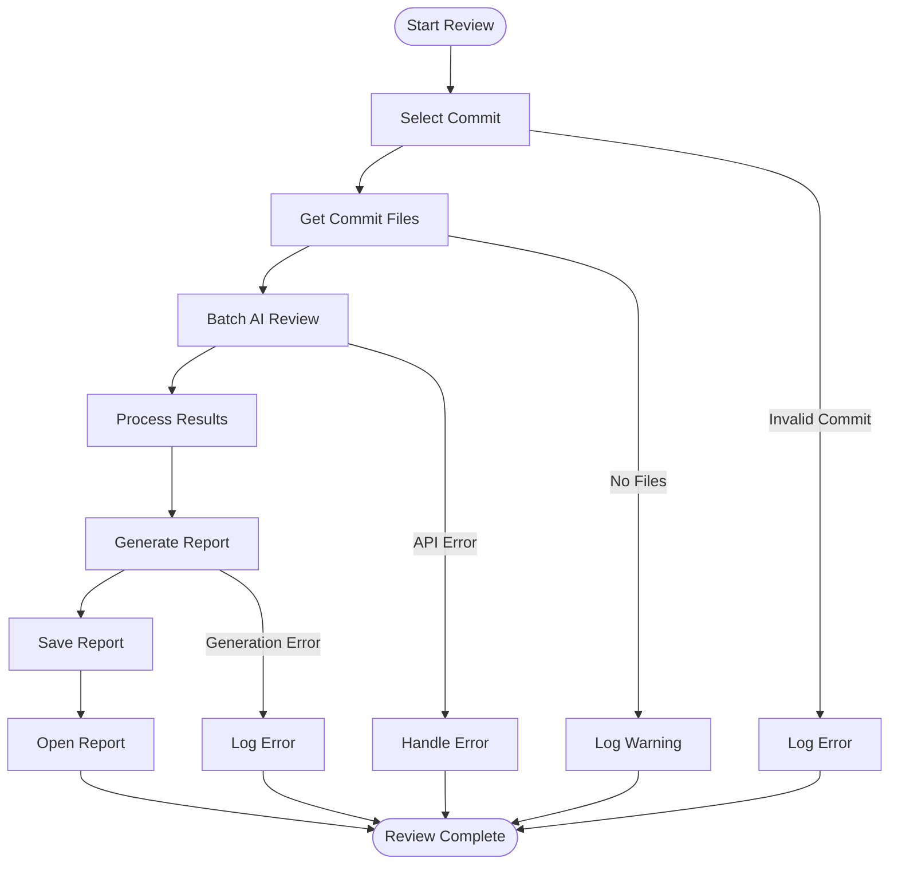
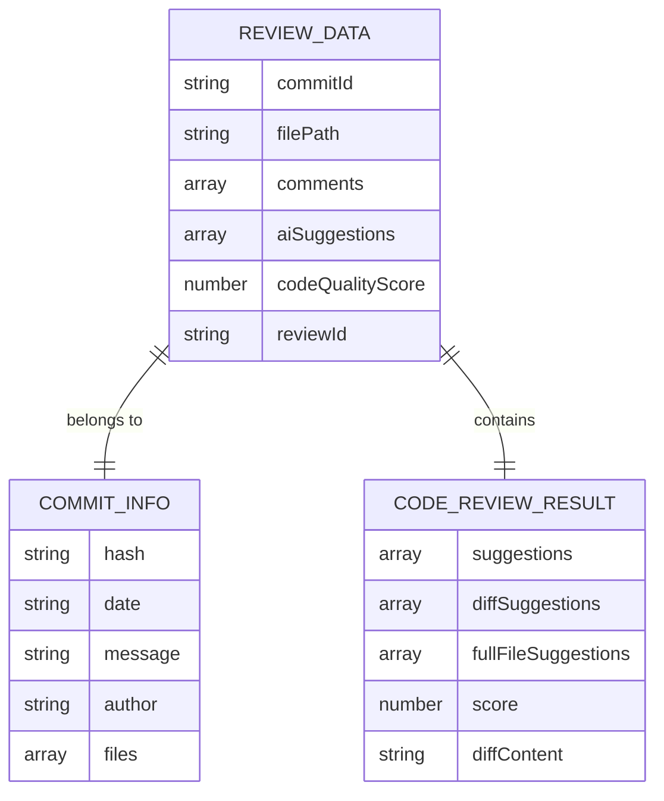
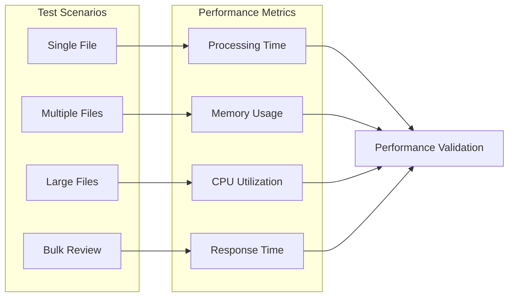
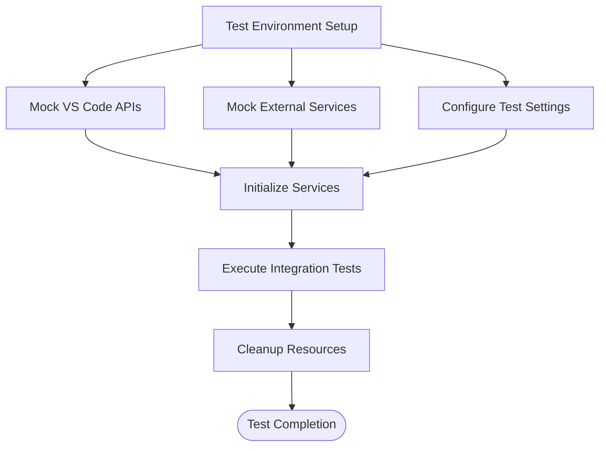

# Integration Testing

<cite>
**Referenced Files in This Document**
- [src/extension.ts](file://src/extension.ts)
- [src/services/ai/aiService.ts](file://src/services/ai/aiService.ts)
- [src/services/git/gitService.ts](file://src/services/git/gitService.ts)
- [src/services/review/reviewManager.ts](file://src/services/review/reviewManager.ts)
- [src/ui/components/commitExplorer.ts](file://src/ui/components/commitExplorer.ts)
- [src/ui/components/fileExplorer.ts](file://src/ui/components/fileExplorer.ts)
- [src/ui/views/reviewPanel.ts](file://src/ui/views/reviewPanel.ts)
- [src/services/notification/notificationManager.ts](file://src/services/notification/notificationManager.ts)
- [src/utils/logger.ts](file://src/utils/logger.ts)
- [package.json](file://package.json)
- [webpack.config.js](file://webpack.config.js)
</cite>

## Table of Contents
1. [Introduction](#introduction)
2. [Testing Architecture Overview](#testing-architecture-overview)
3. [Core Integration Testing Strategies](#core-integration-testing-strategies)
4. [Testing Command Handlers and Workflows](#testing-command-handlers-and-workflows)
5. [Mocking External Dependencies](#mocking-external-dependencies)
6. [Testing Event-Driven Interactions](#testing-event-driven-interactions)
7. [VS Code Extension Lifecycle Testing](#vs-code-extension-lifecycle-testing)
8. [End-to-End Review Workflow Testing](#end-to-end-review-workflow-testing)
9. [State Management Testing](#state-management-testing)
10. [Performance and Error Handling](#performance-and-error-handling)
11. [Testing Utilities and Best Practices](#testing-utilities-and-best-practices)
12. [Common Challenges and Solutions](#common-challenges-and-solutions)

## Introduction

Integration testing for CodeKarmic focuses on validating the coordination between major components including the extension entry point, AI Service, Git Service, and UI components. This comprehensive testing approach ensures that the end-to-end code review workflow functions correctly while maintaining loose coupling between components.

The integration testing strategy addresses several key challenges:
- Testing complex data flows across service boundaries
- Mocking external dependencies while preserving internal interactions
- Validating event-driven interactions and state management
- Simulating VS Code extension lifecycle events
- Testing real-world scenarios involving Git repositories and AI APIs

## Testing Architecture Overview

CodeKarmic's integration testing architecture follows a layered approach that mirrors the application's component structure:



**Diagram sources**
- [src/extension.ts](file://src/extension.ts#L20-L50)
- [src/services/ai/aiService.ts](file://src/services/ai/aiService.ts#L40-L80)
- [src/services/git/gitService.ts](file://src/services/git/gitService.ts#L45-L85)

**Section sources**
- [src/extension.ts](file://src/extension.ts#L20-L100)
- [src/services/ai/aiService.ts](file://src/services/ai/aiService.ts#L40-L120)
- [src/services/git/gitService.ts](file://src/services/git/gitService.ts#L45-L120)

## Core Integration Testing Strategies

### Service Coordination Testing

The primary integration testing focus centers on how services coordinate during code review workflows:



**Diagram sources**
- [src/extension.ts](file://src/extension.ts#L68-L75)
- [src/services/review/reviewManager.ts](file://src/services/review/reviewManager.ts#L149-L207)
- [src/services/ai/aiService.ts](file://src/services/ai/aiService.ts#L431-L552)

### Component Interaction Patterns

Integration tests verify several key interaction patterns:

1. **Command Handler Integration**: Testing how VS Code commands trigger service coordination
2. **Event Propagation**: Validating how UI events flow through the system
3. **Data Flow Validation**: Ensuring proper data transformation across service boundaries
4. **Error Boundary Handling**: Testing error propagation and recovery mechanisms

**Section sources**
- [src/extension.ts](file://src/extension.ts#L81-L244)
- [src/services/review/reviewManager.ts](file://src/services/review/reviewManager.ts#L289-L305)

## Testing Command Handlers and Workflows

### Review Command Integration Testing

Testing the `codekarmic.startReview` command demonstrates proper service initialization and coordination:



**Diagram sources**
- [src/extension.ts](file://src/extension.ts#L102-L139)

### Batch Review Workflow Testing

Integration tests for batch code review workflows validate parallel processing and result aggregation:

| Test Scenario | Input | Expected Output | Validation Points |
|---------------|-------|-----------------|-------------------|
| Single File Review | File path, content | CodeReviewResult | AI suggestions, quality score |
| Multiple File Review | Array of files | Map of results | Parallel processing, error handling |
| Large File Review | Large file content | Compressed result | Memory optimization, timeout handling |
| Mixed File Types | JS, Python, TS files | Individual results | Language-specific processing |

**Section sources**
- [src/services/ai/aiService.ts](file://src/services/ai/aiService.ts#L431-L552)
- [src/services/review/reviewManager.ts](file://src/services/review/reviewManager.ts#L329-L370)

## Mocking External Dependencies

### VS Code API Mocking Strategy

Effective integration testing requires careful mocking of VS Code APIs while preserving internal component interactions:



**Diagram sources**
- [src/services/notification/notificationManager.ts](file://src/services/notification/notificationManager.ts#L8-L28)
- [src/services/git/gitService.ts](file://src/services/git/gitService.ts#L1-L50)

### Mock Implementation Patterns

The testing framework implements several mocking patterns:

1. **Service Instance Mocking**: Creating isolated instances for testing
2. **API Surface Mocking**: Mocking VS Code extension APIs
3. **External Service Mocking**: Simulating AI and Git service responses
4. **State Mocking**: Preserving component state during tests

**Section sources**
- [src/services/notification/notificationManager.ts](file://src/services/notification/notificationManager.ts#L8-L40)
- [src/services/git/gitService.ts](file://src/services/git/gitService.ts#L1-L50)

## Testing Event-Driven Interactions

### Tree Data Provider Events

Integration tests validate how tree data providers respond to user interactions:



**Diagram sources**
- [src/ui/components/commitExplorer.ts](file://src/ui/components/commitExplorer.ts#L36-L114)
- [src/ui/components/fileExplorer.ts](file://src/ui/components/fileExplorer.ts#L20-L98)

### Webview Communication Testing

Testing bidirectional communication between webviews and extension services:

| Message Type | Direction | Purpose | Test Coverage |
|--------------|-----------|---------|---------------|
| `addComment` | Webview → Extension | Add user comment | Comment persistence, validation |
| `requestAIReview` | Webview → Extension | Trigger AI analysis | AI service integration |
| `generateReport` | Webview → Extension | Generate markdown report | Report generation workflow |
| `showError` | Extension → Webview | Display error messages | Error handling UI |

**Section sources**
- [src/ui/views/reviewPanel.ts](file://src/ui/views/reviewPanel.ts#L47-L75)
- [src/ui/views/reviewPanel.ts](file://src/ui/views/reviewPanel.ts#L580-L620)

## VS Code Extension Lifecycle Testing

### Activation and Deactivation Testing

Integration tests verify proper extension lifecycle management:



**Diagram sources**
- [src/extension.ts](file://src/extension.ts#L20-L66)
- [src/services/notification/notificationManager.ts](file://src/services/notification/notificationManager.ts#L24-L40)

### Command Registration Testing

Testing that all commands are properly registered and functional:

| Command | Activation Event | Expected Behavior | Integration Points |
|---------|------------------|-------------------|-------------------|
| `codekarmic.startReview` | Manual activation | Initialize review workflow | GitService, ReviewManager |
| `codekarmic.reviewCode` | Programmatic | Review specific file | AIService, GitService |
| `codekarmic.generateReport` | Manual activation | Generate markdown report | AIService, ReviewManager |
| `codekarmic.selectCommit` | Tree selection | Update selected commit | ReviewManager, UI Components |

**Section sources**
- [src/extension.ts](file://src/extension.ts#L81-L244)
- [package.json](file://package.json#L28-L117)

## End-to-End Review Workflow Testing

### Complete Review Process Testing

Integration tests simulate the complete code review workflow from initiation to report generation:



**Diagram sources**
- [src/services/review/reviewManager.ts](file://src/services/review/reviewManager.ts#L372-L647)

### Real-World Scenario Testing

Integration tests cover realistic scenarios that developers encounter:

1. **Single Commit Review**: Testing review of individual commits
2. **Multiple File Review**: Validating batch processing capabilities
3. **Large Repository Review**: Testing performance with many files
4. **Error Recovery**: Ensuring graceful handling of failures
5. **State Persistence**: Verifying data retention across operations

**Section sources**
- [src/services/review/reviewManager.ts](file://src/services/review/reviewManager.ts#L372-L647)
- [src/services/ai/aiService.ts](file://src/services/ai/aiService.ts#L431-L552)

## State Management Testing

### Review Data State Coordination

Integration tests validate how review data flows and persists across components:



**Diagram sources**
- [src/services/review/reviewManager.ts](file://src/services/review/reviewManager.ts#L11-L37)
- [src/services/ai/aiService.ts](file://src/services/ai/aiService.ts#L26-L32)

### State Synchronization Testing

Testing ensures proper state synchronization between UI components and backend services:

| State Component | Source | Target | Synchronization Method | Test Validation |
|-----------------|--------|--------|----------------------|-----------------|
| Selected Commit | CommitExplorer | ReviewManager | Event emission | State consistency |
| File Selection | FileExplorer | ReviewPanel | Command execution | UI updates |
| Review Comments | ReviewPanel | ReviewManager | Webview messaging | Data persistence |
| AI Suggestions | AIService | ReviewPanel | Batch processing | Result aggregation |

**Section sources**
- [src/ui/components/commitExplorer.ts](file://src/ui/components/commitExplorer.ts#L15-L30)
- [src/ui/components/fileExplorer.ts](file://src/ui/components/fileExplorer.ts#L10-L15)
- [src/ui/views/reviewPanel.ts](file://src/ui/views/reviewPanel.ts#L47-L75)

## Performance and Error Handling

### Performance Testing Strategies

Integration tests include performance validation for various scenarios:



**Diagram sources**
- [src/services/ai/aiService.ts](file://src/services/ai/aiService.ts#L260-L387)
- [src/services/review/reviewManager.ts](file://src/services/review/reviewManager.ts#L329-L370)

### Error Handling Integration Testing

Testing comprehensive error handling across the integration layer:

| Error Category | Source | Recovery Strategy | Test Coverage |
|----------------|--------|-------------------|---------------|
| API Failures | AIService | Retry with exponential backoff | Network resilience |
| Git Operations | GitService | Fallback methods and caching | Repository access |
| VS Code API | Extension | Graceful degradation | UI responsiveness |
| File System | GitService | Temporary file handling | Resource management |

**Section sources**
- [src/services/ai/aiService.ts](file://src/services/ai/aiService.ts#L691-L710)
- [src/services/git/gitService.ts](file://src/services/git/gitService.ts#L1195-L1200)
- [src/services/notification/notificationManager.ts](file://src/services/notification/notificationManager.ts#L79-L121)

## Testing Utilities and Best Practices

### Test Environment Setup

Integration tests require specific setup procedures:



**Diagram sources**
- [src/services/notification/notificationManager.ts](file://src/services/notification/notificationManager.ts#L8-L28)
- [src/utils/logger.ts](file://src/utils/logger.ts#L18-L88)

### Logging and Debugging Integration

Integration tests leverage comprehensive logging for debugging and validation:

| Log Level | Usage | Integration Testing Focus | Example Scenarios |
|-----------|-------|--------------------------|-------------------|
| DEBUG | Detailed operation logs | Component interaction tracing | Service initialization |
| INFO | Progress and state changes | Workflow validation | Command execution |
| WARN | Non-critical issues | Error boundary testing | Fallback operations |
| ERROR | Failure scenarios | Error handling verification | API failures |

**Section sources**
- [src/utils/logger.ts](file://src/utils/logger.ts#L18-L88)
- [src/services/notification/notificationManager.ts](file://src/services/notification/notificationManager.ts#L79-L121)

## Common Challenges and Solutions

### Challenge: External Service Dependencies

**Problem**: Integration tests depend on external AI services and Git repositories.

**Solution**: Implement comprehensive mocking strategies with fallback mechanisms:

```typescript
// Example mocking pattern for AI service
class AIServiceMock extends AIService {
    private mockResults: Map<string, CodeReviewResult>;
    
    async reviewCode(params: CodeReviewRequest): Promise<CodeReviewResult> {
        const cacheKey = this.generateCacheKey(params);
        if (this.mockResults.has(cacheKey)) {
            return this.mockResults.get(cacheKey)!;
        }
        
        // Fallback to simulated response
        return this.generateMockResponse(params);
    }
}
```

### Challenge: VS Code Extension Lifecycle

**Problem**: Testing extension activation and deactivation scenarios.

**Solution**: Use controlled test environments with mocked VS Code APIs:

```typescript
// Example lifecycle testing approach
describe('Extension Lifecycle', () => {
    let mockVSCode: VSCodeAPIMock;
    
    beforeEach(() => {
        mockVSCode = new VSCodeAPIMock();
        // Reset extension state
    });
    
    afterEach(() => {
        // Cleanup resources
    });
    
    it('should initialize services on activation', async () => {
        await activate(mockVSCode);
        expect(mockVSCode.servicesInitialized).toBe(true);
    });
});
```

### Challenge: State Management Across Components

**Problem**: Ensuring consistent state across UI components and services.

**Solution**: Implement state validation utilities:

```typescript
// Example state validation utility
class StateValidator {
    static validateReviewState(reviewManager: ReviewManager, expectedState: Partial<ReviewState>): void {
        const currentState = reviewManager.getCurrentState();
        
        Object.entries(expectedState).forEach(([key, expectedValue]) => {
            const actualValue = currentState[key as keyof ReviewState];
            expect(actualValue).toEqual(expectedValue);
        });
    }
}
```

### Challenge: Performance Testing in CI/CD

**Problem**: Running performance tests efficiently in automated environments.

**Solution**: Implement configurable performance thresholds:

```typescript
// Example performance testing configuration
interface PerformanceConfig {
    maxProcessingTime: number; // milliseconds
    maxMemoryUsage: number;    // MB
    concurrentOperations: number;
}

const performanceConfig: PerformanceConfig = {
    maxProcessingTime: 30000,  // 30 seconds
    maxMemoryUsage: 512,       // 512 MB
    concurrentOperations: 5
};
```

**Section sources**
- [src/services/ai/aiService.ts](file://src/services/ai/aiService.ts#L431-L552)
- [src/services/git/gitService.ts](file://src/services/git/gitService.ts#L1-L50)
- [src/services/review/reviewManager.ts](file://src/services/review/reviewManager.ts#L1-L100)