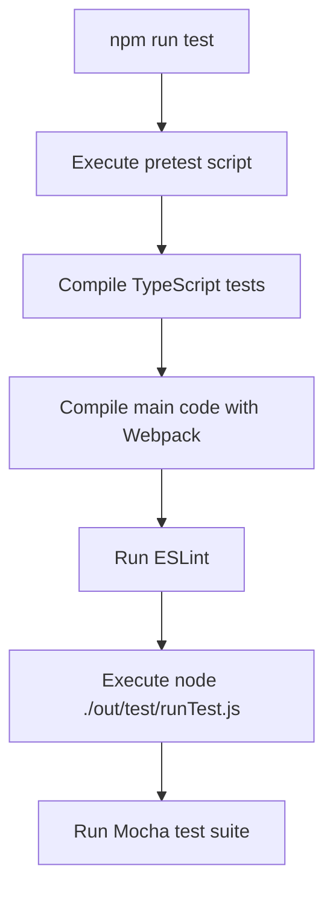
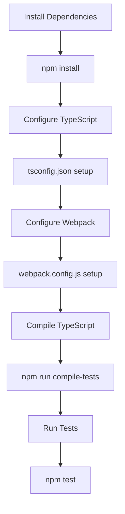

# Test Setup

<cite>
**Referenced Files in This Document**   
- [package.json](file://package.json)
- [tsconfig.json](file://tsconfig.json)
- [webpack.config.js](file://webpack.config.js)
- [src/extension.ts](file://src/extension.ts)
</cite>

## Table of Contents
1. [Introduction](#introduction)
2. [Testing Framework Overview](#testing-framework-overview)
3. [Test Script Configuration](#test-script-configuration)
4. [Development Dependencies](#development-dependencies)
5. [Setup Instructions](#setup-instructions)
6. [Test Execution Pipeline](#test-execution-pipeline)
7. [Webpack Integration](#webpack-integration)
8. [Mocking VS Code APIs](#mocking-vs-code-apis)
9. [External Service Mocking](#external-service-mocking)
10. [Troubleshooting Guide](#troubleshooting-guide)

## Introduction
This document provides comprehensive guidance on setting up the testing environment for CodeKarmic, an AI-powered extension for Git commit code review. The testing infrastructure is built around Mocha as the primary testing framework, with a complete pipeline for compiling TypeScript code and executing tests. The setup includes proper configuration for mocking VS Code APIs and external AI services like the DeepSeek model, enabling thorough unit and integration testing without dependencies on external systems.

## Testing Framework Overview
CodeKarmic utilizes Mocha as its testing framework, providing a robust environment for writing and executing tests. Mocha offers flexible test organization, asynchronous testing capabilities, and extensive assertion library compatibility. The framework is configured to work seamlessly with TypeScript, allowing developers to write tests in TypeScript while maintaining type safety throughout the testing process. The test runner is invoked through a custom script that ensures proper compilation and execution environment setup.

**Section sources**
- [package.json](file://package.json#L291)

## Test Script Configuration
The test execution is managed through npm scripts defined in package.json. The primary test script "test" is configured to run "node ./out/test/runTest.js", which serves as the entry point for the test runner. This script is executed after the "pretest" script, which handles compilation of TypeScript files and linting. The test script configuration ensures that tests are run against compiled JavaScript output, maintaining consistency between development and testing environments.

**Diagram sources**
- [package.json](file://package.json#L289-L291)

**Section sources**
- [package.json](file://package.json#L289-L291)

## Development Dependencies
The testing environment relies on several key development dependencies. These include @types/mocha for TypeScript type definitions of Mocha, @types/node for Node.js type definitions, and @types/vscode for VS Code extension API type definitions. These type definitions enable type-safe testing and provide IntelliSense support during test development. The dependencies are specifically versioned to ensure compatibility with the extension's target VS Code version and Node.js runtime.

**Section sources**
- [package.json](file://package.json#L294-L296)

## Setup Instructions
To set up the testing environment for CodeKarmic, follow these step-by-step instructions:

1. Install all project dependencies by running `npm install`
2. Ensure TypeScript is properly configured in tsconfig.json with appropriate compiler options
3. Verify Webpack configuration in webpack.config.js for proper module resolution
4. Compile the TypeScript code by running `npm run compile-tests` to generate output in the out directory
5. Execute the complete test pipeline using `npm test`

The setup process ensures that all necessary dependencies are installed and configured correctly, providing a stable foundation for test execution.

**Diagram sources**
- [package.json](file://package.json#L287-L288)
- [tsconfig.json](file://tsconfig.json)
- [webpack.config.js](file://webpack.config.js)

**Section sources**
- [package.json](file://package.json#L287-L288)
- [tsconfig.json](file://tsconfig.json)
- [webpack.config.js](file://webpack.config.js)

## Test Execution Pipeline
The test execution pipeline in CodeKarmic follows a structured sequence of operations. When the test command is invoked, npm first executes the "pretest" script, which compiles TypeScript files to JavaScript, runs Webpack to bundle the extension code, and performs linting with ESLint. After successful completion of these preparatory steps, the main test script executes the compiled test runner at ./out/test/runTest.js. This pipeline ensures that tests are always run against the most recent compiled code and that code quality standards are maintained.

**Section sources**
- [package.json](file://package.json#L289-L291)

## Webpack Integration
Webpack plays a crucial role in the testing environment by bundling the extension code and managing module dependencies. The webpack.config.js file is configured with specific settings for the testing environment, including proper module resolution for TypeScript files and exclusion of VS Code APIs as externals. This configuration ensures that the compiled output is compatible with the test runner and that dependencies are resolved correctly during test execution. The Webpack output is directed to the dist directory, which is then used by the test environment.

**Section sources**
- [webpack.config.js](file://webpack.config.js)

## Mocking VS Code APIs
To enable effective testing of extension functionality, CodeKarmic implements mocking of VS Code APIs. This is achieved through the @types/vscode package, which provides type definitions that can be used to create mock implementations of VS Code services and objects. The mocking strategy allows tests to simulate various VS Code environments and user interactions without requiring an actual VS Code instance. This approach enables comprehensive testing of extension commands, UI components, and event handling.

**Section sources**
- [package.json](file://package.json#L296)

## External Service Mocking
The testing environment includes mechanisms for mocking external services such as the DeepSeek AI model. This is essential for reliable and repeatable testing, as it eliminates dependencies on network connectivity and external API availability. The mocking framework allows tests to simulate various response scenarios, including success cases, error conditions, and timeout situations. This enables thorough testing of error handling and resilience features within the extension.

**Section sources**
- [src/extension.ts](file://src/extension.ts)

## Troubleshooting Guide
When setting up the testing environment for CodeKarmic, several common issues may arise:

1. **Missing dependencies**: Ensure all packages are installed by running `npm install` and verifying package.json dependencies.
2. **Compilation errors**: Check tsconfig.json for correct compiler options and ensure TypeScript version compatibility.
3. **Webpack configuration issues**: Verify webpack.config.js for proper entry points and module resolution settings.
4. **Test runner not found**: Confirm that the out directory exists and contains the compiled runTest.js file.
5. **Type definition problems**: Ensure @types packages are correctly installed and version-compatible.

For persistent issues, consult the package.json scripts section to understand the execution flow and verify each step in the pipeline.

**Section sources**
- [package.json](file://package.json)
- [tsconfig.json](file://tsconfig.json)
- [webpack.config.js](file://webpack.config.js)