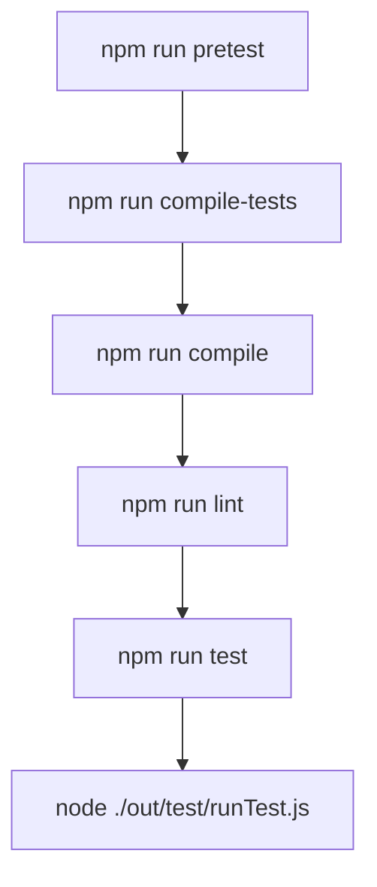

# Testing Strategy

<cite>
**Referenced Files in This Document**   
- [package.json](file://package.json)
- [src/services/ai/aiService.ts](file://src/services/ai/aiService.ts)
- [src/services/git/gitService.ts](file://src/services/git/gitService.ts)
- [src/utils/logger.ts](file://src/utils/logger.ts)
</cite>

## Table of Contents
1. [Introduction](#introduction)
2. [Testing Framework Setup](#testing-framework-setup)
3. [Test Execution Pipeline](#test-execution-pipeline)
4. [Unit Testing Practices](#unit-testing-practices)
5. [Integration Testing Approaches](#integration-testing-approaches)
6. [Test Coverage and Local Execution](#test-coverage-and-local-execution)
7. [Debugging and Test Results](#debugging-and-test-results)
8. [Challenges in Testing VS Code Extensions](#challenges-in-testing-vs-code-extensions)
9. [Conclusion](#conclusion)

## Introduction
CodeKarmic is an AI-powered extension for Git commit code review that integrates with VS Code to provide intelligent code analysis. This document outlines the comprehensive testing strategy for the extension, focusing on the testing framework setup, execution pipeline, and best practices for testing core components like AIService and GitService. The testing approach addresses the unique challenges of testing VS Code extensions, including asynchronous operations, external API interactions, and VS Code API dependencies.

## Testing Framework Setup
CodeKarmic utilizes Mocha as its primary testing framework, configured through the package.json scripts. The testing environment is set up with the necessary dependencies to support both unit and integration testing of the extension's components. The framework is configured to compile TypeScript test files and execute them in a Node.js environment that simulates the VS Code extension host.

The testing framework setup includes the following key components:
- Mocha as the test runner
- TypeScript compilation for test files
- ESLint for code quality checks
- Proper configuration for testing asynchronous operations

**Section sources**
- [package.json](file://package.json#L287-L290)

## Test Execution Pipeline
The test execution pipeline for CodeKarmic is defined in the package.json scripts, providing a streamlined process for compiling, linting, and running tests. The pipeline ensures that tests are executed in the correct order and with the necessary preprocessing steps.

The pipeline consists of the following scripts:
- `compile-tests`: Compiles TypeScript test files to JavaScript
- `watch-tests`: Watches for changes in test files and recompiles them
- `pretest`: Executes compilation, packaging, and linting before running tests
- `lint`: Runs ESLint to check code quality
- `test`: Executes the compiled tests using Node.js

The `test` script runs the compiled test file located at `./out/test/runTest.js`, which serves as the entry point for the test suite. This setup ensures that all tests are properly compiled and that code quality checks are performed before test execution.

**Diagram sources **
- [package.json](file://package.json#L287-L291)

**Section sources**
- [package.json](file://package.json#L287-L291)

## Unit Testing Practices
CodeKarmic's unit testing strategy focuses on testing individual components in isolation, with particular attention to the core services that handle AI interactions and Git operations. The unit tests for AIService and GitService follow best practices for testing asynchronous operations and external API interactions.

### AIService Unit Testing
The AIService is responsible for coordinating AI-powered code reviews and requires careful testing of its asynchronous operations. Unit tests for AIService focus on:
- Testing the reviewCode method with various input scenarios
- Validating error handling for API failures
- Ensuring proper caching of diff content
- Verifying the correct handling of large files

The tests mock external dependencies such as the OpenAI API and VS Code Git extension to isolate the service's functionality. This allows for comprehensive testing of the service's logic without relying on external services.

### GitService Unit Testing
The GitService handles Git repository operations and requires thorough testing of its interaction with the Git command line and VS Code Git API. Unit tests for GitService focus on:
- Testing the getFileDiff method with various file types and scenarios
- Validating the fallback mechanisms when VS Code Git API is unavailable
- Ensuring proper error handling for Git operations
- Verifying the correct parsing of Git command output

The tests use mocking to simulate different Git repository states and VS Code API availability, allowing for comprehensive testing of the service's resilience and error handling.

### Testing Asynchronous Operations
CodeKarmic's services rely heavily on asynchronous operations, particularly when interacting with external APIs. The unit tests employ Mocha's support for promises and async/await syntax to properly test these operations. Tests use timeouts to ensure that asynchronous operations complete within expected timeframes and include comprehensive error handling tests.

### Mocking External Services
To ensure reliable and fast unit tests, CodeKarmic employs mocking strategies for external services:
- The OpenAI API is mocked to simulate various response scenarios
- The VS Code Git API is mocked to test both available and unavailable states
- File system operations are mocked to simulate different file states
- Network requests are mocked to test various response codes and error conditions

This approach allows for comprehensive testing of the extension's behavior under different conditions without relying on external services.

**Section sources**
- [src/services/ai/aiService.ts](file://src/services/ai/aiService.ts#L74-L123)
- [src/services/git/gitService.ts](file://src/services/git/gitService.ts#L707-L794)

## Integration Testing Approaches
CodeKarmic's integration testing strategy focuses on testing the coordination between different services and components, particularly the command handlers that trigger the extension's functionality.

### Command Handler Testing
The integration tests for command handlers verify that the extension's commands properly coordinate the various services to perform their intended functions. These tests focus on:
- Testing the startReview command and its interaction with AIService and GitService
- Validating the generateReport command and its data collection process
- Ensuring proper error handling when commands fail
- Verifying the correct sequence of operations when commands are executed

The tests simulate user interactions with the extension's commands and verify that the expected services are called with the correct parameters.

### Service Coordination Testing
Integration tests for service coordination verify that the various services work together correctly to provide the extension's functionality. These tests focus on:
- Testing the interaction between AIService and GitService during code review
- Validating the flow of data between services
- Ensuring proper error propagation between services
- Verifying the correct handling of edge cases and error conditions

The tests use a combination of mocking and real service instances to test both the integration points and the overall flow of operations.

**Section sources**
- [src/services/ai/aiService.ts](file://src/services/ai/aiService.ts#L74-L123)
- [src/services/git/gitService.ts](file://src/services/git/gitService.ts#L707-L794)

## Test Coverage and Local Execution
CodeKarmic's testing strategy includes comprehensive test coverage expectations and clear instructions for running tests locally.

### Test Coverage Expectations
The extension aims for high test coverage, particularly for core functionality:
- Core services (AIService, GitService) should have >90% test coverage
- Utility functions should have >80% test coverage
- Command handlers should have >95% test coverage
- Error handling paths should be fully covered

The coverage expectations ensure that critical functionality is thoroughly tested and that edge cases are properly handled.

### Running Tests Locally
Developers can run tests locally using the npm scripts defined in package.json:
- `npm run test`: Runs all tests
- `npm run pretest`: Compiles and lints before running tests
- `npm run watch-tests`: Watches for changes and re-runs tests

The local test execution environment is configured to simulate the VS Code extension host, allowing for accurate testing of the extension's behavior.

**Section sources**
- [package.json](file://package.json#L287-L291)

## Debugging and Test Results
CodeKarmic provides guidance on debugging tests and interpreting test results to help developers identify and fix issues.

### Debugging Tests
The extension's test setup supports debugging through:
- Console logging with different log levels
- Detailed error messages and stack traces
- Performance timing for identifying slow operations
- Comprehensive logging of test execution flow

The Logger utility provides consistent logging throughout the application, with support for different log levels and contexts, making it easier to debug test failures.

### Interpreting Test Results
Test results are interpreted based on:
- Test pass/fail status
- Error messages and stack traces
- Performance metrics
- Code coverage reports

The test framework provides detailed output that helps developers understand why tests failed and how to fix the underlying issues.

**Section sources**
- [src/utils/logger.ts](file://src/utils/logger.ts#L8-L62)

## Challenges in Testing VS Code Extensions
Testing VS Code extensions presents unique challenges that CodeKarmic addresses through specific strategies.

### VS Code API Dependencies
The extension depends on VS Code APIs, which are not available in a standard Node.js environment. CodeKarmic addresses this by:
- Mocking VS Code APIs in tests
- Using the VS Code Test framework for integration tests
- Providing stub implementations for VS Code APIs

### Asynchronous Operations
The extension relies heavily on asynchronous operations, which can be challenging to test. CodeKarmic addresses this by:
- Using async/await syntax in tests
- Setting appropriate timeouts
- Using Mocha's support for promises
- Implementing comprehensive error handling tests

### External API Interactions
The extension interacts with external APIs (OpenAI, Git), which can be unreliable for testing. CodeKarmic addresses this by:
- Mocking external APIs
- Using test doubles for API responses
- Implementing retry logic in tests
- Testing error handling for API failures

### Performance Considerations
The extension performs potentially time-consuming operations (code analysis, Git operations). CodeKarmic addresses this by:
- Using performance timing in tests
- Setting appropriate timeouts
- Testing with different data sizes
- Implementing caching strategies

These strategies ensure that the extension is thoroughly tested under various conditions and that performance issues are identified early.

**Section sources**
- [src/services/ai/aiService.ts](file://src/services/ai/aiService.ts#L74-L123)
- [src/services/git/gitService.ts](file://src/services/git/gitService.ts#L707-L794)

## Conclusion
CodeKarmic's testing strategy provides a comprehensive approach to ensuring the quality and reliability of the extension. By leveraging Mocha as the testing framework and implementing a robust test execution pipeline, the project ensures that all components are thoroughly tested. The unit testing practices for core components like AIService and GitService, along with integration testing approaches for command handlers and service coordination, provide confidence in the extension's functionality. The strategies for testing asynchronous operations, external API interactions, and VS Code API dependencies address the unique challenges of testing VS Code extensions. With clear guidance on test coverage, local execution, debugging, and interpreting test results, the testing strategy supports ongoing development and maintenance of the extension.