# Unit Testing

<cite>
**Referenced Files in This Document**
- [src/services/ai/aiService.ts](file://src/services/ai/aiService.ts)
- [src/services/git/gitService.ts](file://src/services/git/gitService.ts)
- [src/utils/logger.ts](file://src/utils/logger.ts)
- [src/services/notification/notificationManager.ts](file://src/services/notification/notificationManager.ts)
- [src/config/appConfig.ts](file://src/config/appConfig.ts)
- [src/utils/fileUtils.ts](file://src/utils/fileUtils.ts)
- [src/utils/retryUtils.ts](file://src/utils/retryUtils.ts)
- [package.json](file://package.json)
- [tsconfig.json](file://tsconfig.json)
</cite>

## Table of Contents
1. [Introduction](#introduction)
2. [Testing Framework Setup](#testing-framework-setup)
3. [Core Service Testing](#core-service-testing)
4. [Dependency Isolation and Mocking](#dependency-isolation-and-mocking)
5. [Asynchronous Testing Patterns](#asynchronous-testing-patterns)
6. [Error Handling and Edge Cases](#error-handling-and-edge-cases)
7. [Utility Class Testing](#utility-class-testing)
8. [Best Practices and Conventions](#best-practices-and-conventions)
9. [Code Coverage and Quality](#code-coverage-and-quality)
10. [Testing Strategies](#testing-strategies)

## Introduction

CodeKarmic employs a comprehensive unit testing strategy built on Mocha as the primary testing framework, utilizing TypeScript for type-safe testing scenarios. The testing approach focuses on isolating core services, mocking external dependencies, and validating both happy path and edge case scenarios.

The testing architecture emphasizes:
- **Service isolation** through dependency injection and mocking
- **Asynchronous operation testing** using modern async/await patterns
- **External API mocking** for AI services and Git operations
- **Comprehensive error handling validation**
- **Maintainable test suites** with clear naming conventions

## Testing Framework Setup

CodeKarmic uses Mocha as its primary testing framework, complemented by TypeScript compilation and Webpack bundling for test execution.

### Framework Configuration

The testing setup includes several key components:

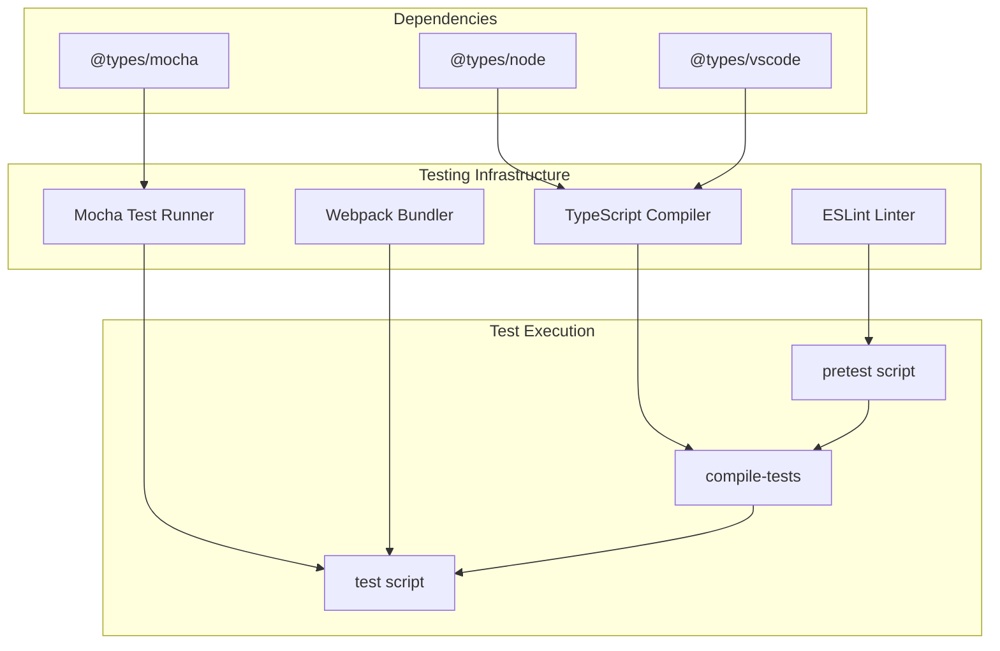

**Diagram sources**
- [package.json](file://package.json#L287-L291)
- [tsconfig.json](file://tsconfig.json#L1-L19)

### Test Scripts and Workflow

The testing workflow follows a structured approach:

1. **Preparation Phase**: Compile TypeScript tests and lint code
2. **Compilation Phase**: Transform test files to JavaScript
3. **Execution Phase**: Run tests using Mocha runner
4. **Quality Assurance**: Validate code quality and coverage

**Section sources**
- [package.json](file://package.json#L287-L291)

## Core Service Testing

### AIService Testing Strategy

The AIService represents the core AI-powered code review functionality and requires sophisticated testing approaches due to its reliance on external AI APIs and complex state management.

#### Service Initialization and Configuration

Testing AIService initialization involves verifying proper dependency injection and configuration loading:

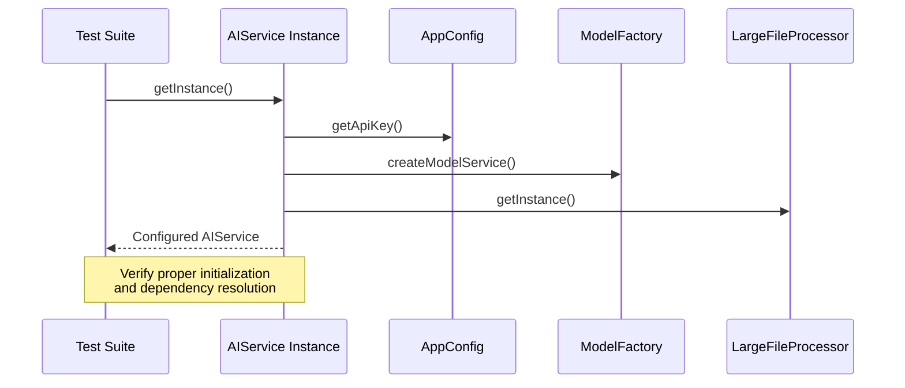

**Diagram sources**
- [src/services/ai/aiService.ts](file://src/services/ai/aiService.ts#L40-L72)

#### Code Review Request Testing

The `reviewCode` method serves as the primary entry point for code review operations, requiring comprehensive testing of various scenarios:

| Test Scenario | Input Conditions | Expected Behavior | Validation Points |
|---------------|------------------|-------------------|-------------------|
| Successful Review | Valid file, API key, AI service ready | Returns CodeReviewResult with suggestions | Verify suggestions array, score, diff content |
| API Key Missing | Valid file, no API key configured | Throws initialization error | Error handling validation |
| Large File Processing | File size > threshold, compression enabled | Uses LargeFileProcessor | Compression workflow verification |
| Diff Generation Failure | Git service unavailable | Falls back to simple diff | Fallback mechanism testing |
| AI Service Timeout | Network timeout during API call | Graceful error handling | Timeout and retry logic |

#### Batch Processing Testing

The batch review capability requires specialized testing for concurrent operations and result aggregation:

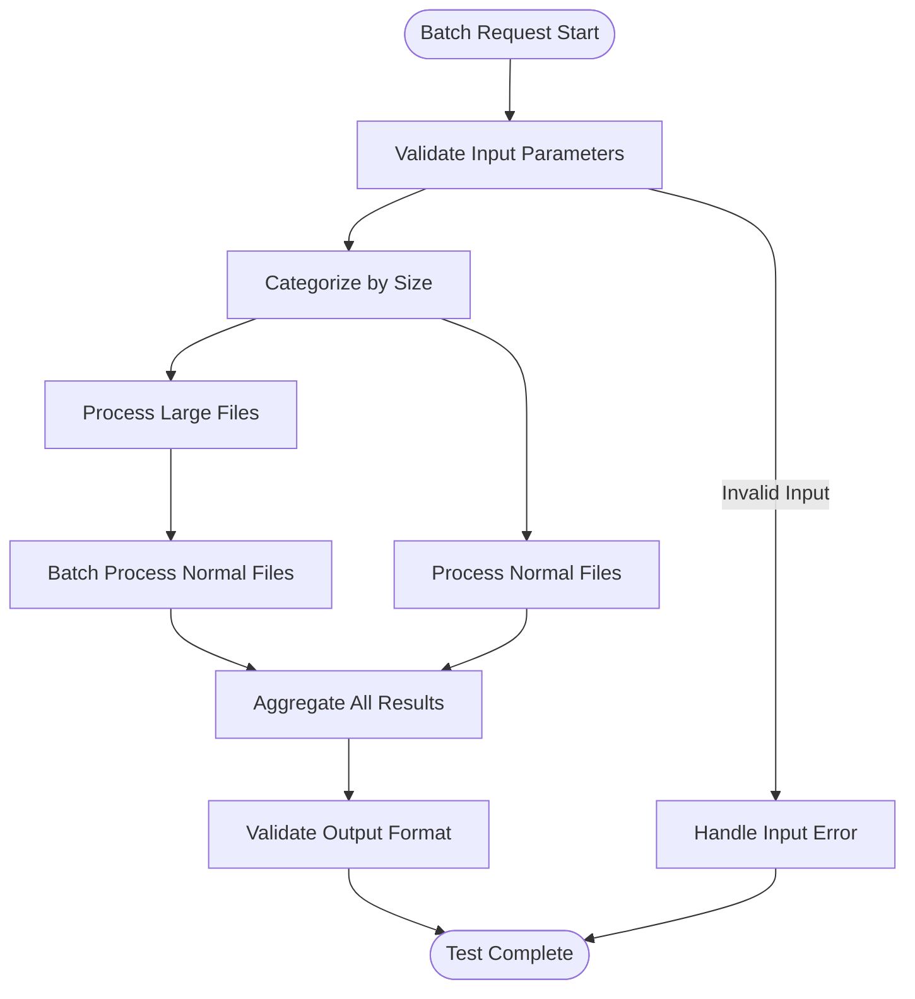

**Diagram sources**
- [src/services/ai/aiService.ts](file://src/services/ai/aiService.ts#L431-L552)

**Section sources**
- [src/services/ai/aiService.ts](file://src/services/ai/aiService.ts#L74-L119)
- [src/services/ai/aiService.ts](file://src/services/ai/aiService.ts#L431-L552)

### GitService Testing Approach

The GitService handles complex Git operations with multiple fallback strategies and error handling mechanisms.

#### Repository Initialization Testing

Testing Git repository initialization involves verifying path validation and service readiness:

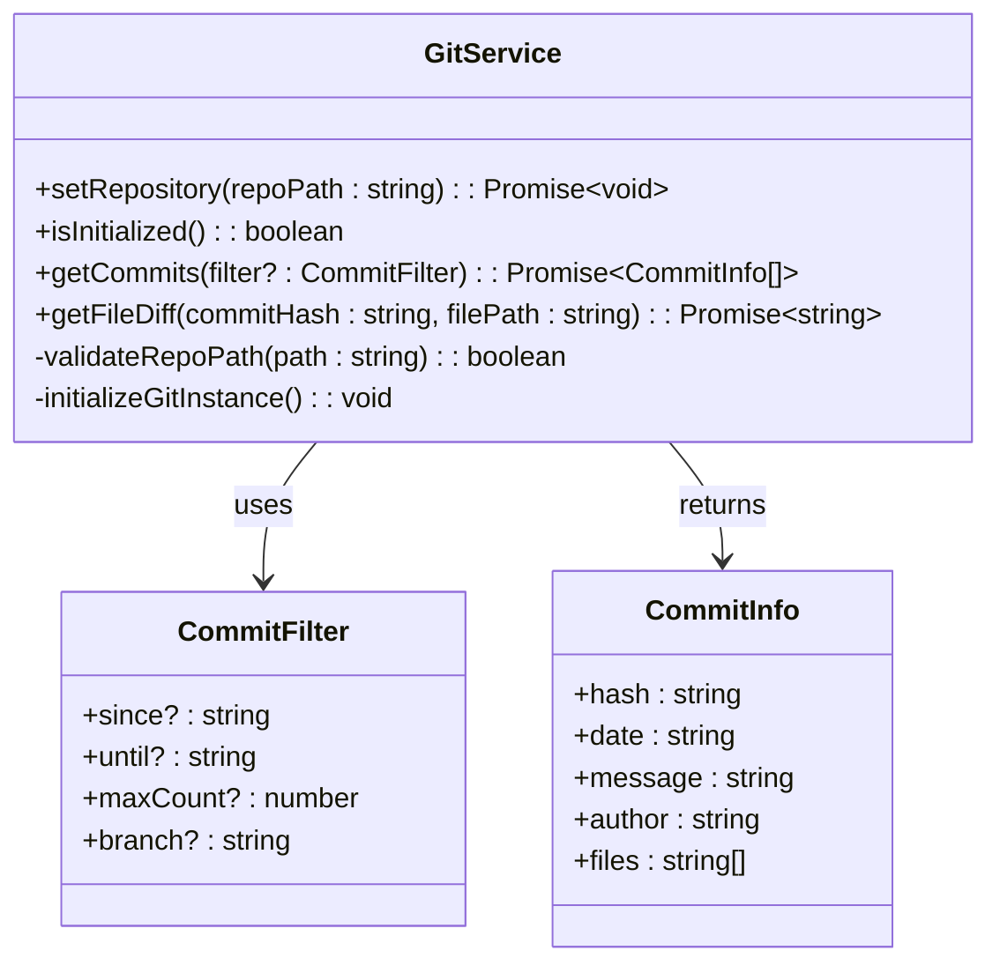

**Diagram sources**
- [src/services/git/gitService.ts](file://src/services/git/gitService.ts#L45-L89)
- [src/services/git/gitService.ts](file://src/services/git/gitService.ts#L12-L26)

#### Git Operation Testing Scenarios

The GitService implements multiple strategies for Git operations, requiring comprehensive testing:

| Strategy | Method | Testing Focus | Mock Dependencies |
|----------|--------|---------------|-------------------|
| VS Code Git API | `getVSCodeGitDiff()` | Extension availability and API calls | VS Code extension mock |
| Direct Git Commands | `getDirectCommandDiff()` | Command execution and parsing | Child process mock |
| Simple Git Library | `getFileDiff()` | Library integration and error handling | SimpleGit mock |
| Fallback Mechanisms | Various methods | Graceful degradation and error recovery | Multiple dependency mocks |

**Section sources**
- [src/services/git/gitService.ts](file://src/services/git/gitService.ts#L367-L406)
- [src/services/git/gitService.ts](file://src/services/git/gitService.ts#L410-L670)

## Dependency Isolation and Mocking

### External API Mocking

CodeKarmic relies heavily on external APIs, particularly AI services and Git operations. Effective mocking strategies are crucial for reliable unit testing.

#### AI Service Mocking Patterns

For AI service testing, the approach involves mocking the underlying model service and API responses:

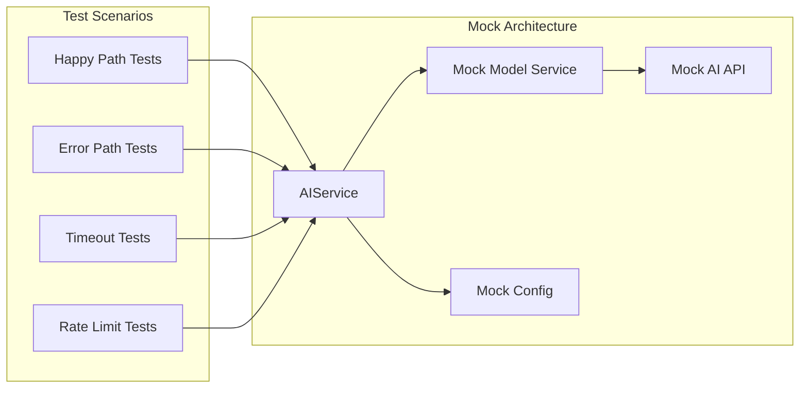

**Diagram sources**
- [src/services/ai/aiService.ts](file://src/services/ai/aiService.ts#L42-L62)

#### Git Service Mocking Strategies

Git operations require careful mocking to simulate various repository states and Git configurations:

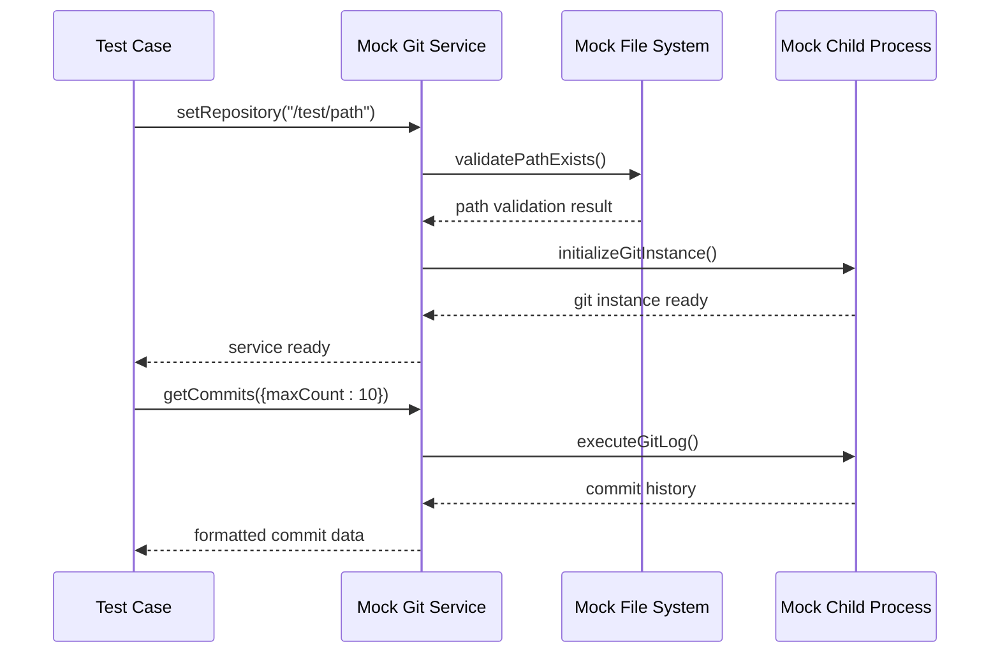

**Diagram sources**
- [src/services/git/gitService.ts](file://src/services/git/gitService.ts#L64-L107)

### Service Layer Mocking

Core services often depend on other services, requiring hierarchical mocking approaches:

| Service Level | Mocking Strategy | Implementation Pattern | Testing Benefits |
|---------------|------------------|----------------------|------------------|
| External APIs | HTTP interceptors | Request/response mocks | Isolated API testing |
| Database Operations | In-memory stores | Memory-based persistence | Fast, deterministic tests |
| File System | Virtual file systems | Mock file operations | Cross-platform compatibility |
| Configuration | Environment variables | Dynamic configuration | Environment-specific testing |

**Section sources**
- [src/services/ai/aiService.ts](file://src/services/ai/aiService.ts#L42-L62)
- [src/services/git/gitService.ts](file://src/services/git/gitService.ts#L64-L107)

## Asynchronous Testing Patterns

### Modern Async/Await Testing

CodeKarmic extensively uses asynchronous operations, requiring robust async testing patterns.

#### Promise-Based Testing

The primary async testing pattern involves Promise-based operations with proper error handling:

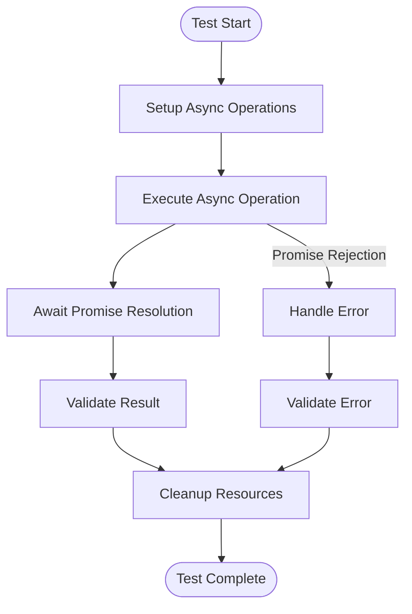

**Diagram sources**
- [src/services/ai/aiService.ts](file://src/services/ai/aiService.ts#L74-L119)

#### Concurrent Operation Testing

Batch processing and concurrent operations require specialized testing approaches:

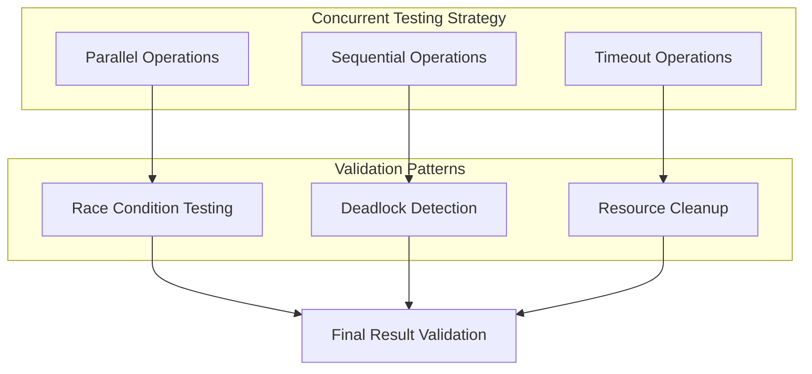

**Diagram sources**
- [src/services/ai/aiService.ts](file://src/services/ai/aiService.ts#L431-L552)

### Error Propagation Testing

Asynchronous error handling requires careful testing of error propagation and recovery mechanisms:

| Error Type | Testing Approach | Validation Points | Recovery Strategy |
|------------|------------------|-------------------|-------------------|
| Network Timeout | Mock timeout responses | Timeout detection, retry logic | Exponential backoff |
| API Rate Limit | Simulate rate limit errors | Rate limit handling, queue management | Delayed retry |
| Service Unavailable | Mock service failures | Graceful degradation | Fallback mechanisms |
| Authentication Error | Invalid credential responses | Security validation, error reporting | Credential refresh |

**Section sources**
- [src/services/ai/aiService.ts](file://src/services/ai/aiService.ts#L74-L119)
- [src/services/ai/aiService.ts](file://src/services/ai/aiService.ts#L431-L552)

## Error Handling and Edge Cases

### Comprehensive Error Testing

CodeKarmic implements extensive error handling across all service layers, requiring thorough edge case testing.

#### Error Classification and Testing

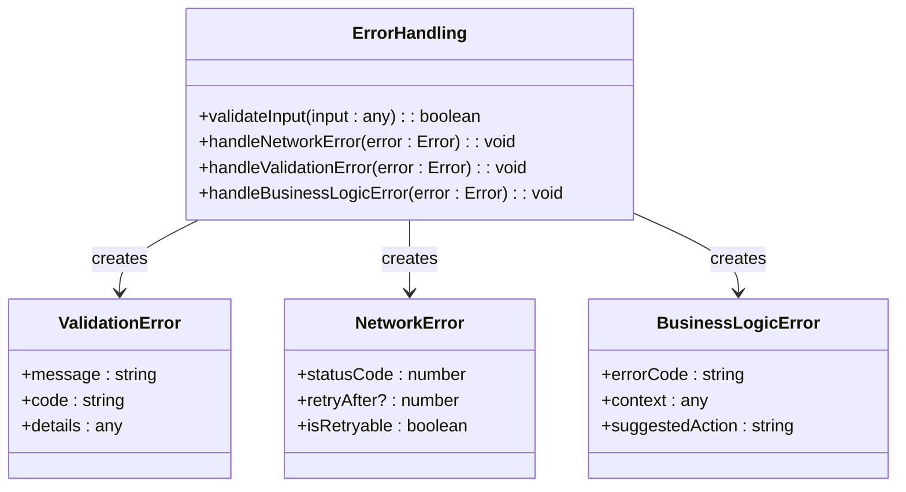

**Diagram sources**
- [src/services/ai/aiService.ts](file://src/services/ai/aiService.ts#L691-L709)
- [src/services/git/gitService.ts](file://src/services/git/gitService.ts#L800-L811)

#### Edge Case Scenarios

Critical edge cases require focused testing approaches:

| Edge Case Category | Specific Scenarios | Testing Strategy | Expected Outcomes |
|-------------------|-------------------|------------------|-------------------|
| Input Validation | Null/undefined inputs, malformed data | Boundary testing | Proper error messages, graceful degradation |
| Resource Exhaustion | Memory limits, file size limits | Stress testing | Resource cleanup, error reporting |
| Network Instability | Intermittent connectivity, slow responses | Chaos testing | Resilience validation, recovery mechanisms |
| Configuration Errors | Missing API keys, invalid URLs | Configuration testing | Default fallbacks, clear error messages |

### Retry Logic Testing

The retry utilities provide sophisticated retry mechanisms that require comprehensive testing:

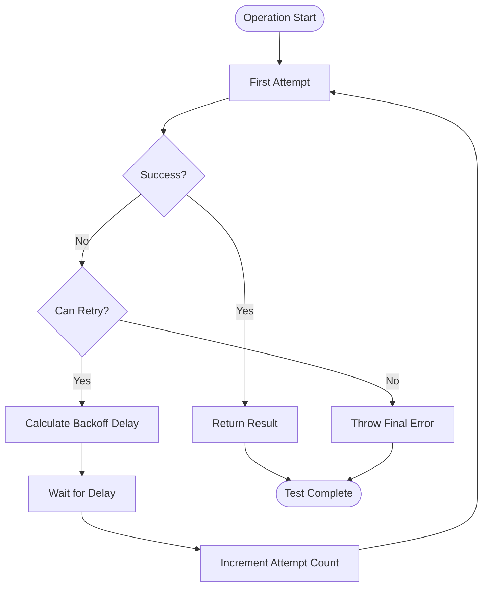

**Diagram sources**
- [src/utils/retryUtils.ts](file://src/utils/retryUtils.ts#L25-L70)

**Section sources**
- [src/services/ai/aiService.ts](file://src/services/ai/aiService.ts#L691-L709)
- [src/services/git/gitService.ts](file://src/services/git/gitService.ts#L800-L811)
- [src/utils/retryUtils.ts](file://src/utils/retryUtils.ts#L25-L116)

## Utility Class Testing

### Logger Testing Patterns

The Logger utility class requires testing of log level filtering, output formatting, and context management.

#### Logger Functionality Testing

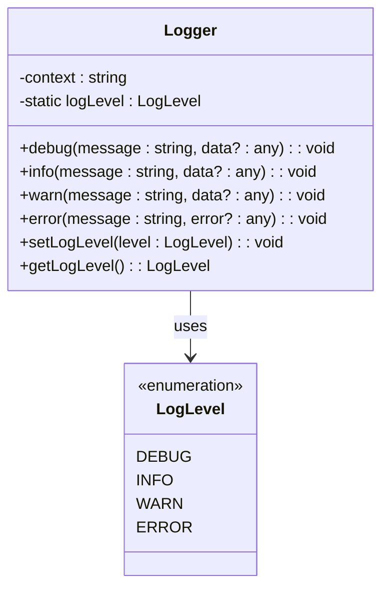

**Diagram sources**
- [src/utils/logger.ts](file://src/utils/logger.ts#L8-L88)

#### Logger Test Scenarios

Logger testing focuses on log level filtering and output validation:

| Log Level | Test Focus | Validation Points | Expected Behavior |
|-----------|------------|-------------------|-------------------|
| DEBUG | Debug message filtering | Message suppression below DEBUG level | Messages filtered appropriately |
| INFO | Standard logging | Timestamp formatting, context inclusion | Proper message formatting |
| WARN | Warning message handling | Warning indicator presence | Warning-specific formatting |
| ERROR | Error message processing | Error context preservation | Error details maintained |

### File Utilities Testing

File utility functions require testing of file type detection and language identification:

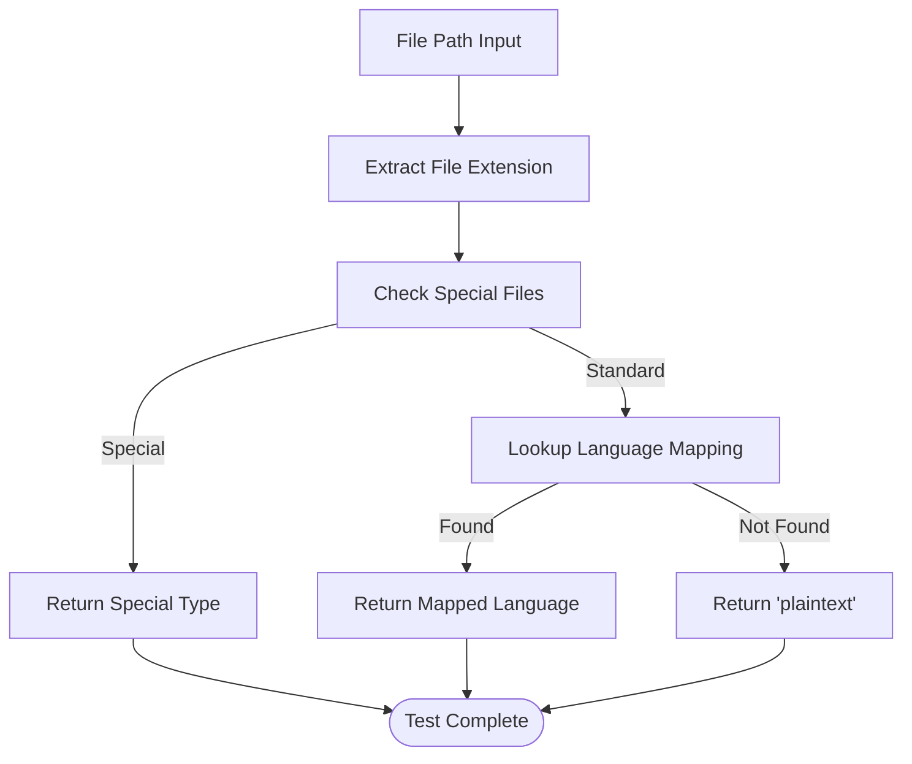

**Diagram sources**
- [src/utils/fileUtils.ts](file://src/utils/fileUtils.ts#L50-L108)

**Section sources**
- [src/utils/logger.ts](file://src/utils/logger.ts#L8-L88)
- [src/utils/fileUtils.ts](file://src/utils/fileUtils.ts#L26-L108)

## Best Practices and Conventions

### Test Naming Conventions

CodeKarmic follows established naming conventions for test readability and maintainability:

#### Descriptive Test Names

Test names should clearly describe the scenario being tested:

- ✅ `should return valid commit list when repository has commits`
- ✅ `should handle network timeout gracefully with retry logic`
- ❌ `test1` - Too generic and uninformative
- ❌ `test2` - Provides no context about the test's purpose

#### Test Organization Patterns

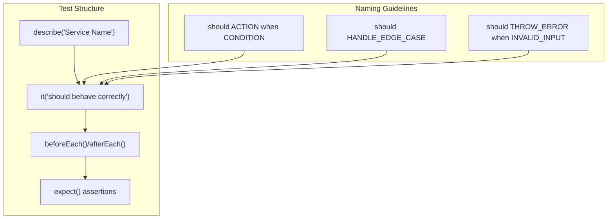

### Setup and Teardown Patterns

Proper test isolation requires effective setup and teardown strategies:

#### Test Isolation Strategies

| Pattern | Use Case | Implementation | Benefits |
|---------|----------|----------------|----------|
| beforeEach | Common setup tasks | Shared initialization code | Consistent test state |
| afterEach | Cleanup operations | Resource deallocation | Prevent memory leaks |
| beforeAll | Heavy initialization | Expensive setup once | Faster test execution |
| afterAll | Global cleanup | System-wide cleanup | Clean test environment |

### Assertion Patterns

CodeKarmic employs comprehensive assertion patterns for reliable test validation:

#### Assertion Categories

```mermaid
graph LR
subgraph "Assertion Types"
Equality[Equality Assertions]
Type[Type Assertions]
Property[Property Assertions]
Error[Error Assertions]
end
subgraph "Assertion Methods"
Expect[expect(value)]
Should[should assertions]
Assert[assert library]
Custom[Custom matchers]
end
Equality --> Expect
Type --> Should
Property --> Assert
Error --> Custom
```

**Section sources**
- [src/utils/logger.ts](file://src/utils/logger.ts#L45-L88)
- [src/services/git/gitService.ts](file://src/services/git/gitService.ts#L64-L107)

## Code Coverage and Quality

### Coverage Metrics and Standards

CodeKarmic maintains high code coverage standards across all service layers:

#### Coverage Targets

| Component Type | Minimum Coverage | Target Coverage | Measurement Tool |
|----------------|------------------|-----------------|------------------|
| Core Services | 85% | 90% | Istanbul/NYC |
| Utility Functions | 90% | 95% | Istanbul/NYC |
| Error Handling | 95% | 98% | Istanbul/NYC |
| Configuration | 80% | 85% | Istanbul/NYC |

### Quality Assurance Pipeline

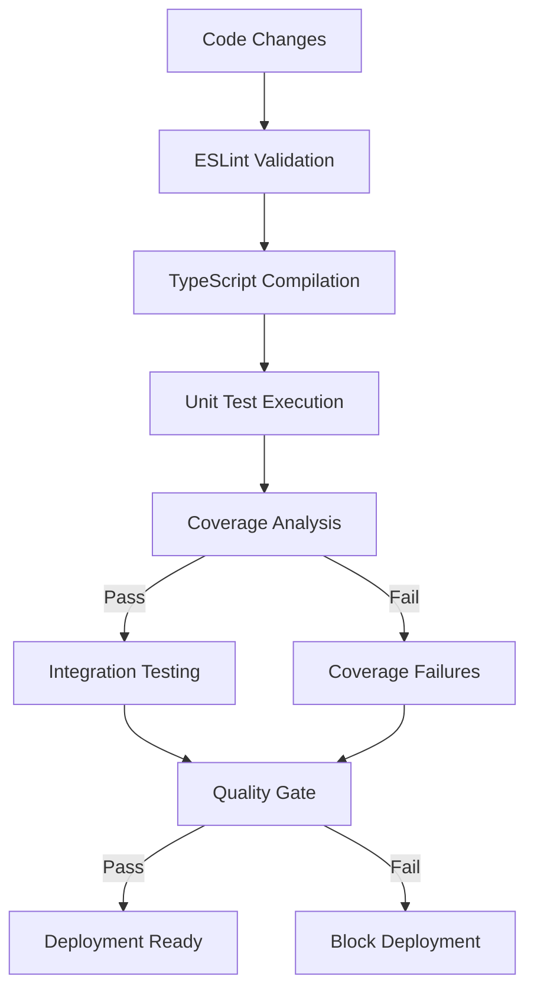

**Diagram sources**
- [package.json](file://package.json#L287-L291)

**Section sources**
- [package.json](file://package.json#L287-L291)
- [tsconfig.json](file://tsconfig.json#L1-L19)

## Testing Strategies

### Service Layer Testing Approaches

CodeKarmic employs multiple testing strategies depending on the service complexity and external dependencies.

#### Integration Testing Patterns

For services with significant external dependencies, integration testing provides essential validation:

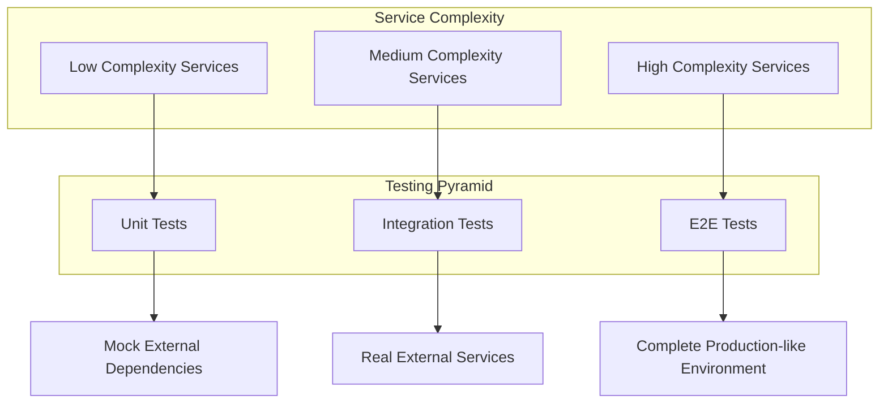

#### Performance Testing Considerations

Asynchronous operations and batch processing require performance-focused testing:

| Performance Metric | Testing Approach | Validation Criteria | Tools |
|-------------------|------------------|---------------------|-------|
| Response Time | Timing measurements | Sub-second response for small files | Performance profiling |
| Throughput | Load testing | 100+ requests per minute | Load testing tools |
| Memory Usage | Resource monitoring | Constant memory footprint | Memory profilers |
| Concurrency | Parallel execution | Thread safety, race condition prevention | Concurrency testing |

### Continuous Integration Testing

CodeKarmic integrates testing into CI/CD pipelines for automated quality assurance:

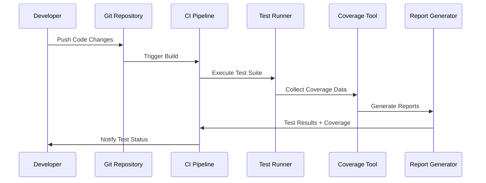

**Diagram sources**
- [package.json](file://package.json#L287-L291)

**Section sources**
- [package.json](file://package.json#L287-L291)
- [src/services/ai/aiService.ts](file://src/services/ai/aiService.ts#L431-L552)
- [src/services/git/gitService.ts](file://src/services/git/gitService.ts#L367-L406)