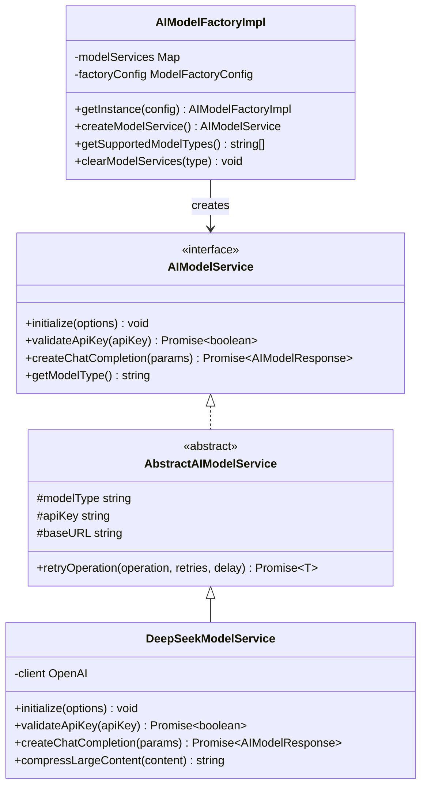
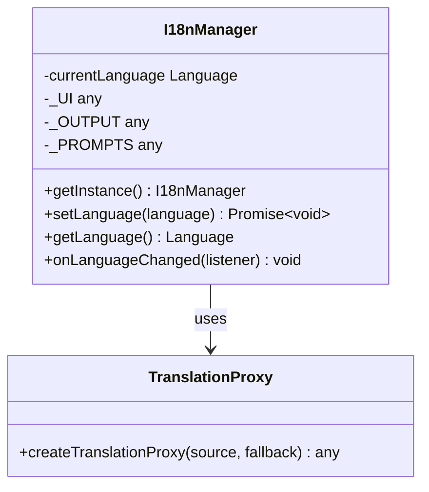
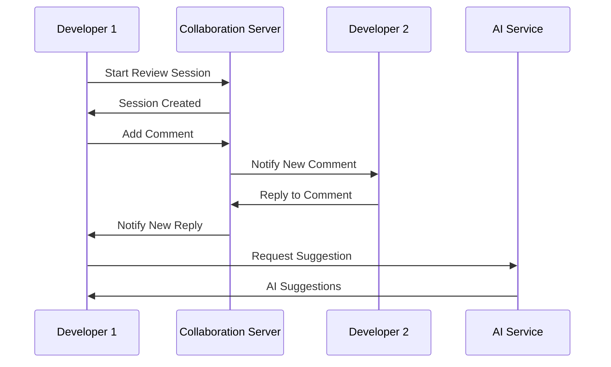
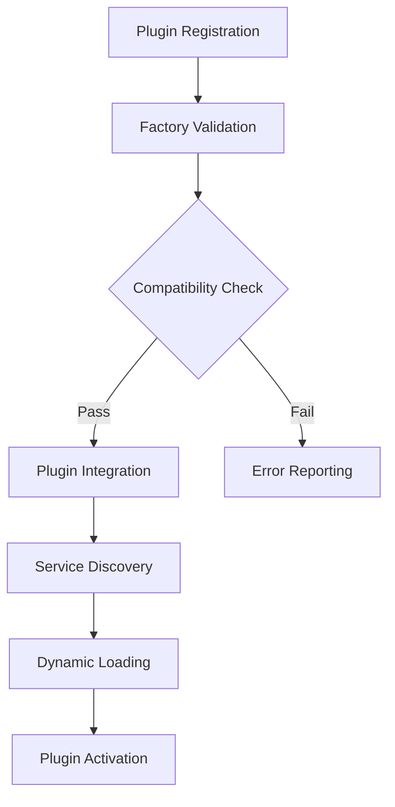

# Future Roadmap

<cite>
**Referenced Files in This Document**
- [README.md](file://README.md)
- [package.json](file://package.json)
- [src/models/providers/deepseek.ts](file://src/models/providers/deepseek.ts)
- [src/models/baseModel.ts](file://src/models/baseModel.ts)
- [src/models/modelFactory.ts](file://src/models/modelFactory.ts)
- [src/models/modelInterface.ts](file://src/models/modelInterface.ts)
- [src/models/types.ts](file://src/models/types.ts)
- [src/services/git/gitService.ts](file://src/services/git/gitService.ts)
- [src/core/compression/largeFileProcessor.ts](file://src/core/compression/largeFileProcessor.ts)
- [src/core/compression/contentCompressor.ts](file://src/core/compression/contentCompressor.ts)
- [src/i18n/index.ts](file://src/i18n/index.ts)
- [src/ui/views/reviewPanel.ts](file://src/ui/views/reviewPanel.ts)
- [src/services/review/reviewManager.ts](file://src/services/review/reviewManager.ts)
- [src/config/appConfig.ts](file://src/config/appConfig.ts)
- [src/utils/fileUtils.ts](file://src/utils/fileUtils.ts)
- [src/core/review/suggestionGenerator.ts](file://src/core/review/suggestionGenerator.ts)
- [src/core/review/reviewTypes.ts](file://src/core/review/reviewTypes.ts)
</cite>

## Table of Contents
1. [Introduction](#introduction)
2. [Current Architecture Foundation](#current-architecture-foundation)
3. [Short-Term Roadmap (0-6 months)](#short-term-roadmap-0-6-months)
4. [Mid-Term Roadmap (6-12 months)](#mid-term-roadmap-6-12-months)
5. [Long-Term Vision (12+ months)](#long-term-vision-12-months)
6. [Extensibility Framework](#extensibility-framework)
7. [Community Contributions](#community-contributions)
8. [Technical Infrastructure](#technical-infrastructure)
9. [Implementation Timeline](#implementation-timeline)

## Introduction

CodeKarmic is positioned as an AI-powered code review assistant for VS Code derivatives, built on a robust foundation that emphasizes extensibility, modularity, and user-centric design. This roadmap outlines the strategic evolution of the platform, focusing on expanding AI capabilities, enhancing collaboration features, and building a comprehensive ecosystem that serves developers across diverse workflows and organizational needs.

The current v0.2.0 release establishes foundational capabilities including Git integration, AI-powered code analysis, and multilingual support. Building upon this foundation, the roadmap charts a clear path toward becoming a comprehensive code quality and collaboration platform.

## Current Architecture Foundation

### Pluggable Model Architecture

The system's strength lies in its pluggable model architecture, exemplified by the DeepSeek provider implementation and the abstract model service interface. This design enables seamless integration of multiple AI providers without breaking existing functionality.

**Diagram sources**
- [src/models/modelInterface.ts](file://src/models/modelInterface.ts#L35-L117)
- [src/models/providers/deepseek.ts](file://src/models/providers/deepseek.ts#L11-L211)
- [src/models/modelFactory.ts](file://src/models/modelFactory.ts#L19-L140)

### Internationalization System

The i18n framework demonstrates sophisticated localization capabilities with automatic fallback mechanisms and dynamic language switching, essential for global adoption.

**Diagram sources**
- [src/i18n/index.ts](file://src/i18n/index.ts#L75-L188)

### Large File Processing Capabilities

The compression and processing system showcases advanced handling of large codebases, with intelligent content summarization and token optimization.

**Section sources**
- [src/core/compression/largeFileProcessor.ts](file://src/core/compression/largeFileProcessor.ts#L23-L242)
- [src/core/compression/contentCompressor.ts](file://src/core/compression/contentCompressor.ts#L131-L157)

## Short-Term Roadmap (0-6 months)

### AI Provider Expansion

#### Immediate Priority: Claude Integration
**Objective:** Add Anthropic's Claude models as first-class AI providers alongside DeepSeek and OpenAI.

**Implementation Strategy:**
- Extend `AIModelService` interface to support Claude-specific parameters
- Implement Claude adapter following DeepSeek pattern
- Add Claude-specific prompt engineering optimizations
- Integrate with Claude's streaming capabilities for real-time feedback

**Technical Requirements:**
- Update model factory to handle Claude authentication
- Modify prompt templates for Claude's conversational style
- Implement Claude-specific rate limiting and error handling

#### Gemini Integration
**Objective:** Leverage Google's Gemini models for enhanced multimodal code analysis.

**Implementation Strategy:**
- Develop Gemini adapter with vision capabilities for UI element analysis
- Implement hybrid text+image analysis for complex code structures
- Add Gemini-specific safety filtering and content moderation

### Enhanced Security Analysis

#### Vulnerability Detection Engine
**Objective:** Build comprehensive security analysis capabilities integrated with AI models.

**Features:**
- Automated vulnerability scanning with AI-driven prioritization
- Static analysis integration for deeper security insights
- Compliance checking against industry standards (OWASP, NIST)

**Implementation Approach:**
- Extend `SuggestionCategory` with security-specific classifications
- Implement threat modeling integration
- Add automated remediation suggestions

#### Real-Time Security Monitoring
**Objective:** Continuous security monitoring during development cycles.

**Capabilities:**
- Live code analysis for security violations
- Integration with security scanners (SonarQube, Snyk)
- Automated security gate enforcement

### Improved Large File Handling

#### Advanced Compression Algorithms
**Objective:** Optimize processing of extremely large codebases.

**Technologies:**
- Implement machine learning-based content summarization
- Add intelligent chunking strategies for distributed processing
- Develop caching mechanisms for frequently analyzed patterns

**Section sources**
- [src/core/compression/largeFileProcessor.ts](file://src/core/compression/largeFileProcessor.ts#L1-L242)

## Mid-Term Roadmap (6-12 months)

### Real-Time Collaborative Review

#### Multi-User Review Sessions
**Objective:** Enable simultaneous code review participation across teams.

**Features:**
- Real-time collaborative editing of review comments
- Shared suggestion pools with voting mechanisms
- Activity streams showing reviewer interactions

**Technical Architecture:**

#### Shared Review Workspaces
**Objective:** Create persistent review environments for team collaboration.

**Capabilities:**
- Persistent review sessions across development cycles
- Version-aware suggestion tracking
- Integration with project management tools

### CI/CD Pipeline Integration

#### Automated Review Pipelines
**Objective:** Seamless integration with continuous integration systems.

**Integration Points:**
- GitHub Actions workflow integration
- Jenkins plugin development
- Azure DevOps extension creation

**Pipeline Features:**
- Pre-commit code quality gates
- Automated pull request reviews
- Quality metric tracking and reporting

#### Deployment Safety Analysis
**Objective:** Analyze deployment impact and suggest safety improvements.

**Capabilities:**
- Deployment risk assessment
- Rollback strategy recommendations
- Production issue prediction

### Enhanced Customization Framework

#### Rule Engine Development
**Objective:** Allow organizations to define custom review rules.

**Features:**
- Configurable rule sets for different codebases
- Machine learning-based rule optimization
- Team-specific customization capabilities

**Implementation Strategy:**
- Develop DSL for rule definition
- Implement rule engine with performance optimization
- Create visual rule editor interface

**Section sources**
- [src/core/review/suggestionGenerator.ts](file://src/core/review/suggestionGenerator.ts#L1-L336)

## Long-Term Vision (12+ months)

### Enterprise Code Quality Platform

#### Comprehensive Code Analytics
**Objective:** Transform CodeKarmic into a full-fledged code quality platform.

**Analytics Capabilities:**
- Historical trend analysis across projects
- Team productivity metrics
- Code quality evolution tracking

#### Advanced AI Capabilities

##### Predictive Code Analysis
**Objective:** Anticipate code quality issues before they become problems.

**Technologies:**
- Machine learning models trained on code quality datasets
- Pattern recognition for emerging anti-patterns
- Proactive suggestion delivery

##### Domain-Specific Expertise
**Objective:** Specialized analysis for different technology domains.

**Domains:**
- Web development (React, Angular, Vue)
- Mobile development (iOS, Android)
- Backend services (microservices, APIs)
- DevOps and infrastructure code

### Extensible Plugin Ecosystem

#### Third-Party Integrations
**Objective:** Enable community-driven extensions and integrations.

**Integration Areas:**
- IDE plugins for Eclipse, IntelliJ, and other editors
- Browser extensions for online code repositories
- Desktop applications for offline analysis

#### Marketplace Development
**Objective:** Create a marketplace for code quality tools and integrations.

**Features:**
- Certified tool listings
- Community rating and review system
- Automated testing for plugin compatibility

### Global Scale Infrastructure

#### Distributed Processing
**Objective:** Handle enterprise-scale codebases efficiently.

**Infrastructure:**
- Cloud-native architecture with auto-scaling
- Edge computing for regional processing
- Hybrid cloud deployment options

#### Multi-Tenant Architecture
**Objective:** Support enterprise deployment with isolation and compliance.

**Security Features:**
- Data encryption at rest and in transit
- Role-based access control
- Audit logging and compliance reporting

## Extensibility Framework

### Plugin Architecture

The current model factory pattern demonstrates excellent extensibility principles that will scale to accommodate future plugins and integrations.

### API Evolution Strategy

#### Versioned Extensions
**Objective:** Maintain backward compatibility while enabling innovation.

**Approach:**
- Semantic versioning for plugin APIs
- Deprecation timelines for legacy features
- Migration assistance tools

#### Event-Driven Architecture
**Objective:** Enable loose coupling between components.

**Event Types:**
- Code analysis events
- Review lifecycle events
- System state change events

**Section sources**
- [src/models/modelFactory.ts](file://src/models/modelFactory.ts#L19-L140)

## Community Contributions

### Language Pack Development

#### Existing Language Support
The current system supports multiple programming languages with extensible file type detection.

**Current Languages:**
- JavaScript/TypeScript
- Python, Java, Go
- C/C++, C#
- PHP, Ruby, Swift
- HTML, CSS, SQL

#### Community Language Packs
**Objective:** Enable community contributions for new language support.

**Requirements:**
- Standardized language pack format
- Automated testing framework
- Documentation guidelines

### IDE Integration Projects

#### VS Code Extensions
**Objective:** Expand beyond VS Code to other popular editors.

**Target Platforms:**
- JetBrains IDEs (IntelliJ IDEA, WebStorm)
- Eclipse with LSP support
- Vim/Neovim with language server protocol

#### Browser Extensions
**Objective:** Enable code review capabilities directly in browser-based development environments.

**Features:**
- GitHub/GitLab integration
- Online code playground support
- Cross-platform accessibility

### Contributing Guidelines

#### Code Standards
**Objective:** Maintain high code quality across community contributions.

**Standards:**
- TypeScript strict mode compliance
- Comprehensive unit testing
- Documentation requirements

#### Review Process
**Objective:** Ensure quality and consistency of community contributions.

**Process:**
- Automated CI/CD pipeline
- Peer review requirements
- Performance benchmarking

**Section sources**
- [src/utils/fileUtils.ts](file://src/utils/fileUtils.ts#L1-L109)

## Technical Infrastructure

### Scalability Architecture

#### Microservices Design
**Objective:** Enable horizontal scaling for high-volume code review scenarios.

**Service Boundaries:**
- Analysis service for AI processing
- Storage service for review data
- Notification service for updates
- Authentication service for access control

#### Container Orchestration
**Objective:** Deploy and manage CodeKarmic at enterprise scale.

**Technology Stack:**
- Kubernetes for orchestration
- Docker containers for isolation
- Helm charts for deployment management

### Data Management

#### Review Data Persistence
**Objective:** Store and manage review data efficiently.

**Storage Solutions:**
- Relational databases for structured data
- Object storage for large files
- Caching layers for performance

#### Analytics Infrastructure
**Objective:** Support advanced analytics and reporting capabilities.

**Analytics Tools:**
- ELK stack for log analysis
- Prometheus for metrics collection
- Grafana for dashboard visualization

### Security Infrastructure

#### Access Control
**Objective:** Implement robust security measures for enterprise deployment.

**Security Features:**
- OAuth 2.0 integration
- JWT token validation
- Role-based permissions

#### Data Protection
**Objective:** Ensure sensitive code remains secure.

**Protection Measures:**
- End-to-end encryption
- Secure deletion protocols
- Audit trail maintenance

**Section sources**
- [src/config/appConfig.ts](file://src/config/appConfig.ts#L1-L189)

## Implementation Timeline

### Phase 1: Foundation Enhancement (Months 1-3)
- **Week 1-2:** AI provider expansion planning
- **Week 3-6:** Claude integration implementation
- **Week 7-8:** Gemini integration planning
- **Week 9-12:** Security analysis framework development

### Phase 2: Core Feature Development (Months 4-6)
- **Week 13-16:** Real-time collaboration features
- **Week 17-20:** CI/CD pipeline integration
- **Week 21-24:** Enhanced customization framework

### Phase 3: Enterprise Features (Months 7-9)
- **Week 25-28:** Enterprise analytics capabilities
- **Week 29-32:** Plugin ecosystem development
- **Week 33-36:** Multi-tenant architecture

### Phase 4: Platform Expansion (Months 10-12)
- **Week 37-40:** Global infrastructure deployment
- **Week 41-44:** Third-party integration development
- **Week 45-48:** Marketplace launch preparation

### Continuous Development
- **Ongoing:** Community contribution management
- **Ongoing:** Performance optimization
- **Ongoing:** Security updates and compliance

This roadmap positions CodeKarmic as a leading platform for AI-powered code review and collaboration, with clear milestones and extensibility points that enable continued growth and innovation. The modular architecture ensures that each phase builds upon the previous without disrupting existing functionality, maintaining stability while driving forward progress.