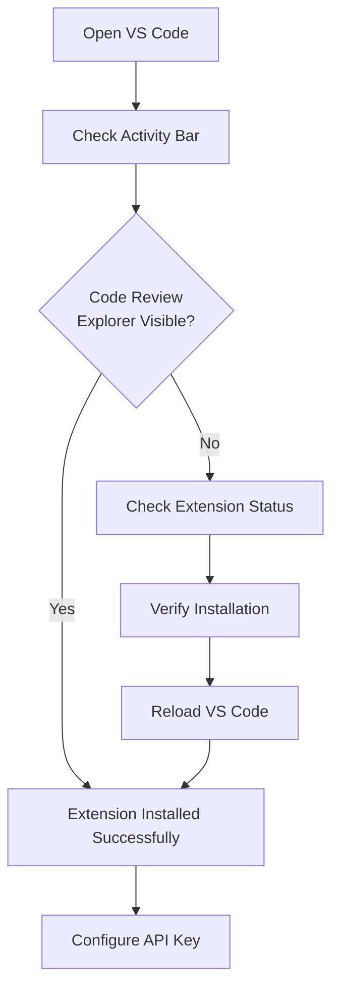
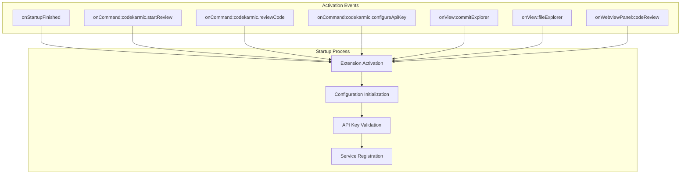
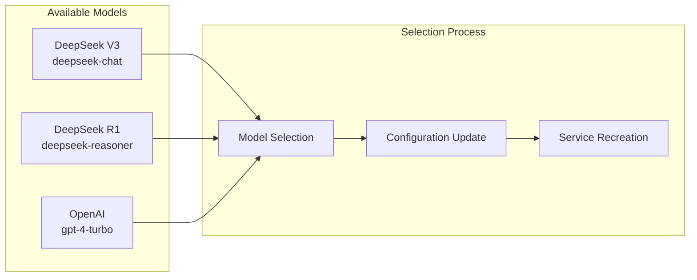
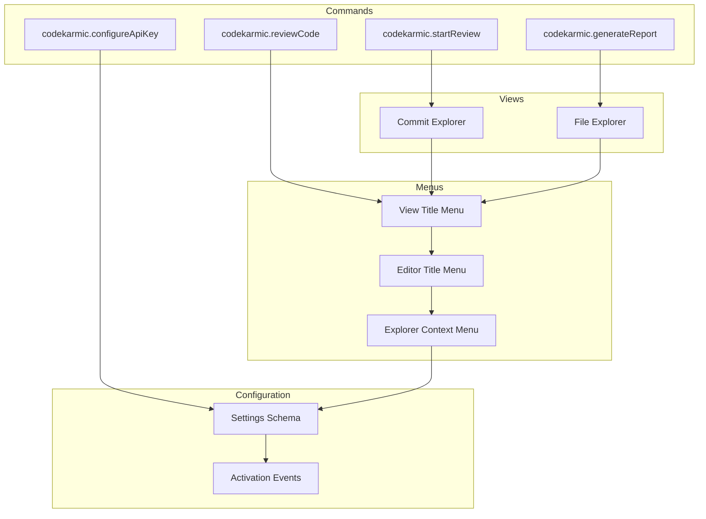
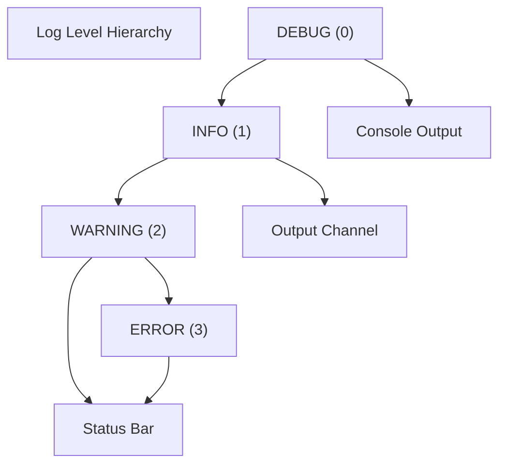

# Installation and Setup

<cite>
**Referenced Files in This Document**
- [package.json](file://package.json)
- [src/extension.ts](file://src/extension.ts)
- [src/config/appConfig.ts](file://src/config/appConfig.ts)
- [src/services/ai/aiService.ts](file://src/services/ai/aiService.ts)
- [src/models/types.ts](file://src/models/types.ts)
- [src/models/providers/deepseek.ts](file://src/models/providers/deepseek.ts)
- [src/services/notification/notificationManager.ts](file://src/services/notification/notificationManager.ts)
- [src/utils/logger.ts](file://src/utils/logger.ts)
- [src/i18n/index.ts](file://src/i18n/index.ts)
- [README.md](file://README.md)
</cite>

## Table of Contents
1. [Prerequisites](#prerequisites)
2. [Installation from VS Code Marketplace](#installation-from-vs-code-marketplace)
3. [Manual Installation](#manual-installation)
4. [Activation Events and Startup Process](#activation-events-and-startup-process)
5. [Essential Configuration](#essential-configuration)
6. [API Key Configuration](#api-key-configuration)
7. [Advanced Configuration Options](#advanced-configuration-options)
8. [Integration with VS Code Contribution Model](#integration-with-vs-code-contribution-model)
9. [Common Issues and Troubleshooting](#common-issues-and-troubleshooting)
10. [Debug Mode and Logging](#debug-mode-and-logging)
11. [Best Practices](#best-practices)

## Prerequisites

Before installing CodeKarmic, ensure your development environment meets the following requirements:

### VS Code Version Compatibility
- **Minimum VS Code Version**: 1.85.0 or higher
- **Recommended**: Latest stable VS Code version
- **Platform Support**: Windows, macOS, Linux

### Network Access Requirements
- **Internet Connectivity**: Required for AI model communication
- **API Endpoint Access**: 
  - Default: `https://api.deepseek.com/v1`
  - Alternative: Custom AI provider endpoints
- **Firewall Configuration**: Allow outbound HTTPS connections

### Development Environment (Optional)
- **Node.js**: Required for local development and testing
- **npm/yarn**: Package manager for development dependencies
- **TypeScript**: For development and compilation

**Section sources**
- [package.json](file://package.json#L12-L14)

## Installation from VS Code Marketplace

The easiest way to install CodeKarmic is through the VS Code Marketplace:

### Step-by-Step Installation Process

1. **Open VS Code Extensions Panel**
   - Press `Ctrl+Shift+X` (Windows/Linux) or `Cmd+Shift+X` (macOS)
   - Alternatively, click the Extensions icon in the Activity Bar

2. **Search for CodeKarmic**
   - Type "CodeKarmic" in the search bar
   - Look for the official extension by "nesnilnehc"

3. **Install the Extension**
   - Click the "Install" button
   - Wait for the installation to complete

4. **Reload VS Code**
   - Click "Reload Required" when prompted
   - Alternatively, manually reload by pressing `Ctrl+Shift+P` and typing "Reload Window"

### Verification Steps

After installation, verify the extension is properly installed:



**Diagram sources**
- [src/extension.ts](file://src/extension.ts#L20-L30)

**Section sources**
- [README.md](file://README.md#L8-L15)

## Manual Installation

For development or offline scenarios, you can install CodeKarmic manually:

### Download and Install Process

1. **Download the Extension Package**
   ```bash
   # From GitHub releases or build locally
   npm install
   npm run package
   ```

2. **Install from VSIX File**
   ```bash
   code --install-extension codekarmic-x.x.x.vsix
   ```

3. **Development Installation**
   ```bash
   # Clone the repository
   git clone https://github.com/nesnilnehc/codekarmic.git
   cd codekarmic
   
   # Install dependencies
   npm install
   
   # Build the extension
   npm run compile
   ```

**Section sources**
- [package.json](file://package.json#L283-L292)

## Activation Events and Startup Process

CodeKarmic uses VS Code's activation events system to optimize performance and resource usage:

### Activation Triggers

The extension activates under several conditions:



**Diagram sources**
- [package.json](file://package.json#L26-L34)
- [src/extension.ts](file://src/extension.ts#L20-L30)

### Startup Sequence

When VS Code starts, the extension follows this initialization process:

1. **Extension Activation**
   - VS Code triggers the `activate()` function
   - Initializes notification manager and logging system
   - Sets up configuration listeners

2. **Configuration Loading**
   - Loads current settings from VS Code configuration
   - Validates model type and other critical settings

3. **API Key Verification**
   - Checks if API key is configured
   - Prompts user for API key if missing
   - Validates API key with AI service

4. **Service Initialization**
   - Creates Git service instances
   - Registers tree data providers
   - Sets up command handlers

**Section sources**
- [src/extension.ts](file://src/extension.ts#L20-L30)
- [src/config/appConfig.ts](file://src/config/appConfig.ts#L49-L82)

## Essential Configuration

CodeKarmic provides comprehensive configuration options through VS Code's settings system:

### Configuration Schema

The extension contributes the following configuration properties:

| Setting | Type | Default | Description |
|---------|------|---------|-------------|
| `codekarmic.apiKey` | string | "" | API key for AI service |
| `codekarmic.debugMode` | boolean | false | Enable debug mode |
| `codekarmic.modelType` | string | "deepseek-reasoner" | AI model to use |
| `codekarmic.openaiHost` | string | "https://api.deepseek.com/v1" | AI service endpoint |
| `codekarmic.maxFileSizeKb` | number | 100 | Maximum file size for review |
| `codekarmic.excludeFileTypes` | array | Various | File types to exclude |

### Configuration Scope

The extension uses different configuration scopes:

- **Machine Scope**: API keys and sensitive credentials
- **User Scope**: Personal preferences and settings
- **Workspace Scope**: Project-specific configurations

**Section sources**
- [package.json](file://package.json#L118-L208)
- [src/config/appConfig.ts](file://src/config/appConfig.ts#L37-L42)

## API Key Configuration

Proper API key configuration is crucial for CodeKarmic to function:

### Method 1: Using the Configure Command

1. **Access the Configure Command**
   - Press `Ctrl+Shift+P` (Windows/Linux) or `Cmd+Shift+P` (macOS)
   - Type "CodeKarmic: Configure API Key"
   - Select the command from the list

2. **Enter Your API Key**
   - A secure input box will appear
   - Paste your DeepSeek API key
   - The extension will validate the key automatically

3. **Validation Process**
   ```mermaid
sequenceDiagram
participant User as "User"
participant VSCode as "VS Code"
participant AIService as "AI Service"
participant DeepSeek as "DeepSeek API"
User->>VSCode : Execute configure command
VSCode->>User : Show input box
User->>VSCode : Enter API key
VSCode->>AIService : Validate API key
AIService->>DeepSeek : Test API connectivity
DeepSeek-->>AIService : Validation response
AIService-->>VSCode : Validation result
VSCode-->>User : Success/failure notification
```

**Diagram sources**
- [src/extension.ts](file://src/extension.ts#L82-L97)
- [src/services/ai/aiService.ts](file://src/services/ai/aiService.ts#L712-L736)

### Method 2: Direct Settings Configuration

1. **Open Settings**
   - Press `Ctrl+,` (Windows/Linux) or `Cmd+,` (macOS)
   - Search for "CodeKarmic"

2. **Configure API Key**
   - Find the "CodeKarmic: API Key" setting
   - Enter your API key in the input field
   - The extension will automatically validate and store it

### API Key Validation

The extension performs automatic validation:

- **Network Connectivity**: Tests API endpoint accessibility
- **Authentication**: Verifies API key validity
- **Rate Limiting**: Checks for rate limit compliance
- **Error Handling**: Provides meaningful error messages

**Section sources**
- [src/extension.ts](file://src/extension.ts#L38-L66)
- [src/services/ai/aiService.ts](file://src/services/ai/aiService.ts#L712-L736)

## Advanced Configuration Options

Beyond basic setup, CodeKarmic offers extensive customization:

### Model Configuration

Choose from available AI models:



**Diagram sources**
- [src/models/types.ts](file://src/models/types.ts#L10-L21)
- [src/extension.ts](file://src/extension.ts#L522-L536)

### File Filtering

Customize which files are included in code reviews:

- **Default Exclusions**: Binary files, compiled binaries, IDE files
- **Custom Patterns**: Add project-specific exclusions
- **Size Limits**: Control maximum file sizes for performance

### Performance Tuning

Optimize for different scenarios:

- **Max File Size**: Adjust based on your system's memory
- **Concurrent Requests**: Manage API call concurrency
- **Caching**: Configure response caching strategies

**Section sources**
- [package.json](file://package.json#L143-L208)
- [src/models/types.ts](file://src/models/types.ts#L10-L41)

## Integration with VS Code Contribution Model

CodeKarmic deeply integrates with VS Code's extension ecosystem:

### Package.json Contributions

The extension contributes various VS Code features:



**Diagram sources**
- [package.json](file://package.json#L37-L281)

### Activation Events

VS Code loads the extension based on these triggers:

- **Startup Completion**: `onStartupFinished`
- **Command Execution**: Specific CodeKarmic commands
- **View Interaction**: Commit and file explorer views
- **Webview Panels**: Code review panels

### Extension Points

CodeKarmic registers as:

- **Tree Data Providers**: For commit and file exploration
- **Command Handlers**: For all user interactions
- **Configuration Contributors**: For settings management
- **View Containers**: For integrated UI components

**Section sources**
- [package.json](file://package.json#L26-L34)
- [src/extension.ts](file://src/extension.ts#L74-L81)

## Common Issues and Troubleshooting

### Missing API Key

**Problem**: Extension fails to start or API calls fail
**Solution**: 
1. Run "CodeKarmic: Configure API Key" command
2. Enter valid API key from DeepSeek
3. Verify network connectivity

### Incorrect Model Host

**Problem**: API requests fail with host-related errors
**Solution**:
1. Check `codekarmic.openaiHost` setting
2. Verify endpoint accessibility
3. Contact support if using custom endpoints

### Network Connectivity Issues

**Problem**: Cannot connect to AI services
**Solution**:
1. Check firewall settings
2. Verify proxy configuration
3. Test with different network

### Performance Issues

**Problem**: Slow code reviews or high memory usage
**Solution**:
1. Reduce `codekarmic.maxFileSizeKb`
2. Exclude unnecessary file types
3. Enable debug mode for diagnostics

### Configuration Conflicts

**Problem**: Settings not taking effect
**Solution**:
1. Check configuration scope (global vs workspace)
2. Reset to defaults if corrupted
3. Verify JSON syntax in settings

**Section sources**
- [src/extension.ts](file://src/extension.ts#L38-L66)
- [src/services/ai/aiService.ts](file://src/services/ai/aiService.ts#L712-L736)

## Debug Mode and Logging

CodeKarmic provides comprehensive debugging capabilities:

### Enabling Debug Mode

1. **Via Settings**: Set `codekarmic.debugMode` to `true`
2. **Command Line**: Use development launch configuration
3. **Environment Variable**: Set `CODEKARMIC_DEBUG=true`

### Logging Levels

The extension supports multiple log levels:



**Diagram sources**
- [src/utils/logger.ts](file://src/utils/logger.ts#L8-L13)
- [src/services/notification/notificationManager.ts](file://src/services/notification/notificationManager.ts#L101-L128)

### Debug Information Collection

When debug mode is enabled:

- **Console Logs**: Detailed execution traces
- **Network Requests**: API call information
- **Configuration State**: Current settings dump
- **Error Context**: Stack traces and error details

### Troubleshooting Workflow

1. **Enable Debug Mode**: Turn on debug logging
2. **Reproduce Issue**: Perform the problematic action
3. **Check Output**: Review CodeKarmic output channel
4. **Analyze Logs**: Look for error patterns
5. **Report Issues**: Use collected information for support

**Section sources**
- [src/services/notification/notificationManager.ts](file://src/services/notification/notificationManager.ts#L123-L128)
- [src/utils/logger.ts](file://src/utils/logger.ts#L18-L62)

## Best Practices

### Security Considerations

- **API Key Management**: Store keys securely, avoid sharing
- **Network Security**: Use HTTPS endpoints only
- **Access Control**: Limit API key permissions appropriately

### Performance Optimization

- **File Selection**: Exclude large binary files
- **Batch Processing**: Review multiple files efficiently
- **Resource Monitoring**: Watch memory and CPU usage

### Development Workflow

- **Testing**: Use debug mode during development
- **Configuration**: Maintain separate settings for different projects
- **Updates**: Keep extension updated for latest features

### Team Collaboration

- **Shared Configuration**: Establish team standards
- **Documentation**: Document custom configurations
- **Support**: Share troubleshooting experiences

**Section sources**
- [src/config/appConfig.ts](file://src/config/appConfig.ts#L112-L128)
- [src/services/notification/notificationManager.ts](file://src/services/notification/notificationManager.ts#L31-L70)