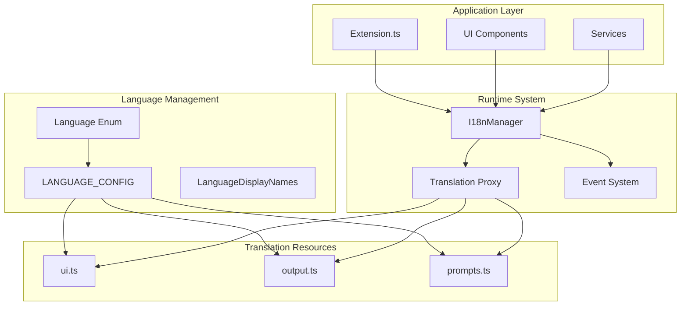
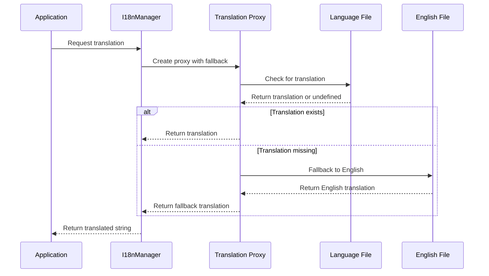

# Adding New Languages

<cite>
**Referenced Files in This Document**
- [src/i18n/types.ts](file://src/i18n/types.ts)
- [src/i18n/index.ts](file://src/i18n/index.ts)
- [src/i18n/en/ui.ts](file://src/i18n/en/ui.ts)
- [src/i18n/en/output.ts](file://src/i18n/en/output.ts)
- [src/i18n/en/prompts.ts](file://src/i18n/en/prompts.ts)
- [src/i18n/zh/ui.ts](file://src/i18n/zh/ui.ts)
- [src/i18n/zh/output.ts](file://src/i18n/zh/output.ts)
- [src/i18n/zh/prompts.ts](file://src/i18n/zh/prompts.ts)
- [src/config/appConfig.ts](file://src/config/appConfig.ts)
- [package.json](file://package.json)
- [src/extension.ts](file://src/extension.ts)
</cite>

## Table of Contents
1. [Introduction](#introduction)
2. [System Architecture](#system-architecture)
3. [Step-by-Step Guide](#step-by-step-guide)
4. [Implementation Details](#implementation-details)
5. [Best Practices](#best-practices)
6. [Common Issues and Solutions](#common-issues-and-solutions)
7. [Testing and Validation](#testing-and-validation)
8. [Maintenance Guidelines](#maintenance-guidelines)

## Introduction

The CodeKarmic extension implements a sophisticated internationalization (i18n) system that supports multiple languages with automatic fallback mechanisms. This documentation provides comprehensive guidance for adding new languages to the system, ensuring seamless integration with the existing architecture while maintaining translation quality and user experience consistency.

The i18n system is built around a Proxy-based fallback mechanism that automatically handles incomplete translations by defaulting to English content when specific translations are missing. This approach ensures that users always receive meaningful content regardless of their language preference.

## System Architecture

The i18n system follows a modular architecture with clear separation of concerns:



**Diagram sources**
- [src/i18n/types.ts](file://src/i18n/types.ts#L4-L7)
- [src/i18n/index.ts](file://src/i18n/index.ts#L25-L37)
- [src/i18n/index.ts](file://src/i18n/index.ts#L75-L131)

**Section sources**
- [src/i18n/types.ts](file://src/i18n/types.ts#L1-L36)
- [src/i18n/index.ts](file://src/i18n/index.ts#L1-L188)

## Step-by-Step Guide

### Step 1: Add New Language Code to Language Enum

Modify the `Language` enum in [`src/i18n/types.ts`](file://src/i18n/types.ts#L4-L7):

```typescript
export enum Language {
    ENGLISH = 'en',
    CHINESE = 'zh',
    FRENCH = 'fr'  // Add new language code
}
```

### Step 2: Create Language Directory Structure

Create a new directory under [`src/i18n/`](file://src/i18n/) for the new language:

```bash
mkdir src/i18n/fr/
```

Create the required translation files with the same structure as English:

#### 2.1 Create [`src/i18n/fr/ui.ts`](file://src/i18n/fr/ui.ts)

```typescript
export const UI = {
    BUTTONS: {
        REVIEW: 'Examiner le code',
        ADD_COMMENT: 'Ajouter un commentaire',
        REQUEST_AI_REVIEW: 'Demander une révision IA',
        GENERATE_REPORT: 'Générer un rapport',
        CONFIGURE_API_KEY: 'Configurer la clé API',
        OPEN_SETTINGS: 'Ouvrir les paramètres'
    },
    TABS: {
        COMMENTS: 'Commentaires',
        AI_SUGGESTIONS: 'Suggestions IA',
        ADD_COMMENT: 'Ajouter un commentaire'
    },
    PLACEHOLDERS: {
        COMMENT: 'Entrez votre commentaire ici...',
        LINE_NUMBER: 'Numéro de ligne',
        API_KEY: 'Entrez votre clé API',
        START_DATE: 'Entrez la date de début (AAAA-MM-JJ)',
        END_DATE: 'Entrez la date de fin (AAAA-MM-JJ)',
        DATE_FORMAT: 'ex. 2023-01-01',
        COMMIT_ID: 'Entrez l\'ID du commit ou préfixe de hachage',
        COMMIT_ID_PREFIX: 'ex. a1b2c3d',
        SELECT_BRANCH: 'Sélectionnez une branche pour filtrer les commits',
        SELECT_MODEL: 'Sélectionnez le modèle IA pour l\'examen du code'
    },
    TITLES: {
        BRANCH_SELECTION: 'Sélection de la branche',
        MODEL_SELECTION: 'Sélection du modèle IA'
    },
    MESSAGES: {
        NO_COMMENTS: 'Aucun commentaire pour l\'instant. Ajoutez un commentaire ou demandez une révision IA.',
        NO_AI_SUGGESTIONS: 'Aucune suggestion IA pour l\'instant. Cliquez sur "Demander une révision IA" pour analyser ce fichier.',
        CODE_QUALITY_SCORE: (score: string): string => `Score de qualité du code : ${score}/10`,
        INVALID_COMMENT: 'Veuillez entrer un commentaire',
        INVALID_LINE_NUMBER: 'Veuillez entrer un numéro de ligne valide',
        NO_COMMIT_SELECTED: 'Veuillez d\'abord sélectionner un commit',
        NO_WORKSPACE: 'Aucun dossier d\'espace de travail ouvert',
        NOT_GIT_REPO: 'L\'espace de travail actuel n\'est pas un dépôt Git',
        API_KEY_SUCCESS: 'Clé API configurée avec succès !',
        API_KEY_INVALID: 'Clé API invalide. Veuillez vérifier votre clé et réessayer.',
        API_KEY_MISSING: 'Clé API non configurée. Veuillez configurer votre clé API pour utiliser les fonctionnalités d\'examen du code.',
        ERROR_OPENING_PANEL: (error: string): string => `Erreur lors de l\'ouverture du panneau d\'examen : ${error}`,
        ERROR_GENERATING_REPORT: (error: string): string => `Erreur lors de la génération du rapport : ${error}`,
        ERROR_START_REVIEW: (error: string): string => `Erreur lors du démarrage de l\'examen : ${error}`,
        ERROR_REVIEWING_CODE: (error: string): string => `Erreur lors de l\'examen du code : ${error}`,
        REPORT_GENERATED: (hash: string): string => `Rapport généré pour le commit : ${hash}`,
        ERROR_FILTERING_COMMITS: (error: string): string => `Erreur lors du filtrage des commits : ${error}`,
        ERROR_DATE_FILTER: (error: string): string => `Erreur lors de la configuration du filtre de dates : ${error}`,
        ERROR_COMMIT_FILTER: (error: string): string => `Erreur lors de la configuration du filtre d\'ID de commit : ${error}`,
        ERROR_BRANCH_FILTER: (error: string): string => `Erreur lors de la configuration du filtre de branche : ${error}`,
        ERROR_GIT_DEBUG: (error: string): string => `Erreur lors du débogage Git : ${error}`,
        REFRESHING_COMMITS: 'Actualisation des commits...',
        COMMITS_REFRESHED: 'Liste des commits actualisée',
        FILES_REFRESHED: 'Liste des fichiers actualisée',
        COMMIT_SELECTED: 'Commit sélectionné',
        SELECT_COMMIT_FIRST: 'Veuillez d\'abord sélectionner un commit',
        FILTERING_COMMITS: 'Filtrage des commits...',
        COMMITS_FILTERED: 'Commits filtrés par plage de dates',
        COMMITS_FILTERED_BY_ID: 'Commits filtrés par ID',
        COMMITS_FILTERED_BY_BRANCH: 'Commits filtrés par branche',
        CODE_REVIEW_STARTED: 'Examen du code commencé'
    },
    PANEL: {
        CODE_REVIEW_TITLE: (filePath: string): string => `Examen du code : ${filePath}`,
        COMMIT_INFO: (hash: string, message: string): string => `Commit : ${hash} - ${message}`,
        AUTHOR_INFO: (author: string, date: string): string => `Auteur : ${author} - ${date}`
    }
};
```

#### 2.2 Create [`src/i18n/fr/output.ts`](file://src/i18n/fr/output.ts)

```typescript
export const OUTPUT = {
    EXTENSION: {
        ACTIVATE: 'L\'extension CodeKarmic est maintenant active',
        DEACTIVATE: 'L\'extension CodeKarmic est maintenant désactivée'
    },
    REVIEW: {
        REVIEW_START: 'Démarrage de l\'examen du code :',
        REVIEW_COMPLETE: 'Analyse du code terminée :',
        REVIEW_ERROR: 'Échec de l\'examen du code :',
        REVIEW_IN_PROGRESS: 'Examen du code en cours...',
        REVIEW_SUCCESS: 'Examen du code réussi :',
        REVIEW_FAILED: 'Échec de l\'examen du code avec erreurs :',
        CODE_ANALYSIS_FAILED: 'Échec de l\'analyse du code :',
        REVIEWING_FILES: 'Examen des fichiers...',
        AI_ANALYSIS: 'Exécution de l\'analyse IA...',
        NO_COMMIT_SELECTED: 'Aucun commit sélectionné',
        NO_REVIEW_DATA: (path: string): string => `Aucune donnée d'examen disponible pour le fichier : ${path}`,
        REPORT_GENERATION_FAILED: 'Échec de génération du rapport d\'examen',
        LARGE_FILE_COMPRESSION: 'Compression du fichier volumineux pour une analyse plus efficace...',
        AI_SERVICE_NOT_INITIALIZED: 'Service de modèle IA non initialisé',
        EMPTY_DIFF_CONTENT: 'Contenu de différence vide ou invalide',
        FILE_TYPE_NOT_SUPPORTED: (path: string): string => `Type de fichier non supporté pour l'examen du code : ${path}`,
        FULL_FILE_ANALYSIS_START: 'Début de l\'analyse complète du fichier...',
        FULL_FILE_ANALYSIS_COMPLETE: (length: number): string => `Analyse complète du fichier terminée, longueur de réponse : ${length}`,
        DIFF_ANALYSIS_START: 'Début de l\'analyse de différence...',
        DIFF_ANALYSIS_COMPLETE: (length: number): string => `Analyse de différence terminée, longueur de réponse : ${length}`
    },
    REPOSITORY: {
        REPO_INIT: (repoPath: string): string => `Initialisé avec le dépôt : ${repoPath}`,
        REPO_COMMIT_SELECT: 'Commit sélectionné :',
        REPO_COMMIT_NONE: 'Aucun commit sélectionné',
        INITIALIZE_REPO: 'Initialisation du dépôt :',
        SELECT_COMMIT: (commitId: string, message: string): string => `Sélection du commit : ${commitId} (${message})`,
        NO_COMMIT: 'Aucun commit sélectionné',
        USING_CACHED_COMMIT: 'Utilisation du commit mis en cache :',
        REPORT_IN_PROGRESS: 'La génération du rapport est déjà en cours, veuillez patienter...',
        REPO_NOT_FOUND: (path: string): string => `Dépôt non trouvé au chemin : ${path}`,
        COMMIT_NOT_FOUND: (hash: string): string => `Commit non trouvé : ${hash}`,
        DIFF_GENERATION_FAILED: (path: string): string => `Échec de génération de différence pour le fichier : ${path}`,
        FILE_CONTENT_UNAVAILABLE: 'Contenu du fichier indisponible',
        BRANCH_NOT_FOUND: (branch: string): string => `Branche non trouvée : ${branch}`,
        NOT_GIT_REPOSITORY: 'L\'espace de travail actuel n\'est pas un dépôt Git',
        NO_WORKSPACE_FOLDER: 'Aucun dossier d\'espace de travail ouvert',
        REFRESHING_COMMITS: 'Actualisation des commits...',
        REFRESH_COMMITS_ERROR: 'Échec de l\'actualisation des commits',
        REFRESH_FILES_ERROR: 'Échec de l\'actualisation des fichiers',
        COMMIT_SELECTION_ERROR: 'Erreur lors de la sélection du commit',
        VIEWING_FILE: 'Affichage du fichier :',
        FILE_NOT_FOUND_ERROR: 'Fichier non trouvé',
        SHOWING_DIFF_ERROR: 'Erreur lors de l\'affichage de la différence'
    },
    GIT: {
        GETTING_FILE_CONTENT: (filePath: string, commitHash: string): string => `Obtention du contenu du fichier ${filePath} au commit ${commitHash}`,
        GETTING_FILE_DIFF: (filePath: string, commitHash: string): string => `Obtention de la différence du fichier ${filePath} au commit ${commitHash}`,
        SETTING_DATE_FILTER: (since: string, until: string): string => `Configuration du filtre de dates : de ${since} à ${until}`,
        SETTING_BRANCH_FILTER: (branch: string): string => `Configuration du filtre de branche : ${branch}`,
        EMPTY_FILTER: 'aucun filtre',
        CLEARING_FILTERS: 'Effacement des filtres',
        GETTING_FILES_FOR_COMMIT: (commitHash: string): string => `Obtention des fichiers pour le commit ${commitHash}`,
        FOUND_FILES_FOR_COMMIT_I18N: (filesChanged: number, commitHash: string): string => `Trouvé ${filesChanged} fichiers pour le commit ${commitHash}`,
        GETTING_COMMITS_WITH_SIMPLE_GIT: (filter: string): string => `Obtention des commits avec simple-git : ${filter}`,
        CALLING_SIMPLE_GIT_LOG_I18N: (logOptions: string): string => `Appel de simple-git log avec options : ${logOptions}`,
        SIMPLE_GIT_LOG_RETURNED: (length: number): string => `simple-git log a retourné ${length} commits`,
        GETTING_COMMITS_WITH_DIRECT_COMMAND: (filter: string): string => `Obtention des commits avec commande directe : ${filter}`,
        USING_SIMPLE_GIT_DIFF: 'Méthode 1 : Tentative d\'obtention de différence de fichier avec simple-git diff...',
        SUCCESSFULLY_GOT_DIFF_USING_SIMPLE_GIT_DIFF: 'Différence obtenue avec succès avec simple-git diff',
        DIFF_CONTENT_PREVIEW: (preview: string, total: number): string => `Aperçu du contenu de différence :\n${preview}... (${total} caractères au total)`,
        NO_DIFF_CONTENT: 'Aucun contenu de différence disponible',
        EMPTY_DIFF_RESULT_FROM_SIMPLE_GIT_DIFF: 'Résultat de différence vide de simple-git diff, tentative de la méthode suivante...',
        USING_DIRECT_GIT_COMMAND_WITH_DIFF: 'Méthode 2 : Tentative d\'obtention de différence de fichier avec commande git directe...',
        SUCCESSFULLY_GOT_DIFF_USING_DIRECT_GIT_COMMAND: 'Différence obtenue avec succès avec commande git directe',
        EMPTY_DIFF_RESULT_FROM_DIRECT_GIT_COMMAND: 'Résultat de différence vide de commande git directe, tentative de la méthode suivante...',
        USING_MANUAL_DIFF: 'Méthode 3 : Tentative d\'obtention du contenu des fichiers aux deux commits et création de différence manuelle...',
        SUCCESSFULLY_CREATED_MANUAL_DIFF: 'Différence manuelle créée avec succès',
        COULD_NOT_CREATE_MANUAL_DIFF: 'Impossible de créer une différence manuelle, contenu du fichier indisponible',
        ALL_METHODS_FAILED_TO_GET_FILE_DIFF: (allErrors: string): string => `Toutes les méthodes pour obtenir la différence de fichier ont échoué :\n${allErrors}`,
        ERROR_GETTING_FILE_DIFF: (error: string): string => `Erreur lors de l\'obtention de la différence de fichier : ${error}`,
        ERROR_GETTING_FILE_CONTENT: (error: string): string => `Erreur lors de l\'obtention du contenu du fichier : ${error}`,
        ERROR_GETTING_FILES_FOR_COMMIT: (error: string): string => `Erreur lors de l\'obtention des fichiers du commit : ${error}`,
        FALLBACK_METHOD_FAILED: (error: string): string => `La méthode de secours a également échoué : ${error}`,
        ERROR_GETTING_FILE_DIFF_WITH_SIMPLE_GIT: (error: string): string => `Erreur lors de l\'obtention de la différence de fichier avec simple-git diff : ${error}`,
        ERROR_GETTING_FILE_DIFF_WITH_DIRECT_COMMAND: (error: string): string => `Erreur lors de l\'obtention de la différence de fichier avec commande git directe : ${error}`,
        ERROR_CREATING_MANUAL_DIFF: (error: string): string => `Erreur lors de la création de la différence manuelle : ${error}`,
        GIT_NOT_INITIALIZED: 'Git non initialisé',
        FAILED_TO_GET_COMMITS: 'Échec de l\'obtention des commits',
        FAILED_TO_GET_COMMIT: 'Échec de l\'obtention du commit',
        FAILED_TO_GET_BRANCHES: 'Échec de l\'obtention des branches',
        ERROR_GETTING_COMMIT_BY_ID_WITH_DIRECT_COMMAND: (error: string): string => `Erreur lors de l\'obtention du commit par ID avec commande directe : ${error}`,
        FAILED_TO_SET_REPOSITORY: 'Échec de la configuration du dépôt',
        ERROR_GETTING_COMMIT_FILES: 'Erreur lors de l\'obtention des fichiers du commit',
        ERROR_CHECKING_GIT_REPOSITORY: 'Erreur lors de la vérification si dépôt git',
        ERROR_GETTING_COMMIT_FILE_CONTENT: (file: string): string => `Erreur lors de l\'obtention du contenu pour le fichier ${file}`,
        GETTING_COMMITS_WITH_FILTER: (filter: string): string => `Obtention des commits avec filtre : ${filter}`,
        RETURNING_CACHED_COMMITS: (count: number): string => `Retour de ${count} commits mis en cache`,
        GOT_COMMITS_SIMPLE_GIT: (count: number): string => `Obtenu ${count} commits avec simple-git`,
        ERROR_GETTING_COMMITS_SIMPLE_GIT: 'Erreur lors de l\'obtention des commits avec simple-git',
        TRYING_GET_COMMITS_DIRECT: 'Tentative d\'obtention des commits avec commande git directe...',
        GOT_COMMITS_DIRECT: (count: number): string => `Obtenu ${count} commits avec commande git directe`,
        ERROR_GETTING_COMMITS: 'Erreur lors de l\'obtention des commits',
        GETTING_COMMIT_BY_ID: 'Obtention du commit par ID : {commitId}',
        FOUND_COMMIT_IN_CACHE: 'Commit {commitId} trouvé dans le cache',
        TRYING_GET_COMMIT_SIMPLE_GIT: 'Tentative d\'obtention du commit avec simple-git...',
        ERROR_GETTING_COMMIT_SIMPLE_GIT: 'Erreur lors de l\'obtention du commit avec simple-git',
        TRYING_GET_COMMIT_DIRECT: 'Tentative d\'obtention du commit avec commande git directe...',
        ERROR_GETTING_COMMIT_BY_ID: 'Erreur lors de l\'obtention du commit par ID',
        GETTING_BRANCHES: 'Obtention des branches',
        TRYING_GET_BRANCHES_SIMPLE_GIT: 'Tentative d\'obtention des branches avec simple-git...',
        ERROR_GETTING_BRANCHES_SIMPLE_GIT: 'Erreur lors de l\'obtention des branches avec simple-git',
        TRYING_GET_BRANCHES_DIRECT: 'Tentative d\'obtention des branches avec commande git directe...',
        ERROR_GETTING_BRANCHES: 'Erreur lors de l\'obtention des branches'
    },
    COMMIT_EXPLORER: {
        NO_WORKSPACE_FOLDER: 'Aucun dossier d\'espace de travail ouvert',
        NO_WORKSPACE_DESCRIPTION: 'Veuillez ouvrir un dossier de dépôt Git',
        USING_REPOSITORY_PATH: (path: string): string => `Utilisation du chemin de dépôt : ${path}`,
        FETCHING_COMMITS: 'Récupération des commits depuis le dépôt...',
        REPOSITORY_SET_SUCCESS: 'Dépôt défini avec succès',
        ERROR_SETTING_REPOSITORY: (error: string): string => `Erreur lors de la configuration du dépôt : ${error}`,
        FOUND_COMMITS: (count: string): string => `Trouvé ${count} commits`,
        ERROR_FETCHING_COMMITS: (error: string): string => `Erreur lors de la récupération des commits : ${error}`,
        ERROR_GET_CHILDREN: (error: string): string => `Erreur dans getChildren : ${error}`,
        NO_COMMITS_FOUND: 'Aucun commit trouvé',
        NO_COMMITS_DESCRIPTION: 'Essayez un dépôt différent ou une branche',
        LOADING: 'Chargement des commits...',
        LOADING_DESCRIPTION: 'Veuillez patienter...',
        ERROR_PREFIX: (message: string): string => `Erreur : ${message}`,
        ERROR_DESCRIPTION: 'Voir la console pour les détails'
    },
    FILE_EXPLORER: {
        NO_COMMIT_SELECTED: 'Aucun commit sélectionné dans FileExplorerProvider',
        COMMIT_NO_FILES: (hash: string): string => `Le commit sélectionné ${hash} n'a pas de fichiers`,
        SHOWING_FILES: (count: string, hash: string): string => `FileExplorerProvider : affichage de ${count} fichiers pour le commit ${hash}`,
        NO_WORKSPACE_FOLDER: 'Aucun dossier d\'espace de travail ouvert',
        REPOSITORY_PATH_UNDEFINED: 'Le chemin du dépôt n\'est pas défini',
        ERROR_INITIALIZING_GIT: (error: string): string => `Erreur lors de l\'initialisation du service Git : ${error}`,
        COMMIT_FILES: (files: string): string => `Fichiers du commit : ${files}`,
        FILE_PATH_AND_INFO: (path: string, info: string): string => `Chemin du fichier : ${path}, Informations sur le fichier : ${info}`,
        CREATING_FILE_TREE_ITEM: (path: string, status: string): string => `Création d'un élément d'arbre de fichier pour : ${path} avec statut : ${status}`
    },
    FILE: {
        FILE_OPEN: 'Ouverture du fichier :',
        FILE_NEW_REVIEW: 'Création d\'un nouvel examen pour le fichier :',
        FILE_NOT_FOUND: 'Aucun fichier trouvé dans le commit',
        FILE_FOUND_TO_REVIEW: 'Fichiers à examiner trouvés',
        FILE_REVIEWING: 'Examen des fichiers...',
        FILE_DIFF_ERROR: 'Échec de génération du contenu de différence',
        NO_FILES: 'Aucun fichier trouvé à examiner',
        FILES_TO_REVIEW: 'Nombre de fichiers à examiner :',
        OPEN_FILE: 'Ouverture du fichier :',
        NEW_REVIEW: 'Création d\'un nouvel examen :',
        NOT_FOUND: (path: string): string => `Fichier non trouvé : ${path}`,
        READING_ERROR: (path: string): string => `Erreur lors de la lecture du fichier : ${path}`,
        WRITING_ERROR: (path: string): string => `Erreur lors de l\'écriture du fichier : ${path}`
    },
    PROCESS: {
        PROC_BATCH: (batch: number, total: number): string => `Traitement du lot ${batch}/${total}`,
        PROC_FILES: (processed: number, total: number): string => `Traité ${processed}/${total} fichiers`,
        PROC_AI_ANALYSIS: (filePath: string): string => `Exécution de l'analyse IA pour ${filePath}...`,
        PROC_COMMENT_ADD: 'Commentaire ajouté au fichier',
        PROC_AI_SUGGEST: 'Suggestion IA ajoutée au fichier',
        PROC_QUALITY_SCORE: 'Score de qualité du code défini pour le fichier',
        CONSTRUCTOR_CALLED: 'Service initialisé :',
        SET_QUALITY_SCORE: 'Définition du score de qualité :',
        ADD_COMMENT: 'Ajout d\'un commentaire :',
        ESTIMATED_TIME_REMAINING: 'Temps restant estimé'
    },
    REPORT: {
        REPORT_GENERATE: 'Génération du rapport d\'examen du code...',
        REPORT_SAVE: 'Sauvegarde des données d\'examen...',
        REVIEW_DATA_SAVED_IN_MEMORY: 'Sauvegarde des données d\'examen en mémoire...',
        REPORT_COMPLETE: 'Génération du rapport terminée, durée',
        GENERATE_REPORT: 'Génération du rapport d\'examen...',
        GENERATE_REPORT_FOR_COMMIT: (commitId: string): string => `Génération du rapport d'examen pour le commit ${commitId}...`,
        AI_ANALYSIS_PROGRESS: (current: number, total: number, percentage: number): string => `Progression de l'analyse IA : ${current}/${total} fichiers (${percentage.toFixed(1)}%)`,
        REPORT_GENERATION_PROGRESS: (current: number, total: number, percentage: number): string => `Progression de la génération du rapport : ${current}/${total} fichiers (${percentage.toFixed(1)}%)`,
        REPORT_COMPLETED: (seconds: number): string => `Génération du rapport terminée, durée ${seconds.toFixed(1)} secondes`,
        REPORT_GENERATED_FOR_COMMIT: (commitId: string): string => `Rapport généré pour le commit ${commitId}`,
        REPORT_SAVED_TO: (filePath: string): string => `Rapport sauvegardé vers : ${filePath}`
    },
    COMMON: {
        MSG_DETAILS: 'Détails :',
        SECONDS: 'secondes',
        FILE_PREFIX: 'Fichier-'
    },
    MODEL: {
        UNSUPPORTED_MODEL_TYPE: (type: string): string => `Type de modèle non supporté : ${type}`,
        API_ERROR: (message: string): string => `Erreur API : ${message}`,
        VALIDATION_FAILED: 'Échec de la validation de la clé API',
        MISSING_API_KEY: 'Clé API non configurée',
        API_KEY_VALIDATION_ERROR: 'Erreur de validation de la clé API'
    },
    DEBUG: {
        EXTENSION_ACTIVE: 'L\'extension CodeKarmic est maintenant active',
        REVIEWING_CODE: 'Examen du code pour',
        GENERATING_REPORT: 'Extension : génération du rapport pour le commit',
        SETTING_REPO_PATH: 'Configuration du chemin de dépôt :',
        USING_EXISTING_REPO: 'Utilisation du dépôt existant :',
        ERROR_DETAILS: 'Détails de l\'erreur d\'examen du code'
    }
};
```

#### 2.3 Create [`src/i18n/fr/prompts.ts`](file://src/i18n/fr/prompts.ts)

```typescript
export const PROMPTS = {
    CODE_REVIEW_BASE: (content: string, diffContent: string): string => `Veuillez effectuer une révision complète du fichier de code suivant, en portant une attention particulière aux parties modifiées.\n\nContenu complet du fichier :\n${content}\n\nContenu de différence :\n${diffContent}\n\nVeuillez répondre au format suivant :\n---ANALYSE COMPLÈTE---\n(Analyse et suggestions pour l'ensemble du fichier)\n\n---ANALYSE DE DIFFÉRENCE---\n(Analyse et suggestions spécifiques pour les parties modifiées)\n\n---CONSEILS GLOBAUX---\n(Suggestions combinées basées sur les deux analyses)\n\n---SCORE---\n(Note de 1 à 10, où 10 est la meilleure note)`,
    SYSTEM_ROLE: "Vous êtes un expert en révision de code professionnel. Veuillez analyser le code de manière complète, vous concentrer sur les changements, et fournir des suggestions d'amélioration spécifiques.",
    ANALYSIS_SECTIONS: {
        FULL: "---ANALYSE COMPLÈTE---",
        DIFF: "---ANALYSE DE DIFFÉRENCE---",
        SUGGESTIONS: "---CONSEILS GLOBAUX---",
        SCORE: "---SCORE---"
    },
    CODE_REVIEW_TEMPLATES: {
        SYSTEM_PROMPT: `Vous êtes un expert en révision de code. Veuillez suivre ce modèle pour la révision de code :
        
1. Informations de base
- Auteur
- Heure de soumission
- ID du commit
- Message de commit

2. Évaluation de la qualité du code
- Structure et organisation du code
- Implémentation
- Considérations de performance
- Sécurité

3. Problèmes spécifiques
Pour chaque problème détecté, indiquez clairement les numéros de ligne concernés et analysez brièvement les problèmes clés.`,
        
        DIFF_SYSTEM_PROMPT: 'Vous êtes un expert en révision de code spécialisé dans l\'analyse des changements de code. Veuillez répondre en français avec des suggestions d\'amélioration. Chaque suggestion DOIT commencer par "[ligne] " (par exemple, "[123] contenu de la suggestion"), si plusieurs lignes sont impliquées, vous pouvez utiliser une plage (par exemple, "[123-125] contenu de la suggestion"). Si vous ne pouvez pas déterminer des numéros de ligne spécifiques, vous pouvez utiliser un langage descriptif pour indiquer l\'emplacement.',
        
        DIFF_PROMPT: (filePath: string, diffContent: string): string => `Veuillez examiner en détail les modifications de code suivantes, en vous concentrant sur les problèmes potentiels et les opportunités d'amélioration.
Fichier : ${filePath}
Modifications :
${diffContent}

Veuillez répertorier directement les suggestions d'amélioration.`,
        
        FULL_FILE_PROMPT: (filePath: string, fileType: string, content: string): string => `Veuillez examiner le code suivant selon le modèle de révision de code :
        
Fichier : ${filePath} ${fileType}
Contenu du code :
${content}

Veuillez vous concentrer sur :
1. Structure et organisation du code
   - Rationnel de la structure du fichier
   - Clarté de la division des modules
   - Adéquation de la couche de code
   - Relations de dépendance
   
2. Implémentation
   - Conventions de nommage
   - Complexité du code
   - Duplication de code
   - Complétude des commentaires
   - Gestion des exceptions
   - Gestion des conditions aux limites
   
3. Considérations de performance
   - Efficacité algorithmique
   - Utilisation des ressources
   - Gestion de la concurrence
   - Gestion de la mémoire
   - Techniques de compression pour les gros fichiers
   
4. Sécurité
   - Validation des entrées
   - Contrôle d'accès
   - Traitement des informations sensibles
   - Prévention des vulnérabilités de sécurité
   
Pour chaque problème, veuillez fournir des suggestions au format suivant :
[ligne] Description du problème et suggestion d'amélioration`,
        
        LARGE_FILE_PROMPT: (filePath: string, fileType: string, contentSummary: string): string => `Veuillez examiner le fichier de code suivant de grande taille en utilisant son contenu résumé. En raison de la taille du fichier, un résumé compressé est fourni :
        
Fichier : ${filePath} ${fileType}
Résumé du code :
${contentSummary}

Veuillez vous concentrer sur la structure de haut niveau, les modèles et les problèmes potentiels visibles à partir de ce résumé.
Envisagez des algorithmes efficaces, une utilisation de la mémoire et des techniques de compression appropriées lorsque cela est applicable.
        
Veuillez fournir des recommandations pour :
1. Architecture globale et modèles de conception
2. Optimisations de performance potentielles
3. Améliorations de l'organisation du code
4. Tout problème ou anti-modèle évident
        
Pour chaque problème, veuillez fournir des suggestions au format suivant :
[section] Description du problème et suggestion d'amélioration`,
        
        FINAL_PROMPT: (diffSuggestions: string[], fullFileSuggestions: string[]): string => `Basé sur les deux ensembles de suggestions suivants, fournissez des conseils conclusifs finaux et une note.
        
Suggestions de différence :
${diffSuggestions.map((s: string) => `- ${s}`).join('\n')}

Suggestions de fichier complet :
${fullFileSuggestions.map((s: string) => `- ${s}`).join('\n')}

Veuillez répondre au format suivant :
---CONSEILS GLOBAUX---
(Vos suggestions combinées des deux analyses)

---SCORE---
(Note de 1 à 10, où 10 représente une qualité de code excellente)`
    }
};
```

### Step 3: Import and Register New Language Resources

Modify [`src/i18n/index.ts`](file://src/i18n/index.ts#L6-L13) to import the new language:

```typescript
// Import French resources
import { UI as FR_UI } from './fr/ui';
import { OUTPUT as FR_OUTPUT } from './fr/output';
import { PROMPTS as FR_PROMPTS } from './fr/prompts';
```

Update the [`LANGUAGE_CONFIG`](file://src/i18n/index.ts#L25-L37) constant:

```typescript
const LANGUAGE_CONFIG = {
  UI: {
    [Language.ENGLISH]: EN_UI,
    [Language.CHINESE]: ZH_UI,
    [Language.FRENCH]: FR_UI  // Add new language
  },
  OUTPUT: {
    [Language.ENGLISH]: EN_OUTPUT,
    [Language.CHINESE]: ZH_OUTPUT,
    [Language.FRENCH]: FR_OUTPUT  // Add new language
  },
  PROMPTS: {
    [Language.ENGLISH]: EN_PROMPTS,
    [Language.CHINESE]: ZH_PROMPTS,
    [Language.FRENCH]: FR_PROMPTS  // Add new language
  }
};
```

### Step 4: Update LanguageDisplayNames

Modify [`src/i18n/types.ts`](file://src/i18n/types.ts#L18-L20) to include the new language display name:

```typescript
export const LanguageDisplayNames = {
    [Language.ENGLISH]: 'English',
    [Language.CHINESE]: '中文',
    [Language.FRENCH]: 'Français'  // Add new language display name
};
```

### Step 5: Update AppConfig Language Type

Modify [`src/config/appConfig.ts`](file://src/config/appConfig.ts#L32) to include the new language:

```typescript
export type Language = 'ENGLISH' | 'CHINESE' | 'FRENCH';  // Add new language
```

Update the [`getLanguage()`](file://src/config/appConfig.ts#L130-L132) and [`setLanguage()`](file://src/config/appConfig.ts#L138-L140) methods to handle the new language:

```typescript
public getLanguage(): Language {
    const displayName = this.get<string>(ConfigKey.LANGUAGE);
    return displayName as Language;
}

public async setLanguage(language: Language): Promise<void> {
    await this.set(ConfigKey.LANGUAGE, language);
}
```

### Step 6: Update Package.json Contribution Points

Add the new language to the VS Code settings contribution in [`package.json`](file://package.json#L120-L130):

```json
"codekarmic.language": {
    "type": "string",
    "default": "ENGLISH",
    "enum": ["ENGLISH", "CHINESE", "FRENCH"],  // Add new language
    "description": "Language for the CodeKarmic extension interface"
}
```

**Section sources**
- [src/i18n/types.ts](file://src/i18n/types.ts#L4-L36)
- [src/i18n/index.ts](file://src/i18n/index.ts#L6-L188)
- [src/config/appConfig.ts](file://src/config/appConfig.ts#L32-L140)
- [package.json](file://package.json#L120-L130)

## Implementation Details

### Proxy-Based Fallback System

The i18n system implements a sophisticated Proxy-based fallback mechanism that automatically handles incomplete translations:



**Diagram sources**
- [src/i18n/index.ts](file://src/i18n/index.ts#L52-L68)
- [src/i18n/index.ts](file://src/i18n/index.ts#L118-L131)

### Translation Structure Consistency

All translation files follow a consistent hierarchical structure:

| Category | Purpose | Example Keys |
|----------|---------|--------------|
| UI | User interface elements | BUTTONS, TABS, PLACEHOLDERS |
| OUTPUT | Console/log messages | EXTENSION, REVIEW, GIT |
| PROMPTS | AI system prompts | CODE_REVIEW_BASE, SYSTEM_ROLE |

### Variable Interpolation Patterns

The system supports various variable interpolation patterns:

```typescript
// Simple string interpolation
CODE_QUALITY_SCORE: (score: string): string => `Score de qualité du code : ${score}/10`

// Error message with dynamic content
ERROR_OPENING_PANEL: (error: string): string => `Erreur lors de l'ouverture du panneau d'examen : ${error}`

// Template with multiple variables
PANEL: {
    CODE_REVIEW_TITLE: (filePath: string): string => `Examen du code : ${filePath}`
}
```

**Section sources**
- [src/i18n/index.ts](file://src/i18n/index.ts#L52-L68)
- [src/i18n/en/ui.ts](file://src/i18n/en/ui.ts#L34-L62)
- [src/i18n/fr/ui.ts](file://src/i18n/fr/ui.ts#L34-L62)

## Best Practices

### Translation Quality Guidelines

1. **Context Preservation**: Maintain the original meaning and context of the English text
2. **Technical Accuracy**: Ensure technical terms are accurately translated
3. **Cultural Adaptation**: Adapt idiomatic expressions and cultural references appropriately
4. **Consistency**: Use consistent terminology throughout the application

### Translation Coordination

1. **Version Control**: Use separate branches for translation development
2. **Review Process**: Implement peer review for translation quality
3. **Testing**: Test translations in real-world scenarios
4. **Documentation**: Maintain translation guidelines and glossaries

### Character Encoding Standards

1. **UTF-8 Encoding**: All translation files must use UTF-8 encoding
2. **Special Characters**: Properly escape special characters and HTML entities
3. **Line Endings**: Use consistent line endings (LF for Unix systems)
4. **BOM Handling**: Avoid Byte Order Mark (BOM) in UTF-8 files

### Text Direction Considerations

For languages with different text directions (RTL languages):
1. **CSS Integration**: Ensure CSS supports bidirectional text
2. **Layout Adaptation**: Adapt UI layouts for RTL languages
3. **Alignment**: Proper text alignment for RTL languages
4. **Navigation**: Adjust navigation patterns for RTL reading order

### Variable Interpolation Consistency

1. **Parameter Order**: Maintain consistent parameter order across translations
2. **Type Safety**: Use TypeScript types for parameter validation
3. **Default Values**: Provide sensible default values for optional parameters
4. **Template Strings**: Use template literals for complex interpolations

**Section sources**
- [src/i18n/en/ui.ts](file://src/i18n/en/ui.ts#L34-L62)
- [src/i18n/fr/ui.ts](file://src/i18n/fr/ui.ts#L34-L62)

## Common Issues and Solutions

### Character Encoding Problems

**Issue**: Special characters appearing incorrectly in translated text

**Solution**: Ensure all files use UTF-8 encoding without BOM:

```bash
# Convert file encoding
iconv -f ISO-8859-1 -t UTF-8 src/i18n/fr/ui.ts -o src/i18n/fr/ui.ts.new
mv src/i18n/fr/ui.ts.new src/i18n/fr/ui.ts
```

### Missing Translation Fallback

**Issue**: Partial translations causing broken UI elements

**Solution**: Implement comprehensive fallback testing:

```typescript
// Test fallback behavior
const testTranslation = (key: string) => {
    const translation = UI[key];
    if (translation === undefined) {
        console.warn(`Missing translation for: ${key}`);
        return EN_UI[key]; // Fallback to English
    }
    return translation;
};
```

### Variable Interpolation Errors

**Issue**: Incorrect parameter substitution in translated strings

**Solution**: Use TypeScript type checking for template functions:

```typescript
// Type-safe template function
const formatMessage = (template: (args: { [key: string]: string }) => string, args: { [key: string]: string }): string => {
    return template(args);
};
```

### Performance Optimization

**Issue**: Slow translation loading for large applications

**Solution**: Implement lazy loading for language resources:

```typescript
// Lazy load language modules
const loadLanguageModule = async (language: Language) => {
    switch (language) {
        case Language.FRENCH:
            return await import('./fr/ui');
        // ... other languages
    }
};
```

### Memory Management

**Issue**: Memory leaks from unused translation objects

**Solution**: Implement proper cleanup and caching:

```typescript
// Cache translation objects with weak references
const translationCache = new WeakMap<Language, TranslationObject>();

const getCachedTranslation = (language: Language, factory: () => TranslationObject): TranslationObject => {
    let cached = translationCache.get(language);
    if (!cached) {
        cached = factory();
        translationCache.set(language, cached);
    }
    return cached;
};
```

**Section sources**
- [src/i18n/index.ts](file://src/i18n/index.ts#L52-L68)
- [src/i18n/types.ts](file://src/i18n/types.ts#L18-L36)

## Testing and Validation

### Automated Testing

Implement comprehensive tests for the i18n system:

```typescript
describe('Internationalization System', () => {
    beforeEach(() => {
        // Reset language to English for testing
        I18nManager.getInstance().setLanguage(Language.ENGLISH);
    });

    it('should fallback to English for missing translations', () => {
        // Switch to French (which has partial translations)
        I18nManager.getInstance().setLanguage(Language.FRENCH);
        
        // Test that missing French translations fall back to English
        expect(UI.BUTTONS.REVIEW).toBe('Examiner le code'); // French translation
        expect(UI.MESSAGES.API_KEY_MISSING).toBe('Clé API non configurée.'); // French translation
        expect(UI.MESSAGES.INVALID_COMMENT).toBe('Veuillez entrer un commentaire'); // French translation
    });

    it('should handle variable interpolation correctly', () => {
        const score = '8';
        const result = UI.MESSAGES.CODE_QUALITY_SCORE(score);
        expect(result).toContain(score);
    });
});
```

### Manual Testing Checklist

1. **Translation Completeness**: Verify all UI elements are translated
2. **Fallback Behavior**: Test fallback to English for missing translations
3. **Variable Interpolation**: Validate parameter substitution works correctly
4. **Character Encoding**: Ensure special characters display properly
5. **Text Direction**: Test with RTL languages if applicable
6. **Performance**: Measure translation loading performance
7. **Memory Usage**: Monitor memory consumption during language switching

### Continuous Integration

Integrate i18n testing into CI pipeline:

```yaml
# .github/workflows/i18n.yml
name: Internationalization Tests
on: [push, pull_request]
jobs:
  test-i18n:
    runs-on: ubuntu-latest
    steps:
      - uses: actions/checkout@v2
      - name: Setup Node.js
        uses: actions/setup-node@v2
        with:
          node-version: '16'
      - name: Install dependencies
        run: npm install
      - name: Run i18n tests
        run: npm test -- --testPathPattern=i18n
```

**Section sources**
- [src/i18n/index.ts](file://src/i18n/index.ts#L75-L131)

## Maintenance Guidelines

### Translation Updates

1. **Regular Reviews**: Conduct periodic reviews of translations
2. **Community Contributions**: Encourage community contributions to translations
3. **Version Compatibility**: Ensure translations remain compatible with new versions
4. **Terminology Updates**: Keep technical terminology up-to-date

### Language Addition Workflow

1. **Planning Phase**: Define scope and requirements for new language
2. **Resource Allocation**: Assign translators and reviewers
3. **Development Phase**: Implement language support in codebase
4. **Testing Phase**: Comprehensive testing of new language
5. **Deployment Phase**: Release and monitor new language support
6. **Maintenance Phase**: Ongoing maintenance and updates

### Performance Monitoring

Monitor i18n system performance:

```typescript
// Performance monitoring for translations
const performanceTracker = {
    translationRequests: 0,
    fallbackCount: 0,
    averageResponseTime: 0,
    
    recordRequest(fallbackUsed: boolean, responseTime: number) {
        this.translationRequests++;
        if (fallbackUsed) this.fallbackCount++;
        // Calculate moving average
        this.averageResponseTime = 
            (this.averageResponseTime + responseTime) / 2;
    }
};
```

### Error Handling

Implement robust error handling for i18n operations:

```typescript
// Safe translation retrieval with error handling
const safeTranslate = (translationFn: (...args: any[]) => string, ...args: any[]): string => {
    try {
        return translationFn(...args);
    } catch (error) {
        console.error('Translation error:', error);
        // Fallback to English
        return EN_UI[args[0]];
    }
};
```

### Documentation Maintenance

Maintain comprehensive documentation for translators:

1. **Style Guides**: Provide detailed style and tone guidelines
2. **Technical Glossary**: Maintain technical term dictionaries
3. **Example Translations**: Provide reference examples
4. **Quality Standards**: Establish quality assurance criteria

**Section sources**
- [src/i18n/index.ts](file://src/i18n/index.ts#L133-L188)
- [src/i18n/types.ts](file://src/i18n/types.ts#L18-L36)