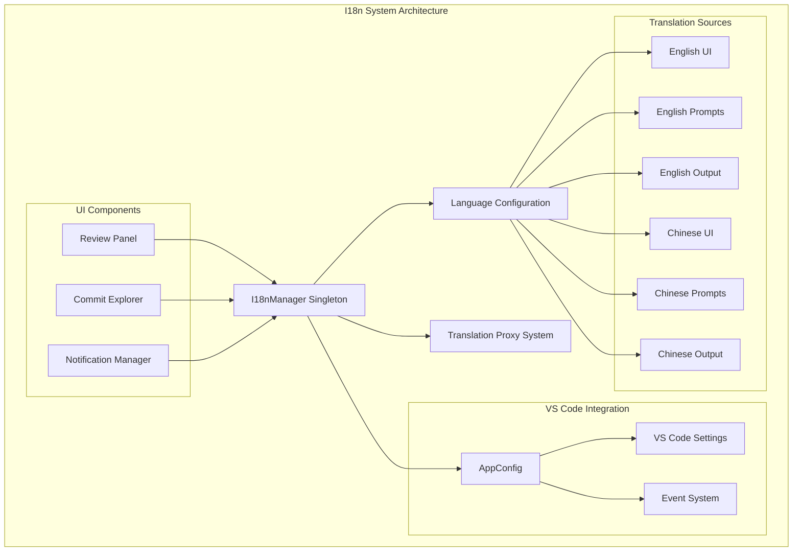
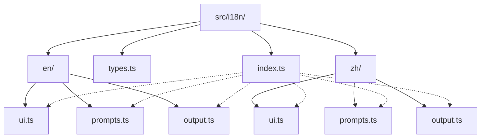
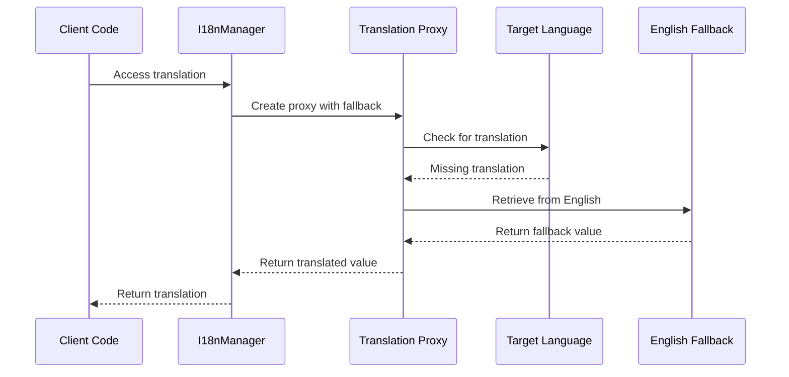
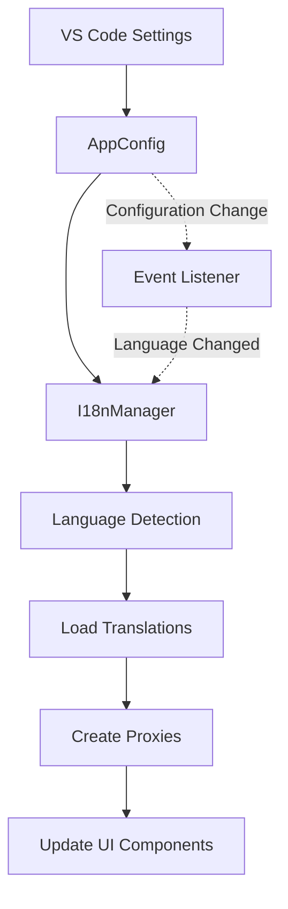
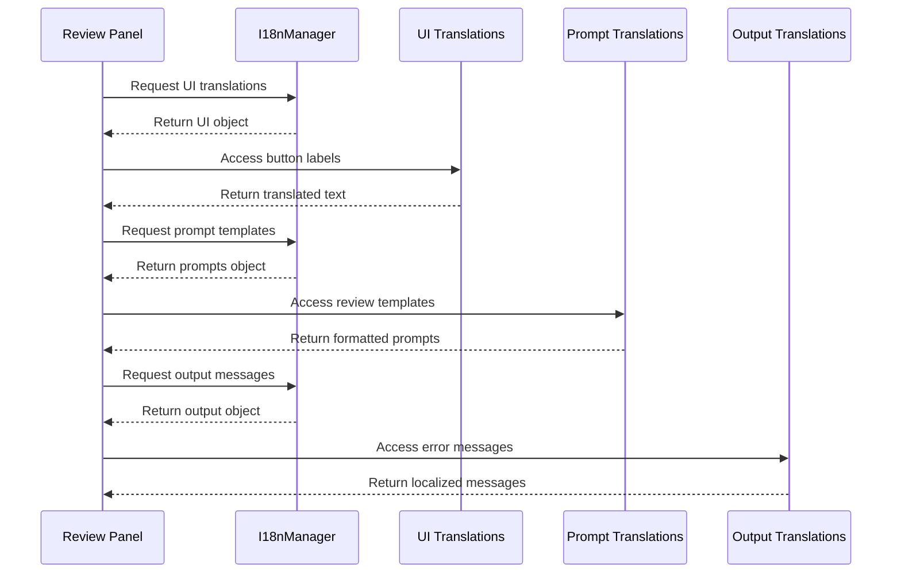
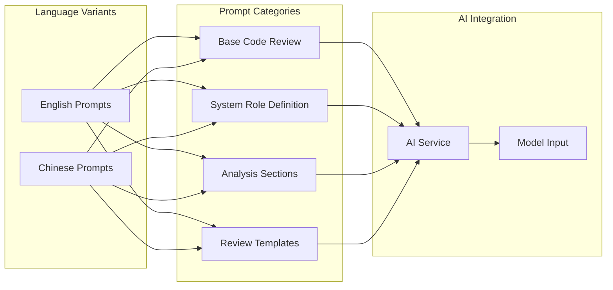
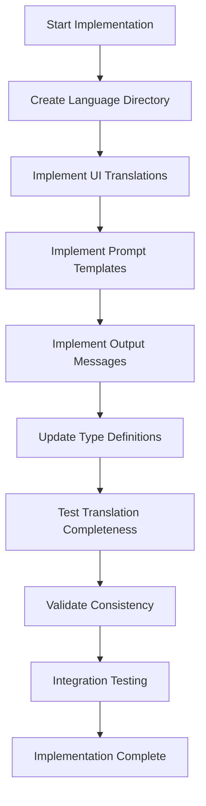
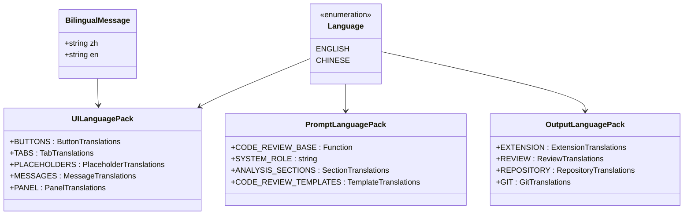
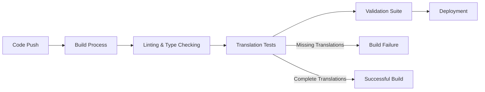

# Internationalization

<cite>
**Referenced Files in This Document**
- [src/i18n/index.ts](file://src/i18n/index.ts)
- [src/i18n/types.ts](file://src/i18n/types.ts)
- [src/i18n/en/ui.ts](file://src/i18n/en/ui.ts)
- [src/i18n/en/prompts.ts](file://src/i18n/en/prompts.ts)
- [src/i18n/en/output.ts](file://src/i18n/en/output.ts)
- [src/i18n/zh/ui.ts](file://src/i18n/zh/ui.ts)
- [src/i18n/zh/prompts.ts](file://src/i18n/zh/prompts.ts)
- [src/i18n/zh/output.ts](file://src/i18n/zh/output.ts)
- [src/ui/views/reviewPanel.ts](file://src/ui/views/reviewPanel.ts)
- [src/ui/components/commitExplorer.ts](file://src/ui/components/commitExplorer.ts)
- [src/config/appConfig.ts](file://src/config/appConfig.ts)
- [package.json](file://package.json)
</cite>

## Table of Contents
1. [Introduction](#introduction)
2. [System Architecture](#system-architecture)
3. [Directory Structure](#directory-structure)
4. [Core Components](#core-components)
5. [Language Management](#language-management)
6. [Translation Injection](#translation-injection)
7. [AI Prompt Integration](#ai-prompt-integration)
8. [Adding New Languages](#adding-new-languages)
9. [Type Safety and Consistency](#type-safety-and-consistency)
10. [Testing and Validation](#testing-and-validation)
11. [Best Practices](#best-practices)

## Introduction

CodeKarmic's internationalization (i18n) system provides comprehensive multilingual support for the VS Code extension, currently supporting English and Chinese languages. The system enables seamless localization of UI components, AI prompts, and output messages while maintaining type safety and providing automatic fallback mechanisms.

The i18n system is built around a centralized manager that handles language detection, translation loading, and dynamic content injection. It integrates deeply with VS Code's configuration system and provides real-time language switching capabilities without requiring extension restart.

## System Architecture

The i18n system follows a modular architecture with clear separation of concerns:



**Diagram sources**
- [src/i18n/index.ts](file://src/i18n/index.ts#L75-L188)
- [src/config/appConfig.ts](file://src/config/appConfig.ts#L49-L189)

## Directory Structure

The i18n system is organized in a hierarchical directory structure that mirrors the application's functional areas:



**Diagram sources**
- [src/i18n/index.ts](file://src/i18n/index.ts#L1-L188)
- [src/i18n/types.ts](file://src/i18n/types.ts#L1-L36)

**Section sources**
- [src/i18n/index.ts](file://src/i18n/index.ts#L1-L188)
- [src/i18n/types.ts](file://src/i18n/types.ts#L1-L36)

## Core Components

### I18nManager Singleton

The `I18nManager` serves as the central hub for all internationalization functionality, implementing the Singleton pattern to ensure consistent language state across the application.

Key responsibilities include:
- Language detection and switching
- Translation object management with fallback support
- Event emission for language change notifications
- Integration with VS Code configuration system

### Translation Proxy System

The system employs a sophisticated proxy mechanism that provides automatic fallback to English for missing translations:



**Diagram sources**
- [src/i18n/index.ts](file://src/i18n/index.ts#L52-L69)

### Language Type System

The type system ensures compile-time safety and provides utility functions for language management:

| Component | Purpose | Exported Functions |
|-----------|---------|-------------------|
| `Language` enum | Defines available languages | `ENGLISH`, `CHINESE` |
| `BilingualMessage` interface | Structured bilingual content | `zh`, `en` properties |
| Display name utilities | Human-readable language names | `getLanguageDisplayName()`, `getLanguageFromDisplayName()` |

**Section sources**
- [src/i18n/index.ts](file://src/i18n/index.ts#L75-L188)
- [src/i18n/types.ts](file://src/i18n/types.ts#L1-L36)

## Language Management

### Configuration Integration

The i18n system integrates seamlessly with VS Code's configuration system through the `AppConfig` class:



**Diagram sources**
- [src/config/appConfig.ts](file://src/config/appConfig.ts#L58-L76)
- [src/i18n/index.ts](file://src/i18n/index.ts#L96-L102)

### Dynamic Language Switching

The system supports real-time language switching without requiring extension restart:

1. **Language Change Detection**: Listens for VS Code configuration changes
2. **Translation Reload**: Updates translation objects with new language
3. **Proxy Recreations**: Creates new proxy objects with updated fallback chains
4. **Event Broadcasting**: Notifies all subscribed components of language changes
5. **UI Refresh**: Triggers re-rendering of affected UI components

**Section sources**
- [src/i18n/index.ts](file://src/i18n/index.ts#L96-L102)
- [src/config/appConfig.ts](file://src/config/appConfig.ts#L58-L76)

## Translation Injection

### UI Component Integration

The i18n system injects translations into various UI components through standardized interfaces:

#### Review Panel Integration

The review panel demonstrates comprehensive translation injection:



**Diagram sources**
- [src/ui/views/reviewPanel.ts](file://src/ui/views/reviewPanel.ts#L242-L577)
- [src/i18n/index.ts](file://src/i18n/index.ts#L179-L181)

#### Commit Explorer Integration

The commit explorer showcases structured translation usage:

| Translation Category | Usage Pattern | Example |
|---------------------|---------------|---------|
| **Buttons** | Static text injection | `"Review Code"` → `"代码审查"` |
| **Placeholders** | Form field localization | `"Enter your comment..."` → `"在此输入您的评论..."` |
| **Messages** | Dynamic content formatting | `"Code Quality Score: ${score}/10"` → `"代码质量评分：${score}/10"` |
| **Error Messages** | Context-aware error handling | `"Error opening review panel: ${error}"` → `"打开审查面板时出错：${error}"` |

**Section sources**
- [src/ui/components/commitExplorer.ts](file://src/ui/components/commitExplorer.ts#L36-L114)
- [src/i18n/en/ui.ts](file://src/i18n/en/ui.ts#L1-L70)
- [src/i18n/zh/ui.ts](file://src/i18n/zh/ui.ts#L1-L70)

## AI Prompt Integration

### Prompt Template System

The i18n system provides language-specific prompt templates for AI interactions:



**Diagram sources**
- [src/i18n/en/prompts.ts](file://src/i18n/en/prompts.ts#L1-L108)
- [src/i18n/zh/prompts.ts](file://src/i18n/zh/prompts.ts#L1-L108)

### Language-Specific AI Behavior

The system ensures AI prompts are appropriately localized:

| Prompt Type | English Version | Chinese Version | Key Differences |
|-------------|----------------|-----------------|-----------------|
| **System Role** | `"You are a professional code review expert."` | `"您是一位专业的代码审查专家。"` | Cultural adaptation for authority |
| **Analysis Format** | `"---FULL ANALYSIS---"` | `"---完整分析---"` | Different terminology conventions |
| **Line Number Format** | `"[line] suggestion"` | `"[行] 建议"` | Numeric and directional differences |
| **Template Structure** | English sentence structure | Chinese sentence structure | Grammatical adaptations |

**Section sources**
- [src/i18n/en/prompts.ts](file://src/i18n/en/prompts.ts#L1-L108)
- [src/i18n/zh/prompts.ts](file://src/i18n/zh/prompts.ts#L1-L108)

## Adding New Languages

### File Structure Requirements

To add a new language, create a corresponding directory structure:

```
src/i18n/new-lang/
├── ui.ts          # UI component translations
├── prompts.ts     # AI prompt templates
└── output.ts      # Output and error messages
```

### Translation Coverage Guidelines

| Component Type | Coverage Requirements | Validation Steps |
|---------------|----------------------|------------------|
| **UI Translations** | All interactive elements | Verify button labels, placeholders, and messages |
| **Prompt Templates** | Core AI interaction patterns | Test AI response quality and format |
| **Output Messages** | All error conditions and status updates | Check logging and user feedback |
| **Dynamic Content** | Parameterized strings with placeholders | Validate variable substitution |

### Implementation Checklist

1. **Create Language Directory**: Establish new language subdirectory
2. **Implement Translation Files**: Copy structure from existing languages
3. **Maintain Consistency**: Ensure identical key structures across files
4. **Test Completeness**: Verify all UI elements are translated
5. **Update Type Definitions**: Add new language to `Language` enum
6. **Integration Testing**: Test language switching functionality

### Example Implementation Process



**Section sources**
- [src/i18n/types.ts](file://src/i18n/types.ts#L4-L7)
- [src/i18n/index.ts](file://src/i18n/index.ts#L25-L37)

## Type Safety and Consistency

### Compile-Time Validation

The i18n system provides robust type safety through TypeScript interfaces:



**Diagram sources**
- [src/i18n/types.ts](file://src/i18n/types.ts#L1-L36)
- [src/i18n/en/ui.ts](file://src/i18n/en/ui.ts#L1-L70)
- [src/i18n/en/prompts.ts](file://src/i18n/en/prompts.ts#L1-L108)
- [src/i18n/en/output.ts](file://src/i18n/en/output.ts#L1-L201)

### Consistency Maintenance

The system enforces consistency through several mechanisms:

1. **Key Structure Validation**: Ensures identical key hierarchies across languages
2. **Type Checking**: Prevents runtime errors through compile-time validation
3. **Fallback Mechanisms**: Provides graceful degradation for missing translations
4. **Dynamic Proxy Creation**: Automatically handles missing translations

**Section sources**
- [src/i18n/index.ts](file://src/i18n/index.ts#L52-L69)
- [src/i18n/types.ts](file://src/i18n/types.ts#L1-L36)

## Testing and Validation

### Automated Testing Strategies

The i18n system supports comprehensive testing approaches:

| Test Category | Implementation Approach | Validation Criteria |
|--------------|------------------------|-------------------|
| **Translation Completeness** | Key structure comparison | All languages share identical key hierarchies |
| **Fallback Behavior** | Missing key simulation | Automatic English fallback activation |
| **Language Switching** | Runtime language toggling | Seamless UI updates without restart |
| **Dynamic Content** | Parameterized string testing | Correct variable substitution and formatting |

### Manual Testing Procedures

1. **Visual Verification**: Confirm all UI elements display correctly
2. **Functional Testing**: Verify all interactive elements work in target language
3. **Error Handling**: Test fallback mechanisms for missing translations
4. **Performance Validation**: Ensure language switching doesn't impact performance

### Continuous Integration

The system integrates with CI/CD pipelines for automated validation:



## Best Practices

### Translation Management

1. **Consistent Key Naming**: Use hierarchical key structures for easy maintenance
2. **Context-Aware Translations**: Consider cultural and linguistic differences
3. **Parameterized Strings**: Use placeholders for dynamic content
4. **Fallback Strategy**: Always provide English fallbacks

### Performance Optimization

1. **Lazy Loading**: Load translations only when needed
2. **Caching Mechanism**: Cache frequently accessed translations
3. **Memory Efficiency**: Minimize memory footprint of translation objects
4. **Event-Driven Updates**: Use event system for minimal UI updates

### Maintenance Guidelines

1. **Regular Audits**: Periodically review translation completeness
2. **Community Contributions**: Encourage community participation in translations
3. **Version Control**: Track translation changes through version control
4. **Documentation**: Maintain comprehensive translation documentation

### Integration Patterns

The i18n system follows established patterns for VS Code extensions:

| Pattern | Implementation | Benefits |
|---------|---------------|----------|
| **Singleton Manager** | Centralized language state | Consistent behavior across components |
| **Event-Driven Updates** | Real-time language switching | Seamless user experience |
| **Proxy-Based Fallbacks** | Automatic translation fallbacks | Graceful degradation |
| **TypeScript Integration** | Compile-time validation | Reduced runtime errors |

**Section sources**
- [src/i18n/index.ts](file://src/i18n/index.ts#L75-L188)
- [src/config/appConfig.ts](file://src/config/appConfig.ts#L49-L189)