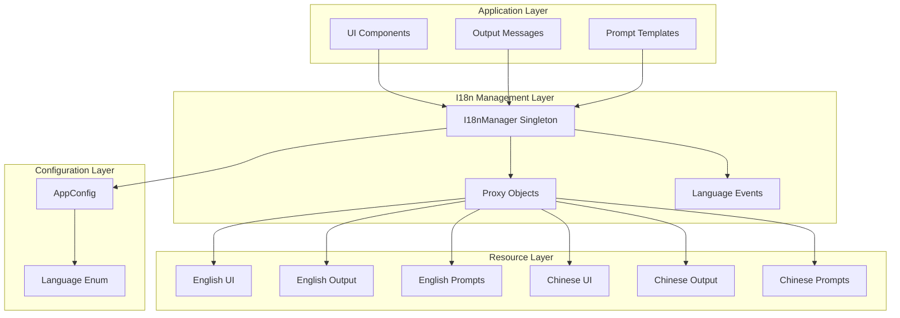
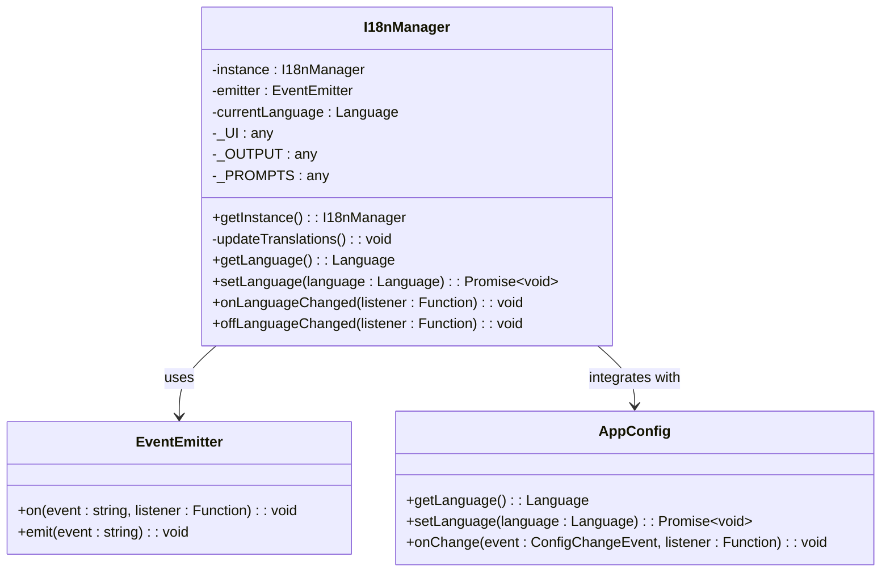
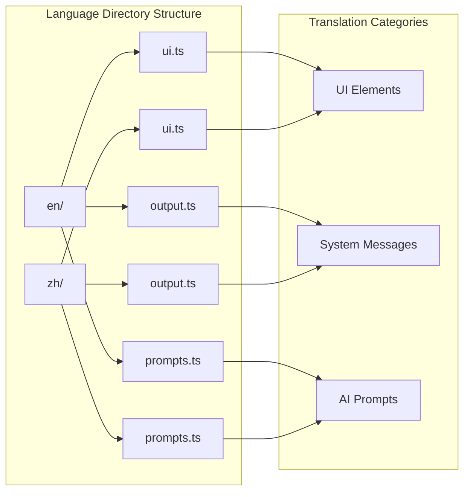
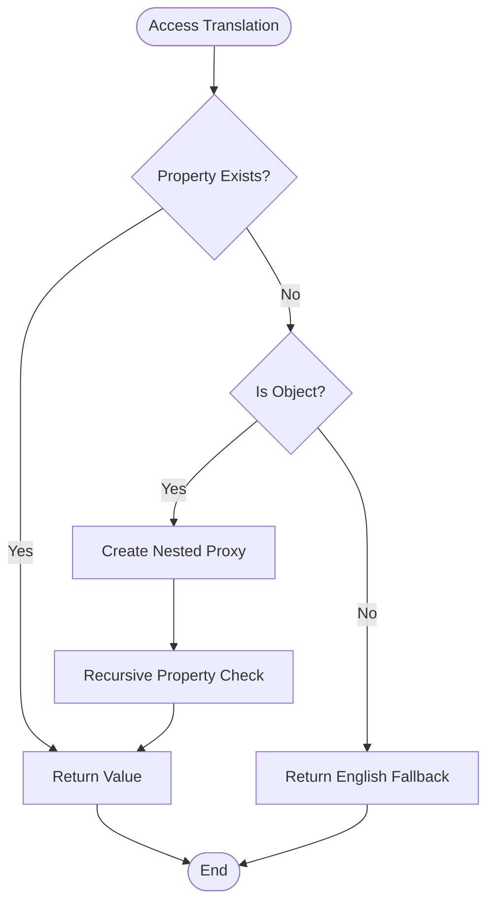
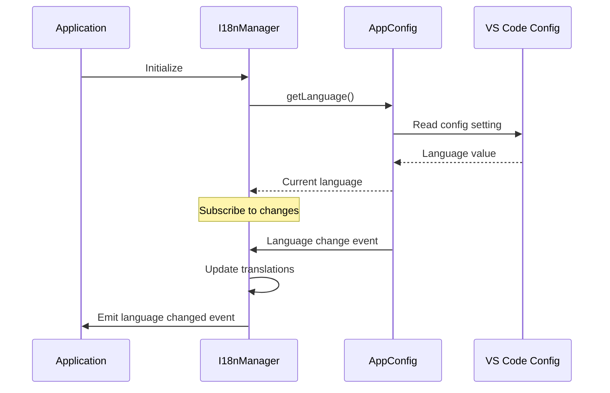
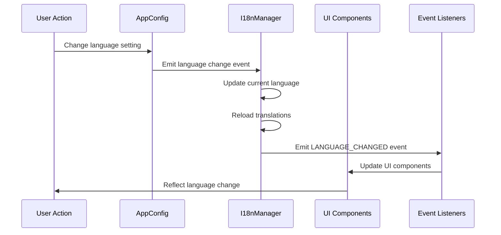

# Language Support

<cite>
**Referenced Files in This Document**
- [src/i18n/types.ts](file://src/i18n/types.ts)
- [src/i18n/index.ts](file://src/i18n/index.ts)
- [src/i18n/en/ui.ts](file://src/i18n/en/ui.ts)
- [src/i18n/en/prompts.ts](file://src/i18n/en/prompts.ts)
- [src/i18n/en/output.ts](file://src/i18n/en/output.ts)
- [src/i18n/zh/ui.ts](file://src/i18n/zh/ui.ts)
- [src/i18n/zh/prompts.ts](file://src/i18n/zh/prompts.ts)
- [src/i18n/zh/output.ts](file://src/i18n/zh/output.ts)
- [src/config/appConfig.ts](file://src/config/appConfig.ts)
- [src/extension.ts](file://src/extension.ts)
- [src/ui/views/reviewPanel.ts](file://src/ui/views/reviewPanel.ts)
</cite>

## Table of Contents
1. [Introduction](#introduction)
2. [Language Architecture Overview](#language-architecture-overview)
3. [Language Enum and Types](#language-enum-and-types)
4. [I18nManager Singleton](#i18nmanager-singleton)
5. [Language Resources Organization](#language-resources-organization)
6. [Automatic Fallback Mechanism](#automatic-fallback-mechanism)
7. [Integration with AppConfig](#integration-with-appconfig)
8. [Language Display Names and Helper Functions](#language-display-names-and-helper-functions)
9. [Usage Examples](#usage-examples)
10. [Language Change Propagation](#language-change-propagation)
11. [Best Practices](#best-practices)

## Introduction

CodeKarmic implements a comprehensive internationalization (i18n) system that supports English (en) and Chinese (zh) languages. The system is built around a singleton I18nManager that provides centralized language management with automatic fallback mechanisms, ensuring seamless user experience across different locales.

The language support system is designed with modularity and extensibility in mind, allowing for easy addition of new languages while maintaining backward compatibility and providing robust fallback behavior.

## Language Architecture Overview

The language support system follows a layered architecture with clear separation of concerns:



**Diagram sources**
- [src/i18n/index.ts](file://src/i18n/index.ts#L75-L188)
- [src/config/appConfig.ts](file://src/config/appConfig.ts#L29-L32)

## Language Enum and Types

The Language enum serves as the source of truth for available languages in the application, defined in [`src/i18n/types.ts`](file://src/i18n/types.ts#L4-L7):

```typescript
export enum Language {
    ENGLISH = 'en',
    CHINESE = 'zh'
}
```

This enum provides type safety and ensures consistency across the application. The enum values correspond to standard ISO language codes, enabling future expansion to additional languages.

**Section sources**
- [src/i18n/types.ts](file://src/i18n/types.ts#L4-L7)

## I18nManager Singleton

The I18nManager class implements the core internationalization functionality as a singleton pattern:



**Diagram sources**
- [src/i18n/index.ts](file://src/i18n/index.ts#L75-L188)
- [src/config/appConfig.ts](file://src/config/appConfig.ts#L49-L188)

### Initialization Process

The I18nManager initializes with the following process:

1. **Singleton Pattern**: Ensures only one instance exists throughout the application lifecycle
2. **Configuration Integration**: Reads initial language preference from AppConfig
3. **Event Subscription**: Listens for language changes from the configuration system
4. **Translation Loading**: Loads appropriate language resources based on current selection

**Section sources**
- [src/i18n/index.ts](file://src/i18n/index.ts#L85-L102)

## Language Resources Organization

The language system organizes translations into three main categories, each serving specific UI and functional purposes:

### UI Translations (`ui.ts`)
Contains user interface elements including buttons, tabs, placeholders, titles, and messages. These translations are used throughout the application for interactive elements.

### Output Translations (`output.ts`)
Provides system-generated messages, notifications, and logging information. These are typically displayed in notification panels and console outputs.

### Prompt Translations (`prompts.ts`)
Contains AI assistant prompts and templates used for code review analysis. These define the structure and content of AI-generated feedback.

Each language directory contains identical organizational structure:



**Diagram sources**
- [src/i18n/en/ui.ts](file://src/i18n/en/ui.ts#L1-L70)
- [src/i18n/en/output.ts](file://src/i18n/en/output.ts#L1-L201)
- [src/i18n/en/prompts.ts](file://src/i18n/en/prompts.ts#L1-L108)

**Section sources**
- [src/i18n/en/ui.ts](file://src/i18n/en/ui.ts#L1-L70)
- [src/i18n/en/output.ts](file://src/i18n/en/output.ts#L1-L201)
- [src/i18n/en/prompts.ts](file://src/i18n/en/prompts.ts#L1-L108)
- [src/i18n/zh/ui.ts](file://src/i18n/zh/ui.ts#L1-L70)
- [src/i18n/zh/output.ts](file://src/i18n/zh/output.ts#L1-L201)
- [src/i18n/zh/prompts.ts](file://src/i18n/zh/prompts.ts#L1-L108)

## Automatic Fallback Mechanism

The system implements a sophisticated fallback mechanism using JavaScript Proxy objects to ensure missing translations default to English:



**Diagram sources**
- [src/i18n/index.ts](file://src/i18n/index.ts#L52-L69)

The fallback mechanism works through the `createTranslationProxy` function, which creates recursive proxies that:

1. **Property Lookup**: Checks if the requested translation exists in the current language
2. **Fallback Resolution**: Returns English translation if property is missing
3. **Nested Object Support**: Recursively applies fallback logic to nested objects
4. **Transparent Operation**: Provides seamless fallback without breaking the application

**Section sources**
- [src/i18n/index.ts](file://src/i18n/index.ts#L52-L69)

## Integration with AppConfig

The language system integrates seamlessly with the application's configuration management through AppConfig:



**Diagram sources**
- [src/i18n/index.ts](file://src/i18n/index.ts#L96-L102)
- [src/config/appConfig.ts](file://src/config/appConfig.ts#L58-L75)

### Configuration Management Features

- **Persistent Storage**: Language preferences stored in VS Code settings
- **Real-time Updates**: Immediate propagation of language changes
- **Event-driven Architecture**: Proper event emission for UI updates
- **Type Safety**: Strong typing for language configuration

**Section sources**
- [src/i18n/index.ts](file://src/i18n/index.ts#L88-L102)
- [src/config/appConfig.ts](file://src/config/appConfig.ts#L130-L141)

## Language Display Names and Helper Functions

The system provides utility functions for language display and conversion:

### LanguageDisplayNames Mapping
```typescript
export const LanguageDisplayNames = {
    [Language.ENGLISH]: 'English',
    [Language.CHINESE]: '中文'
};
```

### Helper Functions

1. **getLanguageDisplayName**: Converts Language enum to display string
2. **getLanguageFromDisplayName**: Converts display string back to Language enum
3. **Default Language Handling**: Automatic fallback to English for invalid inputs

These utilities ensure consistent language representation across the user interface and provide flexibility for UI components that need to display language options.

**Section sources**
- [src/i18n/types.ts](file://src/i18n/types.ts#L18-L36)

## Usage Examples

The language system is used throughout the application through standardized import patterns:

### Basic Usage Pattern
```typescript
import { UI, OUTPUT, PROMPTS, getLanguage, setLanguage } from '../i18n';

// Access UI translations
const reviewButton = UI.BUTTONS.REVIEW;

// Access output messages
console.log(OUTPUT.REPOSITORY.NO_WORKSPACE_FOLDER);

// Get current language
const currentLang = getLanguage();

// Set new language
await setLanguage(Language.CHINESE);
```

### Integration Examples

The language system is integrated in various application components:

1. **Extension Activation**: [`src/extension.ts`](file://src/extension.ts#L30-L31)
2. **API Key Configuration**: [`src/extension.ts`](file://src/extension.ts#L39-L42)
3. **Review Panel**: [`src/ui/views/reviewPanel.ts`](file://src/ui/views/reviewPanel.ts#L158-L160)

**Section sources**
- [src/extension.ts](file://src/extension.ts#L30-L184)
- [src/ui/views/reviewPanel.ts](file://src/ui/views/reviewPanel.ts#L158-L160)

## Language Change Propagation

When a language change occurs, the system follows a cascading update pattern:



**Diagram sources**
- [src/i18n/index.ts](file://src/i18n/index.ts#L96-L102)

### Event Handling

The system provides event listeners for language changes:

- **onLanguageChanged**: Register callbacks for UI updates
- **offLanguageChanged**: Remove event listeners
- **Automatic Propagation**: Seamless updates across all application components

**Section sources**
- [src/i18n/index.ts](file://src/i18n/index.ts#L154-L167)

## Best Practices

### Adding New Languages

To add support for a new language:

1. **Create Language Directory**: Add new language folder (e.g., `src/i18n/fr/`)
2. **Implement Translation Files**: Create `ui.ts`, `output.ts`, and `prompts.ts`
3. **Update Language Enum**: Add new language to [`src/i18n/types.ts`](file://src/i18n/types.ts#L4-L7)
4. **Update AppConfig**: Extend language type in [`src/config/appConfig.ts`](file://src/config/appConfig.ts#L32)
5. **Test Fallback**: Verify fallback mechanism works correctly

### Translation Guidelines

- **Consistent Structure**: Maintain identical object hierarchies across languages
- **Placeholder Usage**: Use template literals for dynamic content
- **Pluralization**: Handle plural forms appropriately for each language
- **Cultural Adaptation**: Consider cultural differences in messaging

### Performance Considerations

- **Lazy Loading**: Translations loaded only when needed
- **Memory Efficiency**: Single instances of translation objects
- **Event Optimization**: Minimal event overhead for language changes

The CodeKarmic language support system provides a robust, scalable foundation for internationalization with automatic fallback capabilities, ensuring a seamless user experience across multiple languages while maintaining code quality and performance standards.