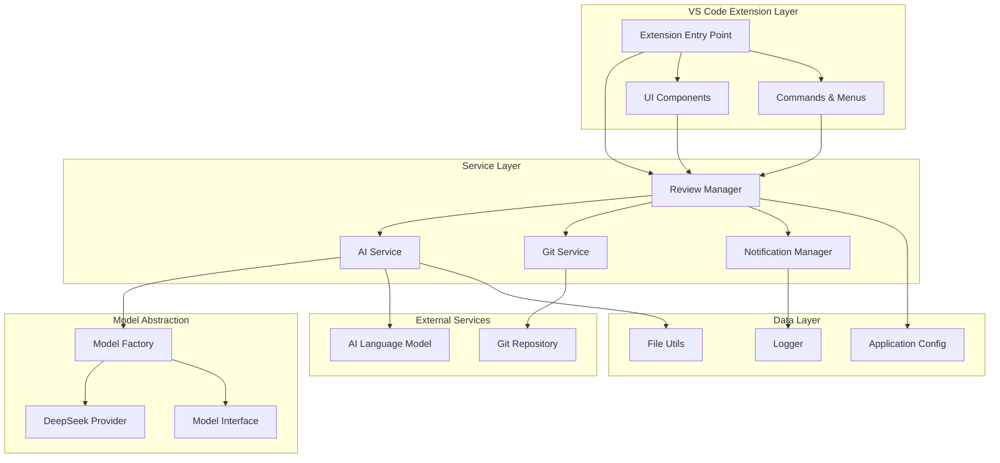
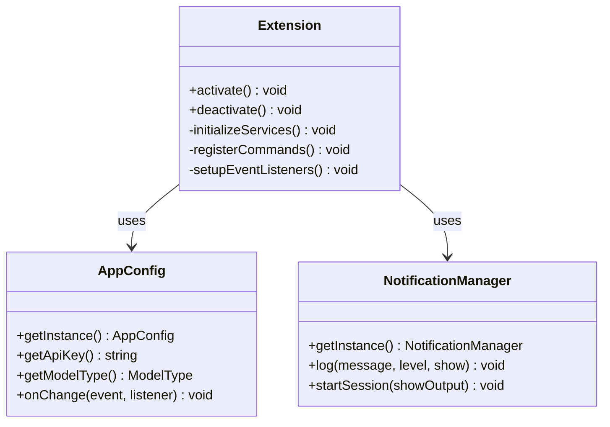
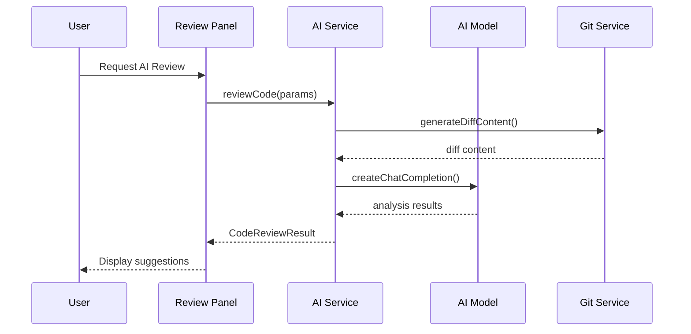
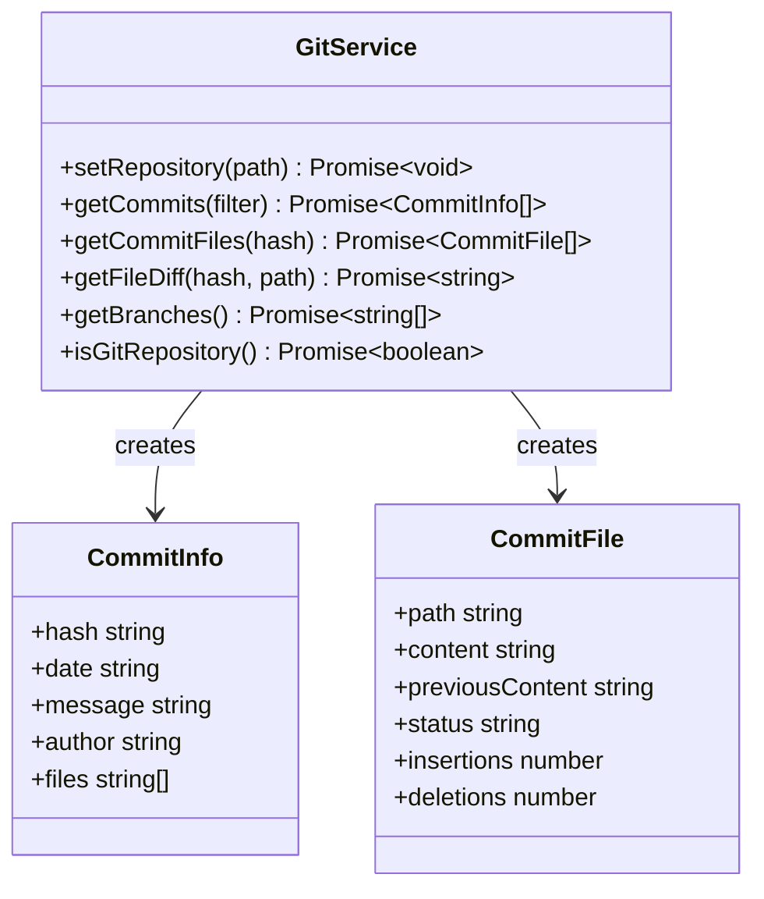
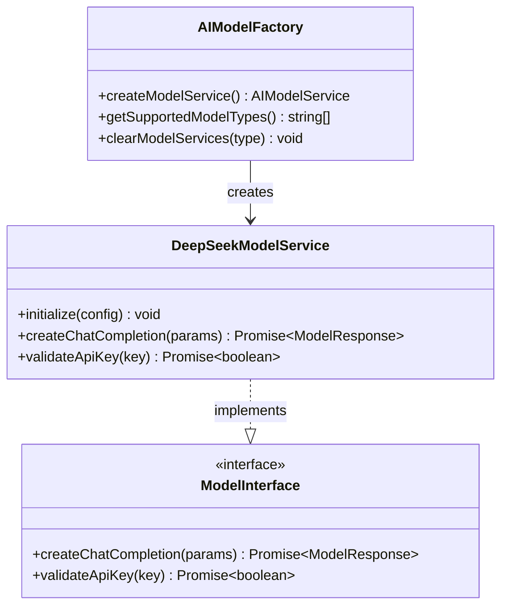
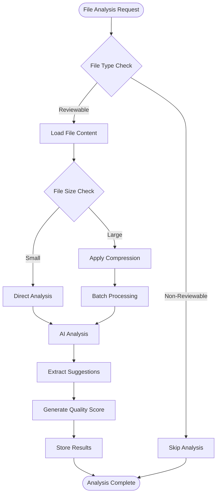
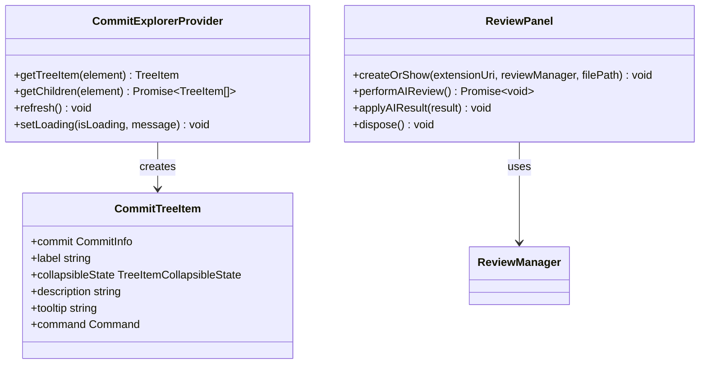
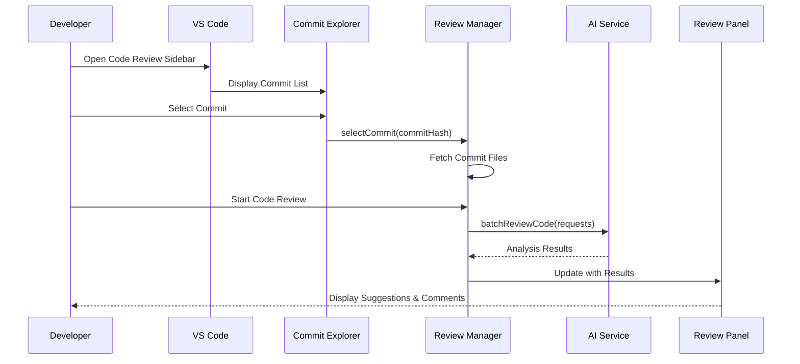
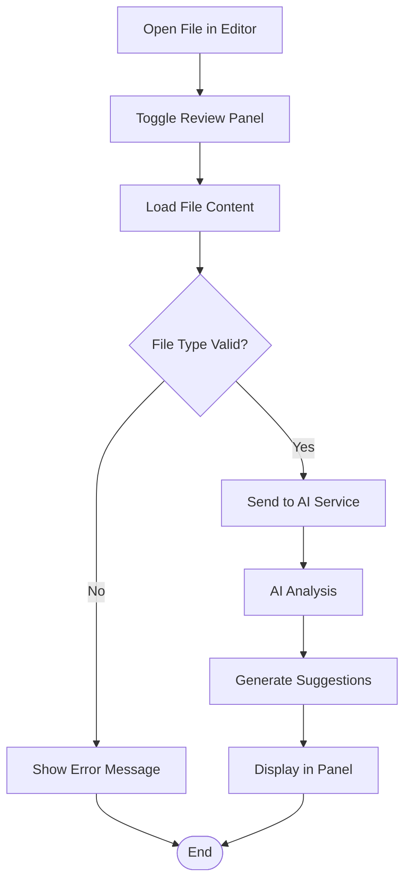
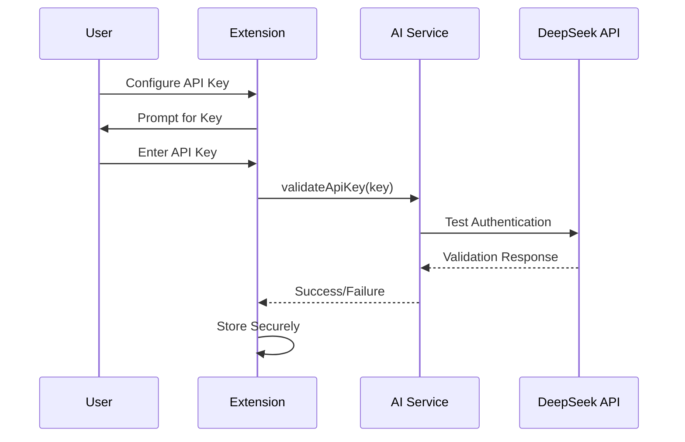

# CodeKarmic Project Overview

<cite>
**Referenced Files in This Document**
- [README.md](file://README.md)
- [package.json](file://package.json)
- [src/extension.ts](file://src/extension.ts)
- [src/config/appConfig.ts](file://src/config/appConfig.ts)
- [src/services/ai/aiService.ts](file://src/services/ai/aiService.ts)
- [src/ui/views/reviewPanel.ts](file://src/ui/views/reviewPanel.ts)
- [src/models/modelFactory.ts](file://src/models/modelFactory.ts)
- [src/services/git/gitService.ts](file://src/services/git/gitService.ts)
- [src/services/review/reviewManager.ts](file://src/services/review/reviewManager.ts)
- [src/ui/components/commitExplorer.ts](file://src/ui/components/commitExplorer.ts)
- [src/models/types.ts](file://src/models/types.ts)
- [src/utils/fileUtils.ts](file://src/utils/fileUtils.ts)
- [docs/en/user-guide.md](file://docs/en/user-guide.md)
</cite>

## Table of Contents
1. [Introduction](#introduction)
2. [Problem Statement and Value Proposition](#problem-statement-and-value-proposition)
3. [Project Architecture Overview](#project-architecture-overview)
4. [Core Components](#core-components)
5. [Technical Implementation Details](#technical-implementation-details)
6. [User Interaction Flows](#user-interaction-flows)
7. [Supported Features](#supported-features)
8. [Configuration and Setup](#configuration-and-setup)
9. [Development and Extension](#development-and-extension)
10. [Conclusion](#conclusion)

## Introduction

CodeKarmic is an AI-powered code review assistant designed specifically for Visual Studio Code and its derivatives. Built as a VS Code extension, it leverages large language models (LLMs) like DeepSeek to provide intelligent, automated feedback on code changes directly within the developer's IDE environment.

The project addresses a critical need in modern software development: the ability to efficiently review code changes while maintaining productivity and ensuring code quality standards. By integrating AI-driven analysis capabilities directly into the VS Code ecosystem, CodeKarmic enables developers to receive immediate, actionable insights on their Git commits and individual files.

**Section sources**
- [README.md](file://README.md#L1-L24)
- [package.json](file://package.json#L1-L311)

## Problem Statement and Value Proposition

### The Challenge

Modern software development teams face significant challenges in maintaining code quality while managing fast-paced development cycles. Traditional code review processes often involve:

- **Manual Review Burden**: Developers must manually examine code changes, which becomes increasingly time-consuming as codebases grow
- **Context Switching**: Moving between different tools and platforms disrupts developer workflow
- **Consistency Issues**: Human reviewers may miss subtle issues or apply inconsistent standards
- **Scalability Problems**: As teams grow, the overhead of manual code reviews becomes unsustainable

### CodeKarmic's Solution

CodeKarmic solves these problems by providing:

**Intelligent Automation**: AI-powered analysis that identifies potential issues, suggests improvements, and maintains consistent review standards across all code changes

**IDE Integration**: Seamless integration with VS Code's native interface, eliminating context switching and maintaining familiar workflows

**Flexible Review Modes**: Support for both Git commit-based reviews and standalone file analysis, accommodating various development scenarios

**Actionable Insights**: Comprehensive feedback including code quality scores, specific suggestions, and actionable recommendations

**Section sources**
- [package.json](file://package.json#L3-L4)
- [docs/en/user-guide.md](file://docs/en/user-guide.md#L1-L60)

## Project Architecture Overview

CodeKarmic follows a modular, service-oriented architecture that separates concerns between UI components, business logic, AI services, and Git integration. The architecture emphasizes extensibility, maintainability, and clear separation of responsibilities.

**Diagram sources**
- [src/extension.ts](file://src/extension.ts#L1-L920)
- [src/services/review/reviewManager.ts](file://src/services/review/reviewManager.ts#L1-L854)
- [src/services/ai/aiService.ts](file://src/services/ai/aiService.ts#L1-L787)
- [src/models/modelFactory.ts](file://src/models/modelFactory.ts#L1-L140)

### Architectural Principles

**Separation of Concerns**: Each module has distinct responsibilities, making the codebase maintainable and testable

**Dependency Injection**: Services are injected through constructors, enabling easy testing and configuration

**Event-Driven Communication**: Components communicate through events and callbacks rather than tight coupling

**Configuration-Driven Behavior**: Settings are managed centrally through the AppConfig system

**Section sources**
- [src/extension.ts](file://src/extension.ts#L20-L100)
- [src/config/appConfig.ts](file://src/config/appConfig.ts#L49-L189)

## Core Components

### Extension Entry Point

The extension's main entry point initializes all core services and registers commands with VS Code. It handles activation events, API key validation, and establishes the foundational infrastructure for the entire application.

**Diagram sources**
- [src/extension.ts](file://src/extension.ts#L20-L100)
- [src/config/appConfig.ts](file://src/config/appConfig.ts#L49-L189)

### AI Service Layer

The AI Service provides the core intelligence for code analysis, handling communication with language models, processing responses, and managing the review workflow.

**Diagram sources**
- [src/services/ai/aiService.ts](file://src/services/ai/aiService.ts#L74-L119)
- [src/ui/views/reviewPanel.ts](file://src/ui/views/reviewPanel.ts#L149-L240)

### Git Integration Service

The Git Service manages all interactions with Git repositories, providing commit history retrieval, file change detection, and diff generation capabilities.

**Diagram sources**
- [src/services/git/gitService.ts](file://src/services/git/gitService.ts#L45-L800)

### Review Management System

The Review Manager coordinates the review process, maintaining state, managing concurrent operations, and generating comprehensive reports.

**Section sources**
- [src/extension.ts](file://src/extension.ts#L68-L80)
- [src/services/ai/aiService.ts](file://src/services/ai/aiService.ts#L40-L787)
- [src/services/git/gitService.ts](file://src/services/git/gitService.ts#L45-L800)
- [src/services/review/reviewManager.ts](file://src/services/review/reviewManager.ts#L79-L854)

## Technical Implementation Details

### Model Abstraction and AI Integration

CodeKarmic implements a sophisticated model abstraction layer that supports multiple AI providers while maintaining a consistent interface. Currently, it supports DeepSeek models with extensible architecture for additional providers.

**Diagram sources**
- [src/models/modelFactory.ts](file://src/models/modelFactory.ts#L19-L140)
- [src/models/types.ts](file://src/models/types.ts#L1-L103)

### File Processing and Analysis Pipeline

The system implements intelligent file processing with support for large files, compression, and batch operations to optimize performance and handle various file types effectively.

**Diagram sources**
- [src/services/ai/aiService.ts](file://src/services/ai/aiService.ts#L260-L425)
- [src/utils/fileUtils.ts](file://src/utils/fileUtils.ts#L26-L109)

### UI Component Architecture

The user interface follows VS Code's native patterns, utilizing TreeViews for commit exploration and WebViews for detailed code review panels.

**Diagram sources**
- [src/ui/components/commitExplorer.ts](file://src/ui/components/commitExplorer.ts#L5-L172)
- [src/ui/views/reviewPanel.ts](file://src/ui/views/reviewPanel.ts#L5-L621)

**Section sources**
- [src/models/modelFactory.ts](file://src/models/modelFactory.ts#L19-L140)
- [src/services/ai/aiService.ts](file://src/services/ai/aiService.ts#L260-L425)
- [src/ui/components/commitExplorer.ts](file://src/ui/components/commitExplorer.ts#L5-L172)
- [src/ui/views/reviewPanel.ts](file://src/ui/views/reviewPanel.ts#L5-L621)

## User Interaction Flows

### Commit-Based Code Review Workflow

The primary workflow involves selecting a Git commit and performing comprehensive analysis on the changes introduced in that commit.

**Diagram sources**
- [src/ui/components/commitExplorer.ts](file://src/ui/components/commitExplorer.ts#L36-L115)
- [src/services/review/reviewManager.ts](file://src/services/review/reviewManager.ts#L149-L207)

### Standalone File Review Workflow

For developers working on individual files without Git integration, the system supports direct file analysis.

**Diagram sources**
- [src/ui/views/reviewPanel.ts](file://src/ui/views/reviewPanel.ts#L149-L240)

### Report Generation Process

The system can generate comprehensive reports summarizing all code review findings across multiple files.

**Section sources**
- [src/ui/components/commitExplorer.ts](file://src/ui/components/commitExplorer.ts#L36-L115)
- [src/services/review/reviewManager.ts](file://src/services/review/reviewManager.ts#L149-L207)
- [src/ui/views/reviewPanel.ts](file://src/ui/views/reviewPanel.ts#L149-L240)

## Supported Features

### Core Review Capabilities

| Feature | Description | Implementation |
|---------|-------------|----------------|
| **Git Commit Analysis** | Review changes introduced in specific Git commits | Full diff analysis with AI-powered suggestions |
| **Individual File Review** | Analyze standalone files without Git context | Direct content analysis with quality scoring |
| **Batch Processing** | Process multiple files concurrently | Optimized for large codebases with progress tracking |
| **Diff Analysis** | Compare current vs previous versions of files | Intelligent diff generation with multiple fallback strategies |
| **Quality Scoring** | Automated code quality assessment | Numerical scores with confidence metrics |
| **Actionable Suggestions** | Specific improvement recommendations | Context-aware suggestions with code examples |

### Advanced Analysis Features

| Feature | Description | Benefits |
|---------|-------------|----------|
| **Large File Support** | Automatic compression for files exceeding size limits | Handles enterprise-scale codebases efficiently |
| **Multiple AI Models** | Support for various LLM providers | Flexibility and redundancy |
| **Custom Prompts** | Configurable analysis templates | Tailored to team-specific requirements |
| **Progress Tracking** | Real-time operation status | Improved user experience during long operations |
| **Error Recovery** | Graceful handling of failures | Reliable operation under various conditions |

### Integration Points

| Integration | Purpose | Technology |
|-------------|---------|------------|
| **VS Code API** | Native IDE functionality | Extension APIs, TreeViews, WebViews |
| **Git Integration** | Repository operations | SimpleGit library, VS Code Git extension |
| **AI Services** | Code analysis intelligence | OpenAI-compatible APIs |
| **File System** | Local file operations | VS Code workspace APIs |

**Section sources**
- [package.json](file://package.json#L38-L281)
- [src/services/ai/aiService.ts](file://src/services/ai/aiService.ts#L260-L425)
- [src/utils/fileUtils.ts](file://src/utils/fileUtils.ts#L6-L109)

## Configuration and Setup

### Initial Setup Process

CodeKarmic requires minimal setup to begin using its core functionality:

1. **Install from VS Code Marketplace**: Available as a VS Code extension
2. **Configure API Key**: Set up DeepSeek API credentials
3. **Initialize Repository**: Open a Git repository in VS Code
4. **Start Reviewing**: Select commits and initiate analysis

### Configuration Options

The system provides extensive configuration options through VS Code settings:

| Setting | Default | Description |
|---------|---------|-------------|
| `codekarmic.apiKey` | `""` | DeepSeek API authentication key |
| `codekarmic.modelType` | `"deepseek-reasoner"` | AI model selection |
| `codekarmic.maxFileSizeKb` | `100` | Maximum file size for analysis |
| `codekarmic.debugMode` | `false` | Enable debug logging |
| `codekarmic.excludeFileTypes` | Various | File patterns to exclude from review |

### API Key Management

The system implements secure API key storage and validation:

**Diagram sources**
- [src/extension.ts](file://src/extension.ts#L37-L66)
- [src/services/ai/aiService.ts](file://src/services/ai/aiService.ts#L712-L724)

**Section sources**
- [package.json](file://package.json#L118-L208)
- [src/extension.ts](file://src/extension.ts#L37-L66)
- [src/services/ai/aiService.ts](file://src/services/ai/aiService.ts#L712-L724)

## Development and Extension

### Extension Development Guidelines

CodeKarmic follows VS Code extension development best practices:

**Modular Architecture**: Each component has clear responsibilities and minimal dependencies
**TypeScript Strong Typing**: Comprehensive type definitions for all interfaces
**Error Handling**: Robust error handling with user-friendly messages
**Testing Strategy**: Unit tests for core functionality, integration tests for service interactions

### Extending Functionality

The architecture supports easy extension:

**New AI Providers**: Implement the ModelInterface to add support for additional LLM providers
**Additional File Types**: Extend the REVIEWABLE_FILE_EXTENSIONS array to support new languages
**Custom Analysis Rules**: Modify the AI prompts and analysis logic to implement domain-specific requirements
**Enhanced UI Components**: Create new TreeViews or WebViews for specialized functionality

### Contributing Guidelines

For developers interested in contributing:

1. **Code Style**: Follow TypeScript conventions and VS Code extension guidelines
2. **Testing**: Ensure comprehensive test coverage for new features
3. **Documentation**: Update documentation for new capabilities
4. **Compatibility**: Maintain backward compatibility with existing configurations

**Section sources**
- [src/extension.ts](file://src/extension.ts#L1-L920)
- [src/models/modelFactory.ts](file://src/models/modelFactory.ts#L19-L140)
- [docs/en/user-guide.md](file://docs/en/user-guide.md#L1-L60)

## Conclusion

CodeKarmic represents a significant advancement in AI-powered code review tools, successfully bridging the gap between sophisticated AI analysis and practical developer workflows. By leveraging VS Code's native architecture and integrating seamlessly with Git repositories, it provides developers with immediate, actionable insights on their code changes.

The project's strength lies in its thoughtful architecture that balances simplicity with powerful functionality. The modular design ensures maintainability while the comprehensive feature set addresses real-world development challenges. From basic file analysis to complex batch processing and report generation, CodeKarmic demonstrates how AI can enhance developer productivity without compromising on quality or usability.

As AI technology continues to evolve, CodeKarmic's extensible architecture positions it well for future enhancements, including additional language support, custom review rules, and expanded collaboration features. Its commitment to open standards and VS Code integration ensures broad adoption and community contribution.

For development teams seeking to improve code quality while maintaining development velocity, CodeKarmic offers a compelling solution that combines cutting-edge AI capabilities with practical, everyday usability.