# AI Service

<cite>
**Referenced Files in This Document**
- [aiService.ts](file://src/services/ai/aiService.ts)
- [modelFactory.ts](file://src/models/modelFactory.ts)
- [gitService.ts](file://src/services/git/gitService.ts)
- [reviewTypes.ts](file://src/core/review/reviewTypes.ts)
- [largeFileProcessor.ts](file://src/core/compression/largeFileProcessor.ts)
- [modelInterface.ts](file://src/models/modelInterface.ts)
- [logger.ts](file://src/utils/logger.ts)
- [appConfig.ts](file://src/config/appConfig.ts)
- [compressionTypes.ts](file://src/core/compression/compressionTypes.ts)
</cite>

## Table of Contents
1. [Introduction](#introduction)
2. [Architecture Overview](#architecture-overview)
3. [Core Components](#core-components)
4. [Domain Models](#domain-models)
5. [Key Interfaces and Methods](#key-interfaces-and-methods)
6. [Integration with Dependencies](#integration-with-dependencies)
7. [Performance Optimization](#performance-optimization)
8. [Error Handling and Fallback Mechanisms](#error-handling-and-fallback-mechanisms)
9. [Usage Examples](#usage-examples)
10. [Best Practices](#best-practices)

## Introduction

The AIService class serves as the central coordinator for AI-powered code analysis within the CodeKarmic extension. It orchestrates the interaction between various components including the ModelFactory for AI model management, GitService for version control integration, and LargeFileProcessor for handling large files. The service provides comprehensive code review capabilities through both individual file analysis and batch processing, with sophisticated caching, streaming output support, and intelligent fallback mechanisms.

## Architecture Overview

The AIService follows a layered architecture pattern with clear separation of concerns:

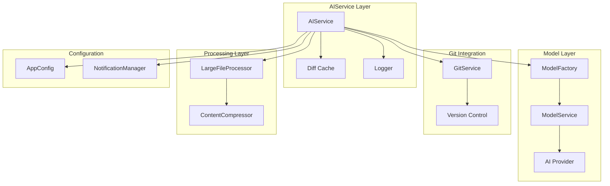

**Diagram sources**
- [aiService.ts](file://src/services/ai/aiService.ts#L40-L70)
- [modelFactory.ts](file://src/models/modelFactory.ts#L19-L44)
- [gitService.ts](file://src/services/git/gitService.ts#L45-L65)

**Section sources**
- [aiService.ts](file://src/services/ai/aiService.ts#L40-L70)
- [modelFactory.ts](file://src/models/modelFactory.ts#L19-L44)

## Core Components

### Singleton Pattern Implementation

The AIService implements the Singleton pattern to ensure centralized AI service management:

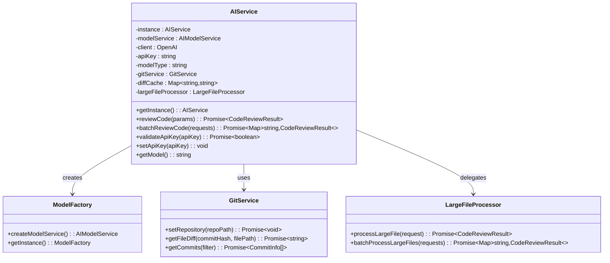

**Diagram sources**
- [aiService.ts](file://src/services/ai/aiService.ts#L40-L70)
- [modelFactory.ts](file://src/models/modelFactory.ts#L19-L44)
- [gitService.ts](file://src/services/git/gitService.ts#L45-L65)
- [largeFileProcessor.ts](file://src/core/compression/largeFileProcessor.ts#L23-L42)

### Diff Content Caching System

The AIService implements an intelligent caching mechanism for Git diff content to optimize performance:

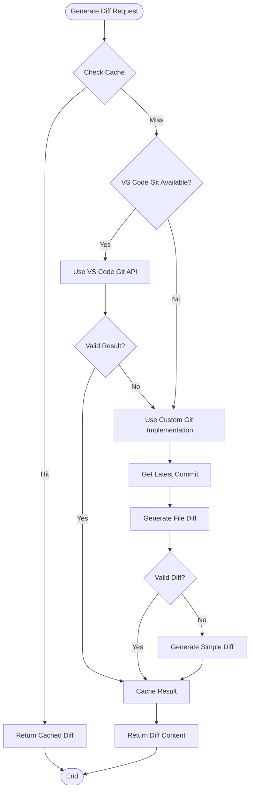

**Diagram sources**
- [aiService.ts](file://src/services/ai/aiService.ts#L125-L239)

**Section sources**
- [aiService.ts](file://src/services/ai/aiService.ts#L46-L49)
- [aiService.ts](file://src/services/ai/aiService.ts#L125-L239)

## Domain Models

### Core Data Structures

The AIService operates on several key domain models that define the contract between components:

| Model | Purpose | Key Properties |
|-------|---------|----------------|
| **CodeReviewRequest** | Single file review input | `filePath`, `currentContent`, `previousContent`, `useCompression`, `language`, `diffContent`, `includeDiffAnalysis`, `useStreamingOutput` |
| **CodeReviewResult** | Single file review output | `suggestions`, `diffSuggestions`, `fullFileSuggestions`, `score`, `diffContent` |
| **CodeAnalysisOptions** | Analysis configuration | `useCompression`, `maxTokens`, `reviewMode`, `includeDiffAnalysis`, `includeFullFileAnalysis` |
| **CodeReviewResponse** | Standardized response format | `comments`, `suggestions`, `score` |

### Review Mode Enumeration

The system supports multiple review modes for different use cases:

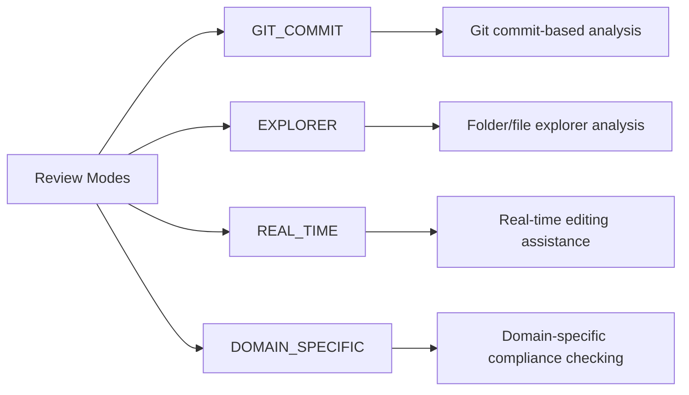

**Diagram sources**
- [reviewTypes.ts](file://src/core/review/reviewTypes.ts#L10-L19)

**Section sources**
- [reviewTypes.ts](file://src/core/review/reviewTypes.ts#L24-L73)
- [reviewTypes.ts](file://src/core/review/reviewTypes.ts#L78-L125)
- [reviewTypes.ts](file://src/core/review/reviewTypes.ts#L142-L189)

## Key Interfaces and Methods

### Primary Public Interfaces

#### reviewCode() Method
The primary method for single file code review with comprehensive parameter control:

```typescript
public async reviewCode(params: CodeReviewRequest): Promise<CodeReviewResult>
```

**Parameters:**
- `filePath`: Target file path for analysis
- `currentContent`: Current file content
- `previousContent`: Previous version content for comparison
- `useCompression`: Enable content compression for large files
- `language`: Programming language detection
- `includeDiffAnalysis`: Enable Git diff-based analysis
- `useStreamingOutput`: Enable real-time streaming responses

**Returns:** Comprehensive `CodeReviewResult` with suggestions and scoring

#### batchReviewCode() Method
Efficient batch processing for multiple files with intelligent grouping:

```typescript
public async batchReviewCode(requests: CodeReviewRequest[]): Promise<Map<string, CodeReviewResult>>
```

**Features:**
- Automatic file categorization (large vs normal files)
- Token-aware batching for optimal API usage
- Parallel processing of independent batches
- Intelligent response splitting for individual files

#### validateApiKey() Method
API key validation with provider-specific testing:

```typescript
public async validateApiKey(apiKey: string): Promise<boolean>
```

**Implementation:** Delegates to ModelFactory for provider-specific validation

**Section sources**
- [aiService.ts](file://src/services/ai/aiService.ts#L74-L119)
- [aiService.ts](file://src/services/ai/aiService.ts#L431-L552)
- [aiService.ts](file://src/services/ai/aiService.ts#L712-L723)

### Internal Processing Pipeline

The code analysis pipeline implements sophisticated optimization strategies:

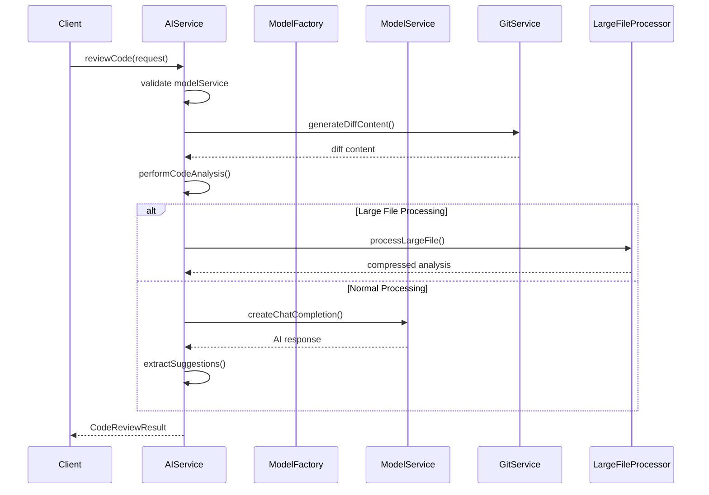

**Diagram sources**
- [aiService.ts](file://src/services/ai/aiService.ts#L74-L119)
- [aiService.ts](file://src/services/ai/aiService.ts#L260-L411)

**Section sources**
- [aiService.ts](file://src/services/ai/aiService.ts#L260-L411)

## Integration with Dependencies

### ModelFactory Integration

The AIService integrates seamlessly with the ModelFactory for dynamic AI model management:

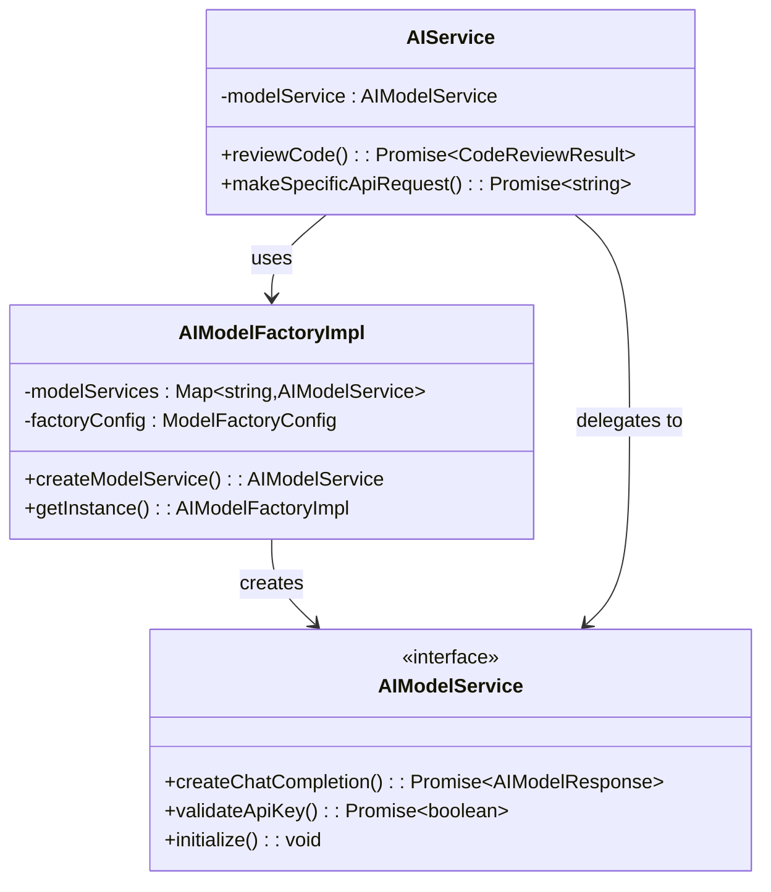

**Diagram sources**
- [aiService.ts](file://src/services/ai/aiService.ts#L51-L61)
- [modelFactory.ts](file://src/models/modelFactory.ts#L19-L44)
- [modelInterface.ts](file://src/models/modelInterface.ts#L39-L61)

### GitService Integration

Comprehensive Git integration for version-aware code analysis:

| Integration Point | Purpose | Implementation |
|------------------|---------|----------------|
| **Diff Generation** | Create meaningful diffs for analysis | Multi-strategy approach (VS Code API, custom Git commands) |
| **Commit History** | Access historical context | Fallback mechanisms for different Git environments |
| **File Status** | Understand file modification types | Handles added, modified, deleted, renamed files |
| **Content Retrieval** | Get specific file versions | Optimized content fetching with caching |

**Section sources**
- [aiService.ts](file://src/services/ai/aiService.ts#L125-L239)
- [gitService.ts](file://src/services/git/gitService.ts#L45-L108)

### LargeFileProcessor Integration

Specialized handling for files exceeding token limits:

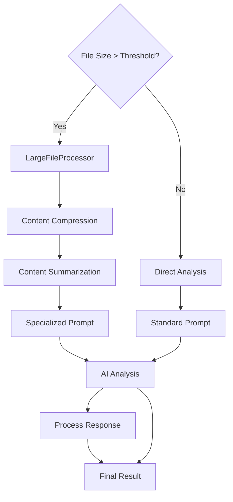

**Diagram sources**
- [largeFileProcessor.ts](file://src/core/compression/largeFileProcessor.ts#L23-L42)
- [aiService.ts](file://src/services/ai/aiService.ts#L413-L424)

**Section sources**
- [largeFileProcessor.ts](file://src/core/compression/largeFileProcessor.ts#L23-L81)
- [aiService.ts](file://src/services/ai/aiService.ts#L413-L424)

## Performance Optimization

### Combined Prompt Strategy

The AIService implements an innovative combined prompt strategy to minimize API calls:

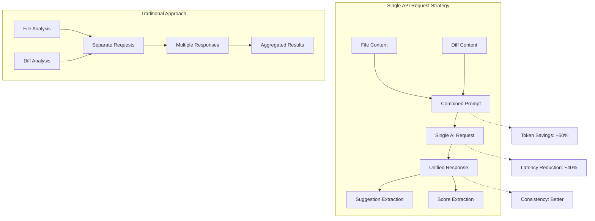

**Diagram sources**
- [aiService.ts](file://src/services/ai/aiService.ts#L308-L332)

### Streaming Output Support

Real-time response processing for improved user experience:

| Feature | Implementation | Benefit |
|---------|---------------|---------|
| **Stream Detection** | Automatic detection of streaming-capable models | Seamless fallback for non-streaming models |
| **Progress Tracking** | Real-time progress updates | Enhanced user feedback during long analyses |
| **Memory Efficiency** | Incremental response processing | Reduced memory footprint for large responses |
| **Timeout Handling** | Configurable timeout with graceful degradation | Reliable operation under network constraints |

### Batch Processing Optimization

Intelligent batch grouping for optimal throughput:

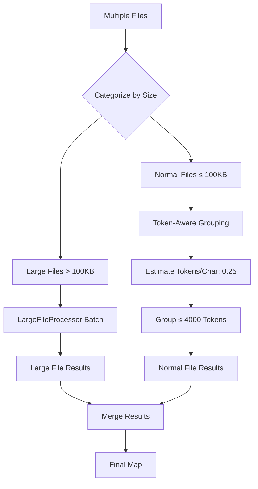

**Diagram sources**
- [aiService.ts](file://src/services/ai/aiService.ts#L431-L552)

**Section sources**
- [aiService.ts](file://src/services/ai/aiService.ts#L308-L332)
- [aiService.ts](file://src/services/ai/aiService.ts#L431-L552)
- [compressionTypes.ts](file://src/core/compression/compressionTypes.ts#L82-L87)

## Error Handling and Fallback Mechanisms

### Multi-Level Error Handling

The AIService implements comprehensive error handling across all integration points:

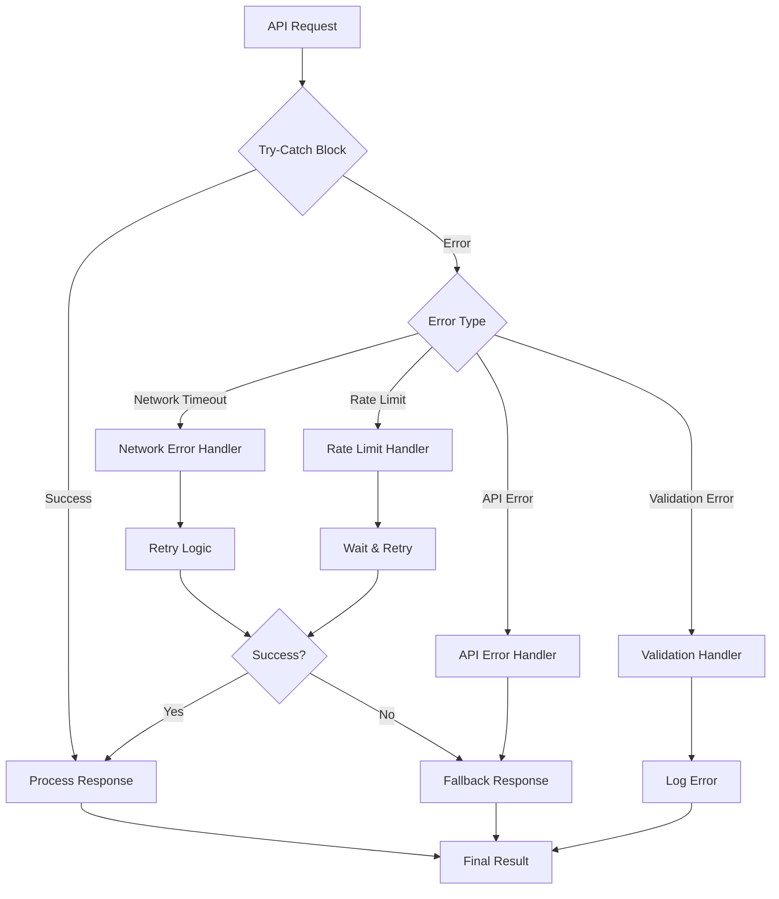

**Diagram sources**
- [aiService.ts](file://src/services/ai/aiService.ts#L387-L410)

### Fallback Strategies

| Scenario | Primary Strategy | Fallback Strategy | Recovery Action |
|----------|-----------------|------------------|-----------------|
| **VS Code Git API Unavailable** | Use VS Code Git extension | Fall back to custom Git implementation | Continue with basic diff generation |
| **Large File Processing Failure** | Attempt compressed analysis | Generate simplified diff | Provide basic suggestions |
| **API Rate Limit Exceeded** | Implement exponential backoff | Queue request for later processing | Notify user of temporary limitation |
| **Model Service Unavailable** | Switch to cached model | Use local processing capabilities | Graceful degradation with warnings |

### Large File Handling

Sophisticated fallback mechanisms for large file processing:

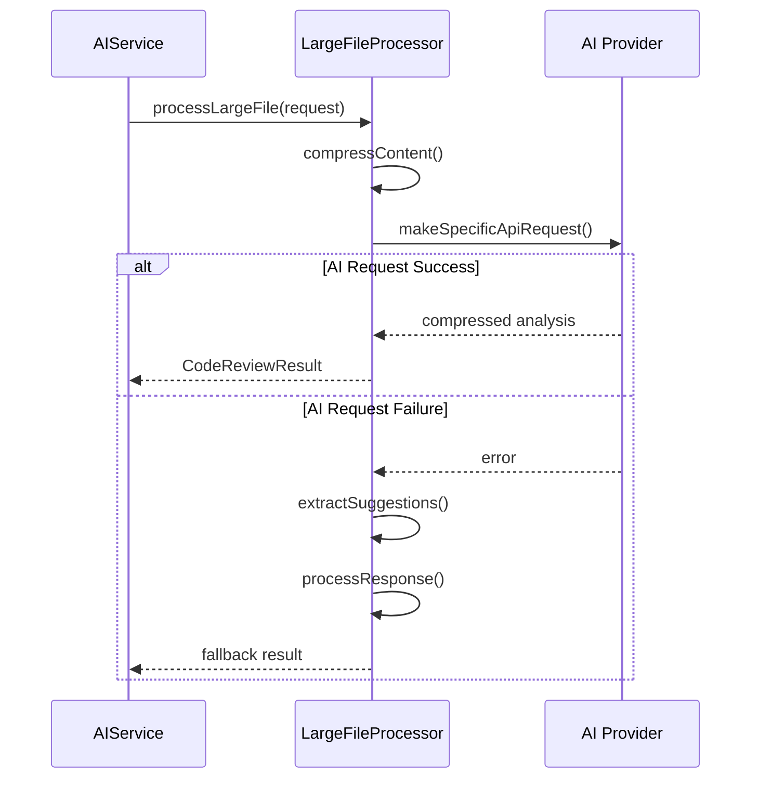

**Diagram sources**
- [largeFileProcessor.ts](file://src/core/compression/largeFileProcessor.ts#L55-L80)

**Section sources**
- [aiService.ts](file://src/services/ai/aiService.ts#L387-L410)
- [aiService.ts](file://src/services/ai/aiService.ts#L691-L709)
- [largeFileProcessor.ts](file://src/core/compression/largeFileProcessor.ts#L55-L80)

## Usage Examples

### Basic Code Review

```typescript
// Single file review with Git integration
const reviewRequest: CodeReviewRequest = {
    filePath: '/path/to/file.ts',
    currentContent: 'function example() { return true; }',
    previousContent: 'function example() { return false; }',
    includeDiffAnalysis: true,
    useStreamingOutput: true
};

const result = await AIService.getInstance().reviewCode(reviewRequest);
console.log(result.suggestions); // Array of improvement suggestions
console.log(result.score); // Quality score (0-10)
```

### Batch Processing Example

```typescript
// Multiple file review with automatic optimization
const requests: CodeReviewRequest[] = [
    { filePath: 'file1.ts', currentContent: '...', previousContent: '...' },
    { filePath: 'file2.py', currentContent: '...', previousContent: '...' },
    { filePath: 'largeFile.js', currentContent: '...', previousContent: '...' }
];

const results = await AIService.getInstance().batchReviewCode(requests);
results.forEach((result, filePath) => {
    console.log(`File: ${filePath}`);
    console.log(`Suggestions: ${result.suggestions.length}`);
});
```

### API Key Validation

```typescript
// Validate API key before processing
const isValid = await AIService.getInstance().validateApiKey('your-api-key');
if (isValid) {
    AIService.getInstance().setApiKey('your-api-key');
    // Proceed with code reviews
} else {
    console.log('Invalid API key');
}
```

### Large File Processing

```typescript
// Automatic large file detection and processing
const largeFileRequest: CodeReviewRequest = {
    filePath: 'very-large-file.js',
    currentContent: '/* 100,000+ lines of code */',
    previousContent: '/* Previous version */',
    useCompression: true // Explicitly enable compression
};

const result = await AIService.getInstance().reviewCode(largeFileRequest);
// Result contains processed suggestions despite large file size
```

**Section sources**
- [aiService.ts](file://src/services/ai/aiService.ts#L74-L119)
- [aiService.ts](file://src/services/ai/aiService.ts#L431-L552)

## Best Practices

### Configuration Management

1. **API Key Security**: Always validate API keys before storing them
2. **Model Selection**: Choose appropriate models based on file characteristics
3. **Compression Settings**: Tune compression thresholds for your use case
4. **Timeout Configuration**: Set reasonable timeouts for different operation types

### Performance Optimization

1. **Batch Processing**: Use batchReviewCode() for multiple files when possible
2. **Caching Strategy**: Leverage the built-in diff caching for repeated operations
3. **Streaming Usage**: Enable streaming for better user experience
4. **Large File Handling**: Let the system automatically handle large files

### Error Handling

1. **Graceful Degradation**: Always provide fallback responses for failures
2. **User Feedback**: Use NotificationManager for user-visible errors
3. **Logging**: Utilize the integrated Logger for debugging and monitoring
4. **Retry Logic**: Implement exponential backoff for transient failures

### Integration Guidelines

1. **Singleton Pattern**: Use `AIService.getInstance()` for all operations
2. **Resource Cleanup**: Properly handle large file processing resources
3. **Memory Management**: Monitor memory usage with large file processing
4. **Concurrency**: Understand batch processing limitations and patterns

The AIService provides a robust, scalable foundation for AI-powered code analysis with comprehensive error handling, performance optimization, and flexible integration capabilities. Its design prioritizes reliability, performance, and developer experience while maintaining flexibility for various use cases and environments.