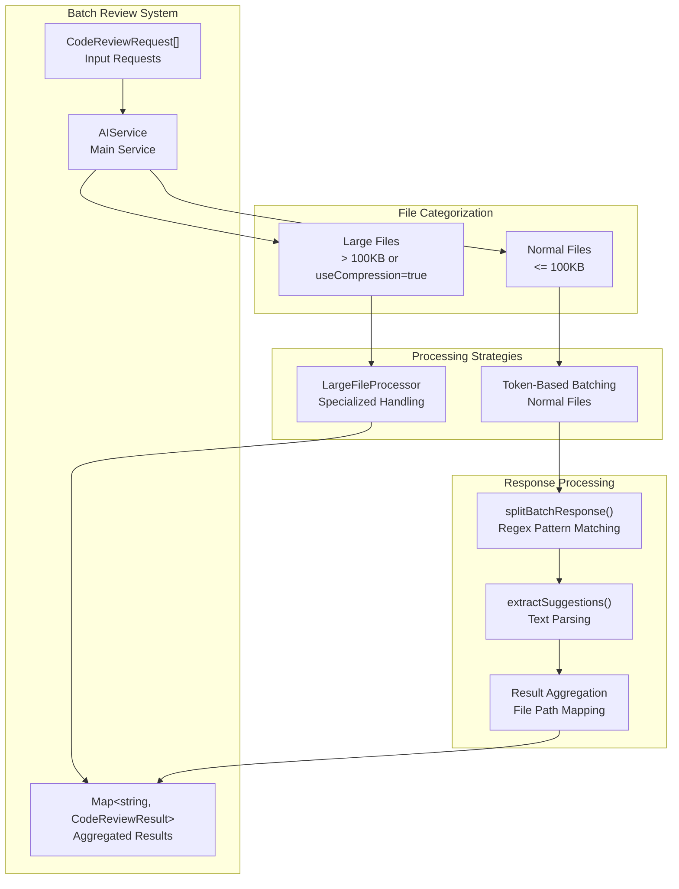
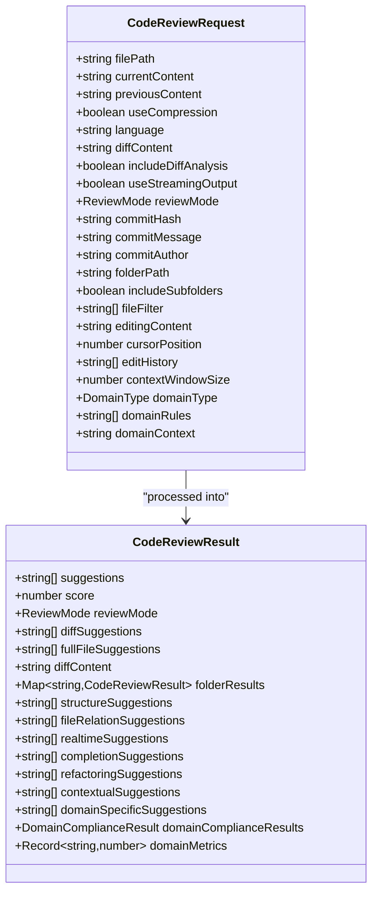
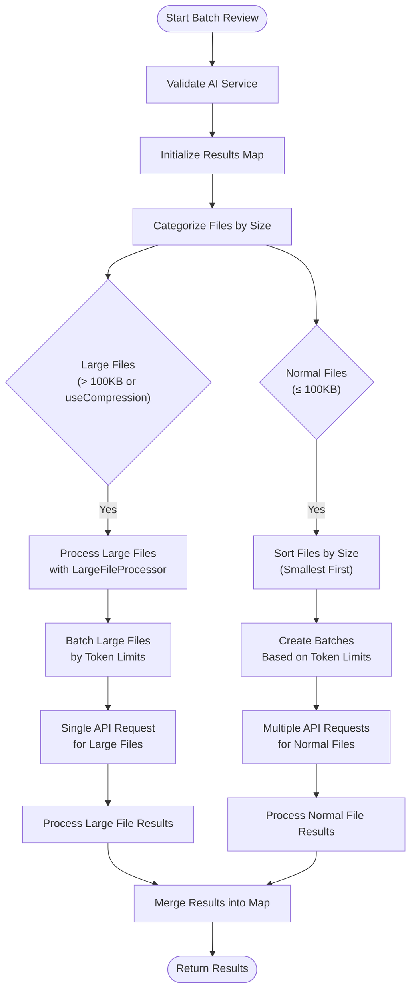
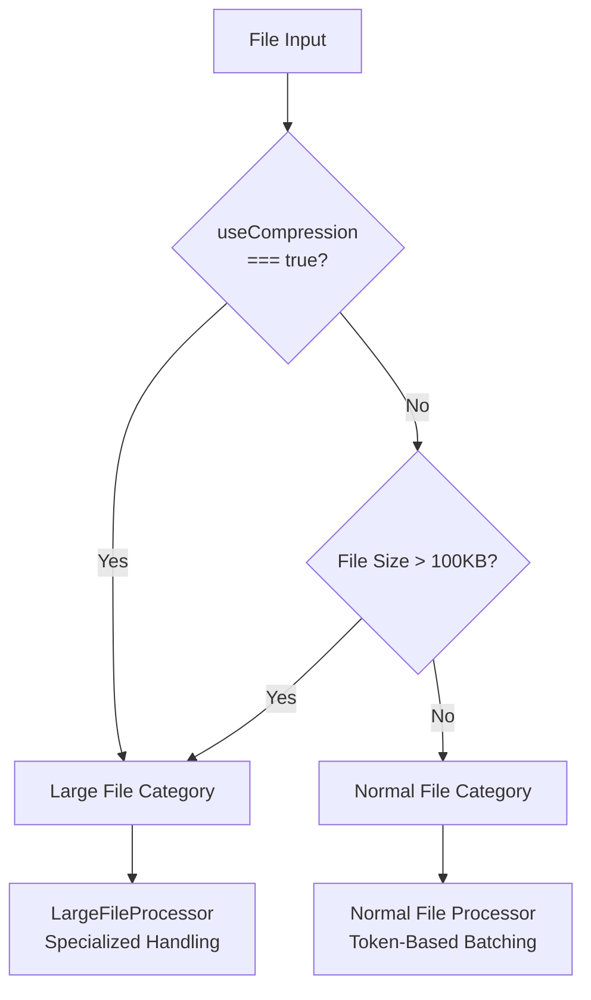
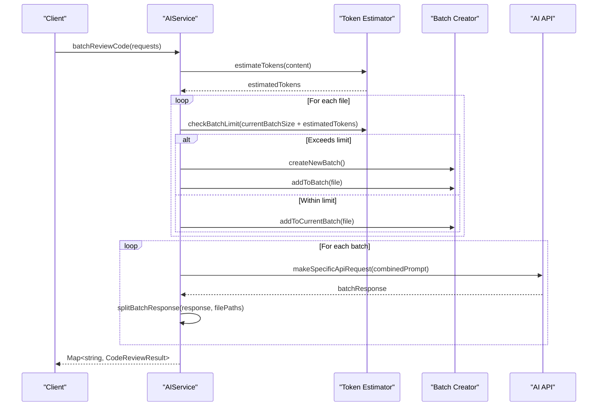
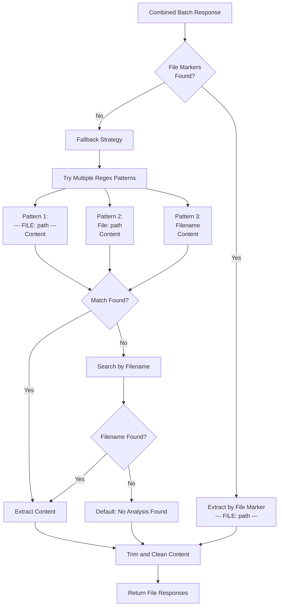

# Batch Code Review

<cite>
**Referenced Files in This Document**
- [aiService.ts](file://src/services/ai/aiService.ts)
- [reviewTypes.ts](file://src/core/review/reviewTypes.ts)
- [largeFileProcessor.ts](file://src/core/compression/largeFileProcessor.ts)
- [compressionTypes.ts](file://src/core/compression/compressionTypes.ts)
- [contentCompressor.ts](file://src/core/compression/contentCompressor.ts)
- [prompts.ts](file://src/i18n/en/prompts.ts)
</cite>

## Table of Contents
1. [Introduction](#introduction)
2. [Architecture Overview](#architecture-overview)
3. [Core Components](#core-components)
4. [Batch Review Implementation](#batch-review-implementation)
5. [File Categorization and Processing](#file-categorization-and-processing)
6. [Token Management and Batching](#token-management-and-batching)
7. [Response Processing and Extraction](#response-processing-and-extraction)
8. [Performance Optimization Techniques](#performance-optimization-techniques)
9. [Error Handling and Edge Cases](#error-handling-and-edge-cases)
10. [Practical Examples](#practical-examples)
11. [Troubleshooting Guide](#troubleshooting-guide)
12. [Conclusion](#conclusion)

## Introduction

The batch code review functionality within the AIService provides a sophisticated solution for reviewing multiple files simultaneously while optimizing AI API usage and managing token limits effectively. This system intelligently categorizes files into large and normal categories, applies appropriate compression techniques for large files, and batches normal files based on token constraints to maximize efficiency.

The batch review system addresses several key challenges in code review automation:
- **Token Limit Management**: Prevents exceeding AI model token limits by carefully estimating and batching content
- **Performance Optimization**: Uses compression and selective processing for large files to reduce costs and improve speed
- **Accuracy Preservation**: Maintains review quality through sophisticated response parsing and extraction algorithms
- **Scalability**: Handles multiple files efficiently through intelligent batching strategies

## Architecture Overview

The batch code review system follows a layered architecture that separates concerns between file categorization, processing strategies, and response handling.

**Diagram sources**
- [aiService.ts](file://src/services/ai/aiService.ts#L431-L552)
- [largeFileProcessor.ts](file://src/core/compression/largeFileProcessor.ts#L160-L224)

## Core Components

### CodeReviewRequest Interface

The `CodeReviewRequest` interface serves as the foundation for batch processing, extending the basic review request with batch-specific properties:

**Diagram sources**
- [reviewTypes.ts](file://src/core/review/reviewTypes.ts#L24-L73)
- [reviewTypes.ts](file://src/core/review/reviewTypes.ts#L78-L125)

**Section sources**
- [reviewTypes.ts](file://src/core/review/reviewTypes.ts#L24-L125)

### AIService Batch Review Method

The `batchReviewCode()` method orchestrates the entire batch processing workflow, implementing sophisticated logic for file categorization, token management, and result aggregation.

**Section sources**
- [aiService.ts](file://src/services/ai/aiService.ts#L431-L552)

## Batch Review Implementation

### Method Signature and Parameters

The `batchReviewCode()` method accepts an array of `CodeReviewRequest` objects and returns a `Map<string, CodeReviewResult>` where keys are file paths and values are corresponding review results.

**Method Parameters:**
- `requests: CodeReviewRequest[]`: Array of code review requests for multiple files
- **Return Type**: `Promise<Map<string, CodeReviewResult>>`: Map of file paths to review results

### Processing Workflow

The batch review process follows a structured workflow:

**Diagram sources**
- [aiService.ts](file://src/services/ai/aiService.ts#L431-L552)

**Section sources**
- [aiService.ts](file://src/services/ai/aiService.ts#L431-L552)

## File Categorization and Processing

### Large File Detection

The system categorizes files into large and normal categories using two criteria:

1. **Explicit Compression Flag**: Files marked with `useCompression: true`
2. **Size Threshold**: Files exceeding 100,000 characters

**Diagram sources**
- [aiService.ts](file://src/services/ai/aiService.ts#L448-L454)

### Large File Processing

Large files are processed using the `LargeFileProcessor` with intelligent compression:

**Section sources**
- [largeFileProcessor.ts](file://src/core/compression/largeFileProcessor.ts#L160-L224)

### Normal File Batching

Normal files are sorted by size and grouped into batches based on token limits:

**Section sources**
- [aiService.ts](file://src/services/ai/aiService.ts#L468-L549)

## Token Management and Batching

### Token Estimation Strategy

The system uses a conservative token estimation approach:

- **Token Per Character Ratio**: 0.25 tokens per character
- **Maximum Batch Tokens**: 8,000 tokens per batch
- **Conservative Approach**: Underestimates to prevent overflow

### Batching Algorithm

**Diagram sources**
- [aiService.ts](file://src/services/ai/aiService.ts#L468-L549)

**Section sources**
- [aiService.ts](file://src/services/ai/aiService.ts#L442-L446)
- [aiService.ts](file://src/services/ai/aiService.ts#L478-L498)

## Response Processing and Extraction

### Sophisticated Response Splitting

The `splitBatchResponse()` method employs a multi-pattern approach to extract individual file analyses from combined AI responses:

**Diagram sources**
- [aiService.ts](file://src/services/ai/aiService.ts#L561-L630)

### Regex Pattern Strategy

The system uses multiple regex patterns for robust response parsing:

1. **Primary Pattern**: `--- FILE: {filePath} ---` with greedy matching
2. **Alternative Pattern**: `File: {filePath}` for variations
3. **Fallback Pattern**: Filename-based matching with word boundary detection
4. **Last Resort**: General filename search with paragraph detection

**Section sources**
- [aiService.ts](file://src/services/ai/aiService.ts#L561-L630)

### Suggestion Extraction

The `extractSuggestions()` method implements intelligent text parsing:

**Section sources**
- [aiService.ts](file://src/services/ai/aiService.ts#L682-L688)

## Performance Optimization Techniques

### File Sorting Strategy

Normal files are sorted by size (smallest to largest) to optimize batching:

- **Benefit**: Smaller files are grouped together first
- **Efficiency**: Reduces the likelihood of exceeding token limits
- **Cost Optimization**: Minimizes API calls for smaller files

### Streaming Output Support

The system enables streaming output for batch processing:

- **Real-time Progress**: Users receive immediate feedback during processing
- **Memory Efficiency**: Reduces memory usage for large batches
- **Improved UX**: Better user experience with progress indication

### Compression for Large Files

Large files undergo intelligent compression:

**Section sources**
- [contentCompressor.ts](file://src/core/compression/contentCompressor.ts#L18-L231)

### Caching Mechanisms

The system implements multiple caching layers:

1. **Diff Content Cache**: Prevents redundant Git diff calculations
2. **Content Fingerprinting**: Enables content-based caching
3. **Large File Compression Cache**: Reuses compressed versions

**Section sources**
- [aiService.ts](file://src/services/ai/aiService.ts#L48-L50)

## Error Handling and Edge Cases

### Batch Request Failures

The system handles various failure scenarios:

1. **API Timeout Handling**: Implements retry logic for timeout errors
2. **Rate Limit Management**: Graceful handling of rate limit exceeded
3. **Partial Failure Recovery**: Continues processing remaining files on partial failures
4. **Graceful Degradation**: Falls back to individual file processing when batch fails

### Token Limit Exceeded

When token limits are exceeded:

- **Automatic Batching**: Files are automatically divided into smaller batches
- **Progressive Reduction**: Content is progressively reduced until within limits
- **Intelligent Truncation**: Preserves most important content during truncation

### Malformed Responses

The system handles malformed AI responses through:

- **Multi-pattern Matching**: Multiple extraction strategies
- **Fallback Extraction**: Basic text parsing when structured extraction fails
- **Content Validation**: Ensures extracted content meets quality standards

**Section sources**
- [aiService.ts](file://src/services/ai/aiService.ts#L387-L409)

## Practical Examples

### Example 1: Mixed File Batch

Consider a batch containing:
- 5 small files (< 10KB each)
- 2 medium files (50KB each)
- 1 large file (150KB)

**Processing Steps:**
1. Categorization: 5 small + 2 medium → Normal; 1 large → Large
2. Normal file batching: Small files grouped together, medium files in separate batches
3. Large file processing: Single API request for large file
4. Response merging: Results combined into single Map

### Example 2: Large File Batch

For a batch of 10 large files (200KB each):

**Processing Strategy:**
1. Each file compressed individually
2. Batches created based on compressed token estimates
3. Multiple API requests for different batches
4. Individual response processing for each file

### Example 3: Token Limit Optimization

When processing 20 files totaling 500KB:

**Optimization Process:**
1. Token estimation: ~125,000 characters × 0.25 = 31,250 tokens
2. Automatic batching: Split into 4 batches of ~125KB each
3. Efficient API usage: 4 API calls instead of 20 individual calls

## Troubleshooting Guide

### Common Issues and Solutions

#### Issue: Batch Request Timeout
**Symptoms**: Long processing times, timeout errors
**Solution**: 
- Reduce batch size by adjusting token limits
- Enable streaming output for better progress indication
- Check network connectivity and API availability

#### Issue: Incomplete Response Extraction
**Symptoms**: Some files missing from results
**Solution**:
- Verify AI response format matches expected patterns
- Check file marker consistency in prompts
- Enable debug logging to trace extraction process

#### Issue: Token Limit Exceeded
**Symptoms**: API returns token limit error
**Solution**:
- Reduce `MAX_BATCH_TOKENS` constant
- Increase `TOKENS_PER_CHAR` estimation factor
- Implement progressive compression for large files

#### Issue: Poor Quality Extracted Suggestions
**Symptoms**: Irrelevant or incomplete suggestions
**Solution**:
- Review regex patterns in `splitBatchResponse()`
- Check AI prompt formatting consistency
- Validate suggestion extraction logic

### Performance Tuning

#### Optimal Batch Sizes
- **Small Files**: 10-20 files per batch
- **Medium Files**: 3-5 files per batch  
- **Large Files**: 1-2 files per batch

#### Token Limit Configuration
- **Standard Models**: 4,000-8,000 tokens per batch
- **Large Models**: 8,000-16,000 tokens per batch
- **Custom Models**: Adjust based on model capabilities

### Debugging Tools

#### Logging Levels
- **Debug**: Detailed processing steps and intermediate results
- **Info**: High-level progress and batch information
- **Warning**: Potential issues and fallback scenarios
- **Error**: Processing failures and exceptions

#### Monitoring Metrics
- **Processing Time**: Time per file and batch
- **Token Usage**: Actual vs. estimated token consumption
- **Success Rate**: Percentage of successful file processing
- **Cache Hit Rate**: Effectiveness of caching mechanisms

## Conclusion

The batch code review functionality represents a sophisticated approach to scalable code analysis, combining intelligent file categorization, token management, and robust response processing. The system's multi-layered architecture ensures optimal performance while maintaining review quality across different file sizes and complexities.

Key strengths of the implementation include:

- **Intelligent Automation**: Automatic file categorization and batching based on content characteristics
- **Robust Error Handling**: Comprehensive fallback strategies for various failure scenarios
- **Performance Optimization**: Multiple caching layers and streaming support for efficiency
- **Flexible Response Processing**: Multi-pattern regex matching for reliable content extraction
- **Scalable Design**: Modular architecture supporting easy extension and customization

The batch review system successfully addresses the challenges of large-scale code analysis while maintaining the quality and accuracy expected from automated code review tools. Its sophisticated token management and response processing algorithms make it suitable for enterprise-scale applications requiring efficient and reliable code review capabilities.

Future enhancements could include dynamic batch sizing based on historical performance data, advanced compression algorithms for specific file types, and machine learning-based suggestion prioritization for improved developer productivity.