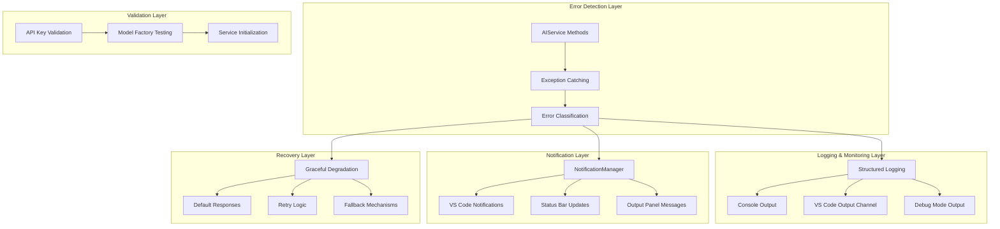
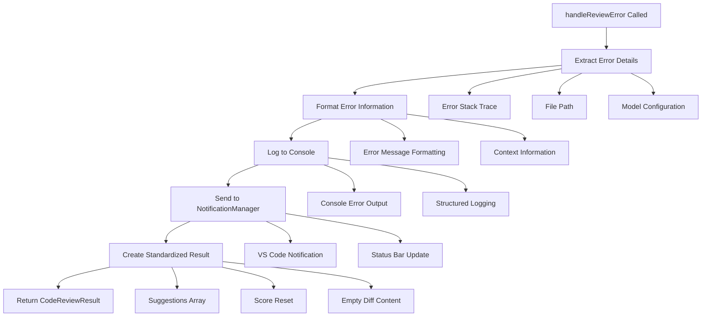
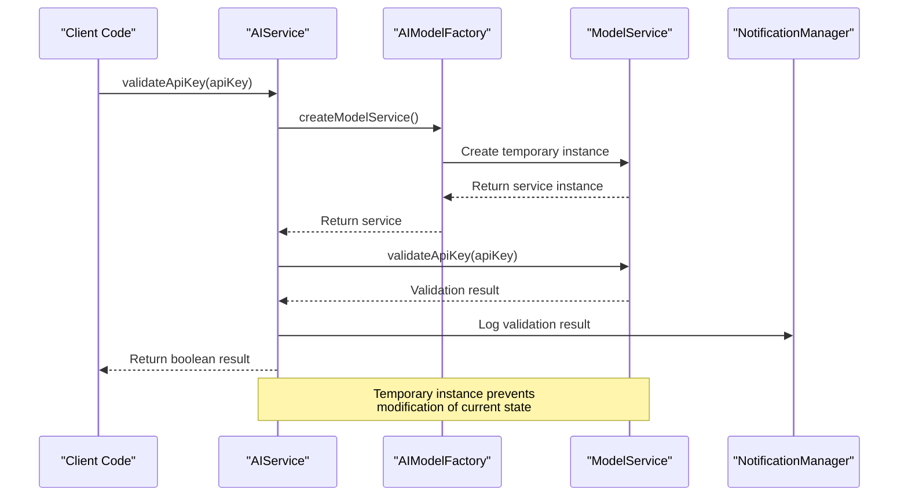
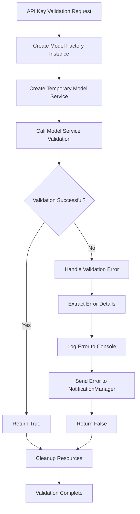
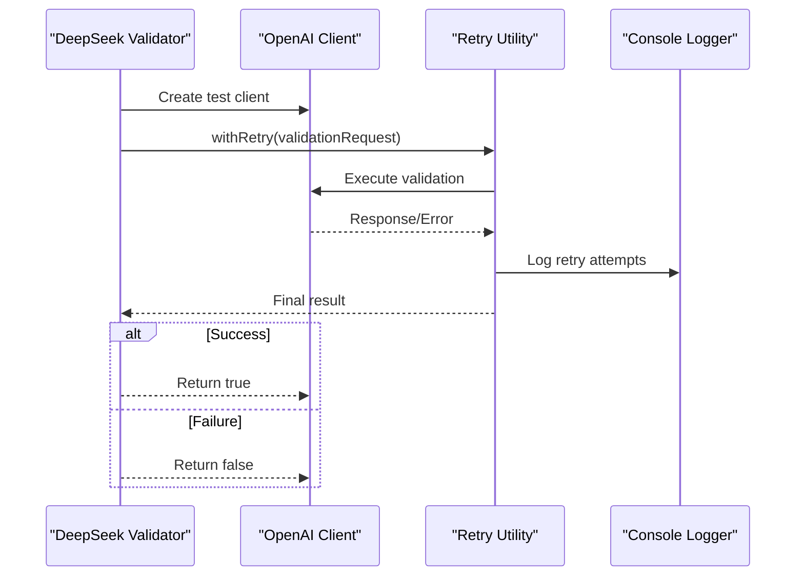
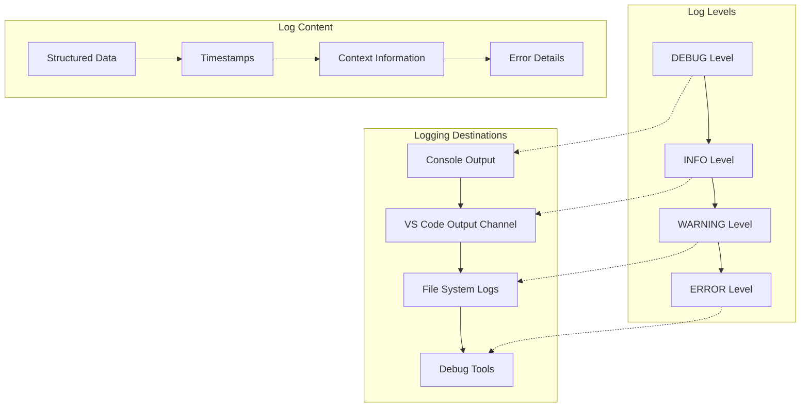
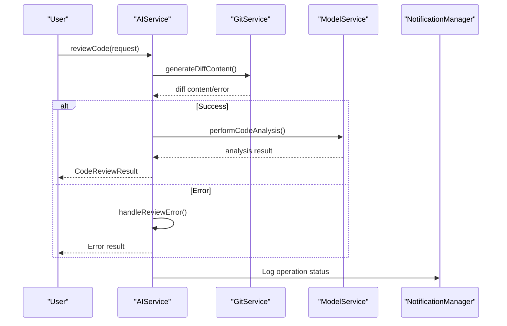

# Error Handling and Validation

<cite>
**Referenced Files in This Document**
- [aiService.ts](file://src/services/ai/aiService.ts)
- [modelValidator.ts](file://src/models/modelValidator.ts)
- [notificationManager.ts](file://src/services/notification/notificationManager.ts)
- [logger.ts](file://src/utils/logger.ts)
- [modelFactory.ts](file://src/models/modelFactory.ts)
- [modelInterface.ts](file://src/models/modelInterface.ts)
- [appConfig.ts](file://src/config/appConfig.ts)
- [retryUtils.ts](file://src/utils/retryUtils.ts)
- [deepseek.ts](file://src/models/providers/deepseek.ts)
- [constants.ts](file://src/constants/constants.ts)
- [output.ts](file://src/i18n/en/output.ts)
- [output.ts](file://src/i18n/zh/output.ts)
</cite>

## Table of Contents
1. [Introduction](#introduction)
2. [Error Handling Architecture](#error-handling-architecture)
3. [Core Error Handling Methods](#core-error-handling-methods)
4. [Validation Workflow](#validation-workflow)
5. [Common Error Scenarios](#common-error-scenarios)
6. [Logging Strategy](#logging-strategy)
7. [Integration Patterns](#integration-patterns)
8. [Best Practices](#best-practices)
9. [Troubleshooting Guide](#troubleshooting-guide)
10. [Conclusion](#conclusion)

## Introduction

The CodeKarmic extension implements a comprehensive error handling and validation system within its AIService to ensure reliable code review functionality. This system provides robust protection against various failure scenarios including API connectivity issues, invalid configurations, and service unavailability. The architecture separates error detection, logging, notification, and recovery mechanisms to maintain system stability while providing clear feedback to users.

The error handling framework operates on multiple levels: immediate error detection and reporting, comprehensive logging for debugging, user-friendly notifications through the VS Code interface, and graceful degradation when AI services are unavailable. This multi-layered approach ensures that users receive appropriate feedback regardless of the nature of the failure.

## Error Handling Architecture

The error handling system follows a layered architecture that separates concerns between error detection, logging, notification, and recovery mechanisms. This design enables flexible error management while maintaining system reliability.

**Diagram sources**
- [aiService.ts](file://src/services/ai/aiService.ts#L691-L710)
- [notificationManager.ts](file://src/services/notification/notificationManager.ts#L79-L121)
- [logger.ts](file://src/utils/logger.ts#L18-L88)

The architecture implements several key principles:

- **Separation of Concerns**: Error handling, logging, and user notification are managed by different components
- **Fail-Safe Design**: Systems continue operating with reduced functionality when parts fail
- **Progressive Disclosure**: Different levels of detail shown to users based on their technical expertise
- **Comprehensive Coverage**: All potential failure points are accounted for and handled appropriately

**Section sources**
- [aiService.ts](file://src/services/ai/aiService.ts#L40-L70)
- [notificationManager.ts](file://src/services/notification/notificationManager.ts#L8-L21)

## Core Error Handling Methods

### handleReviewError() Method

The `handleReviewError()` method serves as the primary error handling mechanism for code review operations. It captures detailed error information, formats user-friendly messages, and returns standardized results.

**Diagram sources**
- [aiService.ts](file://src/services/ai/aiService.ts#L691-L710)

#### Method Signature and Parameters

The method accepts two parameters:
- `error: any`: The caught error object containing error details
- `filePath: string`: The file path where the error occurred

#### Return Type and Structure

The method returns a `CodeReviewResult` object with standardized error information:

| Property | Type | Description |
|----------|------|-------------|
| `suggestions` | `string[]` | Contains formatted error messages for display |
| `score` | `number` | Always returns 0 for failed reviews |
| `diffContent` | `string` | Empty string for error responses |

#### Error Information Capture

The method captures comprehensive error details including:
- **Stack Trace Information**: Full stack trace when available for debugging
- **File Context**: Specific file path where the error occurred
- **Model Configuration**: Current model type and API key status
- **Service State**: Client initialization status and configuration details

#### User-Friendly Error Messaging

Error messages are formatted to provide clear, actionable information while maintaining user accessibility. The system uses localized error messages through the internationalization framework.

**Section sources**
- [aiService.ts](file://src/services/ai/aiService.ts#L691-L710)

### validateApiKey() Method

The `validateApiKey()` method provides API key validation functionality without affecting the current service instance. It creates a temporary model service for testing and returns validation results.

**Diagram sources**
- [aiService.ts](file://src/services/ai/aiService.ts#L712-L724)
- [modelFactory.ts](file://src/models/modelFactory.ts#L58-L114)

#### Validation Process

The validation workflow follows these steps:
1. **Temporary Service Creation**: Creates a new model service instance for testing
2. **API Key Testing**: Uses the model service's built-in validation method
3. **Result Processing**: Handles success/failure scenarios appropriately
4. **Error Reporting**: Logs validation attempts and failures

#### Error Handling During Validation

The method implements comprehensive error handling:
- **Service Creation Failures**: Catches and reports errors during model service instantiation
- **Validation Exceptions**: Handles API errors during the validation request
- **Logging Integration**: Provides detailed logging for debugging purposes
- **User Feedback**: Delivers clear validation results through notifications

**Section sources**
- [aiService.ts](file://src/services/ai/aiService.ts#L712-L724)
- [modelFactory.ts](file://src/models/modelFactory.ts#L58-L114)

## Validation Workflow

The validation system implements a sophisticated workflow that ensures API key validity without compromising the current service state. This workflow is crucial for maintaining system reliability while providing immediate feedback to users.

**Diagram sources**
- [aiService.ts](file://src/services/ai/aiService.ts#L712-L724)
- [modelFactory.ts](file://src/models/modelFactory.ts#L58-L114)

### Model Factory Integration

The validation process leverages the ModelFactory to create isolated service instances:

#### Factory Pattern Benefits
- **Isolation**: Temporary services don't affect the main service instance
- **Resource Management**: Automatic cleanup of temporary resources
- **Consistency**: Uses the same validation logic as production services
- **Flexibility**: Supports different model types through the factory

#### Service Creation Process
1. **Instance Retrieval**: Gets the singleton ModelFactory instance
2. **Service Instantiation**: Creates a new model service with the provided API key
3. **Validation Execution**: Calls the model-specific validation method
4. **Result Processing**: Handles success/failure scenarios

### Model-Specific Validation

Different model providers implement their own validation logic:

#### DeepSeek Model Validation
The DeepSeek provider implements comprehensive validation with retry logic:

**Diagram sources**
- [deepseek.ts](file://src/models/providers/deepseek.ts#L47-L80)

**Section sources**
- [aiService.ts](file://src/services/ai/aiService.ts#L712-L724)
- [modelFactory.ts](file://src/models/modelFactory.ts#L58-L114)
- [deepseek.ts](file://src/models/providers/deepseek.ts#L47-L80)

## Common Error Scenarios

The system handles numerous error scenarios that can occur during code review operations. Understanding these scenarios helps developers implement appropriate fallback strategies and user communication.

### API Rate Limiting

Rate limiting is a common issue when working with AI APIs. The system detects and handles rate limit errors through multiple mechanisms:

#### Detection Methods
- **HTTP Status Codes**: 429 Too Many Requests
- **Error Messages**: Specific rate limit indicators in API responses
- **Retry Headers**: X-RateLimit-* headers in API responses
- **Response Patterns**: Consistent error message formats

#### Handling Strategy
When rate limiting is detected, the system:
1. **Logs Detailed Information**: Captures rate limit context and timing
2. **Provides User Guidance**: Suggests waiting periods or alternative actions
3. **Implements Exponential Backoff**: Uses intelligent retry mechanisms
4. **Maintains Service Availability**: Continues functioning with cached results

### Network Timeouts

Network connectivity issues can cause various timeout scenarios:

#### Timeout Categories
- **Connection Timeouts**: Initial connection establishment failures
- **Request Timeouts**: Operations exceeding configured time limits
- **Read Timeouts**: Data transfer interruptions
- **Write Timeouts**: Response delivery delays

#### Recovery Mechanisms
The system implements comprehensive timeout handling:
- **Configurable Timeouts**: Adjustable based on network conditions
- **Progressive Timeout Increases**: Longer waits for subsequent attempts
- **User Feedback**: Clear indication of timeout-related issues
- **Graceful Degradation**: Alternative processing methods when applicable

### Invalid API Keys

API key validation failures are handled through multiple layers:

#### Validation Stages
1. **Format Validation**: Basic API key structure checks
2. **Service-Level Validation**: Provider-specific validation requests
3. **Runtime Validation**: Per-request API key verification
4. **Caching Strategy**: Prevents repeated validation failures

#### Error Resolution
When invalid API keys are detected:
- **Immediate Feedback**: Clear notification of the issue
- **Configuration Assistance**: Guidance for setting up API keys
- **Fallback Options**: Alternative processing methods
- **Security Considerations**: Safe handling of sensitive credentials

### Service Initialization Failures

System initialization problems can prevent proper operation:

#### Common Issues
- **Missing Dependencies**: Required libraries or modules
- **Configuration Errors**: Invalid or missing configuration values
- **Resource Constraints**: Insufficient memory or disk space
- **Network Restrictions**: Firewall or proxy blocking connections

#### Mitigation Strategies
The system provides multiple layers of protection:
- **Defensive Programming**: Early detection of initialization issues
- **Graceful Degradation**: Reduced functionality when full service unavailable
- **User Communication**: Clear explanation of limitations
- **Recovery Mechanisms**: Automatic retry and fallback options

**Section sources**
- [retryUtils.ts](file://src/utils/retryUtils.ts#L57-L116)
- [deepseek.ts](file://src/models/providers/deepseek.ts#L47-L80)
- [aiService.ts](file://src/services/ai/aiService.ts#L712-L724)

## Logging Strategy

The logging system provides comprehensive visibility into system operations while maintaining performance and usability. The strategy balances detailed debugging information with user-friendly operational insights.

### Multi-Level Logging Architecture

The system implements a hierarchical logging approach with configurable verbosity:

**Diagram sources**
- [logger.ts](file://src/utils/logger.ts#L8-L88)
- [constants.ts](file://src/constants/constants.ts#L8-L33)

### Logger Implementation

The Logger class provides structured logging capabilities:

#### Configuration Options
- **Global Log Level**: Controls minimum severity for output
- **Context-Based Logging**: Associates logs with specific components
- **Dynamic Level Adjustment**: Runtime modification of logging intensity
- **Environment-Specific Behavior**: Different behavior in development vs production

#### Log Formatting
Each log entry includes:
- **Timestamp**: Precise timing information for debugging
- **Context**: Component or module identification
- **Level Indicator**: Severity classification
- **Message Content**: Descriptive text with optional data
- **Error Information**: Stack traces and error details when applicable

### Notification Integration

The logging system integrates closely with the notification framework:

#### Event-Driven Logging
- **Progress Tracking**: Logs indicate system state changes
- **Error Reporting**: Critical issues trigger immediate notifications
- **Performance Metrics**: Timing information for optimization
- **User Actions**: Log user interactions for support purposes

#### Output Channel Management
The system maintains dedicated output channels for different purposes:
- **Main Extension Logs**: General operation information
- **AI Service Logs**: Model interactions and responses
- **Git Integration Logs**: Version control operations
- **Error Logs**: Detailed error information for debugging

**Section sources**
- [logger.ts](file://src/utils/logger.ts#L18-L88)
- [notificationManager.ts](file://src/services/notification/notificationManager.ts#L79-L121)
- [constants.ts](file://src/constants/constants.ts#L8-L33)

## Integration Patterns

The error handling and validation systems integrate seamlessly throughout the code review process, providing consistent behavior across all operations.

### Review Process Integration

Error handling is embedded in every stage of the code review workflow:

**Diagram sources**
- [aiService.ts](file://src/services/ai/aiService.ts#L74-L123)
- [aiService.ts](file://src/services/ai/aiService.ts#L242-L258)

### Batch Processing Error Handling

The batch review system implements sophisticated error handling for multiple files:

#### Error Propagation
- **Individual File Failures**: Non-critical failures don't halt batch processing
- **Partial Results**: Successful files are processed while failures are logged
- **Aggregated Reporting**: Comprehensive summary of batch operation results
- **Selective Retry**: Failed operations can be retried individually

#### Resource Management
- **Memory Optimization**: Efficient handling of large batch operations
- **Concurrent Processing**: Safe parallel execution with error isolation
- **Progress Tracking**: Real-time monitoring of batch completion status
- **Cancellation Support**: Ability to cancel long-running batch operations

### Configuration Validation

The system validates configuration settings before attempting operations:

#### Pre-Operation Checks
- **API Key Verification**: Ensures credentials are available and valid
- **Model Configuration**: Validates model type and service availability
- **Resource Availability**: Checks for sufficient system resources
- **Permission Validation**: Verifies access permissions for required operations

#### Dynamic Configuration Updates
- **Hot Reloading**: Configuration changes take effect immediately
- **Validation Triggers**: Automatic validation when settings change
- **Rollback Mechanisms**: Revert to previous settings if new ones fail
- **User Guidance**: Clear feedback when configuration changes affect functionality

**Section sources**
- [aiService.ts](file://src/services/ai/aiService.ts#L40-L70)
- [aiService.ts](file://src/services/ai/aiService.ts#L242-L258)
- [appConfig.ts](file://src/config/appConfig.ts#L49-L189)

## Best Practices

The error handling and validation system demonstrates several best practices that contribute to system reliability and user experience.

### Defensive Programming Techniques

The system employs multiple defensive programming strategies:

#### Input Validation
- **Parameter Checking**: All method parameters are validated before processing
- **Type Safety**: Strong typing prevents runtime type errors
- **Range Validation**: Numeric values are checked for valid ranges
- **Format Verification**: String inputs are validated for expected formats

#### State Management
- **Immutable Operations**: Functions avoid modifying input parameters
- **Safe Defaults**: Default values are provided for optional parameters
- **State Isolation**: Error states don't affect other system components
- **Resource Cleanup**: Proper cleanup of resources in error conditions

#### Error Boundaries
- **Try-Catch Blocks**: Comprehensive exception handling throughout the codebase
- **Fallback Values**: Default responses when operations fail
- **Graceful Degradation**: Reduced functionality when full capability isn't available
- **Recovery Mechanisms**: Automatic retry and alternative processing methods

### User Experience Considerations

The system prioritizes clear, actionable user feedback:

#### Progressive Disclosure
- **Technical Details**: Available for debugging but hidden from casual users
- **Actionable Messages**: Clear guidance on resolving issues
- **Contextual Information**: Relevant details about the error situation
- **Helpful Suggestions**: Practical advice for users to resolve problems

#### Consistent Communication
- **Standardized Messages**: Consistent terminology across the application
- **Localized Content**: Support for multiple languages and cultural contexts
- **Progress Indicators**: Clear indication of operation status
- **Completion Feedback**: Confirmation when operations succeed

### Performance Optimization

Error handling doesn't compromise system performance:

#### Efficient Error Detection
- **Early Validation**: Parameter checking before expensive operations
- **Lazy Loading**: Resources loaded only when needed
- **Caching Strategies**: Frequently accessed data cached for reuse
- **Resource Pooling**: Shared resources reduce allocation overhead

#### Minimal Overhead
- **Conditional Logging**: Logging disabled in production environments
- **Asynchronous Operations**: Non-blocking error handling operations
- **Efficient Data Structures**: Optimized storage for error information
- **Memory Management**: Proper cleanup of temporary error data

**Section sources**
- [aiService.ts](file://src/services/ai/aiService.ts#L691-L710)
- [notificationManager.ts](file://src/services/notification/notificationManager.ts#L79-L121)
- [logger.ts](file://src/utils/logger.ts#L18-L88)

## Troubleshooting Guide

This section provides practical guidance for diagnosing and resolving common error scenarios encountered in the AIService.

### API Key Issues

#### Problem: API Key Not Configured
**Symptoms**: Error messages indicating missing API credentials
**Diagnosis**: Check extension configuration and API key field
**Resolution**: 
1. Open VS Code settings
2. Navigate to CodeKarmic configuration
3. Enter valid API key for the selected model
4. Verify key format matches provider requirements

#### Problem: Invalid API Key
**Symptoms**: Validation failures and authentication errors
**Diagnosis**: Test API key independently using validation tools
**Resolution**:
1. Verify API key format and completeness
2. Check key permissions and quotas
3. Test key with provider's API documentation
4. Regenerate key if necessary

### Network Connectivity Problems

#### Problem: Connection Timeouts
**Symptoms**: Long delays followed by timeout errors
**Diagnosis**: Network connectivity and firewall configuration
**Resolution**:
1. Check internet connection stability
2. Verify firewall allows outbound connections
3. Test with different network environments
4. Adjust timeout settings if appropriate

#### Problem: Rate Limiting
**Symptoms**: 429 HTTP errors and service throttling
**Diagnosis**: Monitor request frequency and API usage
**Resolution**:
1. Implement exponential backoff
2. Reduce request frequency
3. Check API quota usage
4. Consider upgrading service tier

### Service Initialization Failures

#### Problem: Model Service Not Initialized
**Symptoms**: "AI model service not initialized" errors
**Diagnosis**: Check model configuration and service creation
**Resolution**:
1. Verify model type selection
2. Confirm API key configuration
3. Restart extension to reinitialize services
4. Check for conflicting extensions

#### Problem: Memory Issues
**Symptoms**: Out of memory errors during large file processing
**Diagnosis**: Monitor system resource usage
**Resolution**:
1. Enable large file compression
2. Reduce concurrent processing
3. Increase available memory
4. Process files in smaller batches

### Performance Issues

#### Problem: Slow Code Reviews
**Symptoms**: Extended processing times for code analysis
**Diagnosis**: Profile system performance and identify bottlenecks
**Resolution**:
1. Enable compression for large files
2. Optimize network settings
3. Use faster AI models when available
4. Process fewer files concurrently

#### Problem: High Resource Usage
**Symptoms**: System slowdown during code reviews
**Diagnosis**: Monitor CPU and memory utilization
**Resolution**:
1. Adjust processing parameters
2. Close unnecessary applications
3. Increase system resources
4. Implement caching strategies

**Section sources**
- [aiService.ts](file://src/services/ai/aiService.ts#L712-L724)
- [modelFactory.ts](file://src/models/modelFactory.ts#L58-L114)
- [retryUtils.ts](file://src/utils/retryUtils.ts#L57-L116)

## Conclusion

The error handling and validation system in the CodeKarmic AIService represents a comprehensive approach to maintaining system reliability and user satisfaction. Through careful implementation of multiple error handling layers, robust validation workflows, and thoughtful integration patterns, the system provides dependable code review functionality even in challenging environments.

The architecture's strength lies in its separation of concerns, where error detection, logging, notification, and recovery mechanisms operate independently yet cohesively. This design enables the system to gracefully handle failures while providing clear, actionable feedback to users.

Key achievements of the system include:

- **Comprehensive Error Coverage**: All major failure scenarios are accounted for and handled appropriately
- **User-Friendly Experience**: Clear messaging and guidance help users understand and resolve issues
- **Developer-Friendly Debugging**: Detailed logging and structured error information aid in troubleshooting
- **Performance Optimization**: Error handling doesn't compromise system performance
- **Extensibility**: The modular design allows for easy addition of new error handling capabilities

The validation workflow demonstrates sophisticated service testing without affecting production state, while the logging strategy provides excellent visibility into system operations. These features combine to create a robust foundation for reliable AI-powered code review functionality.

Future enhancements could include expanded error categorization, automated recovery mechanisms, and enhanced predictive error prevention. However, the current implementation provides a solid foundation that meets the needs of both novice and experienced users while maintaining the reliability required for professional development workflows.