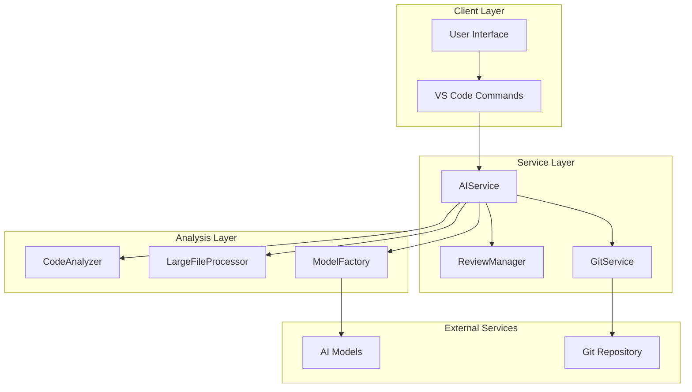
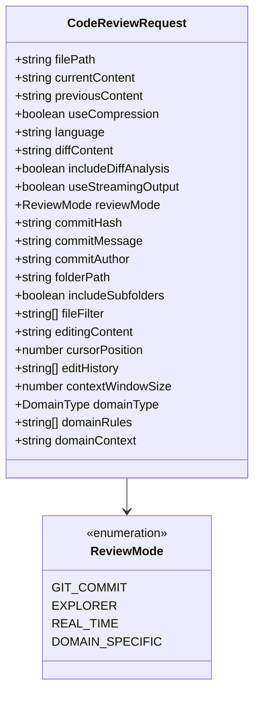
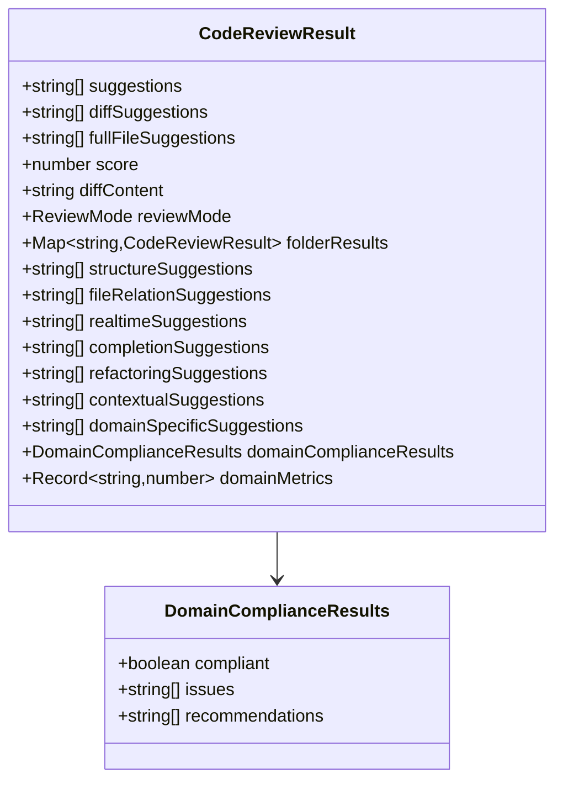
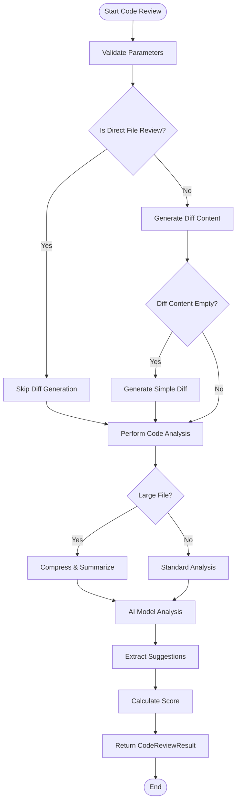
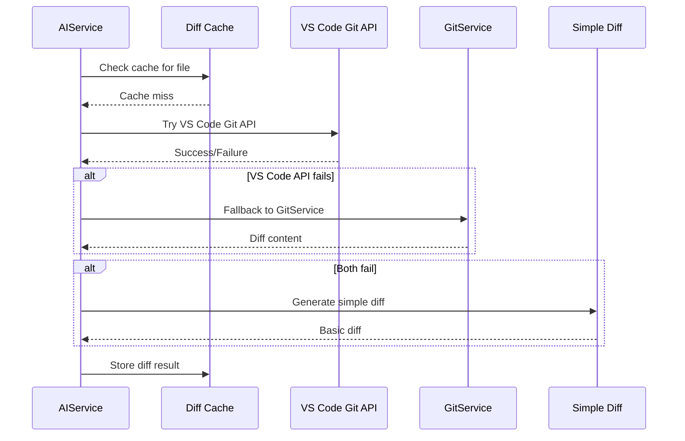
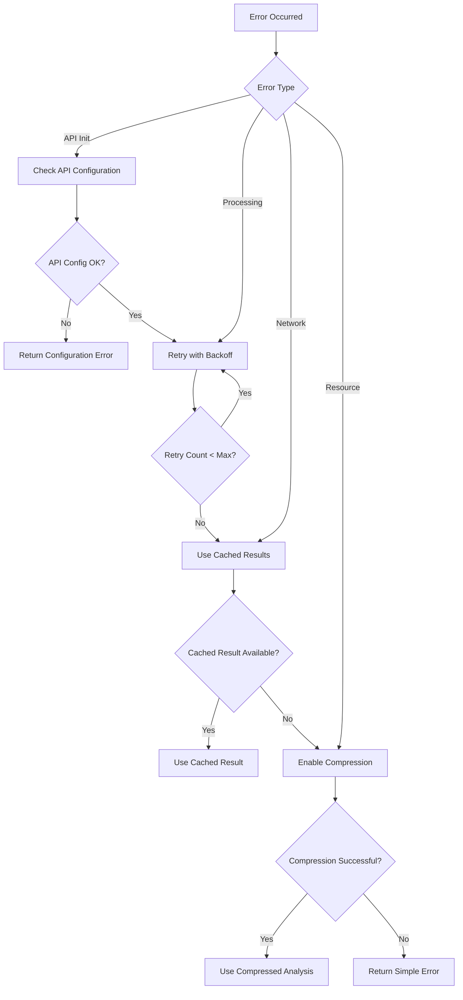
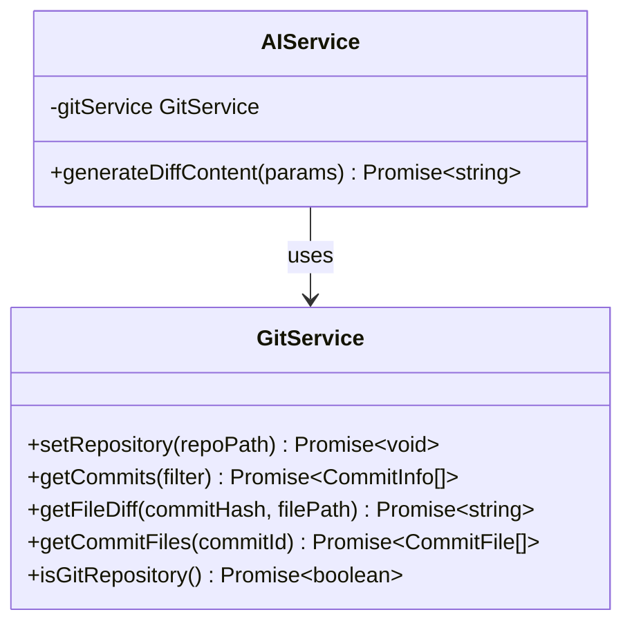

# Individual Code Review

<cite>
**Referenced Files in This Document**
- [aiService.ts](file://src/services/ai/aiService.ts)
- [reviewTypes.ts](file://src/core/review/reviewTypes.ts)
- [gitService.ts](file://src/services/git/gitService.ts)
- [modelFactory.ts](file://src/models/modelFactory.ts)
- [codeAnalyzer.ts](file://src/core/review/codeAnalyzer.ts)
- [largeFileProcessor.ts](file://src/core/compression/largeFileProcessor.ts)
- [compressionTypes.ts](file://src/core/compression/compressionTypes.ts)
- [prompts.ts](file://src/i18n/en/prompts.ts)
- [reviewManager.ts](file://src/services/review/reviewManager.ts)
</cite>

## Table of Contents
1. [Introduction](#introduction)
2. [Architecture Overview](#architecture-overview)
3. [Core Components](#core-components)
4. [CodeReviewRequest Interface](#codereviewrequest-interface)
5. [CodeReviewResult Interface](#codereviewresult-interface)
6. [reviewCode() Method Implementation](#reviewcode-method-implementation)
7. [Step-by-Step Process Analysis](#step-by-step-process-analysis)
8. [Diff Generation and Caching](#diff-generation-and-caching)
9. [AI Analysis Pipeline](#ai-analysis-pipeline)
10. [Error Handling and Fallback Mechanisms](#error-handling-and-fallback-mechanisms)
11. [Performance Optimization Techniques](#performance-optimization-techniques)
12. [Integration with External Services](#integration-with-external-services)
13. [Common Issues and Solutions](#common-issues-and-solutions)
14. [Practical Examples](#practical-examples)
15. [Best Practices](#best-practices)

## Introduction

The individual code review functionality within the AIService provides comprehensive automated code analysis capabilities for single files. This system combines advanced AI-powered analysis with intelligent diff generation, caching mechanisms, and performance optimization techniques to deliver fast, accurate code review results.

The code review system supports both Git-based file analysis and direct file review scenarios, offering flexible integration with various development workflows. It employs sophisticated caching strategies, compression techniques for large files, and multiple fallback mechanisms to ensure reliability and performance.

## Architecture Overview

The code review architecture follows a layered approach with clear separation of concerns:



**Diagram sources**
- [aiService.ts](file://src/services/ai/aiService.ts#L40-L70)
- [reviewManager.ts](file://src/services/review/reviewManager.ts#L79-L95)
- [gitService.ts](file://src/services/git/gitService.ts#L46-L55)

## Core Components

The code review system consists of several interconnected components that work together to provide comprehensive analysis:

### AIService
The central orchestrator that manages the entire code review workflow, handling initialization, parameter validation, and result aggregation.

### CodeAnalyzer
Specialized component responsible for performing detailed code analysis using AI models, with support for both full file and diff-based analysis.

### LargeFileProcessor
Handles compression and summarization of large files to manage token limits and improve processing performance.

### GitService
Manages Git operations including diff generation, commit history retrieval, and repository interaction.

**Section sources**
- [aiService.ts](file://src/services/ai/aiService.ts#L40-L70)
- [codeAnalyzer.ts](file://src/core/review/codeAnalyzer.ts#L17-L30)
- [largeFileProcessor.ts](file://src/core/compression/largeFileProcessor.ts#L23-L42)
- [gitService.ts](file://src/services/git/gitService.ts#L46-L55)

## CodeReviewRequest Interface

The `CodeReviewRequest` interface defines the input parameters for code review operations:



**Diagram sources**
- [reviewTypes.ts](file://src/core/review/reviewTypes.ts#L24-L73)

### Key Parameters

| Parameter | Type | Description | Default |
|-----------|------|-------------|---------|
| `filePath` | `string` | Absolute path to the file being reviewed | Required |
| `currentContent` | `string` | Current version of the file content | Required |
| `previousContent` | `string` | Previous version of the file content | Required |
| `useCompression` | `boolean` | Enable compression for large files (>50KB) | `false` |
| `language` | `string` | Programming language of the file | Auto-detected |
| `includeDiffAnalysis` | `boolean` | Whether to perform difference analysis | `true` |
| `useStreamingOutput` | `boolean` | Enable real-time streaming responses | `false` |

**Section sources**
- [reviewTypes.ts](file://src/core/review/reviewTypes.ts#L24-L73)

## CodeReviewResult Interface

The `CodeReviewResult` interface defines the structure of code review outcomes:



**Diagram sources**
- [reviewTypes.ts](file://src/core/review/reviewTypes.ts#L78-L125)

### Result Fields

| Field | Type | Description |
|-------|------|-------------|
| `suggestions` | `string[]` | General improvement suggestions |
| `diffSuggestions` | `string[]` | Suggestions focused on differences |
| `fullFileSuggestions` | `string[]` | Suggestions based on complete file analysis |
| `score` | `number` | Overall code quality score (1-10) |
| `diffContent` | `string` | Generated diff content for the file |

**Section sources**
- [reviewTypes.ts](file://src/core/review/reviewTypes.ts#L78-L125)

## reviewCode() Method Implementation

The `reviewCode()` method serves as the primary entry point for individual code review operations. This method orchestrates the entire review process with sophisticated error handling and optimization strategies.

### Method Signature and Parameters

The method accepts a `CodeReviewRequest` object and returns a `Promise<CodeReviewResult>`:

```typescript
public async reviewCode(params: CodeReviewRequest): Promise<CodeReviewResult>
```

### Initialization and Validation

The method begins with essential validation steps:

1. **AI Service Initialization Check**: Ensures the AI model service is properly configured
2. **File Type Validation**: Verifies the file is reviewable using supported extensions
3. **Content Validation**: Checks for valid file content and previous version availability

### Direct File Review Detection

The system distinguishes between Git-based review and direct file review:

```typescript
// Explicitly set to false indicates direct file review
const isDirectFileReview = params.includeDiffAnalysis === false;
```

This distinction affects how diff content is generated and analyzed.

**Section sources**
- [aiService.ts](file://src/services/ai/aiService.ts#L74-L119)

## Step-by-Step Process Analysis

The code review process follows a structured workflow with multiple stages:



**Diagram sources**
- [aiService.ts](file://src/services/ai/aiService.ts#L74-L119)
- [aiService.ts](file://src/services/ai/aiService.ts#L125-L239)

### Stage 1: Parameter Validation and Setup

The method validates input parameters and prepares the review environment:

1. **API Key Verification**: Ensures AI service is properly configured
2. **Logging Setup**: Initializes notification and logging infrastructure
3. **Review Mode Detection**: Determines whether to perform Git-based or direct review

### Stage 2: Diff Content Generation

For Git-based reviews, the system generates diff content using multiple strategies:

1. **VS Code Git Extension**: Fastest method using VS Code's built-in Git API
2. **Custom Git Implementation**: Fallback using the GitService library
3. **Simple Diff Generation**: Basic diff creation for edge cases

### Stage 3: Code Analysis Execution

The analysis phase combines multiple approaches:

1. **Combined Prompt Strategy**: Merges full file content with diff analysis into a single AI request
2. **Streaming Support**: Enables real-time response processing for better user experience
3. **Token Management**: Optimizes prompt length to stay within AI model limits

### Stage 4: Result Processing

Final processing includes suggestion extraction, scoring calculation, and result formatting.

**Section sources**
- [aiService.ts](file://src/services/ai/aiService.ts#L74-L119)
- [aiService.ts](file://src/services/ai/aiService.ts#L125-L239)

## Diff Generation and Caching

The diff generation system implements sophisticated caching and fallback mechanisms to optimize performance and reliability.

### Multi-Strategy Diff Generation

The system employs three primary strategies for diff generation:



**Diagram sources**
- [aiService.ts](file://src/services/ai/aiService.ts#L125-L239)
- [gitService.ts](file://src/services/git/gitService.ts#L367-L406)

### Caching Mechanism

The diff cache uses a composite key strategy:

```typescript
const cacheKey = `${params.filePath}:${this.largeFileProcessor.calculateFingerprint(params.currentContent)}`;
```

This ensures cache hits for identical file versions while allowing updates for modified content.

### Simple Diff Generation

When advanced diff generation fails, the system falls back to basic diff creation:

```typescript
private generateSimpleDiff(params: CodeReviewRequest): string {
    const diffContent = `--- a/${params.filePath}\n+++ b/${params.filePath}\n`;
    // Line-by-line comparison logic
    // ...
    return result;
}
```

**Section sources**
- [aiService.ts](file://src/services/ai/aiService.ts#L125-L239)
- [aiService.ts](file://src/services/ai/aiService.ts#L242-L258)

## AI Analysis Pipeline

The AI analysis pipeline represents the core intelligence of the code review system, combining multiple analysis strategies into unified results.

### Combined Prompt Strategy

The system employs a sophisticated approach that merges full file analysis with diff analysis:

```typescript
// Construct unified prompt combining both analysis types
let combinedPrompt = `分析以下${fileType}文件: ${fileBaseName}\n\n`;
combinedPrompt += `文件内容:\n\`\`\`${fileType}\n${params.currentContent}\n\`\`\`\n\n`;

if (options.includeDiffAnalysis && diffContent && diffContent.trim().length > 10) {
    combinedPrompt += `\n差异内容:\n\`\`\`diff\n${diffContent}\n\`\`\`\n\n`;
}
```

### Analysis Modes

The system supports multiple analysis modes:

1. **Full File Analysis**: Comprehensive review of the entire file
2. **Diff Analysis**: Focused analysis on changes only
3. **Combined Analysis**: Integrated approach using both perspectives

### Streaming and Performance

The analysis pipeline supports streaming responses for improved user experience:

```typescript
const modelRequestOptions: ModelRequestOptions = {
    maxTokens: options.maxTokens || 4000,
    temperature: 0.1,
    stream: true,
    timeoutMs: 180000,
};
```

**Section sources**
- [aiService.ts](file://src/services/ai/aiService.ts#L260-L411)
- [prompts.ts](file://src/i18n/en/prompts.ts#L1-L108)

## Error Handling and Fallback Mechanisms

The code review system implements comprehensive error handling with multiple fallback strategies.

### Error Classification

Errors are categorized into different types:

1. **Initialization Errors**: API key or service configuration issues
2. **Processing Errors**: File parsing or analysis failures
3. **Network Errors**: AI model communication problems
4. **Resource Errors**: Memory or timeout limitations

### Fallback Strategies



**Diagram sources**
- [aiService.ts](file://src/services/ai/aiService.ts#L691-L710)

### Error Recovery Mechanisms

The system implements several recovery strategies:

1. **Graceful Degradation**: Continue with reduced functionality when possible
2. **Default Responses**: Provide meaningful feedback even when analysis fails
3. **User Guidance**: Offer actionable suggestions for resolving issues

**Section sources**
- [aiService.ts](file://src/services/ai/aiService.ts#L691-L710)

## Performance Optimization Techniques

The code review system incorporates multiple optimization strategies to ensure fast and efficient operation.

### Diff Caching

The diff caching system reduces redundant Git operations:

```typescript
// Cache key includes file path and content fingerprint
const cacheKey = `${params.filePath}:${this.largeFileProcessor.calculateFingerprint(params.currentContent)}`;

// Check cache before expensive operations
if (this.diffCache.has(cacheKey)) {
    return this.diffCache.get(cacheKey) as string;
}
```

### Large File Processing

For files exceeding size thresholds, the system employs compression:

```typescript
// Automatic compression for large files (>50KB)
if (params.useCompression || params.currentContent.length > 50000) {
    return await this.performCompressedCodeAnalysis(params);
}
```

### Token Management

The system optimizes AI requests to stay within token limits:

```typescript
// Intelligent prompt construction
const combinedPrompt = `File: ${filePath}\n\n`;
combinedPrompt += `Content:\n${content}\n\n`;
combinedPrompt += `Diff:\n${diffContent}\n\n`;
combinedPrompt += `Instructions: Provide specific suggestions...`;
```

### Concurrent Processing

The system supports parallel processing for multiple files:

```typescript
// Batch processing with configurable concurrency
const batches = [];
for (let i = 0; i < files.length; i += BATCH_SIZE) {
    batches.push(files.slice(i, i + BATCH_SIZE));
}
```

**Section sources**
- [aiService.ts](file://src/services/ai/aiService.ts#L125-L239)
- [largeFileProcessor.ts](file://src/core/compression/largeFileProcessor.ts#L46-L50)

## Integration with External Services

The code review system integrates with multiple external services to provide comprehensive functionality.

### Git Integration

The system seamlessly integrates with Git repositories through multiple interfaces:



**Diagram sources**
- [gitService.ts](file://src/services/git/gitService.ts#L46-L55)
- [aiService.ts](file://src/services/ai/aiService.ts#L46-L55)

### AI Model Integration

The system supports multiple AI model providers through a factory pattern:

```typescript
// Dynamic model selection based on configuration
const modelService = modelFactory.createModelService();
```

### VS Code Extension Integration

The system integrates with VS Code's native Git capabilities:

```typescript
// Leverage VS Code's Git extension when available
const gitExtension = vscode.extensions.getExtension('vscode.git')?.exports;
if (gitExtension) {
    const api = gitExtension.getAPI(1);
    // Use VS Code's optimized Git operations
}
```

**Section sources**
- [gitService.ts](file://src/services/git/gitService.ts#L46-L55)
- [modelFactory.ts](file://src/models/modelFactory.ts#L58-L110)
- [aiService.ts](file://src/services/ai/aiService.ts#L163-L198)

## Common Issues and Solutions

Understanding common issues helps developers implement robust solutions and troubleshoot problems effectively.

### Empty Diff Content Issues

**Problem**: Generated diff content is empty or invalid
**Causes**:
- File not tracked by Git
- Working directory conflicts
- Permission issues

**Solutions**:
1. **Fallback Mechanism**: Use `generateSimpleDiff()` when advanced methods fail
2. **Validation**: Check file existence and Git tracking status
3. **Error Logging**: Comprehensive logging for debugging

### API Initialization Errors

**Problem**: AI service fails to initialize
**Causes**:
- Missing API keys
- Invalid configuration
- Network connectivity issues

**Solutions**:
1. **Configuration Validation**: Verify API key and endpoint settings
2. **Graceful Degradation**: Provide offline analysis capabilities
3. **User Feedback**: Clear error messages with resolution steps

### Large File Processing Issues

**Problem**: Performance degradation with large files
**Causes**:
- Token limits exceeded
- Memory constraints
- Processing timeouts

**Solutions**:
1. **Automatic Compression**: Enable compression for files >50KB
2. **Batch Processing**: Process files in smaller chunks
3. **Streaming Responses**: Use streaming for long-running operations

### Cache Inconsistency

**Problem**: Stale or incorrect cached results
**Causes**:
- Content fingerprint mismatches
- Cache invalidation timing
- Concurrent modifications

**Solutions**:
1. **Fingerprint Validation**: Use content hashing for cache keys
2. **Cache Expiration**: Implement TTL-based cache invalidation
3. **Consistency Checks**: Validate cache entries before use

**Section sources**
- [aiService.ts](file://src/services/ai/aiService.ts#L227-L239)
- [aiService.ts](file://src/services/ai/aiService.ts#L691-L710)
- [largeFileProcessor.ts](file://src/core/compression/largeFileProcessor.ts#L46-L50)

## Practical Examples

### Basic File Review Example

```typescript
const reviewResult = await AIService.getInstance().reviewCode({
    filePath: '/path/to/file.js',
    currentContent: 'function add(a, b) { return a + b; }',
    previousContent: 'function add(a, b) { return a + b; }',
    useCompression: false,
    includeDiffAnalysis: true
});
```

### Large File Review Example

```typescript
const largeFileResult = await AIService.getInstance().reviewCode({
    filePath: '/path/to/large-file.py',
    currentContent: '/* Very large content */',
    previousContent: '/* Previous version */',
    useCompression: true,
    includeDiffAnalysis: true
});
```

### Direct File Review Example

```typescript
const directResult = await AIService.getInstance().reviewCode({
    filePath: '/path/to/new-file.ts',
    currentContent: 'console.log("Hello World");',
    previousContent: '', // Empty for new files
    includeDiffAnalysis: false // Direct file review
});
```

### Batch Processing Example

```typescript
const batchResults = await AIService.getInstance().batchReviewCode([
    { filePath: 'file1.js', currentContent: '...', previousContent: '...' },
    { filePath: 'file2.js', currentContent: '...', previousContent: '...' }
]);
```

**Section sources**
- [aiService.ts](file://src/services/ai/aiService.ts#L141-L149)
- [aiService.ts](file://src/services/ai/aiService.ts#L431-L552)

## Best Practices

### Code Review Configuration

1. **Use Compression for Large Files**: Enable compression for files exceeding 50KB
2. **Enable Diff Analysis**: Include diff analysis for Git-based reviews
3. **Set Appropriate Token Limits**: Configure maxTokens based on your AI model
4. **Implement Caching**: Use diff caching for frequently reviewed files

### Error Handling

1. **Graceful Degradation**: Always provide fallback mechanisms
2. **Comprehensive Logging**: Log all errors with sufficient context
3. **User-Friendly Messages**: Present errors in understandable terms
4. **Retry Logic**: Implement exponential backoff for transient failures

### Performance Optimization

1. **Monitor Token Usage**: Track and optimize prompt lengths
2. **Use Streaming**: Enable streaming for better user experience
3. **Batch Operations**: Process multiple files efficiently
4. **Cache Strategically**: Implement intelligent caching policies

### Integration Guidelines

1. **Validate Dependencies**: Ensure Git and AI services are available
2. **Handle Edge Cases**: Account for missing files and permissions
3. **Provide Feedback**: Keep users informed during long operations
4. **Maintain Compatibility**: Support multiple AI model providers

### Security Considerations

1. **Sanitize Inputs**: Validate all file content before processing
2. **Limit File Sizes**: Prevent resource exhaustion attacks
3. **Secure API Keys**: Store and transmit credentials securely
4. **Audit Logs**: Maintain logs of all code review operations