# Large File Compression Handling

<cite>
**Referenced Files in This Document**
- [aiService.ts](file://src/services/ai/aiService.ts)
- [largeFileProcessor.ts](file://src/core/compression/largeFileProcessor.ts)
- [contentCompressor.ts](file://src/core/compression/contentCompressor.ts)
- [compressionTypes.ts](file://src/core/compression/compressionTypes.ts)
- [reviewTypes.ts](file://src/core/review/reviewTypes.ts)
- [codeAnalyzer.ts](file://src/core/review/codeAnalyzer.ts)
- [retryUtils.ts](file://src/utils/retryUtils.ts)
</cite>

## Table of Contents
1. [Introduction](#introduction)
2. [System Architecture Overview](#system-architecture-overview)
3. [Domain Model](#domain-model)
4. [Core Components Analysis](#core-components-analysis)
5. [Compression Workflow](#compression-workflow)
6. [Integration Points](#integration-points)
7. [Performance Optimization](#performance-optimization)
8. [Error Handling and Fallback Mechanisms](#error-handling-and-fallback-mechanisms)
9. [Practical Implementation Examples](#practical-implementation-examples)
10. [Best Practices and Troubleshooting](#best-practices-and-troubleshooting)

## Introduction

The large file compression handling functionality in CodeKarmic provides intelligent processing capabilities for files that exceed size thresholds, enabling efficient code review analysis while maintaining performance and API limitations compliance. This system seamlessly integrates compression technology with AI-powered code analysis to handle large-scale codebases effectively.

The compression system operates on multiple levels: it automatically detects oversized files, applies intelligent compression algorithms that preserve semantic meaning, and delegates processing to specialized handlers that manage the complexities of large file analysis. This approach ensures that even massive files can be analyzed comprehensively without overwhelming AI model token limits or causing memory issues.

## System Architecture Overview

The large file compression system follows a layered architecture that separates concerns between detection, compression, processing, and analysis:

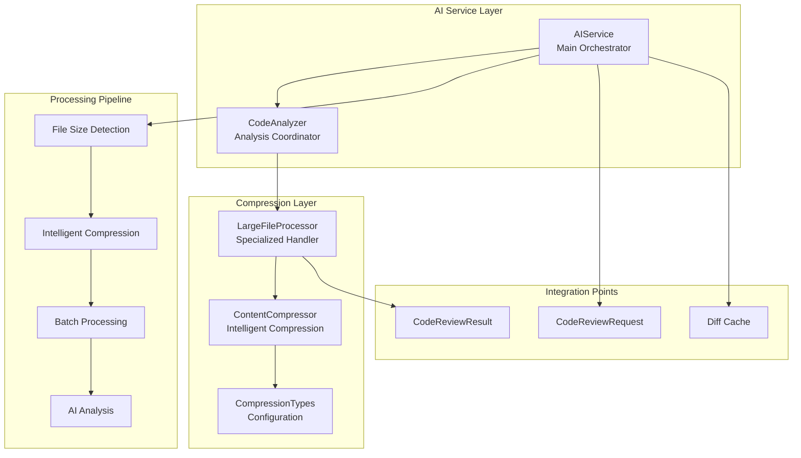

**Diagram sources**
- [aiService.ts](file://src/services/ai/aiService.ts#L40-L70)
- [largeFileProcessor.ts](file://src/core/compression/largeFileProcessor.ts#L23-L42)
- [contentCompressor.ts](file://src/core/compression/contentCompressor.ts#L18-L40)

## Domain Model

The system's domain model centers around the `CodeReviewRequest` interface, which serves as the primary contract for file processing:

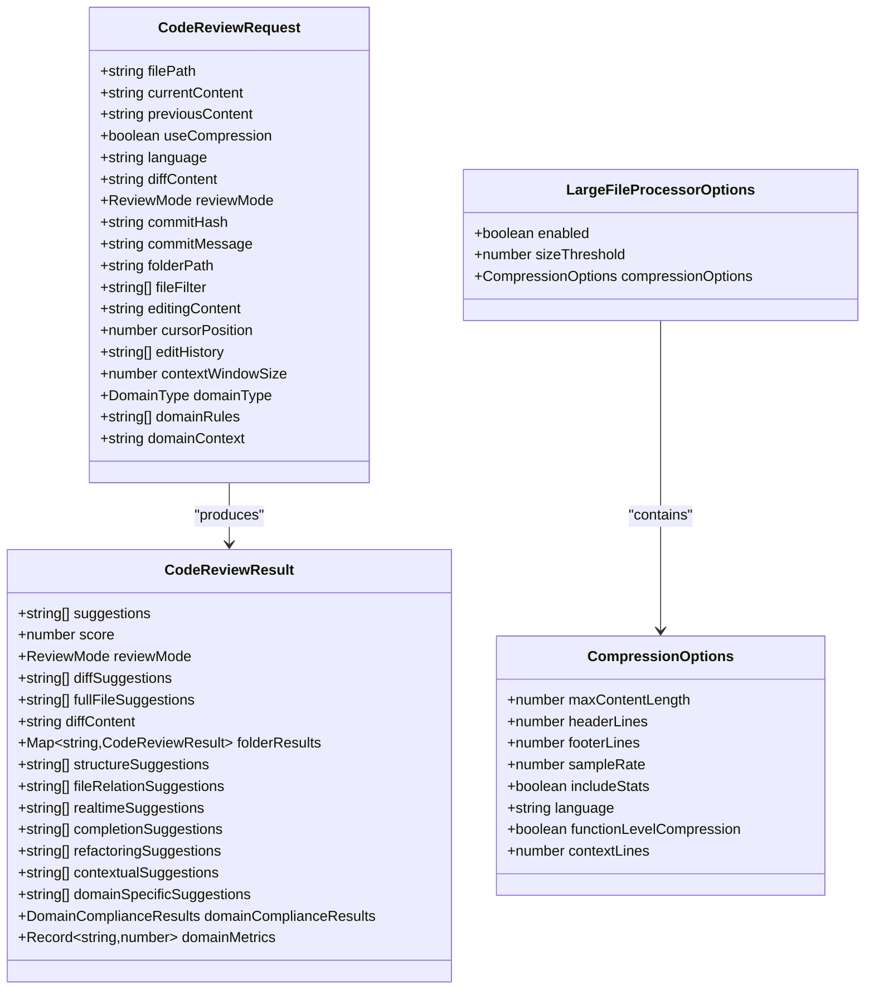

**Diagram sources**
- [reviewTypes.ts](file://src/core/review/reviewTypes.ts#L24-L73)
- [compressionTypes.ts](file://src/core/compression/compressionTypes.ts#L10-L41)

**Section sources**
- [reviewTypes.ts](file://src/core/review/reviewTypes.ts#L24-L73)
- [compressionTypes.ts](file://src/core/compression/compressionTypes.ts#L10-L87)

## Core Components Analysis

### AIService Integration

The `AIService` serves as the primary orchestrator for large file processing, integrating compression functionality through several key mechanisms:

#### Constructor Initialization
The AIService initializes the `LargeFileProcessor` singleton during construction, establishing the foundation for compression handling:

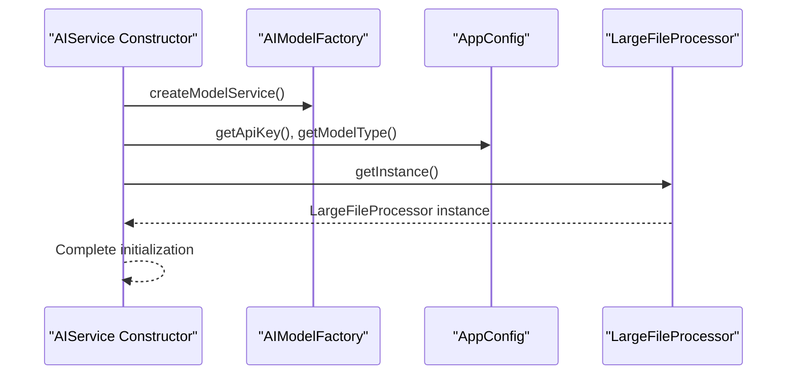

**Diagram sources**
- [aiService.ts](file://src/services/ai/aiService.ts#L50-L65)

#### Compression Decision Logic
The system employs multiple criteria to determine when compression is necessary:

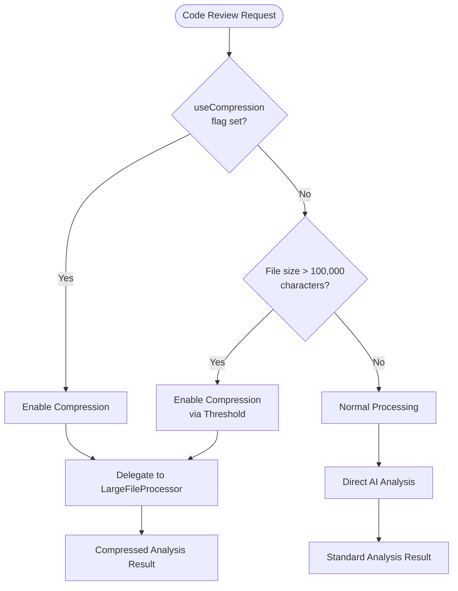

**Diagram sources**
- [aiService.ts](file://src/services/ai/aiService.ts#L448-L455)
- [aiService.ts](file://src/services/ai/aiService.ts#L277-L280)

**Section sources**
- [aiService.ts](file://src/services/ai/aiService.ts#L448-L467)
- [aiService.ts](file://src/services/ai/aiService.ts#L277-L280)

### LargeFileProcessor Architecture

The `LargeFileProcessor` implements a sophisticated singleton pattern with configurable options for handling large files:

#### Singleton Pattern Implementation
The processor maintains a single instance throughout the application lifecycle, ensuring consistent configuration and resource management:

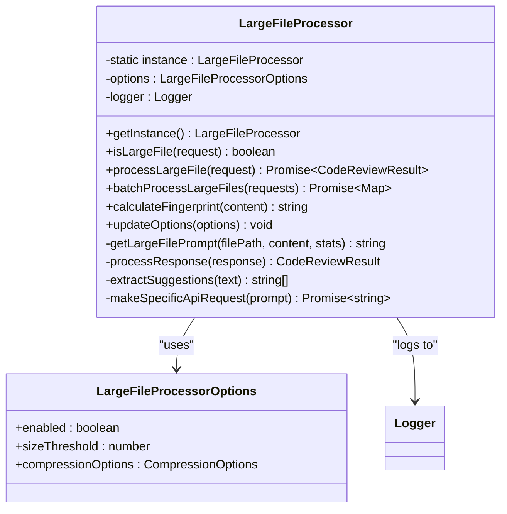

**Diagram sources**
- [largeFileProcessor.ts](file://src/core/compression/largeFileProcessor.ts#L23-L42)
- [compressionTypes.ts](file://src/core/compression/compressionTypes.ts#L64-L80)

#### File Size Detection Logic
The processor employs intelligent file size detection that considers both explicit compression flags and content length thresholds:

**Section sources**
- [largeFileProcessor.ts](file://src/core/compression/largeFileProcessor.ts#L44-L50)

### ContentCompressor Engine

The `ContentCompressor` provides the core compression algorithms with language-aware intelligence:

#### Intelligent Compression Algorithm
The compression engine uses a multi-stage approach that preserves semantic meaning while reducing file size:

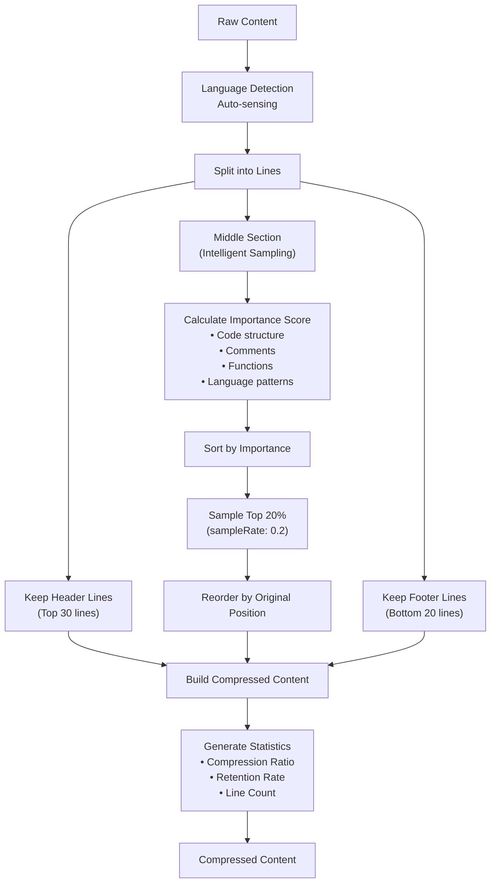

**Diagram sources**
- [contentCompressor.ts](file://src/core/compression/contentCompressor.ts#L18-L231)

**Section sources**
- [contentCompressor.ts](file://src/core/compression/contentCompressor.ts#L18-L231)

## Compression Workflow

### Trigger Conditions

The compression system activates under specific conditions that balance performance with analysis quality:

#### Explicit Compression Flag
When `useCompression` is explicitly set to `true` in the `CodeReviewRequest`, the system immediately delegates to the compression pipeline regardless of file size.

#### Automatic Threshold Detection
For files exceeding 100,000 characters, the system automatically enables compression to prevent API token limits and memory constraints.

#### Batch Processing Thresholds
In batch processing scenarios, files are categorized based on estimated token counts using the formula:
```
estimatedTokens = contentLength × 0.25 tokens/character
```

**Section sources**
- [aiService.ts](file://src/services/ai/aiService.ts#L448-L455)
- [compressionTypes.ts](file://src/core/compression/compressionTypes.ts#L85-L87)

### Compression Process Flow

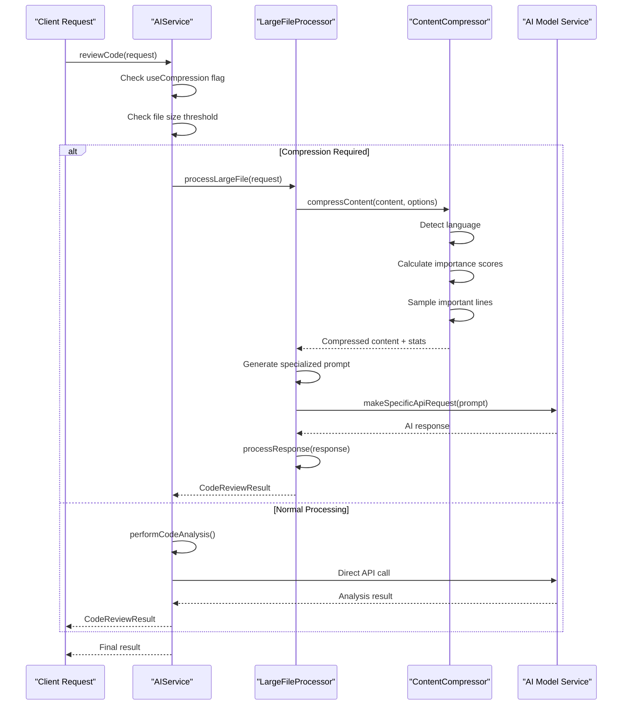

**Diagram sources**
- [aiService.ts](file://src/services/ai/aiService.ts#L412-L424)
- [largeFileProcessor.ts](file://src/core/compression/largeFileProcessor.ts#L55-L81)

### Batch Processing Optimization

The system implements sophisticated batch processing for multiple large files:

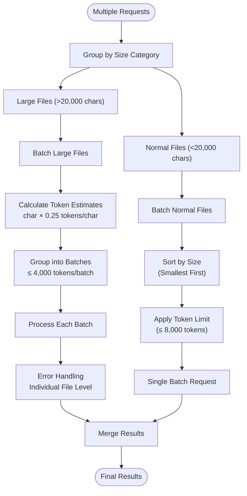

**Diagram sources**
- [aiService.ts](file://src/services/ai/aiService.ts#L439-L500)

**Section sources**
- [aiService.ts](file://src/services/ai/aiService.ts#L439-L500)

## Integration Points

### CodeAnalyzer Integration

The `CodeAnalyzer` serves as an intermediary between the `AIService` and `LargeFileProcessor`, providing a clean abstraction layer:

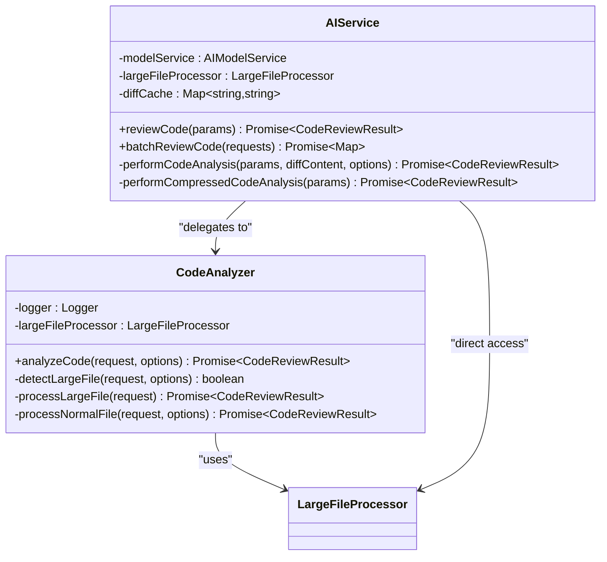

**Diagram sources**
- [codeAnalyzer.ts](file://src/core/review/codeAnalyzer.ts#L17-L53)
- [aiService.ts](file://src/services/ai/aiService.ts#L40-L70)

### Diff Content Caching

The system implements intelligent caching for diff content to optimize performance:

**Section sources**
- [aiService.ts](file://src/services/ai/aiService.ts#L125-L240)
- [codeAnalyzer.ts](file://src/core/review/codeAnalyzer.ts#L17-L53)

## Performance Optimization

### Fingerprint-Based Caching

The system employs content fingerprinting for efficient caching and duplicate detection:

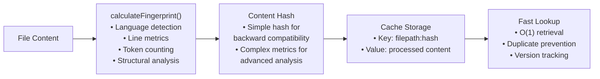

**Diagram sources**
- [contentCompressor.ts](file://src/core/compression/contentCompressor.ts#L282-L413)
- [largeFileProcessor.ts](file://src/core/compression/largeFileProcessor.ts#L107-L114)

### Memory Management Strategies

The compression system implements several memory optimization techniques:

#### Streaming Compression
For very large files, the system processes content in chunks rather than loading entire files into memory.

#### Intelligent Sampling
Instead of compressing every line, the system uses importance-based sampling to retain critical information while discarding less relevant content.

#### Garbage Collection Awareness
The system minimizes object creation and implements proper cleanup patterns to reduce garbage collection pressure.

**Section sources**
- [contentCompressor.ts](file://src/core/compression/contentCompressor.ts#L18-L231)

### Performance Metrics

The system tracks comprehensive performance metrics for optimization:

| Metric | Purpose | Calculation |
|--------|---------|-------------|
| Compression Ratio | Measure effectiveness | compressedSize / originalSize |
| Line Retention Rate | Preserve important content | keptLines / totalLines |
| Processing Time | Monitor performance | Time spent in compression |
| Memory Usage | Track resource consumption | Peak memory during processing |
| Cache Hit Rate | Optimize caching strategy | Successful cache lookups / total requests |

## Error Handling and Fallback Mechanisms

### Comprehensive Error Handling

The system implements multi-layered error handling to ensure robust operation:

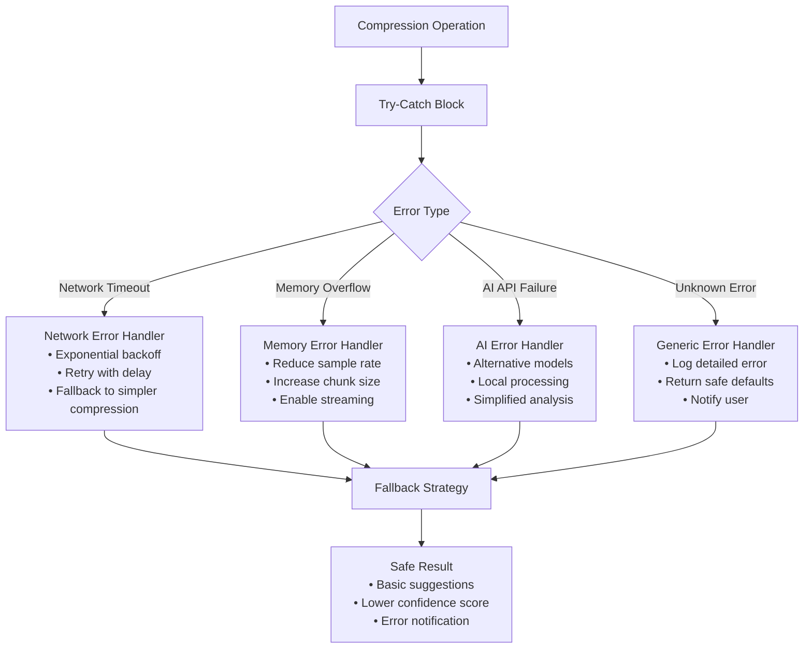

**Diagram sources**
- [largeFileProcessor.ts](file://src/core/compression/largeFileProcessor.ts#L72-L80)
- [retryUtils.ts](file://src/utils/retryUtils.ts#L33-L70)

### Timeout Scenarios

The system handles various timeout situations gracefully:

#### API Request Timeouts
- **Initial timeout**: 3 minutes for large file processing
- **Retry mechanism**: Exponential backoff with jitter
- **Fallback**: Simplified analysis with reduced content

#### Memory Allocation Timeouts
- **Detection**: Monitoring of allocation failures
- **Response**: Progressive degradation of compression quality
- **Recovery**: Automatic adjustment of compression parameters

#### Processing Timeouts
- **Batch timeouts**: Individual file timeouts within batches
- **Graceful degradation**: Partial results when full processing fails
- **Progressive enhancement**: Basic analysis when advanced features unavailable

**Section sources**
- [largeFileProcessor.ts](file://src/core/compression/largeFileProcessor.ts#L72-L80)
- [retryUtils.ts](file://src/utils/retryUtils.ts#L33-L70)

### Fallback Mechanisms

When primary compression fails, the system implements several fallback strategies:

#### Compression Fallback Chain
1. **Primary**: Full intelligent compression with language detection
2. **Secondary**: Simplified compression with basic sampling
3. **Tertiary**: Direct analysis with content truncation
4. **Quaternary**: Basic suggestions with no compression

#### Quality Degradation Strategy
The system progressively reduces compression aggressiveness while maintaining minimum analysis quality:

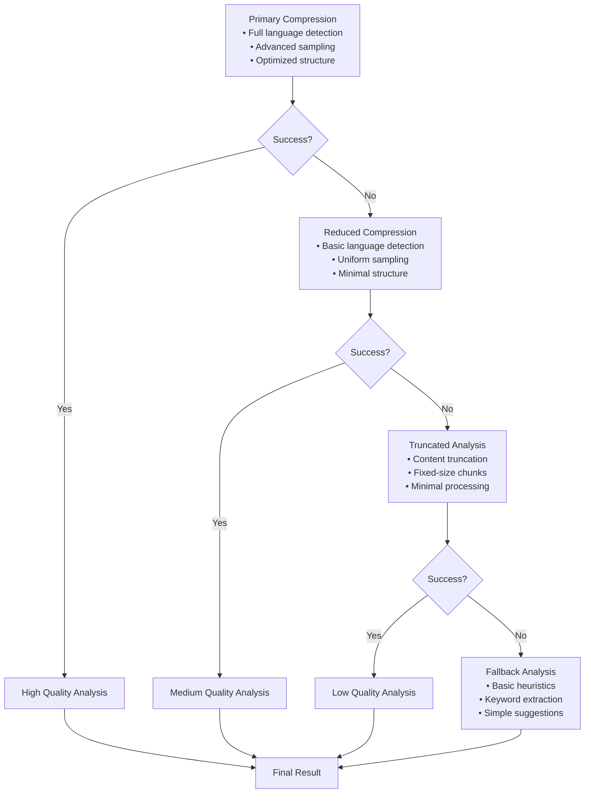

**Section sources**
- [largeFileProcessor.ts](file://src/core/compression/largeFileProcessor.ts#L72-L80)

## Practical Implementation Examples

### Basic Compression Usage

Here's how the system handles a typical large file scenario:

```typescript
// Example: Processing a large JavaScript file
const largeFileRequest: CodeReviewRequest = {
    filePath: '/path/to/large-file.js',
    currentContent: '/* Very long JavaScript content... */',
    previousContent: '/* Previous version... */',
    useCompression: true, // Explicitly enable compression
    language: 'javascript'
};

// The AIService automatically delegates to LargeFileProcessor
const result = await aiService.reviewCode(largeFileRequest);
```

### Batch Processing Example

For processing multiple large files efficiently:

```typescript
// Example: Batch processing multiple large files
const batchRequests: CodeReviewRequest[] = [
    { filePath: 'file1.js', currentContent: '...', useCompression: true },
    { filePath: 'file2.ts', currentContent: '...', useCompression: true },
    { filePath: 'file3.py', currentContent: '...', useCompression: false }
];

// AIService handles categorization and batch processing
const results = await aiService.batchReviewCode(batchRequests);
```

### Custom Compression Configuration

Advanced users can customize compression behavior:

```typescript
// Example: Custom compression options
const customOptions: Partial<LargeFileProcessorOptions> = {
    sizeThreshold: 50000, // Different threshold
    compressionOptions: {
        sampleRate: 0.3, // More aggressive sampling
        headerLines: 50, // More header preservation
        footerLines: 30  // More footer preservation
    }
};

largeFileProcessor.updateOptions(customOptions);
```

**Section sources**
- [aiService.ts](file://src/services/ai/aiService.ts#L439-L467)
- [largeFileProcessor.ts](file://src/core/compression/largeFileProcessor.ts#L230-L240)

## Best Practices and Troubleshooting

### Configuration Best Practices

#### Optimal Compression Settings
- **Sample Rate**: Start with 0.2 (20%) and adjust based on file characteristics
- **Header/Footer Lines**: Maintain 30-50 lines for context preservation
- **Size Threshold**: Use 20,000 characters for most projects, increase for larger files
- **Language Detection**: Set explicitly for better accuracy in mixed-language files

#### Performance Tuning Guidelines
- **Batch Size**: Keep individual batches under 4,000 tokens for optimal processing
- **Memory Limits**: Monitor memory usage for files > 1MB
- **Timeout Settings**: Adjust timeouts based on network conditions and file sizes
- **Caching Strategy**: Enable caching for frequently reviewed files

### Common Issues and Solutions

#### Issue: Compression Takes Too Long
**Symptoms**: Slow response times for large files
**Solutions**:
- Reduce sample rate from 0.2 to 0.15
- Decrease header/footer line counts
- Enable streaming processing for very large files

#### Issue: Poor Analysis Quality
**Symptoms**: Incomplete or inaccurate suggestions
**Solutions**:
- Increase sample rate to capture more content
- Preserve more header and footer lines
- Disable function-level compression for complex files

#### Issue: Memory Exhaustion
**Symptoms**: Out of memory errors during processing
**Solutions**:
- Reduce compression aggressiveness
- Enable chunked processing for extremely large files
- Monitor and limit concurrent processing

#### Issue: API Rate Limiting
**Symptoms**: Rate limit exceeded errors
**Solutions**:
- Implement exponential backoff retry logic
- Reduce batch sizes
- Use compression to reduce token usage

### Debugging and Monitoring

#### Logging Configuration
The system provides comprehensive logging for troubleshooting:

```typescript
// Enable debug logging for compression issues
logger.setLevel('DEBUG');
logger.info('Compression started', { 
    filePath: request.filePath,
    originalSize: request.currentContent.length,
    compressionOptions: options
});
```

#### Performance Monitoring
Track key metrics to optimize system performance:

| Metric | Target Range | Warning Threshold | Action Required |
|--------|-------------|-------------------|-----------------|
| Compression Ratio | 0.3-0.7 | < 0.2 or > 0.8 | Adjust sample rate |
| Processing Time | < 30 seconds | > 60 seconds | Optimize compression |
| Memory Usage | < 500MB | > 1GB | Reduce batch size |
| Cache Hit Rate | > 80% | < 50% | Improve caching strategy |

### Integration Patterns

#### Progressive Enhancement
Implement progressive enhancement for optimal user experience:

```typescript
// Example: Progressive enhancement pattern
async function enhancedReview(request: CodeReviewRequest) {
    try {
        // Attempt full compression
        return await aiService.reviewCode(request);
    } catch (error) {
        // Fallback to simplified compression
        const simplifiedRequest = { ...request, useCompression: true };
        return await aiService.reviewCode(simplifiedRequest);
    }
}
```

#### Error Recovery
Implement robust error recovery mechanisms:

```typescript
// Example: Error recovery pattern
async function resilientReview(request: CodeReviewRequest) {
    const retryOptions = {
        maxRetries: 3,
        initialDelay: 1000,
        backoffFactor: 2
    };
    
    return withRetry(() => aiService.reviewCode(request), retryOptions);
}
```

**Section sources**
- [retryUtils.ts](file://src/utils/retryUtils.ts#L33-L70)
- [largeFileProcessor.ts](file://src/core/compression/largeFileProcessor.ts#L72-L80)

## Conclusion

The large file compression handling functionality in CodeKarmic represents a sophisticated solution for managing code review analysis of large files. Through intelligent compression algorithms, robust error handling, and seamless integration with AI services, the system maintains high-quality analysis while optimizing performance and resource utilization.

The modular architecture ensures extensibility and maintainability, while the comprehensive error handling and fallback mechanisms guarantee reliable operation even under adverse conditions. The fingerprint-based caching system optimizes performance for repeated analyses, and the batch processing capabilities enable efficient handling of multiple large files.

This system demonstrates best practices in large-scale content processing, combining advanced compression techniques with AI-powered analysis to deliver valuable code review insights regardless of file size. The careful balance between compression aggressiveness and analysis quality ensures that developers receive meaningful feedback while maintaining system responsiveness and reliability.