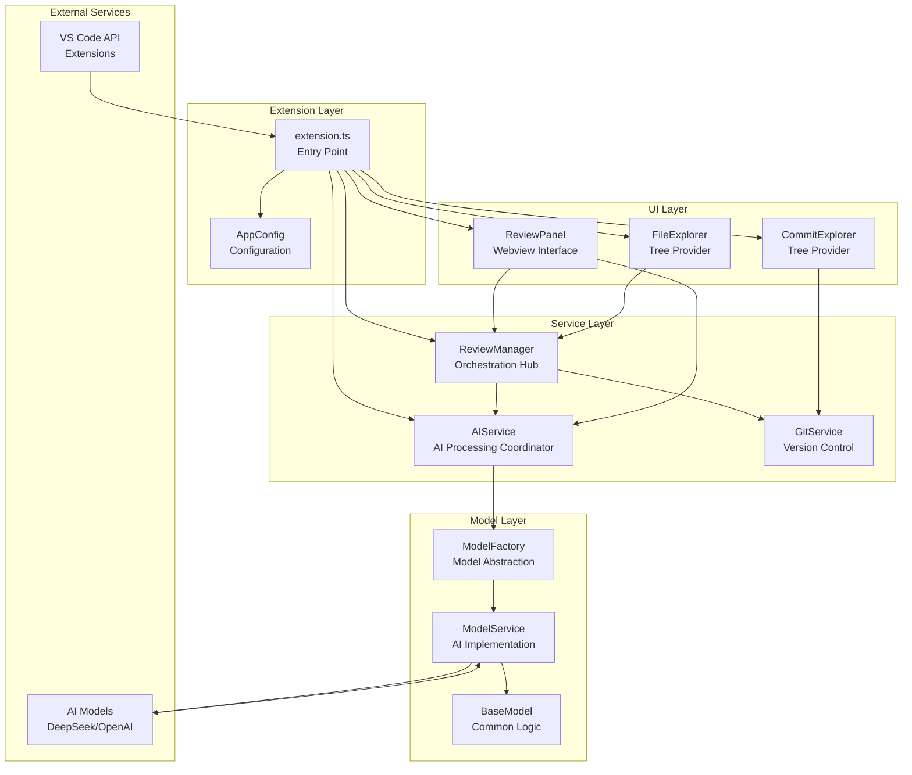
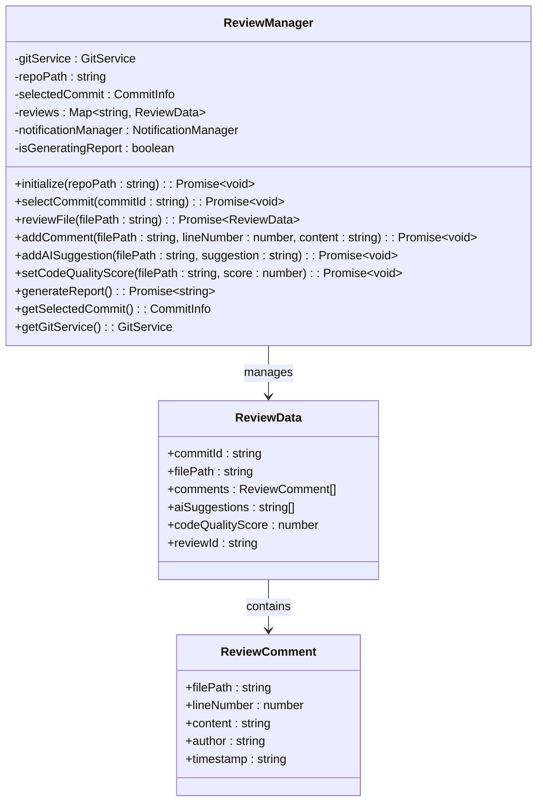
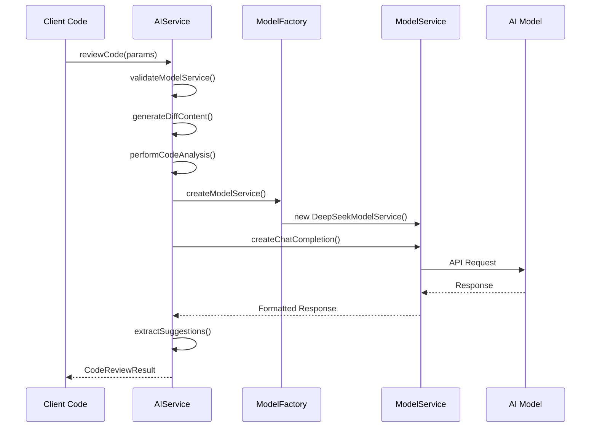
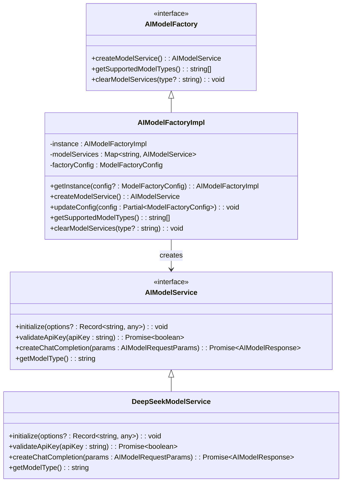
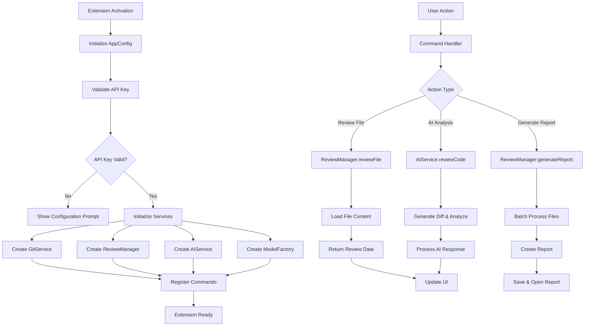
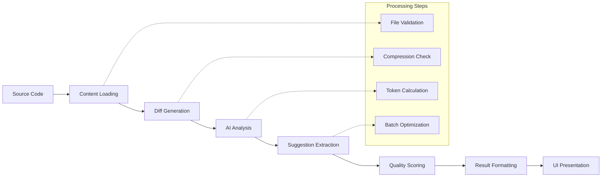

# Component Breakdown

<cite>
**Referenced Files in This Document**
- [extension.ts](file://src/extension.ts)
- [reviewManager.ts](file://src/services/review/reviewManager.ts)
- [aiService.ts](file://src/services/ai/aiService.ts)
- [modelFactory.ts](file://src/models/modelFactory.ts)
- [modelInterface.ts](file://src/models/modelInterface.ts)
- [baseModel.ts](file://src/models/baseModel.ts)
- [types.ts](file://src/models/types.ts)
- [reviewPanel.ts](file://src/ui/views/reviewPanel.ts)
- [appConfig.ts](file://src/config/appConfig.ts)
</cite>

## Table of Contents
1. [Introduction](#introduction)
2. [System Architecture Overview](#system-architecture-overview)
3. [Core Components Analysis](#core-components-analysis)
4. [Component Interactions](#component-interactions)
5. [Configuration Management](#configuration-management)
6. [Data Flow and Processing](#data-flow-and-processing)
7. [Implementation Patterns](#implementation-patterns)
8. [Practical Usage Examples](#practical-usage-examples)
9. [Troubleshooting Guide](#troubleshooting-guide)
10. [Conclusion](#conclusion)

## Introduction

CodeKarmic is an AI-powered code review assistant for VS Code that provides intelligent code analysis, suggestions, and comprehensive review capabilities. The system is built around four core components that work together to deliver a seamless code review experience: the extension entry point, ReviewManager orchestration hub, AIService AI processing coordinator, and ModelFactory AI model abstraction layer.

This documentation provides both conceptual overviews for beginners and technical details for experienced developers, covering the complete architecture, component relationships, and practical implementation patterns used throughout the system.

## System Architecture Overview

The CodeKarmic system follows a modular, layered architecture with clear separation of concerns:



**Diagram sources**
- [extension.ts](file://src/extension.ts#L1-L50)
- [reviewManager.ts](file://src/services/review/reviewManager.ts#L1-L50)
- [aiService.ts](file://src/services/ai/aiService.ts#L1-L50)
- [modelFactory.ts](file://src/models/modelFactory.ts#L1-L50)

**Section sources**
- [extension.ts](file://src/extension.ts#L1-L100)
- [reviewManager.ts](file://src/services/review/reviewManager.ts#L1-L100)

## Core Components Analysis

### Extension Entry Point (extension.ts)

The extension serves as the main entry point and orchestrator for the entire CodeKarmic system. It initializes all core services, registers commands, and manages the overall lifecycle of the extension.

**Key Responsibilities:**
- Service initialization and dependency injection
- Command registration and routing
- Workspace and repository detection
- API key validation and configuration
- Tree data provider registration
- Event handling and notifications

**Configuration Management:**
The extension performs comprehensive configuration validation during activation, including API key verification and model type validation. It provides interactive configuration prompts for users who haven't set up their credentials yet.

**Command System:**
The extension registers numerous commands for different code review workflows, from basic file review to comprehensive report generation. Each command is designed to handle various scenarios including cancellation, error handling, and progress reporting.

**Section sources**
- [extension.ts](file://src/extension.ts#L20-L100)
- [extension.ts](file://src/extension.ts#L102-L200)

### ReviewManager (Review Orchestration Hub)

ReviewManager acts as the central coordination hub for all code review operations. It manages review state, coordinates between different services, and maintains the overall review workflow.

**Core Architecture:**



**Diagram sources**
- [reviewManager.ts](file://src/services/review/reviewManager.ts#L79-L150)
- [reviewManager.ts](file://src/services/review/reviewManager.ts#L11-L26)

**Key Features:**
- **Review State Management:** Maintains review data in memory with automatic cleanup and persistence
- **Commit Selection:** Handles Git commit selection and caching for efficient review workflows
- **Parallel Processing:** Supports batch processing of multiple files with configurable concurrency
- **Report Generation:** Creates comprehensive Markdown reports with embedded WebViews
- **Error Handling:** Provides detailed error contexts and logging for debugging

**Processing Workflows:**
The ReviewManager implements sophisticated processing workflows including parallel file analysis, batch operations, and progress tracking. It handles both standalone file reviews and Git-based commit reviews seamlessly.

**Section sources**
- [reviewManager.ts](file://src/services/review/reviewManager.ts#L79-L200)
- [reviewManager.ts](file://src/services/review/reviewManager.ts#L289-L370)

### AIService (AI Processing Coordinator)

AIService serves as the primary interface for AI-powered code analysis, coordinating between the review system and various AI models. It handles complex AI workflows including diff generation, content analysis, and result processing.

**Architecture Overview:**



**Diagram sources**
- [aiService.ts](file://src/services/ai/aiService.ts#L74-L120)
- [modelFactory.ts](file://src/models/modelFactory.ts#L58-L95)

**Advanced Features:**
- **Diff Analysis:** Intelligent generation of Git diff content with fallback mechanisms
- **Batch Processing:** Efficient handling of multiple files with token optimization
- **Compression:** Automatic content compression for large files
- **Streaming Support:** Real-time response processing with progress indication
- **Retry Logic:** Robust error handling with exponential backoff

**Analysis Capabilities:**
The AIService performs comprehensive code analysis including:
- **Full File Analysis:** Complete file examination for standalone reviews
- **Diff Analysis:** Side-by-side comparison with previous versions
- **Suggestion Extraction:** Structured improvement recommendations
- **Quality Scoring:** Automated code quality assessment (1-10 scale)

**Section sources**
- [aiService.ts](file://src/services/ai/aiService.ts#L74-L200)
- [aiService.ts](file://src/services/ai/aiService.ts#L260-L400)

### ModelFactory (AI Model Abstraction Layer)

ModelFactory provides a unified interface for creating and managing different AI model services. It implements the factory pattern to support multiple AI providers while maintaining a consistent API.

**Factory Pattern Implementation:**



**Diagram sources**
- [modelFactory.ts](file://src/models/modelFactory.ts#L19-L50)
- [modelInterface.ts](file://src/models/modelInterface.ts#L39-L62)

**Configuration Management:**
The ModelFactory supports dynamic configuration including:
- **Large File Compression:** Automatic content compression for files exceeding thresholds
- **Compression Thresholds:** Configurable limits for compression triggers
- **Caching:** Intelligent caching of model instances based on configuration
- **Validation:** Runtime validation of model configurations

**Supported Models:**
Currently supports DeepSeek AI models with extensible architecture for additional providers:
- **DeepSeek V3:** General-purpose code analysis
- **DeepSeek R1:** Reasoning-focused analysis
- **OpenAI Models:** Future extensibility planned

**Section sources**
- [modelFactory.ts](file://src/models/modelFactory.ts#L19-L140)
- [modelInterface.ts](file://src/models/modelInterface.ts#L120-L140)

## Component Interactions

### Service Communication Patterns

The components communicate through well-defined interfaces and patterns:



**Diagram sources**
- [extension.ts](file://src/extension.ts#L20-L100)
- [reviewManager.ts](file://src/services/review/reviewManager.ts#L229-L262)
- [aiService.ts](file://src/services/ai/aiService.ts#L74-L120)

### Data Flow Patterns

**Review Workflow:**
1. **File Selection:** User selects files or commits through UI
2. **Content Loading:** ReviewManager loads file content and Git diffs
3. **AI Analysis:** AIService processes content with appropriate model
4. **Result Processing:** Suggestions and scores are extracted and formatted
5. **UI Updates:** Results are displayed in ReviewPanel with real-time updates

**Batch Processing:**
For multiple files, the system implements intelligent batching:
- **Token Optimization:** Groups files to maximize token efficiency
- **Parallel Execution:** Processes multiple batches concurrently
- **Progress Tracking:** Real-time progress updates with estimated completion times

**Section sources**
- [reviewManager.ts](file://src/services/review/reviewManager.ts#L289-L400)
- [aiService.ts](file://src/services/ai/aiService.ts#L431-L552)

## Configuration Management

### AppConfig System

The AppConfig class provides centralized configuration management with event-driven updates:

**Configuration Categories:**
- **Language Settings:** Internationalization support (English/Chinese)
- **API Configuration:** DeepSeek/OpenAI API keys and endpoints
- **Model Settings:** AI model selection and parameters
- **Feature Flags:** Experimental features and optimizations

**Event System:**
Configuration changes trigger events that propagate through the system:
```typescript
// Example event handling
AppConfig.getInstance().onChange(ConfigChangeEvent.API_KEY, () => {
    // Reinitialize services with new API key
});
```

**Default Values:**
The system provides sensible defaults for all configuration options:
- **Language:** English (ENGLISH)
- **Model:** DeepSeek R1 (deepseek-reasoner)
- **Base URL:** DeepSeek API endpoint
- **API Key:** Empty string (requires user configuration)

**Section sources**
- [appConfig.ts](file://src/config/appConfig.ts#L49-L189)

## Data Flow and Processing

### Code Review Pipeline

The complete code review pipeline demonstrates sophisticated data flow:



**Diagram sources**
- [aiService.ts](file://src/services/ai/aiService.ts#L260-L380)
- [reviewManager.ts](file://src/services/review/reviewManager.ts#L372-L450)

### Error Handling and Recovery

The system implements comprehensive error handling:

**Graceful Degradation:**
- **Fallback Mechanisms:** VS Code Git API fallback for diff generation
- **Retry Logic:** Exponential backoff for API failures
- **Partial Results:** Continues processing even when individual files fail
- **User Feedback:** Clear error messages with actionable suggestions

**Recovery Strategies:**
- **Cache Invalidation:** Automatic clearing of corrupted caches
- **Service Recreation:** Fresh instantiation of failed services
- **Configuration Reset:** Default values when user configuration is invalid

**Section sources**
- [aiService.ts](file://src/services/ai/aiService.ts#L691-L710)
- [reviewManager.ts](file://src/services/review/reviewManager.ts#L101-L110)

## Implementation Patterns

### Singleton Pattern

Several components implement the singleton pattern for state management:

**AIService Singleton:**
```typescript
public static getInstance(): AIService {
    if (!AIService.instance) {
        AIService.instance = new AIService();
    }
    return AIService.instance;
}
```

**AppConfig Singleton:**
Centralized configuration management with event propagation ensures consistent state across the application.

### Factory Pattern

ModelFactory implements the factory pattern for AI model creation:

**Dynamic Model Creation:**
- **Configuration-Based:** Creates appropriate model based on user configuration
- **Caching:** Reuses model instances with identical configurations
- **Validation:** Ensures model availability before instantiation

### Observer Pattern

Event-driven architecture with observer pattern:

**Configuration Events:**
```typescript
// Listen for configuration changes
AppConfig.getInstance().onChange(ConfigChangeEvent.API_KEY, () => {
    // React to API key changes
});
```

**Service Notifications:**
Components notify each other through event systems for loose coupling.

**Section sources**
- [aiService.ts](file://src/services/ai/aiService.ts#L67-L72)
- [appConfig.ts](file://src/config/appConfig.ts#L80-L110)
- [modelFactory.ts](file://src/models/modelFactory.ts#L36-L44)

## Practical Usage Examples

### Basic File Review

**Workflow:**
1. User opens a file in VS Code
2. Extension detects file type and availability
3. ReviewPanel displays file content and controls
4. User clicks "Request AI Review"
5. AIService processes file content
6. Results appear in ReviewPanel

**Code Example:**
```typescript
// Initiating a file review
await ReviewPanel.createOrShow(extensionUri, reviewManager, filePath);
await ReviewPanel.currentPanel?.performAIReview();
```

### Commit-Based Review

**Workflow:**
1. User selects a commit from commit explorer
2. ReviewManager loads commit files
3. AIService generates diffs for each file
4. Parallel analysis of all commit files
5. Comprehensive report generation

**Code Example:**
```typescript
// Selecting a commit for review
await reviewManager.selectCommit(commitHash);
const report = await reviewManager.generateReport();
```

### Batch File Processing

**Workflow:**
1. User selects multiple files or folders
2. ReviewManager divides files into optimal batches
3. AIService processes batches in parallel
4. Results aggregated and displayed

**Code Example:**
```typescript
// Batch processing with progress tracking
const results = await aiService.batchReviewCode(requests);
```

**Section sources**
- [reviewPanel.ts](file://src/ui/views/reviewPanel.ts#L149-L240)
- [reviewManager.ts](file://src/services/review/reviewManager.ts#L372-L450)
- [aiService.ts](file://src/services/ai/aiService.ts#L431-L552)

## Troubleshooting Guide

### Common Issues and Solutions

**API Key Configuration:**
- **Problem:** "API key not configured" errors
- **Solution:** Use `codekarmic.configureApiKey` command or settings panel
- **Prevention:** Validate API key during extension activation

**Model Service Initialization:**
- **Problem:** "AI service not initialized" errors
- **Solution:** Check API key validity and network connectivity
- **Debugging:** Enable detailed logging in extension settings

**Large File Processing:**
- **Problem:** Timeout or memory issues with large files
- **Solution:** Automatic compression reduces file size
- **Alternative:** Use standalone file review mode

**Git Integration Issues:**
- **Problem:** Cannot detect Git repository
- **Solution:** Ensure VS Code is opened in a Git repository
- **Workaround:** Use standalone file review for non-Git files

### Performance Optimization

**Memory Management:**
- Review data automatically cleaned up after report generation
- Model instances cached based on configuration
- Large file content compressed before processing

**Network Optimization:**
- Batch API requests for multiple files
- Streaming responses for real-time feedback
- Retry logic with exponential backoff

**Section sources**
- [aiService.ts](file://src/services/ai/aiService.ts#L691-L710)
- [reviewManager.ts](file://src/services/review/reviewManager.ts#L101-L110)

## Conclusion

The CodeKarmic system demonstrates a well-architected, modular approach to AI-powered code review. The four core components—extension.ts, ReviewManager, AIService, and ModelFactory—work together to provide a comprehensive, scalable solution for code review automation.

**Key Architectural Strengths:**
- **Modularity:** Clear separation of concerns with well-defined interfaces
- **Extensibility:** Factory pattern enables easy addition of new AI providers
- **Reliability:** Comprehensive error handling and graceful degradation
- **Performance:** Intelligent batching and caching for optimal resource utilization

**Technical Excellence:**
- **Type Safety:** Full TypeScript implementation with comprehensive type definitions
- **Asynchronous Design:** Non-blocking operations with progress tracking
- **Event-Driven Architecture:** Loose coupling through event systems
- **Configuration Management:** Centralized, validated configuration with hot reloading

The system successfully balances complexity with usability, providing powerful AI-assisted code review capabilities while maintaining simplicity for end users. Its modular design ensures maintainability and extensibility for future enhancements.