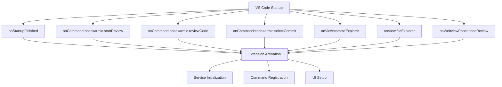
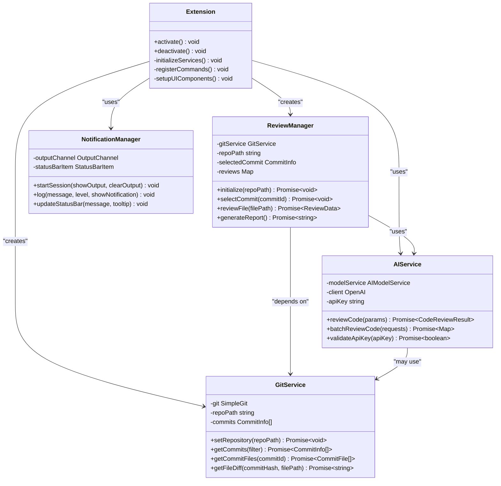
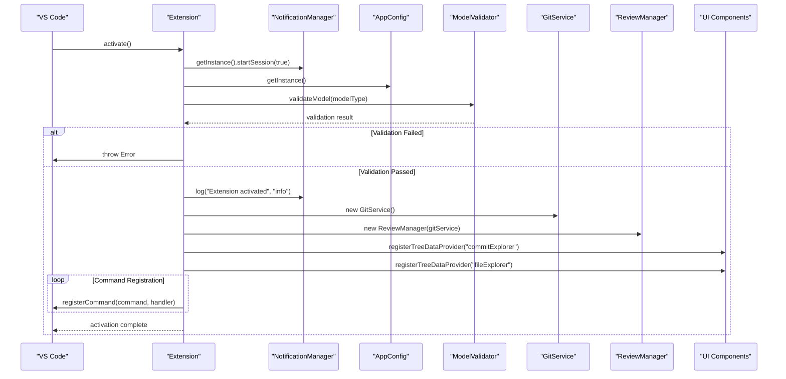

# Extension Entry Point

<cite>
**Referenced Files in This Document**
- [extension.ts](file://src/extension.ts)
- [package.json](file://package.json)
- [reviewManager.ts](file://src/services/review/reviewManager.ts)
- [gitService.ts](file://src/services/git/gitService.ts)
- [aiService.ts](file://src/services/ai/aiService.ts)
- [notificationManager.ts](file://src/services/notification/notificationManager.ts)
- [appConfig.ts](file://src/config/appConfig.ts)
- [reviewPanel.ts](file://src/ui/views/reviewPanel.ts)
</cite>

## Table of Contents
1. [Introduction](#introduction)
2. [Extension Activation Events](#extension-activation-events)
3. [Core Architecture Overview](#core-architecture-overview)
4. [Initialization Sequence](#initialization-sequence)
5. [Service Dependencies](#service-dependencies)
6. [Command Registration](#command-registration)
7. [Tree Data Providers](#tree-data-providers)
8. [API Integration](#api-integration)
9. [Error Handling](#error-handling)
10. [Extension Lifecycle Management](#extension-lifecycle-management)
11. [Technical Implementation Details](#technical-implementation-details)
12. [Best Practices](#best-practices)

## Introduction

The CodeKarmic extension serves as an AI-powered code review tool for Git repositories within Visual Studio Code. The extension's entry point (`extension.ts`) acts as the main activation mechanism that orchestrates the initialization of core services, registers commands, and establishes the user interface components. This comprehensive system enables developers to perform intelligent code reviews with AI assistance, manage Git commits, and generate detailed review reports.

The extension follows a modular architecture pattern with clear separation of concerns, implementing dependency injection principles through service instantiation and maintaining loose coupling between components. The entry point manages the entire extension lifecycle from activation to deactivation, ensuring proper resource management and graceful shutdown.

## Extension Activation Events

The extension is activated through multiple VS Code activation events defined in the package.json configuration. These events trigger the extension's initialization process when specific conditions are met:



**Diagram sources**
- [package.json](file://package.json#L26-L34)

**Section sources**
- [package.json](file://package.json#L26-L34)

## Core Architecture Overview

The extension employs a layered architecture with clear separation between presentation, business logic, and data access layers. The entry point coordinates the initialization of multiple interconnected services that work together to provide comprehensive code review capabilities.



**Diagram sources**
- [extension.ts](file://src/extension.ts#L1-L10)
- [reviewManager.ts](file://src/services/review/reviewManager.ts#L79-L95)
- [gitService.ts](file://src/services/git/gitService.ts#L45-L65)
- [aiService.ts](file://src/services/ai/aiService.ts#L40-L70)
- [notificationManager.ts](file://src/services/notification/notificationManager.ts#L8-L25)

## Initialization Sequence

The extension activation follows a carefully orchestrated initialization sequence that ensures all dependencies are properly established before the extension becomes functional. The sequence prioritizes critical services and handles potential failures gracefully.



**Diagram sources**
- [extension.ts](file://src/extension.ts#L20-L80)

**Section sources**
- [extension.ts](file://src/extension.ts#L20-L80)

## Service Dependencies

The extension maintains a sophisticated dependency injection pattern where services are instantiated and managed centrally by the extension entry point. Each service has specific responsibilities and dependencies that are carefully orchestrated during initialization.

### Core Service Instantiation

| Service | Purpose | Dependencies | Singleton Pattern |
|---------|---------|--------------|-------------------|
| NotificationManager | Logging and user notifications | None | Yes |
| AppConfig | Configuration management | VS Code Configuration API | Yes |
| GitService | Git repository operations | SimpleGit library | No |
| ReviewManager | Code review orchestration | GitService, NotificationManager | No |
| AIService | AI-powered code analysis | OpenAI client, ModelFactory | Yes |
| ReviewPanel | Webview-based UI | ReviewManager, VS Code Webview API | No |

### Dependency Resolution Strategy

The extension implements a lazy initialization strategy where services are created only when needed, reducing memory footprint and improving startup performance. Critical services like NotificationManager and AppConfig are instantiated immediately during activation, while specialized services like GitService and ReviewManager are created as needed.

**Section sources**
- [extension.ts](file://src/extension.ts#L68-L77)
- [reviewManager.ts](file://src/services/review/reviewManager.ts#L89-L95)

## Command Registration

The extension registers numerous commands that provide comprehensive functionality for code review operations. Each command is carefully designed to handle specific user workflows and integrates with the underlying service architecture.

### Command Categories

```mermaid
mindmap
root((CodeKarmic Commands))
Git Operations
startReview
selectCommit
refreshCommits
refreshFiles
filterByDateRange
filterByCommitId
AI Analysis
reviewCode
reviewFile
reviewWorkspaceFile
togglePane
reviewSelectedItems
Reporting
generateReport
reviewExplorerItem
Configuration
configureApiKey
openSettings
selectModel
Debugging
debugGit
```

**Diagram sources**
- [package.json](file://package.json#L38-L116)

### Command Implementation Patterns

Each command follows a consistent implementation pattern that includes error handling, progress reporting, and integration with the notification system:

```typescript
// Example command structure
vscode.commands.registerCommand('codekarmic.commandName', async () => {
    try {
        // Pre-execution validation
        // Service initialization
        // Business logic execution
        // Result processing
    } catch (error) {
        // Error handling and logging
        NotificationManager.getInstance().log(`Error: ${error}`, 'error', true);
    }
});
```

**Section sources**
- [extension.ts](file://src/extension.ts#L81-L520)

## Tree Data Providers

The extension implements VS Code's Tree View API to provide intuitive navigation through Git repositories and review artifacts. Two primary tree data providers are registered during activation.

### Commit Explorer Provider

The Commit Explorer displays Git commits in a hierarchical tree structure, allowing users to browse through repository history and select specific commits for review. The provider integrates with the GitService to fetch commit information and supports filtering and sorting capabilities.

### File Explorer Provider

The File Explorer shows changed files within the selected commit, enabling users to navigate through modifications and initiate code reviews on individual files or groups of files. This provider maintains synchronization with the Commit Explorer and updates dynamically as selections change.

**Section sources**
- [extension.ts](file://src/extension.ts#L74-L77)

## API Integration

The extension integrates with external APIs to provide AI-powered code analysis capabilities. The primary integration targets include OpenAI-compatible APIs and Git repositories, with robust error handling and fallback mechanisms.

### AI Service Integration

The AIService provides a unified interface for interacting with various AI models, currently supporting OpenAI-compatible endpoints. The service handles authentication, request batching, and response processing with intelligent caching mechanisms.

### Authentication Management

API key validation occurs during extension activation and subsequent command execution. The system provides seamless fallback to manual configuration when keys are missing or invalid, ensuring uninterrupted user experience.

**Section sources**
- [aiService.ts](file://src/services/ai/aiService.ts#L712-L732)
- [extension.ts](file://src/extension.ts#L37-L66)

## Error Handling

The extension implements comprehensive error handling strategies that provide meaningful feedback to users while maintaining system stability. Error handling follows a layered approach with specific handlers for different failure scenarios.

### Error Classification

| Error Type | Handling Strategy | User Feedback | Recovery Action |
|------------|------------------|---------------|-----------------|
| Configuration Errors | Immediate validation | Modal dialog | Manual correction |
| Network Errors | Retry with exponential backoff | Progress indicator | Automatic retry |
| API Errors | Graceful degradation | Notification | Fallback processing |
| File System Errors | Local caching | Warning message | Offline mode |
| Git Operation Errors | Context-aware recovery | Error overlay | Alternative method |

### Error Recovery Mechanisms

The extension implements several error recovery mechanisms including automatic retry logic, fallback processing methods, and graceful degradation when core services become unavailable. Users receive appropriate feedback through the notification system while the extension attempts to recover from transient failures.

**Section sources**
- [extension.ts](file://src/extension.ts#L515-L520)
- [reviewManager.ts](file://src/services/review/reviewManager.ts#L101-L105)

## Extension Lifecycle Management

The extension follows VS Code's lifecycle management patterns with proper initialization and cleanup procedures. The activation and deactivation functions serve as entry and exit points for the extension's operational state.

### Activation Process

The activate function performs comprehensive initialization including service instantiation, command registration, UI setup, and dependency resolution. The function implements defensive programming practices with early validation and graceful error handling.

### Deactivation Process

The deactivate function provides a clean shutdown mechanism that logs the deactivation event and allows VS Code to manage resource cleanup. While the current implementation is minimal, it provides a foundation for future enhancements.

**Section sources**
- [extension.ts](file://src/extension.ts#L20-L520)
- [extension.ts](file://src/extension.ts#L662-L665)

## Technical Implementation Details

The extension's technical implementation demonstrates advanced TypeScript patterns, asynchronous programming techniques, and VS Code API integration. Key implementation details include:

### Asynchronous Programming Patterns

The extension extensively uses async/await patterns for handling asynchronous operations including Git operations, API calls, and file system access. Progress indicators and cancellation support are implemented throughout the asynchronous workflows.

### Memory Management

The extension implements careful memory management with proper disposal of resources, especially for long-running operations like file processing and AI analysis. Weak references and cleanup callbacks prevent memory leaks in extended usage scenarios.

### Performance Optimization

Several performance optimization techniques are employed including request batching, intelligent caching, and lazy loading of expensive operations. The extension monitors performance metrics and adjusts processing strategies based on system resources.

### Internationalization Support

The extension supports multiple languages through a comprehensive internationalization framework that handles text localization, date formatting, and cultural adaptations for different regions.

**Section sources**
- [extension.ts](file://src/extension.ts#L140-L185)
- [reviewManager.ts](file://src/services/review/reviewManager.ts#L329-L370)

## Best Practices

The extension demonstrates several software engineering best practices that contribute to maintainability, reliability, and user experience:

### Modular Design

The extension architecture promotes modularity through clear separation of concerns, interface abstraction, and dependency inversion. Services are loosely coupled and can be independently tested and maintained.

### Defensive Programming

The extension implements comprehensive input validation, error checking, and boundary condition handling. Null checks, type guards, and validation routines prevent runtime errors and provide graceful degradation.

### User Experience Focus

The extension prioritizes user experience through responsive UI updates, meaningful progress indicators, and contextual help. Error messages are actionable and provide clear guidance for resolution.

### Testing and Quality Assurance

The extension includes comprehensive testing infrastructure with unit tests, integration tests, and end-to-end scenarios. Code quality is maintained through automated linting, formatting, and continuous integration practices.

### Documentation and Maintenance

The extension provides extensive inline documentation, TypeScript type definitions, and usage examples. Regular maintenance includes dependency updates, security patches, and feature enhancements based on user feedback.