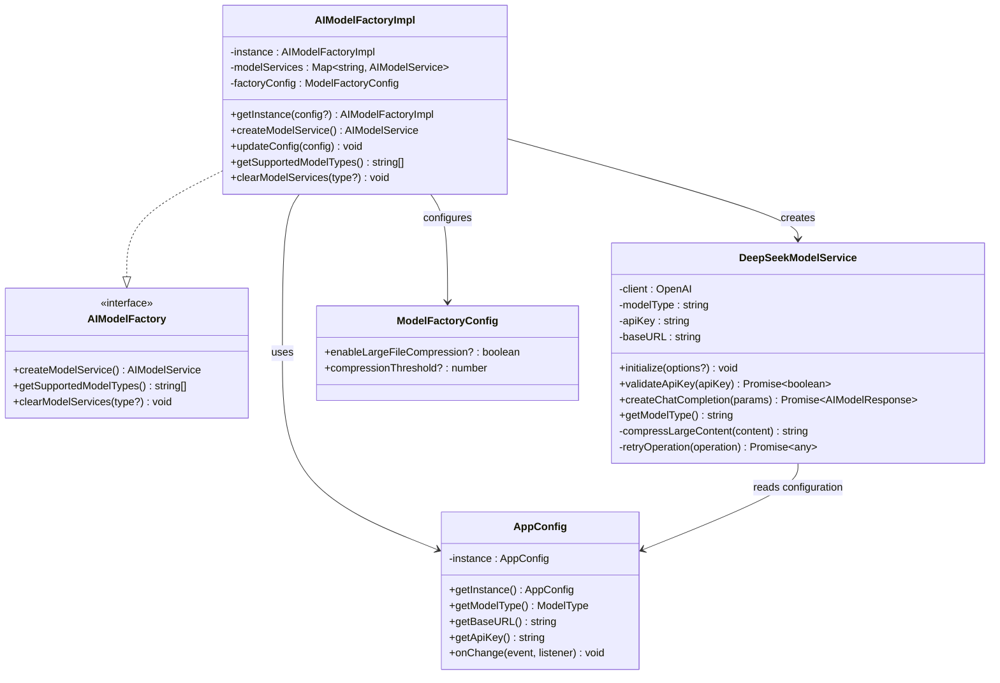
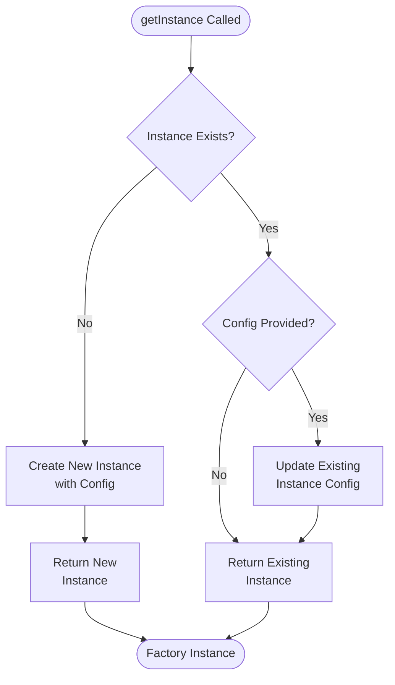
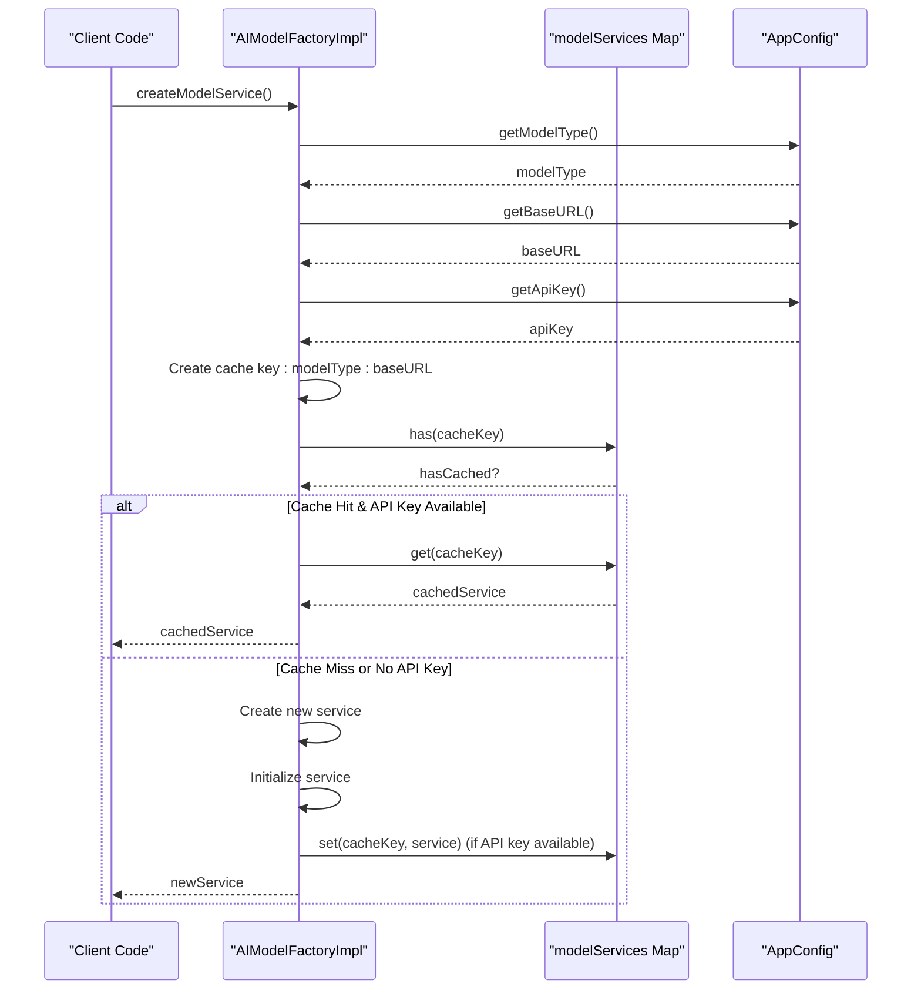
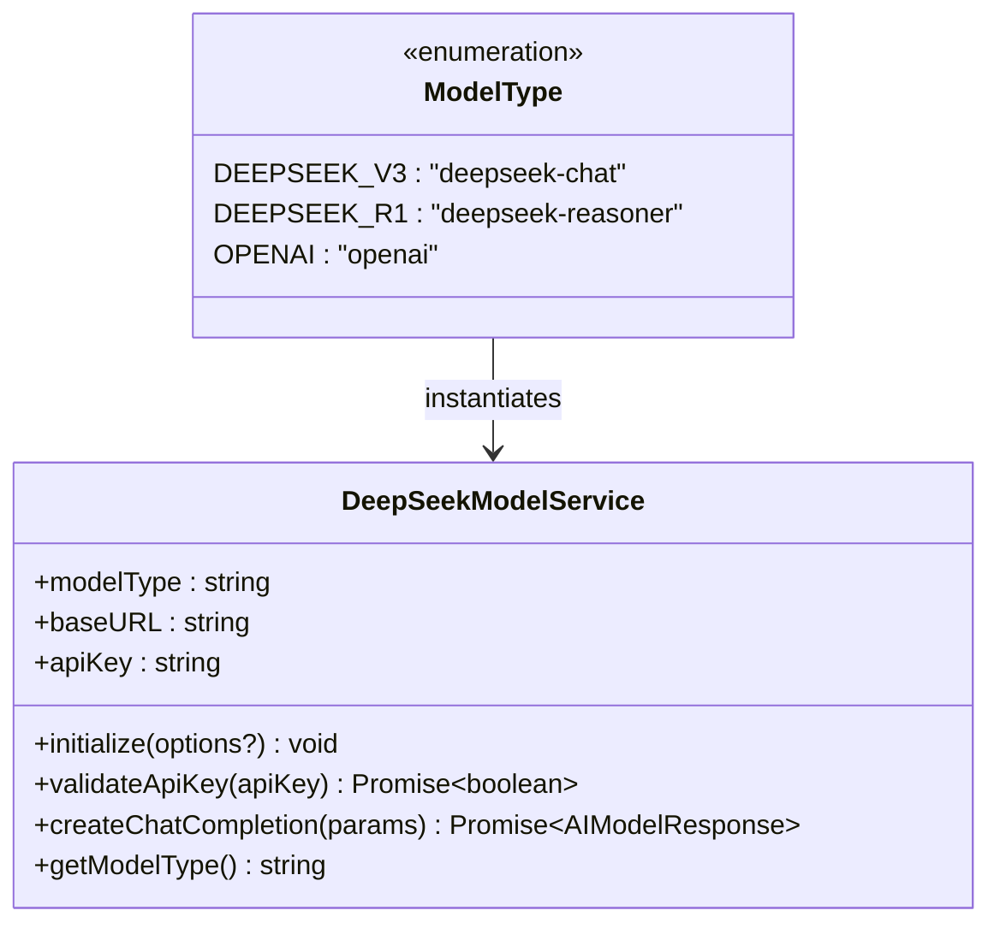
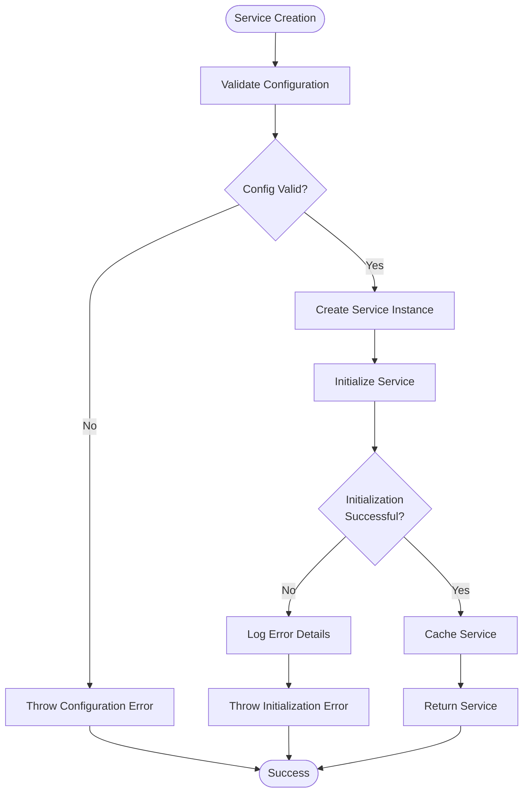

# Model Factory

<cite>
**Referenced Files in This Document**
- [modelFactory.ts](file://src/models/modelFactory.ts)
- [deepseek.ts](file://src/models/providers/deepseek.ts)
- [appConfig.ts](file://src/config/appConfig.ts)
- [types.ts](file://src/models/types.ts)
- [modelInterface.ts](file://src/models/modelInterface.ts)
- [aiService.ts](file://src/services/ai/aiService.ts)
- [index.ts](file://src/i18n/index.ts)
</cite>

## Table of Contents
1. [Introduction](#introduction)
2. [Architecture Overview](#architecture-overview)
3. [Core Components](#core-components)
4. [Singleton Pattern Implementation](#singleton-pattern-implementation)
5. [Caching Mechanism](#caching-mechanism)
6. [Configuration Management](#configuration-management)
7. [Model Type Support](#model-type-support)
8. [Error Handling](#error-handling)
9. [Usage Examples](#usage-examples)
10. [Best Practices](#best-practices)
11. [Troubleshooting](#troubleshooting)

## Introduction

The AIModelFactoryImpl class serves as the central abstraction layer for AI model instantiation in the CodeKarmic extension. It implements a sophisticated factory pattern that manages the creation, caching, and lifecycle of AI model services, particularly focusing on DeepSeek model variants. The factory provides a unified interface for accessing different AI models while optimizing performance through intelligent caching and configuration management.

This component acts as the primary entry point for AI model operations, handling the complexities of model initialization, API key validation, and service lifecycle management. It ensures efficient resource utilization by maintaining cached instances of model services and supports dynamic configuration updates at runtime.

## Architecture Overview

The AIModelFactoryImpl follows a layered architecture that separates concerns between configuration management, service creation, and caching mechanisms. The factory integrates closely with the AppConfig system for centralized configuration management and maintains loose coupling with specific model implementations through the AIModelService interface.



**Diagram sources**
- [modelFactory.ts](file://src/models/modelFactory.ts#L19-L140)
- [modelInterface.ts](file://src/models/modelInterface.ts#L120-L139)
- [deepseek.ts](file://src/models/providers/deepseek.ts#L11-L211)
- [appConfig.ts](file://src/config/appConfig.ts#L49-L189)

## Core Components

### AIModelFactoryImpl Class

The AIModelFactoryImpl class implements the AIModelFactory interface and serves as the central hub for AI model service management. It maintains several key components that work together to provide a robust and efficient model service factory.

#### Instance Management
The factory maintains a private static instance that follows the singleton pattern, ensuring only one factory instance exists throughout the application lifecycle. This design choice optimizes memory usage and provides consistent behavior across the application.

#### Service Caching
A Map-based caching system stores instantiated model services using composite keys derived from model type and base URL. This approach prevents redundant service creation while allowing multiple configurations to coexist.

#### Configuration Storage
The factory stores its own configuration separate from the global AppConfig system, allowing for factory-specific optimizations and runtime adjustments without affecting global settings.

**Section sources**
- [modelFactory.ts](file://src/models/modelFactory.ts#L19-L30)

### ModelFactoryConfig Interface

The ModelFactoryConfig interface defines the factory's configurable parameters that control large file processing behavior:

| Parameter | Type | Default Value | Description |
|-----------|------|---------------|-------------|
| enableLargeFileCompression | boolean | true | Enables automatic compression of large files for better processing performance |
| compressionThreshold | number | 10000 | Minimum character count before compression is applied to files |

These settings optimize memory usage and processing speed for large files while maintaining quality for smaller content.

**Section sources**
- [modelFactory.ts](file://src/models/modelFactory.ts#L10-L13)

## Singleton Pattern Implementation

The AIModelFactoryImpl implements a sophisticated singleton pattern that supports both initial instantiation and runtime configuration updates. The implementation ensures thread-safe access to the factory instance while providing flexibility for configuration changes.

### getInstance Method

The getInstance method demonstrates intelligent singleton behavior:



**Diagram sources**
- [modelFactory.ts](file://src/models/modelFactory.ts#L36-L43)

The method checks for an existing instance and either creates a new one or updates the configuration of the existing instance. This design allows for flexible initialization scenarios while maintaining singleton guarantees.

### Thread Safety Considerations

While JavaScript is single-threaded, the singleton implementation ensures safe access patterns through immediate assignment and conditional logic. The factory's internal state modifications are atomic operations that don't require explicit synchronization.

**Section sources**
- [modelFactory.ts](file://src/models/modelFactory.ts#L36-L43)

## Caching Mechanism

The factory implements an intelligent caching system that balances performance optimization with memory efficiency. The caching strategy uses composite keys combining model type and base URL to support multiple configurations.

### Cache Key Strategy

The cache key is constructed using the pattern `{modelType}:{baseURL}`, creating unique identifiers for different model configurations. This approach enables:

- **Multiple Model Types**: Different AI models can coexist in the cache
- **Different Endpoints**: Same model type with different base URLs are treated as distinct services
- **Memory Efficiency**: Only one instance per unique configuration combination

### Cache Lookup Process



**Diagram sources**
- [modelFactory.ts](file://src/models/modelFactory.ts#L58-L113)

### Cache Management Operations

The factory provides several methods for cache management:

#### clearModelServices Method
The clearModelServices method offers granular cache control:

- **Specific Type Clearing**: Removes services for a specific model type using partial key matching
- **Full Cache Clearing**: Removes all cached services when no type is specified
- **Memory Optimization**: Helps prevent memory leaks during configuration changes

**Section sources**
- [modelFactory.ts](file://src/models/modelFactory.ts#L115-L139)

## Configuration Management

The factory integrates seamlessly with the AppConfig system while maintaining its own configuration state. This dual-layer approach provides flexibility for both global and factory-specific settings.

### AppConfig Integration

The factory retrieves configuration from AppConfig through a series of getter methods:

| Configuration Item | Getter Method | Purpose |
|-------------------|---------------|---------|
| Model Type | `config.getModelType()` | Determines which AI model variant to instantiate |
| Base URL | `config.getBaseURL()` | Specifies the API endpoint for model requests |
| API Key | `config.getApiKey()` | Authenticates requests to the AI service |

### Runtime Configuration Updates

The factory supports dynamic configuration updates through the updateConfig method, which merges new settings with existing configuration. This capability enables:

- **Hot Configuration Changes**: Settings can be updated without restarting the factory
- **Partial Updates**: Only specified configuration values are modified
- **Backward Compatibility**: Unspecified values retain their previous settings

### Default Configuration Values

When no factory configuration is provided, the factory initializes with sensible defaults:

- **Large File Compression**: Enabled by default for optimal performance
- **Compression Threshold**: Set to 10,000 characters for balanced performance

**Section sources**
- [modelFactory.ts](file://src/models/modelFactory.ts#L58-L62)
- [modelFactory.ts](file://src/models/modelFactory.ts#L25-L29)

## Model Type Support

The factory currently supports DeepSeek model variants through the ModelType enumeration. The implementation demonstrates extensible design that can accommodate additional model providers.

### Supported Model Types



**Diagram sources**
- [types.ts](file://src/models/types.ts#L10-L13)
- [deepseek.ts](file://src/models/providers/deepseek.ts#L11-L211)

### Model Type Detection and Validation

The factory performs comprehensive validation of model types:

1. **Presence Validation**: Ensures a model type is configured
2. **Support Validation**: Verifies the model type is supported by the factory
3. **Case Insensitive Matching**: Handles variations in model type casing

### Extensibility for Future Models

The factory's design allows for easy addition of new model types:

- **Switch Statement Expansion**: New model types can be added to the switch statement
- **Interface Compliance**: New models must implement the AIModelService interface
- **Configuration Integration**: New models integrate with the AppConfig system automatically

**Section sources**
- [modelFactory.ts](file://src/models/modelFactory.ts#L85-L92)
- [types.ts](file://src/models/types.ts#L10-L13)

## Error Handling

The factory implements comprehensive error handling that covers configuration validation, service initialization, and runtime failures. The error handling strategy prioritizes user feedback while maintaining system stability.

### Configuration Validation Errors

The factory throws specific errors for various configuration issues:

| Error Condition | Error Message | Resolution |
|----------------|---------------|------------|
| Missing Model Type | `OUTPUT.MODEL.NO_MODEL_TYPE` | Configure a valid model type in settings |
| Missing Base URL | `OUTPUT.MODEL.NO_BASE_URL` | Set a valid API base URL |
| Unsupported Model Type | `OUTPUT.MODEL.UNSUPPORTED_MODEL_TYPE + modelType` | Use a supported model type |

### Service Initialization Failures

During service creation, the factory handles initialization failures gracefully:



**Diagram sources**
- [modelFactory.ts](file://src/models/modelFactory.ts#L58-L113)

### API Key Validation

The factory relies on the underlying DeepSeekModelService for API key validation, which provides robust error handling for authentication issues. The validation process includes:

- **Network Timeout Handling**: Prevents hanging requests
- **Retry Logic**: Attempts multiple connection attempts
- **Error Classification**: Distinguishes between network and authentication errors

**Section sources**
- [modelFactory.ts](file://src/models/modelFactory.ts#L64-L70)
- [modelFactory.ts](file://src/models/modelFactory.ts#L111-L112)

## Usage Examples

### Basic Factory Usage

The most common usage pattern involves obtaining a factory instance and creating model services:

```typescript
// Get factory instance with default configuration
const factory = AIModelFactoryImpl.getInstance();

// Create model service (uses cached instance if available)
const modelService = factory.createModelService();
```

### Dynamic Configuration Updates

The factory supports runtime configuration changes:

```typescript
// Update factory configuration
factory.updateConfig({
    enableLargeFileCompression: false,
    compressionThreshold: 5000
});

// This affects future service creations but not existing cached services
```

### Cache Management

The factory provides methods for managing cached services:

```typescript
// Clear all cached services
factory.clearModelServices();

// Clear services for a specific model type
factory.clearModelServices(ModelType.DEEPSEEK_V3);
```

### Integration with AI Service

The factory integrates seamlessly with the AIService for code review operations:

```typescript
// AIService automatically uses the factory for model service creation
const aiService = AIService.getInstance();
const reviewResult = await aiService.reviewCode(reviewRequest);
```

**Section sources**
- [aiService.ts](file://src/services/ai/aiService.ts#L50-L61)
- [aiService.ts](file://src/services/ai/aiService.ts#L726-L731)

## Best Practices

### Memory Management

- **Cache Size Monitoring**: Regularly monitor cache size to prevent memory leaks
- **Selective Clearing**: Use targeted cache clearing when configuration changes
- **Resource Cleanup**: Ensure proper cleanup of unused model services

### Configuration Management

- **Default Values**: Always provide sensible defaults for factory configuration
- **Validation**: Validate configuration changes before applying them
- **Documentation**: Document configuration parameters clearly

### Error Handling

- **Graceful Degradation**: Implement fallback mechanisms for service failures
- **User Feedback**: Provide meaningful error messages to users
- **Logging**: Maintain comprehensive logs for debugging and monitoring

### Performance Optimization

- **Lazy Loading**: Services are created only when needed
- **Intelligent Caching**: Cache services based on unique configurations
- **Resource Pooling**: Reuse existing services when possible

## Troubleshooting

### Common Issues and Solutions

#### Factory Not Creating Services

**Symptoms**: `createModelService()` throws configuration errors
**Causes**: Missing model type, base URL, or API key
**Solutions**:
- Verify configuration in VS Code settings
- Check that required fields are populated
- Review error messages for specific missing values

#### Cache Not Working Properly

**Symptoms**: New services being created unnecessarily
**Causes**: Incorrect cache key generation or API key issues
**Solutions**:
- Verify model type and base URL consistency
- Check API key availability
- Clear cache and restart if necessary

#### Performance Issues

**Symptoms**: Slow service creation or high memory usage
**Causes**: Large cache size or inefficient configuration
**Solutions**:
- Monitor cache size and clear unused entries
- Adjust compression thresholds based on content size
- Optimize configuration for specific use cases

### Debugging Techniques

#### Enable Debug Logging

The factory includes debug logging for service creation and caching operations:

```typescript
// Enable verbose logging for development
console.log(`Creating service for: ${modelType} @ ${baseURL}`);
```

#### Cache Inspection

Monitor cache state for debugging:

```typescript
// Check cache contents
console.log('Current cache keys:', Array.from(factory.modelServices.keys()));
```

#### Configuration Validation

Verify configuration before service creation:

```typescript
// Validate configuration
const config = AppConfig.getInstance();
console.log('Model type:', config.getModelType());
console.log('Base URL:', config.getBaseURL());
console.log('API key available:', !!config.getApiKey());
```

**Section sources**
- [modelFactory.ts](file://src/models/modelFactory.ts#L58-L113)