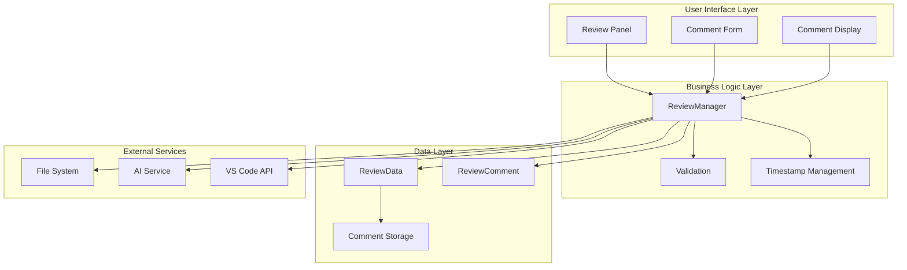
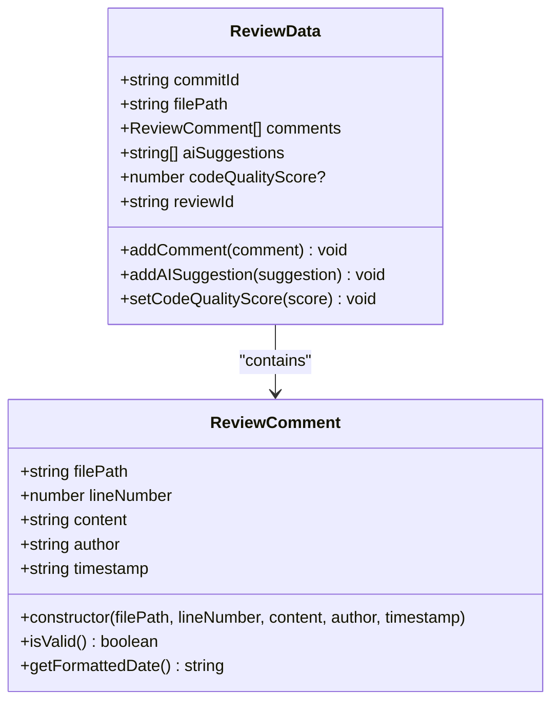
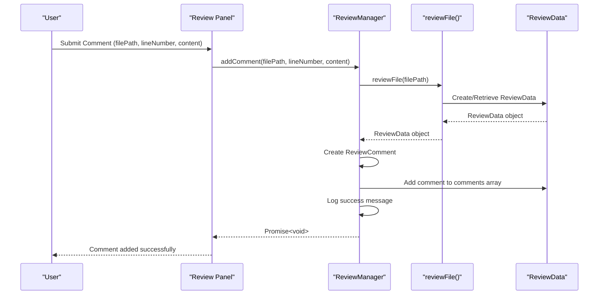
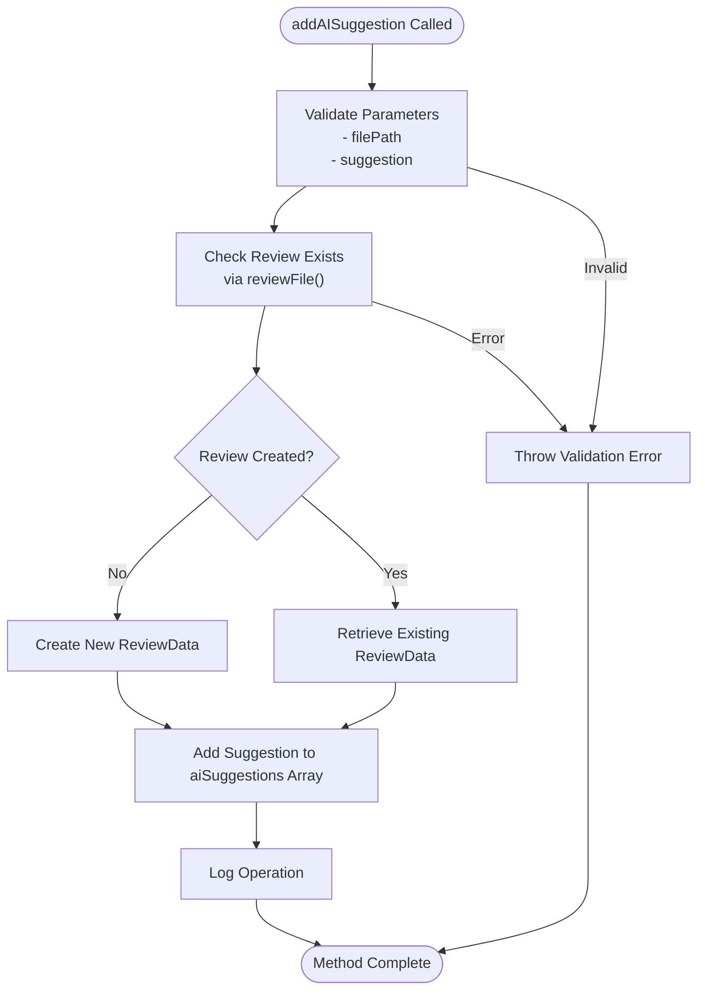
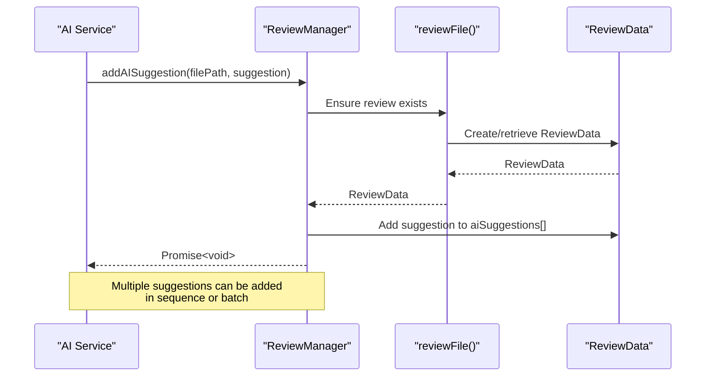
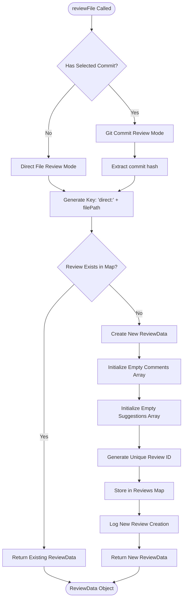
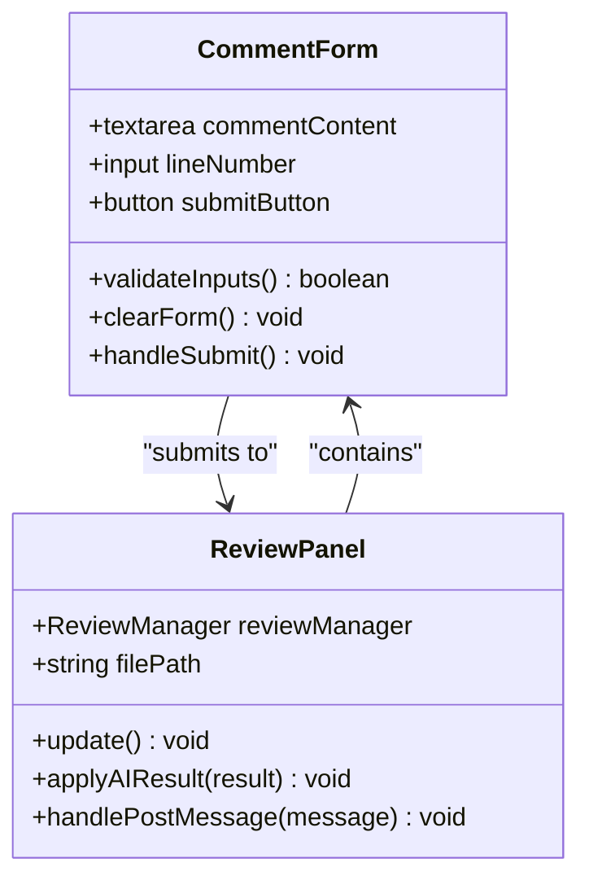
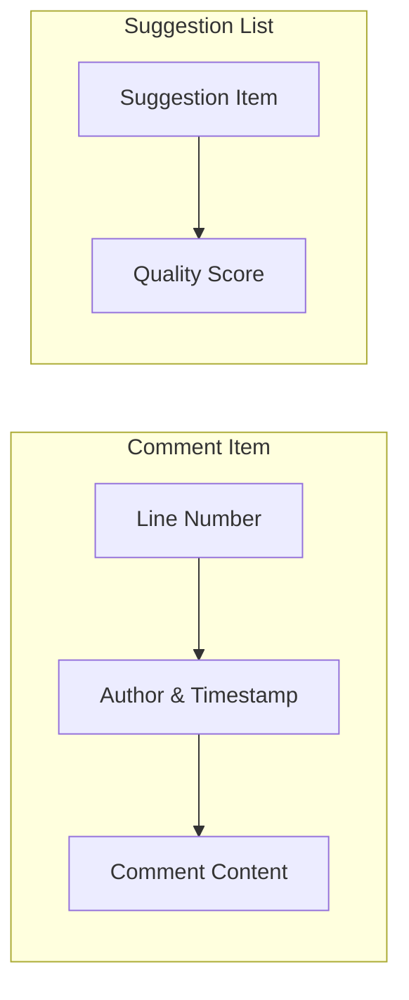
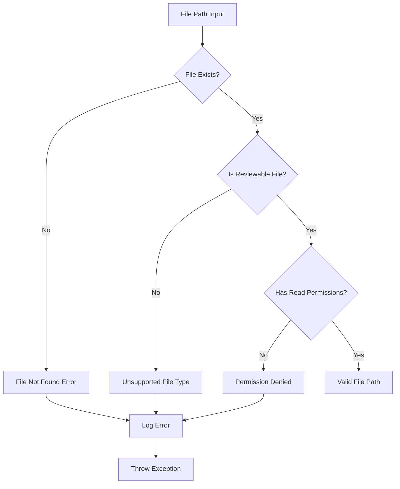
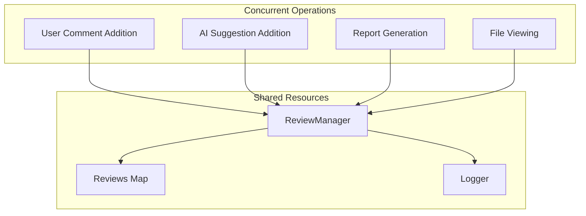

# Comment Management

<cite>
**Referenced Files in This Document**
- [reviewManager.ts](file://src/services/review/reviewManager.ts)
- [reviewTypes.ts](file://src/core/review/reviewTypes.ts)
- [reviewPanel.ts](file://src/ui/views/reviewPanel.ts)
- [fileUtils.ts](file://src/utils/fileUtils.ts)
- [extension.ts](file://src/extension.ts)
</cite>

## Table of Contents
1. [Introduction](#introduction)
2. [Architecture Overview](#architecture-overview)
3. [Core Data Structures](#core-data-structures)
4. [Comment Management Methods](#comment-management-methods)
5. [Review Data Management](#review-data-management)
6. [UI Integration](#ui-integration)
7. [Error Handling and Validation](#error-handling-and-validation)
8. [Thread Safety Considerations](#thread-safety-considerations)
9. [Best Practices](#best-practices)
10. [Troubleshooting Guide](#troubleshooting-guide)

## Introduction

The comment management functionality within the ReviewManager serves as the central hub for collaborative code review operations. It provides robust mechanisms for adding both user comments and AI-generated suggestions to code files, enabling developers to engage in comprehensive code review workflows. This system supports multiple review modes including Git commit-based reviews, standalone file reviews, and real-time editing scenarios.

The comment management system is designed with flexibility in mind, allowing comments to be associated with specific line numbers within files and maintaining separate storage for user comments versus AI suggestions. This separation enables rich review experiences where human reviewers can contribute insights while AI systems provide automated analysis and improvement suggestions.

## Architecture Overview

The comment management system follows a layered architecture that separates concerns between data persistence, business logic, and user interface components.



**Diagram sources**
- [reviewManager.ts](file://src/services/review/reviewManager.ts#L79-L305)
- [reviewPanel.ts](file://src/ui/views/reviewPanel.ts#L1-L147)

The architecture ensures clear separation of responsibilities while maintaining efficient data flow between components. The ReviewManager acts as the central coordinator, managing review data lifecycle and coordinating with external services for file operations and AI analysis.

**Section sources**
- [reviewManager.ts](file://src/services/review/reviewManager.ts#L79-L305)
- [reviewPanel.ts](file://src/ui/views/reviewPanel.ts#L1-L147)

## Core Data Structures

The comment management system relies on several key data structures that define the shape and behavior of review data.

### ReviewComment Interface

The `ReviewComment` interface defines the structure for individual comments within the review system:



**Diagram sources**
- [reviewManager.ts](file://src/services/review/reviewManager.ts#L11-L17)
- [reviewManager.ts](file://src/services/review/reviewManager.ts#L19-L26)

### ReviewData Structure

The `ReviewData` interface encapsulates all review-related information for a specific file:

| Property | Type | Description | Purpose |
|----------|------|-------------|---------|
| `commitId` | string | Git commit identifier | Links review to specific commit context |
| `filePath` | string | Absolute file path | Identifies target file for review |
| `comments` | ReviewComment[] | Array of user comments | Stores human reviewer feedback |
| `aiSuggestions` | string[] | Array of AI suggestions | Contains automated improvement suggestions |
| `codeQualityScore` | number? | Quality rating (0-10) | Numeric assessment of code quality |
| `reviewId` | string | Unique review identifier | Enables review tracking and management |

### Review Modes

The system supports multiple review modes that influence how comments are managed:

| Mode | Description | Comment Behavior | AI Integration |
|------|-------------|------------------|----------------|
| `GIT_COMMIT` | Commit-based review | Comments linked to specific commits | Full AI analysis with diff context |
| `EXPLORER` | Folder/file review | Independent of commit history | Structural analysis capabilities |
| `REAL_TIME` | Live editing | Immediate feedback integration | Context-aware suggestions |
| `DOMAIN_SPECIFIC` | Specialized review | Domain-specific comment types | Compliance-focused analysis |

**Section sources**
- [reviewManager.ts](file://src/services/review/reviewManager.ts#L11-L26)
- [reviewTypes.ts](file://src/core/review/reviewTypes.ts#L10-L19)

## Comment Management Methods

The ReviewManager provides two primary methods for adding comments and AI suggestions to the review system.

### addComment Method

The `addComment` method handles user-generated comments with comprehensive validation and timestamp management.



**Diagram sources**
- [reviewManager.ts](file://src/services/review/reviewManager.ts#L264-L288)

#### Method Signature and Parameters

The `addComment` method accepts three parameters:

| Parameter | Type | Description | Validation |
|-----------|------|-------------|------------|
| `filePath` | string | Target file path | Must be valid file path, file must be reviewable |
| `lineNumber` | number | Line number for comment placement | Must be positive integer, within file bounds |
| `content` | string | Comment text content | Must not be empty, sanitized for HTML |

#### Implementation Details

The method performs the following operations:

1. **Review Initialization**: Calls `reviewFile()` to ensure review data exists
2. **Comment Creation**: Constructs a `ReviewComment` object with current timestamp
3. **Storage**: Adds comment to the file's comment array
4. **Logging**: Records operation for audit trail

#### Error Handling

The method includes comprehensive error handling for:
- Invalid file paths
- Non-existent files
- Invalid line numbers
- Empty comment content
- Review data initialization failures

**Section sources**
- [reviewManager.ts](file://src/services/review/reviewManager.ts#L264-L288)

### addAISuggestion Method

The `addAISuggestion` method manages AI-generated suggestions with specialized handling for automated content.



**Diagram sources**
- [reviewManager.ts](file://src/services/review/reviewManager.ts#L290-L305)

#### Method Signature and Parameters

| Parameter | Type | Description | Validation |
|-----------|------|-------------|------------|
| `filePath` | string | Target file path | Must be valid, reviewable file |
| `suggestion` | string | AI-generated suggestion | Must not be empty, sanitized |

#### Key Differences from addComment

The `addAISuggestion` method differs from `addComment` in several important ways:

1. **No Timestamp**: AI suggestions don't require individual timestamps
2. **No Author Field**: Suggestions are automatically attributed to AI
3. **Array-Based Storage**: Suggestions are stored in a dedicated array
4. **Batch Processing**: Can handle multiple suggestions efficiently

#### Integration with AI Service

The method is primarily used by the AI service during code analysis:



**Diagram sources**
- [reviewManager.ts](file://src/services/review/reviewManager.ts#L290-L305)
- [reviewPanel.ts](file://src/ui/views/reviewPanel.ts#L580-L620)

**Section sources**
- [reviewManager.ts](file://src/services/review/reviewManager.ts#L290-L305)

## Review Data Management

The review data management system ensures proper lifecycle management for review objects and maintains data consistency across operations.

### reviewFile Method

The `reviewFile` method serves as the primary mechanism for initializing and retrieving review data:



**Diagram sources**
- [reviewManager.ts](file://src/services/review/reviewManager.ts#L229-L262)

#### Review Key Generation

The system uses different key generation strategies based on review mode:

| Mode | Key Format | Example | Purpose |
|------|------------|---------|---------|
| Direct File | `direct:{filePath}` | `direct:/path/to/file.js` | Standalone file reviews |
| Git Commit | `{commitHash}:{filePath}` | `abc123:/path/to/file.js` | Commit-based reviews |

#### Data Initialization

When creating new review data, the system initializes:

- **Empty Comments Array**: Ready for user comments
- **Empty Suggestions Array**: Prepared for AI suggestions  
- **Unique Review ID**: Generated using timestamp and random string
- **Commit Association**: Linked to appropriate commit (if applicable)

**Section sources**
- [reviewManager.ts](file://src/services/review/reviewManager.ts#L229-L262)

## UI Integration

The user interface provides comprehensive support for comment management through the ReviewPanel component.

### Comment Form Interface

The comment form provides intuitive controls for adding user comments:



**Diagram sources**
- [reviewPanel.ts](file://src/ui/views/reviewPanel.ts#L496-L556)

#### Form Validation

The UI implements client-side validation for comment submission:

| Field | Validation Rule | Error Message |
|-------|----------------|---------------|
| Content | Required, non-empty | "Please enter comment content" |
| Line Number | Positive integer, >= 1 | "Please enter a valid line number" |
| File Path | Resolved from editor | Automatically populated |

#### Real-time Feedback

The interface provides immediate visual feedback:

- **Success Messages**: Confirmation when comments are added
- **Error Notifications**: Clear indication of validation failures
- **Loading States**: Progress indication during AI operations
- **Tab Navigation**: Separate views for comments and suggestions

**Section sources**
- [reviewPanel.ts](file://src/ui/views/reviewPanel.ts#L496-L556)

### Display Components

The comment display system renders review data in organized layouts:

#### Comment List Rendering

Comments are displayed with comprehensive metadata:



**Diagram sources**
- [reviewPanel.ts](file://src/ui/views/reviewPanel.ts#L461-L475)

#### Conditional Rendering

The UI adapts display based on data availability:

- **Empty States**: Informative messages when no comments/suggestions exist
- **Loading States**: Progress indicators during AI analysis
- **Error States**: Clear error messaging for failed operations

**Section sources**
- [reviewPanel.ts](file://src/ui/views/reviewPanel.ts#L461-L495)

## Error Handling and Validation

The comment management system implements comprehensive error handling and validation at multiple levels.

### Input Validation

#### File Path Validation

The system validates file paths through multiple mechanisms:



**Diagram sources**
- [reviewManager.ts](file://src/services/review/reviewManager.ts#L235-L238)
- [fileUtils.ts](file://src/utils/fileUtils.ts#L26-L36)

#### Line Number Validation

Line numbers undergo strict validation:

| Validation Type | Rule | Error Condition |
|----------------|------|-----------------|
| Type Check | Must be number | NaN or non-numeric |
| Range Check | Must be ≥ 1 | Negative or zero values |
| Bounds Check | Must be ≤ file length | Exceeds actual line count |
| Integer Check | Must be whole number | Decimal values |

#### Content Validation

Comment content validation includes:

- **Empty Content**: Prevents submission of blank comments
- **Length Limits**: Enforces reasonable content limits
- **Sanitization**: Prevents XSS attacks through HTML escaping
- **Character Encoding**: Ensures proper UTF-8 handling

### Error Context Management

The system uses structured error contexts to provide meaningful error messages:

| Context | Purpose | Error Messages |
|---------|---------|----------------|
| `addComment` | Comment submission failures | "Failed to add comment", "Invalid line number" |
| `addAISuggestion` | AI suggestion failures | "Failed to add AI suggestion", "AI service unavailable" |
| `reviewFile` | Review initialization failures | "Failed to initialize review", "File access denied" |
| `generateReport` | Report generation failures | "Report generation interrupted", "Insufficient permissions" |

### Recovery Strategies

The system implements several recovery strategies:

1. **Graceful Degradation**: Continue operation when individual comments fail
2. **Retry Mechanisms**: Automatic retry for transient failures
3. **Fallback Values**: Default values when critical data is unavailable
4. **State Restoration**: Restore previous state after errors

**Section sources**
- [reviewManager.ts](file://src/services/review/reviewManager.ts#L264-L305)
- [reviewManager.ts](file://src/services/review/reviewManager.ts#L40-L77)

## Thread Safety Considerations

While the current implementation doesn't explicitly address thread safety, several factors influence concurrent operation safety.

### Current Thread Safety Status

The ReviewManager operates in a single-threaded environment within the VS Code extension context:

- **Sequential Operations**: All review operations are performed sequentially
- **Map Access**: The `reviews` Map is accessed through synchronized methods
- **State Consistency**: Review data modifications are atomic operations

### Potential Concurrent Scenarios

Several scenarios could introduce concurrency challenges:



### Thread Safety Recommendations

For future enhancements, consider these thread safety measures:

1. **Lock-Based Synchronization**: Implement mutexes for critical sections
2. **Immutable Data Structures**: Use immutable collections for review data
3. **Atomic Operations**: Ensure atomic updates to shared state
4. **Conflict Resolution**: Handle simultaneous modifications gracefully

### Current Best Practices

The existing implementation follows good practices for thread safety:

- **Single Responsibility**: Each method focuses on one operation
- **Exception Isolation**: Errors are contained within individual operations
- **State Preservation**: Review state remains consistent after failures
- **Resource Cleanup**: Proper cleanup of temporary resources

**Section sources**
- [reviewManager.ts](file://src/services/review/reviewManager.ts#L85-L87)

## Best Practices

### Comment Management Guidelines

#### User Comments Best Practices

1. **Specificity**: Provide detailed feedback focused on specific code locations
2. **Constructive Tone**: Frame suggestions positively and constructively
3. **Context Awareness**: Reference related code sections when appropriate
4. **Actionable Content**: Include specific suggestions for improvement

#### AI Suggestion Guidelines

1. **Relevance**: Ensure suggestions align with the code context
2. **Granularity**: Balance between high-level and specific recommendations
3. **Implementation Notes**: Include rationale for suggested improvements
4. **Priority Indication**: Mark suggestions by importance when possible

### Performance Optimization

#### Batch Operations

For large-scale operations, consider:

- **Batch Size Management**: Process files in configurable batches
- **Memory Efficiency**: Monitor memory usage during bulk operations
- **Progress Reporting**: Provide feedback for long-running operations
- **Cancellation Support**: Allow user interruption of lengthy processes

#### Data Persistence

Optimize data storage:

- **Lazy Loading**: Load review data only when needed
- **Caching Strategies**: Cache frequently accessed review data
- **Cleanup Procedures**: Remove stale review data periodically
- **Storage Limits**: Implement reasonable limits on stored data

### Integration Patterns

#### Extension Integration

Follow established patterns for VS Code extension integration:

- **Command Registration**: Register commands consistently
- **Event Handling**: Properly handle VS Code lifecycle events
- **Configuration Management**: Respect user preferences
- **Error Reporting**: Provide clear error messages to users

**Section sources**
- [reviewManager.ts](file://src/services/review/reviewManager.ts#L80-L81)
- [reviewPanel.ts](file://src/ui/views/reviewPanel.ts#L580-L620)

## Troubleshooting Guide

### Common Issues and Solutions

#### Issue: Comments Not Saving

**Symptoms**: Comments appear in UI but aren't persisted

**Possible Causes**:
- File permission issues
- Review data initialization failure
- Memory limitations

**Solutions**:
1. Verify file write permissions
2. Check browser console for JavaScript errors
3. Restart VS Code to reset state
4. Clear extension cache if available

#### Issue: Invalid Line Numbers

**Symptoms**: "Invalid line number" errors during comment submission

**Possible Causes**:
- File has been modified since last review
- Line number exceeds file length
- Negative or zero line numbers entered

**Solutions**:
1. Refresh the file in editor
2. Verify current line count
3. Use line numbers within file bounds
4. Check for hidden characters or encoding issues

#### Issue: AI Suggestions Not Appearing

**Symptoms**: AI service completes but suggestions don't display

**Possible Causes**:
- AI service timeout or failure
- Network connectivity issues
- Large response handling problems

**Solutions**:
1. Check network connectivity
2. Verify AI service configuration
3. Increase timeout settings if possible
4. Retry AI analysis operation

#### Issue: Review Data Corruption

**Symptoms**: Unexpected errors when accessing review data

**Possible Causes**:
- Concurrent modification conflicts
- Memory corruption in review maps
- Extension state inconsistencies

**Solutions**:
1. Reset extension state
2. Clear VS Code cache
3. Reinstall extension if persistent
4. Check for conflicting extensions

### Debugging Techniques

#### Enable Debug Logging

Enable detailed logging to diagnose issues:

```typescript
// Enable debug mode in extension configuration
// Check output channel for detailed operation logs
```

#### Inspect Review Data

Access review data programmatically:

```typescript
// Access internal review data for inspection
const reviewData = this.reviews.get(key);
console.log('Review data:', reviewData);
```

#### Validate File Accessibility

Verify file accessibility:

```typescript
// Check file existence and permissions
const exists = fs.existsSync(filePath);
const readable = fs.accessSync(filePath, fs.constants.R_OK);
```

### Performance Monitoring

Monitor system performance during operations:

- **Memory Usage**: Track memory consumption during batch operations
- **Execution Time**: Measure operation duration for optimization
- **Error Rates**: Monitor error frequency and patterns
- **User Experience**: Track response times and success rates

**Section sources**
- [reviewManager.ts](file://src/services/review/reviewManager.ts#L101-L109)
- [reviewManager.ts](file://src/services/review/reviewManager.ts#L264-L305)