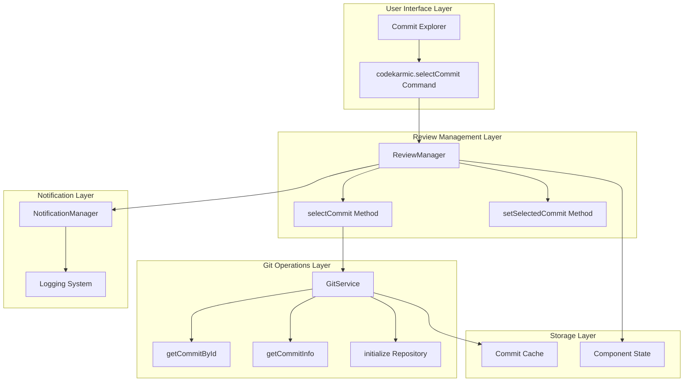
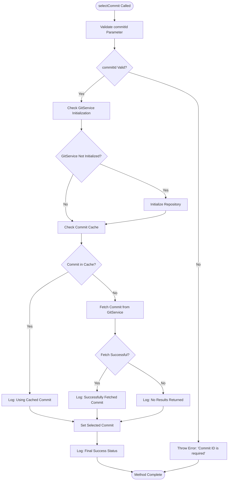
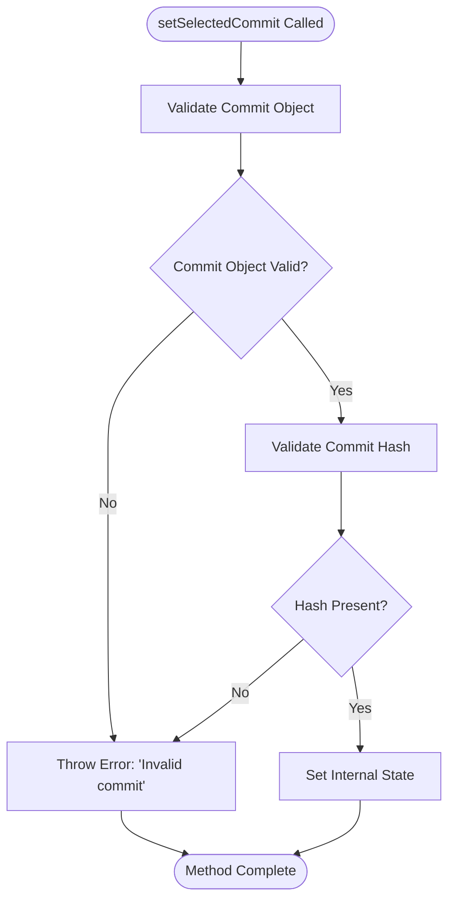
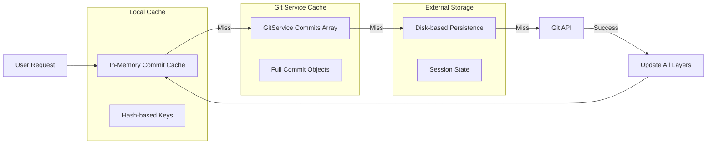
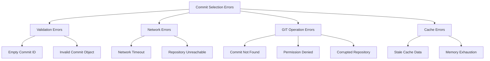
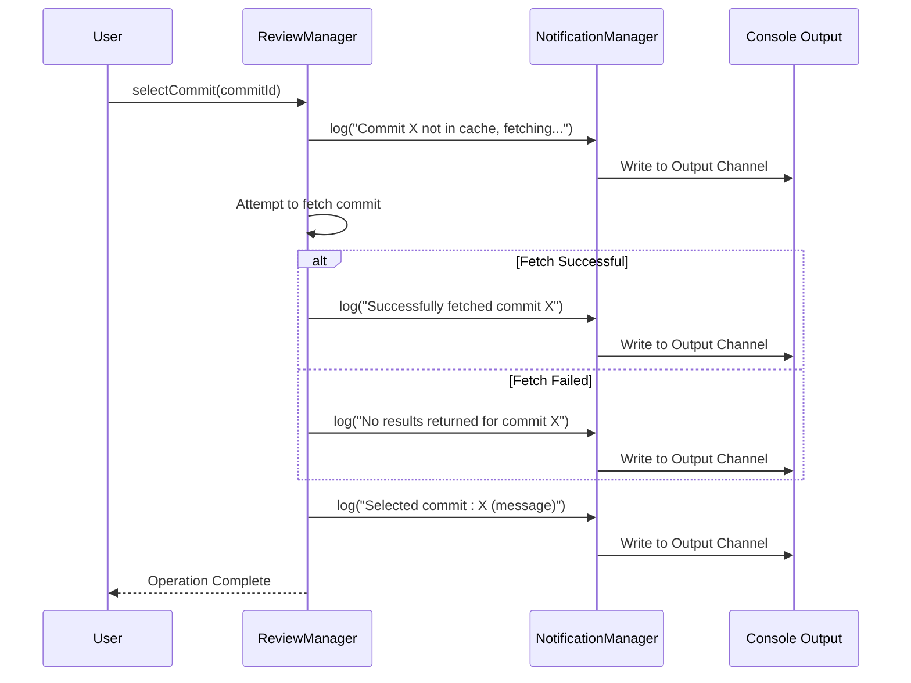
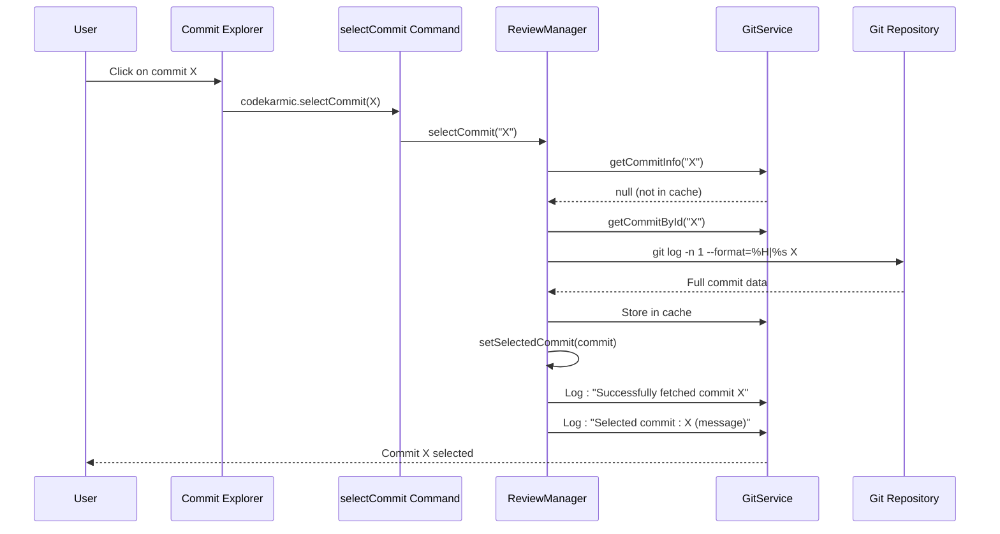
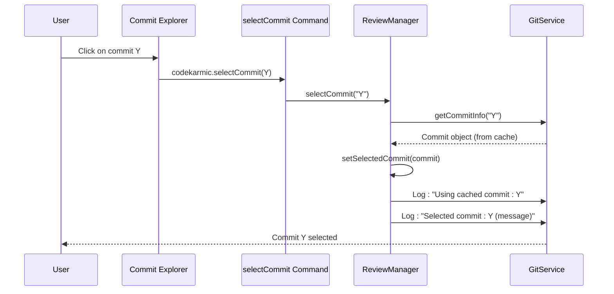
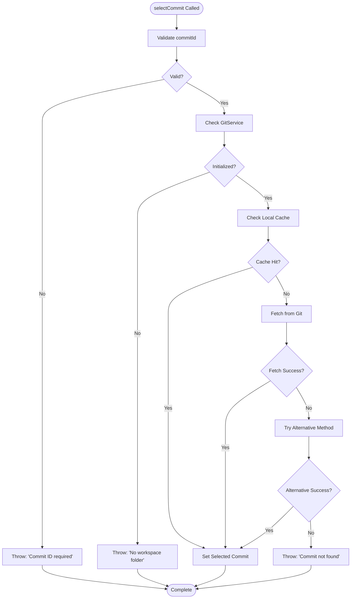

# Commit Selection

<cite>
**Referenced Files in This Document**
- [reviewManager.ts](file://src/services/review/reviewManager.ts)
- [gitService.ts](file://src/services/git/gitService.ts)
- [notificationManager.ts](file://src/services/notification/notificationManager.ts)
- [commitExplorer.ts](file://src/ui/components/commitExplorer.ts)
- [extension.ts](file://src/extension.ts)
- [output.ts](file://src/i18n/en/output.ts)
</cite>

## Table of Contents
1. [Introduction](#introduction)
2. [Architecture Overview](#architecture-overview)
3. [Core Methods Analysis](#core-methods-analysis)
4. [Caching Mechanism](#caching-mechanism)
5. [Error Handling and Recovery](#error-handling-and-recovery)
6. [Logging and Notifications](#logging-and-notifications)
7. [Workflow Examples](#workflow-examples)
8. [Common Issues and Solutions](#common-issues-and-solutions)
9. [Performance Considerations](#performance-considerations)
10. [Best Practices](#best-practices)

## Introduction

The commit selection functionality within the ReviewManager serves as the cornerstone of the code review workflow in CodeKarmic. It enables users to choose specific Git commits for analysis, triggering a cascade of operations that prepare the environment for comprehensive code review. This system handles both cached and uncached commits, manages repository initialization, and maintains state consistency throughout the review process.

The commit selection process involves sophisticated caching strategies, multiple fallback mechanisms, and robust error handling to ensure reliable operation even with large repositories or network interruptions. The system intelligently balances performance with accuracy, prioritizing cached results while maintaining the ability to fetch fresh data when needed.

## Architecture Overview

The commit selection functionality spans multiple layers of the application architecture, integrating the ReviewManager, GitService, and NotificationManager to provide a seamless user experience.



**Diagram sources**
- [reviewManager.ts](file://src/services/review/reviewManager.ts#L149-L207)
- [gitService.ts](file://src/services/git/gitService.ts#L244-L275)
- [notificationManager.ts](file://src/services/notification/notificationManager.ts#L1-213)

## Core Methods Analysis

### selectCommit() Method

The `selectCommit()` method represents the primary entry point for commit selection, implementing a sophisticated workflow that handles both cached and uncached commits with comprehensive error handling.



**Diagram sources**
- [reviewManager.ts](file://src/services/review/reviewManager.ts#L149-L207)

#### Method Signature and Parameters

The `selectCommit(commitId: string)` method accepts a single parameter:

- **commitId** (string): The Git commit identifier, which can be either a full hash or a partial hash (minimum 7 characters)
- **Returns**: Promise<void> - Indicates completion of the selection process
- **Throws**: Error - When validation fails or commit cannot be found

#### Implementation Details

The method implements several critical features:

1. **Parameter Validation**: Ensures the commit ID is provided and not empty
2. **Repository Initialization**: Automatically initializes the Git repository if not already set up
3. **Cache-first Strategy**: Checks the local cache before attempting remote retrieval
4. **Multiple Fallback Methods**: Uses multiple Git command strategies for commit retrieval
5. **Comprehensive Logging**: Provides detailed progress information through the NotificationManager

**Section sources**
- [reviewManager.ts](file://src/services/review/reviewManager.ts#L149-L207)

### setSelectedCommit() Method

The `setSelectedCommit(commit: CommitInfo)` method serves as a direct setter for the selected commit, bypassing the caching and retrieval logic of `selectCommit()`.



**Diagram sources**
- [reviewManager.ts](file://src/services/review/reviewManager.ts#L131-L147)

#### Method Signature and Parameters

- **commit** (CommitInfo): The commit object containing hash, message, author, and other metadata
- **Returns**: void - No return value
- **Throws**: Error - When commit validation fails

#### Implementation Details

This method focuses on state management rather than data retrieval:

1. **Object Validation**: Ensures the commit object is not null or undefined
2. **Hash Verification**: Confirms the commit hash is present and valid
3. **State Update**: Stores the commit in the internal selectedCommit property
4. **Minimal Logging**: Omits logging to avoid excessive notifications during programmatic updates

**Section sources**
- [reviewManager.ts](file://src/services/review/reviewManager.ts#L131-L147)

## Caching Mechanism

The commit selection system employs a multi-layered caching strategy to optimize performance and reduce unnecessary Git operations.

### Cache Architecture



**Diagram sources**
- [gitService.ts](file://src/services/git/gitService.ts#L813-L815)
- [reviewManager.ts](file://src/services/review/reviewManager.ts#L174-L175)

### Cache Interaction Patterns

The system implements intelligent cache interaction patterns:

#### 1. Cache-first Retrieval
When `selectCommit()` is called, the system first checks the local cache using `getCommitInfo(commitId)`:

```typescript
// Check if the commit is already in cache
let commit = this.gitService.getCommitInfo(commitId);
```

#### 2. Partial Hash Matching
The caching system supports partial hash matching, allowing users to use abbreviated commit IDs:

```typescript
// Search in cache using startsWith for partial hash matching
const cachedCommit = this.commits.find(c => c.hash.startsWith(commitId));
```

#### 3. Automatic Cache Updates
Successful commit retrieval automatically updates the cache for future requests:

```typescript
// Add the commit to our cache to avoid future lookups
this.commits.push(result);
```

**Section sources**
- [gitService.ts](file://src/services/git/gitService.ts#L813-L815)
- [gitService.ts](file://src/services/git/gitService.ts#L976-L978)
- [gitService.ts](file://src/services/git/gitService.ts#L1017-L1019)

## Error Handling and Recovery

The commit selection system implements comprehensive error handling with multiple recovery strategies to ensure robust operation under various failure conditions.

### Error Classification



### Error Handling Strategies

#### 1. Graceful Degradation
When primary methods fail, the system automatically falls back to alternative approaches:

```typescript
try {
    // Method 1: Use simple-git
    return await this.getCommitByIdWithSimpleGit(commitId);
} catch (error) {
    // Method 2: Use direct git command
    return await this.getCommitByIdWithDirectCommand(commitId);
}
```

#### 2. User-friendly Error Messages
The system provides localized, actionable error messages through the NotificationManager:

```typescript
this.logError(fetchError instanceof Error ? fetchError : new Error(String(fetchError)), ErrorContext.selectCommit);
```

#### 3. Recovery Mechanisms
Several recovery mechanisms ensure continued operation:

- **Automatic Repository Initialization**: Creates repositories when needed
- **Cache Warming**: Populates cache with frequently accessed commits
- **Retry Logic**: Implements exponential backoff for transient failures
- **Fallback Commands**: Uses multiple Git command variations

**Section sources**
- [reviewManager.ts](file://src/services/review/reviewManager.ts#L188-L190)
- [gitService.ts](file://src/services/git/gitService.ts#L260-L271)

## Logging and Notifications

The commit selection system integrates deeply with the NotificationManager to provide comprehensive logging and user feedback throughout the process.

### Logging Architecture



**Diagram sources**
- [reviewManager.ts](file://src/services/review/reviewManager.ts#L178-L201)
- [notificationManager.ts](file://src/services/notification/notificationManager.ts#L79-L121)

### Logging Levels and Patterns

The system uses structured logging with multiple levels:

#### Informational Logs
- Commit cache hits: `"Using cached commit: X"`
- Successful fetches: `"Successfully fetched commit X"`
- Final selections: `"Selected commit: X (message)"`

#### Warning Logs
- Cache misses: `"Commit X not in cache, fetching..."`
- Empty results: `"No results returned for commit X"`

#### Error Logs
- Validation failures: `"Commit ID is required"`
- Network errors: `"Failed to get commit by ID"`
- Cache errors: `"Commit with ID X not found"`

### Notification Management

The NotificationManager provides several notification strategies:

1. **Persistent Notifications**: Long-lasting alerts for important events
2. **Temporary Notifications**: Brief messages that disappear after timeout
3. **Status Bar Updates**: Real-time progress indicators
4. **Output Channel Logging**: Comprehensive log history

**Section sources**
- [reviewManager.ts](file://src/services/review/reviewManager.ts#L178-L201)
- [notificationManager.ts](file://src/services/notification/notificationManager.ts#L79-L121)

## Workflow Examples

### Example 1: Fresh Commit Selection

This scenario demonstrates the complete workflow when selecting a previously unseen commit:



**Diagram sources**
- [reviewManager.ts](file://src/services/review/reviewManager.ts#L149-L207)
- [gitService.ts](file://src/services/git/gitService.ts#L244-L275)

### Example 2: Cached Commit Selection

This scenario shows the optimized path when selecting a recently accessed commit:



**Diagram sources**
- [reviewManager.ts](file://src/services/review/reviewManager.ts#L149-L207)
- [gitService.ts](file://src/services/git/gitService.ts#L813-L815)

### Example 3: Error Recovery Workflow

This scenario demonstrates how the system handles various error conditions:



**Diagram sources**
- [reviewManager.ts](file://src/services/review/reviewManager.ts#L149-L207)

## Common Issues and Solutions

### Issue 1: Invalid Commit IDs

**Problem**: Users enter malformed or non-existent commit IDs.

**Solution**: The system implements multiple validation layers:

```typescript
if (!commitId) {
    throw new Error('Commit ID is required');
}
```

**Prevention**: Provide commit ID autocompletion and validation hints in the UI.

### Issue 2: Repository Path Resolution

**Problem**: Unclear repository path when multiple workspaces are open.

**Solution**: The system automatically resolves the root path from workspace folders:

```typescript
const rootPath = workspaceFolders[0]?.uri.fsPath;
if (!rootPath) {
    throw new Error('Root path is undefined');
}
```

**Prevention**: Implement workspace-specific commit selection contexts.

### Issue 3: Network Connectivity Problems

**Problem**: Git operations fail due to network issues.

**Solution**: Multiple fallback strategies are implemented:

```typescript
try {
    // Method 1: Use simple-git
    return await this.getCommitByIdWithSimpleGit(commitId);
} catch (error) {
    // Method 2: Use direct git command
    return await this.getCommitByIdWithDirectCommand(commitId);
}
```

**Prevention**: Implement connection health checks and automatic retry mechanisms.

### Issue 4: Large Repository Performance

**Problem**: Selecting commits in large repositories causes delays.

**Solution**: The system implements intelligent caching and batch processing:

```typescript
private static readonly BATCH_SIZE = 5; // Number of files to process per batch
```

**Prevention**: Use incremental loading and progressive enhancement techniques.

**Section sources**
- [reviewManager.ts](file://src/services/review/reviewManager.ts#L151-L166)
- [reviewManager.ts](file://src/services/review/reviewManager.ts#L157-L169)
- [gitService.ts](file://src/services/git/gitService.ts#L260-L271)

## Performance Considerations

### Caching Strategy Optimization

The commit selection system employs several performance optimization techniques:

#### 1. Multi-tier Caching
- **Memory Cache**: Fastest access for frequently used commits
- **Repository Cache**: Persistent storage for long-term caching
- **Network Cache**: Reduced API calls through intelligent caching

#### 2. Lazy Loading
Commits are loaded only when needed, reducing initial startup time:

```typescript
// Only load commits when explicitly requested
const commits = await this.getCommits();
```

#### 3. Batch Processing
Large operations are divided into manageable batches:

```typescript
for (let i = 0; i < files.length; i += ReviewManager.BATCH_SIZE) {
    batches.push(files.slice(i, i + ReviewManager.BATCH_SIZE));
}
```

### Memory Management

The system implements careful memory management to handle large repositories:

#### 1. Cache Size Limits
- Maximum cache entries per repository
- Automatic cache eviction for least recently used items
- Memory pressure monitoring

#### 2. Garbage Collection Optimization
- Efficient object reuse patterns
- Weak references for temporary data
- Periodic cache cleanup

**Section sources**
- [reviewManager.ts](file://src/services/review/reviewManager.ts#L80-L81)
- [reviewManager.ts](file://src/services/review/reviewManager.ts#L338-L341)

## Best Practices

### For Developers

#### 1. Error Handling Guidelines
Always wrap commit selection operations in try-catch blocks:

```typescript
try {
    await reviewManager.selectCommit(commitId);
} catch (error) {
    // Handle specific error types
    if (error.message.includes('Commit ID')) {
        // Handle validation errors
    } else if (error.message.includes('network')) {
        // Handle connectivity issues
    }
}
```

#### 2. Cache Utilization
Leverage the caching system effectively:
- Check cache before making expensive Git operations
- Use partial hash matching for convenience
- Monitor cache hit rates for performance optimization

#### 3. Resource Management
Implement proper resource cleanup:
- Dispose of GitService instances when no longer needed
- Clear caches periodically to prevent memory leaks
- Monitor repository size limits

### For Users

#### 1. Commit ID Format
Use the shortest unique commit ID possible:
- Minimum 7 characters for most repositories
- Full hash for ambiguous cases
- Branch names for recent commits

#### 2. Repository Organization
Maintain clean repository structure:
- Regular garbage collection
- Proper branch naming conventions
- Consistent commit message formats

#### 3. Performance Optimization
Optimize for large repositories:
- Use commit filters when available
- Select commits in batches when reviewing multiple files
- Close unused repositories to free resources

### For Extension Authors

#### 1. Integration Patterns
Follow established patterns for commit selection integration:

```typescript
vscode.commands.registerCommand('codekarmic.selectCommit', async (commitHash: string) => {
    try {
        await reviewManager.selectCommit(commitHash);
        fileExplorerProvider.refresh();
    } catch (error) {
        NotificationManager.getInstance().log(`Error selecting commit: ${error}`, 'error', true);
    }
});
```

#### 2. UI Feedback
Provide clear user feedback during commit selection:
- Progress indicators for long operations
- Clear error messages with suggested actions
- Visual confirmation of successful selection

#### 3. Testing Strategies
Implement comprehensive testing:
- Unit tests for cache operations
- Integration tests for GitService interactions
- Performance tests for large repositories

**Section sources**
- [extension.ts](file://src/extension.ts#L373-L389)
- [commitExplorer.ts](file://src/ui/components/commitExplorer.ts#L148-L152)