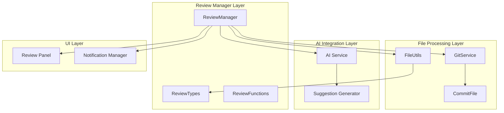
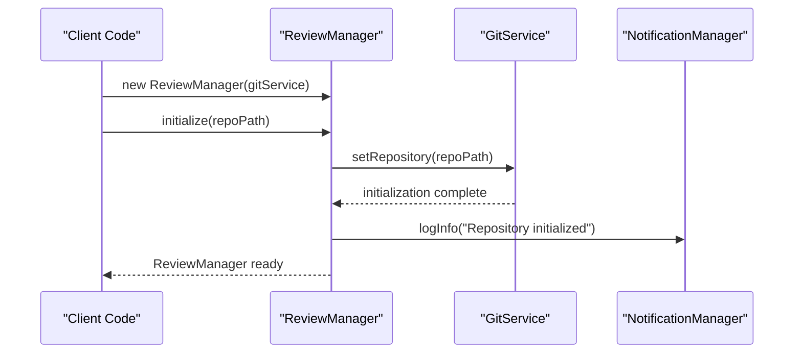
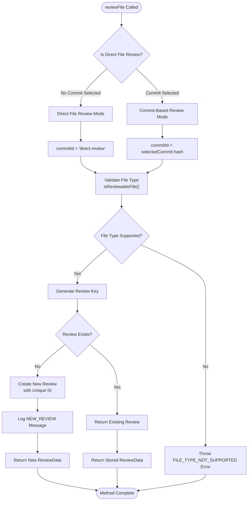
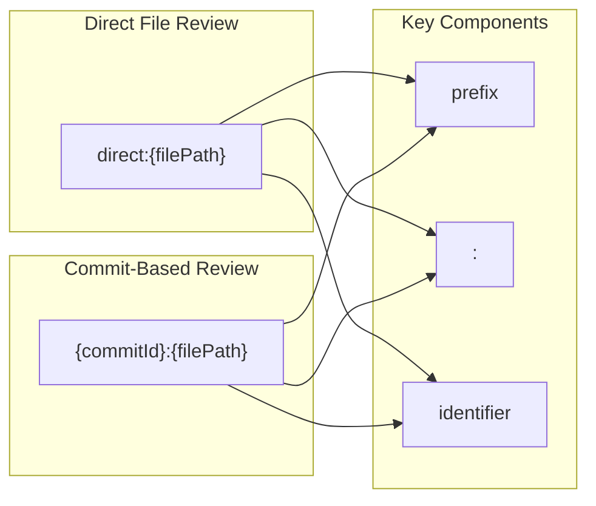
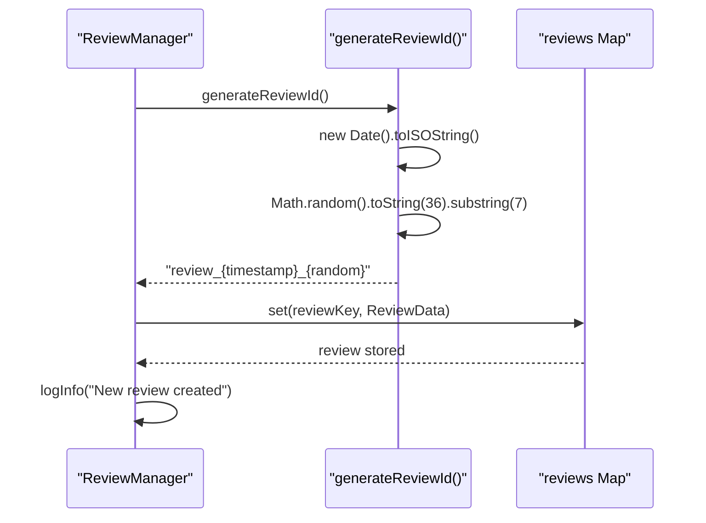
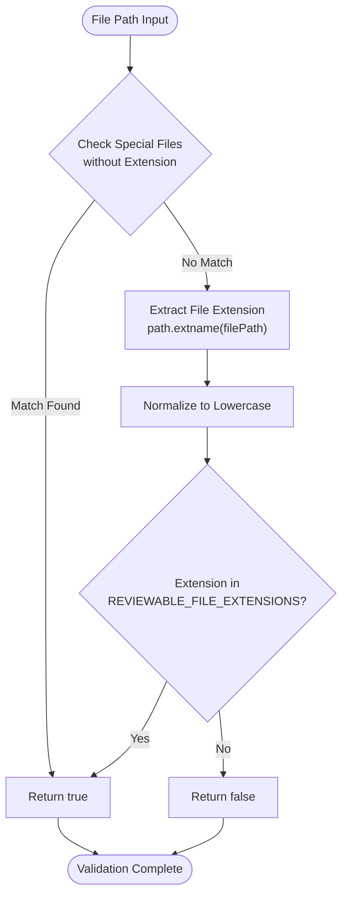
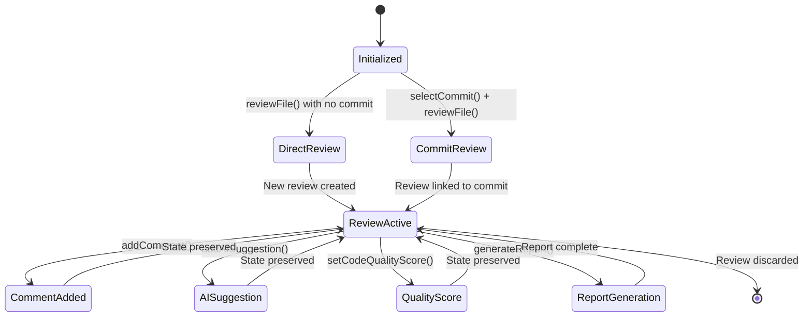
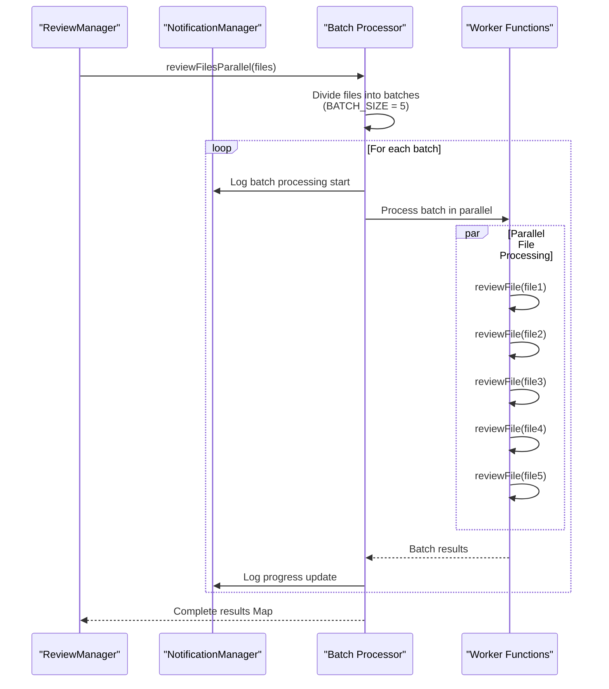
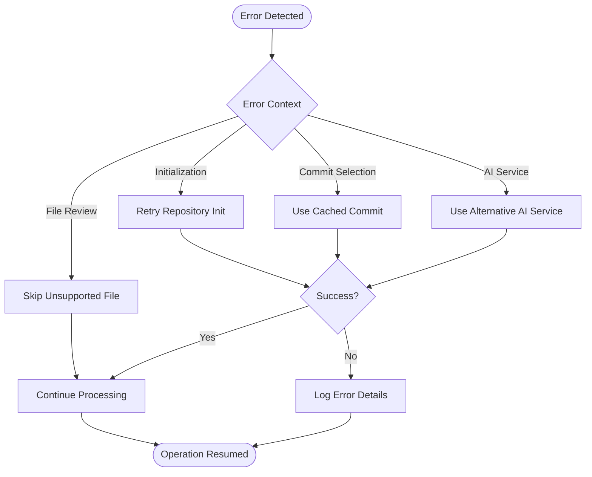
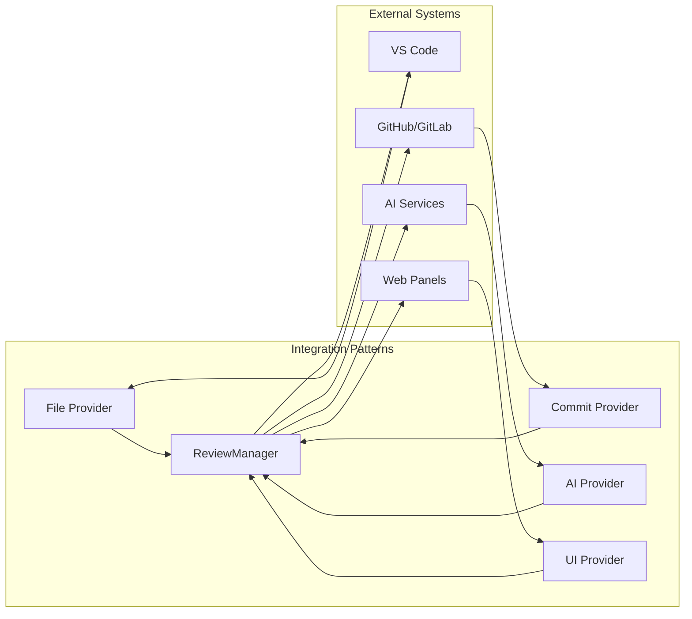

# File Review

<cite>
**Referenced Files in This Document**
- [reviewManager.ts](file://src/services/review/reviewManager.ts)
- [reviewTypes.ts](file://src/core/review/reviewTypes.ts)
- [fileUtils.ts](file://src/utils/fileUtils.ts)
- [gitService.ts](file://src/services/git/gitService.ts)
- [output.ts](file://src/i18n/en/output.ts)
- [reviewPanel.ts](file://src/ui/views/reviewPanel.ts)
</cite>

## Table of Contents
1. [Introduction](#introduction)
2. [Architecture Overview](#architecture-overview)
3. [ReviewManager Core Implementation](#reviewmanager-core-implementation)
4. [File Review Method Analysis](#file-review-method-analysis)
5. [Review Key Generation Strategy](#review-key-generation-strategy)
6. [ReviewData Structure Management](#reviewdata-structure-management)
7. [File Type Validation](#file-type-validation)
8. [Review Modes and State Management](#review-modes-and-state-management)
9. [Batch Processing Integration](#batch-processing-integration)
10. [Error Handling and Common Issues](#error-handling-and-common-issues)
11. [Best Practices and Troubleshooting](#best-practices-and-troubleshooting)
12. [Conclusion](#conclusion)

## Introduction

The file review functionality within the CodeKarmic extension provides comprehensive code analysis capabilities through the ReviewManager class. This system enables developers to perform code reviews on both individual files and Git commit-based changesets. The implementation supports multiple review modes, intelligent file type validation, and sophisticated state management for handling complex review scenarios.

The review system operates through a centralized ReviewManager that orchestrates file analysis, maintains review state, and integrates with AI services for automated code suggestions. It supports both direct file reviews (independent of Git history) and commit-based reviews (leveraging Git diff analysis), providing flexibility for different development workflows.

## Architecture Overview

The file review system follows a modular architecture with clear separation of concerns:

**Diagram sources**
- [reviewManager.ts](file://src/services/review/reviewManager.ts#L79-L854)
- [fileUtils.ts](file://src/utils/fileUtils.ts#L1-L109)
- [gitService.ts](file://src/services/git/gitService.ts#L19-L26)

The architecture demonstrates a layered approach where the ReviewManager serves as the central orchestrator, coordinating between file processing utilities, Git services, AI analysis engines, and user interface components.

**Section sources**
- [reviewManager.ts](file://src/services/review/reviewManager.ts#L79-L100)
- [reviewTypes.ts](file://src/core/review/reviewTypes.ts#L1-L206)

## ReviewManager Core Implementation

The ReviewManager class serves as the central hub for all file review operations, implementing a comprehensive state management system and coordinating various review-related functionalities.

### Class Structure and Dependencies

The ReviewManager maintains several key internal state variables:

- **reviews Map**: Stores all active reviews indexed by unique keys
- **selectedCommit**: Tracks the currently selected Git commit for commit-based reviews
- **repoPath**: Maintains the current repository path
- **gitService**: Provides Git integration capabilities
- **notificationManager**: Handles logging and user notifications

### Initialization and Lifecycle Management

The ReviewManager supports flexible initialization patterns:

**Diagram sources**
- [reviewManager.ts](file://src/services/review/reviewManager.ts#L111-L129)

**Section sources**
- [reviewManager.ts](file://src/services/review/reviewManager.ts#L79-L129)

## File Review Method Analysis

The `reviewFile()` method is the cornerstone of the file review functionality, implementing sophisticated logic for handling both direct file reviews and Git commit-based reviews.

### Method Signature and Parameters

The `reviewFile()` method accepts a single parameter:
- **filePath**: String representing the file path to be reviewed

### Core Review Logic Flow

**Diagram sources**
- [reviewManager.ts](file://src/services/review/reviewManager.ts#L229-L262)

### Parameter Processing and Validation

The method begins by determining the review mode based on the presence of a selected commit:

1. **Direct File Review Mode**: When no commit is selected (`!this.selectedCommit`)
2. **Commit-Based Review Mode**: When a commit is selected

This distinction affects both the commit ID used in review keys and the overall review workflow.

**Section sources**
- [reviewManager.ts](file://src/services/review/reviewManager.ts#L229-L262)

## Review Key Generation Strategy

The review key generation strategy ensures unique identification of reviews across different contexts and prevents conflicts between direct file reviews and commit-based reviews.

### Key Generation Algorithm

The review key follows a structured format that distinguishes between review modes:

**Diagram sources**
- [reviewManager.ts](file://src/services/review/reviewManager.ts#L240-L242)

### Key Format Specifications

- **Direct Reviews**: `direct:{filePath}` where `{filePath}` is the absolute file path
- **Commit Reviews**: `{commitId}:{filePath}` where `{commitId}` is the Git commit hash and `{filePath}` is the relative file path within the commit

This strategy ensures that:
- Direct file reviews are isolated from commit-based reviews
- Multiple reviews of the same file in different commits maintain separate state
- File paths are properly normalized and validated

**Section sources**
- [reviewManager.ts](file://src/services/review/reviewManager.ts#L240-L242)

## ReviewData Structure Management

The ReviewData structure serves as the central data container for all review-related information, maintaining comprehensive state for each reviewed file.

### ReviewData Interface Definition

The ReviewData interface includes the following essential properties:

| Property | Type | Description | Purpose |
|----------|------|-------------|---------|
| commitId | string | Git commit identifier | Links review to specific commit context |
| filePath | string | File path within repository | Identifies the reviewed file |
| comments | ReviewComment[] | User comments collection | Stores collaborative feedback |
| aiSuggestions | string[] | AI-generated suggestions | Contains automated improvement ideas |
| codeQualityScore | number? | Quality assessment score | Numeric representation of code quality |
| reviewId | string | Unique review identifier | Internal tracking and correlation |

### Review Creation and Initialization

When a new review is created, the system automatically generates a unique review ID using the `generateReviewId()` method:

**Diagram sources**
- [reviewManager.ts](file://src/services/review/reviewManager.ts#L95-L98)
- [reviewManager.ts](file://src/services/review/reviewManager.ts#L246-L251)

### State Persistence and Retrieval

The ReviewManager maintains review state through a Map structure that provides:
- **Fast Lookup**: O(1) access time for review retrieval
- **Unique Identification**: Keys prevent duplicate reviews
- **State Isolation**: Each review maintains independent state

**Section sources**
- [reviewManager.ts](file://src/services/review/reviewManager.ts#L19-L26)
- [reviewManager.ts](file://src/services/review/reviewManager.ts#L244-L254)

## File Type Validation

The file type validation system ensures that only supported file types undergo code analysis, preventing errors and optimizing resource utilization.

### Supported File Extensions

The system supports a comprehensive range of file types:

| Category | Extensions | Languages |
|----------|------------|-----------|
| **Programming Languages** | `.ts`, `.js`, `.tsx`, `.jsx`, `.java`, `.py`, `.go`, `.c`, `.cpp`, `.cs`, `.php`, `.swift`, `.kt`, `.rs`, `.scala`, `.dart`, `.groovy` | TypeScript, JavaScript, Java, Python, Go, C/C++, C#, PHP, Swift, Kotlin, Rust, Scala, Dart |
| **Web Technologies** | `.html`, `.css`, `.scss`, `.sass`, `.less`, `.vue` | HTML, CSS, SCSS, SASS, LESS, Vue.js |
| **Configuration Files** | `.json`, `.yaml`, `.yml`, `.xml`, `.gitignore`, `.dockerignore`, `.env`, `.editorconfig` | JSON, YAML, XML, Git Ignore, Docker Ignore, Environment Variables, Editor Config |
| **Build Tools** | `Dockerfile`, `Makefile` | Docker, Make |
| **Documentation** | `.md`, `.markdown` | Markdown |

### Validation Algorithm

The `isReviewableFile()` function implements a two-stage validation process:

**Diagram sources**
- [fileUtils.ts](file://src/utils/fileUtils.ts#L26-L35)

### Error Handling for Unsupported Files

When attempting to review an unsupported file type, the system throws a descriptive error:
- **Error Message**: `"File type not supported for code review: {filePath}"`
- **Internationalization**: Uses the `OUTPUT.REVIEW.FILE_TYPE_NOT_SUPPORTED` template
- **User Experience**: Provides clear feedback about supported file types

**Section sources**
- [fileUtils.ts](file://src/utils/fileUtils.ts#L6-L19)
- [fileUtils.ts](file://src/utils/fileUtils.ts#L26-L35)
- [output.ts](file://src/i18n/en/output.ts#L22)

## Review Modes and State Management

The review system supports multiple operational modes, each with distinct characteristics and state management requirements.

### Review Mode Types

The system defines four primary review modes through the ReviewMode enumeration:

| Mode | Description | Use Case | State Requirements |
|------|-------------|----------|-------------------|
| **GIT_COMMIT** | Review based on Git commit history | Code review of specific changesets | Requires selected commit, Git repository |
| **EXPLORER** | Review of files/folders via VS Code Explorer | Bulk file analysis, project-wide review | Requires workspace folder, file system access |
| **REAL_TIME** | Live editing and immediate feedback | Interactive development, live coding assistance | Requires active editor, real-time processing |
| **DOMAIN_SPECIFIC** | Specialized review for specific domains | Security, performance, accessibility analysis | Requires domain expertise, specialized rules |

### State Management Patterns

The ReviewManager implements sophisticated state management for different review scenarios:

**Diagram sources**
- [reviewManager.ts](file://src/services/review/reviewManager.ts#L229-L262)
- [reviewTypes.ts](file://src/core/review/reviewTypes.ts#L10-L19)

### Cross-Mode Compatibility

The review system maintains compatibility across different modes through:
- **Unified ReviewData Structure**: Consistent data format regardless of review mode
- **Flexible Key Generation**: Adapts to different context requirements
- **Shared State Operations**: Common methods for adding comments, suggestions, and scores

**Section sources**
- [reviewTypes.ts](file://src/core/review/reviewTypes.ts#L10-L19)
- [reviewManager.ts](file://src/services/review/reviewManager.ts#L229-L262)

## Batch Processing Integration

The review system implements sophisticated batch processing capabilities for handling multiple files efficiently, particularly during report generation workflows.

### Batch Processing Architecture

The `reviewFilesParallel()` method orchestrates parallel processing of multiple files:

**Diagram sources**
- [reviewManager.ts](file://src/services/review/reviewManager.ts#L329-L369)

### Batch Size Configuration

The system uses a configurable batch size of 5 files per batch, balancing:
- **Memory Efficiency**: Prevents excessive memory consumption
- **Processing Speed**: Maintains reasonable throughput
- **Error Isolation**: Limits impact of individual failures

### Progress Tracking and Notifications

The batch processor provides comprehensive progress tracking:
- **Batch Progress**: Current batch vs. total batches
- **File Progress**: Processed files vs. total files
- **Real-time Updates**: Live progress notifications

**Section sources**
- [reviewManager.ts](file://src/services/review/reviewManager.ts#L329-L369)

## Error Handling and Common Issues

The review system implements comprehensive error handling strategies to ensure robust operation across various failure scenarios.

### Error Context Classification

The system categorizes errors using the ErrorContext enumeration:

| Context | Description | Recovery Strategy |
|---------|-------------|------------------|
| **initialize** | Repository initialization failures | Check repository path, Git installation |
| **selectCommit** | Commit selection errors | Verify commit hash, repository state |
| **reviewFile** | File review failures | Validate file type, permissions |
| **addComment** | Comment addition errors | Check review existence, file access |
| **addAISuggestion** | AI suggestion failures | Validate AI service, network connectivity |
| **generateReport** | Report generation errors | Check resources, concurrent operations |

### Common Error Scenarios

#### Unsupported File Types
- **Symptom**: `FILE_TYPE_NOT_SUPPORTED` error
- **Cause**: Attempting to review files with unsupported extensions
- **Solution**: Use `isReviewableFile()` validation before review initiation

#### Missing Commit References
- **Symptom**: `No commit selected` error
- **Cause**: Attempting commit-based review without selecting a commit
- **Solution**: Call `selectCommit()` before `reviewFile()` in commit mode

#### Repository Access Issues
- **Symptom**: Repository initialization failures
- **Cause**: Invalid repository path or Git service unavailability
- **Solution**: Verify repository path and Git service initialization

### Error Recovery Mechanisms

The system implements several error recovery strategies:

**Diagram sources**
- [reviewManager.ts](file://src/services/review/reviewManager.ts#L101-L109)

**Section sources**
- [reviewManager.ts](file://src/services/review/reviewManager.ts#L29-L77)
- [reviewManager.ts](file://src/services/review/reviewManager.ts#L101-L109)

## Best Practices and Troubleshooting

### Development Best Practices

#### File Review Implementation
1. **Always validate file types** before initiating reviews
2. **Handle asynchronous operations** properly with try-catch blocks
3. **Use appropriate review modes** based on use case requirements
4. **Monitor batch processing progress** for large file sets

#### State Management Guidelines
1. **Initialize ReviewManager** with proper Git service configuration
2. **Maintain review state consistency** across different operations
3. **Clean up temporary review data** when reviews are no longer needed
4. **Use unique review IDs** to prevent conflicts

### Troubleshooting Common Issues

#### Performance Optimization
- **Large Repository Handling**: Use batch processing for repositories with many files
- **Memory Management**: Monitor memory usage during batch operations
- **Network Connectivity**: Implement retry mechanisms for AI service calls

#### Debugging Strategies
- **Enable Debug Logging**: Use the notification manager for detailed operation logs
- **Validate Input Parameters**: Check file paths and commit hashes before operations
- **Monitor Error Context**: Use ErrorContext enumeration for targeted debugging

### Integration Patterns

The review system supports various integration patterns:

**Diagram sources**
- [reviewManager.ts](file://src/services/review/reviewManager.ts#L79-L854)

## Conclusion

The file review functionality within the CodeKarmic extension represents a sophisticated and well-architected solution for code analysis and collaboration. The ReviewManager class demonstrates excellent software engineering principles through its modular design, comprehensive error handling, and flexible support for multiple review modes.

Key strengths of the implementation include:

- **Robust File Type Validation**: Comprehensive support for modern programming languages and file formats
- **Intelligent State Management**: Flexible handling of both direct and commit-based review scenarios
- **Efficient Batch Processing**: Optimized parallel processing for large-scale code analysis
- **Comprehensive Error Handling**: Structured error classification and recovery mechanisms
- **Extensible Architecture**: Clean separation of concerns enabling easy maintenance and enhancement

The system successfully balances simplicity for basic use cases with powerful capabilities for complex review workflows. Its integration with VS Code's ecosystem and support for AI-powered code analysis positions it as a valuable tool for modern software development teams.

For developers implementing similar functionality, this codebase provides excellent examples of:
- Effective TypeScript patterns for complex state management
- Robust error handling strategies
- Integration with external services and APIs
- User experience optimization through progress tracking and notifications

The file review system serves as an exemplary implementation of enterprise-grade code analysis tools, demonstrating how thoughtful architecture and comprehensive testing can create reliable and maintainable software solutions.