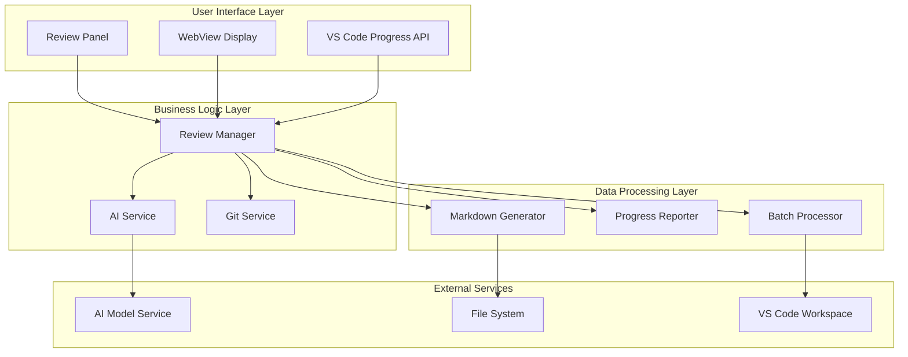
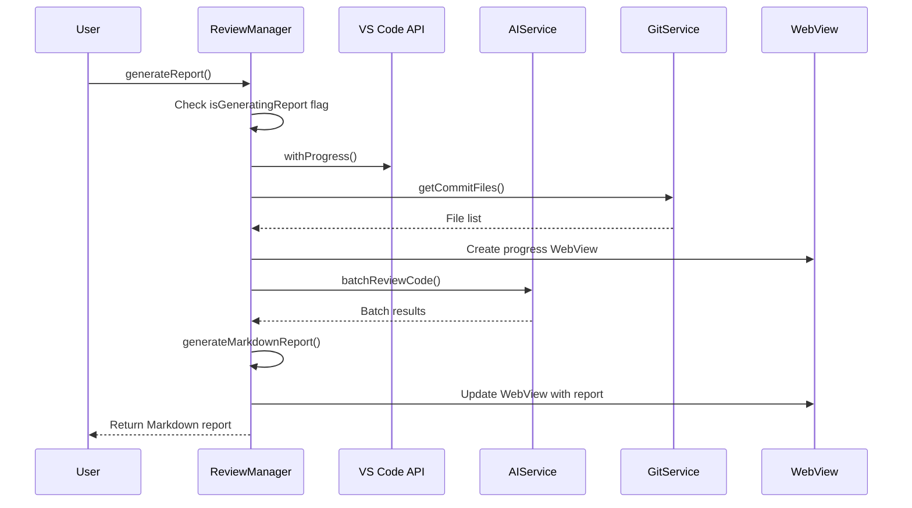
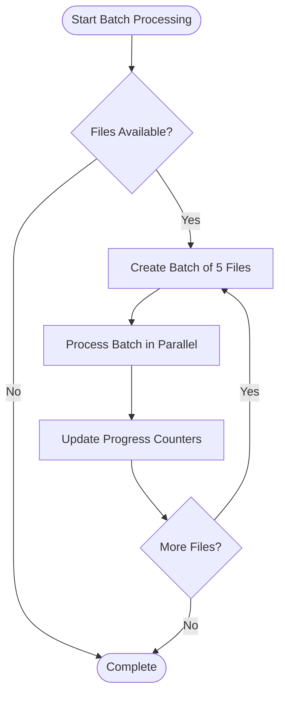
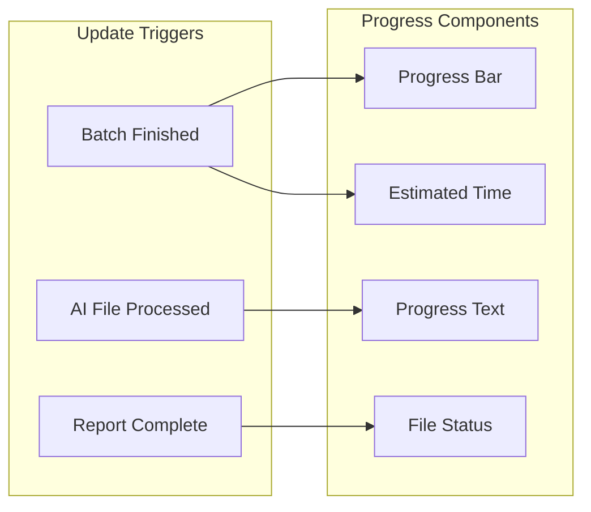
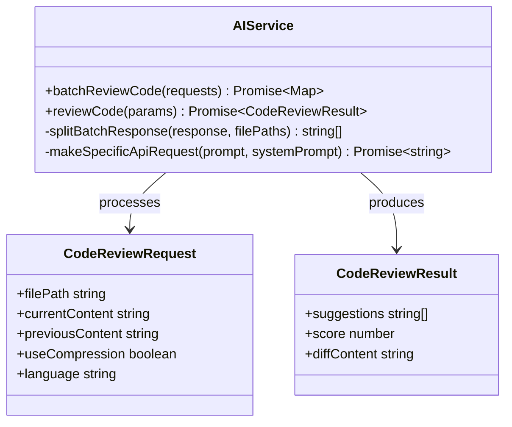
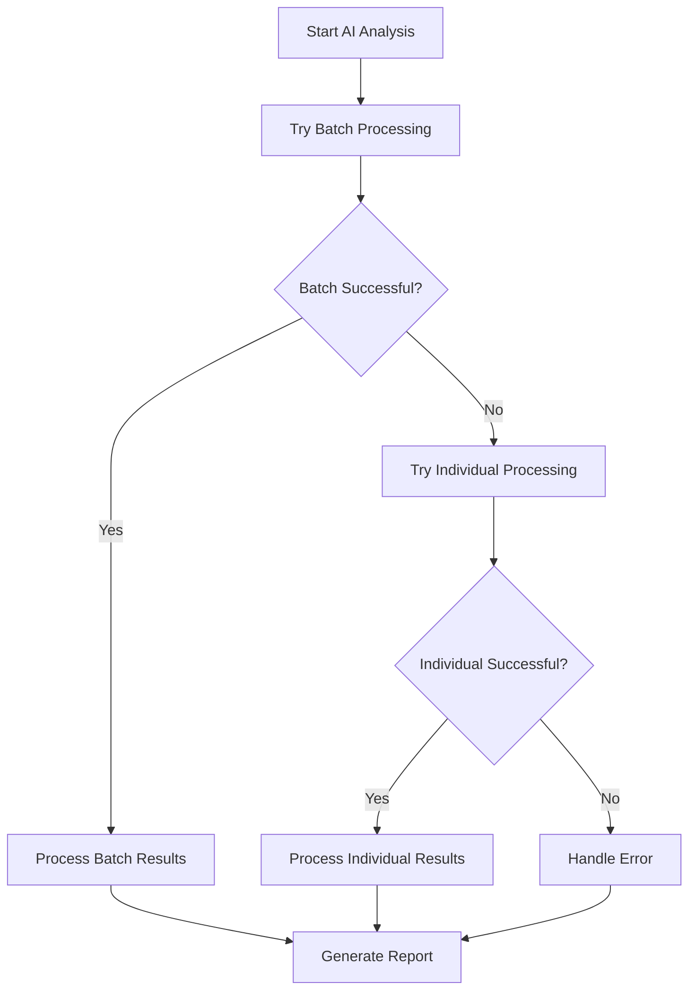
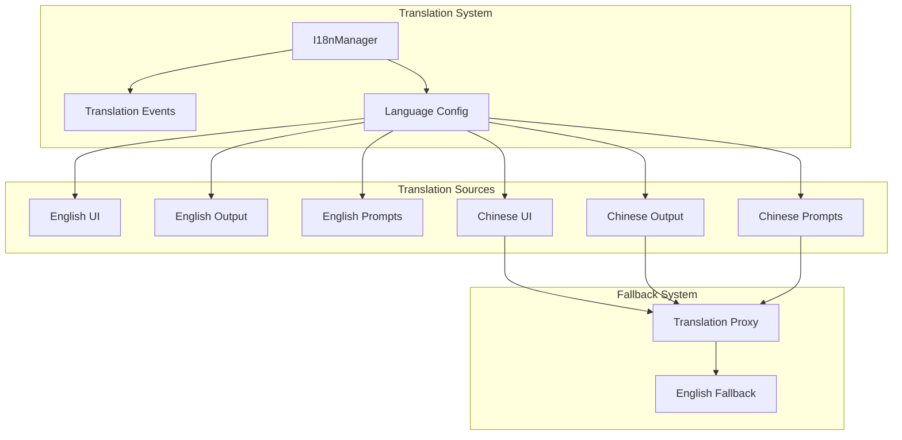

# Report Generation

<cite>
**Referenced Files in This Document**
- [reviewManager.ts](file://src/services/review/reviewManager.ts)
- [aiService.ts](file://src/services/ai/aiService.ts)
- [constants.ts](file://src/constants/constants.ts)
- [reviewPanel.ts](file://src/ui/views/reviewPanel.ts)
- [output.ts](file://src/i18n/en/output.ts)
- [index.ts](file://src/i18n/index.ts)
- [extension.ts](file://src/extension.ts)
</cite>

## Table of Contents
1. [Introduction](#introduction)
2. [Architecture Overview](#architecture-overview)
3. [Core Components](#core-components)
4. [Generate Report Method Implementation](#generate-report-method-implementation)
5. [Batch Processing Strategy](#batch-processing-strategy)
6. [Progress Tracking Mechanism](#progress-tracking-mechanism)
7. [AI Service Integration](#ai-service-integration)
8. [Fallback Mechanisms](#fallback-mechanisms)
9. [Error Handling and Recovery](#error-handling-and-recovery)
10. [Internationalization Support](#internationalization-support)
11. [Performance Considerations](#performance-considerations)
12. [Troubleshooting Guide](#troubleshooting-guide)
13. [Best Practices](#best-practices)

## Introduction

The report generation functionality within the CodeKarmic ReviewManager provides comprehensive automated code review reporting capabilities. This system enables developers to generate detailed Markdown reports summarizing code quality assessments, AI-generated suggestions, and review comments for Git commits. The implementation combines sophisticated batch processing, AI analysis integration, and real-time progress tracking to deliver efficient and user-friendly report generation.

The report generation system serves as the culmination of the code review process, transforming individual file analyses into cohesive, well-formatted reports that can be shared, stored, and reviewed collaboratively. It supports both Git-based commit reviews and standalone file analysis, providing flexibility for various development workflows.

## Architecture Overview

The report generation architecture follows a layered approach with clear separation of concerns:

**Diagram sources**
- [reviewManager.ts](file://src/services/review/reviewManager.ts#L79-L89)
- [aiService.ts](file://src/services/ai/aiService.ts#L40-L70)

The architecture emphasizes modularity, with each layer handling specific responsibilities while maintaining loose coupling through well-defined interfaces.

## Core Components

### ReviewManager Class

The ReviewManager serves as the central orchestrator for report generation, managing the entire workflow from file collection to report delivery. Key responsibilities include:

- **Concurrency Control**: Prevents simultaneous report generation through the `isGeneratingReport` flag
- **Batch Processing**: Implements intelligent batching with configurable batch sizes
- **Progress Tracking**: Coordinates multiple progress indicators (VS Code progress API and WebView)
- **Error Management**: Provides comprehensive error handling and recovery mechanisms

### AIService Integration

The AI Service provides the analytical backbone for report generation, offering:

- **Batch Processing**: Efficiently processes multiple files in optimized batches
- **Fallback Strategies**: Implements robust fallback mechanisms for failed AI requests
- **Streaming Support**: Enables real-time progress updates during AI analysis
- **Model Abstraction**: Supports multiple AI model providers through a unified interface

### Progress Tracking System

The progress tracking system employs multiple concurrent indicators:

- **VS Code Progress API**: Standard progress notifications for long-running operations
- **WebView Display**: Custom HTML-based progress visualization with real-time updates
- **Console Logging**: Detailed timing information for performance monitoring

**Section sources**
- [reviewManager.ts](file://src/services/review/reviewManager.ts#L79-L89)
- [aiService.ts](file://src/services/ai/aiService.ts#L40-L70)

## Generate Report Method Implementation

The `generateReport()` method represents the core entry point for report generation, implementing a sophisticated multi-stage process:

**Diagram sources**
- [reviewManager.ts](file://src/services/review/reviewManager.ts#L372-L647)

### Method Signature and Parameters

The `generateReport()` method accepts no parameters and returns a Promise resolving to a string containing the generated Markdown report. The method operates on the currently selected commit and accumulated review data.

### Return Values

The method returns a Markdown-formatted string representing the complete code review report. This includes:
- Commit metadata and summary statistics
- Individual file analysis results
- AI-generated suggestions and quality scores
- Comprehensive formatting suitable for both display and export

### Multi-Step Process

The report generation follows a structured three-phase approach:

1. **File Review Phase**: Parallel processing of all commit files
2. **AI Analysis Phase**: Batch processing with fallback mechanisms
3. **Report Generation Phase**: Markdown formatting and WebView display

**Section sources**
- [reviewManager.ts](file://src/services/review/reviewManager.ts#L372-L647)

## Batch Processing Strategy

The system implements intelligent batch processing to optimize performance and resource utilization:

### BATCH_SIZE Configuration

The ReviewManager defines a constant `BATCH_SIZE` of 5 files per batch, balancing processing efficiency with memory management and responsiveness.

### Batch Processing Implementation

**Diagram sources**
- [reviewManager.ts](file://src/services/review/reviewManager.ts#L329-L369)

### Parallel Processing Benefits

- **Improved Throughput**: Multiple files processed simultaneously
- **Better Resource Utilization**: Efficient CPU and memory usage
- **Responsive User Experience**: Progress updates during processing
- **Scalable Performance**: Handles large numbers of files effectively

**Section sources**
- [reviewManager.ts](file://src/services/review/reviewManager.ts#L80-L81)
- [reviewManager.ts](file://src/services/review/reviewManager.ts#L329-L369)

## Progress Tracking Mechanism

The progress tracking system provides comprehensive visibility into the report generation process through multiple concurrent indicators:

### VS Code Progress API Integration

The system leverages VS Code's native progress tracking with the `withProgress()` method, providing:

- **Standard Progress Notifications**: Built-in progress bars and status messages
- **Cancellation Support**: Ability to cancel long-running operations
- **Automatic Cleanup**: Proper progress indicator management

### WebView Progress Display

Custom HTML-based progress visualization offers enhanced user experience:

**Diagram sources**
- [reviewManager.ts](file://src/services/review/reviewManager.ts#L666-L722)

### Progress Update Mechanisms

The system implements multiple update triggers:
- **Batch Completion**: Updates after each batch finishes processing
- **Individual File Progress**: Real-time updates for AI analysis completion
- **Overall Progress**: Cumulative progress across all stages

**Section sources**
- [reviewManager.ts](file://src/services/review/reviewManager.ts#L466-L534)
- [reviewManager.ts](file://src/services/review/reviewManager.ts#L666-L722)

## AI Service Integration

The AI Service integration provides sophisticated code analysis capabilities essential for comprehensive report generation:

### Batch Review Capabilities

The AIService implements advanced batch processing for optimal performance:

**Diagram sources**
- [aiService.ts](file://src/services/ai/aiService.ts#L15-L32)
- [aiService.ts](file://src/services/ai/aiService.ts#L431-L552)

### AI Analysis Pipeline

The AI analysis follows a structured pipeline:

1. **Request Preparation**: Organizes files into appropriate batch categories
2. **Batch Processing**: Executes AI analysis in optimized batches
3. **Response Parsing**: Extracts structured results from AI responses
4. **Result Aggregation**: Compiles individual results into comprehensive reports

### Streaming and Timeout Management

The AI Service supports streaming responses and implements robust timeout handling to ensure reliable operation under various network conditions.

**Section sources**
- [aiService.ts](file://src/services/ai/aiService.ts#L431-L552)
- [reviewManager.ts](file://src/services/review/reviewManager.ts#L499-L551)

## Fallback Mechanisms

The report generation system implements comprehensive fallback strategies to ensure reliability:

### Batch to Individual Processing

When batch processing fails, the system automatically falls back to individual file processing:

**Diagram sources**
- [reviewManager.ts](file://src/services/review/reviewManager.ts#L569-L646)

### Error Recovery Strategies

The system implements multiple error recovery approaches:
- **Graceful Degradation**: Continues processing with partial results
- **Retry Logic**: Automatic retry for transient failures
- **Fallback APIs**: Alternative processing methods when primary fails
- **Partial Results**: Generates reports even with processing failures

### Large File Handling

Special handling for large files ensures system stability:
- **Compression**: Automatic content compression for large files
- **Streaming**: Progressive processing to manage memory usage
- **Timeout Management**: Configurable timeouts for long-running operations

**Section sources**
- [reviewManager.ts](file://src/services/review/reviewManager.ts#L569-L646)
- [aiService.ts](file://src/services/ai/aiService.ts#L413-L424)

## Error Handling and Recovery

The report generation system implements comprehensive error handling across all processing stages:

### Concurrent Operation Protection

The `isGeneratingReport` flag prevents concurrent report generation attempts, ensuring system stability and preventing resource conflicts.

### Error Context Management

The system maintains detailed error context through the `ErrorContext` enumeration, enabling precise error diagnosis and user feedback.

### Graceful Degradation

When individual file processing fails, the system continues with available results rather than failing the entire operation.

### Cleanup and Resource Management

Proper cleanup occurs in the `finally` block, ensuring:
- **Flag Reset**: `isGeneratingReport` is reset regardless of outcome
- **Status Bar Management**: Appropriate delays before status bar cleanup
- **Resource Disposal**: Proper cleanup of temporary resources

**Section sources**
- [reviewManager.ts](file://src/services/review/reviewManager.ts#L378-L381)
- [reviewManager.ts](file://src/services/review/reviewManager.ts#L649-L660)

## Internationalization Support

The report generation system provides comprehensive internationalization support through the I18nManager:

### Multilingual Resources

The system supports both English and Chinese languages with automatic fallback mechanisms:

**Diagram sources**
- [index.ts](file://src/i18n/index.ts#L25-L37)
- [index.ts](file://src/i18n/index.ts#L118-L131)

### Dynamic Language Switching

The system supports runtime language switching with immediate effect on all user-facing messages and progress indicators.

### Message Formatting

Internationalized messages support dynamic parameter substitution, enabling localized progress messages and error reports.

**Section sources**
- [index.ts](file://src/i18n/index.ts#L118-L131)
- [output.ts](file://src/i18n/en/output.ts#L167-L178)

## Performance Considerations

The report generation system incorporates several performance optimization strategies:

### Memory Management

- **Streaming Processing**: Processes large files progressively to minimize memory footprint
- **Batch Size Optimization**: Configurable batch sizes balance throughput and memory usage
- **Garbage Collection**: Proper cleanup of intermediate processing results

### Network Optimization

- **Connection Pooling**: Reuses AI service connections for efficiency
- **Timeout Management**: Configurable timeouts prevent hanging operations
- **Retry Logic**: Intelligent retry mechanisms for transient failures

### User Experience Optimization

- **Progress Indicators**: Multiple concurrent progress displays enhance perceived performance
- **Responsive UI**: Non-blocking operations maintain UI responsiveness
- **Early Feedback**: Progress updates provide immediate user feedback

### Scalability Features

- **Horizontal Scaling**: Batch processing enables parallel execution
- **Load Balancing**: Intelligent distribution of processing load
- **Resource Monitoring**: Built-in performance metrics and logging

## Troubleshooting Guide

Common issues and their solutions during report generation:

### Large Number of Files

**Problem**: Slow performance with many files
**Solution**: Adjust `BATCH_SIZE` parameter or enable compression for large files

### AI Service Timeouts

**Problem**: AI analysis timeouts or failures
**Solution**: Implement proper timeout handling and fallback mechanisms

### Memory Issues

**Problem**: Out-of-memory errors with large files
**Solution**: Enable file compression and monitor memory usage

### Concurrent Access

**Problem**: Multiple simultaneous report generations
**Solution**: Monitor `isGeneratingReport` flag and implement queueing

### WebView Display Issues

**Problem**: Progress display not updating
**Solution**: Verify WebView creation and HTML content updates

**Section sources**
- [reviewManager.ts](file://src/services/review/reviewManager.ts#L378-L381)
- [reviewManager.ts](file://src/services/review/reviewManager.ts#L445-L464)

## Best Practices

### Development Guidelines

1. **Concurrent Safety**: Always check `isGeneratingReport` flag before starting operations
2. **Error Handling**: Implement comprehensive error handling with meaningful user feedback
3. **Progress Reporting**: Provide multiple progress indicators for better user experience
4. **Resource Management**: Ensure proper cleanup in finally blocks

### Performance Optimization

1. **Batch Processing**: Use appropriate batch sizes for your workload
2. **Memory Management**: Monitor memory usage with large files
3. **Network Efficiency**: Implement proper timeout and retry logic
4. **User Experience**: Provide immediate feedback for long-running operations

### Maintenance Considerations

1. **Logging**: Implement comprehensive logging for debugging
2. **Monitoring**: Track performance metrics and error rates
3. **Testing**: Test with various file sizes and commit histories
4. **Documentation**: Maintain clear documentation for complex workflows

The report generation functionality represents a sophisticated system that balances performance, reliability, and user experience. Its modular architecture and comprehensive error handling make it suitable for production environments while maintaining accessibility for developers of all skill levels.