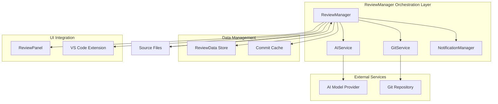
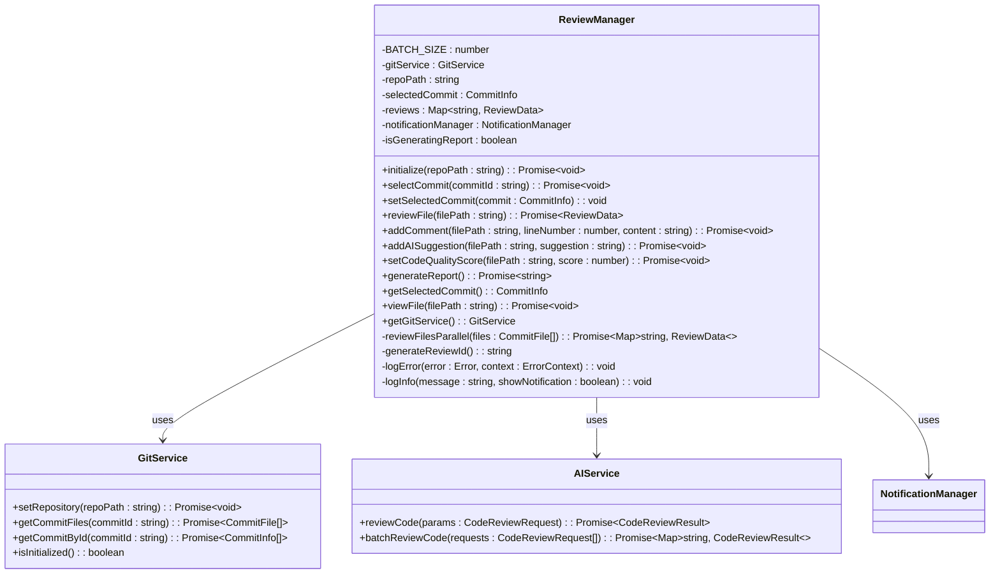
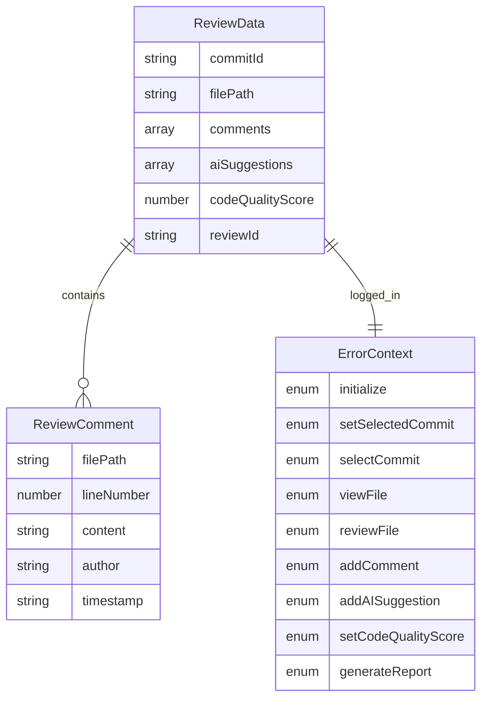
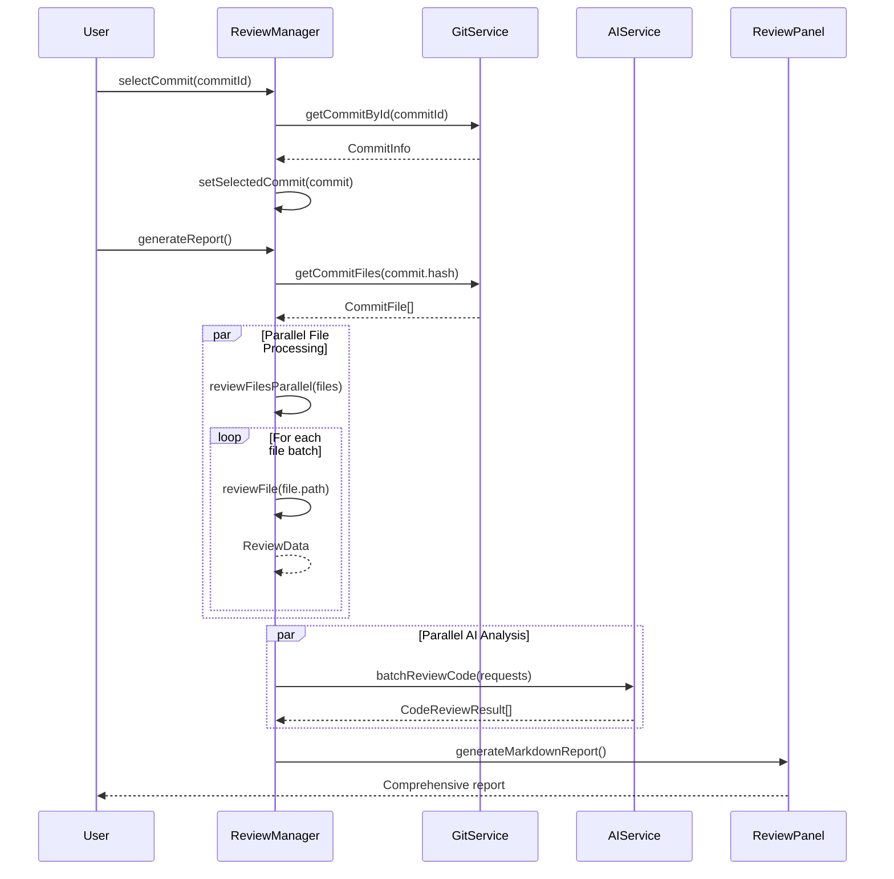
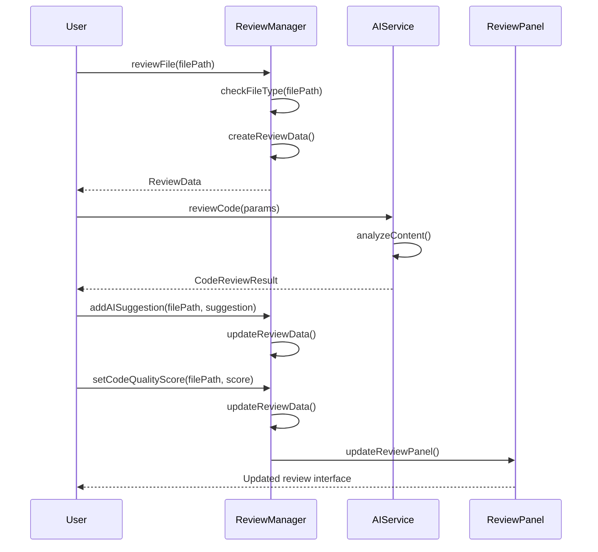
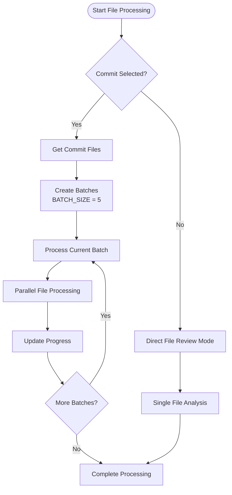
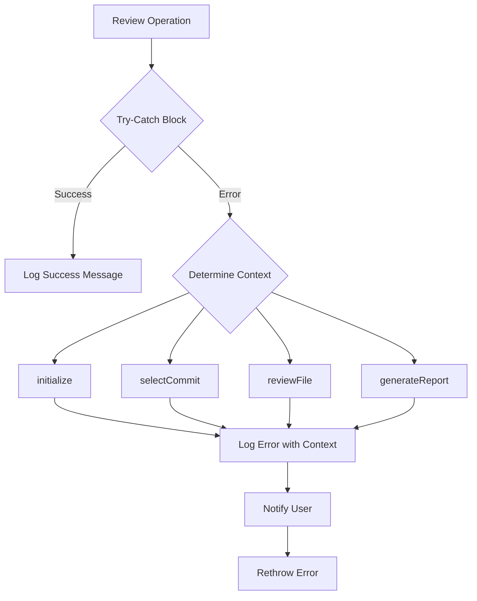
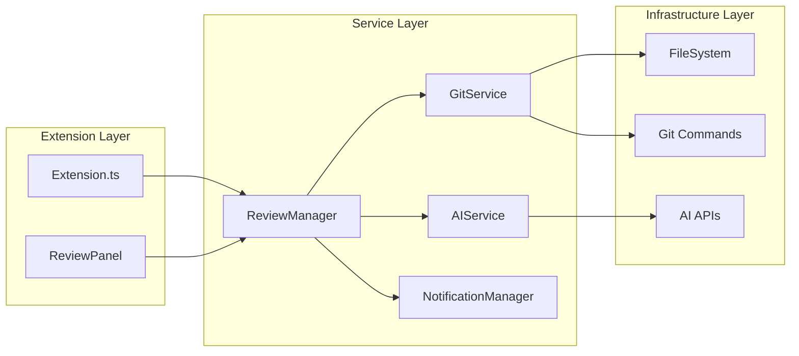
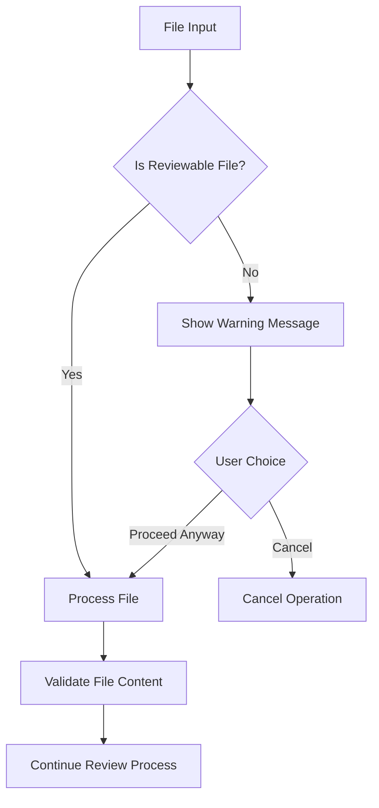

# Review Manager

<cite>
**Referenced Files in This Document**
- [reviewManager.ts](file://src/services/review/reviewManager.ts)
- [gitService.ts](file://src/services/git/gitService.ts)
- [aiService.ts](file://src/services/ai/aiService.ts)
- [reviewTypes.ts](file://src/core/review/reviewTypes.ts)
- [reviewPanel.ts](file://src/ui/views/reviewPanel.ts)
- [fileUtils.ts](file://src/utils/fileUtils.ts)
- [extension.ts](file://src/extension.ts)
</cite>

## Table of Contents
1. [Introduction](#introduction)
2. [Architecture Overview](#architecture-overview)
3. [Core Components](#core-components)
4. [Domain Model](#domain-model)
5. [Key Interfaces and Methods](#key-interfaces-and-methods)
6. [Workflow Analysis](#workflow-analysis)
7. [Batch Processing Strategy](#batch-processing-strategy)
8. [Error Handling](#error-handling)
9. [Integration Patterns](#integration-patterns)
10. [Common Issues and Solutions](#common-issues-and-solutions)
11. [Performance Considerations](#performance-considerations)
12. [Best Practices](#best-practices)

## Introduction

The ReviewManager class serves as the central orchestration hub for code review operations in the CodeKarmic extension. It seamlessly coordinates between Git operations, AI analysis, and user interactions to provide comprehensive code review capabilities. The ReviewManager supports both traditional Git commit-based reviews and standalone file reviews, making it versatile for different development workflows.

As the primary orchestrator, the ReviewManager manages the entire review lifecycle, from initializing repositories and selecting commits to generating comprehensive reports with AI-powered insights. It maintains review data persistence, handles concurrent operations safely, and provides a unified interface for various review scenarios.

## Architecture Overview

The ReviewManager follows a service-oriented architecture pattern, integrating with specialized services to deliver comprehensive code review functionality:



**Diagram sources**
- [reviewManager.ts](file://src/services/review/reviewManager.ts#L78-L92)
- [gitService.ts](file://src/services/git/gitService.ts#L45-L62)
- [aiService.ts](file://src/services/ai/aiService.ts#L40-L72)

**Section sources**
- [reviewManager.ts](file://src/services/review/reviewManager.ts#L78-L92)

## Core Components

### ReviewManager Class Structure

The ReviewManager class encapsulates several key components that work together to provide comprehensive code review functionality:



**Diagram sources**
- [reviewManager.ts](file://src/services/review/reviewManager.ts#L78-L92)
- [gitService.ts](file://src/services/git/gitService.ts#L45-L62)
- [aiService.ts](file://src/services/ai/aiService.ts#L40-L72)

**Section sources**
- [reviewManager.ts](file://src/services/review/reviewManager.ts#L78-L92)

## Domain Model

The ReviewManager operates on a well-defined domain model that captures all aspects of code review data and operations:

### Core Data Structures



**Diagram sources**
- [reviewManager.ts](file://src/services/review/reviewManager.ts#L11-L26)
- [reviewManager.ts](file://src/services/review/reviewManager.ts#L28-L77)

### Domain Model Implementation

The domain model consists of three primary types that define the review data structure:

| Type | Purpose | Key Properties |
|------|---------|----------------|
| **ReviewData** | Core review information storage | `commitId`, `filePath`, `comments`, `aiSuggestions`, `codeQualityScore`, `reviewId` |
| **ReviewComment** | Individual review comments | `filePath`, `lineNumber`, `content`, `author`, `timestamp` |
| **ErrorContext** | Error tracking and logging | Enumeration of operation contexts for error reporting |

**Section sources**
- [reviewManager.ts](file://src/services/review/reviewManager.ts#L11-L77)

## Key Interfaces and Methods

### Core Public Interfaces

The ReviewManager exposes several key interfaces that serve different review scenarios:

#### Initialization and Setup

```typescript
// Initialize repository and Git service
public async initialize(repoPath: string): Promise<void>

// Select a specific commit for review
public async selectCommit(commitId: string): Promise<void>

// Set selected commit directly
public setSelectedCommit(commit: CommitInfo): void
```

#### File-Level Operations

```typescript
// Begin review of a specific file
public async reviewFile(filePath: string): Promise<ReviewData>

// Add manual comments to review
public async addComment(filePath: string, lineNumber: number, content: string): Promise<void>

// Add AI-generated suggestions
public async addAISuggestion(filePath: string, suggestion: string): Promise<void>

// Set code quality scores
public async setCodeQualityScore(filePath: string, score: number): Promise<void>
```

#### Report Generation

```typescript
// Generate comprehensive review report
public async generateReport(): Promise<string>

// View file in editor
public async viewFile(filePath: string): Promise<void>

// Access underlying Git service
public getGitService(): GitService
```

**Section sources**
- [reviewManager.ts](file://src/services/review/reviewManager.ts#L110-L326)

### Method Parameter Analysis

Each method accepts specific parameters tailored to its operational context:

| Method | Parameters | Purpose | Validation |
|--------|------------|---------|------------|
| `initialize()` | `repoPath: string` | Sets up repository context | Checks path existence and Git repository validity |
| `selectCommit()` | `commitId: string` | Selects target commit for review | Validates commit ID format and availability |
| `reviewFile()` | `filePath: string` | Begins file review process | Checks file type support and accessibility |
| `addComment()` | `filePath, lineNumber, content` | Adds user comment | Validates line number and content presence |
| `generateReport()` | None | Initiates comprehensive report generation | Ensures commit selection and file availability |

**Section sources**
- [reviewManager.ts](file://src/services/review/reviewManager.ts#L110-L326)

## Workflow Analysis

### Git Commit-Based Review Workflow

The primary workflow involves reviewing changes introduced by specific Git commits:



**Diagram sources**
- [reviewManager.ts](file://src/services/review/reviewManager.ts#L149-L201)
- [reviewManager.ts](file://src/services/review/reviewManager.ts#L371-L661)

### Standalone File Review Workflow

For independent file reviews outside Git context:



**Diagram sources**
- [reviewManager.ts](file://src/services/review/reviewManager.ts#L229-L262)
- [reviewPanel.ts](file://src/ui/views/reviewPanel.ts#L149-L240)

**Section sources**
- [reviewManager.ts](file://src/services/review/reviewManager.ts#L149-L201)
- [reviewManager.ts](file://src/services/review/reviewManager.ts#L229-L262)

## Batch Processing Strategy

### BATCH_SIZE Configuration

The ReviewManager implements sophisticated batch processing to optimize performance and resource utilization:



**Diagram sources**
- [reviewManager.ts](file://src/services/review/reviewManager.ts#L328-L369)

### Batch Processing Implementation

The batch processing strategy divides file operations into manageable chunks:

| Aspect | Implementation | Benefits |
|--------|----------------|----------|
| **Batch Size** | Fixed at 5 files per batch | Balanced memory usage and progress feedback |
| **Parallel Execution** | Promise.all() for batch processing | Maximizes CPU utilization |
| **Progress Tracking** | Real-time progress updates | Provides user feedback during long operations |
| **Error Isolation** | Individual file error handling | Prevents cascade failures |

**Section sources**
- [reviewManager.ts](file://src/services/review/reviewManager.ts#L328-L369)

## Error Handling

### Error Context Management

The ReviewManager implements comprehensive error handling with context-aware logging:



**Diagram sources**
- [reviewManager.ts](file://src/services/review/reviewManager.ts#L100-L108)

### Error Context Types

The ErrorContext enumeration provides granular error tracking:

| Context | Purpose | Recovery Strategy |
|---------|---------|-------------------|
| `initialize` | Repository initialization failures | Path validation and Git repository checks |
| `selectCommit` | Commit selection errors | Commit ID validation and network connectivity |
| `reviewFile` | File review initiation issues | File type checking and accessibility verification |
| `generateReport` | Report generation failures | Resource availability and permission checks |

**Section sources**
- [reviewManager.ts](file://src/services/review/reviewManager.ts#L28-L77)
- [reviewManager.ts](file://src/services/review/reviewManager.ts#L100-L108)

## Integration Patterns

### Service Integration Architecture

The ReviewManager demonstrates excellent service integration patterns:



**Diagram sources**
- [extension.ts](file://src/extension.ts#L68-L73)
- [reviewManager.ts](file://src/services/review/reviewManager.ts#L78-L92)

### Dependency Injection Pattern

The ReviewManager follows a dependency injection pattern for service management:

**Section sources**
- [extension.ts](file://src/extension.ts#L68-L73)
- [reviewManager.ts](file://src/services/review/reviewManager.ts#L89-L92)

## Common Issues and Solutions

### Handling Direct File Reviews vs Git Commit Reviews

The ReviewManager gracefully handles two distinct review modes:

#### Git Commit Review Mode
- **Trigger**: Selected commit with associated files
- **Features**: Full diff analysis, commit history context, batch processing
- **Implementation**: Uses `reviewFilesParallel()` for efficient processing

#### Direct File Review Mode
- **Trigger**: No selected commit, standalone file analysis
- **Features**: Simplified workflow, immediate AI analysis
- **Implementation**: Processes single file with minimal overhead

### File Type Validation

The system automatically validates file types before processing:



**Diagram sources**
- [fileUtils.ts](file://src/utils/fileUtils.ts#L26-L36)

**Section sources**
- [reviewManager.ts](file://src/services/review/reviewManager.ts#L235-L238)
- [fileUtils.ts](file://src/utils/fileUtils.ts#L26-L36)

## Performance Considerations

### Memory Management

The ReviewManager implements several strategies to manage memory efficiently:

| Strategy | Implementation | Benefit |
|----------|----------------|---------|
| **Lazy Loading** | Load commit data only when needed | Reduces initial memory footprint |
| **Batch Processing** | Process files in controlled batches | Prevents memory spikes |
| **Cache Utilization** | Cache frequently accessed commits | Reduces redundant Git operations |
| **Progressive Loading** | Update UI progressively | Maintains responsiveness |

### Concurrent Operation Safety

The system prevents concurrent report generation to avoid conflicts:

```typescript
private isGeneratingReport: boolean = false;

public async generateReport(): Promise<string> {
    if (this.isGeneratingReport) {
        notificationManager.log(OUTPUT.REPOSITORY.REPORT_IN_PROGRESS, 'warning', true);
        return '';
    }
    
    this.isGeneratingReport = true;
    try {
        // Report generation logic
    } finally {
        this.isGeneratingReport = false;
    }
}
```

**Section sources**
- [reviewManager.ts](file://src/services/review/reviewManager.ts#L87-L88)
- [reviewManager.ts](file://src/services/review/reviewManager.ts#L377-L380)

## Best Practices

### Review Data Persistence

The ReviewManager maintains review data using a Map-based storage system:

```typescript
private reviews: Map<string, ReviewData> = new Map();

// Key generation ensures uniqueness across different contexts
const reviewKey = isDirectFileReview ? 
    `direct:${filePath}` : 
    `${commitId}:${filePath}`;
```

### Error Recovery Strategies

The system implements robust error recovery mechanisms:

1. **Graceful Degradation**: Continue processing remaining files on individual failures
2. **Fallback Mechanisms**: Alternative AI analysis methods when primary fails
3. **User Feedback**: Clear error messages with actionable suggestions

### Extension Integration

The ReviewManager integrates seamlessly with VS Code extension patterns:

- **Command Registration**: Proper VS Code command registration
- **Progress Indicators**: Native VS Code progress reporting
- **Status Bar Updates**: Real-time status updates
- **Output Channel Logging**: Comprehensive logging for debugging

**Section sources**
- [reviewManager.ts](file://src/services/review/reviewManager.ts#L240-L252)
- [extension.ts](file://src/extension.ts#L81-L101)