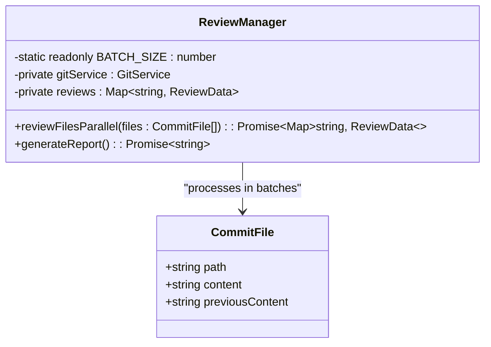
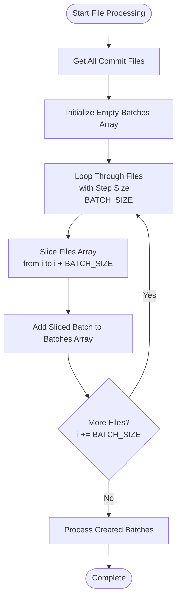
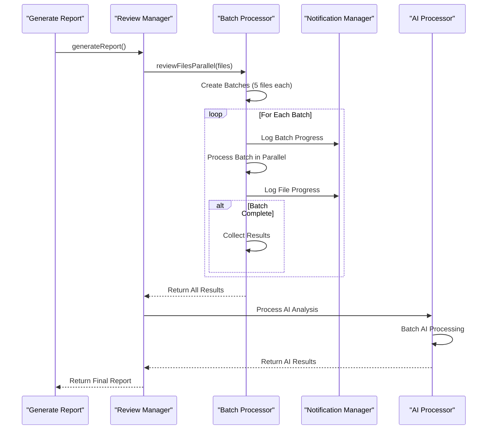
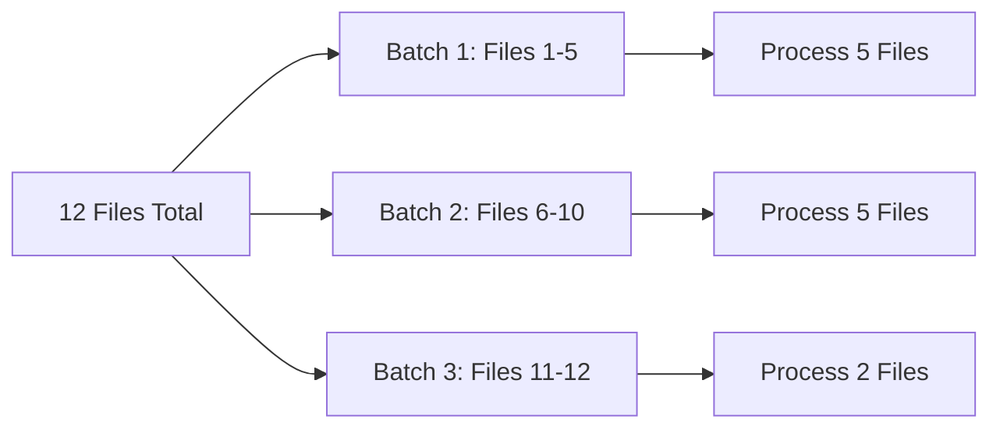
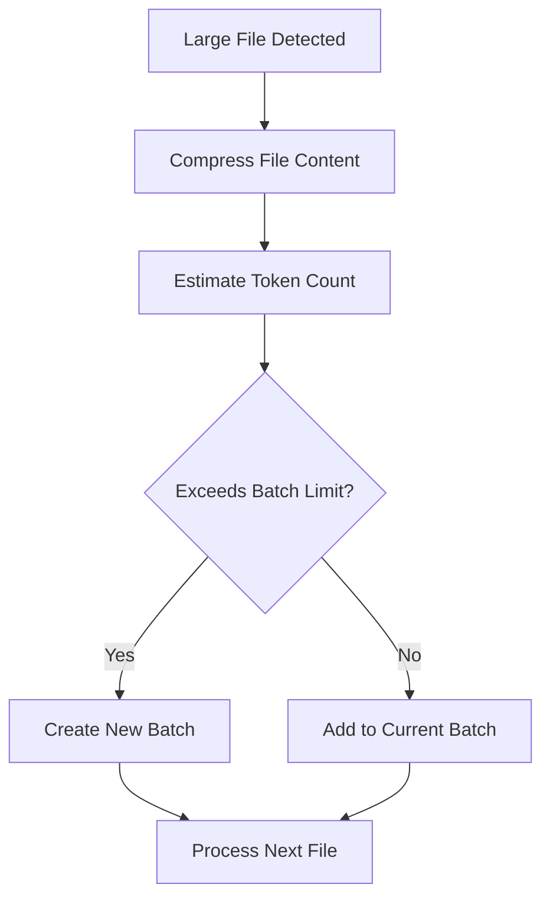
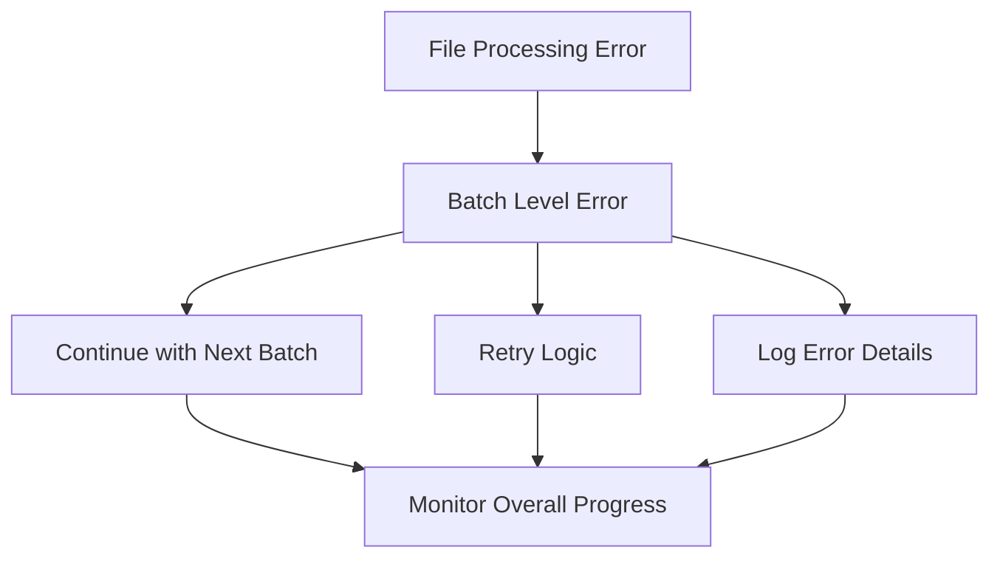

# Batch Creation

<cite>
**Referenced Files in This Document**
- [reviewManager.ts](file://src/services/review/reviewManager.ts)
- [constants.ts](file://src/constants/constants.ts)
- [largeFileProcessor.ts](file://src/core/compression/largeFileProcessor.ts)
- [aiService.ts](file://src/services/ai/aiService.ts)
</cite>

## Table of Contents
1. [Introduction](#introduction)
2. [Batch Size Configuration](#batch-size-configuration)
3. [Batch Creation Algorithm](#batch-creation-algorithm)
4. [Implementation Details](#implementation-details)
5. [Parallel Processing Integration](#parallel-processing-integration)
6. [Edge Cases and Solutions](#edge-cases-and-solutions)
7. [Performance Considerations](#performance-considerations)
8. [Error Handling](#error-handling)
9. [Best Practices](#best-practices)
10. [Troubleshooting Guide](#troubleshooting-guide)

## Introduction

The CodeKarmic system implements a sophisticated batch creation mechanism to efficiently process large numbers of files during code review operations. This sub-feature divides files into manageable chunks using a configurable batch size, enabling parallel processing while maintaining optimal resource utilization and preventing system overload.

The batch creation system serves as the foundation for the parallel processing pipeline, particularly in the [`reviewFilesParallel`](file://src/services/review/reviewManager.ts#L329-L369) method, where files are systematically organized into groups of 5 for concurrent processing.

## Batch Size Configuration

### Constant Definition

The system defines the batch size as a static constant within the ReviewManager class:

**Diagram sources**
- [reviewManager.ts](file://src/services/review/reviewManager.ts#L79-L81)

The batch size is configured as a constant value of 5 files per batch, providing an optimal balance between parallelization efficiency and resource management.

**Section sources**
- [reviewManager.ts](file://src/services/review/reviewManager.ts#L79-L81)

### Rationale for Batch Size Selection

The choice of 5 files per batch is based on several factors:

- **Resource Management**: Prevents excessive memory consumption when processing large files
- **Concurrency Control**: Allows meaningful parallelism without overwhelming system resources
- **Error Isolation**: Limits the impact of failures to smaller groups of files
- **Progress Tracking**: Provides frequent update points for user feedback

## Batch Creation Algorithm

### Core Algorithm Implementation

The batch creation algorithm follows a systematic approach to divide files into chunks:

**Diagram sources**
- [reviewManager.ts](file://src/services/review/reviewManager.ts#L338-L341)

### Implementation Details

The batch creation process is implemented in the [`reviewFilesParallel`](file://src/services/review/reviewManager.ts#L329-L369) method:

1. **Initialization Phase**: Creates an empty array to store batch collections
2. **Iteration Phase**: Uses a loop with step size equal to the batch size constant
3. **Slicing Operation**: Utilizes JavaScript's `Array.prototype.slice()` method to extract file subsets
4. **Collection Phase**: Adds each sliced subset as a separate batch to the batches array

**Section sources**
- [reviewManager.ts](file://src/services/review/reviewManager.ts#L329-L369)

## Parallel Processing Integration

### Batch Processing Workflow

The batch creation seamlessly integrates with the parallel processing pipeline:

**Diagram sources**
- [reviewManager.ts](file://src/services/review/reviewManager.ts#L474-L478)
- [reviewManager.ts](file://src/services/review/reviewManager.ts#L329-L369)

### Progress Tracking Integration

The batch creation system provides comprehensive progress tracking:

- **Batch-Level Progress**: Tracks which batch is currently being processed
- **File-Level Progress**: Monitors individual file processing within batches
- **Total Progress**: Calculates overall completion percentage across all files

**Section sources**
- [reviewManager.ts](file://src/services/review/reviewManager.ts#L347-L357)

## Edge Cases and Solutions

### Case 1: Files Not Divisible by Batch Size

**Problem**: When the total number of files is not evenly divisible by the batch size (e.g., 12 files with batch size 5).

**Solution**: The algorithm handles this gracefully by creating partial batches:

**Diagram sources**
- [reviewManager.ts](file://src/services/review/reviewManager.ts#L338-L341)

### Case 2: Empty File Lists

**Problem**: Handling scenarios where no files need to be processed.

**Solution**: The algorithm includes early termination checks:
- Validates that files array is not empty before processing
- Returns immediately if no files are present
- Logs appropriate messages for empty processing scenarios

### Case 3: Large File Handling

**Problem**: Processing files that exceed memory or processing limits.

**Solution**: The system implements intelligent batch sizing based on file characteristics:

**Diagram sources**
- [largeFileProcessor.ts](file://src/core/compression/largeFileProcessor.ts#L161-L198)

**Section sources**
- [reviewManager.ts](file://src/services/review/reviewManager.ts#L338-L341)
- [largeFileProcessor.ts](file://src/core/compression/largeFileProcessor.ts#L161-L198)

## Performance Considerations

### Memory Management

The batch creation system optimizes memory usage through:

- **Incremental Processing**: Files are processed in small, manageable chunks
- **Garbage Collection**: Partial batches are released after processing completes
- **Streaming Support**: Large files are processed incrementally rather than loaded entirely into memory

### Scalability Factors

- **Linear Scaling**: Processing time increases linearly with file count
- **Batch Size Tuning**: The constant batch size allows predictable performance characteristics
- **Resource Contention**: Limits concurrent operations to prevent system overload

### Optimization Strategies

1. **Early Termination**: Stops processing when cancellation is requested
2. **Progressive Loading**: Loads files as needed rather than all at once
3. **Efficient Slicing**: Uses native JavaScript array operations for optimal performance

## Error Handling

### Batch-Specific Error Handling

The system implements robust error handling at multiple levels:

**Diagram sources**
- [reviewManager.ts](file://src/services/review/reviewManager.ts#L347-L367)

### Error Recovery Mechanisms

- **Graceful Degradation**: Continues processing remaining batches when individual file errors occur
- **Partial Results**: Maintains results from successfully processed files
- **Comprehensive Logging**: Records detailed error information for debugging

**Section sources**
- [reviewManager.ts](file://src/services/review/reviewManager.ts#L347-L367)

## Best Practices

### Configuration Guidelines

1. **Batch Size Selection**: Choose batch sizes based on system capabilities and file characteristics
2. **Resource Monitoring**: Monitor memory and CPU usage during batch processing
3. **Progress Feedback**: Implement user-visible progress indicators for long-running operations

### Development Practices

1. **Testing**: Verify batch processing with various file counts and sizes
2. **Validation**: Ensure proper handling of edge cases and error conditions
3. **Documentation**: Maintain clear documentation of batch processing behavior

### Operational Considerations

1. **Monitoring**: Track batch processing metrics and performance trends
2. **Alerting**: Set up alerts for batch processing failures or performance degradation
3. **Maintenance**: Regularly review and optimize batch processing configurations

## Troubleshooting Guide

### Common Issues and Solutions

#### Issue: Batch Processing Stalls

**Symptoms**: Processing appears to hang or become unresponsive

**Causes**:
- Long-running file operations within batches
- Resource contention or system overload
- Infinite loops in file processing logic

**Solutions**:
- Implement timeout mechanisms for individual file processing
- Monitor system resources during batch processing
- Add logging to identify problematic files or operations

#### Issue: Memory Consumption Too High

**Symptoms**: System runs out of memory during batch processing

**Causes**:
- Batch size too large for available memory
- Files not properly cleaned up after processing
- Accumulation of large objects in memory

**Solutions**:
- Reduce batch size to lower memory footprint
- Implement explicit cleanup of processed files
- Use streaming approaches for large file processing

#### Issue: Inconsistent Progress Reporting

**Symptoms**: Progress indicators show incorrect or erratic values

**Causes**:
- Race conditions in progress tracking
- Incorrect calculation of total file counts
- Asynchronous processing timing issues

**Solutions**:
- Implement thread-safe progress tracking mechanisms
- Validate total file counts before processing begins
- Use consistent timing for progress updates

**Section sources**
- [reviewManager.ts](file://src/services/review/reviewManager.ts#L347-L367)

### Debugging Techniques

1. **Logging Enhancement**: Add detailed logging at each batch processing stage
2. **Performance Profiling**: Use profiling tools to identify bottlenecks
3. **Unit Testing**: Create focused tests for batch creation and processing logic
4. **Integration Testing**: Test batch processing with realistic file sets

### Monitoring and Metrics

Key metrics to monitor during batch processing:

- **Processing Time**: Time taken to process each batch
- **Memory Usage**: Peak memory consumption during batch operations
- **Error Rate**: Percentage of files failing during batch processing
- **Throughput**: Files processed per unit time
- **Resource Utilization**: CPU and memory usage patterns

## Conclusion

The CodeKarmic batch creation system provides a robust foundation for efficient file processing in code review operations. By dividing files into manageable chunks of 5, the system achieves optimal balance between parallelization benefits and resource management constraints. The implementation demonstrates careful consideration of edge cases, error handling, and performance optimization, making it suitable for both development environments and production deployments.

The modular design allows for easy extension and customization while maintaining backward compatibility and system stability. Future enhancements could include dynamic batch sizing based on system capabilities or file characteristics, further optimizing the processing pipeline for diverse use cases.