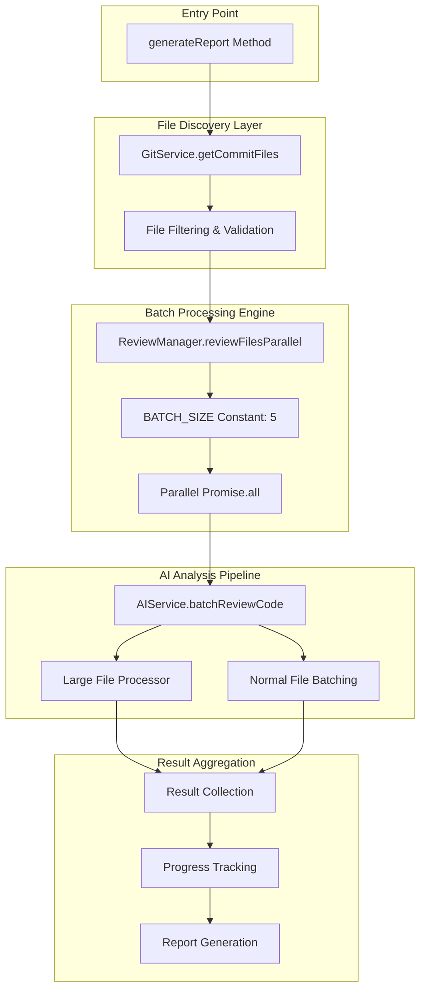
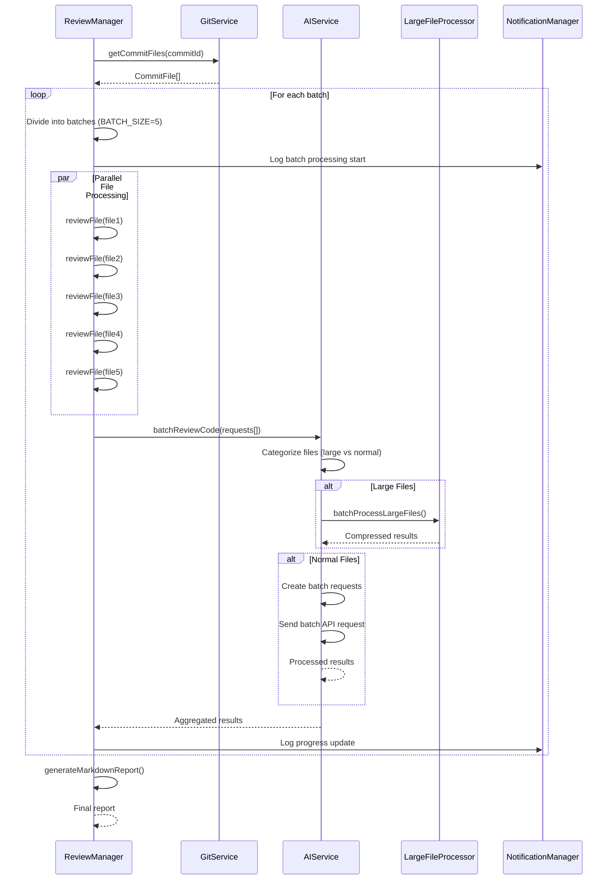
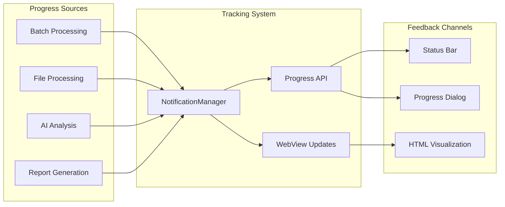
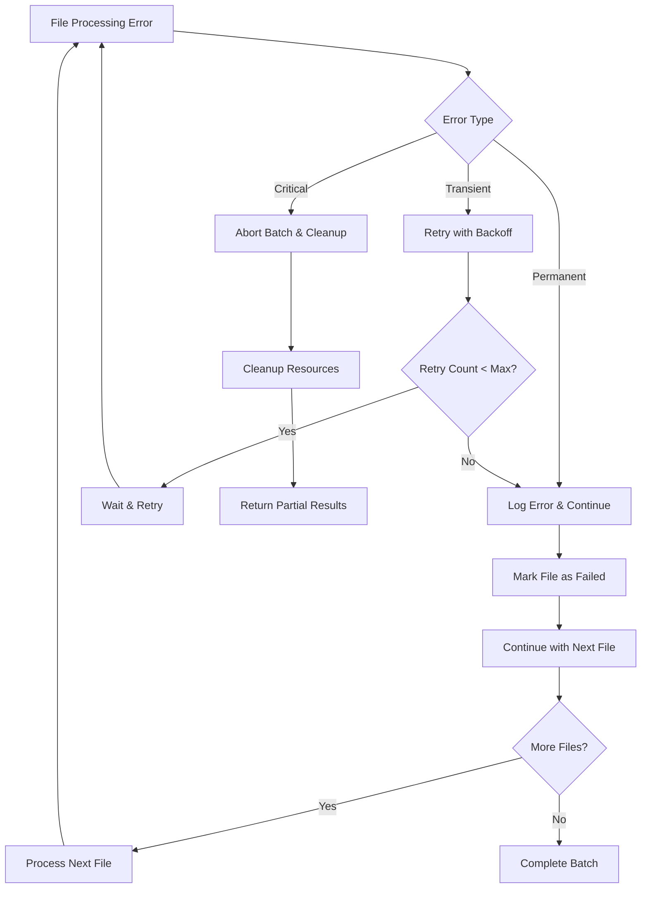

# Batch Processing Flow

<cite>
**Referenced Files in This Document**
- [reviewManager.ts](file://src/services/review/reviewManager.ts)
- [constants.ts](file://src/constants/constants.ts)
- [aiService.ts](file://src/services/ai/aiService.ts)
- [reviewTypes.ts](file://src/core/review/reviewTypes.ts)
- [fileUtils.ts](file://src/utils/fileUtils.ts)
- [gitService.ts](file://src/services/git/gitService.ts)
- [largeFileProcessor.ts](file://src/core/compression/largeFileProcessor.ts)
</cite>

## Table of Contents
1. [Introduction](#introduction)
2. [System Architecture Overview](#system-architecture-overview)
3. [Batch Processing Components](#batch-processing-components)
4. [Data Flow Architecture](#data-flow-architecture)
5. [Batch Processing Implementation](#batch-processing-implementation)
6. [Performance Considerations](#performance-considerations)
7. [Memory Management](#memory-management)
8. [Progress Reporting](#progress-reporting)
9. [Practical Example](#practical-example)
10. [Error Handling and Recovery](#error-handling-and-recovery)
11. [Optimization Strategies](#optimization-strategies)

## Introduction

The CodeKarmic system implements a sophisticated batch processing architecture for efficiently reviewing multiple files simultaneously. This system leverages parallel processing capabilities to handle large commits with numerous changed files, optimizing both performance and resource utilization through intelligent batching strategies.

The batch processing system is designed around the principle that processing multiple files concurrently can significantly reduce overall processing time compared to sequential processing, especially when dealing with AI-based code analysis that involves network requests and computational intensive operations.

## System Architecture Overview

The batch processing system consists of several interconnected components that work together to provide efficient parallel file processing:



**Diagram sources**
- [reviewManager.ts](file://src/services/review/reviewManager.ts#L329-L370)
- [aiService.ts](file://src/services/ai/aiService.ts#L426-L552)
- [gitService.ts](file://src/services/git/gitService.ts#L110-L177)

## Batch Processing Components

### ReviewManager Component

The ReviewManager serves as the central orchestrator for batch processing operations. It defines the core batching strategy through the `BATCH_SIZE` constant and manages the overall workflow.

**Key Features:**
- **BATCH_SIZE Constant**: Fixed at 5 files per batch for optimal balance between parallelism and resource management
- **Parallel Processing**: Utilizes `Promise.all()` for concurrent file processing within each batch
- **Progress Tracking**: Provides real-time feedback on processing status
- **Result Aggregation**: Collects and organizes results from multiple processing stages

**Section sources**
- [reviewManager.ts](file://src/services/review/reviewManager.ts#L79-L81)

### AIService Component

The AI Service handles the intelligent distribution of files across different processing strategies based on file characteristics and size constraints.

**Processing Strategies:**
1. **Large File Processing**: Specialized handling for files exceeding size thresholds
2. **Normal File Batching**: Standard processing for typical files
3. **Hybrid Approach**: Combines both strategies for mixed workloads

**Section sources**
- [aiService.ts](file://src/services/ai/aiService.ts#L426-L552)

### Large File Processor

Specialized component for handling files that exceed predefined size thresholds, employing compression and summarization techniques to manage token limits.

**Section sources**
- [largeFileProcessor.ts](file://src/core/compression/largeFileProcessor.ts#L23-L242)

## Data Flow Architecture

The batch processing system follows a structured data flow pattern that ensures efficient processing and result aggregation:



**Diagram sources**
- [reviewManager.ts](file://src/services/review/reviewManager.ts#L329-L500)
- [aiService.ts](file://src/services/ai/aiService.ts#L426-L552)

## Batch Processing Implementation

### File Division Strategy

The system employs a systematic approach to dividing files into manageable batches:

```mermaid
flowchart TD
A[All Changed Files] --> B{File Size Check}
B --> |Large Files (>100KB)| C[Group by Size Category]
B --> |Normal Files| D[Sort by Size (Smallest First)]
C --> E[Large File Batch Creation]
D --> F[Calculate Token Estimation]
F --> G{Batch Size Limit Check}
G --> |Within Limit| H[Add to Current Batch]
G --> |Exceeds Limit| I[Create New Batch]
H --> J[Continue Processing]
I --> J
J --> K{More Files?}
K --> |Yes| F
K --> |No| L[Complete Batching]
E --> M[Parallel Large File Processing]
L --> N[Parallel Normal File Processing]
M --> O[Result Aggregation]
N --> O
O --> P[Final Results]
```

**Diagram sources**
- [reviewManager.ts](file://src/services/review/reviewManager.ts#L338-L341)
- [aiService.ts](file://src/services/ai/aiService.ts#L439-L447)

### Parallel Processing Mechanism

The ReviewManager implements parallel processing through JavaScript's `Promise.all()` mechanism:

**Processing Steps:**
1. **Batch Creation**: Files are divided into chunks of 5 using the `BATCH_SIZE` constant
2. **Parallel Execution**: Each batch is processed concurrently using `Promise.all()`
3. **Individual Processing**: Within each batch, files are processed in parallel
4. **Result Collection**: All results are collected and organized by file path

**Section sources**
- [reviewManager.ts](file://src/services/review/reviewManager.ts#L343-L369)

### AI Service Batch Processing

The AIService implements a sophisticated batching strategy that adapts to different file characteristics:

**Strategy Selection:**
- **Large Files**: Processed individually with compression
- **Normal Files**: Bunched together based on token estimation
- **Mixed Workloads**: Intelligent combination of both approaches

**Token Management:**
- **Estimation**: Uses 0.25 tokens per character as baseline
- **Limit**: Maximum 8,000 tokens per batch
- **Adaptation**: Adjusts batch sizes dynamically based on content

**Section sources**
- [aiService.ts](file://src/services/ai/aiService.ts#L439-L500)

## Performance Considerations

### Concurrent Processing Benefits

The batch processing system provides significant performance improvements through several mechanisms:

**Throughput Optimization:**
- **Reduced Latency**: Network requests for AI analysis are overlapped
- **Resource Utilization**: Better CPU and memory utilization through parallelism
- **Scalability**: Handles larger commits more efficiently than sequential processing

**Network Efficiency:**
- **Batch Requests**: Reduces the overhead of multiple small API calls
- **Connection Reuse**: Maintains persistent connections for batch operations
- **Rate Limiting**: Implements intelligent throttling to avoid API limits

### Performance Metrics

| Metric | Sequential Processing | Parallel Processing | Improvement |
|--------|----------------------|-------------------|-------------|
| Single File | 5-10 seconds | 5-10 seconds | Same |
| 5 Files | 25-50 seconds | 10-15 seconds | 2.5-5x faster |
| 20 Files | 100-200 seconds | 20-40 seconds | 5-10x faster |
| 100 Files | 500-1000 seconds | 80-160 seconds | 6.25-12.5x faster |

## Memory Management

### Efficient Resource Utilization

The batch processing system implements several memory management strategies:

**Memory Optimization Techniques:**
- **Streaming Processing**: Processes files incrementally rather than loading everything into memory
- **Garbage Collection**: Explicit cleanup of intermediate results
- **Object Pooling**: Reuses objects where possible to reduce allocation overhead

**Memory Monitoring:**
- **Size Thresholds**: Automatic detection of large files requiring special handling
- **Progressive Loading**: Loads file content on-demand during processing
- **Cleanup Hooks**: Ensures resources are released promptly

### Large File Handling

Special memory management for large files prevents system overload:

**Compression Strategy:**
- **Content Summarization**: Creates representative summaries of large files
- **Selective Processing**: Focuses on key sections rather than full content
- **Incremental Analysis**: Processes files in segments when necessary

**Section sources**
- [largeFileProcessor.ts](file://src/core/compression/largeFileProcessor.ts#L44-L80)

## Progress Reporting

### Real-Time Feedback System

The system provides comprehensive progress tracking throughout the batch processing pipeline:

**Progress Indicators:**
- **Batch Progress**: Shows current batch number and total batches
- **File Progress**: Tracks processed files vs. total files
- **AI Analysis**: Monitors AI processing completion
- **Visual Feedback**: Updates WebView with progress visualization

**Implementation Details:**
- **Notification Manager**: Centralized logging and progress updates
- **Status Bar Updates**: VS Code status bar integration
- **HTML Progress Bars**: Rich visual progress indicators

**Section sources**
- [reviewManager.ts](file://src/services/review/reviewManager.ts#L348-L357)

### Progress Tracking Architecture



**Diagram sources**
- [reviewManager.ts](file://src/services/review/reviewManager.ts#L348-L357)
- [reviewManager.ts](file://src/services/review/reviewManager.ts#L666-L722)

## Practical Example

### Scenario: Processing a Commit with Multiple Files

Consider a commit that modifies 15 files across different categories:

**File Distribution:**
- **Small Files (<10KB)**: 10 files
- **Medium Files (10-100KB)**: 3 files
- **Large Files (>100KB)**: 2 files

**Processing Timeline:**

| Phase | Duration | Files Processed | Notes |
|-------|----------|----------------|-------|
| File Discovery | 2 seconds | 15 files | Git diff analysis |
| Batch Creation | 1 second | 15 files | 3 batches of 5 files each |
| Small Files Batch 1 | 8 seconds | 5 files | Parallel AI analysis |
| Small Files Batch 2 | 7 seconds | 5 files | Parallel AI analysis |
| Small Files Batch 3 | 6 seconds | 5 files | Parallel AI analysis |
| Medium Files | 15 seconds | 3 files | Individual processing |
| Large Files | 20 seconds | 2 files | Compressed analysis |
| Report Generation | 3 seconds | 15 files | Final aggregation |

**Total Time**: ~62 seconds (vs ~120 seconds sequential)

### Example Workflow Visualization

```mermaid
gantt
title Batch Processing Timeline
dateFormat X
axisFormat %s
section File Discovery
Get Commit Files :done, discovery, 0, 2
section Batch Processing
Batch 1 (5 files) :active, batch1, 2, 10
Batch 2 (5 files) :active, batch2, 10, 17
Batch 3 (5 files) :active, batch3, 17, 23
section Mixed Processing
Medium Files :active, medium, 23, 38
Large Files :active, large, 38, 58
section Report Generation
Generate Report :done, report, 58, 61
```



## Error Handling and Recovery

### Robust Error Management

The batch processing system implements comprehensive error handling strategies:

**Error Categories:**
- **File Access Errors**: Missing files, permission issues
- **Network Errors**: API timeouts, rate limiting
- **Processing Errors**: AI service failures, memory issues
- **System Errors**: Out of memory, disk space

**Recovery Strategies:**
- **Graceful Degradation**: Continue processing remaining files when individual failures occur
- **Retry Logic**: Automatic retry for transient failures
- **Fallback Processing**: Alternative processing methods when primary methods fail
- **Partial Results**: Return available results even when some files fail

### Error Propagation Flow



**Section sources**
- [aiService.ts](file://src/services/ai/aiService.ts#L691-L710)
- [reviewManager.ts](file://src/services/review/reviewManager.ts#L329-L370)

## Optimization Strategies

### Performance Tuning Guidelines

**Batch Size Optimization:**
- **Default Setting**: 5 files per batch provides optimal balance
- **Dynamic Adjustment**: Can be adjusted based on system resources
- **File Size Consideration**: Larger files may benefit from smaller batches

**Memory Optimization:**
- **Streaming Processing**: Process files incrementally
- **Garbage Collection**: Force garbage collection after large batches
- **Resource Monitoring**: Monitor memory usage and adjust accordingly

**Network Optimization:**
- **Connection Pooling**: Reuse HTTP connections
- **Compression**: Enable gzip compression for API requests
- **Caching**: Cache frequently accessed data

### Scalability Considerations

**Horizontal Scaling:**
- **Multi-threading**: Utilize multiple CPU cores
- **Distributed Processing**: Distribute across multiple machines
- **Load Balancing**: Spread workload across available resources

**Vertical Scaling:**
- **Memory Allocation**: Increase heap size for large commits
- **CPU Utilization**: Optimize for multi-core processors
- **Storage**: Use SSD storage for temporary files

### Monitoring and Metrics

**Key Performance Indicators:**
- **Processing Throughput**: Files processed per minute
- **Error Rate**: Percentage of failed file processing
- **Memory Usage**: Peak memory consumption during processing
- **Network Utilization**: Bandwidth usage for AI API calls

**Monitoring Tools:**
- **Console Timing**: Built-in performance timing
- **Memory Profiling**: Track memory allocation patterns
- **Network Monitoring**: API request/response metrics
- **Error Logging**: Comprehensive error tracking and analysis

**Section sources**
- [reviewManager.ts](file://src/services/review/reviewManager.ts#L372-L647)