# Parallel Processing

<cite>
**Referenced Files in This Document**
- [reviewManager.ts](file://src/services/review/reviewManager.ts)
- [aiService.ts](file://src/services/ai/aiService.ts)
- [gitService.ts](file://src/services/git/gitService.ts)
- [fileUtils.ts](file://src/utils/fileUtils.ts)
- [types.ts](file://src/models/types.ts)
- [largeFileProcessor.ts](file://src/core/compression/largeFileProcessor.ts)
</cite>

## Table of Contents
1. [Introduction](#introduction)
2. [System Architecture Overview](#system-architecture-overview)
3. [Core Parallel Processing Components](#core-parallel-processing-components)
4. [Implementation Details](#implementation-details)
5. [Domain Model](#domain-model)
6. [Usage Patterns](#usage-patterns)
7. [Error Handling Strategies](#error-handling-strategies)
8. [Performance Optimization](#performance-optimization)
9. [Common Issues and Solutions](#common-issues-and-solutions)
10. [Best Practices](#best-practices)

## Introduction

CodeKarmic implements sophisticated parallel processing capabilities to efficiently handle multiple file reviews simultaneously. The system leverages JavaScript's `Promise.all` pattern to process batches of files concurrently, significantly reducing the overall processing time for large codebases. This parallel processing architecture enables the system to handle hundreds of files in a fraction of the time it would take to process them sequentially.

The parallel processing subsystem consists of two primary components: the `reviewFilesParallel` method in the `ReviewManager` class and the `batchReviewCode` method in the `AIService` class. These components work together to provide seamless concurrent execution of code review operations while maintaining robust error handling and progress tracking.

## System Architecture Overview

The parallel processing system follows a layered architecture with clear separation of concerns:

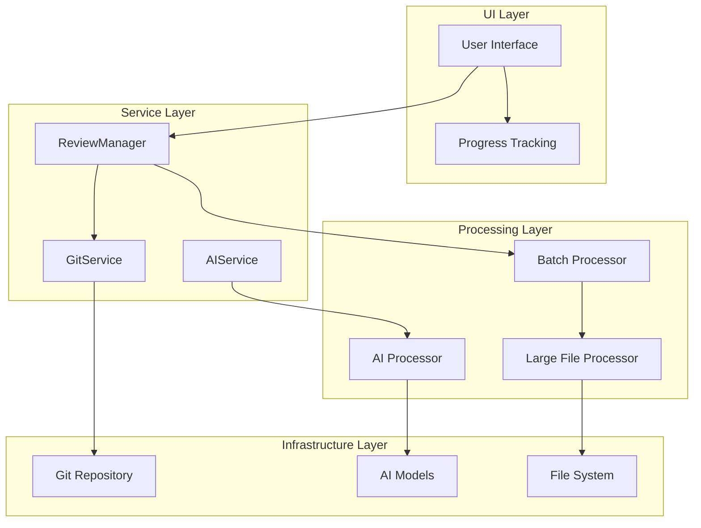

**Diagram sources**
- [reviewManager.ts](file://src/services/review/reviewManager.ts#L79-L854)
- [aiService.ts](file://src/services/ai/aiService.ts#L40-L787)
- [gitService.ts](file://src/services/git/gitService.ts#L45-L200)

## Core Parallel Processing Components

### ReviewManager Parallel Processing

The `ReviewManager` class implements the primary parallel processing logic through the `reviewFilesParallel` method. This method divides files into manageable batches and processes them concurrently using `Promise.all`.

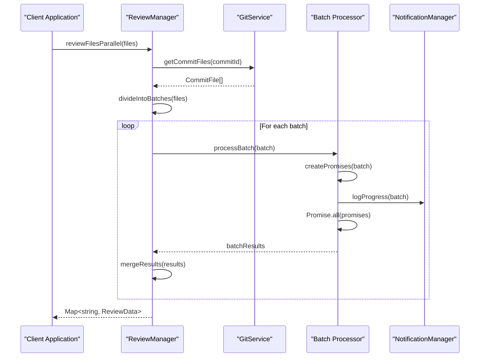

**Diagram sources**
- [reviewManager.ts](file://src/services/review/reviewManager.ts#L329-L370)

### AIService Batch Processing

The `AIService` class provides advanced batch processing capabilities through the `batchReviewCode` method, which handles both small and large files efficiently.

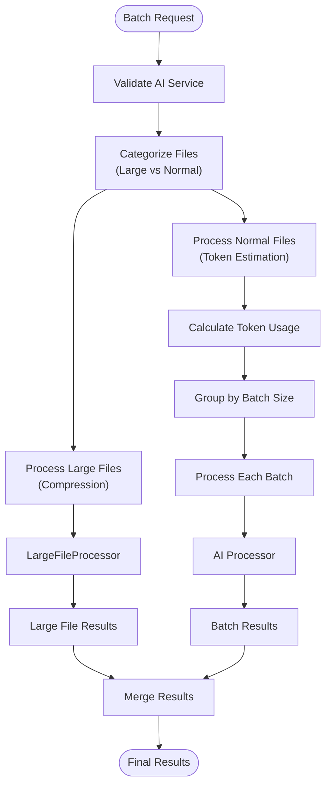

**Diagram sources**
- [aiService.ts](file://src/services/ai/aiService.ts#L431-L552)

**Section sources**
- [reviewManager.ts](file://src/services/review/reviewManager.ts#L329-L370)
- [aiService.ts](file://src/services/ai/aiService.ts#L431-L552)

## Implementation Details

### Batch Creation and Processing

The system implements intelligent batch creation based on configurable batch sizes and file characteristics:

#### ReviewManager Batch Processing Pattern

The `reviewFilesParallel` method demonstrates the classic map and `Promise.all` pattern:

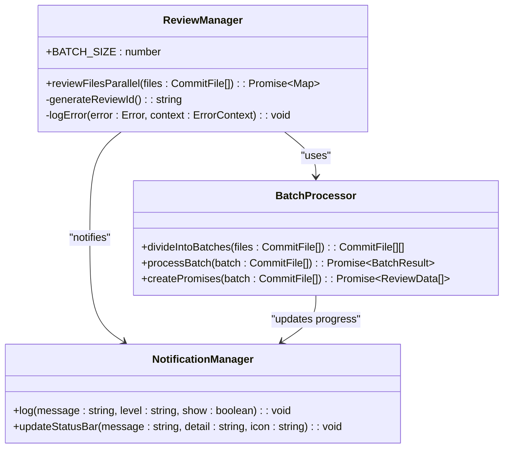

**Diagram sources**
- [reviewManager.ts](file://src/services/review/reviewManager.ts#L80-L81)
- [reviewManager.ts](file://src/services/review/reviewManager.ts#L329-L370)

#### AIService Batch Processing Pattern

The `batchReviewCode` method implements sophisticated batch processing with token estimation and dynamic batching:

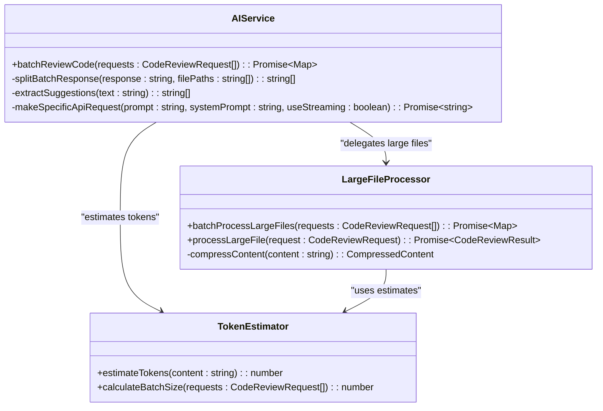

**Diagram sources**
- [aiService.ts](file://src/services/ai/aiService.ts#L431-L552)
- [largeFileProcessor.ts](file://src/core/compression/largeFileProcessor.ts#L161-L241)

**Section sources**
- [reviewManager.ts](file://src/services/review/reviewManager.ts#L329-L370)
- [aiService.ts](file://src/services/ai/aiService.ts#L431-L552)

## Domain Model

### Parallel Execution Domain

The parallel processing domain encompasses several key entities and their relationships:

| Entity | Purpose | Key Attributes | Processing Strategy |
|--------|---------|----------------|-------------------|
| `CommitFile` | Represents a file in a Git commit | `path`, `content`, `previousContent`, `status` | Individual processing with batch coordination |
| `CodeReviewRequest` | AI analysis request for a file | `filePath`, `currentContent`, `previousContent`, `useCompression` | Batch processing with token optimization |
| `CodeReviewResult` | AI analysis results | `suggestions`, `score`, `diffContent` | Aggregation and merging from multiple sources |
| `ReviewData` | Complete review information | `commitId`, `filePath`, `comments`, `aiSuggestions` | Storage and retrieval for UI presentation |

### Invocation Relationships

The parallel processing system establishes clear invocation relationships between components:

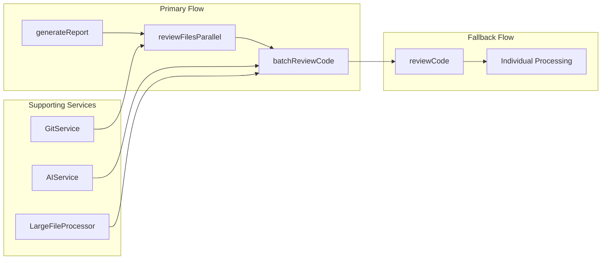

**Diagram sources**
- [reviewManager.ts](file://src/services/review/reviewManager.ts#L474-L478)
- [reviewManager.ts](file://src/services/review/reviewManager.ts#L499-L502)

**Section sources**
- [reviewManager.ts](file://src/services/review/reviewManager.ts#L19-L26)
- [aiService.ts](file://src/services/ai/aiService.ts#L15-L32)

## Usage Patterns

### Basic Parallel File Review

The fundamental usage pattern involves reviewing multiple files concurrently:

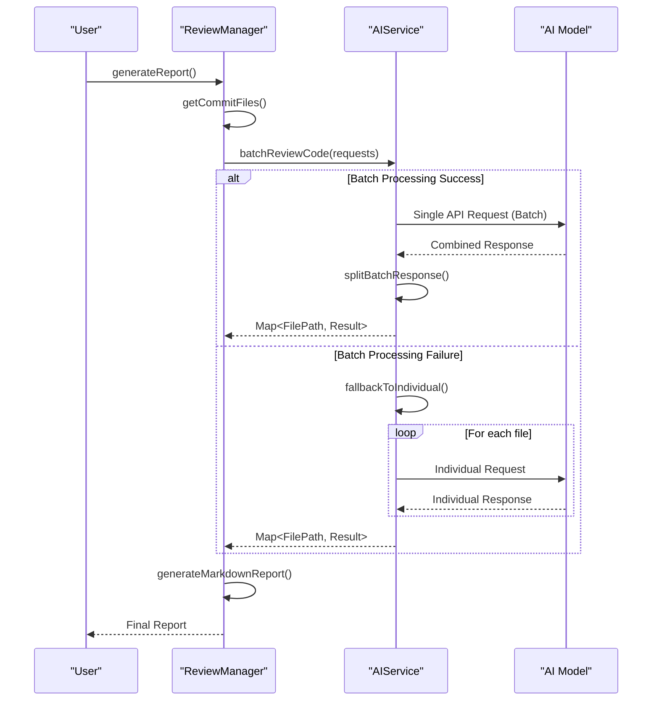

**Diagram sources**
- [reviewManager.ts](file://src/services/review/reviewManager.ts#L474-L646)
- [aiService.ts](file://src/services/ai/aiService.ts#L499-L610)

### Advanced Batch Processing Pattern

For optimal performance, the system implements dynamic batch sizing based on file characteristics:

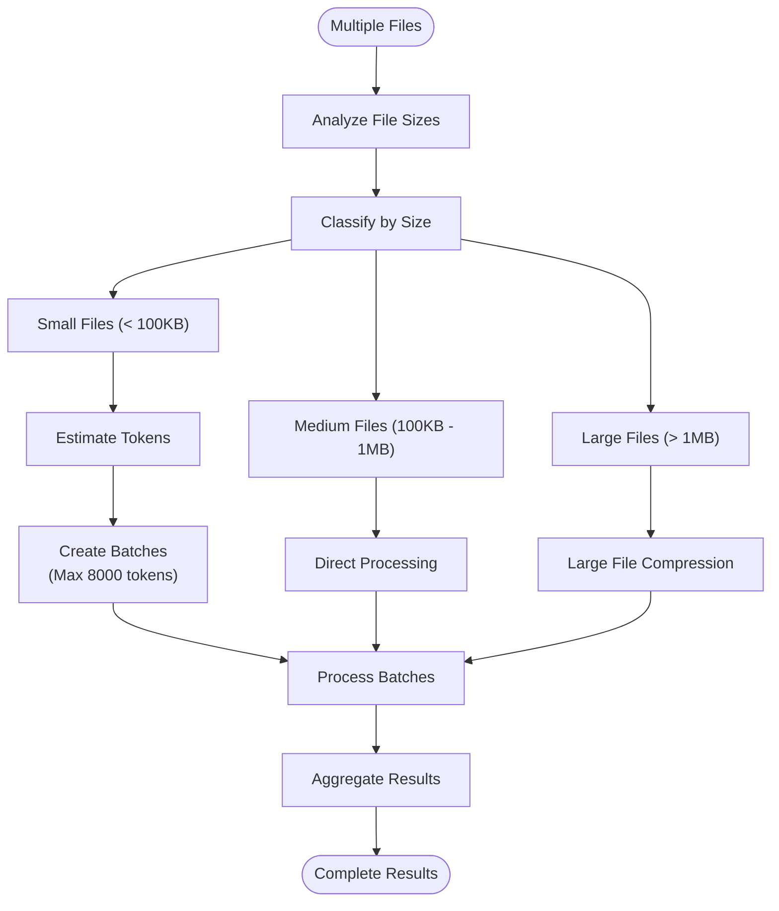

**Diagram sources**
- [aiService.ts](file://src/services/ai/aiService.ts#L439-L500)

**Section sources**
- [reviewManager.ts](file://src/services/review/reviewManager.ts#L474-L646)
- [aiService.ts](file://src/services/ai/aiService.ts#L431-L552)

## Error Handling Strategies

### Comprehensive Error Management

The parallel processing system implements multi-layered error handling to ensure robust operation:

#### ReviewManager Error Handling

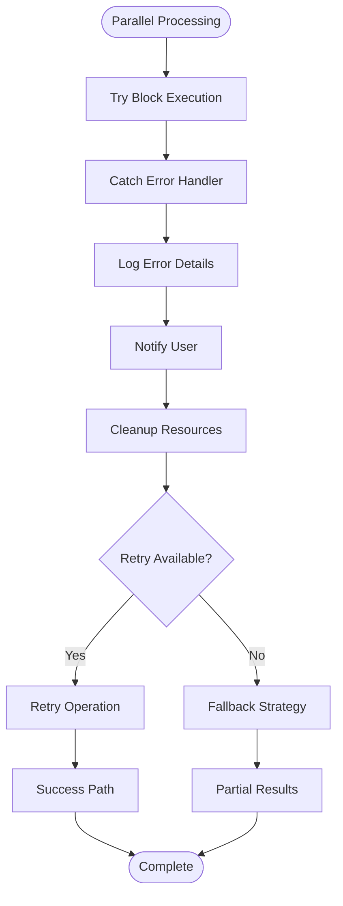

**Diagram sources**
- [reviewManager.ts](file://src/services/review/reviewManager.ts#L101-L105)
- [reviewManager.ts](file://src/services/review/reviewManager.ts#L566-L598)

#### AIService Error Recovery

The AI service implements sophisticated error recovery mechanisms:

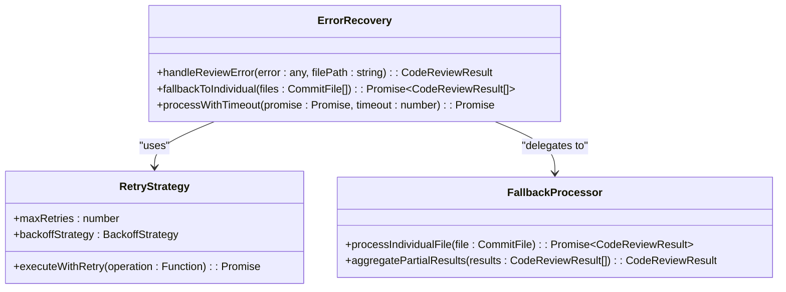

**Diagram sources**
- [aiService.ts](file://src/services/ai/aiService.ts#L691-L709)
- [aiService.ts](file://src/services/ai/aiService.ts#L569-L610)

**Section sources**
- [reviewManager.ts](file://src/services/review/reviewManager.ts#L101-L105)
- [aiService.ts](file://src/services/ai/aiService.ts#L691-L709)

## Performance Optimization

### Token-Based Batch Sizing

The system implements intelligent batch sizing based on token estimation:

| File Size Category | Token Threshold | Processing Strategy | Timeout |
|-------------------|-----------------|-------------------|---------|
| Small Files (< 10KB) | 250 tokens/file | Individual processing | 30 seconds |
| Medium Files (10KB - 100KB) | 1000 tokens/batch | Batch processing | 60 seconds |
| Large Files (100KB - 1MB) | 4000 tokens/batch | Batch with compression | 120 seconds |
| Very Large Files (> 1MB) | Variable | Streaming compression | 300 seconds |

### Concurrent Processing Limits

The system implements configurable concurrency controls:

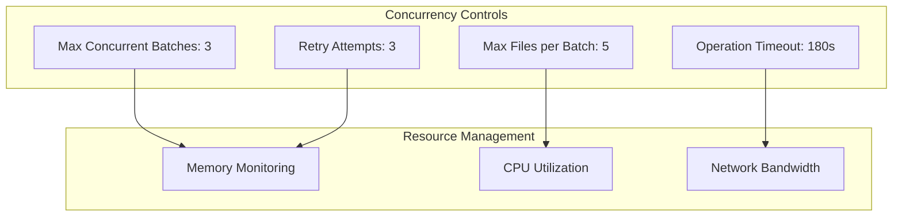

**Diagram sources**
- [reviewManager.ts](file://src/services/review/reviewManager.ts#L80-L81)
- [aiService.ts](file://src/services/ai/aiService.ts#L444-L446)

**Section sources**
- [reviewManager.ts](file://src/services/review/reviewManager.ts#L80-L81)
- [aiService.ts](file://src/services/ai/aiService.ts#L444-L446)

## Common Issues and Solutions

### Issue 1: Memory Exhaustion with Large Batches

**Problem**: Processing too many files simultaneously can exhaust memory resources.

**Solution**: Implement adaptive batch sizing based on available memory:

```typescript
// Adaptive batch sizing implementation
const calculateOptimalBatchSize = (availableMemory: number, averageFileSize: number): number => {
    const memoryPerFile = averageFileSize * 1.5; // 50% overhead
    const maxFilesPerBatch = Math.floor(availableMemory / memoryPerFile);
    return Math.min(maxFilesPerBatch, ReviewManager.BATCH_SIZE);
};
```

### Issue 2: API Rate Limiting

**Problem**: AI API rate limits can cause processing failures.

**Solution**: Implement exponential backoff and circuit breaker patterns:

```typescript
// Rate limiting solution
class RateLimitHandler {
    private retryCount = 0;
    private maxRetries = 5;
    
    async processWithRateLimit<T>(operation: () => Promise<T>): Promise<T> {
        try {
            return await operation();
        } catch (error) {
            if (this.shouldRetry(error)) {
                await this.delay(this.retryCount);
                return this.processWithRateLimit(operation);
            }
            throw error;
        }
    }
}
```

### Issue 3: Partial Failures in Batch Processing

**Problem**: When processing a batch, some files may fail while others succeed.

**Solution**: Implement partial result aggregation:

```typescript
// Partial failure handling
const processBatchWithPartialFailure = async (files: CommitFile[]): Promise<Map<string, ReviewData>> => {
    const results = new Map<string, ReviewData>();
    const promises = files.map(file => 
        this.reviewFile(file.path).catch(error => {
            console.error(`Failed to process ${file.path}:`, error);
            return null;
        })
    );
    
    const batchResults = await Promise.all(promises);
    files.forEach((file, index) => {
        const result = batchResults[index];
        if (result) {
            results.set(file.path, result);
        }
    });
    
    return results;
};
```

**Section sources**
- [reviewManager.ts](file://src/services/review/reviewManager.ts#L329-L370)
- [aiService.ts](file://src/services/ai/aiService.ts#L569-L610)

## Best Practices

### 1. Resource Management

Always implement proper resource cleanup in parallel operations:

```typescript
// Proper resource management pattern
async processFilesSafely(files: CommitFile[]): Promise<void> {
    const semaphore = new Semaphore(MAX_CONCURRENT_OPERATIONS);
    const results = [];
    
    try {
        for (const file of files) {
            await semaphore.acquire();
            try {
                const result = await this.processFile(file);
                results.push(result);
            } finally {
                semaphore.release();
            }
        }
    } finally {
        // Cleanup resources
        await this.cleanupResources();
    }
}
```

### 2. Progress Tracking

Implement comprehensive progress tracking for user feedback:

```typescript
// Progress tracking implementation
class ProgressTracker {
    private totalFiles: number;
    private processedFiles: number = 0;
    
    updateProgress(): void {
        const percentage = (this.processedFiles / this.totalFiles) * 100;
        this.notificationManager.updateStatusBar(
            `Processing files... (${this.processedFiles}/${this.totalFiles})`,
            `${percentage.toFixed(1)}% complete`,
            'sync~spin'
        );
    }
}
```

### 3. Error Aggregation

Collect and report all errors from parallel operations:

```typescript
// Error aggregation pattern
const processWithErrorAggregation = async <T>(
    operations: (() => Promise<T>)[]
): Promise<{results: T[], errors: Error[]}> => {
    const results: T[] = [];
    const errors: Error[] = [];
    
    const wrappedOperations = operations.map(op => op().then(
        result => ({success: true, result}),
        error => ({success: false, error})
    ));
    
    const aggregatedResults = await Promise.all(wrappedOperations);
    
    aggregatedResults.forEach(item => {
        if (item.success) {
            results.push(item.result);
        } else {
            errors.push(item.error);
        }
    });
    
    return {results, errors};
};
```

### 4. Testing Parallel Operations

Implement comprehensive testing strategies for parallel processing:

```typescript
// Testing parallel operations
describe('Parallel Processing Tests', () => {
    it('should handle concurrent file processing', async () => {
        const files = createTestFiles(100);
        const startTime = performance.now();
        
        const results = await reviewManager.reviewFilesParallel(files);
        
        expect(results.size).toBe(files.length);
        expect(performance.now() - startTime).toBeLessThan(TIMEOUT_THRESHOLD);
    });
    
    it('should recover from partial failures', async () => {
        const failingFiles = createFailingFiles(10);
        const workingFiles = createWorkingFiles(90);
        const mixedFiles = [...failingFiles, ...workingFiles];
        
        const results = await reviewManager.reviewFilesParallel(mixedFiles);
        
        expect(results.size).toBe(mixedFiles.length);
        expect(results.size).toBeGreaterThan(failingFiles.length);
    });
});
```

These best practices ensure reliable, efficient, and maintainable parallel processing implementations in the CodeKarmic system.