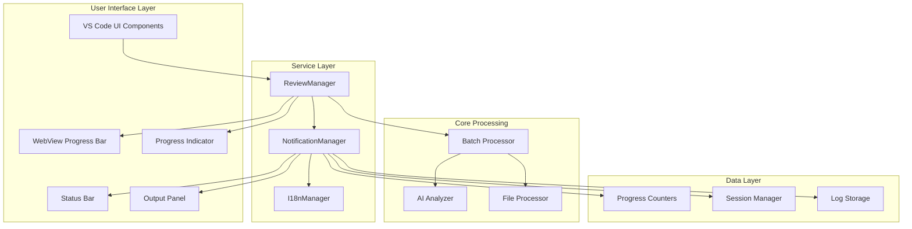
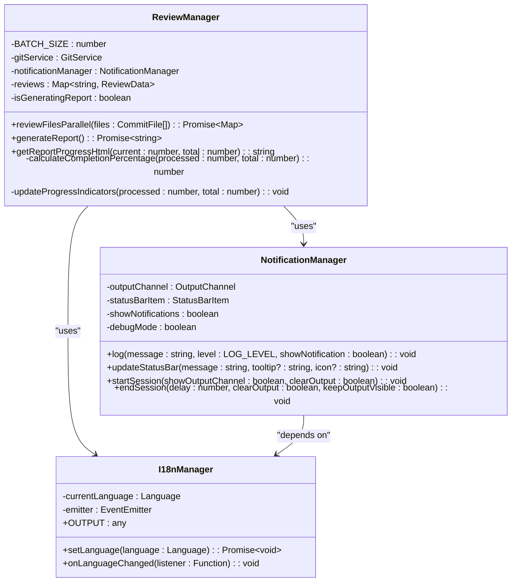
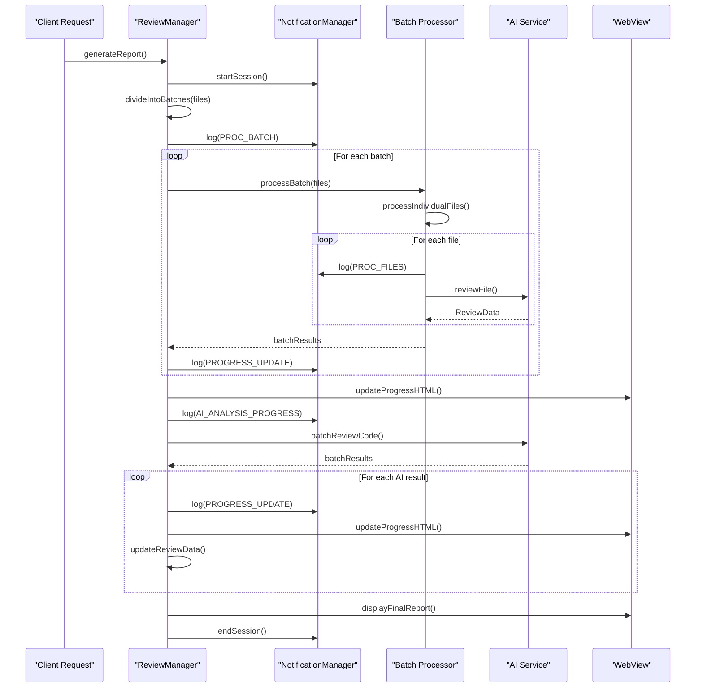
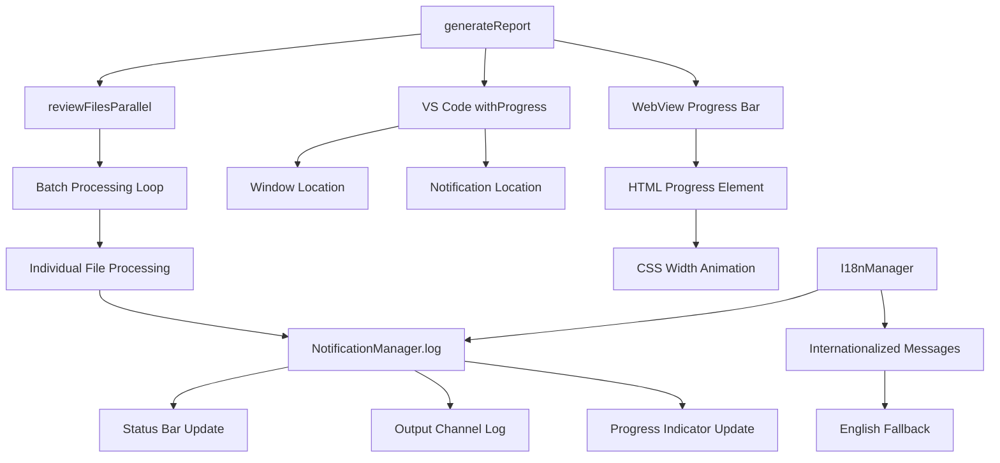
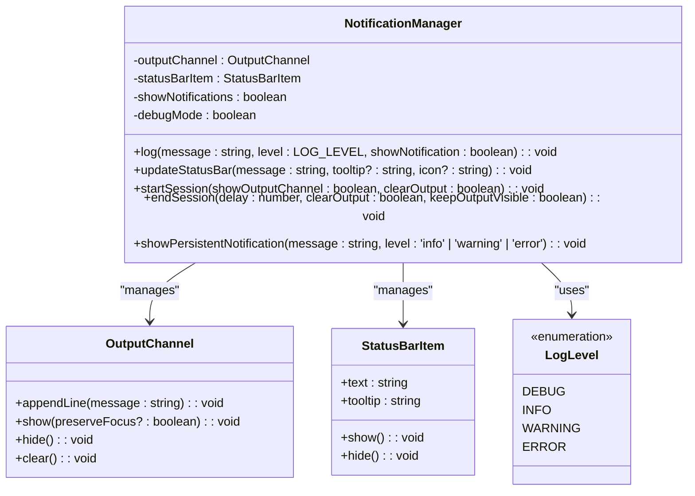
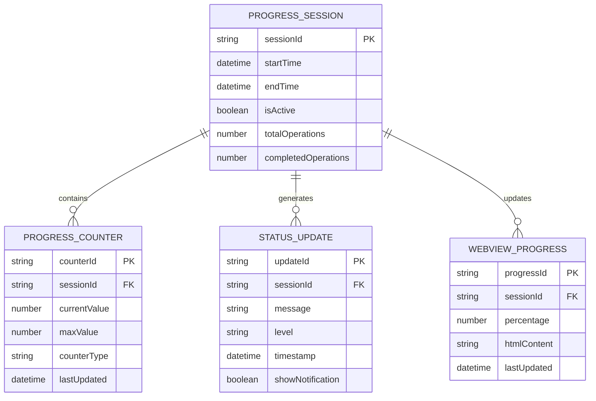

# Progress Reporting

<cite>
**Referenced Files in This Document**
- [reviewManager.ts](file://src/services/review/reviewManager.ts)
- [notificationManager.ts](file://src/services/notification/notificationManager.ts)
- [output.ts](file://src/i18n/en/output.ts)
- [constants.ts](file://src/constants/constants.ts)
- [index.ts](file://src/i18n/index.ts)
- [extension.ts](file://src/extension.ts)
- [reviewPanel.ts](file://src/ui/views/reviewPanel.ts)
</cite>

## Table of Contents
1. [Introduction](#introduction)
2. [System Architecture](#system-architecture)
3. [Core Components](#core-components)
4. [Progress Tracking Implementation](#progress-tracking-implementation)
5. [Notification System Integration](#notification-system-integration)
6. [Domain Model](#domain-model)
7. [Usage Patterns](#usage-patterns)
8. [Common Issues and Solutions](#common-issues-and-solutions)
9. [Technical Depth for Experienced Developers](#technical-depth-for-experienced-developers)
10. [Best Practices](#best-practices)

## Introduction

The CodeKarmic progress reporting system provides comprehensive real-time feedback during batch operations, particularly during code review report generation. This system ensures users receive continuous updates about operation status, completion percentages, and estimated time remaining through multiple channels including status bars, output panels, WebView progress bars, and VS Code's native progress indicators.

The progress reporting subsystem is built around two primary components: the ReviewManager's batch processing engine and the NotificationManager's logging infrastructure. Together, they create a seamless user experience that keeps users informed throughout lengthy operations.

## System Architecture

The progress reporting system follows a layered architecture with clear separation of concerns:



**Diagram sources**
- [reviewManager.ts](file://src/services/review/reviewManager.ts#L79-L853)
- [notificationManager.ts](file://src/services/notification/notificationManager.ts#L8-L213)

## Core Components

### ReviewManager - Batch Processing Engine

The ReviewManager serves as the central orchestrator for progress tracking during batch operations. It implements sophisticated batching mechanisms with intelligent progress calculation.



**Diagram sources**
- [reviewManager.ts](file://src/services/review/reviewManager.ts#L79-L100)
- [notificationManager.ts](file://src/services/notification/notificationManager.ts#L8-L30)
- [index.ts](file://src/i18n/index.ts#L75-L188)

**Section sources**
- [reviewManager.ts](file://src/services/review/reviewManager.ts#L79-L100)
- [notificationManager.ts](file://src/services/notification/notificationManager.ts#L8-L30)

### NotificationManager - Logging Infrastructure

The NotificationManager provides centralized logging and notification management with internationalization support and configurable log levels.

**Section sources**
- [notificationManager.ts](file://src/services/notification/notificationManager.ts#L8-L213)

### I18nManager - Internationalization Support

The I18nManager handles multilingual progress messages with automatic fallback mechanisms and dynamic language switching.

**Section sources**
- [index.ts](file://src/i18n/index.ts#L75-L188)

## Progress Tracking Implementation

### Batch Processing Loop

The ReviewManager implements a sophisticated batch processing system that divides large operations into manageable chunks while maintaining accurate progress tracking:



**Diagram sources**
- [reviewManager.ts](file://src/services/review/reviewManager.ts#L329-L370)
- [reviewManager.ts](file://src/services/review/reviewManager.ts#L466-L565)

### Progress Calculation Mechanisms

The system employs multiple progress calculation strategies:

#### 1. Batch-Level Progress
- **Current Batch**: Calculated as `(processedFiles / batchSize) + 1`
- **Total Batches**: Calculated as `Math.ceil(totalFiles / batchSize)`
- **Message Format**: `"Processing batch X/Y"`

#### 2. File-Level Progress
- **Processed Files**: Accumulated counter tracking completed files
- **Total Files**: Known total from commit analysis
- **Percentage**: `(processedFiles / totalFiles) * 100`
- **Message Format**: `"Processed X/Y files"`

#### 3. AI Analysis Progress
- **Incremental Updates**: Real-time progress during AI processing
- **Estimated Time Remaining**: Calculated based on elapsed time
- **Message Format**: `"AI analysis progress: X/Y files (Z%) - Estimated time remaining: W seconds"`

**Section sources**
- [reviewManager.ts](file://src/services/review/reviewManager.ts#L329-L370)
- [reviewManager.ts](file://src/services/review/reviewManager.ts#L466-L565)

### Invocation Relationship Between Components

The progress reporting system demonstrates a clear hierarchical relationship:



**Diagram sources**
- [reviewManager.ts](file://src/services/review/reviewManager.ts#L466-L565)
- [notificationManager.ts](file://src/services/notification/notificationManager.ts#L79-L121)

## Notification System Integration

### Logging System Architecture

The NotificationManager integrates with VS Code's native logging infrastructure:



**Diagram sources**
- [notificationManager.ts](file://src/services/notification/notificationManager.ts#L8-L121)
- [constants.ts](file://src/constants/constants.ts#L8-L33)

### Progress Synchronization Across Components

The system maintains synchronization through several mechanisms:

#### 1. Centralized Counter Management
- **processedFiles**: Shared counter across all processing stages
- **totalFiles**: Constant throughout the operation
- **batchIndex**: Current batch identifier

#### 2. Event-Driven Updates
- **Progress Events**: Fired at key milestones
- **Status Updates**: Real-time status bar updates
- **Log Entries**: Persistent logging for debugging

#### 3. Thread Safety Considerations
- **Atomic Operations**: Progress updates are atomic
- **Consistent State**: All components reference the same counters
- **Race Condition Prevention**: Proper sequencing of operations

**Section sources**
- [notificationManager.ts](file://src/services/notification/notificationManager.ts#L79-L121)

## Domain Model

### Progress Tracking Entities

The progress reporting system operates on several key entities:



### Progress Calculation Formulas

The system uses several mathematical formulas for progress calculation:

#### Completion Percentage
```
completionPercentage = (processedFiles / totalFiles) * 100
```

#### Estimated Time Remaining
```
elapsedTime = currentTime - startTime
estimatedTimeRemaining = (elapsedTime / processedFiles) * (totalFiles - processedFiles)
```

#### Batch Progress
```
currentBatch = Math.floor(processedFiles / batchSize) + 1
totalBatches = Math.ceil(totalFiles / batchSize)
```

**Section sources**
- [reviewManager.ts](file://src/services/review/reviewManager.ts#L344-L350)

## Usage Patterns

### Basic Progress Reporting Pattern

The most common usage pattern involves the ReviewManager's batch processing:

```typescript
// Example usage pattern from reviewManager.ts
const processedFiles = 0;
const totalFiles = files.length;

for (const batch of batches) {
    // Log batch progress
    const currentBatch = Math.floor(processedFiles / ReviewManager.BATCH_SIZE) + 1;
    const totalBatches = Math.ceil(totalFiles / ReviewManager.BATCH_SIZE);
    notificationManager.log(OUTPUT.PROCESS.PROC_BATCH(currentBatch, totalBatches), 'info', false);
    
    // Process batch files
    const batchPromises = batch.map(async file => {
        const result = await this.reviewFile(file.path);
        processedFiles++;
        
        // Log file progress
        notificationManager.log(OUTPUT.PROCESS.PROC_FILES(processedFiles, totalFiles), 'info', false);
        
        return { file, result };
    });
    
    // Wait for batch completion
    const batchResults = await Promise.all(batchPromises);
}
```

### Advanced Progress Reporting Pattern

For complex operations involving AI analysis:

```typescript
// Advanced pattern from generateReport method
await vscode.window.withProgress({
    location: vscode.ProgressLocation.Window,
    title: 'Generating Code Review Report',
    cancellable: true
}, async (progress, token) => {
    // Initial file count notification
    notificationManager.log(`${OUTPUT.FILE.FILES_TO_REVIEW} ${totalFiles}`, 'info', false);
    
    // Process files in parallel
    const reviewResults = await this.reviewFilesParallel(files);
    
    // AI analysis with incremental progress
    let processedAIFiles = 0;
    const aiAnalysisStartTime = new Date();
    
    for (const [filePath, result] of batchResults.entries()) {
        if (token.isCancellationRequested) {
            break;
        }
        
        processedAIFiles++;
        const percentage = (processedAIFiles / totalFiles) * 100;
        const currentTime = new Date();
        const elapsedTime = (currentTime.getTime() - aiAnalysisStartTime.getTime()) / 1000;
        const estimatedTimeRemaining = (elapsedTime / processedAIFiles) * (totalFiles - processedAIFiles);
        
        // Report progress with calculated metrics
        progress.report({
            increment: 0,
            message: OUTPUT.REPORT.AI_ANALYSIS_PROGRESS(processedAIFiles, totalFiles, percentage)
        });
        
        // Update WebView progress
        if (reportWebView) {
            reportWebView.webview.html = this.getReportProgressHtml(processedAIFiles, totalFiles);
        }
    }
});
```

**Section sources**
- [reviewManager.ts](file://src/services/review/reviewManager.ts#L329-L370)
- [reviewManager.ts](file://src/services/review/reviewManager.ts#L466-L565)

### WebView Progress Bar Integration

The system provides real-time progress updates through WebView integration:

```typescript
// WebView progress HTML generation
private getReportProgressHtml(current: number, total: number): string {
    const percentage = Math.round((current / total) * 100);
    
    return `<!DOCTYPE html>
    <html lang="zh-CN">
    <head>
        <style>
            .progress-bar {
                width: ${percentage}%;
                transition: width 0.3s ease;
            }
        </style>
    </head>
    <body>
        <div class="progress-container">
            <div class="progress-bar"></div>
            <div class="progress-text">进度: ${current}/${total} 文件 (${percentage}%)</div>
        </div>
    </body>
    </html>`;
}
```

**Section sources**
- [reviewManager.ts](file://src/services/review/reviewManager.ts#L666-L722)

## Common Issues and Solutions

### Issue 1: Progress Synchronization Problems

**Problem**: Progress indicators become desynchronized across different UI components.

**Solution**: Implement centralized progress management with atomic updates:

```typescript
// Centralized progress update pattern
class ProgressCoordinator {
    private static instance: ProgressCoordinator;
    private progressState: ProgressState = {
        processedFiles: 0,
        totalFiles: 0,
        currentBatch: 0,
        totalBatches: 0
    };
    
    updateProgress(processed: number, total: number, batch?: number): void {
        this.progressState = {
            ...this.progressState,
            processedFiles: processed,
            totalFiles: total,
            currentBatch: batch ?? this.progressState.currentBatch
        };
        
        // Broadcast updates to all components
        this.notifyComponents();
    }
}
```

### Issue 2: Memory Leaks in Long Operations

**Problem**: Progress tracking consumes excessive memory during large operations.

**Solution**: Implement progress batching and cleanup:

```typescript
// Memory-efficient progress tracking
class EfficientProgressTracker {
    private progressUpdates: ProgressUpdate[] = [];
    private readonly MAX_UPDATES = 100;
    
    addProgressUpdate(update: ProgressUpdate): void {
        this.progressUpdates.push(update);
        
        if (this.progressUpdates.length > this.MAX_UPDATES) {
            // Keep only the most recent updates
            this.progressUpdates = this.progressUpdates.slice(-this.MAX_UPDATES/2);
        }
    }
}
```

### Issue 3: Internationalization Conflicts

**Problem**: Progress messages appear in incorrect languages.

**Solution**: Ensure proper I18nManager initialization:

```typescript
// Proper I18n initialization
class ProgressReporter {
    private i18nManager: I18nManager;
    
    constructor() {
        this.i18nManager = I18nManager.getInstance();
        // Subscribe to language changes
        this.i18nManager.onLanguageChanged(() => {
            this.updateProgressMessages();
        });
    }
}
```

### Issue 4: WebView Progress Not Updating

**Problem**: WebView progress bar remains static during long operations.

**Solution**: Implement proper WebView communication:

```typescript
// WebView progress update mechanism
class WebViewProgressManager {
    private webView: vscode.WebviewPanel | undefined;
    
    updateProgress(current: number, total: number): void {
        if (this.webView) {
            const html = this.generateProgressHTML(current, total);
            this.webView.webview.html = html;
        }
    }
    
    generateProgressHTML(current: number, total: number): string {
        const percentage = Math.round((current / total) * 100);
        return `
            <script>
                document.getElementById('progress-bar').style.width = '${percentage}%';
                document.getElementById('progress-text').textContent = 
                    'Progress: ${current}/${total} (${percentage}%)';
            </script>
        `;
    }
}
```

## Technical Depth for Experienced Developers

### Advanced Progress Calculation Algorithms

For operations with varying processing times, the system implements adaptive progress calculation:

```typescript
// Adaptive progress calculation for heterogeneous workloads
class AdaptiveProgressCalculator {
    private timeSeries: number[] = [];
    private weightFactor = 0.7;
    
    calculateAdaptiveProgress(processed: number, total: number, currentTime: number): number {
        if (this.timeSeries.length > 0) {
            const averageTime = this.calculateWeightedAverage();
            const estimatedRemaining = (averageTime * (total - processed)) / 1000;
            
            return this.weightFactor * (processed / total) + 
                   (1 - this.weightFactor) * (1 - (estimatedRemaining / (estimatedRemaining + 60)));
        }
        
        return processed / total;
    }
    
    recordTime(startTime: number, endTime: number): void {
        this.timeSeries.push(endTime - startTime);
        
        if (this.timeSeries.length > 100) {
            this.timeSeries.shift();
        }
    }
    
    private calculateWeightedAverage(): number {
        return this.timeSeries.reduce((sum, time) => sum + time, 0) / this.timeSeries.length;
    }
}
```

### Performance Optimization Techniques

#### 1. Progress Update Throttling
```typescript
// Throttled progress updates to prevent UI blocking
class ThrottledProgressReporter {
    private lastUpdateTime = 0;
    private readonly UPDATE_INTERVAL = 100; // milliseconds
    
    reportProgress(processed: number, total: number): void {
        const now = Date.now();
        
        if (now - this.lastUpdateTime > this.UPDATE_INTERVAL) {
            this.performUpdate(processed, total);
            this.lastUpdateTime = now;
        }
    }
}
```

#### 2. Memory-Efficient Progress Tracking
```typescript
// Circular buffer for progress history
class ProgressHistory {
    private buffer: ProgressSnapshot[];
    private index = 0;
    
    constructor(private capacity: number) {
        this.buffer = new Array(capacity);
    }
    
    add(snapshot: ProgressSnapshot): void {
        this.buffer[this.index] = snapshot;
        this.index = (this.index + 1) % this.capacity;
    }
    
    getRecent(count: number): ProgressSnapshot[] {
        const recent = [];
        const startIndex = (this.index - count + this.capacity) % this.capacity;
        
        for (let i = 0; i < Math.min(count, this.capacity); i++) {
            const idx = (startIndex + i) % this.capacity;
            recent.push(this.buffer[idx]);
        }
        
        return recent;
    }
}
```

### Extension Points for Custom Progress Tracking

Developers can extend the progress reporting system by implementing custom progress calculators:

```typescript
// Custom progress calculator interface
interface IProgressCalculator {
    calculateProgress(processed: number, total: number, context?: any): number;
    estimateRemainingTime(processed: number, total: number, context?: any): number;
    getProgressMessage(processed: number, total: number, context?: any): string;
}

// Example implementation for network-intensive operations
class NetworkIntensiveProgressCalculator implements IProgressCalculator {
    calculateProgress(processed: number, total: number, context?: any): number {
        // Adjust progress based on network conditions
        const networkFactor = this.getNetworkFactor(context);
        return processed / total * networkFactor;
    }
    
    private getNetworkFactor(context: any): number {
        // Calculate based on latency, bandwidth, etc.
        return 1.0;
    }
}
```

**Section sources**
- [reviewManager.ts](file://src/services/review/reviewManager.ts#L329-L370)
- [reviewManager.ts](file://src/services/review/reviewManager.ts#L466-L565)

## Best Practices

### 1. Progress Reporting Guidelines

#### a. Granular Progress Updates
- Provide frequent updates for long-running operations
- Use appropriate granularity (e.g., file-level for file operations, batch-level for batch operations)
- Avoid overwhelming users with too many updates

#### b. Meaningful Progress Messages
- Include estimated time remaining when possible
- Provide context-specific information
- Use internationalized messages for global applications

#### c. Resource Management
- Clean up progress resources after operations complete
- Implement proper cancellation handling
- Monitor memory usage during long operations

### 2. Error Handling in Progress Reporting

```typescript
// Robust error handling pattern
class RobustProgressReporter {
    async reportWithRetry<T>(
        operation: () => Promise<T>,
        maxRetries: number = 3
    ): Promise<T> {
        let lastError: Error;
        
        for (let attempt = 1; attempt <= maxRetries; attempt++) {
            try {
                return await operation();
            } catch (error) {
                lastError = error as Error;
                
                if (attempt < maxRetries) {
                    // Exponential backoff
                    const delay = Math.pow(2, attempt) * 100;
                    await new Promise(resolve => setTimeout(resolve, delay));
                }
            }
        }
        
        throw lastError!;
    }
}
```

### 3. Testing Progress Reporting

#### Unit Testing Progress Calculations
```typescript
// Test progress calculation accuracy
describe('Progress Calculation', () => {
    it('should calculate correct completion percentage', () => {
        const calculator = new ProgressCalculator();
        expect(calculator.calculateCompletion(50, 100)).toBe(0.5);
    });
    
    it('should handle edge cases', () => {
        const calculator = new ProgressCalculator();
        expect(calculator.calculateCompletion(0, 0)).toBe(0);
        expect(calculator.calculateCompletion(100, 0)).toBe(1);
    });
});
```

#### Integration Testing Progress Updates
```typescript
// Test progress update propagation
describe('Progress Update Propagation', () => {
    it('should update all UI components', async () => {
        const reporter = new ProgressReporter();
        const mockWebView = createMockWebView();
        const mockStatusBar = createMockStatusBar();
        
        reporter.registerComponent(mockWebView);
        reporter.registerComponent(mockStatusBar);
        
        await reporter.reportProgress(50, 100);
        
        expect(mockWebView.update).toHaveBeenCalledWith(50, 100);
        expect(mockStatusBar.update).toHaveBeenCalledWith(50, 100);
    });
});
```

### 4. Performance Monitoring

#### Progress Operation Profiling
```typescript
// Performance monitoring for progress operations
class ProgressProfiler {
    private operationTimes: Map<string, number[]> = new Map();
    
    async profileOperation<T>(
        operationName: string, 
        operation: () => Promise<T>
    ): Promise<T> {
        const startTime = performance.now();
        try {
            const result = await operation();
            const endTime = performance.now();
            
            this.recordTiming(operationName, endTime - startTime);
            return result;
        } catch (error) {
            const endTime = performance.now();
            this.recordTiming(operationName, endTime - startTime, true);
            throw error;
        }
    }
    
    private recordTiming(name: string, duration: number, isError: boolean = false): void {
        const timings = this.operationTimes.get(name) || [];
        timings.push(duration);
        this.operationTimes.set(name, timings);
    }
}
```

The CodeKarmic progress reporting system provides a robust, scalable foundation for real-time progress feedback in complex batch operations. By understanding its architecture, implementation patterns, and best practices, developers can effectively leverage and extend this system for their own applications.