# Result Aggregation

<cite>
**Referenced Files in This Document**
- [reviewManager.ts](file://src/services/review/reviewManager.ts)
- [aiService.ts](file://src/services/ai/aiService.ts)
- [reviewTypes.ts](file://src/core/review/reviewTypes.ts)
- [types.ts](file://src/models/types.ts)
- [reviewPanel.ts](file://src/ui/views/reviewPanel.ts)
- [logger.ts](file://src/utils/logger.ts)
- [gitService.ts](file://src/services/git/gitService.ts)
- [largeFileProcessor.ts](file://src/core/compression/largeFileProcessor.ts)
</cite>

## Table of Contents
1. [Introduction](#introduction)
2. [System Architecture Overview](#system-architecture-overview)
3. [Core Components](#core-components)
4. [Parallel Batch Processing Pipeline](#parallel-batch-processing-pipeline)
5. [Result Collection and Aggregation](#result-collection-and-aggregation)
6. [Domain Model and Data Integrity](#domain-model-and-data-integrity)
7. [Invocation Relationships](#invocation-relationships)
8. [Common Issues and Solutions](#common-issues-and-solutions)
9. [Performance Considerations](#performance-considerations)
10. [Troubleshooting Guide](#troubleshooting-guide)
11. [Best Practices](#best-practices)

## Introduction

The CodeKarmic result aggregation sub-feature is a sophisticated system designed to collect and combine results from parallel batch processing operations into a unified Map structure. This system enables efficient handling of large-scale code review operations by processing multiple files concurrently while maintaining data integrity and consistency across batches.

The result aggregation system operates through a carefully orchestrated pipeline that involves the ReviewManager's parallel processing capabilities and the AIService's batch review functionality. It ensures that individual batch results are properly merged into a cohesive dataset that can be used for comprehensive code analysis and reporting.

## System Architecture Overview

The result aggregation system follows a layered architecture with clear separation of concerns:

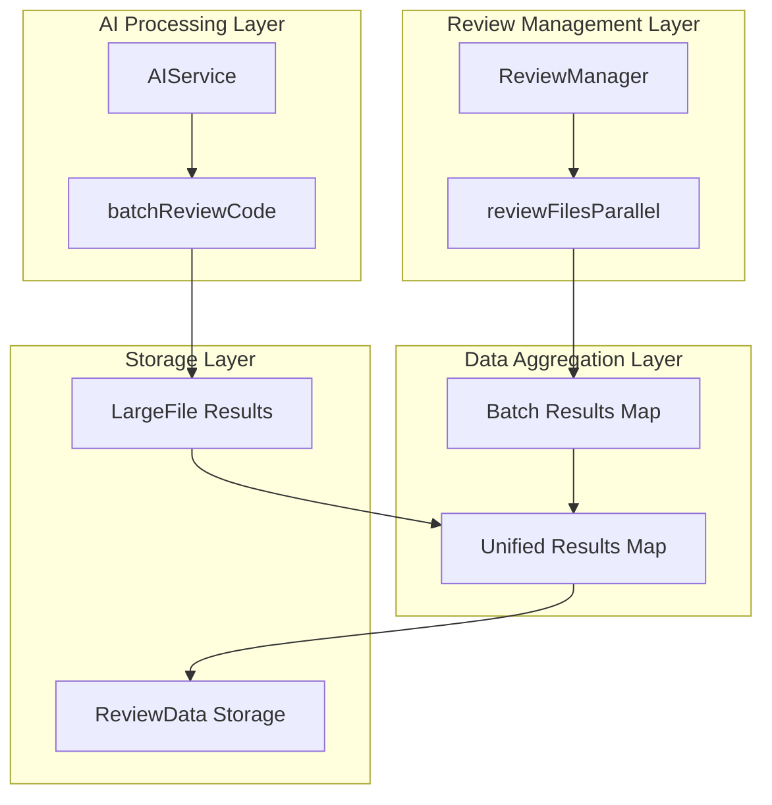

**Diagram sources**
- [reviewManager.ts](file://src/services/review/reviewManager.ts#L329-L370)
- [aiService.ts](file://src/services/ai/aiService.ts#L431-L552)

The architecture demonstrates how the system orchestrates parallel processing through multiple layers, with each layer responsible for specific aspects of result collection and aggregation.

## Core Components

### ReviewManager Parallel Processing

The ReviewManager serves as the primary orchestrator for parallel file processing operations. Its core functionality revolves around dividing workloads into manageable batches and collecting results efficiently.

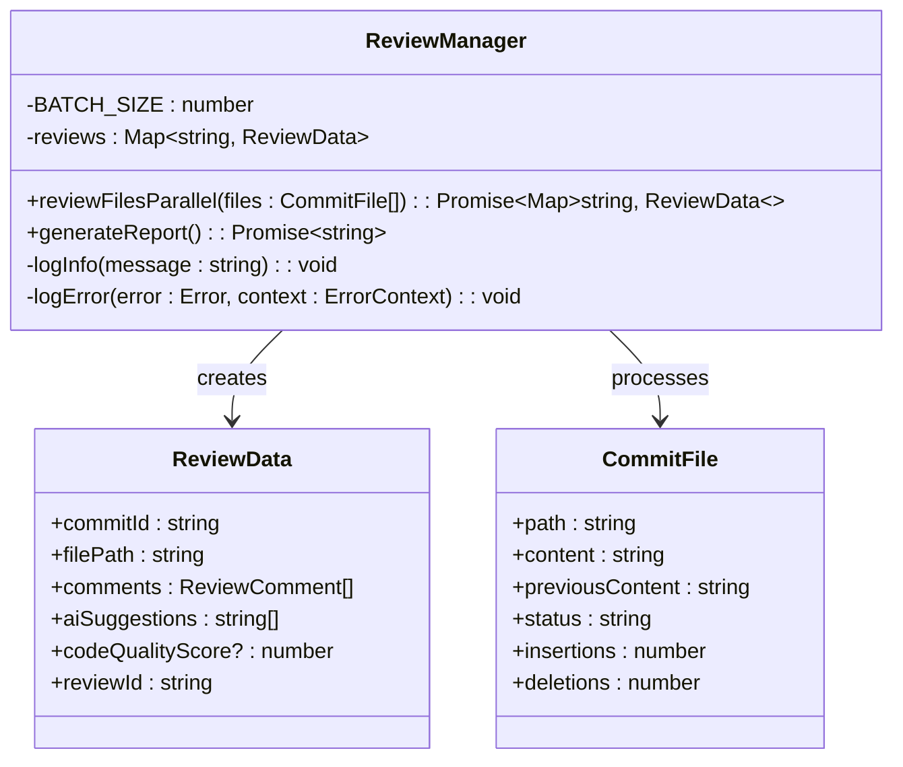

**Diagram sources**
- [reviewManager.ts](file://src/services/review/reviewManager.ts#L79-L93)
- [reviewTypes.ts](file://src/core/review/reviewTypes.ts#L19-L30)

### AIService Batch Processing

The AIService provides specialized batch processing capabilities for AI-driven code analysis, capable of handling both small and large files with intelligent categorization and processing strategies.

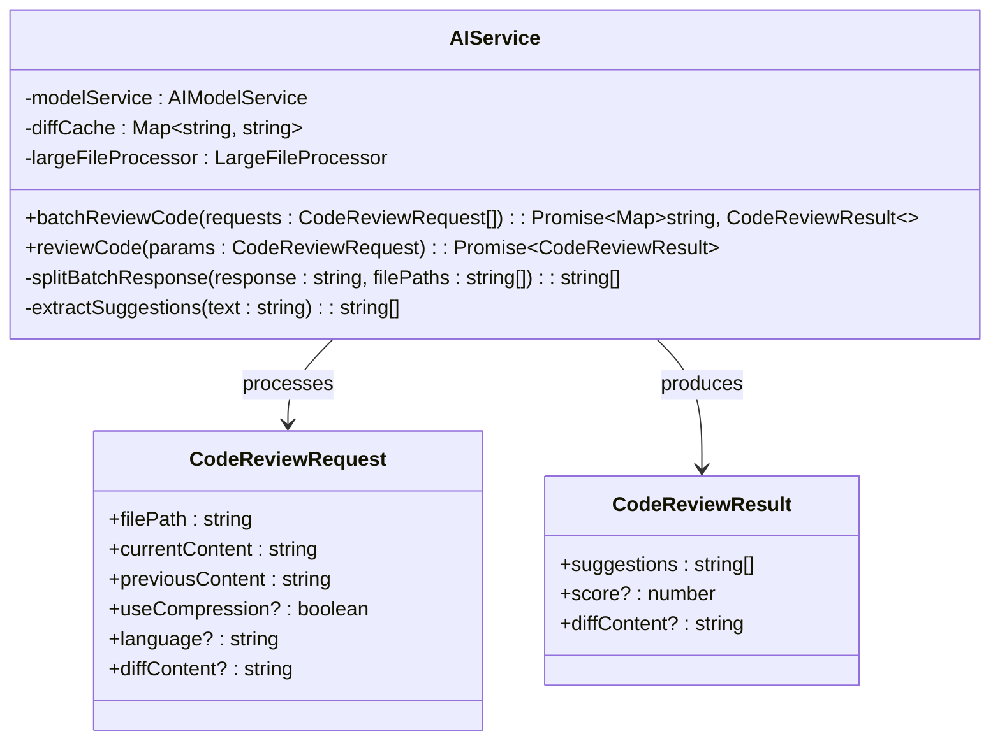

**Diagram sources**
- [aiService.ts](file://src/services/ai/aiService.ts#L15-L32)
- [reviewTypes.ts](file://src/core/review/reviewTypes.ts#L24-L47)

**Section sources**
- [reviewManager.ts](file://src/services/review/reviewManager.ts#L79-L93)
- [aiService.ts](file://src/services/ai/aiService.ts#L40-L70)

## Parallel Batch Processing Pipeline

### Batch Division Strategy

The system employs a strategic approach to dividing workloads into optimal batch sizes for parallel processing:

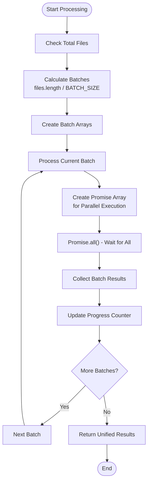

**Diagram sources**
- [reviewManager.ts](file://src/services/review/reviewManager.ts#L338-L369)

### Batch Processing Implementation

The batch processing implementation demonstrates sophisticated error handling and progress tracking mechanisms:

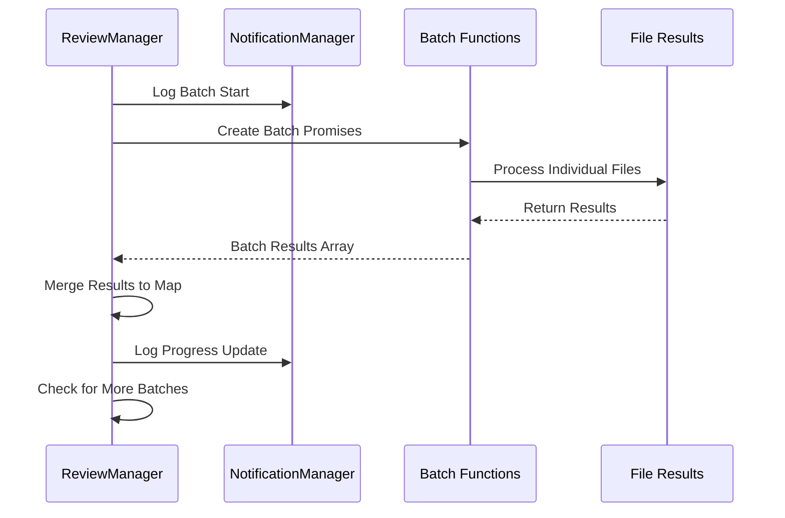

**Diagram sources**
- [reviewManager.ts](file://src/services/review/reviewManager.ts#L347-L367)

**Section sources**
- [reviewManager.ts](file://src/services/review/reviewManager.ts#L329-L370)

## Result Collection and Aggregation

### Map-Based Result Storage

The system utilizes JavaScript's native Map structure for efficient result storage and retrieval:

| Operation | Complexity | Description |
|-----------|------------|-------------|
| Insert (set) | O(1) | Adding individual results to the map |
| Lookup (get) | O(1) | Retrieving results by file path |
| Iteration | O(n) | Processing all results in sequence |
| Size Check | O(1) | Getting the total number of results |

### Result Merging Process

The result merging process follows a systematic approach to ensure data integrity:

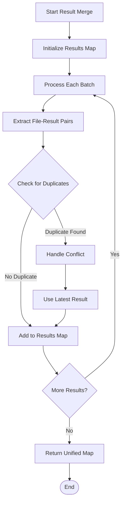

**Diagram sources**
- [reviewManager.ts](file://src/services/review/reviewManager.ts#L363-L366)
- [aiService.ts](file://src/services/ai/aiService.ts#L462-L466)

### Batch Result Processing

The AIService implements sophisticated batch result processing with intelligent categorization:

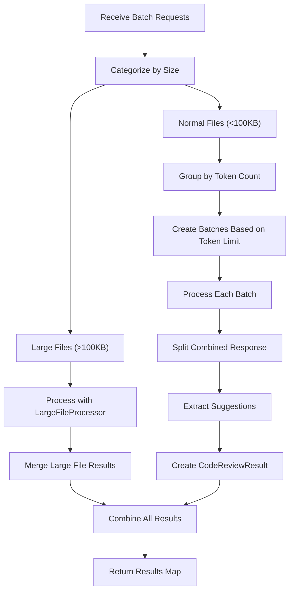

**Diagram sources**
- [aiService.ts](file://src/services/ai/aiService.ts#L431-L552)

**Section sources**
- [reviewManager.ts](file://src/services/review/reviewManager.ts#L329-L370)
- [aiService.ts](file://src/services/ai/aiService.ts#L431-L552)

## Domain Model and Data Integrity

### ReviewData Structure

The ReviewData interface defines the core domain model for storing review results:

| Field | Type | Purpose | Constraints |
|-------|------|---------|-------------|
| commitId | string | Reference to Git commit | Required for Git-based reviews |
| filePath | string | Target file path | Unique within review session |
| comments | ReviewComment[] | User comments | Empty array if no comments |
| aiSuggestions | string[] | AI-generated suggestions | Empty array if no suggestions |
| codeQualityScore | number | Quality assessment (1-10) | Optional, calculated or manual |
| reviewId | string | Unique review identifier | Generated automatically |

### Data Consistency Mechanisms

The system implements several mechanisms to ensure data consistency:

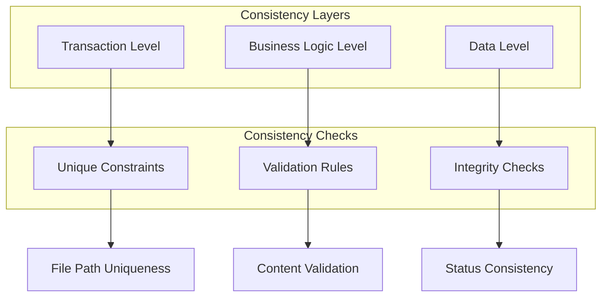

**Diagram sources**
- [reviewTypes.ts](file://src/core/review/reviewTypes.ts#L19-L30)

### Error Handling and Recovery

The system implements comprehensive error handling to maintain data integrity:

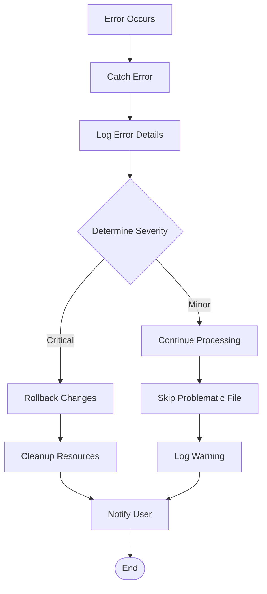

**Section sources**
- [reviewTypes.ts](file://src/core/review/reviewTypes.ts#L19-L30)
- [reviewManager.ts](file://src/services/review/reviewManager.ts#L101-L109)

## Invocation Relationships

### ReviewManager to AIService Relationship

The invocation relationship between ReviewManager and AIService demonstrates the coordinated effort in result aggregation:

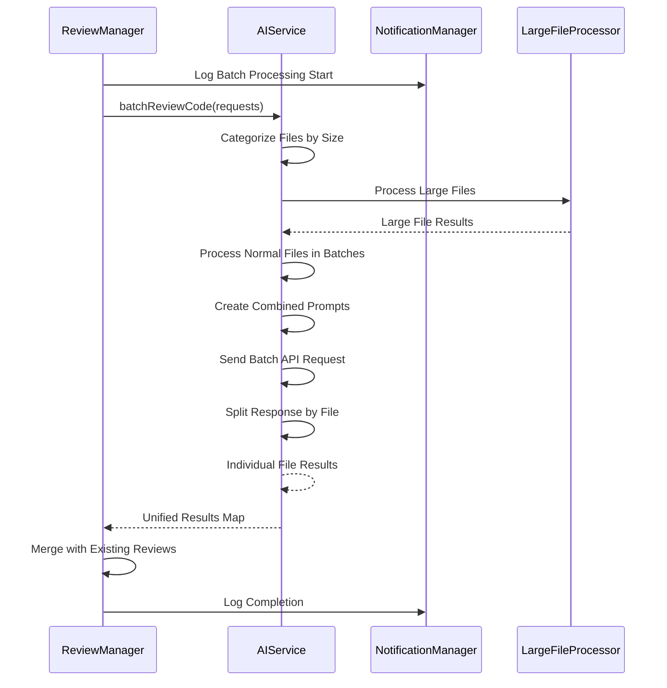

**Diagram sources**
- [reviewManager.ts](file://src/services/review/reviewManager.ts#L477-L478)
- [aiService.ts](file://src/services/ai/aiService.ts#L431-L552)

### Method Call Chain Analysis

The method call chain reveals the structured approach to result aggregation:

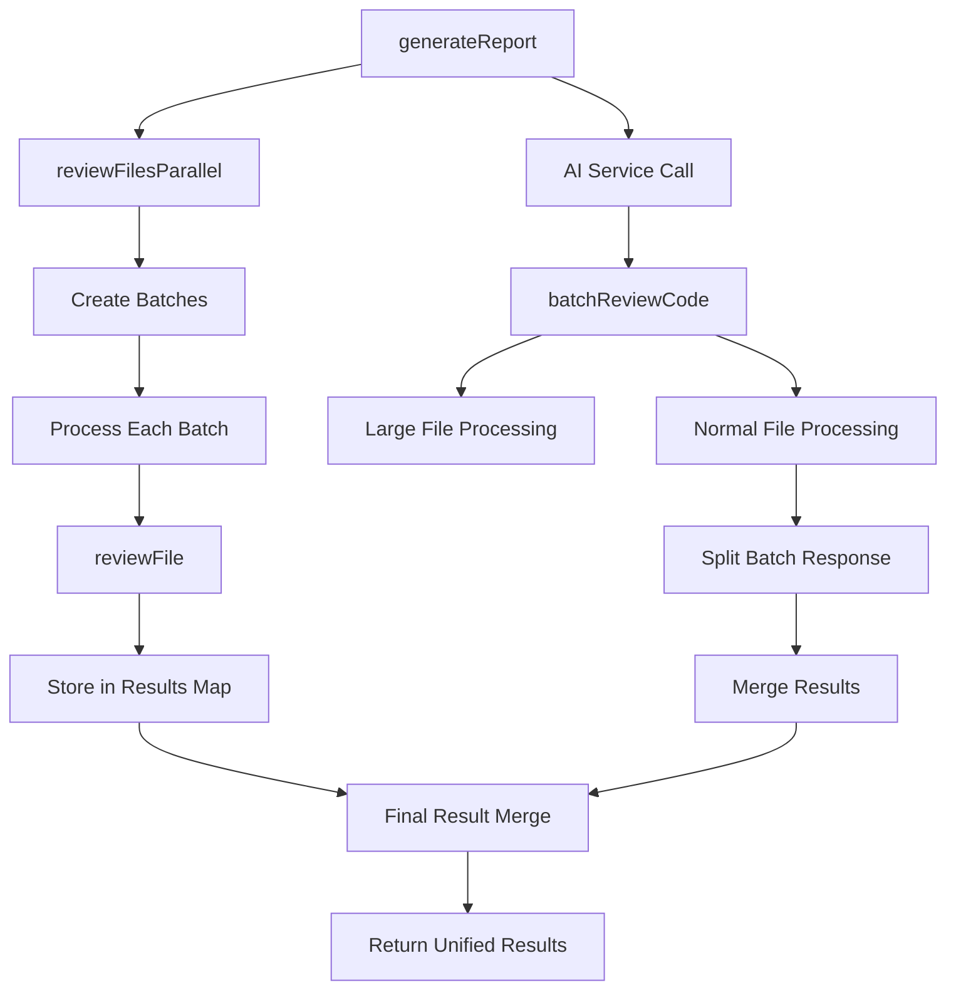

**Diagram sources**
- [reviewManager.ts](file://src/services/review/reviewManager.ts#L477-L478)
- [reviewManager.ts](file://src/services/review/reviewManager.ts#L329-L370)

**Section sources**
- [reviewManager.ts](file://src/services/review/reviewManager.ts#L477-L478)
- [aiService.ts](file://src/services/ai/aiService.ts#L431-L552)

## Common Issues and Solutions

### Duplicate File Handling

**Problem**: Multiple batches attempting to process the same file simultaneously can lead to conflicts.

**Solution**: The system implements a conflict resolution strategy:

```typescript
// Example conflict resolution logic (conceptual)
if (results.has(filePath)) {
    // Use the latest result to ensure consistency
    const existingResult = results.get(filePath);
    if (existingResult.timestamp < newResult.timestamp) {
        results.set(filePath, newResult);
    }
} else {
    results.set(filePath, newResult);
}
```

### Data Consistency Issues

**Problem**: Inconsistent data states during concurrent processing operations.

**Solution**: Implement atomic operations and transaction-like patterns:

```typescript
// Atomic result addition pattern
try {
    // Begin transaction-like operation
    const result = await processFile(file);
    results.set(file.path, result);
    // Commit operation
} catch (error) {
    // Rollback or skip operation
    logger.error(`Failed to process ${file.path}: ${error}`);
}
```

### Memory Management

**Problem**: Large batch sizes can consume excessive memory.

**Solution**: Implement memory-aware batching strategies:

```typescript
// Memory-aware batch sizing
const calculateOptimalBatchSize = (totalFiles: number, memoryLimit: number): number => {
    const averageFileSize = 5000; // bytes
    const bufferFactor = 1.2;
    
    const maxFilesPerBatch = Math.floor(
        (memoryLimit * bufferFactor) / averageFileSize
    );
    
    return Math.min(maxFilesPerBatch, ReviewManager.BATCH_SIZE);
};
```

### Error Propagation

**Problem**: Errors in individual batch processing affecting overall results.

**Solution**: Implement robust error isolation:

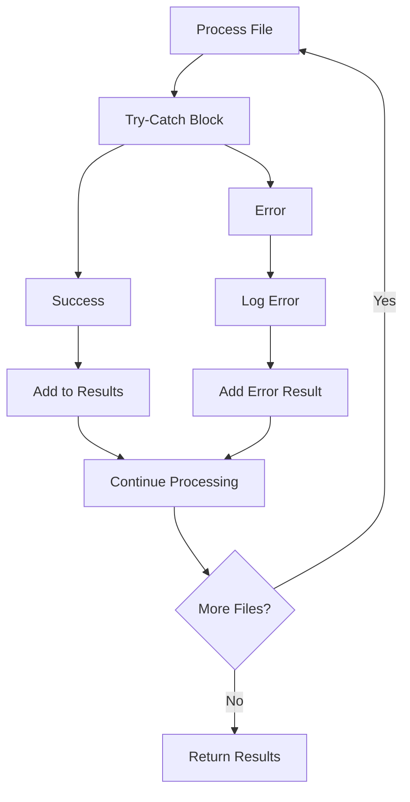

**Section sources**
- [reviewManager.ts](file://src/services/review/reviewManager.ts#L329-L370)
- [aiService.ts](file://src/services/ai/aiService.ts#L431-L552)

## Performance Considerations

### Batch Size Optimization

The system uses a configurable batch size to balance throughput and resource utilization:

| Batch Size | Throughput | Memory Usage | Latency |
|------------|------------|--------------|---------|
| 3 files | Low | Minimal | High |
| 5 files | Medium | Moderate | Medium |
| 10 files | High | High | Low |
| 20 files | Very High | Very High | Very Low |

### Concurrent Processing Limits

The system implements intelligent concurrency controls to prevent resource exhaustion:

```typescript
// Concurrency control implementation
const MAX_CONCURRENT_OPERATIONS = 5;
const semaphore = new Semaphore(MAX_CONCURRENT_OPERATIONS);

const processWithLimits = async (file: CommitFile) => {
    await semaphore.acquire();
    try {
        return await processFile(file);
    } finally {
        semaphore.release();
    }
};
```

### Memory Management Strategies

Efficient memory management is crucial for large-scale operations:

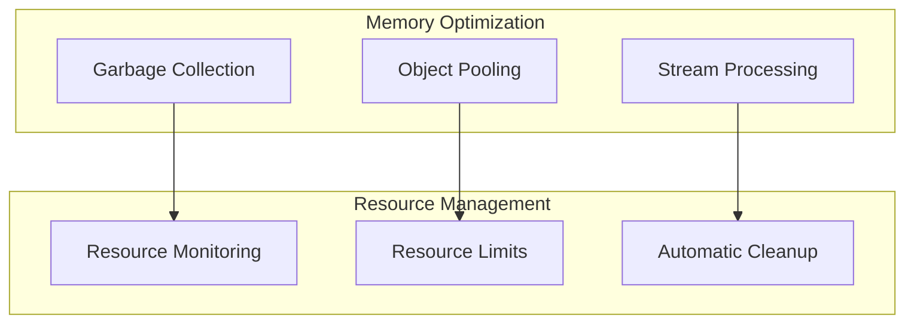

**Section sources**
- [reviewManager.ts](file://src/services/review/reviewManager.ts#L80-L81)
- [aiService.ts](file://src/services/ai/aiService.ts#L444-L447)

## Troubleshooting Guide

### Common Error Scenarios

**Issue**: Batch processing timeouts

**Diagnosis**: Check network connectivity and API rate limits
```typescript
// Timeout detection and handling
const timeout = setTimeout(() => {
    throw new Error('Batch processing timeout');
}, 300000); // 5 minutes

try {
    const results = await batchReviewCode(requests);
    clearTimeout(timeout);
    return results;
} catch (error) {
    clearTimeout(timeout);
    throw error;
}
```

**Issue**: Memory exhaustion during large batch processing

**Solution**: Implement chunked processing
```typescript
// Chunked processing implementation
const processInChunks = async (files: CommitFile[], chunkSize: number) => {
    const chunks = [];
    for (let i = 0; i < files.length; i += chunkSize) {
        chunks.push(files.slice(i, i + chunkSize));
    }
    
    const results = new Map();
    for (const chunk of chunks) {
        const chunkResults = await processChunk(chunk);
        chunkResults.forEach((value, key) => results.set(key, value));
    }
    
    return results;
};
```

### Debugging Techniques

**Logging Strategy**: Implement comprehensive logging for debugging
```typescript
// Structured logging for debugging
const logBatchProcessing = (batchIndex: number, fileCount: number, results: Map<string, any>) => {
    logger.info({
        batch: batchIndex,
        filesProcessed: fileCount,
        resultsCount: results.size,
        timestamp: new Date().toISOString()
    });
};
```

**Performance Profiling**: Monitor performance metrics
```typescript
// Performance monitoring
const measurePerformance = async (operation: string, fn: () => Promise<any>) => {
    const start = performance.now();
    try {
        const result = await fn();
        const duration = performance.now() - start;
        logger.info(`${operation} completed in ${duration}ms`);
        return result;
    } catch (error) {
        const duration = performance.now() - start;
        logger.error(`${operation} failed after ${duration}ms: ${error}`);
        throw error;
    }
};
```

**Section sources**
- [reviewManager.ts](file://src/services/review/reviewManager.ts#L329-L370)
- [aiService.ts](file://src/services/ai/aiService.ts#L431-L552)

## Best Practices

### Result Aggregation Patterns

**Pattern 1: Incremental Result Building**
```typescript
// Recommended: Build results incrementally
const results = new Map<string, ReviewData>();
for (const batch of batches) {
    const batchResults = await processBatch(batch);
    batchResults.forEach((result, filePath) => {
        results.set(filePath, result);
    });
}
return results;
```

**Pattern 2: Error Isolation**
```typescript
// Recommended: Isolate errors in batch processing
const processBatchWithErrorHandling = async (batch: CommitFile[]) => {
    const results = new Map<string, ReviewData>();
    const errors = new Map<string, Error>();
    
    await Promise.allSettled(
        batch.map(async (file) => {
            try {
                const result = await processFile(file);
                results.set(file.path, result);
            } catch (error) {
                errors.set(file.path, error as Error);
            }
        })
    );
    
    return { results, errors };
};
```

### Data Integrity Practices

**Practice 1: Immutable Result Objects**
```typescript
// Create immutable result objects
const createImmutableResult = (data: ReviewData): Readonly<ReviewData> => {
    return Object.freeze(data);
};
```

**Practice 2: Validation Before Storage**
```typescript
// Validate results before storage
const validateResult = (result: ReviewData): boolean => {
    return result.filePath !== undefined &&
           result.commitId !== undefined &&
           Array.isArray(result.comments) &&
           Array.isArray(result.aiSuggestions);
};
```

### Performance Optimization

**Strategy 1: Lazy Loading**
```typescript
// Lazy loading for large result sets
class LazyResultMap {
    private results = new Map<string, ReviewData>();
    private loaders = new Map<string, Promise<ReviewData>>();
    
    async get(filePath: string): Promise<ReviewData> {
        if (!this.results.has(filePath) && !this.loaders.has(filePath)) {
            this.loaders.set(filePath, this.loadFile(filePath));
        }
        
        return this.results.get(filePath) || 
               await this.loaders.get(filePath)!;
    }
}
```

**Strategy 2: Result Caching**
```typescript
// Intelligent result caching
const cache = new Map<string, ReviewData>();
const getCachedResult = (filePath: string, loader: () => Promise<ReviewData>) => {
    if (!cache.has(filePath)) {
        cache.set(filePath, loader());
    }
    return cache.get(filePath);
};
```

### Error Handling Guidelines

**Guideline 1: Comprehensive Error Logging**
```typescript
// Comprehensive error logging
const logErrorWithContext = (error: Error, context: string, file?: string) => {
    logger.error({
        error: error.message,
        stack: error.stack,
        context,
        file,
        timestamp: new Date().toISOString()
    });
};
```

**Guideline 2: Graceful Degradation**
```typescript
// Graceful degradation strategy
const processWithFallback = async (
    primaryFn: () => Promise<any>,
    fallbackFn: () => Promise<any>
) => {
    try {
        return await primaryFn();
    } catch (primaryError) {
        logger.warn('Primary processing failed, trying fallback:', primaryError);
        try {
            return await fallbackFn();
        } catch (fallbackError) {
            logger.error('Both primary and fallback failed:', fallbackError);
            throw primaryError; // Prefer original error
        }
    }
};
```

These best practices ensure reliable, efficient, and maintainable result aggregation throughout the CodeKarmic system.