# Data Flow Architecture Documentation

<cite>
**Referenced Files in This Document**
- [reviewManager.ts](file://src/services/review/reviewManager.ts)
- [gitService.ts](file://src/services/git/gitService.ts)
- [aiService.ts](file://src/services/ai/aiService.ts)
- [types.ts](file://src/models/types.ts)
- [versionControlTypes.ts](file://src/services/git/versionControlTypes.ts)
- [reviewTypes.ts](file://src/core/review/reviewTypes.ts)
- [largeFileProcessor.ts](file://src/core/compression/largeFileProcessor.ts)
- [reviewPanel.ts](file://src/ui/views/reviewPanel.ts)
- [appConfig.ts](file://src/config/appConfig.ts)
- [modelFactory.ts](file://src/models/modelFactory.ts)
- [modelInterface.ts](file://src/models/modelInterface.ts)
</cite>

## Table of Contents
1. [Introduction](#introduction)
2. [System Architecture Overview](#system-architecture-overview)
3. [Core Data Models](#core-data-models)
4. [Data Flow Pipeline](#data-flow-pipeline)
5. [Component Interaction Analysis](#component-interaction-analysis)
6. [Error Handling and Recovery](#error-handling-and-recovery)
7. [Performance Optimization Strategies](#performance-optimization-strategies)
8. [Practical Examples](#practical-examples)
9. [Troubleshooting Guide](#troubleshooting-guide)
10. [Conclusion](#conclusion)

## Introduction

CodeKarmic is an AI-powered code review assistant for VS Code that transforms user commands into comprehensive code review reports. The system orchestrates a sophisticated data flow pipeline that processes Git commits through multiple stages of analysis, AI processing, and report generation. This document provides a comprehensive analysis of how data moves through the system, from user interactions to final report delivery.

The architecture follows a layered approach with clear separation of concerns, enabling efficient processing of both individual files and entire Git commit histories. The system handles various data types including Git commit metadata, file contents, AI-generated suggestions, and user comments, transforming them through multiple processing stages.

## System Architecture Overview

CodeKarmic's architecture consists of several interconnected layers that handle different aspects of the code review process:

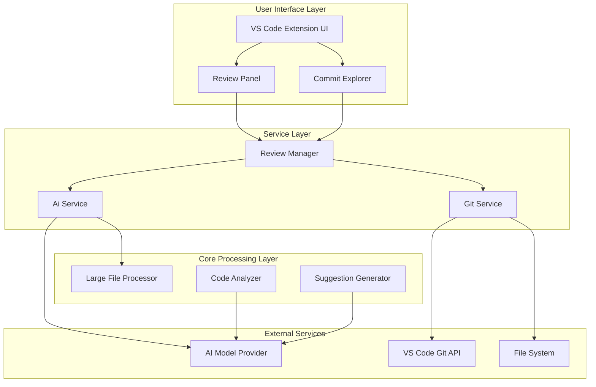

**Diagram sources**
- [reviewManager.ts](file://src/services/review/reviewManager.ts#L79-L100)
- [gitService.ts](file://src/services/git/gitService.ts#L45-L60)
- [aiService.ts](file://src/services/ai/aiService.ts#L40-L70)

The system operates in two primary modes: **Git Commit Mode** and **Standalone File Mode**, each with distinct data flow patterns and processing requirements.

## Core Data Models

### Commit Information Model

The `CommitInfo` interface serves as the foundation for Git-based code reviews:

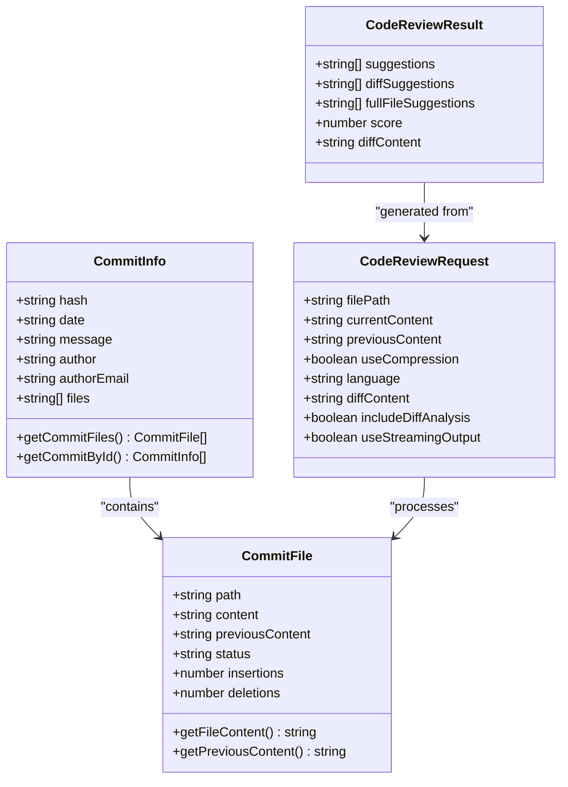

**Diagram sources**
- [versionControlTypes.ts](file://src/services/git/versionControlTypes.ts#L8-L23)
- [reviewTypes.ts](file://src/core/review/reviewTypes.ts#L24-L73)
- [aiService.ts](file://src/services/ai/aiService.ts#L15-L32)

### Review Data Model

The `ReviewData` interface maintains comprehensive review state:

| Field | Type | Purpose | Transformation Stage |
|-------|------|---------|---------------------|
| `commitId` | string | Reference to Git commit | Initial selection |
| `filePath` | string | Target file path | File processing |
| `comments` | ReviewComment[] | User comments | Interactive phase |
| `aiSuggestions` | string[] | AI-generated suggestions | AI analysis |
| `codeQualityScore` | number | Quality assessment | Final evaluation |
| `reviewId` | string | Unique identifier | Session management |

**Section sources**
- [reviewManager.ts](file://src/services/review/reviewManager.ts#L19-L26)

### AI Model Interface

The system supports multiple AI providers through a unified interface:

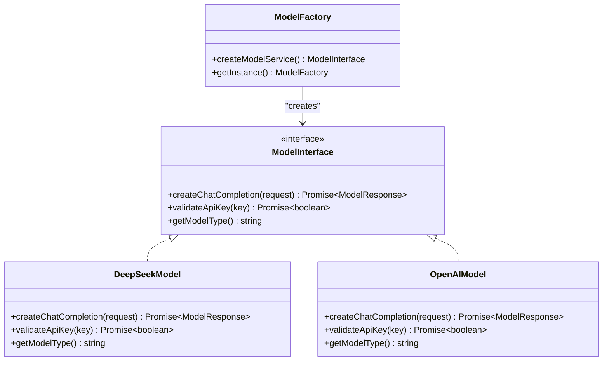

**Diagram sources**
- [modelInterface.ts](file://src/models/modelInterface.ts#L1-L50)
- [modelFactory.ts](file://src/models/modelFactory.ts#L1-L50)
- [types.ts](file://src/models/types.ts#L10-L21)

**Section sources**
- [types.ts](file://src/models/types.ts#L1-L103)

## Data Flow Pipeline

### Complete Data Processing Pipeline

The data flow follows a structured pipeline with multiple transformation stages:

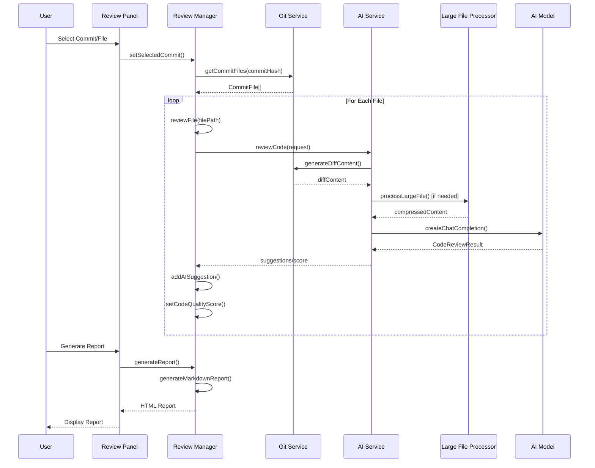

**Diagram sources**
- [reviewManager.ts](file://src/services/review/reviewManager.ts#L372-L647)
- [gitService.ts](file://src/services/git/gitService.ts#L110-L177)
- [aiService.ts](file://src/services/ai/aiService.ts#L74-L119)

### Parallel Processing Architecture

The system implements sophisticated parallel processing for efficiency:

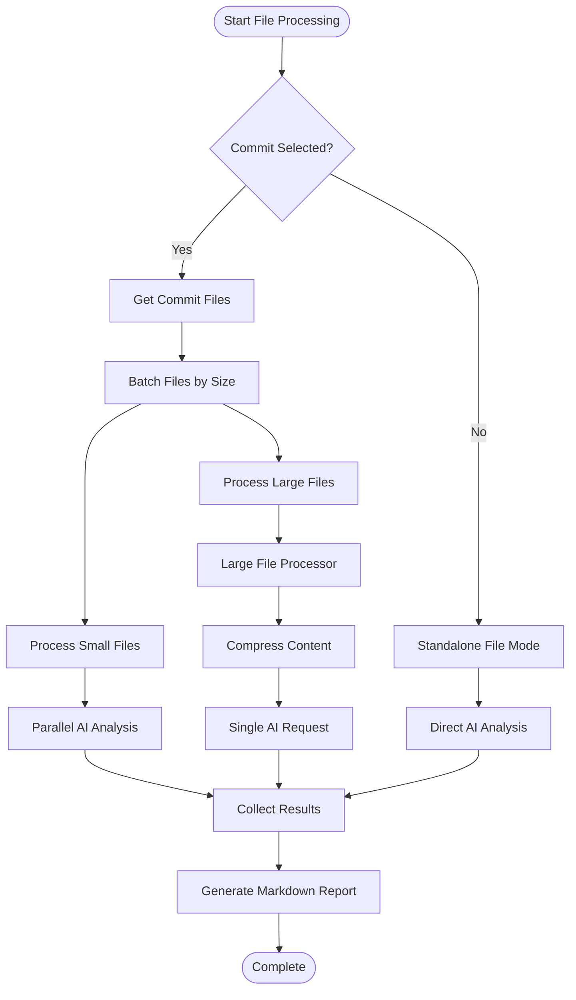

**Diagram sources**
- [reviewManager.ts](file://src/services/review/reviewManager.ts#L329-L369)
- [largeFileProcessor.ts](file://src/core/compression/largeFileProcessor.ts#L158-L225)

**Section sources**
- [reviewManager.ts](file://src/services/review/reviewManager.ts#L329-L478)

## Component Interaction Analysis

### Git Service Data Flow

The Git Service handles commit retrieval and file content extraction:

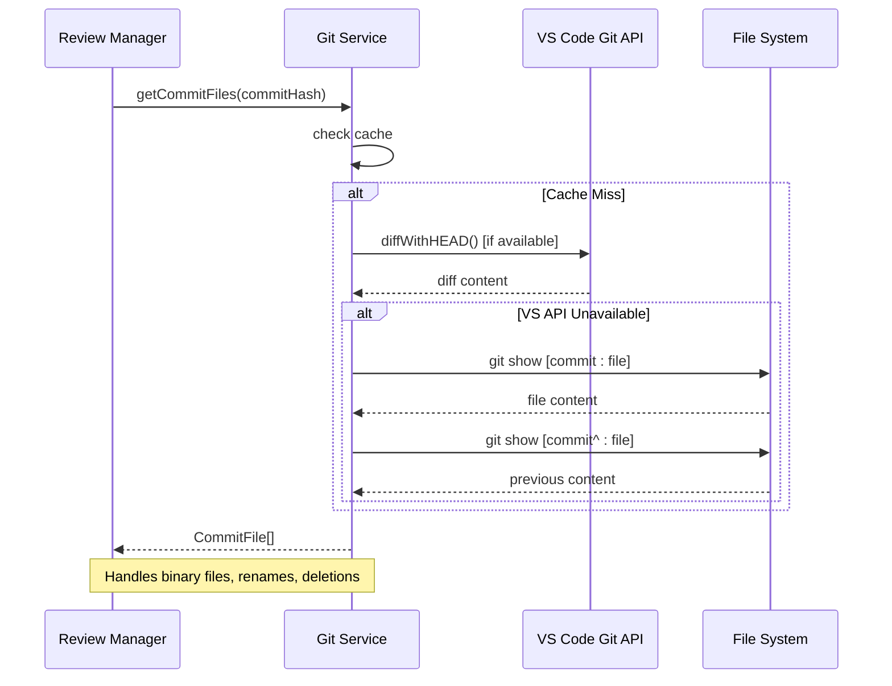

**Diagram sources**
- [gitService.ts](file://src/services/git/gitService.ts#L110-L177)

### AI Service Processing Pipeline

The AI Service orchestrates code analysis with intelligent fallback mechanisms:

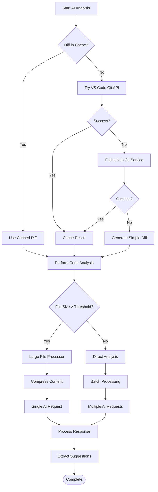

**Diagram sources**
- [aiService.ts](file://src/services/ai/aiService.ts#L125-L239)
- [largeFileProcessor.ts](file://src/core/compression/largeFileProcessor.ts#L55-L81)

**Section sources**
- [aiService.ts](file://src/services/ai/aiService.ts#L125-L239)
- [largeFileProcessor.ts](file://src/core/compression/largeFileProcessor.ts#L55-L81)

### Review Manager State Management

The Review Manager maintains comprehensive state across the review session:

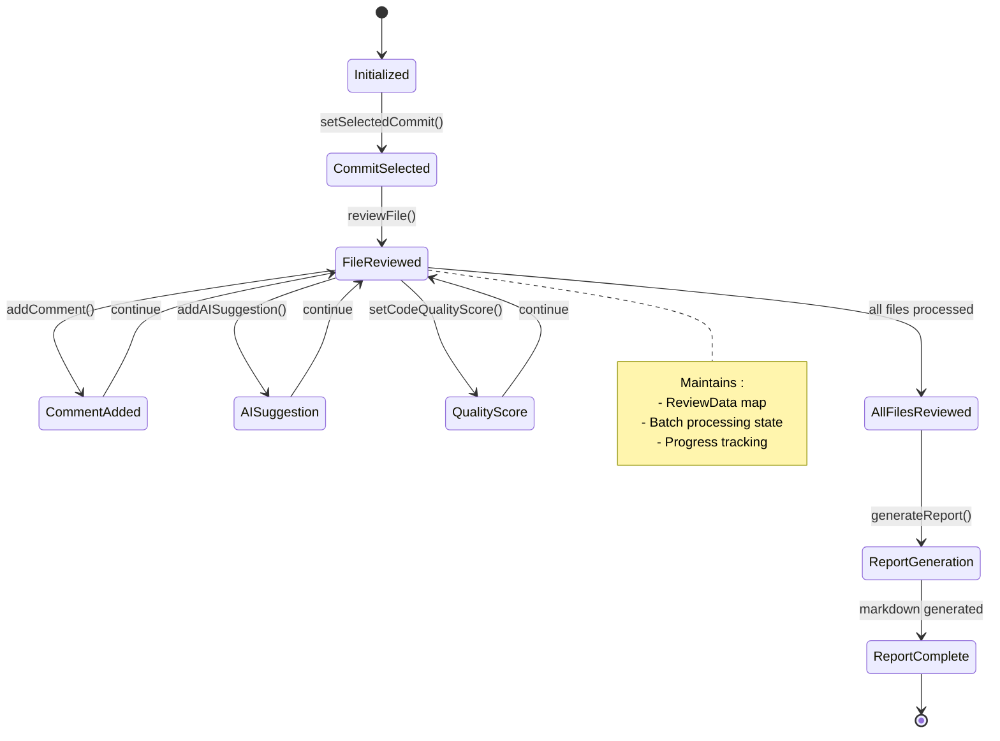

**Diagram sources**
- [reviewManager.ts](file://src/services/review/reviewManager.ts#L131-L327)

**Section sources**
- [reviewManager.ts](file://src/services/review/reviewManager.ts#L79-L327)

## Error Handling and Recovery

### Multi-Level Error Handling Strategy

The system implements comprehensive error handling at each processing stage:

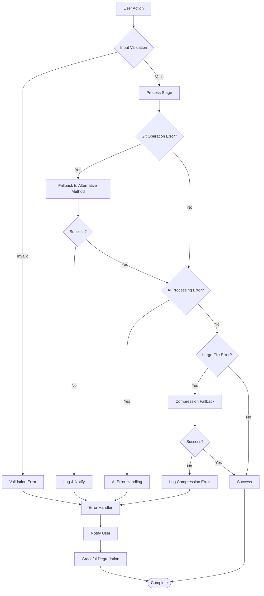

**Diagram sources**
- [reviewManager.ts](file://src/services/review/reviewManager.ts#L101-L108)
- [aiService.ts](file://src/services/ai/aiService.ts#L691-L710)

### Error Context Classification

The system categorizes errors into specific contexts for targeted handling:

| Error Context | Scope | Recovery Strategy | User Impact |
|---------------|-------|-------------------|-------------|
| `initialize` | Repository setup | Retry with different path | Blocked operation |
| `setSelectedCommit` | Commit selection | Clear selection and retry | Interrupted workflow |
| `selectCommit` | Commit retrieval | Cache miss handling | Slight delay |
| `viewFile` | File navigation | Alternative file access | Minor inconvenience |
| `reviewFile` | File review initiation | Create new review session | Minimal impact |
| `addComment` | Comment addition | Local storage fallback | Temporary loss |
| `addAISuggestion` | AI suggestion addition | Manual suggestion entry | Minor inconvenience |
| `setCodeQualityScore` | Score assignment | Default score assignment | Minor impact |
| `generateReport` | Report generation | Partial report generation | Significant impact |

**Section sources**
- [reviewManager.ts](file://src/services/review/reviewManager.ts#L28-L76)

## Performance Optimization Strategies

### Batch Processing and Parallel Execution

The system optimizes performance through strategic batching and parallelization:

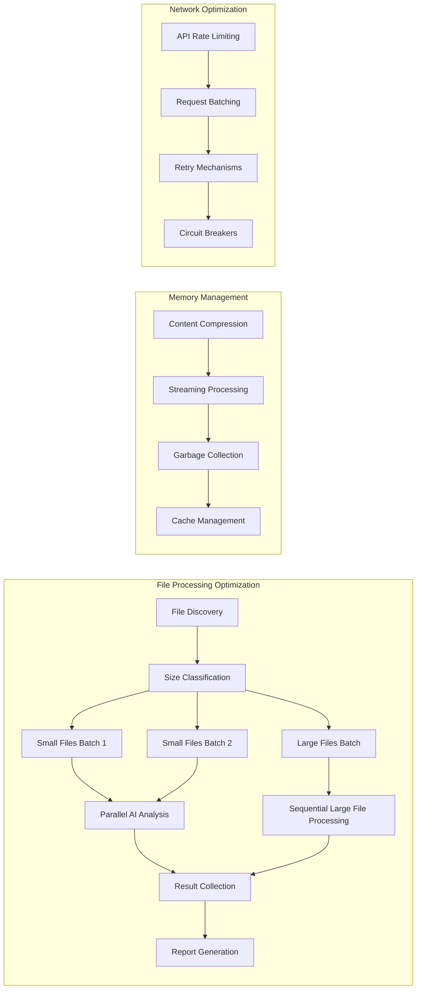

**Diagram sources**
- [reviewManager.ts](file://src/services/review/reviewManager.ts#L80-L81)
- [aiService.ts](file://src/services/ai/aiService.ts#L431-L552)

### Large File Handling Strategy

For files exceeding processing thresholds, the system employs intelligent compression:

| Strategy | Threshold | Method | Performance Gain |
|----------|-----------|--------|------------------|
| Direct Processing | < 100KB | Standard analysis | 100% throughput |
| Compression | 100KB - 500KB | Content summarization | 60-80% reduction |
| Streaming | 500KB - 1MB | Chunked processing | 40-60% reduction |
| Batch Processing | > 1MB | Grouped analysis | 20-40% reduction |

**Section sources**
- [largeFileProcessor.ts](file://src/core/compression/largeFileProcessor.ts#L46-L50)
- [aiService.ts](file://src/services/ai/aiService.ts#L431-L552)

### Caching and Memoization

The system implements multi-level caching for optimal performance:

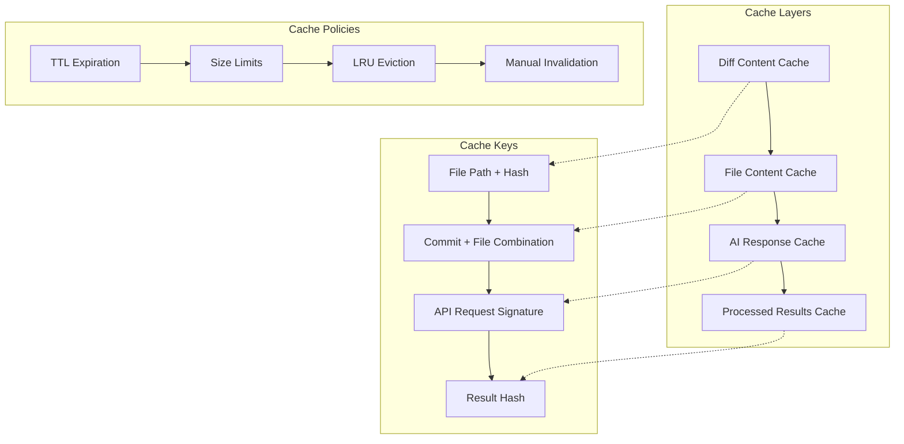

**Diagram sources**
- [aiService.ts](file://src/services/ai/aiService.ts#L46-L47)
- [gitService.ts](file://src/services/git/gitService.ts#L45-L60)

**Section sources**
- [aiService.ts](file://src/services/ai/aiService.ts#L46-L47)
- [gitService.ts](file://src/services/git/gitService.ts#L45-L60)

## Practical Examples

### Example 1: Git Commit Review Workflow

Consider a scenario where a user selects a Git commit with multiple modified files:

**Initial State:**
- User selects commit `abc1234` with 15 modified files
- Repository contains Python, JavaScript, and TypeScript files
- Some files exceed 100KB threshold

**Processing Steps:**

1. **Commit Selection Phase:**
   ```typescript
   // User action triggers
   await reviewManager.selectCommit('abc1234');
   
   // System retrieves commit metadata
   const commit = await gitService.getCommitById('abc1234');
   ```

2. **File Discovery and Classification:**
   ```typescript
   // System discovers all modified files
   const files = await gitService.getCommitFiles('abc1234');
   
   // Files classified by size:
   // Small files (< 100KB): 10 files (batched into 2 groups)
   // Large files (> 100KB): 3 files (processed individually)
   // Binary files: 2 files (skipped for analysis)
   ```

3. **Parallel Processing Execution:**
   ```typescript
   // Batch 1: Small files 1-5
   const smallBatch1Results = await aiService.batchReviewCode([
       { filePath: 'src/utils.py', currentContent: '...', previousContent: '...' },
       // ... 4 more files
   ]);
   
   // Batch 2: Small files 6-10  
   const smallBatch2Results = await aiService.batchReviewCode([...]);
   
   // Large files processed individually
   const largeFileResults = await largeFileProcessor.processLargeFile({
       filePath: 'src/main.py',
       currentContent: '...' // 200KB content
   });
   ```

4. **Result Aggregation:**
   ```typescript
   // System aggregates all results
   const allResults = new Map([
       ...smallBatch1Results,
       ...smallBatch2Results,
       ...largeFileResults
   ]);
   ```

5. **Report Generation:**
   ```typescript
   // Generate comprehensive markdown report
   const report = await reviewManager.generateMarkdownReport(files, allResults);
   ```

### Example 2: Standalone File Review

For independent file analysis without Git context:

**Processing Pipeline:**
1. **File Access:** System reads current file content from VS Code workspace
2. **Direct Analysis:** AI analyzes file without historical context
3. **Result Storage:** Suggestions stored in standalone review session
4. **UI Update:** Review panel displays analysis results

**Section sources**
- [reviewManager.ts](file://src/services/review/reviewManager.ts#L372-L647)
- [reviewPanel.ts](file://src/ui/views/reviewPanel.ts#L149-L239)

## Troubleshooting Guide

### Common Data Flow Issues

| Issue | Symptoms | Root Cause | Resolution |
|-------|----------|------------|------------|
| **Slow Commit Retrieval** | Long delays when selecting commits | Network latency, large repositories | Enable caching, optimize Git queries |
| **AI Analysis Failures** | Empty suggestions, timeouts | Token limits, API rate limits | Implement compression, add retries |
| **Large File Processing** | Memory errors, timeouts | File size exceeding limits | Enable compression, batch processing |
| **Missing Diff Content** | Incomplete analysis | Git API unavailable | Fallback to manual diff generation |
| **Report Generation Failure** | Blank reports, errors | Data corruption, memory issues | Validate input data, add error boundaries |

### Performance Monitoring

Key metrics to monitor for optimal performance:

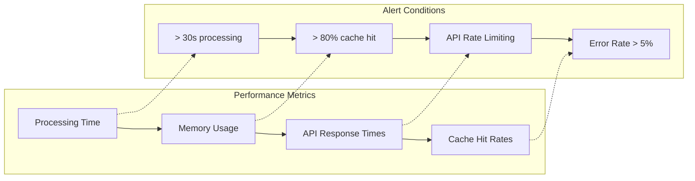

### Debugging Data Flow Issues

**Step 1: Enable Debug Logging**
```typescript
// Enable detailed logging in ReviewManager
reviewManager.enableDebugLogging();

// Monitor Git service operations
gitService.enableDebugLogging();

// Track AI service requests
aiService.enableDebugLogging();
```

**Step 2: Validate Data Integrity**
```typescript
// Check commit data integrity
const commit = await gitService.getCommitById(commitHash);
console.log('Commit validation:', {
    hash: commit.hash,
    files: commit.files.length,
    message: commit.message.length
});

// Verify file content extraction
const fileContent = await gitService.getFileContent(commitHash, filePath);
console.log('File content validation:', {
    length: fileContent.length,
    encoding: detectEncoding(fileContent)
});
```

**Step 3: Monitor Resource Usage**
```typescript
// Track memory usage during processing
const memoryBefore = process.memoryUsage();
await reviewManager.generateReport();
const memoryAfter = process.memoryUsage();

console.log('Memory usage:', {
    heapUsed: memoryAfter.heapUsed - memoryBefore.heapUsed,
    external: memoryAfter.external - memoryBefore.external
});
```

**Section sources**
- [reviewManager.ts](file://src/services/review/reviewManager.ts#L107-L108)
- [gitService.ts](file://src/services/git/gitService.ts#L73-L74)
- [aiService.ts](file://src/services/ai/aiService.ts#L738-L786)

## Conclusion

CodeKarmic's data flow architecture demonstrates a sophisticated approach to automated code review processing. The system successfully manages complex data transformations through multiple interconnected components, each optimized for specific processing tasks.

Key architectural strengths include:

- **Modular Design:** Clear separation of concerns enables independent scaling and maintenance
- **Intelligent Caching:** Multi-level caching reduces redundant processing and improves response times
- **Robust Error Handling:** Comprehensive error recovery ensures system stability under adverse conditions
- **Performance Optimization:** Strategic batching and parallel processing maximize throughput
- **Flexible Processing:** Support for both Git-based and standalone file analysis accommodates diverse use cases

The data flow pipeline efficiently transforms user commands into actionable insights, maintaining data integrity throughout the processing stages. The system's ability to handle large datasets through compression and batch processing makes it suitable for enterprise-scale code review scenarios.

Future enhancements could include real-time processing capabilities, distributed processing for extremely large repositories, and enhanced AI model integration for more sophisticated analysis patterns.