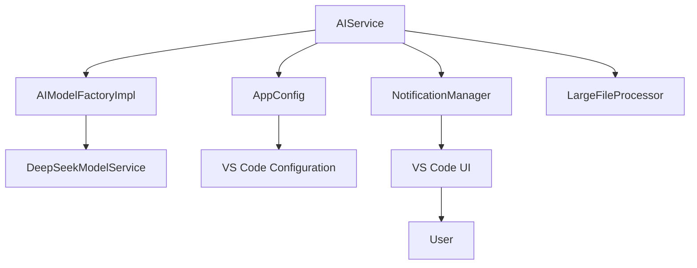
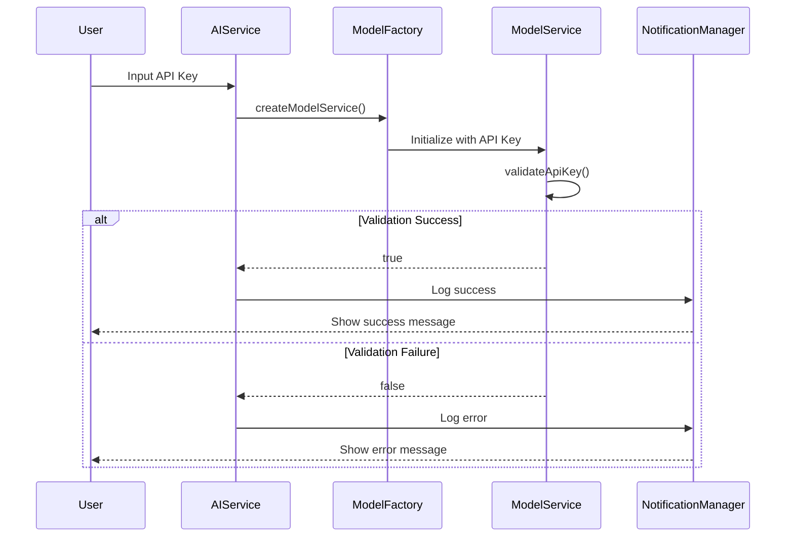
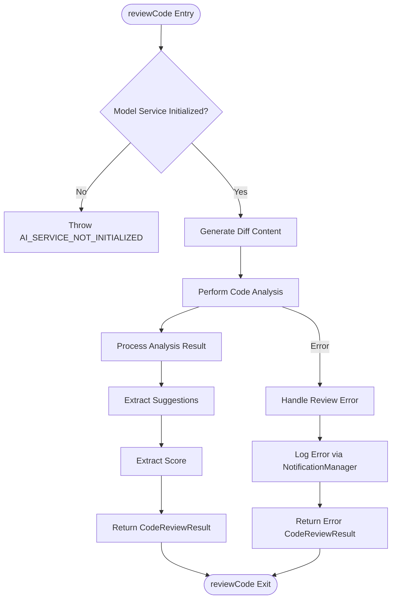
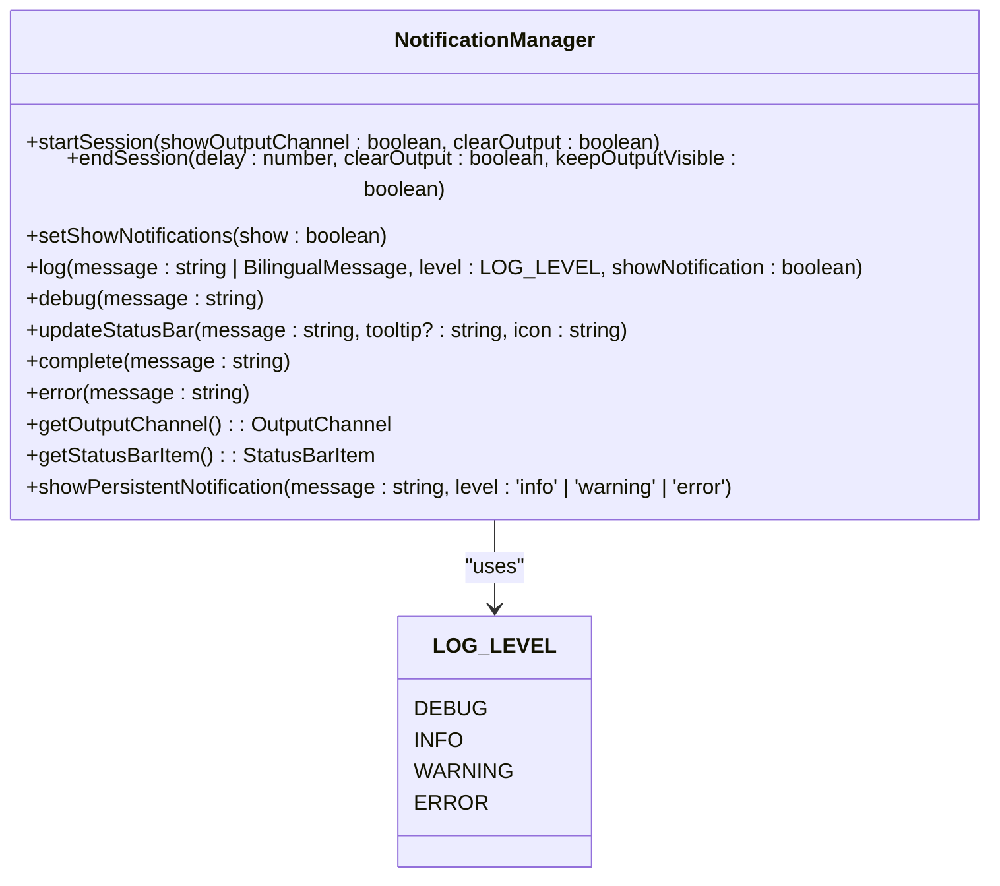
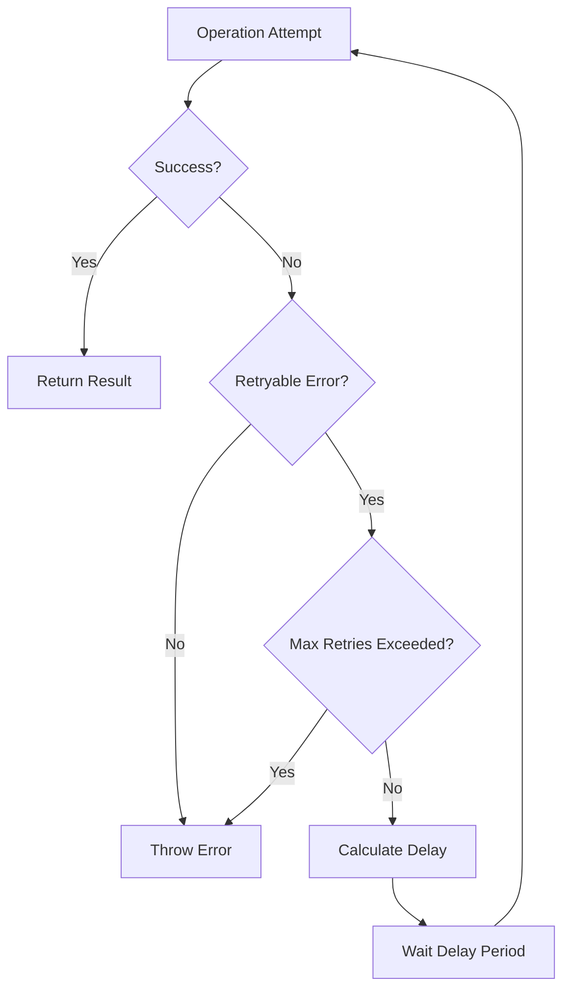

# AI Service Errors

<cite>
**Referenced Files in This Document**   
- [aiService.ts](file://src/services/ai/aiService.ts)
- [notificationManager.ts](file://src/services/notification/notificationManager.ts)
- [reviewManager.ts](file://src/services/review/reviewManager.ts)
- [modelFactory.ts](file://src/models/modelFactory.ts)
- [retryUtils.ts](file://src/utils/retryUtils.ts)
- [appConfig.ts](file://src/config/appConfig.ts)
- [constants.ts](file://src/constants/constants.ts)
</cite>

## Table of Contents
1. [Introduction](#introduction)
2. [Error Handling Architecture](#error-handling-architecture)
3. [API Key Validation](#api-key-validation)
4. [Model Service Creation](#model-service-creation)
5. [Code Analysis Request Processing](#code-analysis-request-processing)
6. [ErrorContext.reviewFile Enum](#errorcontextreviewfile-enum)
7. [Error Logging and User Presentation](#error-logging-and-user-presentation)
8. [Common Error Scenarios](#common-error-scenarios)
9. [Troubleshooting Guide](#troubleshooting-guide)
10. [Retry Mechanisms](#retry-mechanisms)

## Introduction

The CodeKarmic system implements a comprehensive error handling framework for AI service operations, particularly focused on code analysis requests, API key validation, and model service creation. This documentation details the error handling mechanisms, logging strategies, and user notification systems that ensure robust operation even in the face of network issues, authentication failures, and service limitations. The system is designed to provide meaningful feedback to users while maintaining a seamless development experience within the VS Code environment.

## Error Handling Architecture

The AI service error handling in CodeKarmic follows a layered approach with multiple components working together to manage errors effectively. The architecture consists of the AIService class as the primary entry point, which coordinates with the NotificationManager for user feedback, the model factory for service creation, and configuration management for authentication details.

**Diagram sources**
- [aiService.ts](file://src/services/ai/aiService.ts#L40-L787)
- [notificationManager.ts](file://src/services/notification/notificationManager.ts#L8-L213)
- [modelFactory.ts](file://src/models/modelFactory.ts#L19-L140)

**Section sources**
- [aiService.ts](file://src/services/ai/aiService.ts#L40-L787)
- [notificationManager.ts](file://src/services/notification/notificationManager.ts#L8-L213)

## API Key Validation

API key validation in CodeKarmic is implemented through the `validateApiKey` method in the AIService class. This method creates a temporary model service instance to test the provided API key against the configured model provider (currently DeepSeek). The validation process is decoupled from the main service initialization to allow testing of API keys without affecting the current configuration.

The validation flow begins when a user inputs an API key through the extension settings. The AIService calls the model factory to create a model service instance specifically for validation purposes. This ensures that the validation process doesn't interfere with any currently active AI operations. If the validation succeeds, the API key is stored in the application configuration; otherwise, an error is logged and presented to the user.

**Diagram sources**
- [aiService.ts](file://src/services/ai/aiService.ts#L711-L724)
- [modelFactory.ts](file://src/models/modelFactory.ts#L58-L114)

**Section sources**
- [aiService.ts](file://src/services/ai/aiService.ts#L711-L724)
- [modelFactory.ts](file://src/models/modelFactory.ts#L58-L114)

## Model Service Creation

Model service creation in CodeKarmic is managed by the AIModelFactoryImpl class, which implements a factory pattern to instantiate the appropriate AI model service based on the configured model type. The factory creates service instances for DeepSeek models (V3 and R1) and potentially other providers in the future.

The creation process involves several validation steps to ensure the service can be properly initialized. First, the factory checks that a model type is configured. Then it verifies that a base URL is available for the API endpoint. Finally, it attempts to create and initialize the model service with the provided API key. The factory implements caching to avoid recreating service instances unnecessarily, using a cache key that combines the model type and base URL.

When creating a model service, the factory also configures compression settings for handling large files. This includes setting thresholds for when compression should be applied and whether large file compression is enabled. These settings are passed to the model service during initialization to ensure consistent behavior across the application.

**Section sources**
- [modelFactory.ts](file://src/models/modelFactory.ts#L19-L140)
- [appConfig.ts](file://src/config/appConfig.ts#L49-L189)

## Code Analysis Request Processing

The code analysis request processing in CodeKarmic is centered around the `reviewCode` method in the AIService class. This method handles the complete workflow for analyzing code, from initial validation to final result processing. The process begins with checking whether the model service is properly initialized, throwing an error if not.

The review process includes several key steps: generating a diff of code changes (when applicable), performing code analysis, and handling any errors that occur during the process. For files under version control, the system generates a diff between the current and previous versions of the file. This diff is cached to avoid redundant calculations when reviewing the same file multiple times.

The actual code analysis is performed by the `performCodeAnalysis` method, which constructs a comprehensive prompt for the AI model. This prompt includes the file content, programming language, and any relevant diff information. The analysis request is configured with appropriate parameters such as maximum tokens, temperature, and timeout settings to ensure reliable operation.

**Diagram sources**
- [aiService.ts](file://src/services/ai/aiService.ts#L74-L123)
- [aiService.ts](file://src/services/ai/aiService.ts#L260-L411)

**Section sources**
- [aiService.ts](file://src/services/ai/aiService.ts#L74-L411)

## ErrorContext.reviewFile Enum

The ErrorContext.reviewFile enum value is part of the error context system used throughout the CodeKarmic extension to provide contextual information about where errors occur. This enum is defined in the ReviewManager class and specifically identifies when errors occur during the file review process.

The ErrorContext.reviewFile value is used when the system encounters issues while attempting to review a specific file. This could include problems with AI analysis, diff generation, or file access. When an error occurs during file review, the ReviewManager logs the error with this context, allowing users and developers to understand that the issue is specifically related to the code review functionality rather than other parts of the system.

This contextual error information is valuable for both troubleshooting and user communication, as it allows the system to provide more specific guidance based on where in the process the error occurred. For example, if an error occurs during file review, the system can suggest checking the file content, verifying the AI service configuration, or examining network connectivity, rather than providing generic error advice.

**Section sources**
- [reviewManager.ts](file://src/services/review/reviewManager.ts#L28-L38)
- [reviewManager.ts](file://src/services/review/reviewManager.ts#L273-L287)

## Error Logging and User Presentation

Error logging and user presentation in CodeKarmic are managed by the NotificationManager class, which serves as the central hub for all user-facing messages and system logging. This class handles both console logging and VS Code UI notifications, ensuring that users receive appropriate feedback based on the severity of the error.

The NotificationManager implements a tiered notification system with different levels of severity: info, warning, and error. Informational messages are typically logged to the output channel without displaying a popup, while warnings and errors may trigger user notifications depending on the configuration. The system also updates the status bar to provide real-time feedback about the current operation state.

When errors occur during AI service operations, they are logged with detailed information including the error message, file path, model type, and API key configuration status. This comprehensive logging helps users and developers diagnose issues more effectively. The error details are also included in the returned CodeReviewResult object, allowing the UI to display specific error information to the user.

**Diagram sources**
- [notificationManager.ts](file://src/services/notification/notificationManager.ts#L8-L213)
- [constants.ts](file://src/constants/constants.ts#L8-L23)

**Section sources**
- [notificationManager.ts](file://src/services/notification/notificationManager.ts#L8-L213)

## Common Error Scenarios

### Invalid API Keys

Invalid API keys are one of the most common error scenarios in the CodeKarmic system. When an invalid API key is provided, the system detects this during both the validation phase and when attempting to make actual API requests. The error handling for invalid API keys includes specific messaging that guides users to check their key configuration and verify that they have entered the correct credentials.

The system distinguishes between completely missing API keys and invalid ones, providing different error messages for each scenario. For missing keys, users are prompted to configure their API key in the extension settings. For invalid keys, the system suggests re-entering the key and verifying that it has the necessary permissions for the requested operations.

### Network Timeouts

Network timeouts can occur when the AI service takes too long to respond to requests. The CodeKarmic system configures a 3-minute timeout for AI requests, after which the operation is terminated and an error is returned. This prevents the extension from hanging indefinitely when the service is unresponsive.

When a timeout occurs, the system logs a specific error message and suggests that users check their network connection or try again later. The error handling also considers the possibility that the service might be experiencing high load, in which case retrying after a short delay may be successful.

### Rate Limiting

Rate limiting errors occur when the system exceeds the allowed number of requests to the AI service within a given time period. The CodeKarmic system detects rate limiting through specific error messages from the API and responds by informing users that they have reached their usage limit.

The error handling for rate limiting includes suggestions for resolving the issue, such as waiting for the rate limit to reset or upgrading to a plan with higher limits. The system also implements request batching and caching to minimize the number of API calls and reduce the likelihood of hitting rate limits during normal operation.

**Section sources**
- [aiService.ts](file://src/services/ai/aiService.ts#L397-L401)
- [retryUtils.ts](file://src/utils/retryUtils.ts#L95-L107)
- [notificationManager.ts](file://src/services/notification/notificationManager.ts#L107-L116)

## Troubleshooting Guide

### Authentication Issues

Authentication issues in CodeKarmic typically stem from incorrect API key configuration or network connectivity problems. To troubleshoot authentication issues, users should first verify that their API key is correctly entered in the extension settings. The key should be copied exactly as provided by the service, without any additional spaces or characters.

If the API key appears correct, users should check their network connection and ensure that they can access the AI service endpoint. Firewalls or network restrictions may prevent the extension from reaching the service. Users can also try using the API key with a simple test request outside of the extension to verify that it works.

The system provides a validation feature that tests the API key without affecting the current configuration. Users should use this feature to confirm that their key is valid before attempting code reviews. If validation fails, users should contact their service provider to verify that the key is active and has the necessary permissions.

### Configuration Verification

To verify the AI service configuration, users should check the following settings in the extension configuration:

1. **API Key**: Ensure the API key is correctly entered and not expired
2. **Model Type**: Verify that a supported model type is selected
3. **Base URL**: Confirm that the service endpoint URL is correct
4. **Language Settings**: Check that the interface language is properly configured

Users can also enable debug mode to get more detailed logging information about the authentication process. This can help identify specific issues with the configuration or network connectivity.

**Section sources**
- [appConfig.ts](file://src/config/appConfig.ts#L49-L189)
- [aiService.ts](file://src/services/ai/aiService.ts#L711-L724)
- [notificationManager.ts](file://src/services/notification/notificationManager.ts#L79-L121)

## Retry Mechanisms

The CodeKarmic system implements retry mechanisms through the withRetry utility function in the retryUtils module. This function provides configurable retry capabilities for operations that may fail due to transient issues such as network connectivity problems or temporary service outages.

The retry mechanism uses exponential backoff with a configurable initial delay and backoff factor. By default, operations are retried up to two times with an initial delay of 500ms and a backoff factor of 1.5. This means that if the first attempt fails, the system waits 500ms before the second attempt, and if that fails, it waits 750ms before the third attempt.

The retry system is configurable to handle specific types of errors. It includes predefined patterns for common retryable errors such as network timeouts, connection resets, and rate limiting. This ensures that only appropriate errors are retried, while permanent failures are reported immediately to the user.

When a retry occurs, the system logs the retry attempt, helping users understand that the system is automatically attempting to recover from transient issues. This improves the user experience by reducing the need for manual intervention when temporary problems occur.

**Diagram sources**
- [retryUtils.ts](file://src/utils/retryUtils.ts#L33-L70)
- [retryUtils.ts](file://src/utils/retryUtils.ts#L95-L107)

**Section sources**
- [retryUtils.ts](file://src/utils/retryUtils.ts#L1-L117)