# Error Flow Architecture Documentation

<cite>
**Referenced Files in This Document**
- [logger.ts](file://src/utils/logger.ts)
- [retryUtils.ts](file://src/utils/retryUtils.ts)
- [gitService.ts](file://src/services/git/gitService.ts)
- [aiService.ts](file://src/services/ai/aiService.ts)
- [notificationManager.ts](file://src/services/notification/notificationManager.ts)
- [reviewTypes.ts](file://src/core/review/reviewTypes.ts)
- [constants.ts](file://src/constants/constants.ts)
- [appConfig.ts](file://src/config/appConfig.ts)
- [modelValidator.ts](file://src/models/modelValidator.ts)
- [extension.ts](file://src/extension.ts)
</cite>

## Table of Contents
1. [Introduction](#introduction)
2. [Error Handling Architecture Overview](#error-handling-architecture-overview)
3. [Core Error Components](#core-error-components)
4. [Error Flow Analysis](#error-flow-analysis)
5. [Stage-Specific Error Handling](#stage-specific-error-handling)
6. [Error Recovery Mechanisms](#error-recovery-mechanisms)
7. [User Notification System](#user-notification-system)
8. [Common Error Scenarios](#common-error-scenarios)
9. [Error Logging and Monitoring](#error-logging-and-monitoring)
10. [Best Practices and Recommendations](#best-practices-and-recommendations)

## Introduction

The CodeKarmic system implements a comprehensive error handling architecture designed to manage failures gracefully across the entire code review pipeline. This architecture ensures robust error detection, appropriate recovery strategies, and meaningful user feedback throughout the code review process.

The error handling system operates across multiple stages: user command validation, Git repository access, AI service communication, and report generation. Each stage implements specific error handling patterns tailored to its operational context while maintaining consistent error reporting and recovery mechanisms.

## Error Handling Architecture Overview

The CodeKarmic error handling system follows a layered architecture with distinct components responsible for different aspects of error management:

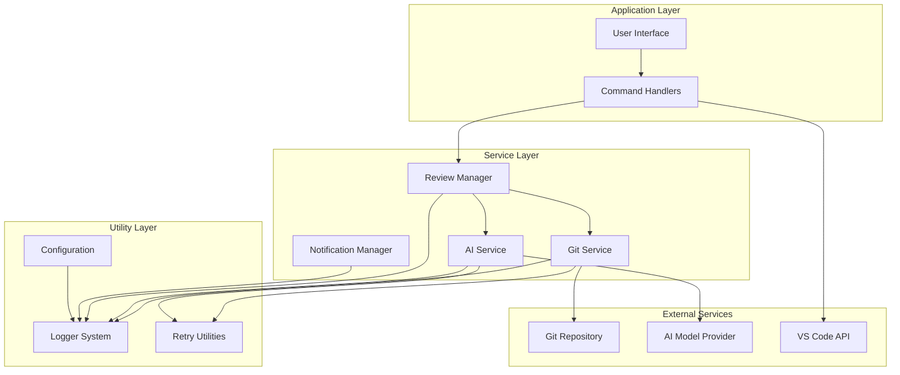

**Diagram sources**
- [extension.ts](file://src/extension.ts#L1-L50)
- [gitService.ts](file://src/services/git/gitService.ts#L45-L100)
- [aiService.ts](file://src/services/ai/aiService.ts#L40-L80)
- [notificationManager.ts](file://src/services/notification/notificationManager.ts#L8-L30)

## Core Error Components

### Logger System

The logging infrastructure provides structured error tracking and debugging capabilities:

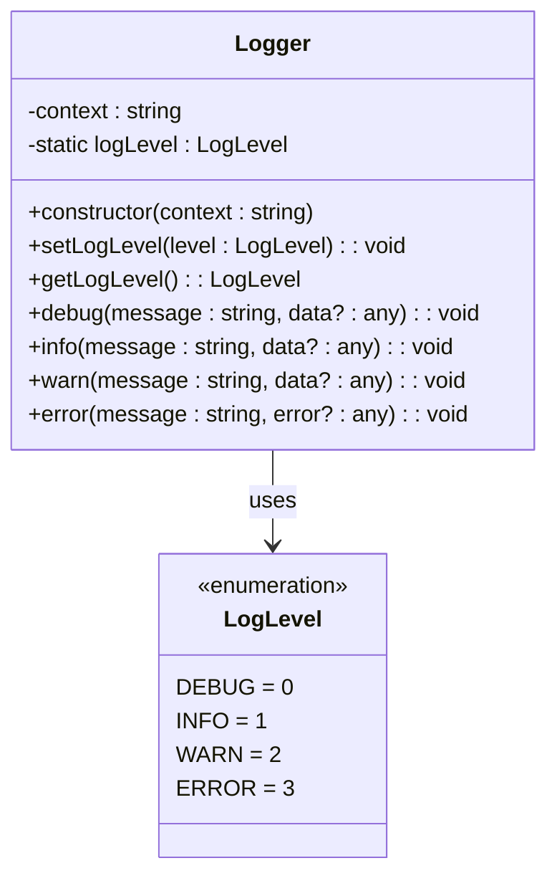

**Diagram sources**
- [logger.ts](file://src/utils/logger.ts#L8-L88)

### Notification Management

The notification system handles user communication and status updates:

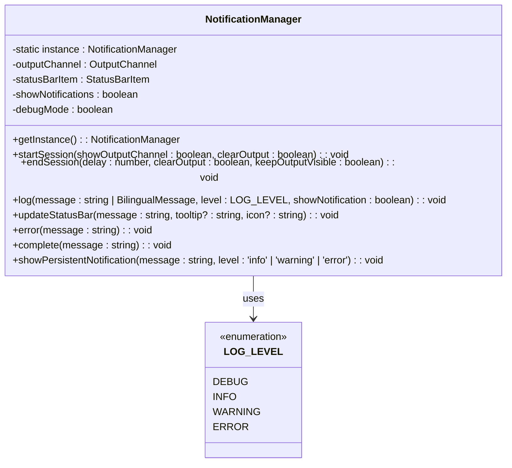

**Diagram sources**
- [notificationManager.ts](file://src/services/notification/notificationManager.ts#L8-L213)
- [constants.ts](file://src/constants/constants.ts#L8-L33)

### Retry Mechanism

The retry system implements exponential backoff with configurable retry policies:

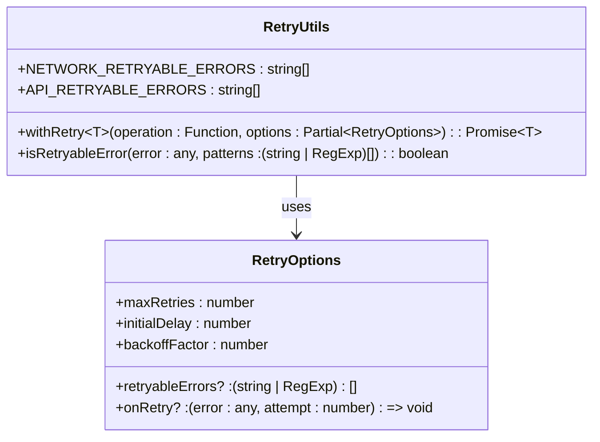

**Diagram sources**
- [retryUtils.ts](file://src/utils/retryUtils.ts#L8-L117)

**Section sources**
- [logger.ts](file://src/utils/logger.ts#L1-L88)
- [notificationManager.ts](file://src/services/notification/notificationManager.ts#L1-L213)
- [retryUtils.ts](file://src/utils/retryUtils.ts#L1-L117)

## Error Flow Analysis

### Complete Error Flow Through Code Review Pipeline

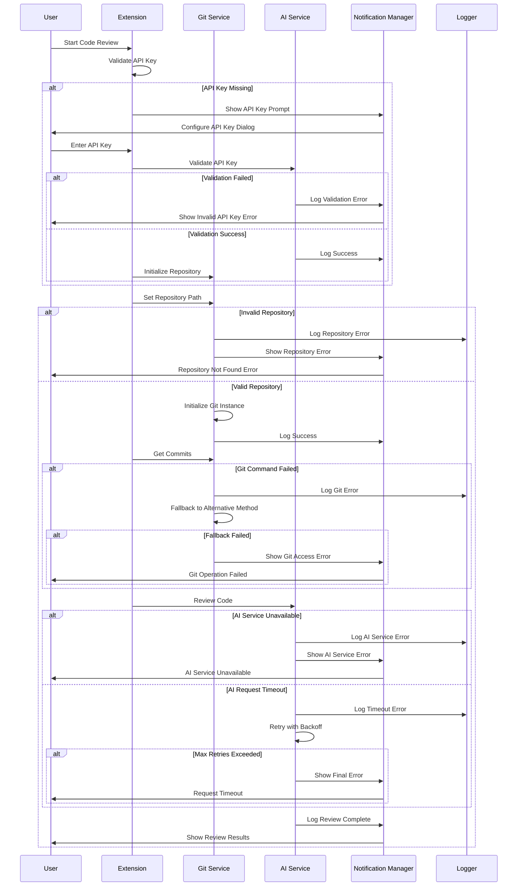

**Diagram sources**
- [extension.ts](file://src/extension.ts#L34-L66)
- [gitService.ts](file://src/services/git/gitService.ts#L64-L107)
- [aiService.ts](file://src/services/ai/aiService.ts#L74-L122)

### Error Propagation and Recovery Patterns

The system implements several error propagation patterns:

1. **Graceful Degradation**: When primary methods fail, the system attempts fallback approaches
2. **Circuit Breaker Pattern**: Prevents repeated failures from overwhelming the system
3. **Retry with Exponential Backoff**: Automatically retries transient failures
4. **User-Friendly Error Messages**: Translates technical errors into actionable user messages

**Section sources**
- [gitService.ts](file://src/services/git/gitService.ts#L180-L241)
- [aiService.ts](file://src/services/ai/aiService.ts#L241-L299)
- [extension.ts](file://src/extension.ts#L135-L184)

## Stage-Specific Error Handling

### User Command Validation

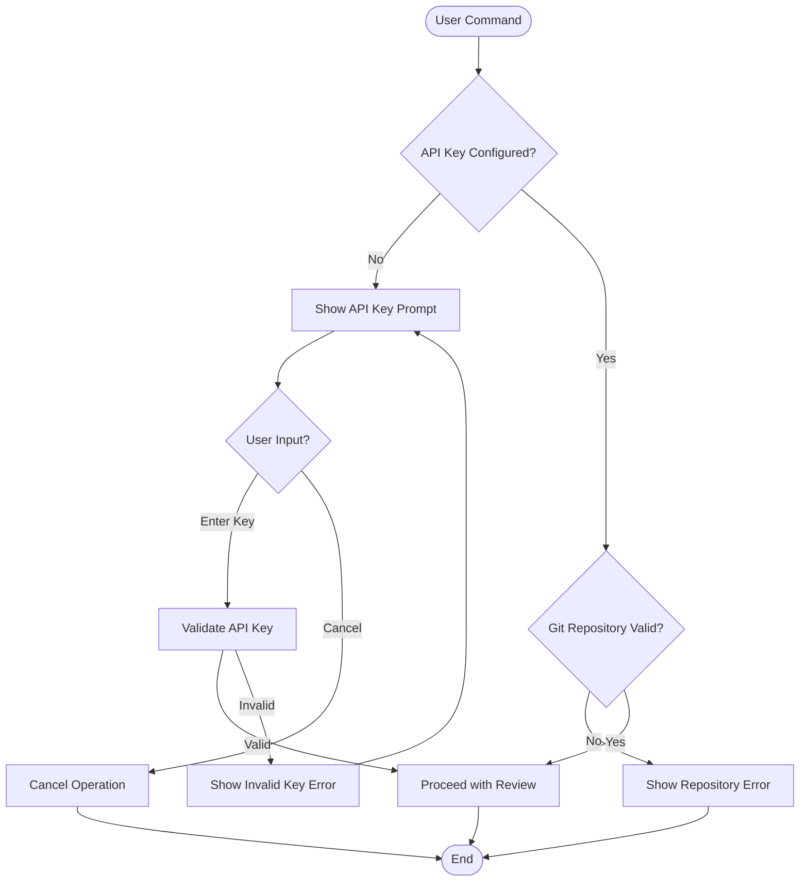

**Diagram sources**
- [extension.ts](file://src/extension.ts#L37-L66)
- [appConfig.ts](file://src/config/appConfig.ts#L146-L155)

### Git Repository Access

The Git service implements multiple fallback strategies for repository access:

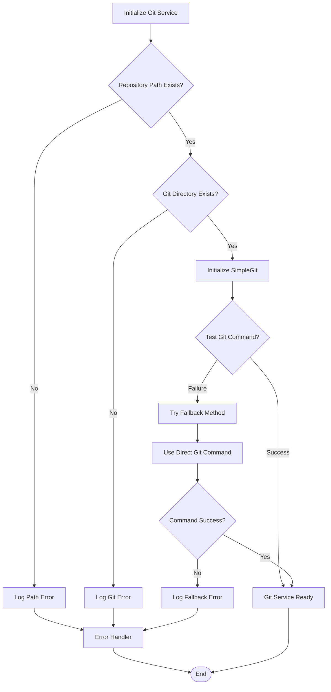

**Diagram sources**
- [gitService.ts](file://src/services/git/gitService.ts#L64-L107)
- [gitService.ts](file://src/services/git/gitService.ts#L180-L241)

### AI Service Communication

The AI service implements sophisticated error handling with retry logic:

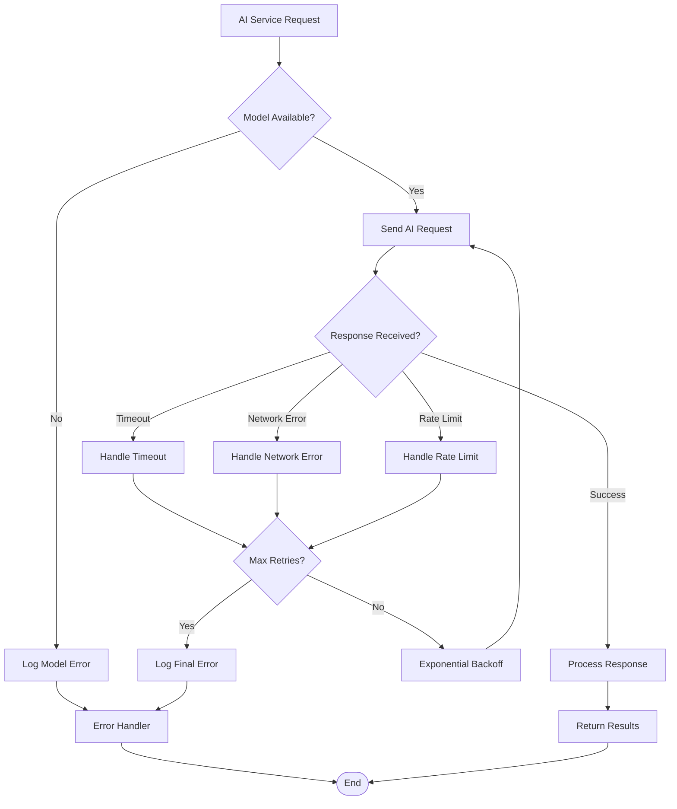

**Diagram sources**
- [aiService.ts](file://src/services/ai/aiService.ts#L74-L122)
- [retryUtils.ts](file://src/utils/retryUtils.ts#L33-L69)

### Report Generation

Report generation implements error handling for file operations and content processing:

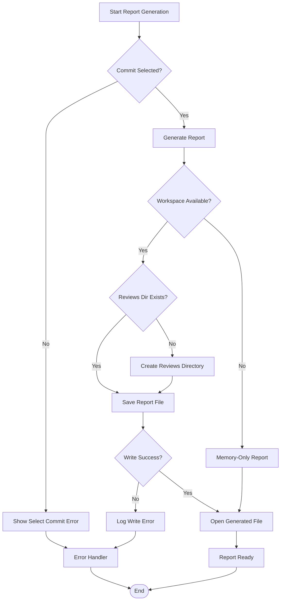

**Diagram sources**
- [extension.ts](file://src/extension.ts#L187-L239)

**Section sources**
- [extension.ts](file://src/extension.ts#L37-L66)
- [gitService.ts](file://src/services/git/gitService.ts#L64-L107)
- [aiService.ts](file://src/services/ai/aiService.ts#L74-L122)
- [extension.ts](file://src/extension.ts#L187-L239)

## Error Recovery Mechanisms

### Automatic Retry System

The retry mechanism provides intelligent error recovery with configurable parameters:

| Parameter | Default Value | Purpose |
|-----------|---------------|---------|
| `maxRetries` | 2 | Maximum retry attempts |
| `initialDelay` | 500ms | Initial retry delay |
| `backoffFactor` | 1.5 | Exponential backoff multiplier |
| `retryableErrors` | Network/API patterns | Error types eligible for retry |

### Fallback Strategies

The system implements multiple fallback strategies:

1. **Git Service Fallbacks**:
   - VS Code Git API → Direct Git Command → Manual Diff Generation
   - SimpleGit → Direct Git Command → File System Analysis

2. **AI Service Fallbacks**:
   - Primary Model → Alternative Model → Compressed Analysis → Simple Analysis

3. **File System Fallbacks**:
   - Full File Analysis → Compressed Analysis → Summary Only

### Circuit Breaker Implementation

The system prevents cascading failures through circuit breaker patterns:

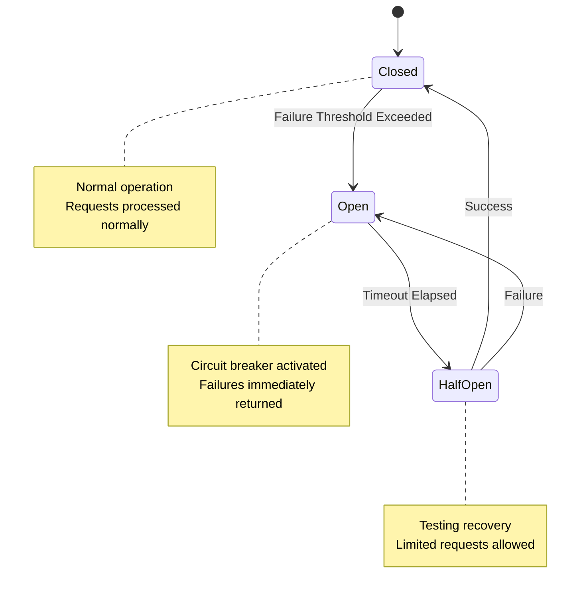

**Section sources**
- [retryUtils.ts](file://src/utils/retryUtils.ts#L1-L117)
- [gitService.ts](file://src/services/git/gitService.ts#L180-L241)
- [aiService.ts](file://src/services/ai/aiService.ts#L241-L299)

## User Notification System

### Notification Levels and Behavior

The notification system provides different levels of user feedback:

| Level | Visual Indicator | Action Required | Example Scenarios |
|-------|------------------|-----------------|-------------------|
| ERROR | Red error icon | Yes | API key invalid, repository not found |
| WARNING | Yellow warning icon | Optional | Rate limit exceeded, fallback used |
| INFO | Blue info icon | No | Progress updates, success messages |

### Error Message Localization

The system supports bilingual error messages with automatic fallback:

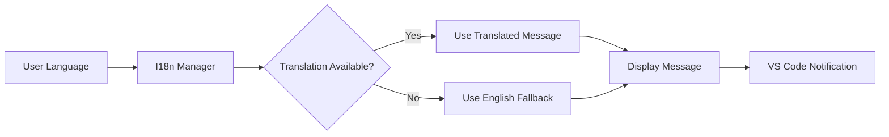

**Diagram sources**
- [index.ts](file://src/i18n/index.ts#L47-L69)

### Persistent Error Notifications

Critical errors trigger persistent notifications with action buttons:

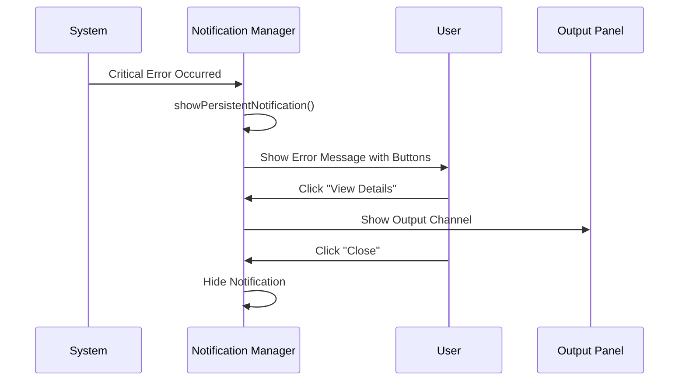

**Diagram sources**
- [notificationManager.ts](file://src/services/notification/notificationManager.ts#L183-L210)

**Section sources**
- [notificationManager.ts](file://src/services/notification/notificationManager.ts#L1-L213)
- [index.ts](file://src/i18n/index.ts#L47-L69)

## Common Error Scenarios

### Missing API Keys

**Scenario**: User attempts code review without configuring API key

**Error Flow**:
1. Extension detects missing API key during activation
2. Shows warning dialog with configuration options
3. User can enter key or open settings
4. Validates key with AI service
5. Stores valid key in configuration
6. Resumes original operation

**Recovery Strategy**: Interactive key configuration with immediate validation

### Invalid Git Repositories

**Scenario**: User selects non-Git repository for review

**Error Flow**:
1. Git service detects missing `.git` directory
2. Logs error with diagnostic information
3. Shows error message to user
4. Suggests checking repository validity
5. Provides guidance for fixing the issue

**Recovery Strategy**: Clear error messaging with actionable suggestions

### AI Service Timeouts

**Scenario**: AI model provider becomes unresponsive

**Error Flow**:
1. Request timeout detected
2. Initiates retry with exponential backoff
3. Attempts alternative models if available
4. Falls back to compressed analysis for large files
5. Provides progress indication during retries
6. Shows final error if all attempts fail

**Recovery Strategy**: Multi-tier retry with progressive degradation

### File Access Issues

**Scenario**: System cannot read/write review files

**Error Flow**:
1. File system operation fails
2. Logs detailed error information
3. Attempts alternative file locations
4. Creates backup files if possible
5. Shows error with resolution steps
6. Continues operation with degraded functionality

**Recovery Strategy**: Graceful degradation with alternative paths

**Section sources**
- [extension.ts](file://src/extension.ts#L37-L66)
- [gitService.ts](file://src/services/git/gitService.ts#L76-L87)
- [aiService.ts](file://src/services/ai/aiService.ts#L388-L409)

## Error Logging and Monitoring

### Structured Logging System

The logging system provides comprehensive error tracking:

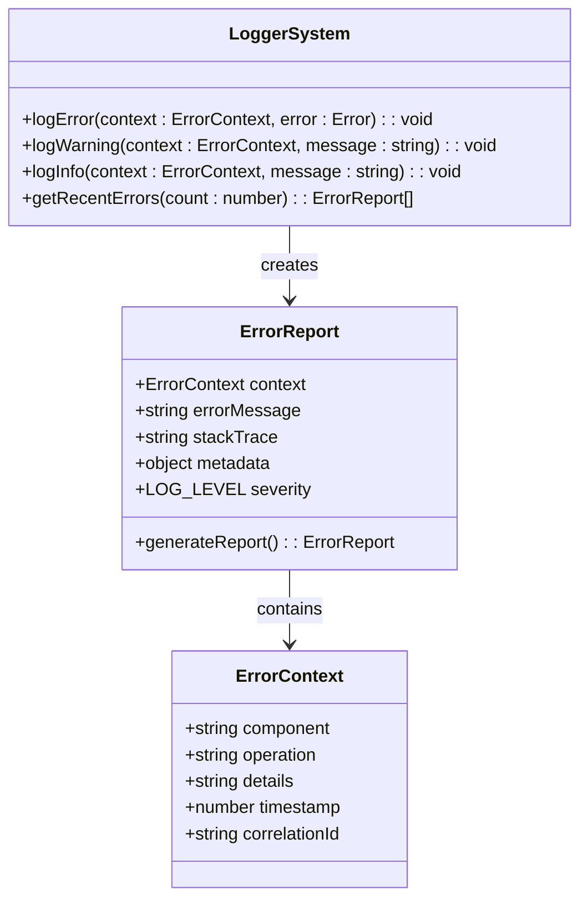

### Error Correlation and Tracking

The system maintains correlation between related operations:

| Correlation Identifier | Scope | Purpose |
|------------------------|-------|---------|
| Session ID | Entire application session | Track user sessions |
| Request ID | Individual API requests | Trace request lifecycle |
| File Path | File-specific operations | Link errors to specific files |
| Commit Hash | Git operations | Connect Git errors to commits |

### Performance Monitoring

Error handling includes performance metrics:

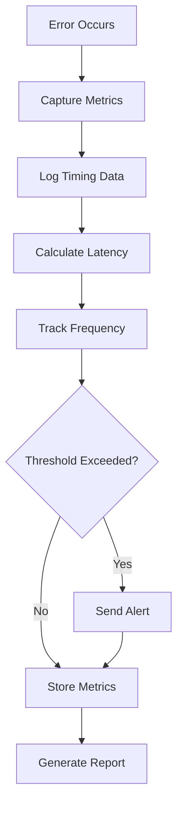

**Section sources**
- [logger.ts](file://src/utils/logger.ts#L1-L88)
- [gitService.ts](file://src/services/git/gitService.ts#L1195-L1199)
- [aiService.ts](file://src/services/ai/aiService.ts#L691-L710)

## Best Practices and Recommendations

### Error Handling Guidelines

1. **Always Log Errors**: Every error should be logged with sufficient context
2. **User-Friendly Messages**: Translate technical errors into actionable user messages
3. **Progressive Disclosure**: Show detailed error information only when requested
4. **Graceful Degradation**: Maintain functionality even when parts of the system fail
5. **Clear Recovery Paths**: Provide users with clear next steps after errors

### Performance Considerations

1. **Limit Retry Attempts**: Set reasonable limits to prevent infinite loops
2. **Exponential Backoff**: Use increasing delays between retries
3. **Circuit Breakers**: Prevent cascading failures
4. **Timeout Management**: Set appropriate timeouts for external operations
5. **Resource Cleanup**: Ensure proper cleanup even in error conditions

### Security Considerations

1. **Sanitize Error Messages**: Never expose sensitive information in error messages
2. **Rate Limiting**: Prevent abuse through excessive error reporting
3. **Access Control**: Restrict error access to authorized users only
4. **Audit Logging**: Log security-related errors for monitoring

### Testing and Validation

1. **Error Scenario Testing**: Test all error conditions systematically
2. **Recovery Testing**: Verify that recovery mechanisms work correctly
3. **Load Testing**: Test error handling under high load conditions
4. **Integration Testing**: Test error handling across component boundaries
5. **User Experience Testing**: Validate that error messages are helpful and actionable

The CodeKarmic error handling architecture demonstrates a mature approach to managing failures in complex distributed systems. By implementing comprehensive logging, intelligent retry mechanisms, graceful degradation, and user-friendly error communication, the system maintains reliability and usability even when encountering various failure modes throughout the code review process.