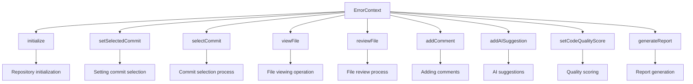
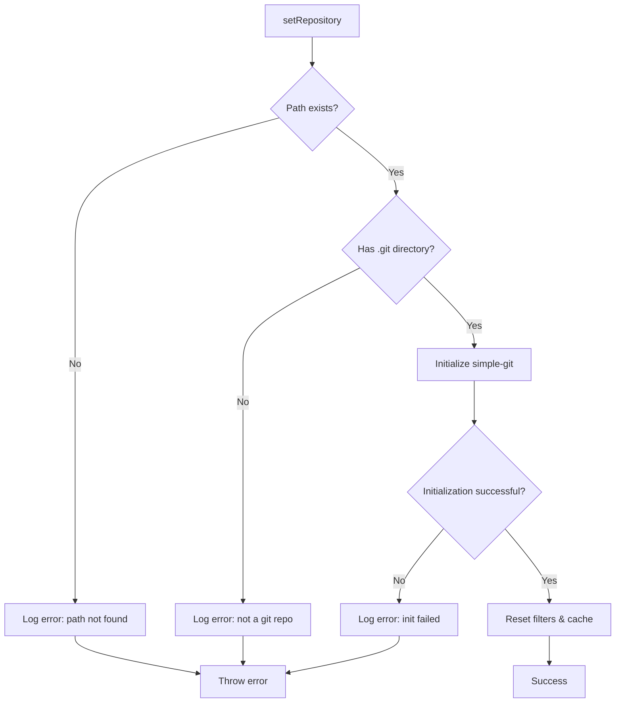
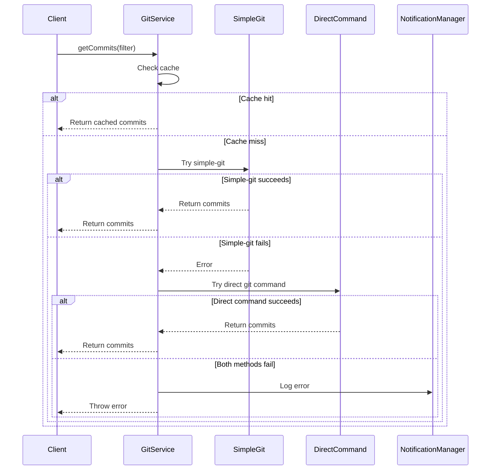
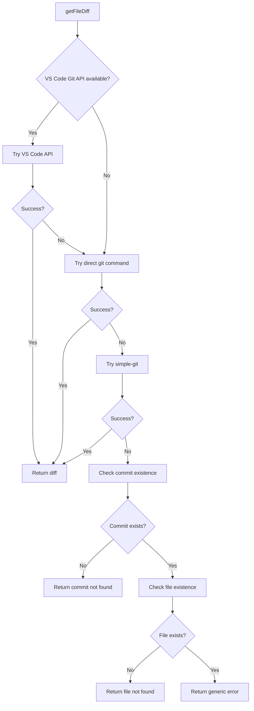
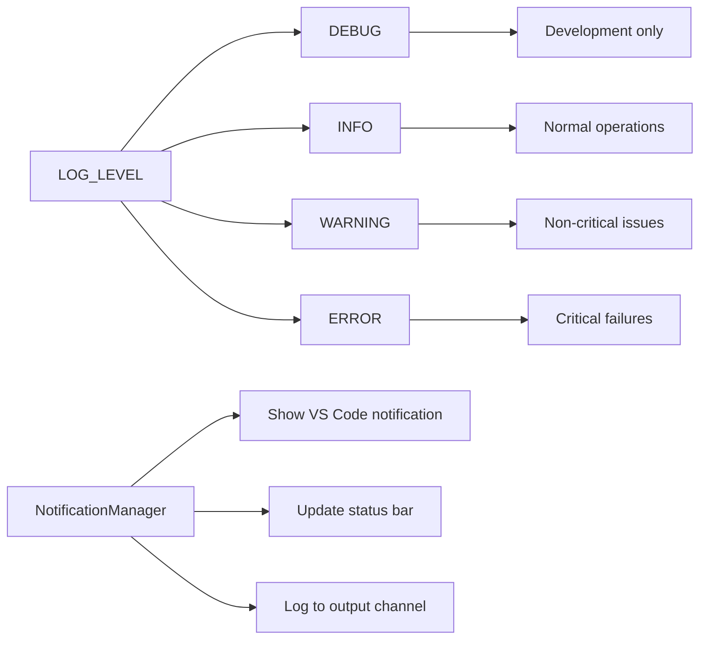
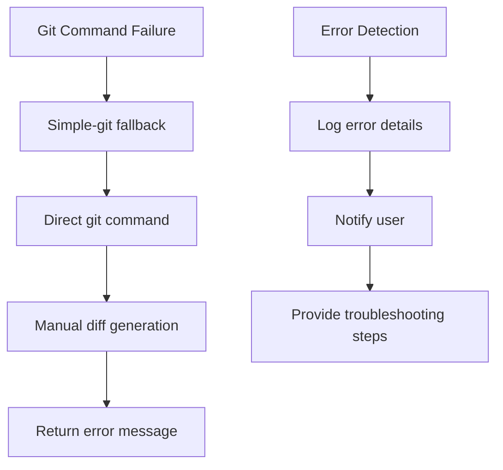
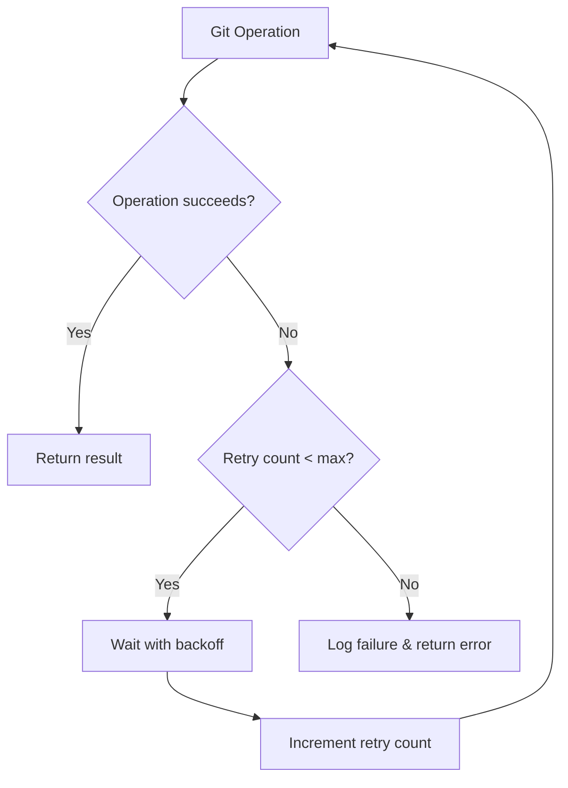
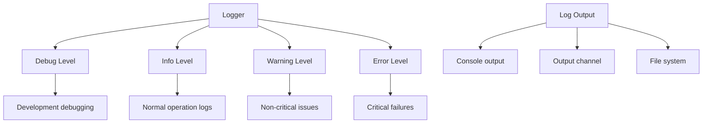

# Git Integration Errors

<cite>
**Referenced Files in This Document**
- [gitService.ts](file://src/services/git/gitService.ts)
- [versionControlTypes.ts](file://src/services/git/versionControlTypes.ts)
- [notificationManager.ts](file://src/services/notification/notificationManager.ts)
- [commitExplorer.ts](file://src/ui/components/commitExplorer.ts)
- [fileExplorer.ts](file://src/ui/components/fileExplorer.ts)
- [reviewManager.ts](file://src/services/review/reviewManager.ts)
- [logger.ts](file://src/utils/logger.ts)
- [constants.ts](file://src/constants/constants.ts)
- [output.ts](file://src/i18n/en/output.ts)
- [output.ts](file://src/i18n/zh/output.ts)
- [extension.ts](file://src/extension.ts)
</cite>

## Table of Contents
1. [Introduction](#introduction)
2. [Error Context System](#error-context-system)
3. [Git Service Error Handling](#git-service-error-handling)
4. [Notification Management](#notification-management)
5. [Common Git Integration Errors](#common-git-integration-errors)
6. [Error Recovery Mechanisms](#error-recovery-mechanisms)
7. [Logging and Diagnostics](#logging-and-diagnostics)
8. [Troubleshooting Guide](#troubleshooting-guide)
9. [Best Practices](#best-practices)

## Introduction

The CodeKarmic system implements a comprehensive Git integration error handling framework that manages various types of Git-related errors during repository access, commit retrieval, and file diff generation. The system employs multiple layers of error detection, recovery, and user notification to ensure robust operation even when Git commands fail or repositories are misconfigured.

The error handling system is built around several key components:
- **ErrorContext enumeration** for categorizing error sources
- **Multi-layered Git command execution** with fallback mechanisms
- **Comprehensive notification system** for user feedback
- **Intelligent caching** to reduce repeated Git operations
- **Graceful degradation** when Git functionality is unavailable

## Error Context System

The system uses an `ErrorContext` enumeration to categorize the source of Git-related errors, enabling targeted error handling and user-friendly error messages.

### ErrorContext Values



**Diagram sources**
- [reviewManager.ts](file://src/services/review/reviewManager.ts#L27-L37)

### Error Context Implementation

The `ErrorContext` enum provides structured error categorization:

- **initialize**: Errors during repository initialization
- **setSelectedCommit**: Issues with setting commit selection state
- **selectCommit**: Problems retrieving or validating commits
- **viewFile**: File viewing and navigation errors
- **reviewFile**: Code review processing errors
- **addComment**: Comment addition and management errors
- **addAISuggestion**: AI suggestion generation and application errors
- **setCodeQualityScore**: Code quality assessment errors
- **generateReport**: Report generation and export errors

**Section sources**
- [reviewManager.ts](file://src/services/review/reviewManager.ts#L27-L37)

## Git Service Error Handling

The `GitService` class implements sophisticated error handling for Git operations with multiple fallback strategies and comprehensive logging.

### Repository Initialization Errors



**Diagram sources**
- [gitService.ts](file://src/services/git/gitService.ts#L64-L107)

### Commit Retrieval Error Handling

The system implements multiple strategies for commit retrieval with automatic fallback:



**Diagram sources**
- [gitService.ts](file://src/services/git/gitService.ts#L197-L241)

### File Diff Generation Error Handling

The system employs a multi-strategy approach for generating file differences:



**Diagram sources**
- [gitService.ts](file://src/services/git/gitService.ts#L707-L793)

**Section sources**
- [gitService.ts](file://src/services/git/gitService.ts#L64-L107)
- [gitService.ts](file://src/services/git/gitService.ts#L197-L241)
- [gitService.ts](file://src/services/git/gitService.ts#L707-L793)

## Notification Management

The `NotificationManager` class provides centralized error notification and logging capabilities with configurable severity levels.

### Notification Levels and Behavior



**Diagram sources**
- [notificationManager.ts](file://src/services/notification/notificationManager.ts#L79-L116)
- [constants.ts](file://src/constants/constants.ts#L13-L22)

### Error Notification Patterns

The system follows consistent patterns for error reporting:

1. **Immediate User Notification**: Critical errors trigger VS Code notifications
2. **Persistent Logging**: All errors are logged to the output channel
3. **Status Bar Updates**: Error states are reflected in the status bar
4. **Stack Trace Preservation**: Full error context is maintained for debugging

**Section sources**
- [notificationManager.ts](file://src/services/notification/notificationManager.ts#L79-L116)

## Common Git Integration Errors

### Invalid Commit ID Errors

When users provide invalid commit IDs or the commit doesn't exist:

```typescript
// Example error scenario from gitService.ts
try {
    const commits = await this.gitService.getCommitById(invalidCommitId);
    if (commits.length === 0) {
        throw new Error(`Commit with ID ${invalidCommitId} not found`);
    }
} catch (error) {
    this.logError(error as Error, ErrorContext.selectCommit);
}
```

### Missing .git Directory Errors

Repository initialization failures due to missing Git metadata:

```typescript
// Example from gitService.ts
if (!fs.existsSync(gitDir)) {
    const errorMsg = `Not a git repository - .git directory not found in ${repoPath}`;
    this.logError(new Error(errorMsg), OUTPUT.GIT.FAILED_TO_SET_REPOSITORY);
    throw new Error(errorMsg);
}
```

### Git Command Execution Failures

Multiple fallback strategies handle Git command failures:



**Diagram sources**
- [gitService.ts](file://src/services/git/gitService.ts#L707-L793)

### Branch Detection Errors

Issues with branch enumeration and switching:

```typescript
// Example from gitService.ts
public async getBranches(): Promise<string[]> {
    try {
        // Method 1: Use simple-git
        const branchSummary = await this.git.branch();
        return Object.keys(branchSummary.branches);
    } catch (error) {
        // Method 2: Use direct git command
        const { stdout } = await execAsync('git branch', { cwd: this.repoPath });
        return stdout.split('\n').filter(line => line.trim() !== '');
    }
}
```

**Section sources**
- [gitService.ts](file://src/services/git/gitService.ts#L64-L107)
- [gitService.ts](file://src/services/git/gitService.ts#L278-L308)
- [gitService.ts](file://src/services/git/gitService.ts#L707-L793)

## Error Recovery Mechanisms

### Automatic Retry Strategies

The system implements intelligent retry mechanisms for transient Git failures:



### Fallback Method Chains

Each Git operation has multiple fallback methods:

1. **Primary Method**: Modern, optimized approach
2. **Secondary Method**: Standard Git command execution
3. **Tertiary Method**: Manual parsing and reconstruction
4. **Quaternary Method**: Graceful degradation with error messages

### Cache-Based Recovery

The system maintains commit caches to reduce Git API calls:

```typescript
// Example from gitService.ts
private async getCommitByIdWithSimpleGit(commitId: string): Promise<CommitInfo[]> {
    // First, try to find the commit in the cached list
    const cachedCommit = this.commits.find(c => c.hash.startsWith(commitId));
    if (cachedCommit) {
        return [cachedCommit];
    }
    
    // If not found in cache, try direct lookup
    // ... implementation ...
}
```

**Section sources**
- [gitService.ts](file://src/services/git/gitService.ts#L953-L1024)

## Logging and Diagnostics

### Structured Logging System

The system uses a hierarchical logging approach with configurable verbosity:



**Diagram sources**
- [logger.ts](file://src/utils/logger.ts#L8-L13)

### Diagnostic Information Collection

The system captures comprehensive diagnostic information:

- **Timestamps**: Precise timing for performance analysis
- **Stack Traces**: Complete call stacks for debugging
- **Context Information**: Error source identification
- **Environment Data**: Git version, OS, VS Code version

### Error Context Enrichment

Each error is enriched with contextual information:

```typescript
// Example from reviewManager.ts
private logError(error: Error, context: ErrorContext): void {
    const contextLabel = ErrorContextLabels[context];
    this.notificationManager.log(`${contextLabel}: ${error.message}`, 'error', true);
}
```

**Section sources**
- [logger.ts](file://src/utils/logger.ts#L8-L88)
- [reviewManager.ts](file://src/services/review/reviewManager.ts#L101-L105)

## Troubleshooting Guide

### Repository Access Issues

**Problem**: "Not a git repository" error
**Solution**: 
1. Verify the workspace contains a `.git` directory
2. Check repository integrity with `git status`
3. Reopen the workspace in VS Code
4. Ensure proper permissions on repository files

**Problem**: Permission denied accessing Git files
**Solution**:
1. Check file permissions on `.git` directory
2. Run VS Code as administrator (Windows)
3. Verify Git installation accessibility

### Commit Retrieval Failures

**Problem**: "Failed to get commits" error
**Solution**:
1. Test basic Git connectivity: `git log --oneline -n 1`
2. Check network connectivity for remote repositories
3. Verify Git credentials and authentication
4. Clear commit cache and retry

**Problem**: Specific commit not found
**Solution**:
1. Verify commit hash validity
2. Check if commit exists in current branch
3. Ensure repository is up-to-date (`git fetch`)
4. Test with shorter commit hash prefixes

### File Diff Generation Issues

**Problem**: "Unable to generate diff" error
**Solution**:
1. Check file encoding and special characters
2. Verify file exists in both commits
3. Test with simpler file types first
4. Review Git configuration for diff settings

### Performance Issues

**Problem**: Slow Git operations
**Solution**:
1. Reduce commit history depth
2. Use branch-specific filters
3. Increase concurrent process limit
4. Enable commit caching

**Section sources**
- [gitService.ts](file://src/services/git/gitService.ts#L64-L107)
- [gitService.ts](file://src/services/git/gitService.ts#L197-L241)

## Best Practices

### Error Handling Guidelines

1. **Fail Fast**: Detect and report errors early in the process
2. **Graceful Degradation**: Provide fallback functionality when primary methods fail
3. **User-Friendly Messages**: Present errors in understandable terms
4. **Comprehensive Logging**: Capture all relevant context for debugging

### Performance Optimization

1. **Intelligent Caching**: Cache frequently accessed Git data
2. **Parallel Operations**: Execute independent Git operations concurrently
3. **Lazy Loading**: Load Git data only when needed
4. **Resource Management**: Properly dispose of Git instances and connections

### Security Considerations

1. **Input Validation**: Sanitize all user-provided commit hashes and paths
2. **Access Control**: Respect repository permissions and access rights
3. **Credential Protection**: Securely handle Git authentication tokens
4. **Audit Logging**: Track sensitive Git operations for security monitoring

### Maintenance and Monitoring

1. **Regular Testing**: Test error scenarios regularly
2. **Performance Monitoring**: Track Git operation performance
3. **User Feedback**: Collect and analyze user-reported issues
4. **Documentation Updates**: Keep error handling documentation current

The CodeKarmic Git integration error handling system provides robust, user-friendly error management that ensures reliable operation even under challenging conditions. Through comprehensive fallback mechanisms, intelligent caching, and detailed diagnostic information, the system maintains functionality while providing clear guidance for troubleshooting and resolution.