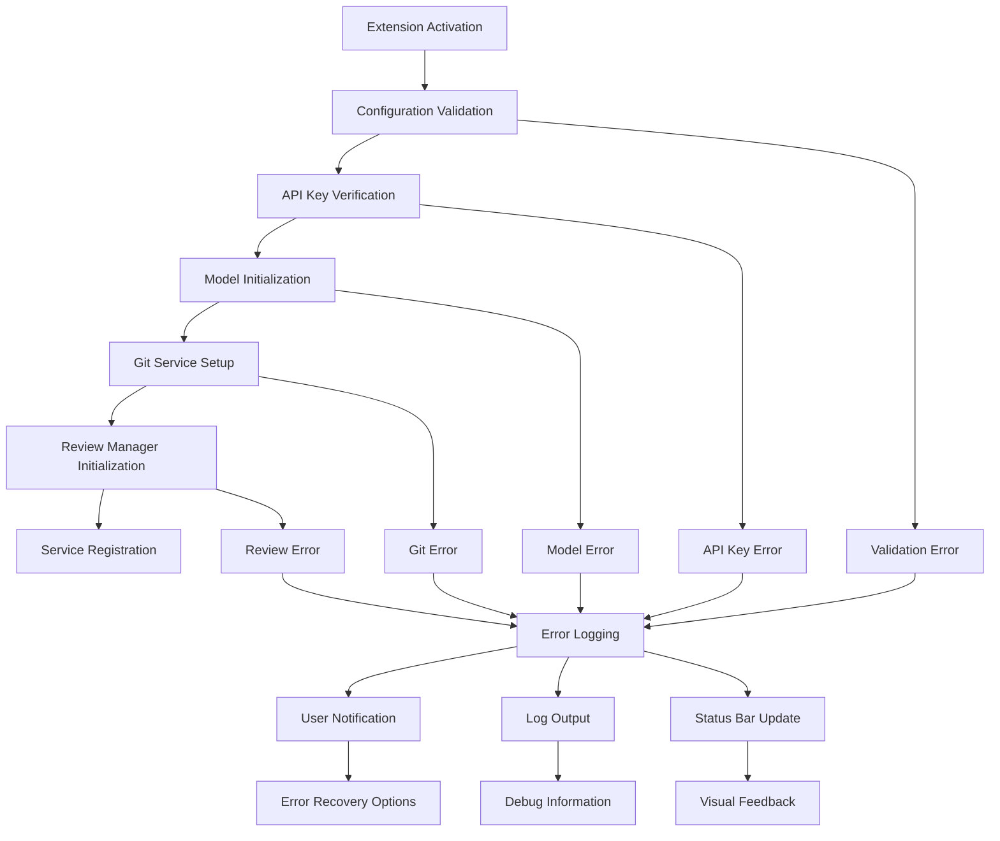
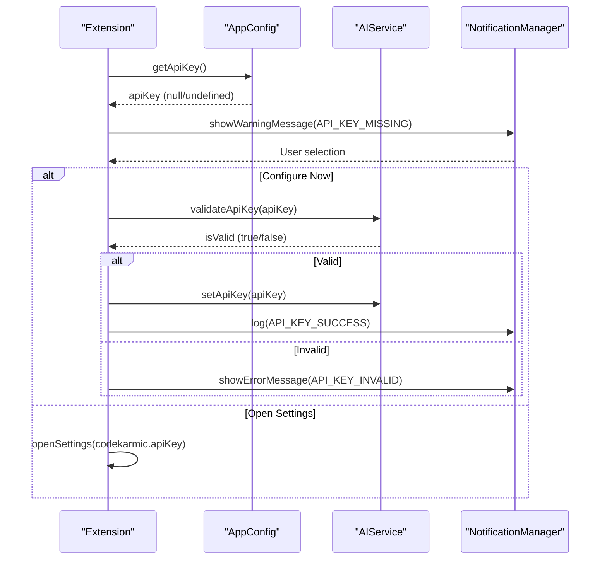
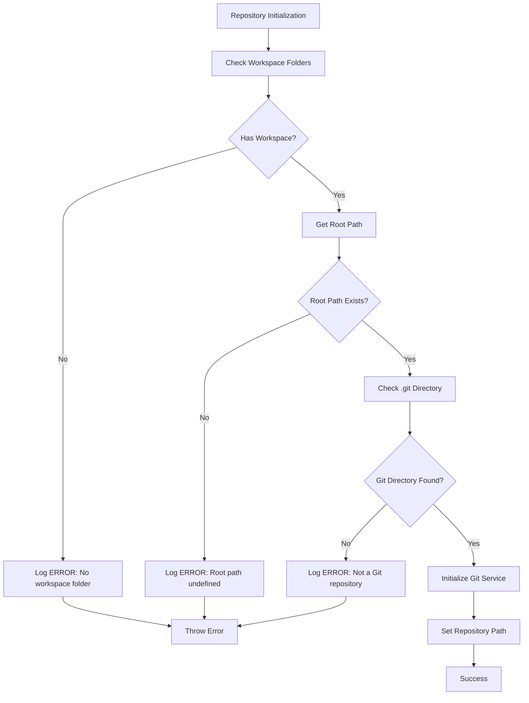
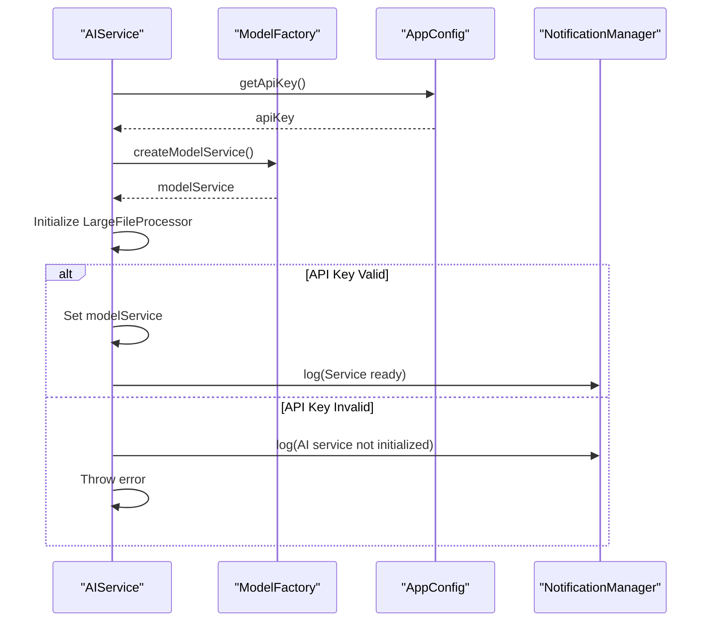
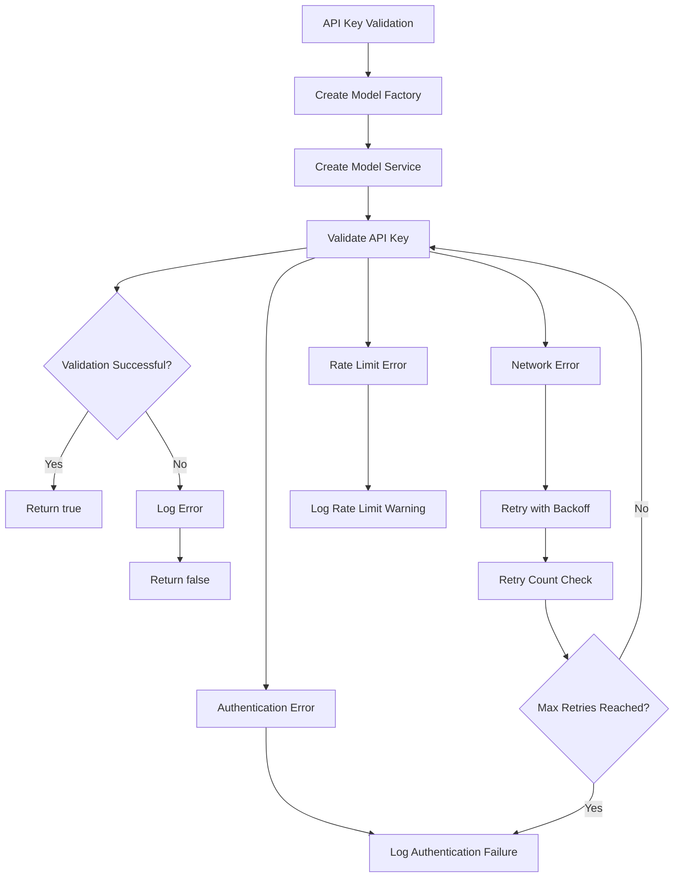
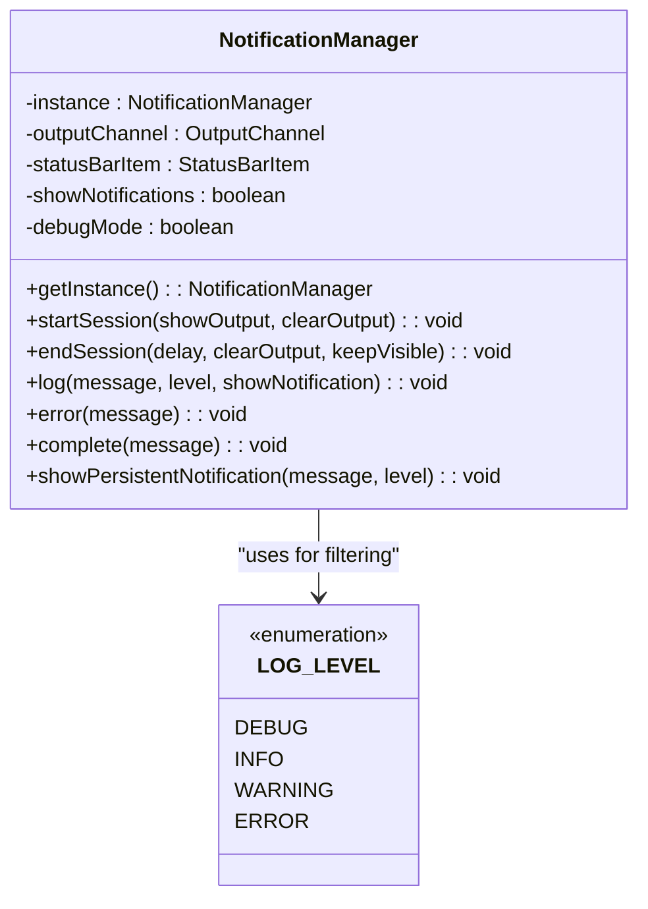
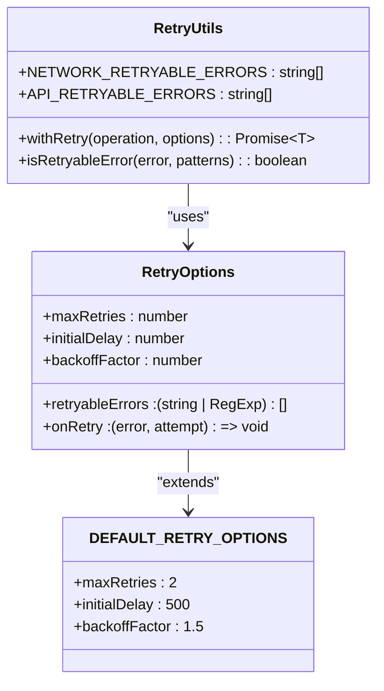
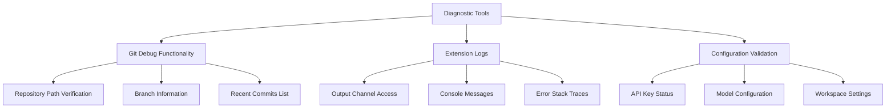

# Initialization Errors

<cite>
**Referenced Files in This Document**
- [reviewManager.ts](file://src/services/review/reviewManager.ts)
- [notificationManager.ts](file://src/services/notification/notificationManager.ts)
- [gitService.ts](file://src/services/git/gitService.ts)
- [aiService.ts](file://src/services/ai/aiService.ts)
- [extension.ts](file://src/extension.ts)
- [modelValidator.ts](file://src/models/modelValidator.ts)
- [logger.ts](file://src/utils/logger.ts)
- [retryUtils.ts](file://src/utils/retryUtils.ts)
- [constants.ts](file://src/constants/constants.ts)
- [output.ts](file://src/i18n/en/output.ts)
</cite>

## Table of Contents
1. [Introduction](#introduction)
2. [ErrorContext.initialize Enum](#errorcontextinitialize-enum)
3. [Initialization Error Handling Architecture](#initialization-error-handling-architecture)
4. [Extension Activation Errors](#extension-activation-errors)
5. [Repository Initialization Errors](#repository-initialization-errors)
6. [Service Setup Errors](#service-setup-errors)
7. [API Key Validation Errors](#api-key-validation-errors)
8. [Model Configuration Errors](#model-configuration-errors)
9. [Workspace Setup Errors](#workspace-setup-errors)
10. [Error Logging and Notification System](#error-logging-and-notification-system)
11. [Retry Mechanisms](#retry-mechanisms)
12. [Common Error Scenarios](#common-error-scenarios)
13. [Troubleshooting Guide](#troubleshooting-guide)
14. [Best Practices](#best-practices)

## Introduction

The CodeKarmic system implements a comprehensive error handling framework specifically designed to manage initialization failures across multiple subsystems. This documentation covers how the system handles errors during extension activation, repository initialization, service setup, and various other initialization scenarios.

The error handling system is built around the `ErrorContext.initialize` enum value and utilizes a centralized notification and logging infrastructure to provide users with meaningful feedback and actionable error information.

## ErrorContext.initialize Enum

The `ErrorContext.initialize` enum serves as the primary identifier for initialization-related errors throughout the CodeKarmic system. It defines the scope and context of initialization failures, enabling precise error categorization and handling.

```mermaid
classDiagram
class ErrorContext {
<<enumeration>>
+initialize
+setSelectedCommit
+selectCommit
+viewFile
+reviewFile
+addComment
+addAISuggestion
+setCodeQualityScore
+generateReport
}
class ErrorContextLabels {
+initialize : {en : "Initializing repository"}
+setSelectedCommit : {en : "Setting selected commit"}
+selectCommit : {en : "Selecting commit"}
+viewFile : {en : "Viewing file"}
+reviewFile : {en : "Reviewing file"}
+addComment : {en : "Adding comment"}
+addAISuggestion : {en : "Adding AI suggestion"}
+setCodeQualityScore : {en : "Setting code quality score"}
+generateReport : {en : "Generating report"}
}
ErrorContext --> ErrorContextLabels : "provides localized labels"
```

**Diagram sources**
- [reviewManager.ts](file://src/services/review/reviewManager.ts#L28-L77)

**Section sources**
- [reviewManager.ts](file://src/services/review/reviewManager.ts#L28-L77)

## Initialization Error Handling Architecture

The CodeKarmic system employs a multi-layered error handling architecture that ensures robust initialization failure management:



**Diagram sources**
- [extension.ts](file://src/extension.ts#L20-L520)
- [reviewManager.ts](file://src/services/review/reviewManager.ts#L111-L128)

## Extension Activation Errors

Extension activation errors occur when the system fails to properly initialize during startup. These errors are caught at the highest level and trigger comprehensive error reporting.

### API Key Configuration Errors

The system performs strict validation of API key configuration during activation:



**Diagram sources**
- [extension.ts](file://src/extension.ts#L37-L65)

### Model Type Validation Errors

Model configuration errors are detected early in the activation process:

**Section sources**
- [extension.ts](file://src/extension.ts#L25-L29)
- [modelValidator.ts](file://src/models/modelValidator.ts#L7-L14)

## Repository Initialization Errors

Repository initialization errors occur when the system cannot properly establish a connection to a Git repository or validate the workspace configuration.

### Workspace Folder Validation

The system performs comprehensive workspace validation before proceeding with repository initialization:



**Diagram sources**
- [reviewManager.ts](file://src/services/review/reviewManager.ts#L111-L128)
- [gitService.ts](file://src/services/git/gitService.ts#L64-L107)

### Git Service Initialization Failures

Git service initialization involves multiple validation steps:

**Section sources**
- [gitService.ts](file://src/services/git/gitService.ts#L64-L107)
- [reviewManager.ts](file://src/services/review/reviewManager.ts#L111-L128)

## Service Setup Errors

Service setup errors encompass failures in initializing various subsystems including AI services, notification managers, and file processors.

### AI Service Initialization

AI service initialization includes API key validation and model service creation:



**Diagram sources**
- [aiService.ts](file://src/services/ai/aiService.ts#L40-L72)

**Section sources**
- [aiService.ts](file://src/services/ai/aiService.ts#L40-L72)

## API Key Validation Errors

API key validation errors are critical initialization failures that prevent AI service functionality.

### Validation Process

The API key validation process includes multiple safety checks:



**Diagram sources**
- [aiService.ts](file://src/services/ai/aiService.ts#L712-L723)

**Section sources**
- [aiService.ts](file://src/services/ai/aiService.ts#L712-L723)

## Model Configuration Errors

Model configuration errors occur when unsupported model types are specified or when model-specific initialization fails.

### Supported Model Types

The system maintains a whitelist of supported model types:

**Section sources**
- [modelValidator.ts](file://src/models/modelValidator.ts#L7-L14)

## Workspace Setup Errors

Workspace setup errors encompass failures related to file system access, permission issues, and workspace configuration problems.

### Common Workspace Issues

| Error Type | Description | Resolution |
|------------|-------------|------------|
| **Missing Workspace Folder** | No workspace folder is open in VS Code | Open a folder containing a Git repository |
| **Permission Denied** | Insufficient permissions to access repository files | Check file permissions and run VS Code as administrator if needed |
| **Invalid Git Repository** | Workspace folder exists but is not a Git repository | Initialize Git repository or open a different folder |
| **Corrupted Repository** | Git repository is corrupted or inaccessible | Run `git fsck` to check repository integrity |
| **Large Repository** | Repository size exceeds performance thresholds | Consider using sparse checkout or filtering |

**Section sources**
- [extension.ts](file://src/extension.ts#L104-L122)

## Error Logging and Notification System

The CodeKarmic system implements a sophisticated error logging and notification system that provides comprehensive error visibility and user feedback.

### NotificationManager Architecture



**Diagram sources**
- [notificationManager.ts](file://src/services/notification/notificationManager.ts#L8-L213)

### Error Logging Levels

The system supports multiple log levels for different types of error information:

| Level | Purpose | User Notification |
|-------|---------|------------------|
| **DEBUG** | Detailed debugging information | No (only in debug mode) |
| **INFO** | General informational messages | Yes (depending on configuration) |
| **WARNING** | Non-critical issues that may cause problems | Yes (always) |
| **ERROR** | Critical errors that prevent functionality | Yes (always) |

**Section sources**
- [notificationManager.ts](file://src/services/notification/notificationManager.ts#L79-L117)
- [constants.ts](file://src/constants/constants.ts#L8-L23)

## Retry Mechanisms

The CodeKarmic system implements intelligent retry mechanisms for recoverable initialization failures.

### Retry Configuration



**Diagram sources**
- [retryUtils.ts](file://src/utils/retryUtils.ts#L8-L117)

### Retryable Error Patterns

The system recognizes specific error patterns that warrant automatic retry attempts:

**Section sources**
- [retryUtils.ts](file://src/utils/retryUtils.ts#L95-L117)

## Common Error Scenarios

### Scenario 1: Missing API Key

**Symptoms:**
- Extension activates but AI functionality is disabled
- Error messages about API key validation failures
- Limited functionality in code review features

**Resolution Steps:**
1. Open VS Code settings (`Ctrl+,` or `Cmd+,`)
2. Navigate to CodeKarmic settings
3. Enter a valid API key
4. Restart the extension

### Scenario 2: Invalid Git Repository

**Symptoms:**
- "Not a Git repository" error messages
- Commit explorer shows "No workspace folder open"
- Cannot perform commit-based code reviews

**Resolution Steps:**
1. Open a folder containing a Git repository
2. Verify `.git` directory exists in the root
3. Run `git status` in terminal to confirm repository health
4. If repository is missing, initialize with `git init`

### Scenario 3: Permission Issues

**Symptoms:**
- "Permission denied" errors accessing repository files
- Cannot read or write to workspace folders
- File explorer shows empty or restricted content

**Resolution Steps:**
1. Check file system permissions for workspace folder
2. Run VS Code as administrator (Windows) or with sudo (Linux/Mac)
3. Move repository to a location with appropriate permissions
4. Verify antivirus software isn't blocking access

### Scenario 4: Network Connectivity Issues

**Symptoms:**
- API key validation timeouts
- AI service initialization failures
- Rate limit exceeded errors

**Resolution Steps:**
1. Check internet connectivity
2. Verify firewall settings allow outbound connections
3. Check for proxy configurations
4. Try with a different network connection

## Troubleshooting Guide

### Diagnostic Commands

The system provides several diagnostic tools for troubleshooting initialization issues:



**Diagram sources**
- [extension.ts](file://src/extension.ts#L609-L660)

### Error Recovery Strategies

| Error Category | Recovery Strategy | User Action Required |
|----------------|-------------------|---------------------|
| **Temporary Network** | Automatic retry with exponential backoff | None |
| **Configuration Error** | Prompt user to fix settings | Manual configuration |
| **Permission Issue** | Suggest alternative locations | Change workspace folder |
| **Corrupted Repository** | Recommend repair or recreation | Manual repository repair |

**Section sources**
- [extension.ts](file://src/extension.ts#L609-L660)

## Best Practices

### Error Prevention

1. **Early Validation**: Perform all validation checks before proceeding with initialization
2. **Graceful Degradation**: Allow partial functionality when non-critical components fail
3. **User Guidance**: Provide clear, actionable error messages with suggested solutions
4. **Logging**: Maintain comprehensive logs for debugging and monitoring

### Error Handling Guidelines

1. **Specific Error Types**: Use specific error types rather than generic exceptions
2. **Context Preservation**: Include relevant context in error messages
3. **Recovery Options**: Offer users clear paths to resolve errors
4. **Progressive Disclosure**: Show detailed error information only when requested

### Monitoring and Maintenance

1. **Regular Testing**: Test initialization scenarios regularly
2. **Error Tracking**: Monitor error frequencies and patterns
3. **Documentation Updates**: Keep troubleshooting documentation current
4. **User Feedback**: Collect and analyze user-reported issues