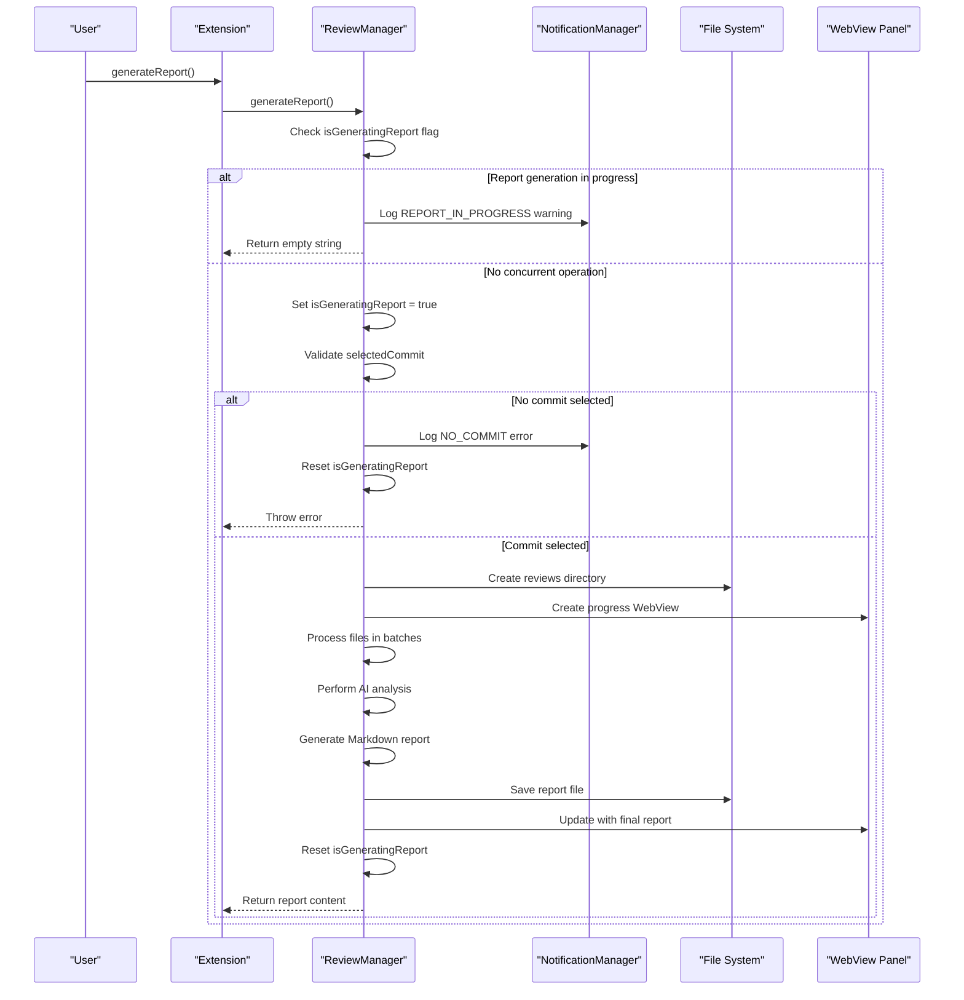
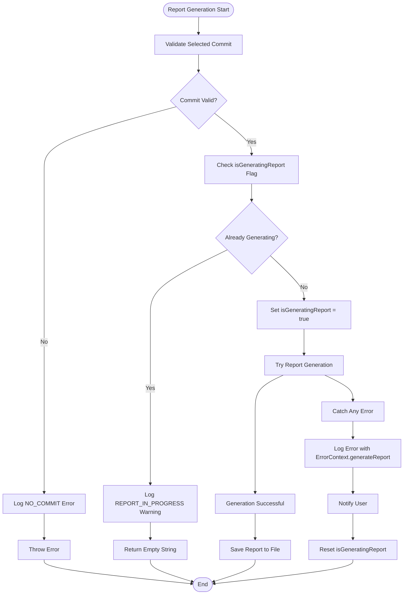
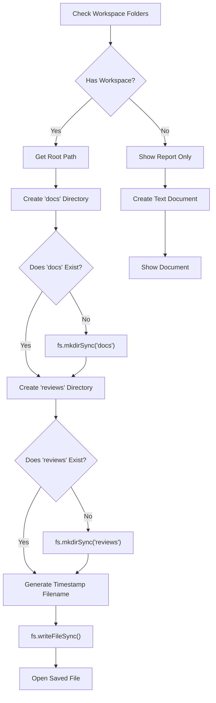
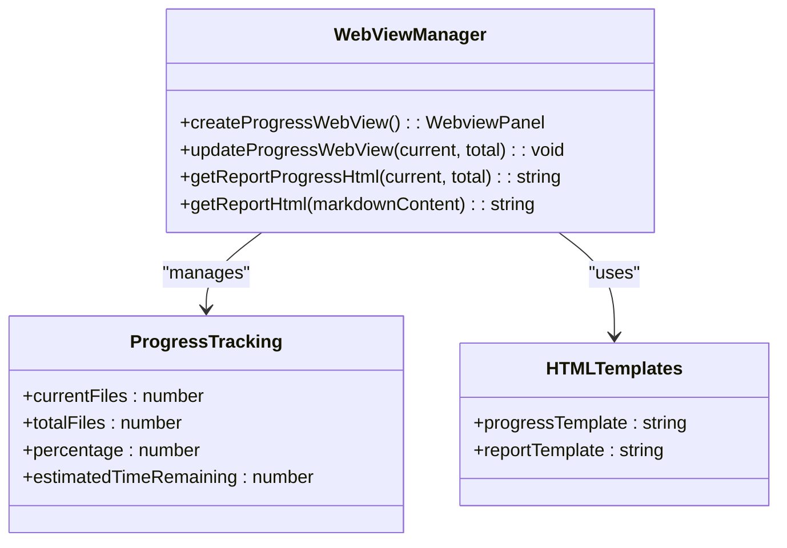
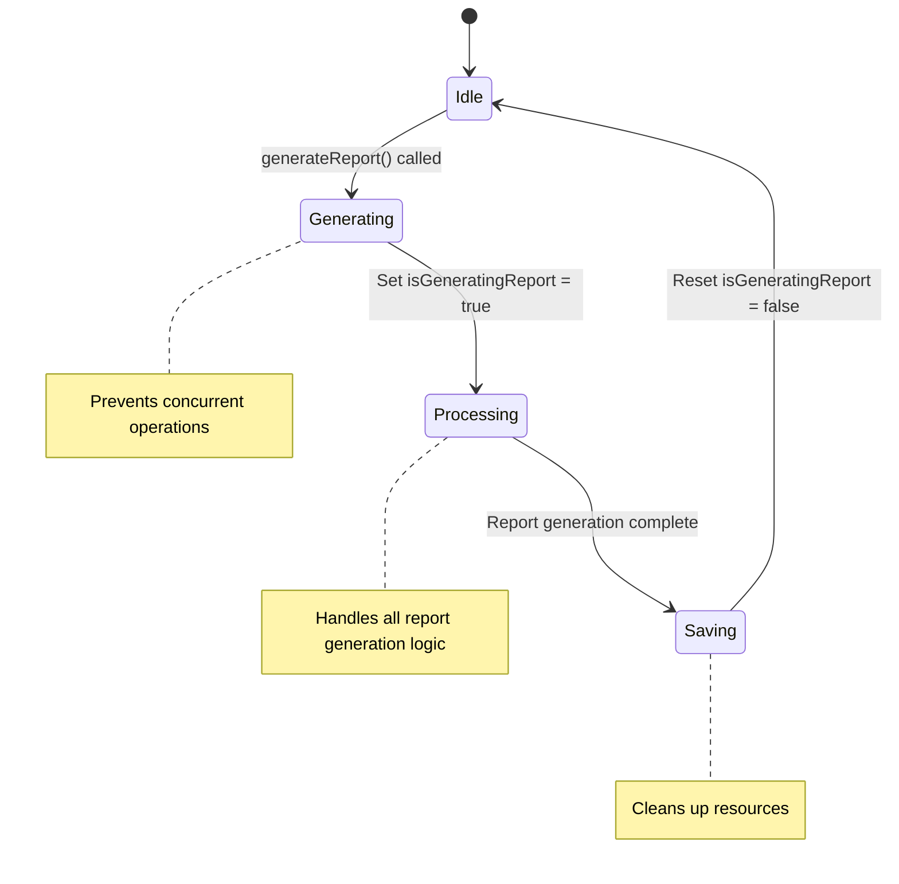
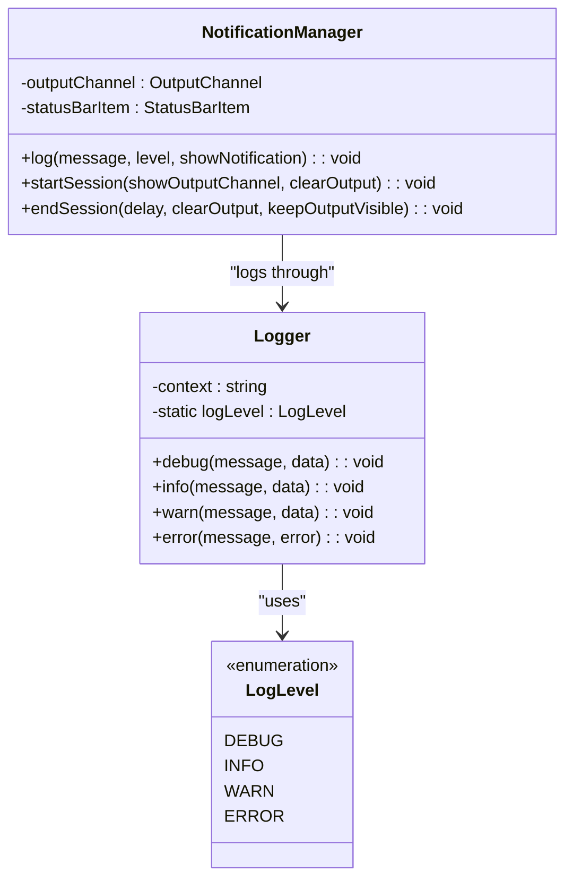
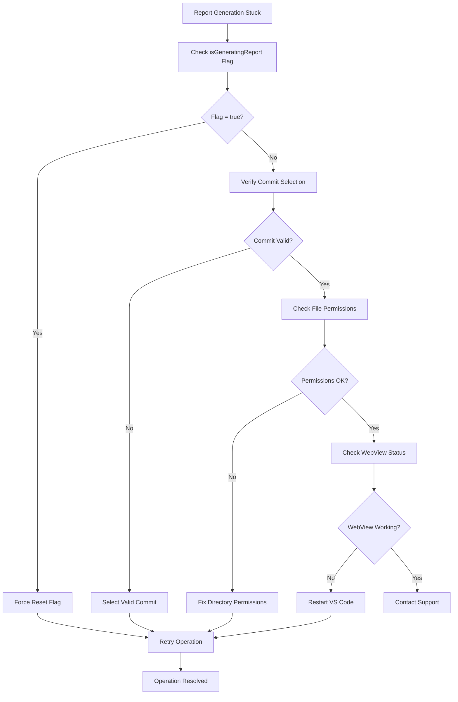
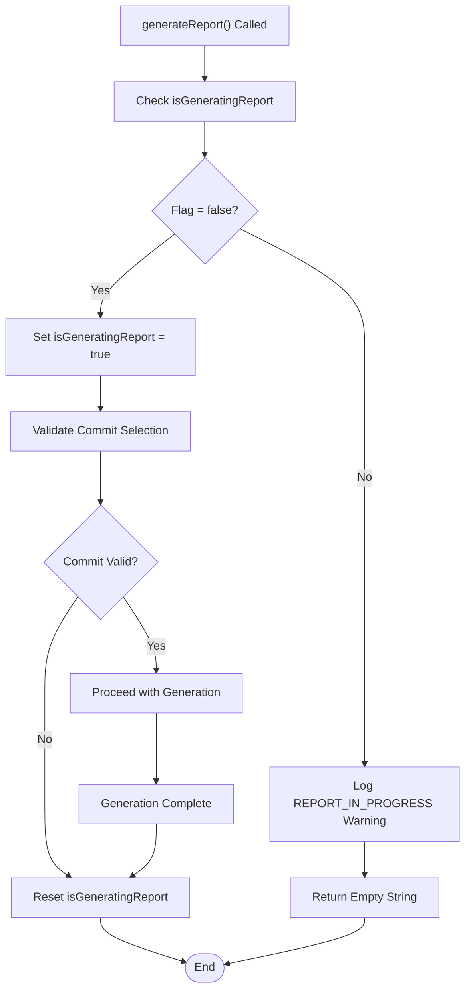

# Report Generation Errors

<cite>
**Referenced Files in This Document**
- [reviewManager.ts](file://src/services/review/reviewManager.ts)
- [notificationManager.ts](file://src/services/notification/notificationManager.ts)
- [logger.ts](file://src/utils/logger.ts)
- [constants.ts](file://src/constants/constants.ts)
- [extension.ts](file://src/extension.ts)
- [retryUtils.ts](file://src/utils/retryUtils.ts)
- [fileUtils.ts](file://src/utils/fileUtils.ts)
- [ui.ts](file://src/i18n/en/ui.ts)
- [output.ts](file://src/i18n/en/output.ts)
</cite>

## Table of Contents
1. [Introduction](#introduction)
2. [ErrorContext.generateReport Enum Value](#errorcontextgeneratereport-enum-value)
3. [Report Generation Architecture](#report-generation-architecture)
4. [Error Handling Mechanisms](#error-handling-mechanisms)
5. [Common Report Generation Issues](#common-report-generation-issues)
6. [File System Operations](#file-system-operations)
7. [WebView Display Errors](#webview-display-errors)
8. [Concurrent Operation Prevention](#concurrent-operation-prevention)
9. [Logging and Notification System](#logging-and-notification-system)
10. [Troubleshooting Guide](#troubleshooting-guide)
11. [Prevention Mechanisms](#prevention-mechanisms)

## Introduction

The CodeKarmic system implements a comprehensive error handling framework for report generation operations. Report generation involves multiple complex steps including commit selection, file processing, AI analysis, Markdown generation, and file saving. The system employs layered error handling with prevention mechanisms, detailed logging, and user-friendly error reporting to ensure reliable operation.

## ErrorContext.generateReport Enum Value

The `ErrorContext.generateReport` enum value serves as a critical identifier for tracking and categorizing errors specifically related to report generation operations. This enum provides structured error context that enables precise error identification and handling throughout the report generation pipeline.

```mermaid
classDiagram
class ErrorContext {
<<enumeration>>
+initialize
+setSelectedCommit
+selectCommit
+viewFile
+reviewFile
+addComment
+addAISuggestion
+setCodeQualityScore
+generateReport
}
class ErrorContextLabels {
+initialize : {en : "Initializing repository"}
+setSelectedCommit : {en : "Setting selected commit"}
+selectCommit : {en : "Selecting commit"}
+viewFile : {en : "Viewing file"}
+reviewFile : {en : "Reviewing file"}
+addComment : {en : "Adding comment"}
+addAISuggestion : {en : "Adding AI suggestion"}
+setCodeQualityScore : {en : "Setting code quality score"}
+generateReport : {en : "Generating report"}
}
class ReviewManager {
-isGeneratingReport : boolean
+generateReport() : Promise~string~
-logError(error, context) : void
-logInfo(message, showNotification) : void
}
ErrorContext --> ErrorContextLabels : "provides labels"
ReviewManager --> ErrorContext : "uses for error context"
```

**Diagram sources**
- [reviewManager.ts](file://src/services/review/reviewManager.ts#L28-L76)

**Section sources**
- [reviewManager.ts](file://src/services/review/reviewManager.ts#L28-L76)

## Report Generation Architecture

The report generation process follows a sophisticated multi-stage architecture designed to handle various failure scenarios gracefully while maintaining user experience continuity.



**Diagram sources**
- [reviewManager.ts](file://src/services/review/reviewManager.ts#L372-L660)
- [extension.ts](file://src/extension.ts#L187-L243)

**Section sources**
- [reviewManager.ts](file://src/services/review/reviewManager.ts#L372-L660)

## Error Handling Mechanisms

The CodeKarmic system implements multiple layers of error handling to ensure robust report generation with graceful degradation and comprehensive error reporting.

### Primary Error Handling Pattern

The system employs a consistent try-catch pattern with centralized error logging and user notification:



**Diagram sources**
- [reviewManager.ts](file://src/services/review/reviewManager.ts#L372-L660)

### Error Context Logging

The system maintains detailed error context through the `logError` method, which associates errors with specific operational contexts:

**Section sources**
- [reviewManager.ts](file://src/services/review/reviewManager.ts#L101-L105)

### Notification Management

The NotificationManager handles error presentation to users through multiple channels:

**Section sources**
- [notificationManager.ts](file://src/services/notification/notificationManager.ts#L79-L117)

## Common Report Generation Issues

### Missing Selected Commit

The most common issue occurs when users attempt to generate reports without selecting a commit. The system validates commit existence early in the process:

**Section sources**
- [reviewManager.ts](file://src/services/review/reviewManager.ts#L387-L390)

### File System Permission Errors

Report generation attempts to create directories and write files, which can fail due to permission restrictions:

**Section sources**
- [extension.ts](file://src/extension.ts#L206-L212)

### Concurrent Report Generation

The system prevents multiple simultaneous report generations through a flag-based mechanism:

**Section sources**
- [reviewManager.ts](file://src/services/review/reviewManager.ts#L378-L380)

### WebView Creation Failures

Progress tracking relies on WebView panels, which can fail to create:

**Section sources**
- [reviewManager.ts](file://src/services/review/reviewManager.ts#L448-L464)

## File System Operations

### Directory Management

The system creates necessary directory structures for report storage:



**Diagram sources**
- [extension.ts](file://src/extension.ts#L202-L239)

### File Writing Operations

The system uses synchronous file operations for simplicity and reliability:

**Section sources**
- [extension.ts](file://src/extension.ts#L221)

## WebView Display Errors

### Progress Tracking Implementation

The system provides real-time progress updates through WebView panels:



**Diagram sources**
- [reviewManager.ts](file://src/services/review/reviewManager.ts#L666-L722)

### WebView Error Handling

The system includes fallback mechanisms for WebView failures:

**Section sources**
- [reviewManager.ts](file://src/services/review/reviewManager.ts#L448-L464)

## Concurrent Operation Prevention

### Flag-Based Prevention

The system uses a boolean flag to prevent concurrent report generation:



**Diagram sources**
- [reviewManager.ts](file://src/services/review/reviewManager.ts#L88)

### Session Management

The NotificationManager manages logging sessions to maintain context:

**Section sources**
- [reviewManager.ts](file://src/services/review/reviewManager.ts#L374-L375)

## Logging and Notification System

### Multi-Level Logging

The system implements hierarchical logging with configurable levels:



**Diagram sources**
- [logger.ts](file://src/utils/logger.ts#L8-L88)
- [notificationManager.ts](file://src/services/notification/notificationManager.ts#L8-L213)

### Internationalized Error Messages

The system provides localized error messages for better user experience:

**Section sources**
- [ui.ts](file://src/i18n/en/ui.ts#L44)
- [output.ts](file://src/i18n/en/output.ts#L36)

## Troubleshooting Guide

### Issue: Report Generation Stuck in Progress

**Symptoms:**
- Progress indicator remains active indefinitely
- No completion notification
- Error messages in output panel

**Diagnosis Steps:**
1. Check if another report generation is in progress
2. Verify commit selection validity
3. Examine file system permissions
4. Review WebView creation status

**Resolution:**


### Issue: Cannot Save Report File

**Symptoms:**
- Report generates but cannot be saved
- Permission denied errors in output
- Report opens in memory only

**Diagnosis:**
1. Verify workspace folder exists
2. Check write permissions in workspace
3. Ensure 'docs/reviews' directory structure
4. Validate file path length limitations

**Resolution Steps:**
1. Open a valid workspace folder
2. Create 'docs' and 'reviews' directories manually
3. Run report generation again
4. Check file system permissions

### Issue: WebView Progress Not Updating

**Symptoms:**
- Progress bar stays at 0%
- No real-time updates
- Final report displays immediately

**Diagnosis:**
1. Check WebView API availability
2. Verify webview security settings
3. Review browser compatibility

**Resolution:**
1. Update VS Code to latest version
2. Check webview security policies
3. Try different browser profile
4. Restart VS Code with clean cache

**Section sources**
- [reviewManager.ts](file://src/services/review/reviewManager.ts#L378-L380)
- [reviewManager.ts](file://src/services/review/reviewManager.ts#L448-L464)

## Prevention Mechanisms

### Duplicate Operation Prevention

The system implements multiple layers of protection against duplicate operations:



**Diagram sources**
- [reviewManager.ts](file://src/services/review/reviewManager.ts#L377-L383)

### Resource Cleanup

The system ensures proper resource cleanup through finally blocks:

**Section sources**
- [reviewManager.ts](file://src/services/review/reviewManager.ts#L655-L660)

### Validation Layers

Multiple validation checks prevent common failure scenarios:

**Section sources**
- [reviewManager.ts](file://src/services/review/reviewManager.ts#L387-L390)
- [extension.ts](file/src/extension.ts#L190-L192)

### Error Recovery Patterns

The system implements graceful degradation for partial failures:

**Section sources**
- [reviewManager.ts](file://src/services/review/reviewManager.ts#L566-L568)
- [reviewManager.ts](file://src/services/review/reviewManager.ts#L569-L607)