# AI Analysis Processing

<cite>
**Referenced Files in This Document**
- [aiService.ts](file://src/services/ai/aiService.ts)
- [codeAnalyzer.ts](file://src/core/review/codeAnalyzer.ts)
- [modelInterface.ts](file://src/models/modelInterface.ts)
- [baseModel.ts](file://src/models/baseModel.ts)
- [deepseek.ts](file://src/models/providers/deepseek.ts)
- [prompts.ts](file://src/i18n/en/prompts.ts)
- [reviewTypes.ts](file://src/core/review/reviewTypes.ts)
- [largeFileProcessor.ts](file://src/core/compression/largeFileProcessor.ts)
- [contentCompressor.ts](file://src/core/compression/contentCompressor.ts)
- [modelFactory.ts](file://src/models/modelFactory.ts)
- [logger.ts](file://src/utils/logger.ts)
- [retryUtils.ts](file://src/utils/retryUtils.ts)
</cite>

## Table of Contents
1. [Introduction](#introduction)
2. [System Architecture](#system-architecture)
3. [Core Components](#core-components)
4. [AI Service Processing Pipeline](#ai-service-processing-pipeline)
5. [Code Analysis Methods](#code-analysis-methods)
6. [Batch Processing Capabilities](#batch-processing-capabilities)
7. [Large File Handling](#large-file-handling)
8. [Error Handling and Resilience](#error-handling-and-resilience)
9. [Performance Optimization](#performance-optimization)
10. [Integration Patterns](#integration-patterns)
11. [Troubleshooting Guide](#troubleshooting-guide)
12. [Best Practices](#best-practices)

## Introduction

The AI Analysis Processing system in CodeKarmic provides sophisticated code review capabilities through seamless integration with AI models. This system transforms code review requests into structured AI prompts, processes them through various analysis pipelines, and generates actionable suggestions for code improvement. The architecture emphasizes scalability, reliability, and performance optimization while maintaining flexibility for different AI providers and analysis scenarios.

The system handles both individual file reviews and batch processing of multiple files, with intelligent caching, compression, and error recovery mechanisms. It supports various programming languages and provides specialized analysis for different code patterns and architectural concerns.

## System Architecture

The AI analysis processing system follows a layered architecture with clear separation of concerns:

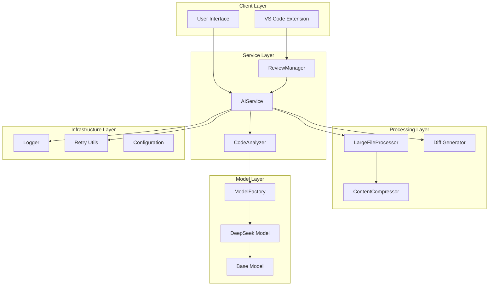

**Diagram sources**
- [aiService.ts](file://src/services/ai/aiService.ts#L40-L70)
- [codeAnalyzer.ts](file://src/core/review/codeAnalyzer.ts#L17-L30)
- [modelFactory.ts](file://src/models/modelFactory.ts#L19-L50)

**Section sources**
- [aiService.ts](file://src/services/ai/aiService.ts#L40-L70)
- [codeAnalyzer.ts](file://src/core/review/codeAnalyzer.ts#L17-L30)
- [modelInterface.ts](file://src/models/modelInterface.ts#L39-L57)

## Core Components

### AIService - Central Processing Hub

The AIService acts as the primary orchestrator for all AI analysis operations, managing the complete workflow from request processing to result generation.

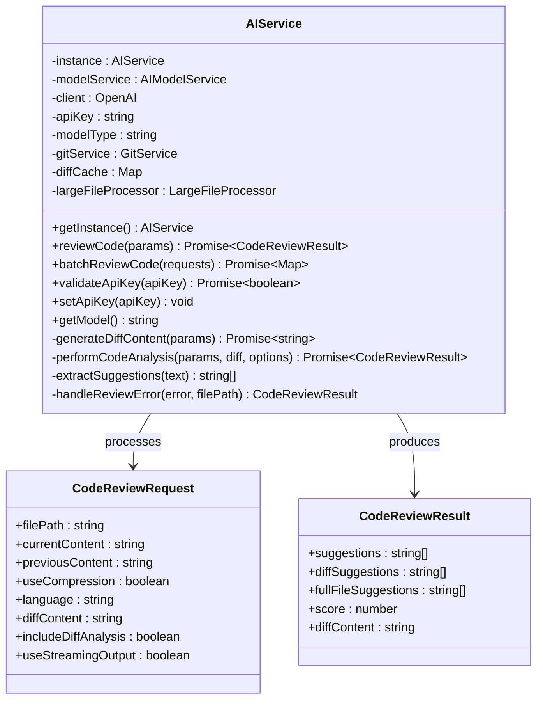

**Diagram sources**
- [aiService.ts](file://src/services/ai/aiService.ts#L15-L32)
- [reviewTypes.ts](file://src/core/review/reviewTypes.ts#L24-L65)

### CodeAnalyzer - Specialized Analysis Engine

The CodeAnalyzer provides focused analysis capabilities for specific types of code examination, handling both difference-based and full-file analysis.

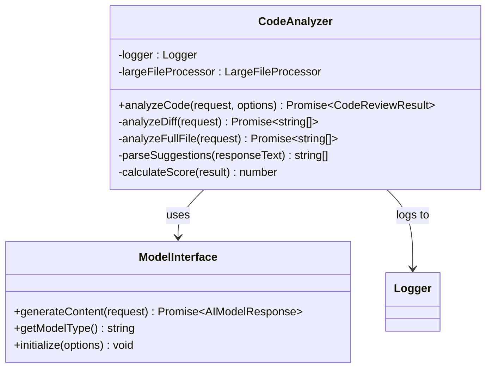

**Diagram sources**
- [codeAnalyzer.ts](file://src/core/review/codeAnalyzer.ts#L17-L30)
- [modelInterface.ts](file://src/models/modelInterface.ts#L166-L185)

**Section sources**
- [aiService.ts](file://src/services/ai/aiService.ts#L40-L70)
- [codeAnalyzer.ts](file://src/core/review/codeAnalyzer.ts#L17-L30)

## AI Service Processing Pipeline

The AI Service implements a comprehensive processing pipeline that handles code review requests through multiple stages:

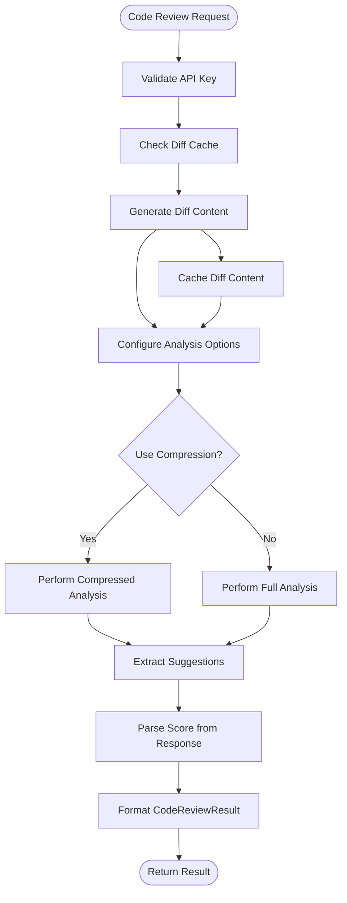

**Diagram sources**
- [aiService.ts](file://src/services/ai/aiService.ts#L74-L118)
- [aiService.ts](file://src/services/ai/aiService.ts#L260-L387)

### Review Code Method Implementation

The `reviewCode` method serves as the primary entry point for individual file analysis:

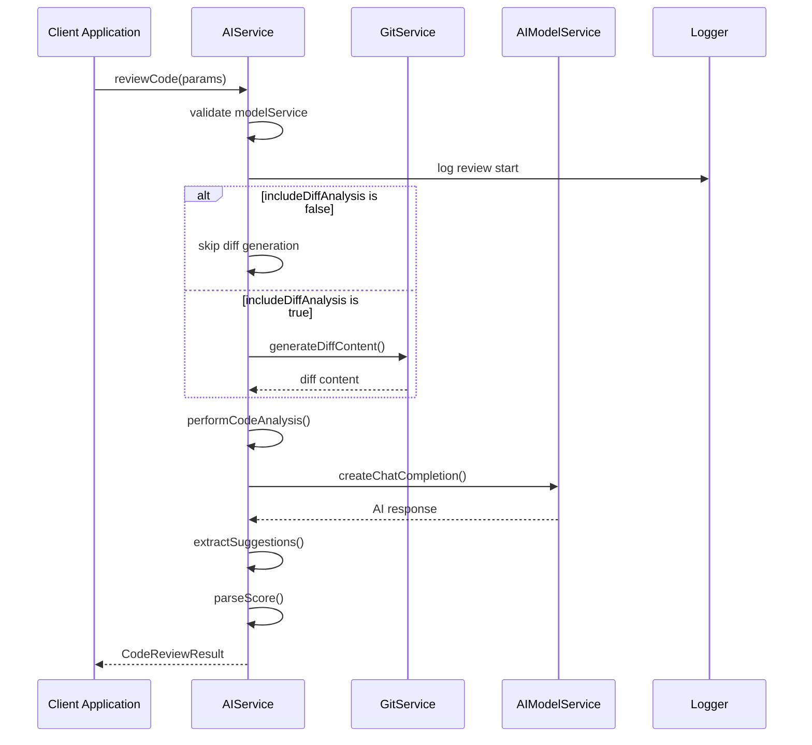

**Diagram sources**
- [aiService.ts](file://src/services/ai/aiService.ts#L74-L118)
- [aiService.ts](file://src/services/ai/aiService.ts#L260-L387)

**Section sources**
- [aiService.ts](file://src/services/ai/aiService.ts#L74-L118)
- [aiService.ts](file://src/services/ai/aiService.ts#L260-L387)

## Code Analysis Methods

### Single File Analysis

The system provides two primary analysis approaches for individual files:

#### Difference-Based Analysis
Focused on reviewing changes between versions, ideal for Git-based code reviews:

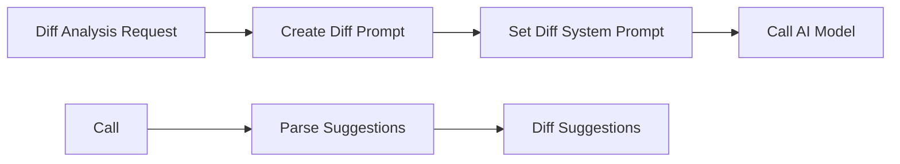

**Diagram sources**
- [codeAnalyzer.ts](file://src/core/review/codeAnalyzer.ts#L97-L128)

#### Full File Analysis
Provides comprehensive review of the entire file content:

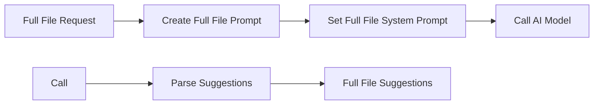

**Diagram sources**
- [codeAnalyzer.ts](file://src/core/review/codeAnalyzer.ts#L135-L165)

### Analysis Options Configuration

The system supports flexible analysis configuration through the `CodeAnalysisOptions` interface:

| Option | Purpose | Default Value |
|--------|---------|---------------|
| `useCompression` | Enable content compression for large files | `false` |
| `maxTokens` | Maximum tokens for AI response | `4000` |
| `includeDiffAnalysis` | Enable difference-based analysis | `false` |
| `includeFullFileAnalysis` | Enable full file analysis | `true` |
| `reviewMode` | Analysis mode (GIT_COMMIT, EXPLORER, etc.) | `undefined` |

**Section sources**
- [codeAnalyzer.ts](file://src/core/review/codeAnalyzer.ts#L30-L90)
- [reviewTypes.ts](file://src/core/review/reviewTypes.ts#L142-L189)

## Batch Processing Capabilities

The AI Service supports efficient batch processing for multiple files, optimizing API usage and reducing latency:

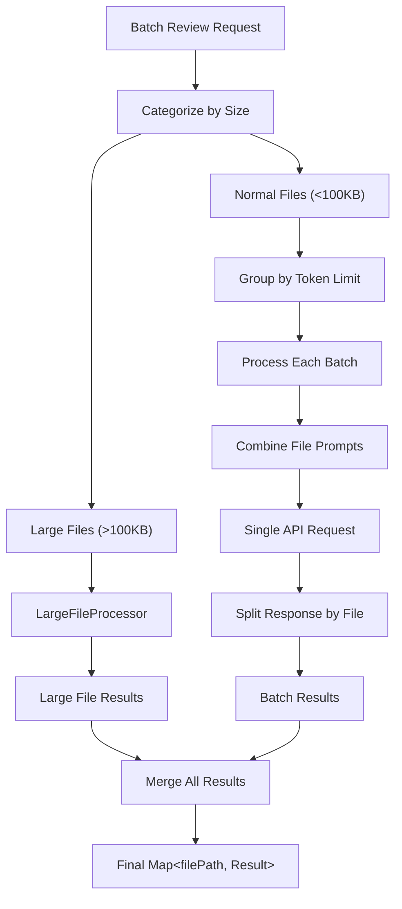

**Diagram sources**
- [aiService.ts](file://src/services/ai/aiService.ts#L431-L552)

### Batch Processing Features

The batch processing system includes several optimization features:

- **Intelligent Batching**: Groups files based on estimated token requirements
- **Token Management**: Prevents exceeding model token limits
- **Parallel Processing**: Processes multiple batches concurrently
- **Error Isolation**: Individual file failures don't affect others
- **Streaming Support**: Enables real-time progress updates

**Section sources**
- [aiService.ts](file://src/services/ai/aiService.ts#L431-L552)

## Large File Handling

The system provides specialized handling for large files through the LargeFileProcessor:

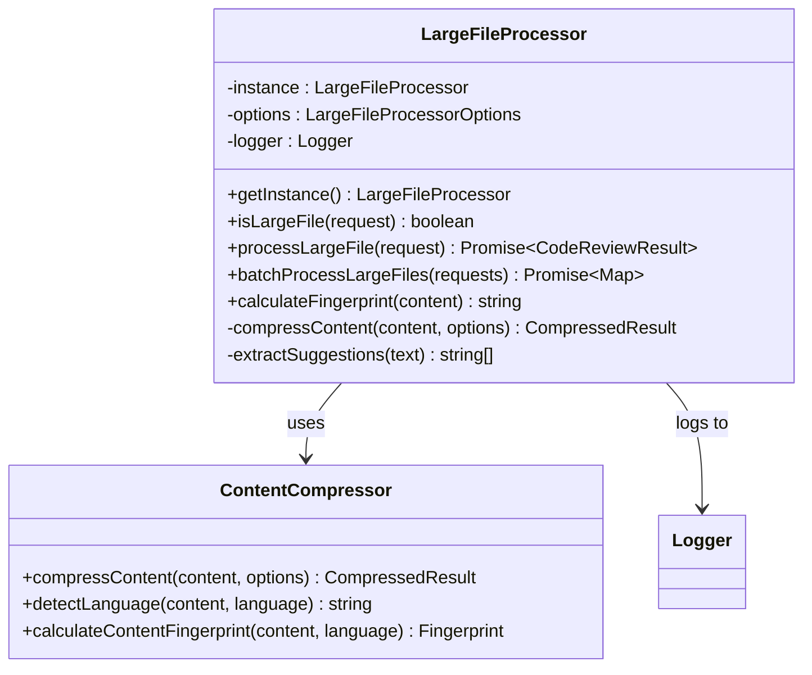

**Diagram sources**
- [largeFileProcessor.ts](file://src/core/compression/largeFileProcessor.ts#L23-L42)
- [contentCompressor.ts](file://src/core/compression/contentCompressor.ts#L18-L40)

### Compression Strategies

The content compressor employs intelligent compression techniques:

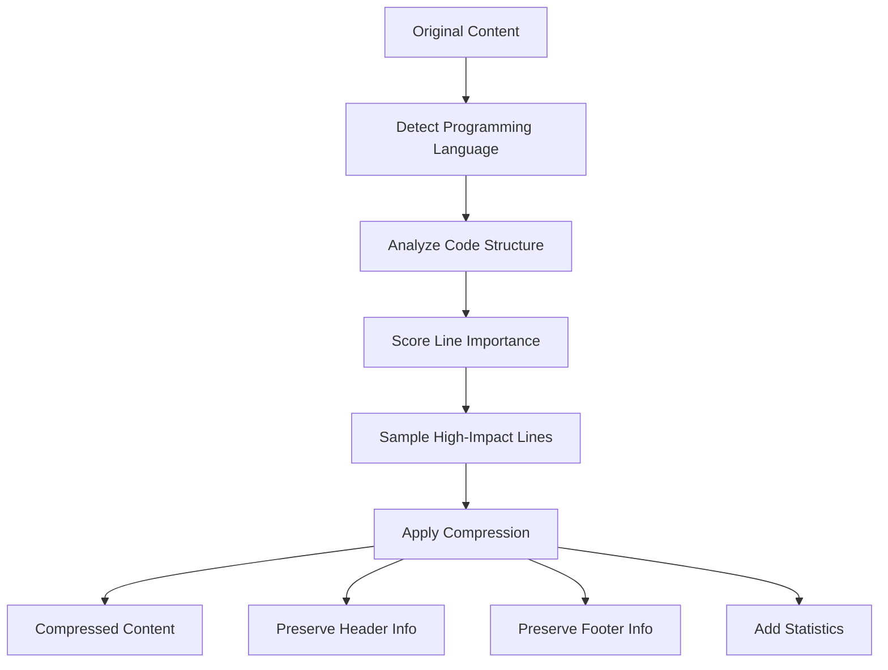

**Diagram sources**
- [contentCompressor.ts](file://src/core/compression/contentCompressor.ts#L18-L231)

**Section sources**
- [largeFileProcessor.ts](file://src/core/compression/largeFileProcessor.ts#L23-L81)
- [contentCompressor.ts](file://src/core/compression/contentCompressor.ts#L18-L231)

## Error Handling and Resilience

The system implements comprehensive error handling and resilience mechanisms:

### Retry Mechanisms

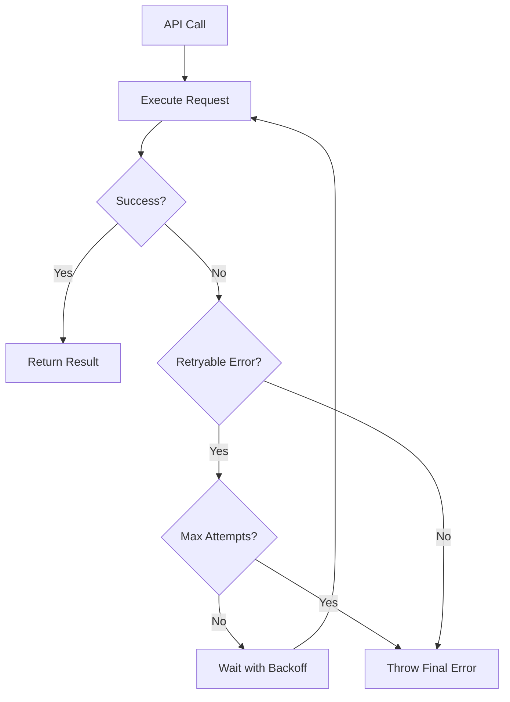

**Diagram sources**
- [retryUtils.ts](file://src/utils/retryUtils.ts#L33-L69)

### Error Categories and Responses

| Error Type | Handling Strategy | Recovery Action |
|------------|------------------|-----------------|
| API Rate Limit | Exponential backoff retry | Wait and retry request |
| Network Timeout | Immediate retry | Fast reconnection |
| Authentication Error | Fail fast | Notify user of invalid credentials |
| Model Provider Error | Circuit breaker pattern | Fallback to cached results |
| Content Processing Error | Graceful degradation | Simplified analysis |

**Section sources**
- [retryUtils.ts](file://src/utils/retryUtils.ts#L33-L117)
- [aiService.ts](file://src/services/ai/aiService.ts#L691-L710)

## Performance Optimization

### Caching Strategies

The system implements multi-level caching for optimal performance:

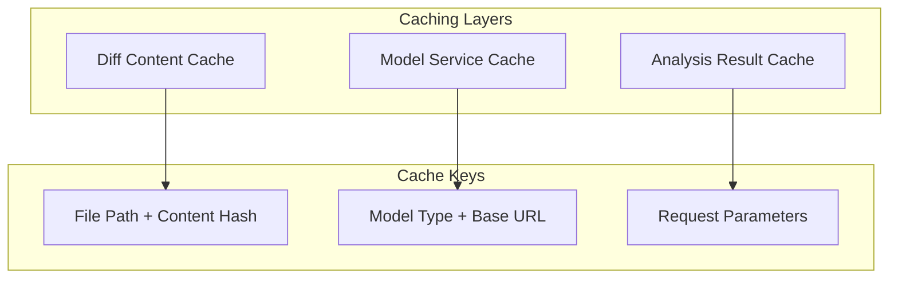

**Diagram sources**
- [aiService.ts](file://src/services/ai/aiService.ts#L46-L47)
- [modelFactory.ts](file://src/models/modelFactory.ts#L72-L81)

### Performance Metrics

Key performance indicators tracked by the system:

- **API Request Latency**: Average response time per request
- **Compression Ratio**: Reduction achieved by content compression
- **Batch Efficiency**: Utilization of batch processing
- **Cache Hit Rate**: Percentage of cache hits vs. misses
- **Error Recovery Rate**: Success rate after error recovery attempts

**Section sources**
- [aiService.ts](file://src/services/ai/aiService.ts#L125-L239)
- [logger.ts](file://src/utils/logger.ts#L18-L88)

## Integration Patterns

### AI Model Provider Integration

The system supports multiple AI providers through a standardized interface:

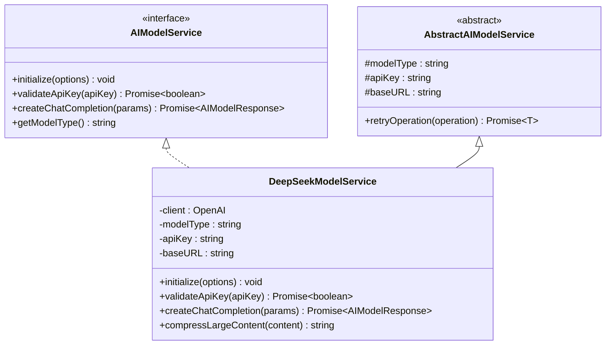

**Diagram sources**
- [modelInterface.ts](file://src/models/modelInterface.ts#L39-L57)
- [deepseek.ts](file://src/models/providers/deepseek.ts#L11-L21)

### Configuration Management

The system uses a centralized configuration approach:

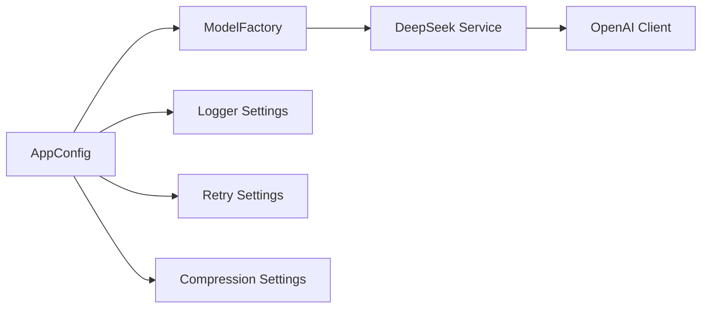

**Diagram sources**
- [modelFactory.ts](file://src/models/modelFactory.ts#L58-L109)

**Section sources**
- [modelInterface.ts](file://src/models/modelInterface.ts#L39-L185)
- [deepseek.ts](file://src/models/providers/deepseek.ts#L11-L211)
- [modelFactory.ts](file://src/models/modelFactory.ts#L19-L140)

## Troubleshooting Guide

### Common Issues and Solutions

#### API Rate Limiting
**Symptoms**: Requests failing with rate limit errors
**Solution**: 
- Implement exponential backoff retry logic
- Monitor API usage and adjust request frequency
- Use batch processing to reduce total request count

#### Large File Processing Failures
**Symptoms**: Memory errors or timeouts with large files
**Solution**:
- Enable compression for files larger than 50KB
- Adjust compression thresholds based on content type
- Use streaming processing for extremely large files

#### AI Model Connection Issues
**Symptoms**: Authentication failures or connection timeouts
**Solution**:
- Verify API key validity using `validateApiKey()` method
- Check network connectivity and proxy settings
- Monitor model provider status and availability

#### Batch Processing Errors
**Symptoms**: Some files fail while others succeed in batch processing
**Solution**:
- Implement individual file fallback for batch failures
- Monitor token limits and adjust batch sizes accordingly
- Use error isolation to prevent cascade failures

### Debugging Tools

The system provides comprehensive logging and monitoring capabilities:

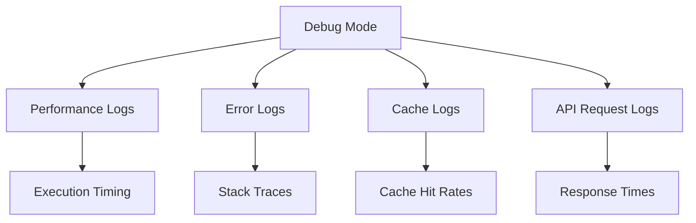

**Diagram sources**
- [logger.ts](file://src/utils/logger.ts#L18-L88)

**Section sources**
- [aiService.ts](file://src/services/ai/aiService.ts#L691-L710)
- [logger.ts](file://src/utils/logger.ts#L18-L88)

## Best Practices

### Code Review Guidelines

1. **Prompt Engineering**: Use clear, specific prompts that guide AI toward desired output format
2. **Content Preparation**: Ensure code samples are representative and well-formatted
3. **Result Validation**: Implement post-processing validation for AI-generated suggestions
4. **Context Preservation**: Maintain sufficient context for meaningful analysis

### Performance Optimization

1. **Caching Strategy**: Implement multi-level caching for frequently accessed data
2. **Batch Processing**: Use batch APIs when available to reduce overhead
3. **Compression**: Apply intelligent compression for large files and content
4. **Resource Management**: Monitor memory usage and implement cleanup procedures

### Error Handling

1. **Graceful Degradation**: Provide fallback mechanisms for API failures
2. **Retry Logic**: Implement exponential backoff for transient failures
3. **Monitoring**: Track error rates and implement alerting systems
4. **User Feedback**: Provide clear error messages and recovery guidance

### Security Considerations

1. **API Key Management**: Store and transmit API keys securely
2. **Content Sanitization**: Validate and sanitize input content
3. **Access Control**: Implement proper authentication and authorization
4. **Audit Logging**: Maintain comprehensive audit trails for security monitoring

The AI Analysis Processing system in CodeKarmic demonstrates sophisticated engineering principles applied to code review automation. Through careful architecture design, robust error handling, and performance optimization, it provides reliable and scalable AI-powered code analysis capabilities that enhance developer productivity while maintaining code quality standards.