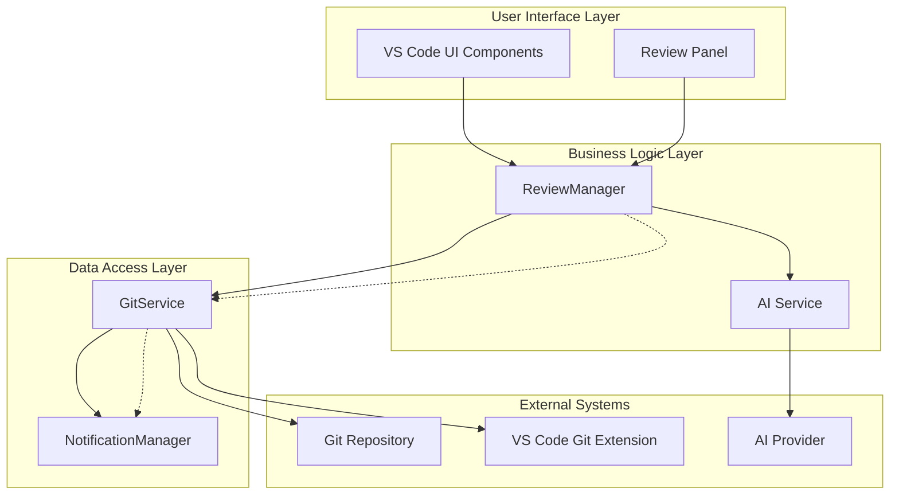
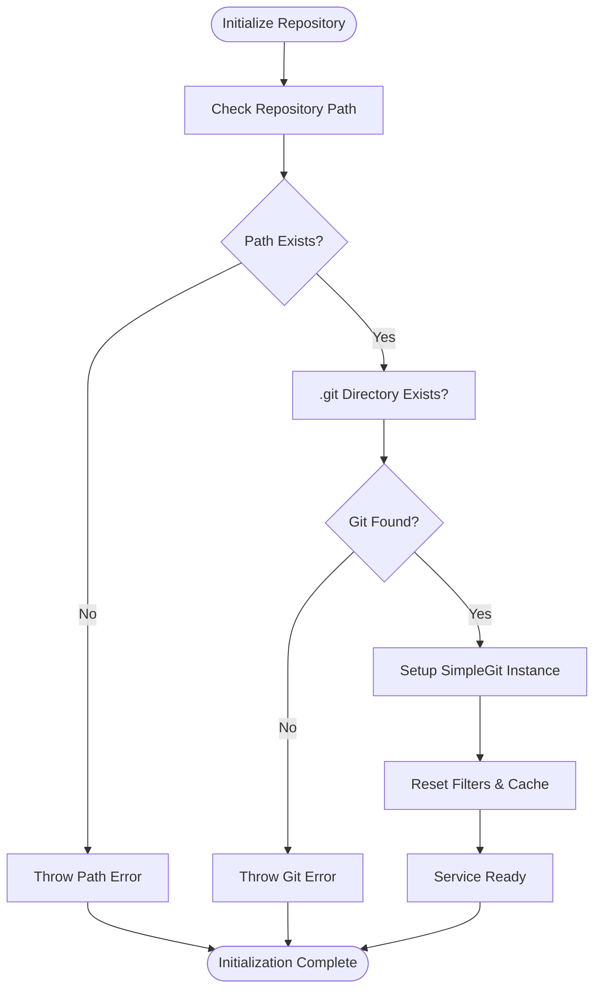
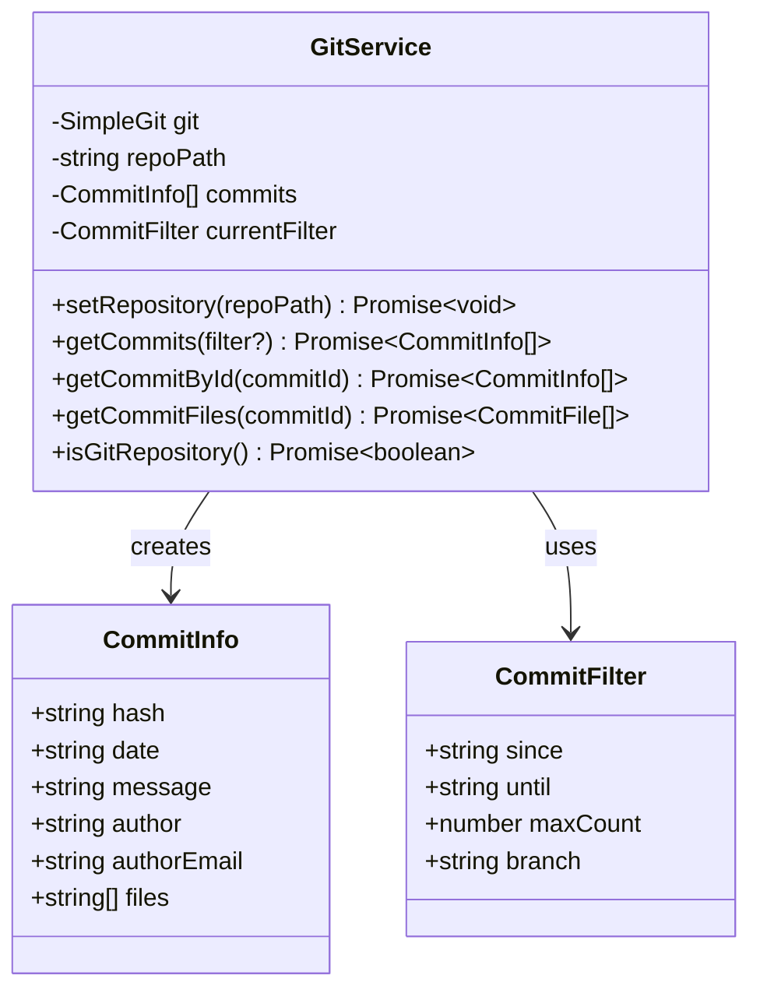
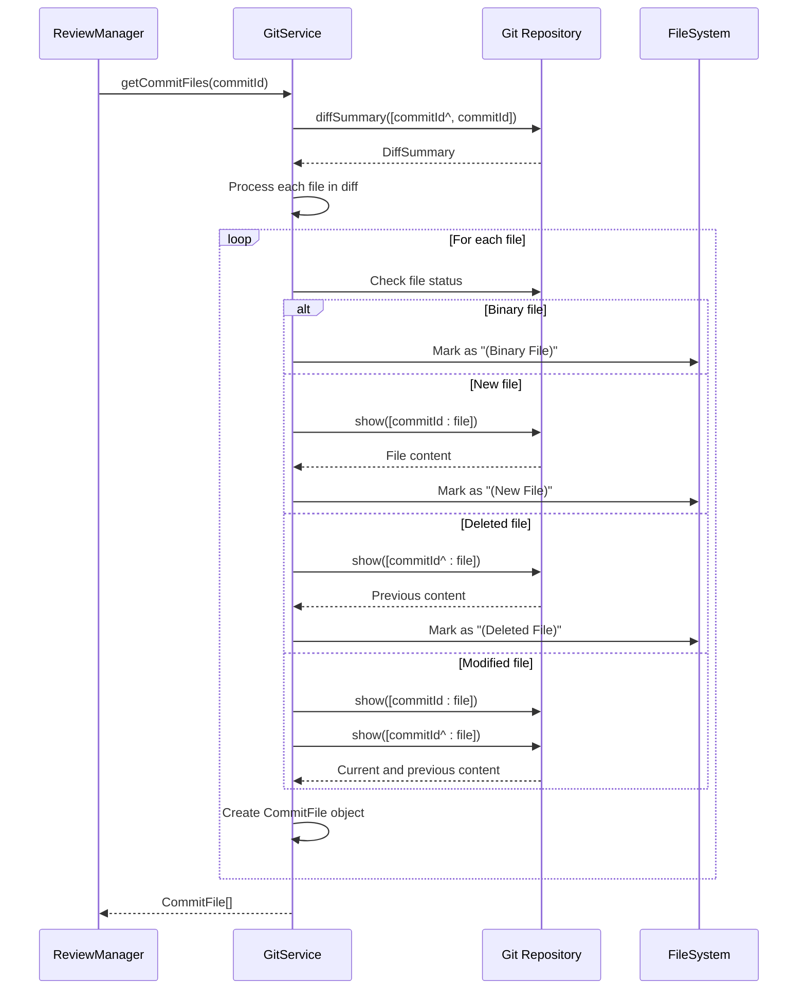
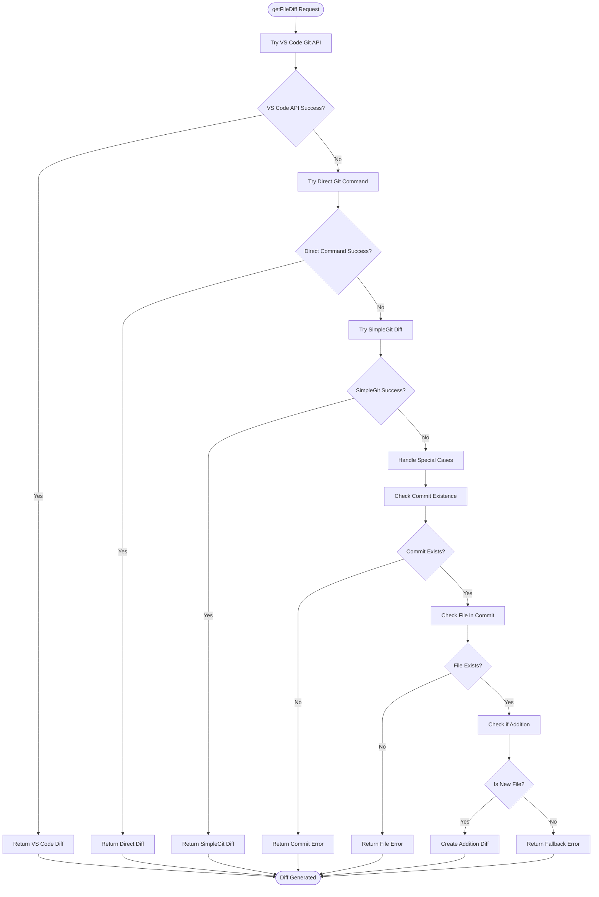
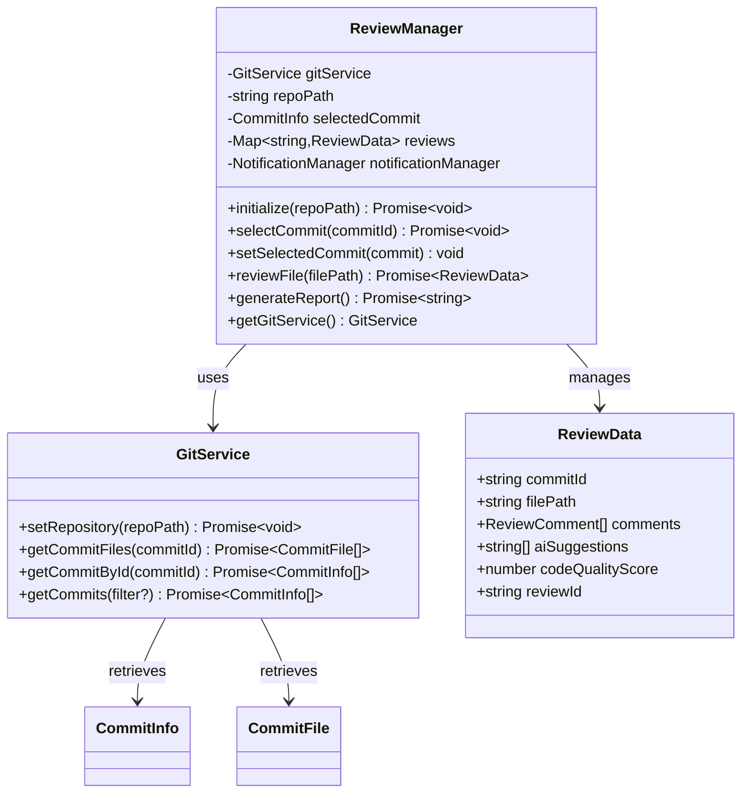
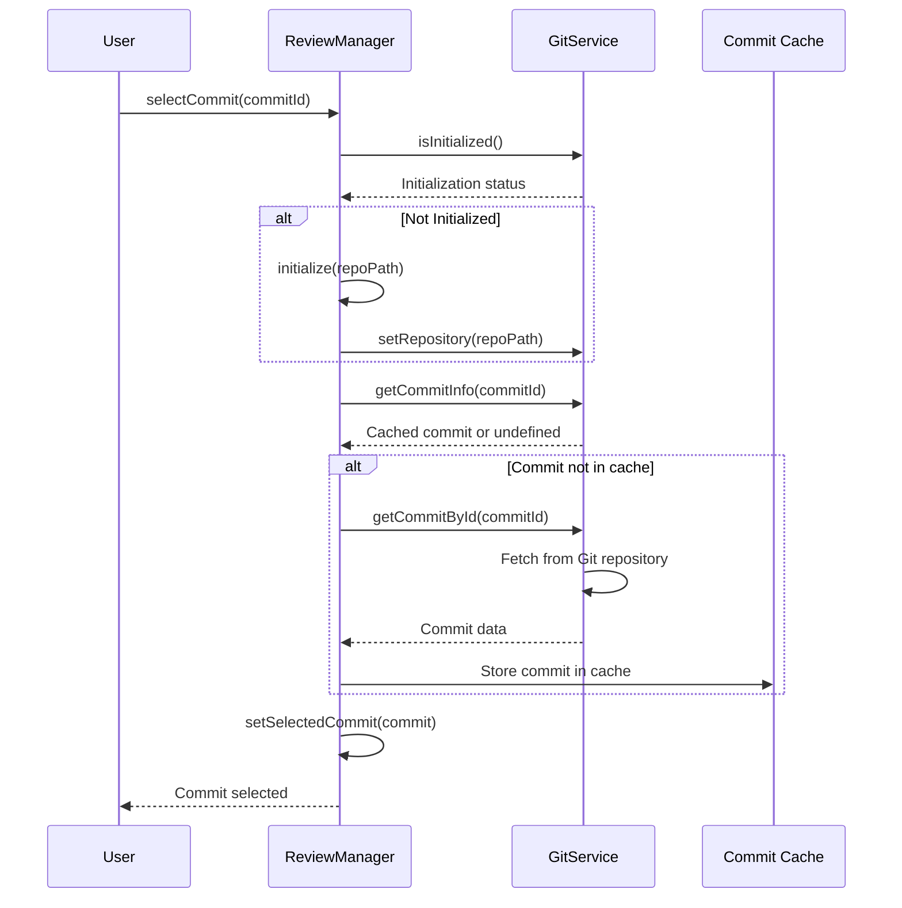
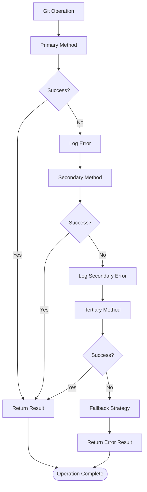
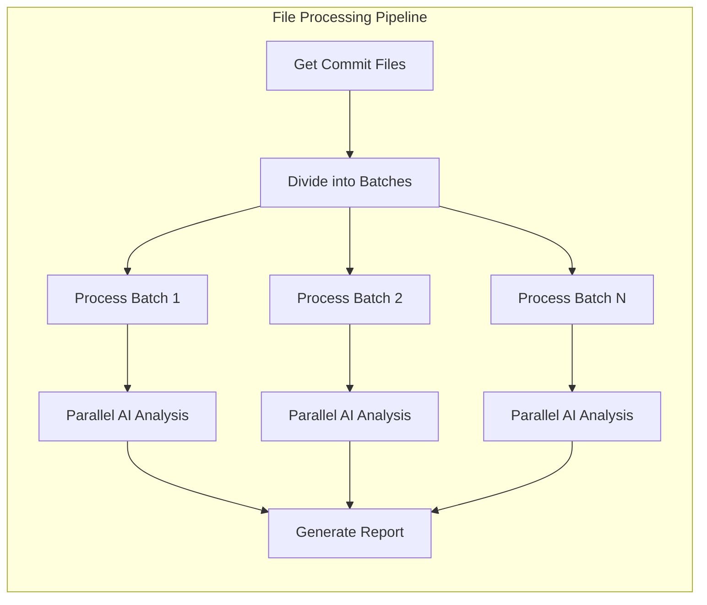

# Git Data Retrieval

<cite>
**Referenced Files in This Document**
- [gitService.ts](file://src/services/git/gitService.ts)
- [reviewManager.ts](file://src/services/review/reviewManager.ts)
- [versionControlTypes.ts](file://src/services/git/versionControlTypes.ts)
- [chatTypes.ts](file://src/models/chatTypes.ts)
- [notificationManager.ts](file://src/services/notification/notificationManager.ts)
- [fileUtils.ts](file://src/utils/fileUtils.ts)
</cite>

## Table of Contents
1. [Introduction](#introduction)
2. [System Architecture](#system-architecture)
3. [GitService Core Components](#gitservice-core-components)
4. [Data Retrieval Methods](#data-retrieval-methods)
5. [ReviewManager Integration](#reviewmanager-integration)
6. [Error Handling and Caching](#error-handling-and-caching)
7. [Performance Optimization](#performance-optimization)
8. [Common Issues and Solutions](#common-issues-and-solutions)
9. [Implementation Examples](#implementation-examples)
10. [Best Practices](#best-practices)

## Introduction

The CodeKarmic system's Git data retrieval phase is a sophisticated component responsible for extracting commit information, file changes, and content from Git repositories. This system serves as the foundation for automated code review processes, providing essential data to the AI analysis engine and user interface components.

The Git data retrieval system operates through two primary services: the **GitService**, which handles low-level Git operations and data extraction, and the **ReviewManager**, which orchestrates the review process and coordinates between various system components. Together, they provide a robust framework for analyzing code changes across different commit histories.

## System Architecture

The Git data retrieval system follows a layered architecture with clear separation of concerns:



**Diagram sources**
- [reviewManager.ts](file://src/services/review/reviewManager.ts#L79-L93)
- [gitService.ts](file://src/services/git/gitService.ts#L45-L54)

The architecture ensures that:
- **Separation of Concerns**: Git operations are isolated in GitService, while ReviewManager handles orchestration
- **Fault Tolerance**: Multiple fallback methods prevent single points of failure
- **Performance Optimization**: Intelligent caching and parallel processing
- **Extensibility**: Modular design allows easy addition of new Git operations

**Section sources**
- [reviewManager.ts](file://src/services/review/reviewManager.ts#L79-L93)
- [gitService.ts](file://src/services/git/gitService.ts#L45-L54)

## GitService Core Components

### Repository Initialization and Management

The GitService begins with comprehensive repository initialization that validates the Git environment and establishes connections:



**Diagram sources**
- [gitService.ts](file://src/services/git/gitService.ts#L64-L107)

The initialization process includes:
- **Path Validation**: Ensures the repository path exists and contains a `.git` directory
- **SimpleGit Configuration**: Sets up the Git client with optimal parameters for concurrent operations
- **Cache Management**: Clears existing filters and commit caches to ensure fresh data
- **Error Handling**: Provides detailed error messages for troubleshooting

### Commit Information Extraction

The system extracts comprehensive commit metadata through multiple strategies:



**Diagram sources**
- [gitService.ts](file://src/services/git/gitService.ts#L28-L44)
- [gitService.ts](file://src/services/git/gitService.ts#L45-L54)

**Section sources**
- [gitService.ts](file://src/services/git/gitService.ts#L64-L107)
- [gitService.ts](file://src/services/git/gitService.ts#L197-L242)

## Data Retrieval Methods

### getCommitFiles Method Implementation

The `getCommitFiles` method is central to the Git data retrieval system, extracting detailed information about files changed in a specific commit:



**Diagram sources**
- [gitService.ts](file://src/services/git/gitService.ts#L110-L177)

The method handles four distinct file states:
- **Binary Files**: Marked with `(Binary File)` placeholder
- **New Files**: Retrieved from current commit with `(New File)` marker
- **Deleted Files**: Retrieved from parent commit with `(Deleted File)` marker
- **Modified Files**: Both current and previous versions retrieved

### getFileDiff Method Implementation

The `getFileDiff` method implements a sophisticated strategy pattern for generating file differences:



**Diagram sources**
- [gitService.ts](file://src/services/git/gitService.ts#L707-L794)

The method employs four strategic approaches:
1. **VS Code Git API**: Fastest method when available
2. **Direct Git Commands**: Optimized Git command execution
3. **SimpleGit Library**: Reliable fallback using the library
4. **Special Case Handling**: Manual diff generation for edge cases

**Section sources**
- [gitService.ts](file://src/services/git/gitService.ts#L110-L177)
- [gitService.ts](file://src/services/git/gitService.ts#L707-L794)

## ReviewManager Integration

### Orchestration of Git Operations

The ReviewManager acts as the coordinator between user interface components and Git data retrieval services:



**Diagram sources**
- [reviewManager.ts](file://src/services/review/reviewManager.ts#L79-L93)
- [gitService.ts](file://src/services/git/gitService.ts#L45-L54)

### Commit Selection and Caching

The ReviewManager implements intelligent caching for commit data:



**Diagram sources**
- [reviewManager.ts](file://src/services/review/reviewManager.ts#L149-L206)

**Section sources**
- [reviewManager.ts](file://src/services/review/reviewManager.ts#L149-L206)
- [reviewManager.ts](file://src/services/review/reviewManager.ts#L79-L93)

## Error Handling and Caching

### Multi-Level Error Recovery

The system implements comprehensive error handling with multiple fallback strategies:



**Diagram sources**
- [gitService.ts](file://src/services/git/gitService.ts#L110-L177)
- [gitService.ts](file://src/services/git/gitService.ts#L707-L794)

### Caching Strategies

The system employs multiple caching layers for optimal performance:

| Cache Level | Scope | Duration | Purpose |
|-------------|-------|----------|---------|
| Memory Cache | Current Session | Session Lifetime | Frequently accessed commits |
| Filter Cache | Current Filter | Filter Change | Prevent unnecessary re-computation |
| File Content Cache | Individual Files | Until Repository Change | Reduce redundant Git operations |
| Commit Metadata Cache | Full Commit History | Repository Refresh | Speed up commit traversal |

**Section sources**
- [gitService.ts](file://src/services/git/gitService.ts#L813-L846)
- [gitService.ts](file://src/services/git/gitService.ts#L1185-L1200)

## Performance Optimization

### Parallel Processing and Batching

The system optimizes performance through intelligent batching and parallel processing:



**Diagram sources**
- [reviewManager.ts](file://src/services/review/reviewManager.ts#L329-L369)

### Performance Metrics and Monitoring

The system includes comprehensive performance monitoring:

- **Execution Time Tracking**: Monitors duration of Git operations
- **Memory Usage Optimization**: Limits buffer sizes for large files
- **Concurrent Process Control**: Manages maximum concurrent Git operations
- **Progress Reporting**: Provides real-time feedback during long operations

**Section sources**
- [reviewManager.ts](file://src/services/review/reviewManager.ts#L329-L369)
- [gitService.ts](file://src/services/git/gitService.ts#L45-L54)

## Common Issues and Solutions

### Repository Initialization Problems

**Issue**: Git repository not found or invalid path
**Solution**: Comprehensive path validation with detailed error messages

**Issue**: Permission denied accessing repository
**Solution**: Check filesystem permissions and Git configuration

**Issue**: Large repository causing timeouts
**Solution**: Implement streaming operations and configurable timeouts

### Commit Retrieval Failures

**Issue**: Commit hash not found
**Solution**: Multiple fallback methods with smart commit existence checking

**Issue**: Network issues with remote repositories
**Solution**: Local caching and offline mode support

**Issue**: Corrupted Git history
**Solution**: Robust error handling with graceful degradation

### File Content Extraction Issues

**Issue**: Binary files causing errors
**Solution**: Automatic binary file detection and appropriate handling

**Issue**: Large files consuming memory
**Solution**: Streaming file content and size limits

**Issue**: Encoding problems with non-ASCII files
**Solution**: UTF-8 encoding detection and conversion

**Section sources**
- [gitService.ts](file://src/services/git/gitService.ts#L64-L107)
- [gitService.ts](file://src/services/git/gitService.ts#L800-L811)

## Implementation Examples

### Basic Commit Information Retrieval

```typescript
// Example: Retrieve commit information for a specific commit
const commitId = 'abc1234';
const commitInfo = await gitService.getCommitById(commitId);
console.log(`Commit: ${commitInfo[0].message}`);
console.log(`Author: ${commitInfo[0].author}`);
```

### File Change Analysis

```typescript
// Example: Get all files changed in a commit
const files = await gitService.getCommitFiles(commitId);
files.forEach(file => {
    console.log(`File: ${file.path}`);
    console.log(`Status: ${file.status}`);
    console.log(`Insertions: ${file.insertions}`);
    console.log(`Deletions: ${file.deletions}`);
});
```

### Differential Generation

```typescript
// Example: Generate diff for a specific file
const diff = await gitService.getFileDiff(commitId, 'src/main.ts');
console.log(diff);
```

### Error Handling Example

```typescript
// Example: Robust error handling for Git operations
try {
    const files = await gitService.getCommitFiles(commitId);
    // Process files...
} catch (error) {
    if (error.message.includes('not found')) {
        console.log('Commit not found, trying alternative methods...');
        // Fallback logic...
    } else {
        throw error; // Re-throw unexpected errors
    }
}
```

**Section sources**
- [gitService.ts](file://src/services/git/gitService.ts#L110-L177)
- [gitService.ts](file://src/services/git/gitService.ts#L707-L794)

## Best Practices

### Repository Management
- Always validate repository paths before initialization
- Use appropriate timeout values for Git operations
- Implement proper error logging and user feedback
- Cache frequently accessed commit data

### Performance Considerations
- Process files in batches for large commit histories
- Use parallel processing for independent operations
- Implement streaming for large file operations
- Monitor memory usage and implement limits

### Error Handling
- Provide meaningful error messages with context
- Implement multiple fallback strategies
- Log detailed error information for debugging
- Gracefully handle network and permission issues

### Security
- Validate all user-provided commit hashes
- Sanitize file paths to prevent directory traversal
- Implement rate limiting for Git operations
- Use secure communication channels for remote repositories

The Git data retrieval system in CodeKarmic demonstrates sophisticated engineering principles applied to version control data extraction. Through careful design of multiple fallback strategies, intelligent caching, and comprehensive error handling, it provides a reliable foundation for automated code review processes while maintaining excellent performance characteristics.