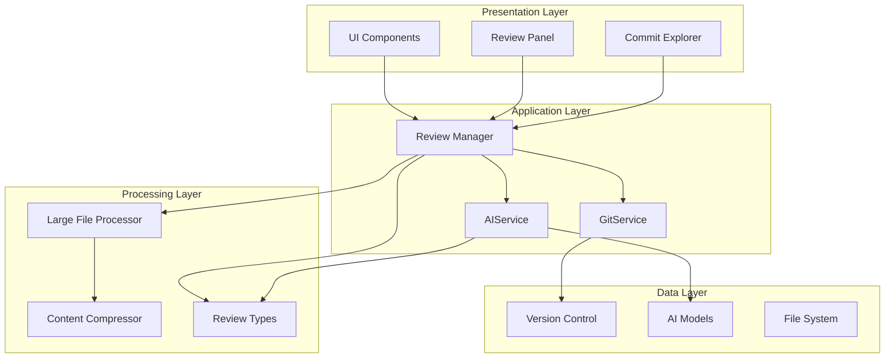
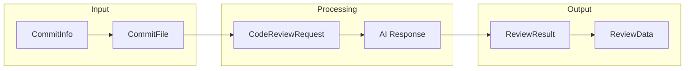
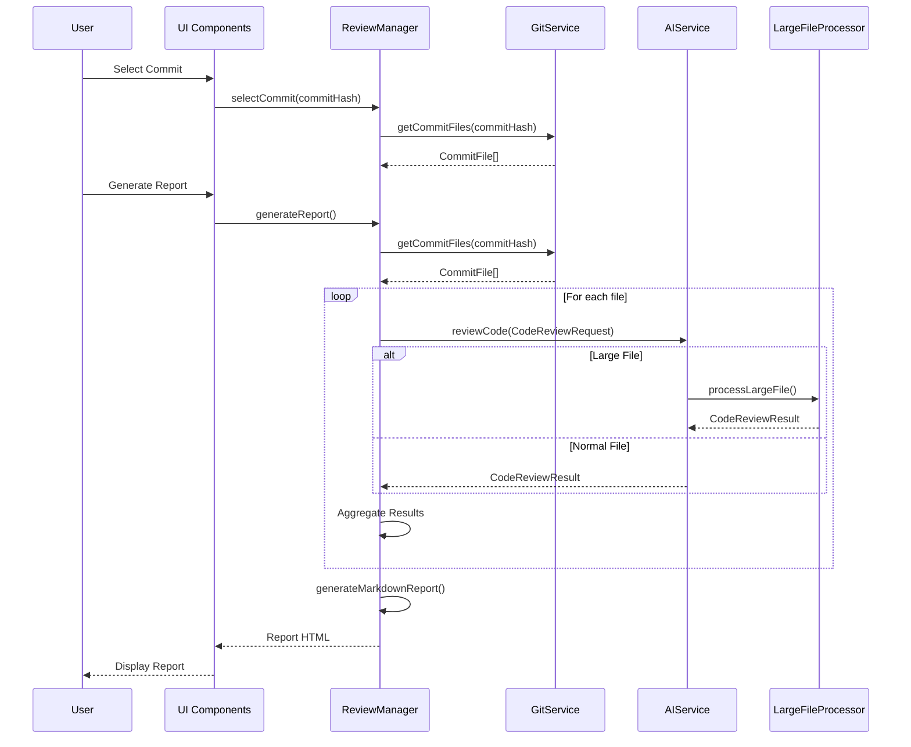
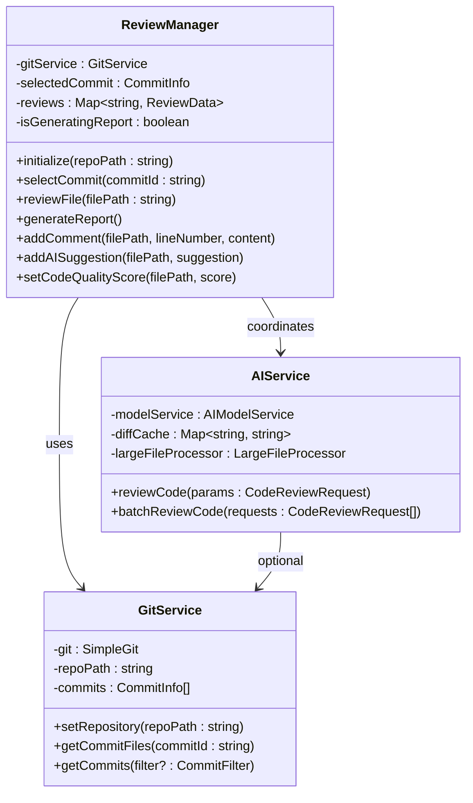

# Normal Flow

<cite>
**Referenced Files in This Document**
- [src/services/review/reviewManager.ts](file://src/services/review/reviewManager.ts)
- [src/services/git/gitService.ts](file://src/services/git/gitService.ts)
- [src/services/ai/aiService.ts](file://src/services/ai/aiService.ts)
- [src/ui/views/reviewPanel.ts](file://src/ui/views/reviewPanel.ts)
- [src/ui/components/commitExplorer.ts](file://src/ui/components/commitExplorer.ts)
- [src/core/compression/largeFileProcessor.ts](file://src/core/compression/largeFileProcessor.ts)
- [src/utils/fileUtils.ts](file://src/utils/fileUtils.ts)
- [src/models/types.ts](file://src/models/types.ts)
- [src/core/compression/compressionTypes.ts](file://src/core/compression/compressionTypes.ts)
- [src/services/git/versionControlTypes.ts](file://src/services/git/versionControlTypes.ts)
- [src/extension.ts](file://src/extension.ts)
</cite>

## Table of Contents
1. [Introduction](#introduction)
2. [System Architecture Overview](#system-architecture-overview)
3. [Data Models and Transformations](#data-models-and-transformations)
4. [Normal Data Flow Sequence](#normal-data-flow-sequence)
5. [Component Interactions](#component-interactions)
6. [Practical Example](#practical-example)
7. [Performance Considerations](#performance-considerations)
8. [Best Practices](#best-practices)
9. [Error Handling](#error-handling)
10. [Conclusion](#conclusion)

## Introduction

The CodeKarmic system implements a sophisticated code review workflow that transforms Git commit data through multiple processing stages to generate comprehensive reports. This document illustrates the complete normal data flow from user command initiation to final report generation, highlighting the architectural patterns and data transformations involved.

The system follows a layered architecture with clear separation of concerns, where UI components interact with the ReviewManager, which orchestrates data retrieval from GitService and processing through AIService. The flow demonstrates how raw Git commit information is transformed into actionable code review insights.

## System Architecture Overview

The CodeKarmic system employs a modular architecture with distinct layers responsible for different aspects of the code review process:



**Diagram sources**
- [src/services/review/reviewManager.ts](file://src/services/review/reviewManager.ts#L79-L93)
- [src/services/git/gitService.ts](file://src/services/git/gitService.ts#L45-L62)
- [src/services/ai/aiService.ts](file://src/services/ai/aiService.ts#L40-L72)

## Data Models and Transformations

The system operates on several key data models that undergo transformation throughout the processing pipeline:

### Core Data Models

| Model | Purpose | Transformation Stage |
|-------|---------|---------------------|
| **CommitInfo** | Git commit metadata | Initial retrieval |
| **CommitFile** | File content and status | GitService processing |
| **CodeReviewRequest** | AI analysis input | AIService preparation |
| **CodeReviewResult** | AI analysis output | AIService processing |
| **ReviewData** | Complete review state | ReviewManager aggregation |

### Data Model Transformations



**Diagram sources**
- [src/services/git/gitService.ts](file://src/services/git/gitService.ts#L19-L44)
- [src/services/ai/aiService.ts](file://src/services/ai/aiService.ts#L15-L32)
- [src/services/review/reviewManager.ts](file://src/services/review/reviewManager.ts#L11-L26)

**Section sources**
- [src/services/git/gitService.ts](file://src/services/git/gitService.ts#L19-L44)
- [src/services/ai/aiService.ts](file://src/services/ai/aiService.ts#L15-L32)
- [src/services/review/reviewManager.ts](file://src/services/review/reviewManager.ts#L11-L26)

## Normal Data Flow Sequence

The normal data flow follows a predictable sequence from user interaction to report generation:



**Diagram sources**
- [src/services/review/reviewManager.ts](file://src/services/review/reviewManager.ts#L372-L661)
- [src/services/git/gitService.ts](file://src/services/git/gitService.ts#L110-L177)
- [src/services/ai/aiService.ts](file://src/services/ai/aiService.ts#L74-L118)

### Detailed Flow Steps

1. **User Selection Phase**
   - User selects a commit through CommitExplorer
   - Commit hash is passed to ReviewManager
   - ReviewManager validates and caches the commit information

2. **File Retrieval Phase**
   - ReviewManager requests commit files from GitService
   - GitService retrieves file content and metadata
   - Files are categorized by size for processing optimization

3. **Parallel Processing Phase**
   - ReviewManager divides files into batches
   - Each batch is processed concurrently by AIService
   - Large files are handled by LargeFileProcessor with compression

4. **AI Analysis Phase**
   - AIService receives CodeReviewRequest with file content
   - AI model processes the code and generates suggestions
   - Results are returned as CodeReviewResult objects

5. **Report Generation Phase**
   - ReviewManager aggregates all results
   - Markdown report is generated with formatted content
   - Report is displayed in WebView panel

**Section sources**
- [src/services/review/reviewManager.ts](file://src/services/review/reviewManager.ts#L372-L661)
- [src/services/git/gitService.ts](file://src/services/git/gitService.ts#L110-L177)
- [src/services/ai/aiService.ts](file://src/services/ai/aiService.ts#L74-L118)

## Component Interactions

The system exhibits clear component interactions with well-defined interfaces:

### ReviewManager Orchestrator

The ReviewManager serves as the central coordinator, managing the entire review workflow:



**Diagram sources**
- [src/services/review/reviewManager.ts](file://src/services/review/reviewManager.ts#L79-L93)
- [src/services/git/gitService.ts](file://src/services/git/gitService.ts#L45-L62)
- [src/services/ai/aiService.ts](file://src/services/ai/aiService.ts#L40-L72)

### Data Flow Patterns

The system implements several key data flow patterns:

1. **Pipeline Pattern**: Data flows sequentially through processing stages
2. **Batch Processing**: Multiple files are processed concurrently
3. **Caching Pattern**: Diff content and AI results are cached for reuse
4. **Event-Driven Updates**: UI components react to data changes

**Section sources**
- [src/services/review/reviewManager.ts](file://src/services/review/reviewManager.ts#L79-L93)
- [src/services/git/gitService.ts](file://src/services/git/gitService.ts#L45-L62)
- [src/services/ai/aiService.ts](file://src/services/ai/aiService.ts#L40-L72)

## Practical Example

Let's walk through a complete example of processing a Git commit with the CodeKarmic system:

### Scenario: Processing a Python Code Change

**Initial State**: User selects commit `abc12345` containing changes to a Python script

**Step 1: Commit Selection**
- User clicks on commit in CommitExplorer
- Extension triggers `codekarmic.selectCommit` command
- ReviewManager caches commit information

**Step 2: File Discovery**
- ReviewManager calls `gitService.getCommitFiles('abc12345')`
- GitService returns:
  ```typescript
  [
    {
      path: 'src/main.py',
      content: 'def calculate_sum(a, b):\n    return a + b',
      previousContent: 'def calculate_sum(a, b):\n    return a + b + 1',
      status: 'modified',
      insertions: 1,
      deletions: 1
    }
  ]
  ```

**Step 3: AI Analysis**
- ReviewManager creates CodeReviewRequest:
  ```typescript
  {
    filePath: 'src/main.py',
    currentContent: 'def calculate_sum(a, b):\n    return a + b',
    previousContent: 'def calculate_sum(a, b):\n    return a + b + 1',
    includeDiffAnalysis: true
  }
  ```
- AIService processes the request and returns:
  ```typescript
  {
    suggestions: [
      'Consider adding type hints for better code clarity',
      'The function could benefit from input validation',
      'Potential integer overflow issue with large numbers'
    ],
    score: 7.5,
    diffContent: '--- a/src/main.py\n+++ b/src/main.py\n@@ -1,2 +1,2 @@\ndef calculate_sum(a, b):\n-return a + b + 1\n+return a + b'
  }
  ```

**Step 4: Report Generation**
- ReviewManager aggregates results and generates Markdown:
  ```markdown
  # Code Review Report
  
  ## Commit Information
  - Commit ID: `abc12345`
  - Message: "Fix calculation bug"
  
  ## File: src/main.py
  
  ### Suggestions
  - Consider adding type hints for better code clarity
  - The function could benefit from input validation
  - Potential integer overflow issue with large numbers
  
  ### Quality Score: 7.5/10
  ```

**Section sources**
- [src/services/git/gitService.ts](file://src/services/git/gitService.ts#L110-L177)
- [src/services/ai/aiService.ts](file://src/services/ai/aiService.ts#L74-L118)
- [src/services/review/reviewManager.ts](file://src/services/review/reviewManager.ts#L372-L661)

## Performance Considerations

The system implements several performance optimization strategies:

### Concurrent Processing
- Files are processed in batches of 5 using `ReviewManager.BATCH_SIZE`
- Parallel AI analysis reduces overall processing time
- Progress tracking provides user feedback during long operations

### Memory Management
- Large files are compressed before AI processing
- Diff content is cached to avoid redundant calculations
- Review data is stored efficiently in Maps for quick access

### Network Optimization
- Git operations use efficient APIs and caching
- AI requests are batched when possible
- Streaming responses improve responsiveness

### Scalability Features
- Configurable batch sizes for different workloads
- Automatic compression for large files (>20KB)
- Intelligent retry mechanisms for failed operations

**Section sources**
- [src/services/review/reviewManager.ts](file://src/services/review/reviewManager.ts#L80-L82)
- [src/core/compression/largeFileProcessor.ts](file://src/core/compression/largeFileProcessor.ts#L47-L49)
- [src/services/ai/aiService.ts](file://src/services/ai/aiService.ts#L431-L552)

## Best Practices

### Data Flow Optimization
1. **Minimize Redundant Operations**: Cache Git commit data and diff content
2. **Batch Processing**: Process multiple files concurrently when possible
3. **Lazy Loading**: Load file content only when needed for analysis
4. **Progress Feedback**: Provide real-time progress updates for long operations

### Error Handling
1. **Graceful Degradation**: Continue processing other files if one fails
2. **Retry Logic**: Implement exponential backoff for transient failures
3. **User Communication**: Provide meaningful error messages and recovery options
4. **Logging**: Comprehensive logging for debugging and monitoring

### Resource Management
1. **Memory Efficiency**: Use streaming for large files and content
2. **Network Optimization**: Minimize API calls and use appropriate timeouts
3. **Concurrency Limits**: Balance parallel processing with system resources
4. **Cleanup**: Properly dispose of resources and clear caches

**Section sources**
- [src/services/review/reviewManager.ts](file://src/services/review/reviewManager.ts#L101-L109)
- [src/services/ai/aiService.ts](file://src/services/ai/aiService.ts#L691-L710)
- [src/core/compression/largeFileProcessor.ts](file://src/core/compression/largeFileProcessor.ts#L141-L155)

## Error Handling

The system implements comprehensive error handling across all components:

### Error Classification
- **Initialization Errors**: Repository setup and service initialization failures
- **Communication Errors**: Git operations and AI service connectivity issues
- **Processing Errors**: File parsing and analysis failures
- **User Errors**: Invalid input and permission issues

### Recovery Strategies
1. **Automatic Retry**: Transient failures are automatically retried
2. **Fallback Processing**: Alternative methods when primary approaches fail
3. **Partial Results**: Continue processing other files when some fail
4. **User Notification**: Clear error messages with suggested actions

### Logging and Monitoring
- Structured logging with severity levels
- Performance metrics collection
- Error tracking for system improvement
- User feedback mechanisms

**Section sources**
- [src/services/review/reviewManager.ts](file://src/services/review/reviewManager.ts#L101-L109)
- [src/services/git/gitService.ts](file://src/services/git/gitService.ts#L175-L177)
- [src/services/ai/aiService.ts](file://src/services/ai/aiService.ts#L691-L710)

## Conclusion

The CodeKarmic system demonstrates a well-architected approach to automated code review, with clear data flow patterns and robust error handling. The normal data flow from user command to final report generation showcases the system's ability to handle complex Git-based code review scenarios efficiently.

Key architectural strengths include:
- **Modular Design**: Clear separation of concerns across components
- **Performance Optimization**: Concurrent processing and intelligent caching
- **Scalability**: Configurable batch sizes and automatic compression
- **Reliability**: Comprehensive error handling and graceful degradation

The system successfully transforms Git commit data through multiple processing stages, providing developers with actionable insights and comprehensive reports that enhance code quality and development workflows.