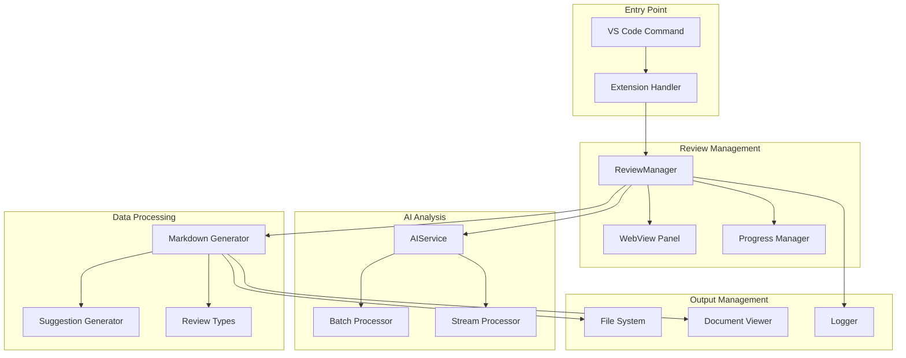
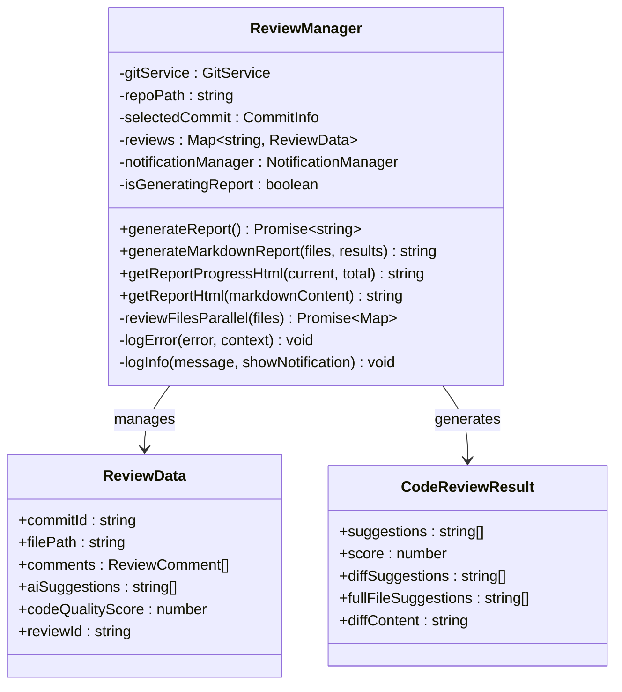
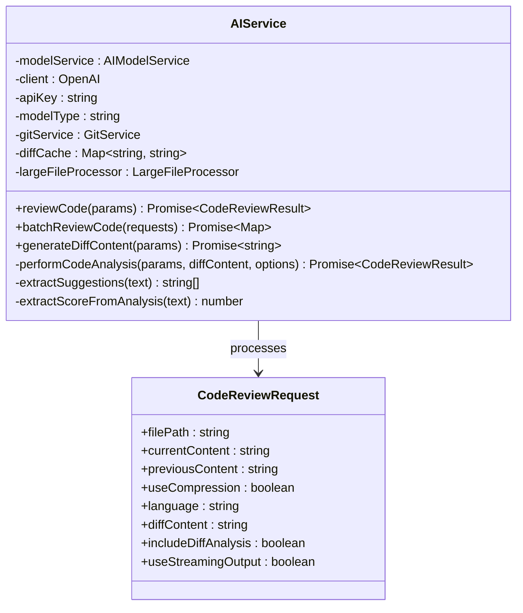
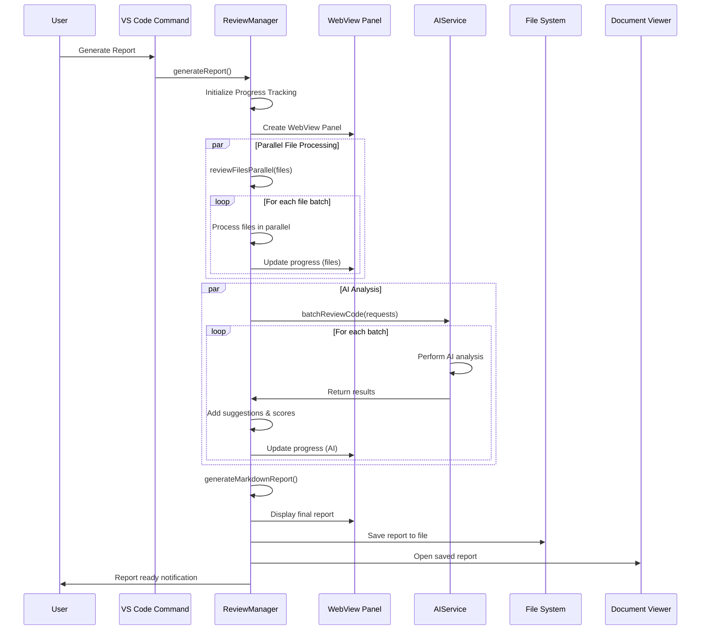
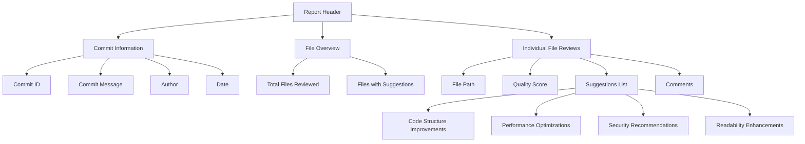
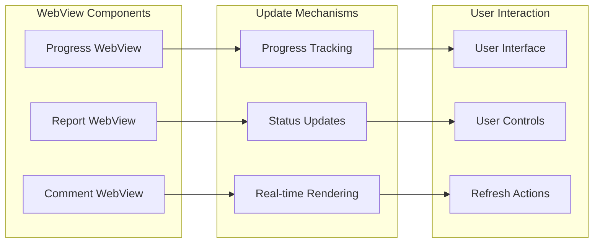
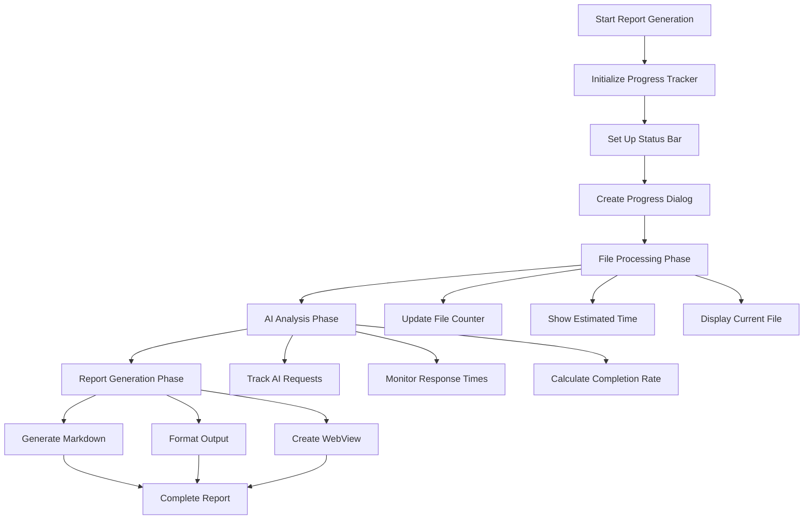
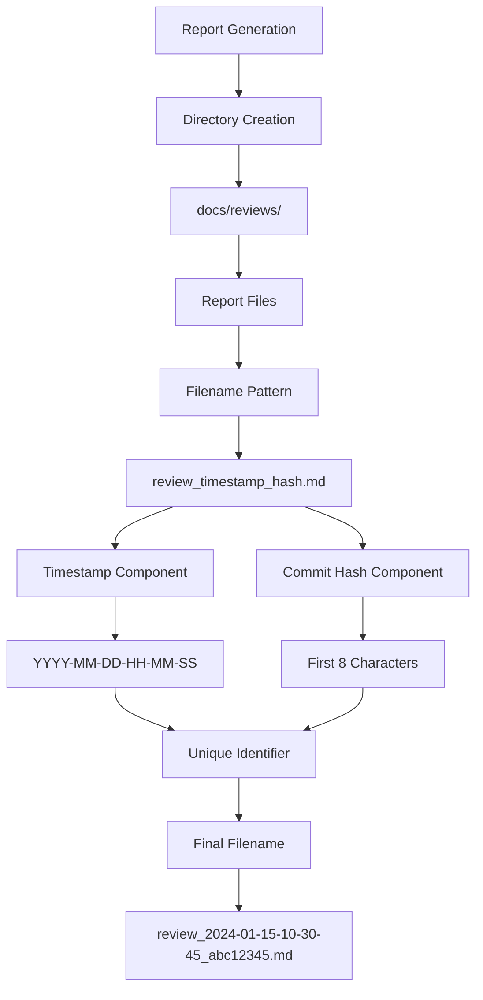
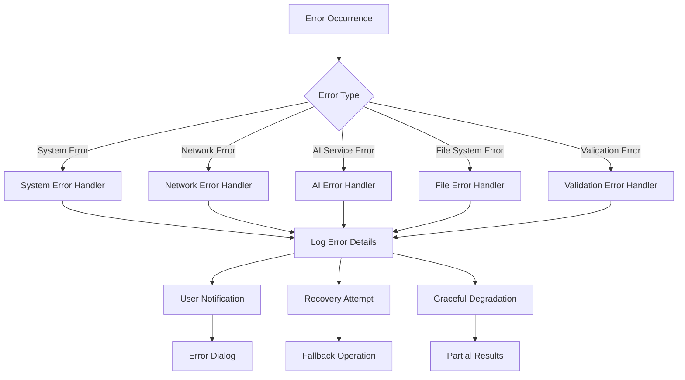
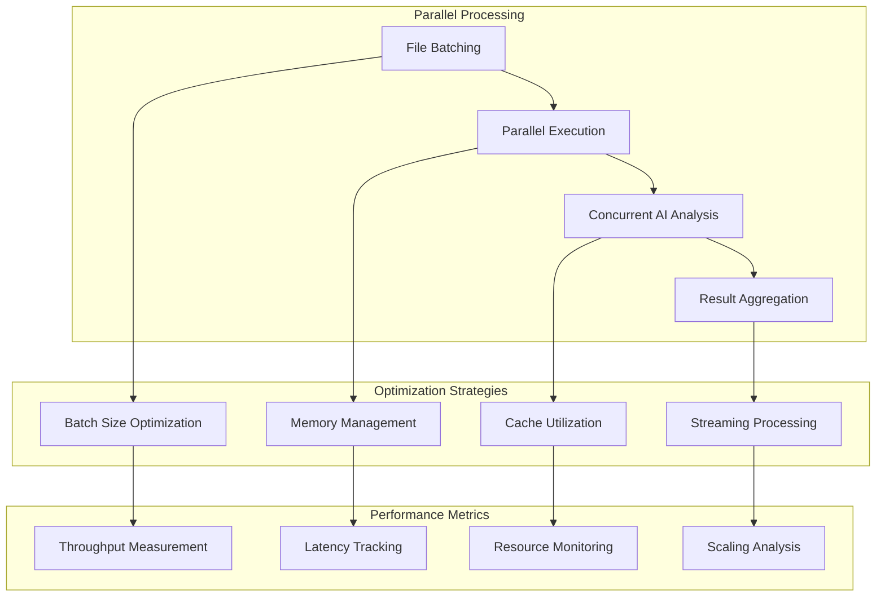

# Report Generation

<cite>
**Referenced Files in This Document**
- [reviewManager.ts](file://src/services/review/reviewManager.ts)
- [aiService.ts](file://src/services/ai/aiService.ts)
- [reviewPanel.ts](file://src/ui/views/reviewPanel.ts)
- [extension.ts](file://src/extension.ts)
- [suggestionGenerator.ts](file://src/core/review/suggestionGenerator.ts)
- [reviewTypes.ts](file://src/core/review/reviewTypes.ts)
- [index.ts](file://src/i18n/index.ts)
</cite>

## Table of Contents
1. [Introduction](#introduction)
2. [System Architecture](#system-architecture)
3. [Core Components](#core-components)
4. [Report Generation Workflow](#report-generation-workflow)
5. [Markdown Report Structure](#markdown-report-structure)
6. [WebView Integration](#webview-integration)
7. [Progress Tracking and Notifications](#progress-tracking-and-notifications)
8. [File Saving and Management](#file-saving-and-management)
9. [Error Handling](#error-handling)
10. [Performance Optimization](#performance-optimization)
11. [Common Issues and Solutions](#common-issues-and-solutions)
12. [Best Practices](#best-practices)

## Introduction

The CodeKarmic report generation system is a sophisticated component that transforms code review results into comprehensive Markdown documents. This system orchestrates multiple processes including AI analysis, parallel file processing, and real-time progress updates to produce detailed code review reports that help developers understand code quality, identify improvement opportunities, and track project health.

The report generation process involves several key phases: collecting review data, performing AI analysis on multiple files concurrently, compiling results into structured Markdown format, and providing real-time feedback through WebView panels. The system is designed to handle large codebases efficiently while maintaining user experience through progress tracking and error recovery mechanisms.

## System Architecture

The report generation system follows a modular architecture with clear separation of concerns:

**Diagram sources**
- [reviewManager.ts](file://src/services/review/reviewManager.ts#L372-L661)
- [aiService.ts](file://src/services/ai/aiService.ts#L40-L787)
- [reviewPanel.ts](file://src/ui/views/reviewPanel.ts#L1-L621)

## Core Components

### ReviewManager

The ReviewManager serves as the central orchestrator for report generation, managing the entire workflow from file collection to final report compilation.

**Diagram sources**
- [reviewManager.ts](file://src/services/review/reviewManager.ts#L79-L270)
- [reviewTypes.ts](file://src/core/review/reviewTypes.ts#L75-L125)

### AIService

The AIService handles artificial intelligence-powered code analysis, providing intelligent suggestions and quality scoring for reviewed files.

**Diagram sources**
- [aiService.ts](file://src/services/ai/aiService.ts#L15-L32)
- [aiService.ts](file://src/services/ai/aiService.ts#L40-L787)

**Section sources**
- [reviewManager.ts](file://src/services/review/reviewManager.ts#L79-L270)
- [aiService.ts](file://src/services/ai/aiService.ts#L40-L787)

## Report Generation Workflow

The report generation process follows a sophisticated multi-stage workflow designed for efficiency and reliability:

**Diagram sources**
- [reviewManager.ts](file://src/services/review/reviewManager.ts#L372-L661)
- [aiService.ts](file://src/services/ai/aiService.ts#L431-L552)

### Phase 1: File Collection and Preparation

The system begins by collecting all files from the selected Git commit and preparing them for analysis:

1. **Commit Validation**: Ensures a valid commit is selected with a valid hash
2. **File Discovery**: Retrieves all files changed in the selected commit
3. **Parallel Processing Setup**: Divides files into batches for concurrent processing
4. **Progress Initialization**: Sets up progress tracking and WebView updates

### Phase 2: AI Analysis Execution

The AI analysis phase performs intelligent code review on collected files:

1. **Batch Processing**: Groups files by size and complexity for optimal processing
2. **Concurrent Analysis**: Processes multiple files simultaneously using AI models
3. **Result Aggregation**: Collects and organizes AI-generated suggestions and scores
4. **Progress Updates**: Provides real-time feedback on analysis completion

### Phase 3: Report Compilation

The final phase compiles all collected data into a structured Markdown report:

1. **Template Processing**: Applies Markdown templates to organize content
2. **Data Integration**: Incorporates AI suggestions, quality scores, and metadata
3. **Formatting**: Ensures consistent presentation across all report sections
4. **WebView Rendering**: Converts Markdown to HTML for web-based display

**Section sources**
- [reviewManager.ts](file://src/services/review/reviewManager.ts#L372-L661)

## Markdown Report Structure

The generated Markdown reports follow a standardized structure that provides comprehensive code review information:

### Report Template Structure

**Diagram sources**
- [reviewManager.ts](file://src/services/review/reviewManager.ts#L787-L848)

### Content Organization

The report is organized into logical sections for easy navigation:

1. **Header Section**: Contains commit metadata and overview statistics
2. **File Overview**: Summarizes findings across all reviewed files
3. **Individual File Reports**: Detailed analysis for each file
4. **Suggestions Index**: Consolidated list of all recommendations
5. **Quality Metrics**: Numerical assessment of code quality

### Formatting Standards

The Markdown generation ensures consistent formatting:

- **Headings**: Hierarchical structure using `#`, `##`, `###` for sections
- **Lists**: Ordered and unordered lists for suggestions and findings
- **Code Blocks**: Syntax-highlighted blocks for code examples
- **Tables**: Structured data presentation where appropriate
- **Links**: Internal cross-references between sections

**Section sources**
- [reviewManager.ts](file://src/services/review/reviewManager.ts#L787-L848)

## WebView Integration

The WebView system provides real-time visual feedback during report generation, enhancing user experience through interactive progress indicators and live previews.

### WebView Architecture

**Diagram sources**
- [reviewManager.ts](file://src/services/review/reviewManager.ts#L445-L464)
- [reviewManager.ts](file://src/services/review/reviewManager.ts#L666-L759)

### Progress Visualization

The WebView displays dynamic progress information through HTML/CSS components:

1. **Progress Bar**: Visual representation of completion percentage
2. **Status Messages**: Real-time updates on current processing stage
3. **File Counters**: Current vs. total file processing indicators
4. **Estimated Time**: Remaining time calculations for long-running operations

### Live Report Preview

During report generation, the WebView provides live previews of the evolving report:

1. **Incremental Updates**: Shows report sections as they become available
2. **Interactive Elements**: Allows users to navigate through report sections
3. **Error Display**: Highlights issues and provides troubleshooting guidance
4. **Download Options**: Enables immediate report export and sharing

**Section sources**
- [reviewManager.ts](file://src/services/review/reviewManager.ts#L445-L464)
- [reviewManager.ts](file://src/services/review/reviewManager.ts#L666-L759)

## Progress Tracking and Notifications

The system implements comprehensive progress tracking to keep users informed about report generation status and provide timely feedback on operation completion.

### Progress Monitoring System

**Diagram sources**
- [reviewManager.ts](file://src/services/review/reviewManager.ts#L466-L647)

### Notification Management

The notification system provides contextual feedback at various stages:

1. **Initialization Notifications**: Confirm system readiness and configuration
2. **Processing Notifications**: Update users on current operation status
3. **Completion Notifications**: Signal successful operation completion
4. **Error Notifications**: Alert users to issues requiring attention
5. **Progress Notifications**: Provide incremental updates during long operations

### Status Indicators

Multiple status indicators work together to provide comprehensive feedback:

- **Status Bar**: Persistent progress information in VS Code status area
- **Progress Dialog**: Modal dialog showing detailed progress information
- **Notification Center**: Non-blocking notifications for user attention
- **WebView Updates**: Real-time updates in the report preview panel

**Section sources**
- [reviewManager.ts](file://src/services/review/reviewManager.ts#L466-L647)

## File Saving and Management

The report generation system includes robust file management capabilities for storing, organizing, and accessing generated reports.

### File Organization Strategy

**Diagram sources**
- [extension.ts](file://src/extension.ts#L200-L219)

### Storage Implementation

The file saving process follows a structured approach:

1. **Directory Validation**: Ensures the target directory exists or creates it
2. **Filename Generation**: Creates unique filenames using timestamps and commit hashes
3. **Atomic Writes**: Uses safe file writing to prevent corruption
4. **Workspace Integration**: Opens the saved file in the VS Code editor
5. **Notification Feedback**: Confirms successful file creation and location

### File Management Features

The system provides comprehensive file management capabilities:

- **Automatic Directory Creation**: Creates necessary directory structure
- **Timestamp-Based Naming**: Prevents filename conflicts with unique identifiers
- **Workspace Integration**: Opens files directly in the editor for immediate review
- **Error Recovery**: Handles file system errors gracefully
- **Cleanup Operations**: Manages temporary files and cache data

**Section sources**
- [extension.ts](file://src/extension.ts#L200-L239)

## Error Handling

The report generation system implements comprehensive error handling to ensure reliable operation and provide meaningful feedback when issues occur.

### Error Classification System

**Diagram sources**
- [reviewManager.ts](file://src/services/review/reviewManager.ts#L101-L108)
- [aiService.ts](file://src/services/ai/aiService.ts#L691-L709)

### Error Recovery Strategies

The system employs multiple error recovery approaches:

1. **Graceful Degradation**: Continues operation with reduced functionality when possible
2. **Fallback Processing**: Uses alternative methods when primary approaches fail
3. **Retry Mechanisms**: Automatically retries failed operations with exponential backoff
4. **Partial Results**: Returns available data even when some operations fail
5. **User Guidance**: Provides actionable suggestions for resolving issues

### Error Reporting

Comprehensive error reporting ensures effective troubleshooting:

- **Detailed Logging**: Captures complete error context and stack traces
- **User-Friendly Messages**: Presents errors in understandable language
- **Actionable Recommendations**: Suggests specific steps to resolve issues
- **Debug Information**: Provides technical details for advanced troubleshooting
- **Error Categories**: Organizes errors by type for efficient resolution

**Section sources**
- [reviewManager.ts](file://src/services/review/reviewManager.ts#L101-L108)
- [reviewManager.ts](file://src/services/review/reviewManager.ts#L649-L654)
- [aiService.ts](file://src/services/ai/aiService.ts#L691-L709)

## Performance Optimization

The report generation system incorporates multiple performance optimization strategies to handle large codebases efficiently while maintaining responsive user experience.

### Concurrent Processing Architecture

**Diagram sources**
- [reviewManager.ts](file://src/services/review/reviewManager.ts#L329-L369)
- [aiService.ts](file://src/services/ai/aiService.ts#L431-L552)

### Memory Management

Efficient memory usage prevents performance degradation with large codebases:

1. **Streaming Processing**: Processes files without loading entire datasets into memory
2. **Garbage Collection**: Explicit cleanup of temporary objects and caches
3. **Memory Monitoring**: Tracks memory usage and implements safeguards
4. **Lazy Loading**: Loads data only when required for processing

### Caching Strategies

Multiple caching layers optimize repeated operations:

- **Diff Content Cache**: Stores generated diff content to avoid recomputation
- **AI Response Cache**: Caches AI analysis results for identical files
- **File Metadata Cache**: Maintains file information for quick access
- **Progress State Cache**: Preserves intermediate processing state

### Scalability Considerations

The system is designed to scale with project size:

- **Adaptive Batching**: Adjusts batch sizes based on available resources
- **Load Balancing**: Distributes processing load across available cores
- **Resource Limits**: Implements safeguards against resource exhaustion
- **Progressive Enhancement**: Adds features based on available capacity

**Section sources**
- [reviewManager.ts](file://src/services/review/reviewManager.ts#L329-L369)
- [aiService.ts](file://src/services/ai/aiService.ts#L431-L552)

## Common Issues and Solutions

This section addresses frequently encountered problems during report generation and provides practical solutions.

### File Access Issues

**Problem**: Reports fail to save due to permission restrictions or missing directories.

**Solution**: 
- Verify write permissions in the target workspace directory
- Ensure the `docs/reviews/` directory structure exists
- Check for antivirus software blocking file operations
- Use administrator privileges if necessary

### AI Service Connectivity

**Problem**: AI analysis fails due to network issues or API limitations.

**Solution**:
- Verify internet connectivity and firewall settings
- Check API key validity and quota limits
- Implement retry logic with exponential backoff
- Monitor rate limiting and adjust request frequency

### Memory Constraints

**Problem**: Large codebases cause memory exhaustion during processing.

**Solution**:
- Reduce batch sizes for memory-constrained environments
- Enable streaming processing for large files
- Close unnecessary applications to free memory
- Increase system virtual memory if possible

### WebView Display Issues

**Problem**: Report WebView fails to render properly or shows incomplete content.

**Solution**:
- Clear VS Code cache and restart the application
- Check WebView security settings and script permissions
- Verify HTML generation and encoding
- Test with different VS Code versions and extensions

### Performance Degradation

**Problem**: Report generation takes excessive time for large projects.

**Solution**:
- Optimize batch sizes based on system capabilities
- Disable unnecessary features during report generation
- Use parallel processing effectively
- Monitor system resources and adjust accordingly

## Best Practices

Following established best practices ensures optimal report generation performance and reliability.

### Development Guidelines

1. **Error Handling**: Implement comprehensive error catching and recovery
2. **Resource Management**: Properly dispose of resources and clean up temporary data
3. **Logging**: Maintain detailed logs for debugging and monitoring
4. **Testing**: Test with various project sizes and configurations
5. **Documentation**: Keep documentation updated with system changes

### Performance Optimization

1. **Batch Processing**: Use appropriate batch sizes for concurrent operations
2. **Memory Efficiency**: Minimize memory footprint through streaming and lazy loading
3. **Cache Utilization**: Leverage caching for repeated operations
4. **Progress Feedback**: Provide meaningful progress updates to users
5. **Resource Monitoring**: Track system resources and implement safeguards

### User Experience

1. **Clear Communication**: Provide understandable progress information
2. **Responsive Design**: Ensure UI remains responsive during long operations
3. **Error Recovery**: Offer helpful error messages and recovery options
4. **Accessibility**: Support keyboard navigation and screen readers
5. **Consistency**: Maintain consistent behavior across different scenarios

### Security Considerations

1. **Input Validation**: Sanitize all user inputs and file contents
2. **Access Control**: Implement proper file system access controls
3. **Data Protection**: Secure sensitive information in logs and reports
4. **Privacy**: Respect user privacy and data protection regulations
5. **Audit Trails**: Maintain logs for security and compliance purposes