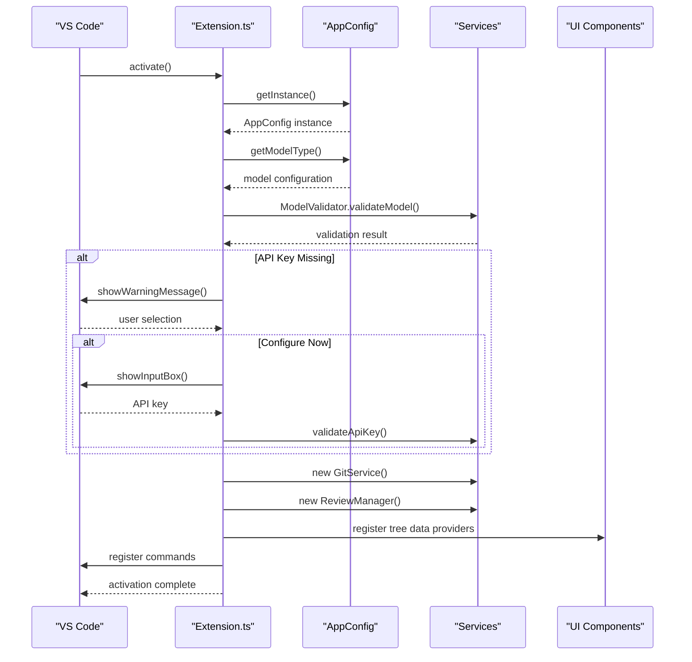
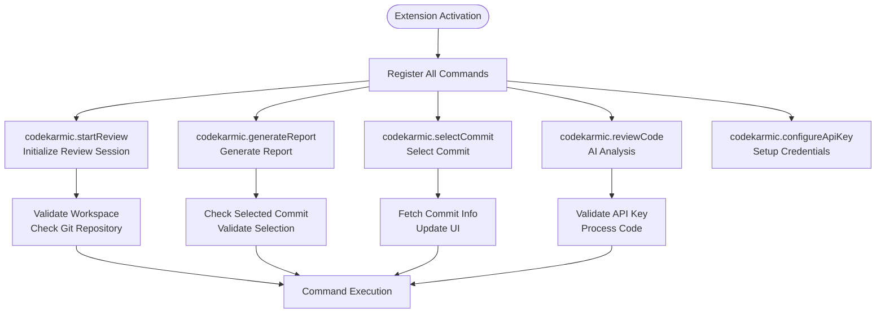
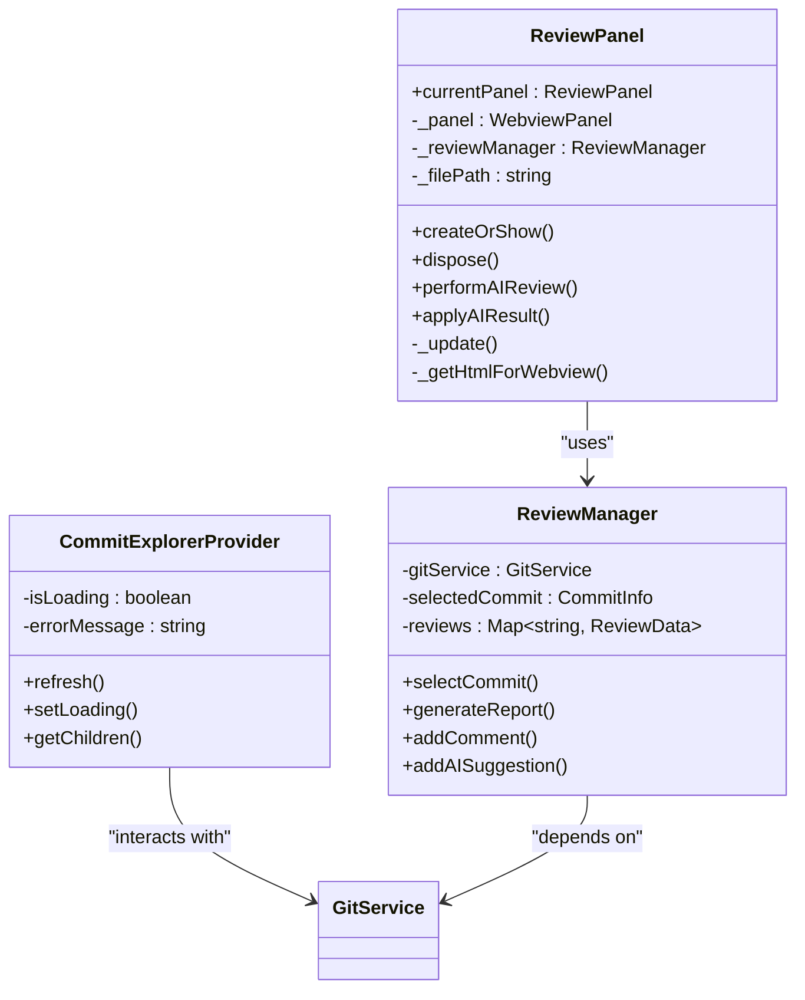
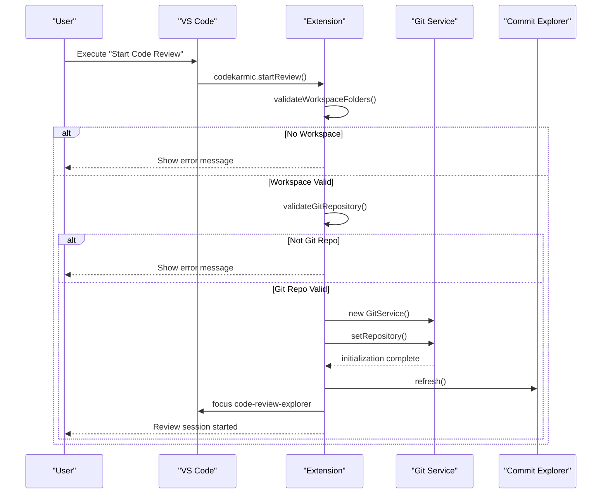
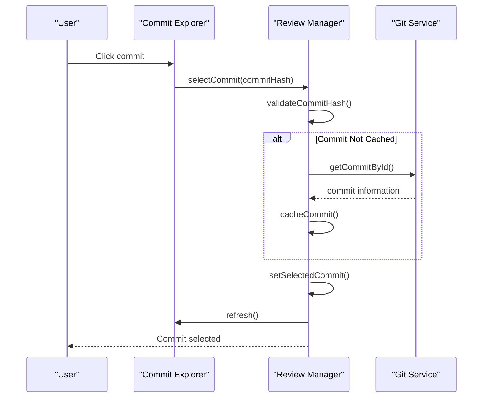
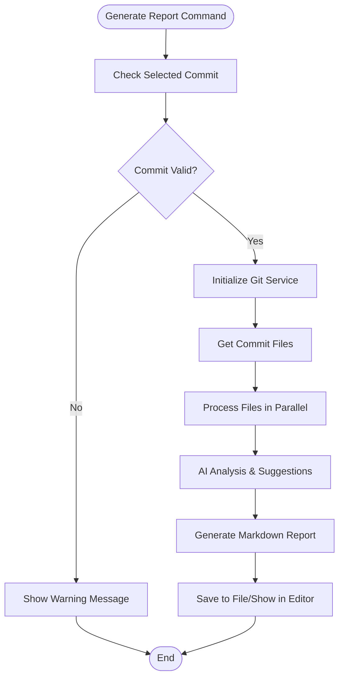
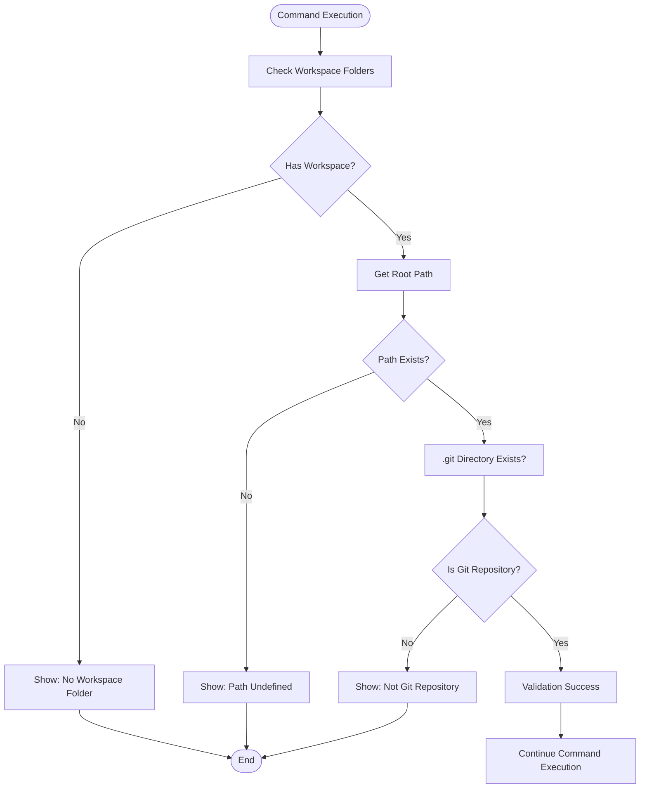
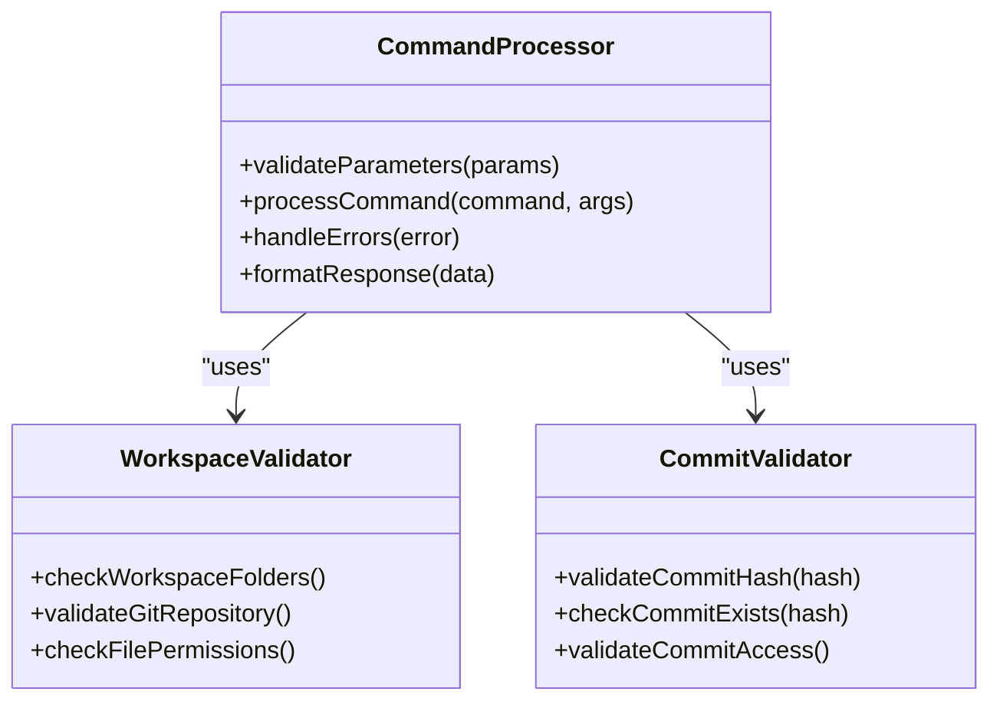

# User Command Initiation

<cite>
**Referenced Files in This Document**
- [extension.ts](file://src/extension.ts)
- [reviewManager.ts](file://src/services/review/reviewManager.ts)
- [package.json](file://package.json)
- [commitExplorer.ts](file://src/ui/components/commitExplorer.ts)
- [gitService.ts](file://src/services/git/gitService.ts)
- [reviewPanel.ts](file://src/ui/views/reviewPanel.ts)
- [constants.ts](file://src/constants/constants.ts)
</cite>

## Table of Contents
1. [Introduction](#introduction)
2. [Extension Activation Lifecycle](#extension-activation-lifecycle)
3. [Command Registration System](#command-registration-system)
4. [User Interface Components](#user-interface-components)
5. [Command Execution Flow](#command-execution-flow)
6. [Workspace Validation and Git Repository Checks](#workspace-validation-and-git-repository-checks)
7. [Common Issues and Solutions](#common-issues-and-solutions)
8. [Technical Implementation Details](#technical-implementation-details)
9. [Best Practices](#best-practices)
10. [Troubleshooting Guide](#troubleshooting-guide)

## Introduction

The CodeKarmic extension provides a comprehensive code review system for VS Code that enables developers to analyze Git commits and workspace files through a sophisticated command initiation framework. This system orchestrates user interactions between the VS Code interface and backend services, implementing robust validation mechanisms and error handling throughout the process.

The command initiation phase serves as the critical entry point for all user actions, transforming simple UI interactions into complex workflows involving Git repository analysis, AI-powered code review generation, and real-time feedback systems. Understanding this phase is essential for both users seeking to effectively utilize the extension and developers looking to extend or modify its functionality.

## Extension Activation Lifecycle

The CodeKarmic extension follows a carefully orchestrated activation lifecycle that ensures proper initialization of all components before user interaction becomes possible.

**Diagram sources**
- [extension.ts](file://src/extension.ts#L20-L66)
- [reviewManager.ts](file://src/services/review/reviewManager.ts#L80-L93)

The activation process begins when VS Code triggers the extension's activation event, which can occur through various mechanisms including explicit user commands or automatic activation based on the extension's contribution points.

**Section sources**
- [extension.ts](file://src/extension.ts#L20-L66)
- [package.json](file://package.json#L26-L34)

## Command Registration System

CodeKarmic implements a comprehensive command registration system that exposes multiple entry points for user interaction, each serving specific purposes within the code review workflow.

### Core Commands Overview

| Command | Purpose | Trigger Point | Parameters |
|---------|---------|---------------|------------|
| `codekarmic.startReview` | Initialize code review session | User action | None |
| `codekarmic.generateReport` | Generate comprehensive review report | User action | None |
| `codekarmic.selectCommit` | Select specific Git commit for review | Tree item click | commitHash: string |
| `codekarmic.reviewCode` | Perform AI code analysis | Internal/External | params: object |
| `codekarmic.configureApiKey` | Configure AI service credentials | Settings menu | None |
| `codekarmic.reviewExplorerItem` | Review files/folders from Explorer | Right-click menu | fileUri: vscode.Uri |

### Command Registration Implementation

The command registration occurs during the extension activation phase, establishing event handlers for each user interaction point:

**Diagram sources**
- [extension.ts](file://src/extension.ts#L78-L378)
- [package.json](file://package.json#L38-L116)

**Section sources**
- [extension.ts](file://src/extension.ts#L78-L378)
- [package.json](file://package.json#L38-L116)

## User Interface Components

The CodeKarmic extension provides several interconnected UI components that facilitate user interaction with the code review system.

### Tree View Components

The extension implements two primary tree view providers that serve as the main navigation interface:

#### Commit Explorer Provider
- **Purpose**: Display Git commit history with filtering capabilities
- **Features**: Real-time commit loading, error handling, date range filtering
- **Interaction**: Click commit to select, right-click for additional actions

#### File Explorer Provider  
- **Purpose**: Show changed files within the selected commit
- **Features**: Dynamic file listing, refresh capabilities, file status indicators
- **Integration**: Automatically updates when commits are selected

### Review Panel Interface

The Review Panel provides an interactive webview interface for detailed code analysis:

**Diagram sources**
- [reviewPanel.ts](file://src/ui/views/reviewPanel.ts#L5-L138)
- [reviewManager.ts](file://src/services/review/reviewManager.ts#L79-L106)
- [commitExplorer.ts](file://src/ui/components/commitExplorer.ts#L5-L30)

**Section sources**
- [reviewPanel.ts](file://src/ui/views/reviewPanel.ts#L5-L138)
- [commitExplorer.ts](file://src/ui/components/commitExplorer.ts#L5-L30)

## Command Execution Flow

Understanding the complete command execution flow reveals how user actions trigger complex workflows involving multiple system components.

### 'codekarmic.startReview' Command Flow

The start review command initiates the entire code review session by validating the workspace and initializing Git services:

**Diagram sources**
- [extension.ts](file://src/extension.ts#L102-L139)

### 'codekarmic.selectCommit' Command Flow

The commit selection process involves fetching commit information and updating the review context:

**Diagram sources**
- [reviewManager.ts](file://src/services/review/reviewManager.ts#L149-L206)
- [commitExplorer.ts](file://src/ui/components/commitExplorer.ts#L148-L152)

### 'codekarmic.generateReport' Command Flow

The report generation process combines multiple asynchronous operations to produce comprehensive code review documentation:

**Diagram sources**
- [extension.ts](file://src/extension.ts#L187-L243)
- [reviewManager.ts](file://src/services/review/reviewManager.ts#L372-L647)

**Section sources**
- [extension.ts](file://src/extension.ts#L102-L243)
- [reviewManager.ts](file://src/services/review/reviewManager.ts#L149-L647)

## Workspace Validation and Git Repository Checks

The extension implements comprehensive validation mechanisms to ensure proper workspace conditions before allowing code review operations.

### Workspace Validation Process

**Diagram sources**
- [extension.ts](file://src/extension.ts#L104-L122)
- [gitService.ts](file://src/services/git/gitService.ts#L180-L195)

### Git Service Initialization

The Git service provides robust repository validation and initialization:

| Validation Step | Purpose | Error Handling |
|----------------|---------|----------------|
| Repository Path Existence | Verify workspace exists | Throw descriptive error |
| .git Directory Presence | Confirm Git repository | Show "Not Git Repository" message |
| Git Service Initialization | Setup simple-git instance | Log detailed error information |
| Working Tree Verification | Check repository health | Return false gracefully |

**Section sources**
- [extension.ts](file://src/extension.ts#L104-L122)
- [gitService.ts](file://src/services/git/gitService.ts#L64-L107)

## Common Issues and Solutions

Understanding common issues and their solutions helps users troubleshoot problems effectively and developers implement robust error handling.

### Workspace-Related Issues

#### Problem: "No workspace folder open"
**Cause**: User attempts to start review without opening a folder in VS Code
**Solution**: Open a folder containing a Git repository through File → Open Folder
**Prevention**: Extension automatically validates workspace presence before enabling commands

#### Problem: "Not a Git repository"
**Cause**: Selected workspace lacks Git initialization
**Solution**: Initialize Git repository using `git init` or clone an existing repository
**Prevention**: Extension checks for `.git` directory during activation

### API Key Configuration Issues

#### Problem: "API key not configured"
**Cause**: AI service credentials missing or invalid
**Solution**: Use "Configure API Key" command or manually set in settings
**Prevention**: Extension prompts for API key during activation if missing

### Commit Selection Issues

#### Problem: "Commit not found"
**Cause**: Attempting to select deleted or unavailable commit
**Solution**: Refresh commit list or verify commit hash validity
**Prevention**: Extension caches commit information and validates hashes

### Performance Considerations

#### Large Repository Handling
- **Issue**: Slow commit loading in large repositories
- **Solution**: Implement pagination or lazy loading for commit history
- **Implementation**: Extension uses configurable commit limits and caching

#### Memory Management
- **Issue**: High memory usage during report generation
- **Solution**: Process files in batches and implement streaming
- **Implementation**: ReviewManager processes files in configurable batches

**Section sources**
- [extension.ts](file://src/extension.ts#L141-L183)
- [reviewManager.ts](file://src/services/review/reviewManager.ts#L149-L206)

## Technical Implementation Details

### Command Parameter Processing

The extension implements sophisticated parameter validation and processing for each command:

#### Parameter Validation Patterns

**Diagram sources**
- [extension.ts](file://src/extension.ts#L104-L122)
- [reviewManager.ts](file://src/services/review/reviewManager.ts#L149-L206)

### Error Handling Architecture

The extension implements a multi-layered error handling system:

#### Error Classification
- **Validation Errors**: Input parameter issues
- **Runtime Errors**: Execution failures
- **Network Errors**: API communication problems
- **System Errors**: Resource or permission issues

#### Error Recovery Strategies
- **Graceful Degradation**: Continue operation with reduced functionality
- **User Notification**: Clear error messages with actionable guidance
- **Logging**: Comprehensive logging for debugging
- **Retry Mechanisms**: Automatic retry for transient failures

**Section sources**
- [extension.ts](file://src/extension.ts#L135-L138)
- [reviewManager.ts](file://src/services/review/reviewManager.ts#L101-L109)

## Best Practices

### For Users

1. **Always Work in Git Repositories**: Ensure your workspace contains initialized Git repositories
2. **Configure API Keys Early**: Set up AI service credentials before first use
3. **Use Workspace Folders**: Open folders instead of individual files for full functionality
4. **Monitor Progress Indicators**: Pay attention to progress bars and status messages
5. **Regular Updates**: Keep the extension updated for latest features and bug fixes

### For Developers

1. **Implement Comprehensive Validation**: Validate all inputs at multiple layers
2. **Provide Clear Error Messages**: Use internationalized strings for user-friendly errors
3. **Handle Asynchronous Operations**: Implement proper async/await patterns
4. **Cache Frequently Accessed Data**: Improve performance through intelligent caching
5. **Maintain Backward Compatibility**: Ensure new versions work with existing configurations

### Code Quality Guidelines

- **Modular Architecture**: Separate concerns into distinct service layers
- **Error Boundaries**: Implement proper try-catch blocks around critical operations
- **Resource Management**: Properly dispose of resources and clean up on errors
- **Testing Coverage**: Implement comprehensive unit and integration tests
- **Documentation**: Maintain clear documentation for all public APIs

## Troubleshooting Guide

### Diagnostic Commands

The extension provides several diagnostic tools for troubleshooting:

#### Git Debug Functionality
- **Command**: `codekarmic.debugGit`
- **Purpose**: Display detailed Git repository information
- **Output**: Repository path, current branch, recent commits, configuration

#### Status Monitoring
- **Workspace Validation**: Check if workspace meets requirements
- **Git Repository Health**: Verify repository integrity
- **API Connectivity**: Test AI service connectivity
- **Permission Verification**: Check file system permissions

### Common Error Scenarios

#### Extension Activation Failures
1. **Check Output Panel**: Look for error messages in CodeKarmic output channel
2. **Verify Dependencies**: Ensure all required packages are installed
3. **Restart VS Code**: Sometimes clearing VS Code's state resolves activation issues
4. **Check Logs**: Review VS Code logs for extension-related errors

#### Command Execution Issues
1. **Validate Workspace**: Ensure workspace is properly configured
2. **Check API Configuration**: Verify AI service credentials
3. **Network Connectivity**: Confirm internet access for API calls
4. **File Permissions**: Ensure read/write access to workspace files

#### Performance Issues
1. **Large Files**: Consider excluding large files from review
2. **Repository Size**: Use shallow clones for large repositories
3. **Memory Usage**: Monitor memory consumption during operations
4. **Parallel Processing**: Adjust batch sizes for optimal performance

**Section sources**
- [extension.ts](file://src/extension.ts#L291-L317)
- [gitService.ts](file://src/services/git/gitService.ts#L607-L669)