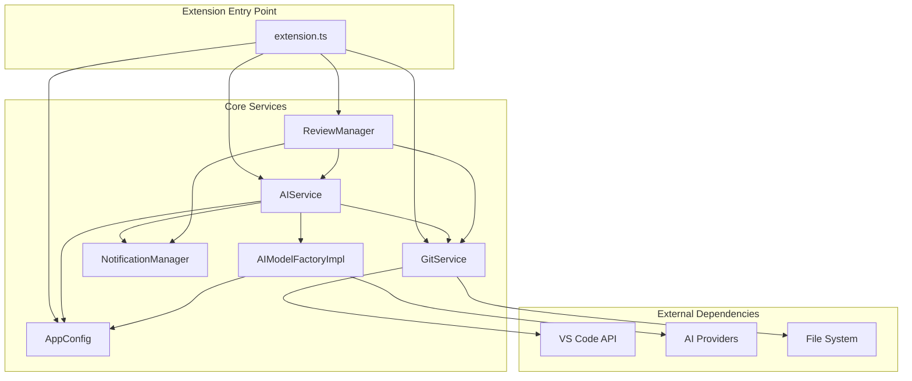
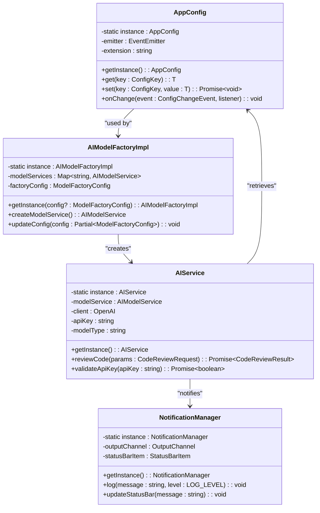
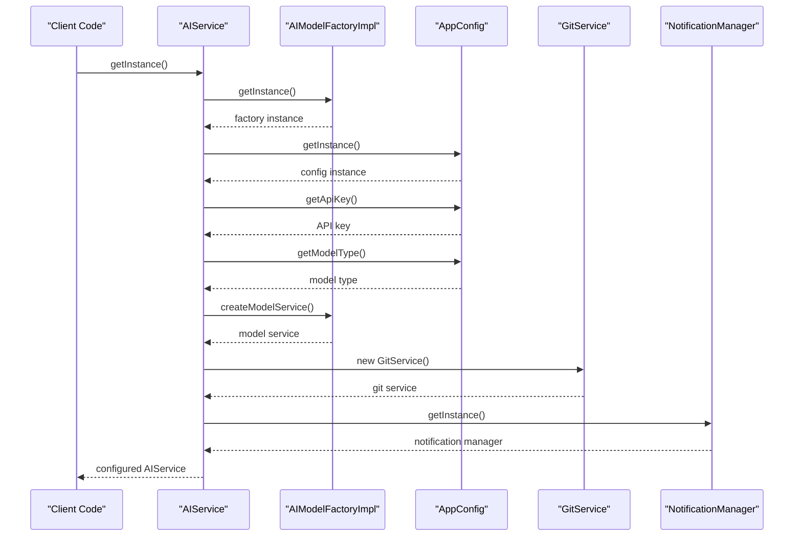
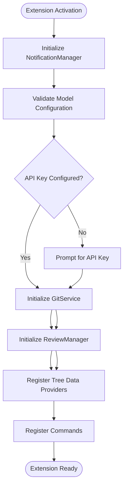

# Dependency Injection Pattern in CodeKarmic

<cite>
**Referenced Files in This Document**
- [src/services/ai/aiService.ts](file://src/services/ai/aiService.ts)
- [src/models/modelFactory.ts](file://src/models/modelFactory.ts)
- [src/config/appConfig.ts](file://src/config/appConfig.ts)
- [src/extension.ts](file://src/extension.ts)
- [src/services/git/gitService.ts](file://src/services/git/gitService.ts)
- [src/services/notification/notificationManager.ts](file://src/services/notification/notificationManager.ts)
- [src/services/review/reviewManager.ts](file://src/services/review/reviewManager.ts)
- [src/models/modelInterface.ts](file://src/models/modelInterface.ts)
- [src/models/types.ts](file://src/models/types.ts)
- [src/constants/constants.ts](file://src/constants/constants.ts)
</cite>

## Table of Contents
1. [Introduction](#introduction)
2. [Architecture Overview](#architecture-overview)
3. [Singleton Pattern Implementation](#singleton-pattern-implementation)
4. [Implicit Dependency Resolution](#implicit-dependency-resolution)
5. [Service Orchestration](#service-orchestration)
6. [Benefits in VS Code Extension Context](#benefits-in-vs-code-extension-context)
7. [Common Issues and Solutions](#common-issues-and-solutions)
8. [Performance Considerations](#performance-considerations)
9. [Testing and Maintainability](#testing-and-maintainability)
10. [Best Practices](#best-practices)

## Introduction

CodeKarmic employs a sophisticated dependency injection pattern that leverages singleton instances and implicit dependency resolution to create a loosely coupled, highly testable architecture. Unlike traditional DI frameworks, this implementation uses static getInstance methods to manage service lifecycles while maintaining loose coupling between components.

The pattern centers around three primary service categories: configuration management (AppConfig), AI model factories (AIModelFactoryImpl), and core AI services (AIService). These services are interconnected through implicit dependencies where each service retrieves its required dependencies upon construction.

## Architecture Overview

The CodeKarmic dependency injection architecture follows a hierarchical service structure with clear separation of concerns:

**Diagram sources**
- [src/extension.ts](file://src/extension.ts#L20-L80)
- [src/services/ai/aiService.ts](file://src/services/ai/aiService.ts#L40-L72)
- [src/models/modelFactory.ts](file://src/models/modelFactory.ts#L19-L44)

**Section sources**
- [src/extension.ts](file://src/extension.ts#L1-L920)
- [src/services/ai/aiService.ts](file://src/services/ai/aiService.ts#L1-L787)

## Singleton Pattern Implementation

### Static Instance Management

CodeKarmic implements a robust singleton pattern across all core services. Each service maintains a private static instance and exposes a public getInstance method for controlled access:

**Diagram sources**
- [src/config/appConfig.ts](file://src/config/appConfig.ts#L49-L88)
- [src/models/modelFactory.ts](file://src/models/modelFactory.ts#L19-L44)
- [src/services/ai/aiService.ts](file://src/services/ai/aiService.ts#L40-L72)
- [src/services/notification/notificationManager.ts](file://src/services/notification/notificationManager.ts#L8-L29)

### Lazy Initialization Strategy

Each service implements lazy initialization through the getInstance method, ensuring resources are only allocated when first accessed:

**Section sources**
- [src/config/appConfig.ts](file://src/config/appConfig.ts#L80-L88)
- [src/models/modelFactory.ts](file://src/models/modelFactory.ts#L36-L44)
- [src/services/ai/aiService.ts](file://src/services/ai/aiService.ts#L67-L72)

## Implicit Dependency Resolution

### Constructor-Based Dependency Injection

The AIService demonstrates the core implicit dependency injection pattern where dependencies are resolved during construction rather than through external configuration:

**Diagram sources**
- [src/services/ai/aiService.ts](file://src/services/ai/aiService.ts#L50-L65)
- [src/models/modelFactory.ts](file://src/models/modelFactory.ts#L58-L109)

### Dependency Resolution in Action

Examining the AIService constructor reveals the explicit dependency resolution pattern:

**Section sources**
- [src/services/ai/aiService.ts](file://src/services/ai/aiService.ts#L50-L65)

The constructor performs several critical dependency resolutions:
1. Retrieves AIModelFactoryImpl instance for model creation
2. Obtains AppConfig instance for configuration access
3. Extracts API key and model type from configuration
4. Creates AI model service instance
5. Initializes LargeFileProcessor for handling large files

This approach ensures that all dependencies are resolved in a predictable order while maintaining loose coupling between components.

## Service Orchestration

### Extension Entry Point Coordination

The extension.ts file orchestrates service initialization and provides the main entry point for the VS Code extension:

**Diagram sources**
- [src/extension.ts](file://src/extension.ts#L20-L80)

**Section sources**
- [src/extension.ts](file://src/extension.ts#L20-L80)

### Service Lifecycle Management

The extension orchestrates service lifecycles through careful initialization order:

1. **NotificationManager**: Initialized first to provide logging capabilities
2. **AppConfig**: Validates configuration and establishes event listeners
3. **GitService**: Created once and shared across components
4. **ReviewManager**: Orchestrates code review workflows
5. **Tree Data Providers**: Register with VS Code for UI integration

This ordering ensures that dependent services have their required dependencies available when they are constructed.

## Benefits in VS Code Extension Context

### Testability Advantages

The singleton-based dependency injection pattern provides significant testing benefits:

**Section sources**
- [src/services/ai/aiService.ts](file://src/services/ai/aiService.ts#L67-L72)
- [src/services/notification/notificationManager.ts](file://src/services/notification/notificationManager.ts#L24-L29)

**Test Isolation**: Each service can be tested independently since dependencies are resolved internally. Mocking becomes straightforward as all dependencies flow through the getInstance methods.

**Deterministic Behavior**: The singleton pattern ensures consistent service instances across the application, making test scenarios predictable.

### Configuration Flexibility

The AppConfig service provides dynamic configuration management with real-time updates:

**Section sources**
- [src/config/appConfig.ts](file://src/config/appConfig.ts#L57-L77)
- [src/config/appConfig.ts](file://src/config/appConfig.ts#L95-L109)

**Hot Reloading**: Configuration changes trigger immediate updates across all dependent services through event-driven notifications.

**Environment Adaptation**: The configuration system adapts to different environments (development, production) without code changes.

### Resource Management

The pattern optimizes resource usage through intelligent caching and reuse:

**Section sources**
- [src/models/modelFactory.ts](file://src/models/modelFactory.ts#L58-L109)
- [src/services/ai/aiService.ts](file://src/services/ai/aiService.ts#L48-L49)

**Model Caching**: AI model services are cached based on configuration, preventing unnecessary reinitialization.

**Shared Instances**: Services like GitService are created once and reused, reducing memory footprint and improving performance.

## Common Issues and Solutions

### Circular Dependency Problems

Circular dependencies can occur when services depend on each other in a loop. CodeKarmic avoids this through careful service design:

**Solution Strategy**: Services are organized in a clear hierarchy where higher-level services depend on lower-level services, not vice versa.

**Example Prevention**: AIService depends on AIModelFactoryImpl and AppConfig, but AIModelFactoryImpl only depends on AppConfig, avoiding circular references.

### Initialization Order Challenges

Proper initialization order is crucial for service dependencies:

**Problem**: Services may attempt to access dependencies before they are initialized.

**Solution**: The extension activation sequence ensures proper ordering:
1. NotificationManager (logging infrastructure)
2. AppConfig (configuration system)
3. GitService (external dependencies)
4. ReviewManager (orchestration)
5. UI components (final registration)

**Section sources**
- [src/extension.ts](file://src/extension.ts#L20-L80)

### Memory Leak Prevention

Singleton services must be managed carefully to prevent memory leaks:

**Solution**: Services implement proper cleanup in their constructors and maintain minimal state.

**Monitoring**: The NotificationManager tracks service lifecycle and logs potential issues.

## Performance Considerations

### Lazy Loading Patterns

CodeKarmic implements several lazy loading strategies to optimize startup performance:

**Section sources**
- [src/services/ai/aiService.ts](file://src/services/ai/aiService.ts#L67-L72)
- [src/services/review/reviewManager.ts](file://src/services/review/reviewManager.ts#L397-L399)

**Conditional Initialization**: Services are only created when explicitly requested through getInstance methods.

**Deferred Operations**: Some operations are deferred until actually needed, reducing initial load time.

### Caching Strategies

Intelligent caching reduces redundant operations:

**Model Service Caching**: AIModelFactoryImpl caches model instances based on configuration parameters.

**Configuration Caching**: AppConfig caches configuration values and only queries VS Code when necessary.

**Diff Content Caching**: AIService maintains a cache of generated diff content to avoid recomputation.

**Section sources**
- [src/models/modelFactory.ts](file://src/models/modelFactory.ts#L58-L109)
- [src/services/ai/aiService.ts](file://src/services/ai/aiService.ts#L48-L49)

### Concurrent Access Handling

The pattern handles concurrent access safely through thread-safe singleton implementations:

**Thread Safety**: Each getInstance method checks for existing instances before creation, ensuring only one instance per service type.

**State Management**: Services maintain internal state safely without external synchronization requirements.

## Testing and Maintainability

### Unit Testing Support

The dependency injection pattern facilitates comprehensive unit testing:

**Mock Integration**: Dependencies can be easily mocked by overriding getInstance methods in test environments.

**Isolated Testing**: Each service can be tested in isolation with controlled dependencies.

**Section sources**
- [src/services/ai/aiService.ts](file://src/services/ai/aiService.ts#L67-L72)

### Maintenance Benefits

The pattern provides long-term maintenance advantages:

**Single Responsibility**: Each service has a clear, focused responsibility with well-defined dependencies.

**Change Isolation**: Changes to one service's dependencies don't affect other services.

**Documentation Clarity**: The getInstance pattern makes dependency relationships explicit and self-documenting.

### Debugging and Monitoring

The pattern supports comprehensive debugging capabilities:

**Logging Integration**: All services integrate with the NotificationManager for consistent logging.

**Health Monitoring**: Services can monitor their own health and report issues through standardized channels.

**Section sources**
- [src/services/notification/notificationManager.ts](file://src/services/notification/notificationManager.ts#L79-L121)

## Best Practices

### Service Design Principles

Based on CodeKarmic's implementation, several best practices emerge:

**Single Responsibility**: Each service should have one clear purpose with well-defined dependencies.

**Loose Coupling**: Services should depend on abstractions (interfaces) rather than concrete implementations.

**Hierarchical Organization**: Services should be organized in a clear dependency hierarchy.

### Configuration Management

**Centralized Configuration**: Use a dedicated configuration service like AppConfig for all settings.

**Type Safety**: Leverage TypeScript interfaces to ensure configuration integrity.

**Validation**: Implement validation logic to catch configuration errors early.

### Error Handling

**Graceful Degradation**: Services should handle missing dependencies gracefully.

**Clear Error Messages**: Provide meaningful error messages that help diagnose issues.

**Logging Integration**: All services should log appropriately through the NotificationManager.

### Performance Optimization

**Lazy Initialization**: Defer expensive operations until they are actually needed.

**Intelligent Caching**: Cache results based on stable keys to avoid redundant computations.

**Resource Cleanup**: Implement proper cleanup in service constructors to prevent memory leaks.

The CodeKarmic dependency injection pattern demonstrates how a well-designed singleton-based approach can provide the benefits of dependency injection while maintaining simplicity and performance in a VS Code extension context. Through careful service orchestration, implicit dependency resolution, and thoughtful design patterns, the system achieves loose coupling, high testability, and excellent maintainability.